# Workflow

1.  Prepare Environment

2.  Prepare Data

3.  Disease Map

4.  Point Pattern Analysis

    4.1 Density based

    4.2 Distance based

# 1. Prepare Environment

Required packages


``` r
# install.packages("sf")
# install.packages("tidyverse") #data wrangling
# install.packages("here") #working directory
# install.packages("janitor")
# install.packages("gtsummary")
# install.packages("DT")
# install.packages("stringr")
# install.packages("readxl")
# install.packages("broom")
# install.packages("mapview")
# install.packages("lubridate")
# install.packages("vctrs")
# install.packages("spatialECO") #for NNI
# install.packages("webshot2") #screenshot webpage 
```

Load packages


``` r
library(sf)
```

```
## Linking to GEOS 3.9.3, GDAL 3.5.2, PROJ 8.2.1; sf_use_s2() is TRUE
```

``` r
library(tidyverse)
```

```
## ── Attaching core tidyverse packages ──────────────────────── tidyverse 2.0.0 ──
## ✔ dplyr     1.1.4     ✔ readr     2.1.5
## ✔ forcats   1.0.0     ✔ stringr   1.5.1
## ✔ ggplot2   3.5.1     ✔ tibble    3.2.1
## ✔ lubridate 1.9.3     ✔ tidyr     1.3.1
## ✔ purrr     1.0.2
```

```
## ── Conflicts ────────────────────────────────────────── tidyverse_conflicts() ──
## ✖ purrr::%||%()   masks base::%||%()
## ✖ dplyr::filter() masks stats::filter()
## ✖ dplyr::lag()    masks stats::lag()
## ℹ Use the conflicted package (<http://conflicted.r-lib.org/>) to force all conflicts to become errors
```

``` r
library(here)
```

```
## here() starts at C:/Users/MY PC/OneDrive - Universiti Sains Malaysia/JKNK Spatial R course/spatial_workshop/drhazlienor.github.io
```

``` r
library(janitor)
```

```
## 
## Attaching package: 'janitor'
## 
## The following objects are masked from 'package:stats':
## 
##     chisq.test, fisher.test
```

``` r
library(gtsummary)
library(DT)
library(stringr)
library(readxl)
library(broom)
library(tmap)
```

```
## Breaking News: tmap 3.x is retiring. Please test v4, e.g. with
## remotes::install_github('r-tmap/tmap')
```

``` r
library(mapview)
library(lubridate)
library(maptools)
```

```
## Loading required package: sp
```

```
## Warning: multiple methods tables found for 'elide'
```

```
## Checking rgeos availability: TRUE
## Please note that 'maptools' will be retired during 2023,
## plan transition at your earliest convenience;
## some functionality will be moved to 'sp'.
## 
## Attaching package: 'maptools'
## 
## The following objects are masked from 'package:sp':
## 
##     elide, sp2Mondrian
```

``` r
library(spatstat)
```

```
## Loading required package: spatstat.data
## Loading required package: spatstat.univar
## spatstat.univar 3.0-0
## Loading required package: spatstat.geom
## spatstat.geom 3.3-2
## Loading required package: spatstat.random
## spatstat.random 3.3-1
## Loading required package: spatstat.explore
## Loading required package: nlme
## 
## Attaching package: 'nlme'
## 
## The following object is masked from 'package:dplyr':
## 
##     collapse
## 
## spatstat.explore 3.3-1
## Loading required package: spatstat.model
## Loading required package: rpart
## spatstat.model 3.3-1
## Loading required package: spatstat.linnet
## spatstat.linnet 3.2-1
## 
## spatstat 3.1-1 
## For an introduction to spatstat, type 'beginner'
```

``` r
library(spdep)
```

```
## Loading required package: spData
## To access larger datasets in this package, install the spDataLarge
## package with: `install.packages('spDataLarge',
## repos='https://nowosad.github.io/drat/', type='source')`
```

``` r
library(gridExtra)
```

```
## 
## Attaching package: 'gridExtra'
## 
## The following object is masked from 'package:dplyr':
## 
##     combine
```

``` r
library(sparr)
```

```
## 
## 
## Welcome to
##    _____ ___  ____  ____  ____         
##   / ___// _ \/ _  \/ __ \/ __ \        
##   \__ \/ ___/ __  /  ___/  ___/        
##  ___/ / /  / / / / /\ \/ /\ \          
## /____/_/  /_/ /_/_/  \__/  \_\   v2.3-15
## 
## - type news(package="sparr") for an overview
## - type help("sparr") for documentation
## - type citation("sparr") for how to cite
```

``` r
library(grid)
```

```
## 
## Attaching package: 'grid'
## 
## The following object is masked from 'package:spatstat.geom':
## 
##     as.mask
```

``` r
library(spatialEco)
```

```
## 
## Attaching package: 'spatialEco'
## 
## The following object is masked from 'package:gridExtra':
## 
##     combine
## 
## The following objects are masked from 'package:spatstat.geom':
## 
##     is.empty, quadrats, shift
## 
## The following object is masked from 'package:spatstat.data':
## 
##     ants
## 
## The following object is masked from 'package:dplyr':
## 
##     combine
```

``` r
library(plotly)
```

```
## 
## Attaching package: 'plotly'
## 
## The following object is masked from 'package:ggplot2':
## 
##     last_plot
## 
## The following object is masked from 'package:stats':
## 
##     filter
## 
## The following object is masked from 'package:graphics':
## 
##     layout
```

``` r
library(gapminder)
library(webshot2)
```

# 2. Prepare Data

-   Types of data: **polygon data, population data, point data**

-   Import Data: Load spatial and attribute data (e.g., shapefiles, CSVs) into R using functions like read.csv(), sf::st_read() for vector data, or raster::raster() for raster data.

-   Clean Data: Handle missing values, correct data formats, and ensure the spatial data is properly projected using sf::st_transform() to standardize coordinate reference systems (CRS).

-   Explore Data: Use basic summaries (summary(), head()) and visual checks (plot(), View()) to understand data structure.

## Polygon data

read polygon data - kelantan map


``` r
kel_map <- st_read(here("Map",
                    "kelantan.shp"))
```

```
## Reading layer `kelantan' from data source 
##   `C:\Users\MY PC\OneDrive - Universiti Sains Malaysia\JKNK Spatial R course\spatial_workshop\drhazlienor.github.io\Map\kelantan.shp' 
##   using driver `ESRI Shapefile'
## Simple feature collection with 66 features and 6 fields
## Geometry type: POLYGON
## Dimension:     XY
## Bounding box:  xmin: 371629.6 ymin: 503028.2 xmax: 519479.6 ymax: 690232.8
## Projected CRS: Kertau (RSO) / RSO Malaya (m)
```

**st_geometry()** extracts the geometric part (coordinates) of an sf object, allowing you to view or manipulate the spatial features


``` r
st_geometry(kel_map)
```

```
## Geometry set for 66 features 
## Geometry type: POLYGON
## Dimension:     XY
## Bounding box:  xmin: 371629.6 ymin: 503028.2 xmax: 519479.6 ymax: 690232.8
## Projected CRS: Kertau (RSO) / RSO Malaya (m)
## First 5 geometries:
```

```
## POLYGON ((485501.8 669698.8, 485717.3 669694.6,...
```

```
## POLYGON ((487716.5 665649.5, 487615.4 665445.1,...
```

```
## POLYGON ((482744.8 660223.4, 482823.6 660137.8,...
```

```
## POLYGON ((486936.9 677358.5, 486990.5 677333.7,...
```

```
## POLYGON ((490841.7 668783.4, 490906.1 668691, 4...
```

## Population data

read population data per subdistrict/mukim per year. You can get the population data from DOSM.


``` r
kel_mukim <- read_xlsx(here ("pop_kel.xlsx"))
kel_mukim %>% datatable()
```

```{=html}
<div class="datatables html-widget html-fill-item" id="htmlwidget-8cdc2b6718cd1a0f1189" style="width:100%;height:auto;"></div>
<script type="application/json" data-for="htmlwidget-8cdc2b6718cd1a0f1189">{"x":{"filter":"none","vertical":false,"data":[["1","2","3","4","5","6","7","8","9","10","11","12","13","14","15","16","17","18","19","20","21","22","23","24","25","26","27","28","29","30","31","32","33","34","35","36","37","38","39","40","41","42","43","44","45","46","47","48","49","50","51","52","53","54","55","56","57","58","59","60","61","62","63","64","65","66","67","68","69","70","71","72","73","74","75","76","77","78","79","80","81","82","83","84","85","86","87","88","89","90","91","92","93","94","95","96","97","98","99","100","101","102","103","104","105","106","107","108","109","110","111","112","113","114","115","116","117","118","119","120","121","122","123","124","125","126","127","128","129","130","131","132","133","134","135","136","137","138","139","140","141","142","143","144","145","146","147","148","149","150","151","152","153","154","155","156","157","158","159","160","161","162","163","164","165","166","167","168","169","170","171","172","173","174","175","176","177","178","179","180","181","182","183","184","185","186","187","188","189","190","191"],["BEKLAM","GUNONG (GUNONG TIMOR)","MAHLIGAI","PERUPOK","MELAWI (REPEK)","TAWANG (MENTUAN)","TELONG","TANJONG PAUH","BADANG","BANGGU","BETA","KADOK","KEMUMIN","KOTA","LIMBAT","KUBANG KERIAN (LUNDANG)","KETEREH (PANGKAL KALONG)","PANJI","PENDEK","PERINGAT","SALOR","SERING","KOTA BHARU","LABOK","PANYIT","PULAI CHONDONG","PANGKAL MELERET","TEMANGAN","ULU SAT","ALOR PASIR","BUNUT SUSU","CHETOK","GUAL PERIOK","KANGKONG","KUALA LEMAL","KUBANG GADONG","KUBANG SEPAT","PASIR MAS","RANTAU PANJANG","PADANG PAK AMAT","BUKIT ABAL","BUKIT AWANG","BUKIT JAWA","GONG DATOK","JERAM","LIMBONGAN","SEMERAK","KUSIAL","JEDOK","ULU KUSIAL","JAL BESAR","KEBAKAT","PENGKALAN KUBOR","SUNGAI PINANG","TERBOK","TUMPAT","WAKAF BHARU","GALAS","BERTAM","CHIKU","BATU MENGKEBANG","OLAK JERAM","DABONG","BATU MELINTANG (BELIMBING)","JELI","KUALA BALAH",null,null,null,null,null,null,null,null,null,null,null,null,null,null,null,null,null,null,null,null,null,null,null,null,null,null,null,null,null,null,null,null,null,null,null,null,null,null,null,null,null,null,null,null,null,null,null,null,null,null,null,null,null,null,null,null,null,null,null,null,null,null,null,null,null,null,null,null,null,null,null,null,null,null,null,null,null,null,null,null,null,null,null,null,null,null,null,null,null,null,null,null,null,null,null,null,null,null,null,null,null,null,null,null,null,null,null,null,null,null,null,null,null,null,null,null,null,null,null,null,null,null,"Nota:","1. Unjuran Penduduk (Semakan Semula) berasaskan data Banci Penduduk dan Perumahan Malaysia 2010","2. Hasil tambah mungkin berbeza kerana pembundaran"],[11800,27100,11000,21100,23100,35400,17200,12500,45000,29800,14100,24200,53100,29800,24100,71400,52800,93100,21100,30000,13900,31200,51700,18100,12600,15400,15400,7000,42900,12600,21200,17400,27800,21600,15700,30000,19200,27200,34500,21000,13200,8800,28300,11300,11900,17400,28400,73800,32300,40200,16200,21800,26400,21000,21200,28600,48500,47800,31700,32000,80900,34700,17000,10600,26300,12900,null,null,null,null,null,null,null,null,null,null,null,null,null,null,null,null,null,null,null,null,null,null,null,null,null,null,null,null,null,null,null,null,null,null,null,null,null,null,null,null,null,null,null,null,null,null,null,null,null,null,null,null,null,null,null,null,null,null,null,null,null,null,null,null,null,null,null,null,null,null,null,null,null,null,null,null,null,null,null,null,null,null,null,null,null,null,null,null,null,null,null,null,null,null,null,null,null,null,null,null,null,null,null,null,null,null,null,null,null,null,null,null,null,null,null,null,null,null,null,null,null,null,null,null,null],[11800,27100,11000,21100,23100,35400,17200,12500,45000,29800,14100,24200,53100,29800,24100,71400,52800,93100,21100,30000,13900,31200,51700,18100,12600,15400,15400,7000,42900,12600,21200,17400,27800,21600,15700,30000,19200,27200,34500,21000,13200,8800,28300,11300,11900,17400,28400,73800,32300,40200,16200,21800,26400,21000,21200,28600,48500,47800,31700,32000,80900,34700,17000,10600,26300,12900,null,null,null,null,null,null,null,null,null,null,null,null,null,null,null,null,null,null,null,null,null,null,null,null,null,null,null,null,null,null,null,null,null,null,null,null,null,null,null,null,null,null,null,null,null,null,null,null,null,null,null,null,null,null,null,null,null,null,null,null,null,null,null,null,null,null,null,null,null,null,null,null,null,null,null,null,null,null,null,null,null,null,null,null,null,null,null,null,null,null,null,null,null,null,null,null,null,null,null,null,null,null,null,null,null,null,null,null,null,null,null,null,null,null,null,null,null,null,null,null,null,null,null,null,null],[12000,27500,11100,21400,23700,36200,17800,12800,45900,30500,14400,24600,54400,30300,24700,72800,53900,95100,21400,30600,14200,31900,52200,18400,12800,15700,15700,7100,44000,12800,21700,17700,28700,22000,16000,30600,19600,27600,35200,21500,13400,8900,29000,11500,12200,17700,28900,75500,32700,41000,16400,22300,26800,21300,21500,29200,49700,48800,32700,32500,82500,35400,17400,10800,26900,13100,null,null,null,null,null,null,null,null,null,null,null,null,null,null,null,null,null,null,null,null,null,null,null,null,null,null,null,null,null,null,null,null,null,null,null,null,null,null,null,null,null,null,null,null,null,null,null,null,null,null,null,null,null,null,null,null,null,null,null,null,null,null,null,null,null,null,null,null,null,null,null,null,null,null,null,null,null,null,null,null,null,null,null,null,null,null,null,null,null,null,null,null,null,null,null,null,null,null,null,null,null,null,null,null,null,null,null,null,null,null,null,null,null,null,null,null,null,null,null,null,null,null,null,null,null],[12200,28000,11300,21700,24200,37000,18400,13000,46800,31300,14700,25000,55600,30900,25200,74200,55000,97200,21800,31200,14400,32700,52600,18800,12900,15900,16100,7200,45000,13000,22100,18100,29500,22400,16300,31100,19900,28100,36000,22100,13600,9000,29700,11700,12400,18000,29400,77200,33100,41800,16700,22700,27200,21700,21900,29800,50900,49800,33600,32900,84100,36000,17700,11000,27500,13300,null,null,null,null,null,null,null,null,null,null,null,null,null,null,null,null,null,null,null,null,null,null,null,null,null,null,null,null,null,null,null,null,null,null,null,null,null,null,null,null,null,null,null,null,null,null,null,null,null,null,null,null,null,null,null,null,null,null,null,null,null,null,null,null,null,null,null,null,null,null,null,null,null,null,null,null,null,null,null,null,null,null,null,null,null,null,null,null,null,null,null,null,null,null,null,null,null,null,null,null,null,null,null,null,null,null,null,null,null,null,null,null,null,null,null,null,null,null,null,null,null,null,null,null,null],[12400,28400,11400,22000,24800,37800,19000,13300,47800,32000,15000,25500,56900,31400,25800,75600,56200,99300,22100,31700,14700,33400,53100,19200,13100,16100,16400,7300,46100,13200,22500,18400,30400,22800,16700,31600,20300,28500,36700,22600,13900,9100,30300,11900,12700,18300,30000,79000,33500,42600,16900,23200,27700,22000,22300,30400,52200,50800,34600,33300,85700,36700,18100,11200,28200,13600,null,null,null,null,null,null,null,null,null,null,null,null,null,null,null,null,null,null,null,null,null,null,null,null,null,null,null,null,null,null,null,null,null,null,null,null,null,null,null,null,null,null,null,null,null,null,null,null,null,null,null,null,null,null,null,null,null,null,null,null,null,null,null,null,null,null,null,null,null,null,null,null,null,null,null,null,null,null,null,null,null,null,null,null,null,null,null,null,null,null,null,null,null,null,null,null,null,null,null,null,null,null,null,null,null,null,null,null,null,null,null,null,null,null,null,null,null,null,null,null,null,null,null,null,null],[12400,28400,11400,22000,24800,37800,19000,13300,47800,32000,15000,25500,56900,31400,25800,75600,56200,99300,22100,31700,14700,33400,53100,19200,13100,16100,16400,7300,46100,13200,22500,18400,30400,22800,16700,31600,20300,28500,36700,22600,13900,9100,30300,11900,12700,18300,30000,79000,33500,42600,16900,23200,27700,22000,22300,30400,52200,50800,34600,33300,85700,36700,18100,11200,28200,13600,null,null,null,null,null,null,null,null,null,null,null,null,null,null,null,null,null,null,null,null,null,null,null,null,null,null,null,null,null,null,null,null,null,null,null,null,null,null,null,null,null,null,null,null,null,null,null,null,null,null,null,null,null,null,null,null,null,null,null,null,null,null,null,null,null,null,null,null,null,null,null,null,null,null,null,null,null,null,null,null,null,null,null,null,null,null,null,null,null,null,null,null,null,null,null,null,null,null,null,null,null,null,null,null,null,null,null,null,null,null,null,null,null,null,null,null,null,null,null,null,null,null,null,null,null],[12400,28400,11400,22000,24800,37800,19000,13300,47800,32000,15000,25500,56900,31400,25800,75600,56200,99300,22100,31700,14700,33400,53100,19200,13100,16100,16400,7300,46100,13200,22500,18400,30400,22800,16700,31600,20300,28500,36700,22600,13900,9100,30300,11900,12700,18300,30000,79000,33500,42600,16900,23200,27700,22000,22300,30400,52200,50800,34600,33300,85700,36700,18100,11200,28200,13600,null,null,null,null,null,null,null,null,null,null,null,null,null,null,null,null,null,null,null,null,null,null,null,null,null,null,null,null,null,null,null,null,null,null,null,null,null,null,null,null,null,null,null,null,null,null,null,null,null,null,null,null,null,null,null,null,null,null,null,null,null,null,null,null,null,null,null,null,null,null,null,null,null,null,null,null,null,null,null,null,null,null,null,null,null,null,null,null,null,null,null,null,null,null,null,null,null,null,null,null,null,null,null,null,null,null,null,null,null,null,null,null,null,null,null,null,null,null,null,null,null,null,null,null,null]],"container":"<table class=\"display\">\n  <thead>\n    <tr>\n      <th> <\/th>\n      <th>subdistrict<\/th>\n      <th>2016<\/th>\n      <th>2017<\/th>\n      <th>2018<\/th>\n      <th>2019<\/th>\n      <th>2020<\/th>\n      <th>2021<\/th>\n      <th>2022<\/th>\n    <\/tr>\n  <\/thead>\n<\/table>","options":{"columnDefs":[{"className":"dt-right","targets":[2,3,4,5,6,7,8]},{"orderable":false,"targets":0},{"name":" ","targets":0},{"name":"subdistrict","targets":1},{"name":"2016","targets":2},{"name":"2017","targets":3},{"name":"2018","targets":4},{"name":"2019","targets":5},{"name":"2020","targets":6},{"name":"2021","targets":7},{"name":"2022","targets":8}],"order":[],"autoWidth":false,"orderClasses":false}},"evals":[],"jsHooks":[]}</script>
```

## Point data

read linelisting cointaining point data in .xlsx format


``` r
kel_lepto <- read_xlsx("leptospirosis.xlsx") %>% clean_names()
glimpse(kel_lepto)
```

```
## Rows: 1,106
## Columns: 26
## $ diagnosis                                  <chr> "Leptospirosis", "Leptospir…
## $ notifikasi_no                              <dbl> 2685725, 2728504, 2739963, …
## $ tahun_daftar                               <dbl> 2016, 2016, 2016, 2016, 201…
## $ epid_daftar                                <dbl> 6, 9, 11, 12, 18, 18, 19, 1…
## $ age                                        <dbl> 30, 23, 39, 43, 31, 34, 48,…
## $ alamat_semasa_kejadian                     <chr> "FELDA ARING", "LADANG U&I …
## $ poskod                                     <dbl> 18300, 18300, 18300, 18300,…
## $ latitude_rso                               <dbl> 478031, 459494, 441802, 488…
## $ longitude_rso                              <dbl> 548141, 564966, 547551, 547…
## $ latitude_wgs                               <dbl> 4.944824, 5.034372, 4.89743…
## $ longitude_wgs                              <dbl> 102.3491, 102.1477, 101.960…
## $ notifikasi_status                          <chr> "Daftar Kes", "Daftar Kes",…
## $ race                                       <chr> "Foreigner", "Foreigner", "…
## $ kewarganegaraan                            <chr> "Bukan Warganegara", "Bukan…
## $ gender                                     <chr> "Male", "Male", "Male", "Ma…
## $ nationality                                <chr> "INDONESIA", "INDONESIA", "…
## $ klasifikasi_kes                            <chr> "Sporadic", "Sporadic", "Sp…
## $ cara_pengesanan_kes                        <chr> "Pasif", "Pasif", "Pasif", …
## $ jenis_rawatan                              <chr> "Wad Perubatan", "Jabatan K…
## $ daerah                                     <chr> "GUA MUSANG", "GUA MUSANG",…
## $ mukim                                      <chr> "CHIKU", "CHIKU", "GALAS", …
## $ lokaliti                                   <chr> NA, "LADANG U & I, CIKU", "…
## $ diagnosis2                                 <chr> "LEPTOSPIROSIS", "LEPTOSPIR…
## $ sub_diagnosis                              <lgl> NA, NA, NA, NA, NA, NA, NA,…
## $ negeri                                     <chr> "KELANTAN", "KELANTAN", "KE…
## $ jenis_import_jangkitan_dalam_negara_negeri <chr> NA, NA, NA, NA, NA, NA, NA,…
```

convert all character to factor (categorical) to allow better understanding of the data


``` r
kel_lepto <- kel_lepto %>%
  mutate(across(where(is.character), as.factor))
```

explore the data


``` r
summary(kel_lepto)
```

```
##          diagnosis    notifikasi_no      tahun_daftar   epid_daftar   
##  Leptospirosis:1106   Min.   :2662339   Min.   :2016   Min.   : 1.00  
##                       1st Qu.:3005967   1st Qu.:2016   1st Qu.:14.00  
##                       Median :3510632   Median :2018   Median :28.00  
##                       Mean   :4701261   Mean   :2018   Mean   :27.57  
##                       3rd Qu.:5042478   3rd Qu.:2020   3rd Qu.:42.00  
##                       Max.   :9573673   Max.   :2022   Max.   :53.00  
##                                                                       
##       age                alamat_semasa_kejadian     poskod     
##  Min.   : 0.42   KG MUKA BUKIT      :   3       Min.   :11510  
##  1st Qu.:15.25   KG PANGLIMA BAYU   :   3       1st Qu.:16800  
##  Median :27.00   RPT SG PAS         :   3       Median :18000  
##  Mean   :30.95   FELCRA TERATAK BATU:   2       Mean   :17543  
##  3rd Qu.:45.00   FELDA ARING        :   2       3rd Qu.:18300  
##  Max.   :95.00   KAMPUNG BENDANG    :   2       Max.   :40200  
##                  (Other)            :1091       NA's   :151    
##   latitude_rso    longitude_rso     latitude_wgs   longitude_wgs  
##  Min.   :     6   Min.   : 63494   Min.   :4.611   Min.   :101.4  
##  1st Qu.:450171   1st Qu.:601283   1st Qu.:5.374   1st Qu.:102.1  
##  Median :464957   Median :638018   Median :5.764   Median :102.2  
##  Mean   :459729   Mean   :627313   Mean   :5.651   Mean   :102.1  
##  3rd Qu.:472980   3rd Qu.:665421   3rd Qu.:6.013   3rd Qu.:102.3  
##  Max.   :502469   Max.   :688574   Max.   :6.230   Max.   :102.5  
##  NA's   :736      NA's   :737                                     
##        notifikasi_status         race               kewarganegaraan
##  Abai Notifikasi:   5    Aborigines:  27   Bukan Warganegara:  45  
##  Daftar Kes     :1101    Chinese   :   9   Warganegara      :1061  
##                          Foreigner :  45                           
##                          Indian    :   5                           
##                          Malay     :1016                           
##                          Others    :   4                           
##                                                                    
##     gender        nationality   klasifikasi_kes cara_pengesanan_kes
##  Female:367   MALAYSIA  :1061   Outbreak:   5   Aktif:   6         
##  Male  :739   INDONESIA :  17   Sporadic:1101   Pasif:1100         
##               MYANMAR   :   9                                      
##               THAILAND  :   7                                      
##               BANGLADESH:   6                                      
##               INDIA     :   3                                      
##               (Other)   :   3                                      
##                         jenis_rawatan         daerah                mukim    
##  ICU                           : 58   GUA MUSANG :220   BATU MENGKEBANG: 89  
##  Jabatan Kecemasan & Kemalangan:385   KUALA KRAI :173   BERTAM         : 89  
##  Jabatan Pesakit Luar          :117   MACHANG    :143   GALAS          : 79  
##  Lain-lain                     : 23   PASIR MAS  :130   OLAK JERAM     : 67  
##  Wad Kanak-kanak               :122   KOTA BHARU :121   ULU SAT        : 62  
##  Wad Perubatan                 :401   TANAH MERAH: 99   CHIKU          : 52  
##                                       (Other)    :220   (Other)        :668  
##         lokaliti            diagnosis2   sub_diagnosis       negeri    
##  LATA REK   :   7   LEPTOSPIROSIS:1106   Mode:logical   KELANTAN:1106  
##  PERIA      :   7                        NA's:1106                     
##  TANAH PUTIH:   7                                                      
##  RPT SG PAS :   6                                                      
##  BATU BALAI :   5                                                      
##  (Other)    :1004                                                      
##  NA's       :  70                                                      
##  jenis_import_jangkitan_dalam_negara_negeri
##  KELANTAN:   3                             
##  NA's    :1103                             
##                                            
##                                            
##                                            
##                                            
## 
```

identify observation with missing coordinates. you can update the missing coordinates in the same linelisting and re-run the command


``` r
# Identify rows with missing coordinate data
no_coordinates <- kel_lepto %>%
  filter(is.na(latitude_wgs) | is.na(longitude_wgs))

# Print rows with no coordinates
print(no_coordinates)
```

```
## # A tibble: 0 × 26
## # ℹ 26 variables: diagnosis <fct>, notifikasi_no <dbl>, tahun_daftar <dbl>,
## #   epid_daftar <dbl>, age <dbl>, alamat_semasa_kejadian <fct>, poskod <dbl>,
## #   latitude_rso <dbl>, longitude_rso <dbl>, latitude_wgs <dbl>,
## #   longitude_wgs <dbl>, notifikasi_status <fct>, race <fct>,
## #   kewarganegaraan <fct>, gender <fct>, nationality <fct>,
## #   klasifikasi_kes <fct>, cara_pengesanan_kes <fct>, jenis_rawatan <fct>,
## #   daerah <fct>, mukim <fct>, lokaliti <fct>, diagnosis2 <fct>, …
```

or, you can proceed with the analysis by removing the observation with no coordinates


``` r
kel_lepto2 <- kel_lepto %>% # save to different name to avoid losing the data
  filter(!is.na(latitude_wgs),
         !is.na(longitude_wgs))
glimpse(kel_lepto2)
```

```
## Rows: 1,106
## Columns: 26
## $ diagnosis                                  <fct> Leptospirosis, Leptospirosi…
## $ notifikasi_no                              <dbl> 2685725, 2728504, 2739963, …
## $ tahun_daftar                               <dbl> 2016, 2016, 2016, 2016, 201…
## $ epid_daftar                                <dbl> 6, 9, 11, 12, 18, 18, 19, 1…
## $ age                                        <dbl> 30, 23, 39, 43, 31, 34, 48,…
## $ alamat_semasa_kejadian                     <fct> "FELDA ARING", "LADANG U&I …
## $ poskod                                     <dbl> 18300, 18300, 18300, 18300,…
## $ latitude_rso                               <dbl> 478031, 459494, 441802, 488…
## $ longitude_rso                              <dbl> 548141, 564966, 547551, 547…
## $ latitude_wgs                               <dbl> 4.944824, 5.034372, 4.89743…
## $ longitude_wgs                              <dbl> 102.3491, 102.1477, 101.960…
## $ notifikasi_status                          <fct> Daftar Kes, Daftar Kes, Daf…
## $ race                                       <fct> Foreigner, Foreigner, Forei…
## $ kewarganegaraan                            <fct> Bukan Warganegara, Bukan Wa…
## $ gender                                     <fct> Male, Male, Male, Male, Mal…
## $ nationality                                <fct> INDONESIA, INDONESIA, INDON…
## $ klasifikasi_kes                            <fct> Sporadic, Sporadic, Sporadi…
## $ cara_pengesanan_kes                        <fct> Pasif, Pasif, Pasif, Pasif,…
## $ jenis_rawatan                              <fct> Wad Perubatan, Jabatan Kece…
## $ daerah                                     <fct> GUA MUSANG, GUA MUSANG, GUA…
## $ mukim                                      <fct> CHIKU, CHIKU, GALAS, CHIKU,…
## $ lokaliti                                   <fct> NA, "LADANG U & I, CIKU", "…
## $ diagnosis2                                 <fct> LEPTOSPIROSIS, LEPTOSPIROSI…
## $ sub_diagnosis                              <lgl> NA, NA, NA, NA, NA, NA, NA,…
## $ negeri                                     <fct> KELANTAN, KELANTAN, KELANTA…
## $ jenis_import_jangkitan_dalam_negara_negeri <fct> NA, NA, NA, NA, NA, NA, NA,…
```

## Merge data

### Merge population data to polygon

We want to match the two data based on MUKIM. Ensure the column containing the mukim is named the same for both data.

Use **str()** to look at the structure of the data.


``` r
str(kel_map)
```

```
## Classes 'sf' and 'data.frame':	66 obs. of  7 variables:
##  $ NEGERI    : chr  "KELANTAN" "KELANTAN" "KELANTAN" "KELANTAN" ...
##  $ DAERAH    : chr  "BACHOK" "BACHOK" "BACHOK" "BACHOK" ...
##  $ MUKIM     : chr  "BEKLAM" "GUNONG (GUNONG TIMOR)" "MAHLIGAI" "PERUPOK" ...
##  $ LELAKI    : int  4859 11100 4564 8777 9227 14140 5863 4929 18064 11645 ...
##  $ PEREMPUAN : num  4813 10884 4600 8614 8672 ...
##  $ JUM_JANTIN: num  9672 21984 9164 17391 17899 ...
##  $ geometry  :sfc_POLYGON of length 66; first list element: List of 1
##   ..$ : num [1:238, 1:2] 485502 485717 485966 486066 486068 ...
##   ..- attr(*, "class")= chr [1:3] "XY" "POLYGON" "sfg"
##  - attr(*, "sf_column")= chr "geometry"
##  - attr(*, "agr")= Factor w/ 3 levels "constant","aggregate",..: NA NA NA NA NA NA
##   ..- attr(*, "names")= chr [1:6] "NEGERI" "DAERAH" "MUKIM" "LELAKI" ...
```

in 'kel_map' polygon data, the column name is 'MUKIM'


``` r
str(kel_mukim)
```

```
## tibble [191 × 8] (S3: tbl_df/tbl/data.frame)
##  $ subdistrict: chr [1:191] "BEKLAM" "GUNONG (GUNONG TIMOR)" "MAHLIGAI" "PERUPOK" ...
##  $ 2016       : num [1:191] 11800 27100 11000 21100 23100 35400 17200 12500 45000 29800 ...
##  $ 2017       : num [1:191] 11800 27100 11000 21100 23100 35400 17200 12500 45000 29800 ...
##  $ 2018       : num [1:191] 12000 27500 11100 21400 23700 36200 17800 12800 45900 30500 ...
##  $ 2019       : num [1:191] 12200 28000 11300 21700 24200 37000 18400 13000 46800 31300 ...
##  $ 2020       : num [1:191] 12400 28400 11400 22000 24800 37800 19000 13300 47800 32000 ...
##  $ 2021       : num [1:191] 12400 28400 11400 22000 24800 37800 19000 13300 47800 32000 ...
##  $ 2022       : num [1:191] 12400 28400 11400 22000 24800 37800 19000 13300 47800 32000 ...
```

in 'kel_mukim' population data, the column name is 'subdistrict'. We will rename the 'subdistrict' variable to 'MUKIM'.


``` r
kel_mukim <- kel_mukim %>%
  rename(MUKIM = subdistrict)
```


``` r
str(kel_lepto2)
```

```
## tibble [1,106 × 26] (S3: tbl_df/tbl/data.frame)
##  $ diagnosis                                 : Factor w/ 1 level "Leptospirosis": 1 1 1 1 1 1 1 1 1 1 ...
##  $ notifikasi_no                             : num [1:1106] 2685725 2728504 2739963 2754040 2811959 ...
##  $ tahun_daftar                              : num [1:1106] 2016 2016 2016 2016 2016 ...
##  $ epid_daftar                               : num [1:1106] 6 9 11 12 18 18 19 17 21 23 ...
##  $ age                                       : num [1:1106] 30 23 39 43 31 34 48 55 48 39 ...
##  $ alamat_semasa_kejadian                    : Factor w/ 1073 levels "110, KESEDAR RENOK BARU",..: 108 689 1053 111 676 690 677 220 130 682 ...
##  $ poskod                                    : num [1:1106] 18300 18300 18300 18300 18300 ...
##  $ latitude_rso                              : num [1:1106] 478031 459494 441802 488502 496760 ...
##  $ longitude_rso                             : num [1:1106] 548141 564966 547551 547701 539072 ...
##  $ latitude_wgs                              : num [1:1106] 4.94 5.03 4.9 4.95 4.94 ...
##  $ longitude_wgs                             : num [1:1106] 102 102 102 102 102 ...
##  $ notifikasi_status                         : Factor w/ 2 levels "Abai Notifikasi",..: 2 2 2 2 2 2 2 2 2 2 ...
##  $ race                                      : Factor w/ 6 levels "Aborigines","Chinese",..: 3 3 3 3 3 3 3 3 3 3 ...
##  $ kewarganegaraan                           : Factor w/ 2 levels "Bukan Warganegara",..: 1 1 1 1 1 1 1 1 1 1 ...
##  $ gender                                    : Factor w/ 2 levels "Female","Male": 2 2 2 2 2 2 2 1 2 1 ...
##  $ nationality                               : Factor w/ 8 levels "BANGLADESH","CAMBODIA",..: 4 4 4 4 3 3 3 8 4 6 ...
##  $ klasifikasi_kes                           : Factor w/ 2 levels "Outbreak","Sporadic": 2 2 2 2 2 2 2 2 2 2 ...
##  $ cara_pengesanan_kes                       : Factor w/ 2 levels "Aktif","Pasif": 2 2 2 2 2 2 2 2 2 2 ...
##  $ jenis_rawatan                             : Factor w/ 6 levels "ICU","Jabatan Kecemasan & Kemalangan",..: 6 2 6 6 6 6 6 6 6 6 ...
##  $ daerah                                    : Factor w/ 10 levels "BACHOK","GUA MUSANG",..: 2 2 2 2 2 2 2 10 2 2 ...
##  $ mukim                                     : Factor w/ 65 levels "ALOR PASIR","BADANG",..: 14 14 16 14 14 7 7 48 14 7 ...
##  $ lokaliti                                  : Factor w/ 710 levels "AIR BOL","AIR DERAS",..: NA 421 616 170 NA NA NA 667 323 NA ...
##  $ diagnosis2                                : Factor w/ 1 level "LEPTOSPIROSIS": 1 1 1 1 1 1 1 1 1 1 ...
##  $ sub_diagnosis                             : logi [1:1106] NA NA NA NA NA NA ...
##  $ negeri                                    : Factor w/ 1 level "KELANTAN": 1 1 1 1 1 1 1 1 1 1 ...
##  $ jenis_import_jangkitan_dalam_negara_negeri: Factor w/ 1 level "KELANTAN": NA NA NA NA NA NA NA NA NA NA ...
```

in 'kel_lepto2' population data, the column name is 'mukim'. We will rename the 'mukim' variable to 'MUKIM'.


``` r
kel_lepto2 <- kel_lepto2 %>%
  rename(MUKIM = mukim)
```

merge population data to polygon


``` r
kel <- merge(kel_map,kel_mukim, by.x="MUKIM", by.y="MUKIM", all.x=T, sort=F)
dim(kel)
```

```
## [1] 66 14
```

``` r
class(kel)
```

```
## [1] "sf"         "data.frame"
```

``` r
st_crs(kel)
```

```
## Coordinate Reference System:
##   User input: Kertau (RSO) / RSO Malaya (m) 
##   wkt:
## PROJCRS["Kertau (RSO) / RSO Malaya (m)",
##     BASEGEOGCRS["Kertau (RSO)",
##         DATUM["Kertau (RSO)",
##             ELLIPSOID["Everest 1830 (RSO 1969)",6377295.664,300.8017,
##                 LENGTHUNIT["metre",1]]],
##         PRIMEM["Greenwich",0,
##             ANGLEUNIT["degree",0.0174532925199433]],
##         ID["EPSG",4751]],
##     CONVERSION["Rectified Skew Orthomorphic Malaya Grid (metres)",
##         METHOD["Hotine Oblique Mercator (variant A)",
##             ID["EPSG",9812]],
##         PARAMETER["Latitude of projection centre",4,
##             ANGLEUNIT["degree",0.0174532925199433],
##             ID["EPSG",8811]],
##         PARAMETER["Longitude of projection centre",102.25,
##             ANGLEUNIT["degree",0.0174532925199433],
##             ID["EPSG",8812]],
##         PARAMETER["Azimuth of initial line",323.0257905,
##             ANGLEUNIT["degree",0.0174532925199433],
##             ID["EPSG",8813]],
##         PARAMETER["Angle from Rectified to Skew Grid",323.130102361111,
##             ANGLEUNIT["degree",0.0174532925199433],
##             ID["EPSG",8814]],
##         PARAMETER["Scale factor on initial line",0.99984,
##             SCALEUNIT["unity",1],
##             ID["EPSG",8815]],
##         PARAMETER["False easting",804670.24,
##             LENGTHUNIT["metre",1],
##             ID["EPSG",8806]],
##         PARAMETER["False northing",0,
##             LENGTHUNIT["metre",1],
##             ID["EPSG",8807]]],
##     CS[Cartesian,2],
##         AXIS["(E)",east,
##             ORDER[1],
##             LENGTHUNIT["metre",1]],
##         AXIS["(N)",north,
##             ORDER[2],
##             LENGTHUNIT["metre",1]],
##     USAGE[
##         SCOPE["Engineering survey, topographic mapping."],
##         AREA["Malaysia - West Malaysia onshore."],
##         BBOX[1.21,99.59,6.72,104.6]],
##     ID["EPSG",3168]]
```

## Check CRS

convert all point data to geometry (sf object). for WGS84, the CRS code is 4326.


``` r
lepto_wgs <- st_as_sf(kel_lepto2, 
                    coords = c("longitude_wgs", "latitude_wgs"), 
                    crs = 4326)
```

confirm CRS is WGS 84


``` r
st_crs(lepto_wgs)
```

```
## Coordinate Reference System:
##   User input: EPSG:4326 
##   wkt:
## GEOGCRS["WGS 84",
##     ENSEMBLE["World Geodetic System 1984 ensemble",
##         MEMBER["World Geodetic System 1984 (Transit)"],
##         MEMBER["World Geodetic System 1984 (G730)"],
##         MEMBER["World Geodetic System 1984 (G873)"],
##         MEMBER["World Geodetic System 1984 (G1150)"],
##         MEMBER["World Geodetic System 1984 (G1674)"],
##         MEMBER["World Geodetic System 1984 (G1762)"],
##         MEMBER["World Geodetic System 1984 (G2139)"],
##         ELLIPSOID["WGS 84",6378137,298.257223563,
##             LENGTHUNIT["metre",1]],
##         ENSEMBLEACCURACY[2.0]],
##     PRIMEM["Greenwich",0,
##         ANGLEUNIT["degree",0.0174532925199433]],
##     CS[ellipsoidal,2],
##         AXIS["geodetic latitude (Lat)",north,
##             ORDER[1],
##             ANGLEUNIT["degree",0.0174532925199433]],
##         AXIS["geodetic longitude (Lon)",east,
##             ORDER[2],
##             ANGLEUNIT["degree",0.0174532925199433]],
##     USAGE[
##         SCOPE["Horizontal component of 3D system."],
##         AREA["World."],
##         BBOX[-90,-180,90,180]],
##     ID["EPSG",4326]]
```

covert CRS to RSO (because the CRS for polygon map is in RSO-code 3168)


``` r
lepto_rso <- st_transform(lepto_wgs, 3168)
```

## Check for outliers

plot the map to look for outliers


``` r
ggplot() +
  geom_sf(data = lepto_rso) +
  theme_bw()
```

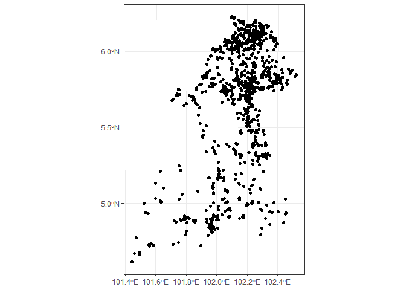<!-- -->

if there are outliers, recheck the coordinates, update in the same linelisting and re-run the codes from beginning. or, you can proceed with analysis by excluding points outside the map's boundaries.

select point only in Kelantan


``` r
lepto<- lepto_rso %>% 
  mutate(within_kel_map = lengths(st_within(lepto_rso, kel_map)))
lepto <- lepto %>% 
  filter(within_kel_map == 1)
glimpse(lepto)
```

```
## Rows: 1,106
## Columns: 26
## $ diagnosis                                  <fct> Leptospirosis, Leptospirosi…
## $ notifikasi_no                              <dbl> 2685725, 2728504, 2739963, …
## $ tahun_daftar                               <dbl> 2016, 2016, 2016, 2016, 201…
## $ epid_daftar                                <dbl> 6, 9, 11, 12, 18, 18, 19, 1…
## $ age                                        <dbl> 30, 23, 39, 43, 31, 34, 48,…
## $ alamat_semasa_kejadian                     <fct> "FELDA ARING", "LADANG U&I …
## $ poskod                                     <dbl> 18300, 18300, 18300, 18300,…
## $ latitude_rso                               <dbl> 478031, 459494, 441802, 488…
## $ longitude_rso                              <dbl> 548141, 564966, 547551, 547…
## $ notifikasi_status                          <fct> Daftar Kes, Daftar Kes, Daf…
## $ race                                       <fct> Foreigner, Foreigner, Forei…
## $ kewarganegaraan                            <fct> Bukan Warganegara, Bukan Wa…
## $ gender                                     <fct> Male, Male, Male, Male, Mal…
## $ nationality                                <fct> INDONESIA, INDONESIA, INDON…
## $ klasifikasi_kes                            <fct> Sporadic, Sporadic, Sporadi…
## $ cara_pengesanan_kes                        <fct> Pasif, Pasif, Pasif, Pasif,…
## $ jenis_rawatan                              <fct> Wad Perubatan, Jabatan Kece…
## $ daerah                                     <fct> GUA MUSANG, GUA MUSANG, GUA…
## $ MUKIM                                      <fct> CHIKU, CHIKU, GALAS, CHIKU,…
## $ lokaliti                                   <fct> NA, "LADANG U & I, CIKU", "…
## $ diagnosis2                                 <fct> LEPTOSPIROSIS, LEPTOSPIROSI…
## $ sub_diagnosis                              <lgl> NA, NA, NA, NA, NA, NA, NA,…
## $ negeri                                     <fct> KELANTAN, KELANTAN, KELANTA…
## $ jenis_import_jangkitan_dalam_negara_negeri <fct> NA, NA, NA, NA, NA, NA, NA,…
## $ geometry                                   <POINT [m]> POINT (484205.4 54689…
## $ within_kel_map                             <int> 1, 1, 1, 1, 1, 1, 1, 1, 1, …
```

# 3. Disease Map

Map all the points on the Kelantan polygon map


``` r
ggplot() +
  geom_sf(data = kel_map) +
  geom_sf(data = lepto) +
    theme_bw() 
```

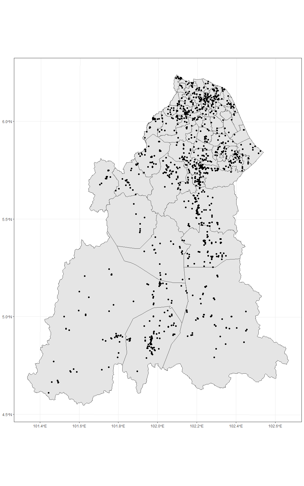<!-- -->

alternatively, you can plot the points on open street view map


``` r
library(leaflet)
library(ggmap)
```

```
## ℹ Google's Terms of Service: <https://mapsplatform.google.com>
##   Stadia Maps' Terms of Service: <https://stadiamaps.com/terms-of-service/>
##   OpenStreetMap's Tile Usage Policy: <https://operations.osmfoundation.org/policies/tiles/>
## ℹ Please cite ggmap if you use it! Use `citation("ggmap")` for details.
## 
## Attaching package: 'ggmap'
## 
## 
## The following object is masked from 'package:plotly':
## 
##     wind
```

``` r
leaflet(data = lepto_wgs) %>%
  addTiles() %>%  # Add default OpenStreetMap map tiles
  addCircleMarkers(color = "red", radius = 1, fillOpacity = 0.7)
```

```{=html}
<div class="leaflet html-widget html-fill-item" id="htmlwidget-273089154ef4eb5b379e" style="width:672px;height:480px;"></div>
<script type="application/json" data-for="htmlwidget-273089154ef4eb5b379e">{"x":{"options":{"crs":{"crsClass":"L.CRS.EPSG3857","code":null,"proj4def":null,"projectedBounds":null,"options":{}}},"calls":[{"method":"addTiles","args":["https://{s}.tile.openstreetmap.org/{z}/{x}/{y}.png",null,null,{"minZoom":0,"maxZoom":18,"tileSize":256,"subdomains":"abc","errorTileUrl":"","tms":false,"noWrap":false,"zoomOffset":0,"zoomReverse":false,"opacity":1,"zIndex":1,"detectRetina":false,"attribution":"&copy; <a href=\"https://openstreetmap.org/copyright/\">OpenStreetMap<\/a>,  <a href=\"https://opendatacommons.org/licenses/odbl/\">ODbL<\/a>"}]},{"method":"addCircleMarkers","args":[[4.9448239,5.03437159538737,4.897434,4.94554005624249,4.93648645604837,5.1310735392225,5.21592933954462,6.230156,4.9903351,4.6741205,4.8836887,5.82804155151015,5.8154493,5.4819554,4.9448239,4.8844919,5.768814,4.956553,6.113624,4.95299,4.79419,5.09103,6.09458,4.90056,4.74236,5.297638,5.606388,4.84374,5.7326,4.930734,4.610976,4.661937,5.02934,4.849625,4.843679,5.54037,4.837154,4.808436,4.87662,4.8847926,5.81408,5.111863,4.877933,5.555117,4.670516,5.84374,6.19821,5.76737,5.8987,5.76454,6.01765,6.05897,5.53694632913607,6.17769,6.17232078366957,6.10865974233176,6.19973799129259,6.1342896,5.97781036463393,5.69154142517155,5.8959488,5.6823578,4.89552265420435,6.0205931,5.827746,5.82663177784084,5.860203,5.30117152320169,5.46820387889263,5.78560815371972,5.526261,5.3359741371049,6.17725507362175,6.1098549,5.93392282748244,5.921994,5.8959311,6.0965782,5.12910261382677,4.8418489,6.12268395824927,5.7087981,5.6238446,6.164076,5.8058196284622,5.8620431,6.0741435,4.87899982414997,6.22394036531472,6.20587215626745,5.6909871,6.1746222,5.19351449584099,5.779328,5.76863703409614,5.8072095,4.7175265,4.8144853,5.744011,5.767933,5.83828241672135,4.884279,4.9036287,4.917851,5.003443,5.8021242,6.019022010106,6.0270891,6.016793,6.0185536,5.780537,4.9448239,5.84401898648112,5.3879944,6.1609997,6.0494448,5.75528,4.88672169147186,5.76364,5.760115,6.199069,6.087531,5.171304,6.01262616615633,5.3111664,5.75144202512875,5.718995,4.85015360540825,6.168366,5.46395559737484,5.7637116,6.0115876,6.0175363,6.0244205,6.0556646,6.02971,6.0577537,5.8233478,5.76092725666232,5.7363256,5.621996,6.082788,6.07336305843061,4.9017438,4.884279,4.89148949475754,4.8621161,6.05437066735999,6.144541,6.044591,6.042412,4.88276197266048,5.9550081,5.00799745852042,5.74748250411502,6.00048265584852,5.02458785705839,5.530813,4.86034632719303,5.798498,5.73896457580654,5.7065083,6.1664619,5.661571,6.0403711,5.8277015,6.1859688220611,6.10313798743526,5.3111664,5.8382722,6.1077183,5.5520021,6.02971,5.06382498702784,4.9035593,5.674303,6.01321,5.7704843,5.5600441,5.09803124081922,4.7898243,6.220513,5.64182320629479,5.15736732108022,6.183521,6.2235267,6.119312,6.120698,6.042412,4.9014049,5.627727,5.8058892,5.85334306406772,5.64095452797708,5.40047,5.3912245,6.22303147611298,6.016793,5.610414,5.508463,6.1408747,6.0507755,4.8923681,5.735743,5.4842631,6.0741688697908,6.2229214,5.1288889,6.0392106779975,6.10744979727838,5.0290289,6.119312,5.761165,6.016273,6.01352176778189,5.761616,6.083141,5.9188474,5.958883,4.985095,5.24450414104218,5.171304,6.0177047861399,5.7493194,5.419986,5.8733782,5.00058846043268,6.0544765,5.7808694,5.862401,5.8501673,5.65592972569454,5.9869843,6.0385276,5.6665005,5.751575,5.76364,4.98147310829223,4.90575839069377,5.37335025777329,5.3689283,5.093164,6.0610568,6.05867374038052,5.7774373,5.9169372,5.89771,6.0416008,6.063505,6.0490387,5.835058,5.7993952,4.9136649,5.259586312,5.662394,4.9136649,5.767933,6.0472872,4.9136649,4.9136649,5.925514,5.8249705,5.78802072766311,5.419986,5.530813,5.83315459240683,5.4092974,5.5479569,5.730959,6.1375407,5.376864,6.0002431,5.818349,5.300381,5.4092974,5.4818754,5.96769575529124,6.06555850621915,5.8363409,5.87331242174276,5.76647394364139,5.3231028,5.48019209698072,5.96968830542728,5.761165,5.79446019881732,5.7902353,6.0127418,5.69047704854446,5.4375348,5.3111664,5.7909,6.016793,5.7632518,6.123938,5.47039,5.7631889,6.1379572,6.05090807506181,5.5339237,5.4777841,5.7837379,5.6942125,5.6886852,5.38317952,6.1352295,6.08621358576914,5.675496,5.69093133169964,5.88202544340064,5.306287,5.32645876,4.8653854,5.3231028,6.04394583765058,5.7701613,5.2724183943637,5.862333,5.7492106,5.7779911,5.592484,5.759561,5.7567087,5.759561,6.220513,6.1209623,5.8432244,5.814897,5.81186,5.7182687,6.1030854,5.845081,4.8404675,5.774944,5.91114247694707,6.168942,5.113423,6.02612329747485,6.1308681,5.9119109,6.05124645653642,5.7681828,5.969763,6.1352295,5.7116268,5.6904294,6.0567934,6.02971,6.0779717,5.6212516,5.5927826,5.573825,5.7779911,5.8563607,4.955217,5.858928,5.7065083,5.750186,6.181148892813,5.65935368395246,5.419986,5.419986,5.7675238,5.90614413268548,5.8277015,5.75685984508496,5.9909731,5.7779911,5.8014553,5.85215330775157,6.1629923,5.7614698,5.530813,6.1640081,5.354138,6.1240883,5.947946,6.199069,6.119312,6.1146205,5.573825,5.8041195,5.7965734,5.38131,5.818652,6.1498993,6.124785,6.138785,6.020314,5.16,6.08978,5.36,5.7385,5.32,5.79206,5.810819,6.10504,5.75121,6.12055,5.73742,5.22,6.22544,6.10485,5.811471,5.87553,6.137231,5.9555,5.7497,4.99093,5.17315,5.987593,5.815085,5.93273,5.966033,5.76698,5.74579,5.79333,5.00459,5.07038,5.8216,5.47493,5.0611,5.76035,5.75624,5.74046,5.465649,4.87238,6.188905,5.16638,6.0763,4.87829,6.1082,5.76324,5.77572,5.77155,5.778539,5.79447,4.88447,5.9263,6.072017,5.12016,5.900433,5.75152,6.014167,5.70427,5.74037,5.72879,5.82222,5.324204,5.44059,4.95365,6.21974,5.892943,4.81572,5.9957,5.67683,5.9593,5.755717,5.69133,6.128,5.85013,6.0763,5.7194,5.77264,4.90937,6.1846,6.0377,6.0536,5.81488,5.46556,5.71524,5.33716,5.75987,6.0131,5.195361,5.20862,5.79365,6.102,6.1659,5.97055,5.84945,6.15438,5.6985,5.82564,5.79935,5.78283,5.89879,5.123688,6.070634,5.192563,5.391052,5.955,6.11951,5.8192,6.17457,5.71101,5.70615,6.1066087989916,5.71392,5.87174,6.00621,6.22918,5.81678,6.15848,5.77166,4.83616,5.86278,5.47643,5.393227,5.79752,6.14077,5.261984,5.91828,5.86867,5.71582,6.0496,5.89001,6.091054,5.79893,6.103625,5.00359,5.225385,6.1159,5.64595,6.06327,5.29523,5.918132,6.0638,6.05739,6.15382,5.656196,4.86231,6.03769,6.19185,5.82823,5.82304,5.714,6.05937,6.21963,6.22243,6.03647,5.07154,5.83424,5.17089,6.19558,5.84942,5.75627,6.16008,5.890225,6.12542,6.04045,5.86144,5.36633,5.836573,6.002381,6.1254,6.098882,5.79499,6.143336,5.897577,5.725569,6.128344,5.296041,5.853637,5.17029,5.77832,5.71264,6.0520837,6.03499,5.485777,6.03195,6.037811,5.619146,5.923513,5.309365,5.908054,6.196944,6.098039,6.07806,6.13249,5.411835,5.649426,5.00945,5.313668,4.90166,5.03209439022593,5.70366,5.484152,5.01307,5.1685,6.05499,6.0106329,6.0719758,5.69406,5.30939,5.94907,5.839666,5.392319,6.107172,6.11785,6.11656,6.17339,4.95912,5.837561,6.053423,6.05838,5.00751,5.482153,4.92616,4.86017,5.3921,4.89864,6.01482,4.66621401847023,4.86506,5.769293,4.97881,4.92629,5.69156,5.309852,6.024286,5.778538,5.313772,5.606559,5.9433,6.09052,6.114745,5.78947,5.02267,4.88092,4.9119,5.70133,6.119189,5.71781,6.101526,5.01297,6.12656,6.02338,5.97938,5.838107,5.847851,4.81248,5.75054,5.344112,4.938721,5.77957,4.8837,6.06976,6.106346,4.809074,6.01093,4.894883,4.88092,5.308644,5.76093,5.032836,5.469756,6.138226,5.885058,5.94118,5.83573,5.558366,5.67651,5.513392,6.11201,5.540322,5.768012,5.85894,4.836717,4.83284307782975,5.955308,4.7319,5.61051,5.00846238108149,6.057293,6.06975,5.38124,5.76122,5.796229,5.836578,6.172298,5.880889,5.941764,5.7675,5.56928,5.966446,6.09660216436166,5.300178,6.131657,5.096336,6.02002,5.831314,5.48368,4.91435,4.890473,5.76083,6.04822,5.581349,5.1331,5.867549,5.84634,5.900388,5.946055,5.002595,5.929703,5.76114,6.033646,5.68698,6.11338,5.70218,5.738881,6.096357,5.961576,6.22097,6.144067,5.760761,6.17372,5.544668,5.959472,5.580576,6.04969,5.75678,5.799102,6.119052,6.19481,5.762417,5.506664,5.212788,5.68705,5.74213,5.912667,6.10812,5.80093,5.16868,5.84311,5.393059,6.054732,5.897502,4.94955,4.945169,5.68426,5.879122,5.838271,5.847085,5.77497,6.088023,5.52587,5.822711,5.858278,5.453223,5.602335,5.857706,6.144288,4.72102,5.00243,5.168918,5.9242066,5.763875,4.906768,6.090036,5.972839,5.376107,5.816119,6.090675,6.1088905,4.858829,5.571604,5.523835,6.095762,6.085195,5.560765,6.159948,6.078272,5.540888,5.75727,5.714294,5.872603,6.069736,5.80689,5.802007,4.77021938558945,5.893264,5.79109,6.013478,5.752736,4.900998,6.1304389,5.593873,4.938378,6.092841,5.859319,4.66317,5.000266,5.954787,6.093351,6.040734,5.789686,5.381664,5.68121,5.590613,5.765004,4.889763,5.74942,5.816878,6.229427,5.705863,6.0081952,5.6783,6.0820322,5.659744,5.874935,5.75998,4.722175,5.77506,5.346391,5.833954,5.71694,5.76765,6.079231,4.922829,5.81141,4.900453,5.78029,5.772848,6.149087,5.812262,6.22107,5.847854,5.791781,5.791455,5.996966,5.278043,5.07241,5.7496,5.74727,5.737669,5.864422,5.808776,5.860491,5.899589,6.107165,5.75874,5.47719,6.132447,6.12843,6.100633,5.965251,6.13871,5.76342,5.68582,4.91177329,5.6963,5.76647,6.1142433,5.728353,5.40817,5.4503,5.71196736,5.88577535399678,5.737923,5.530337,5.695739,6.0712323,4.894081,5.31128,5.972888,5.77273,6.125618,6.0873889,5.761665,5.71976,5.31408,5.71448,6.0795996,6.0128922,6.170703,4.884825,5.012019,5.73521,5.104223,5.162159,5.388681,5.5600441,5.506508,5.82459,5.768983,5.85402,5.74057,6.124986,6.06838,5.765132,5.58977,4.842003,6.19889,5.271652,6.1589462,5.521913,6.01955,6.016844,5.213036,4.94979,5.379153,5.382108,4.897896,5.546686,5.432923,5.8292428,6.012544,5.835373,5.843978,5.65197,6.0851331,6.090268,5.466782,6.1289966,6.039928,5.9587718,5.387497,5.8257,6.099778,4.896234,6.145103,4.845458,6.194441,5.255896,5.530539,5.21604,5.100176,5.7425357,6.121811,5.317828,6.1088958,5.918227,6.0483742,5.155299,5.079133,4.915317,5.814903,5.80675,4.862877,5.743305,5.207469,5.76072,5.78382,5.573204,5.068465,5.549477,5.2727,5.73889,5.83194,5.032352,5.09657,4.871557,5.71493,5.684174,4.918859,5.379239,5.174243,4.907532,4.82909,5.083151,5.758734,5.097688,6.010088,5.334908,5.859295,5.39987,5.82318,4.891166,6.198336,6.0413352,4.895514,4.819917,6.205542,5.328246,5.331501,4.961065,5.80534,5.308952,4.729586,6.009439,5.400405,4.792933,5.82029,5.73575,4.941424,5.81485,5.178197,5.73856,6.166504,5.82973,4.861568,4.841341,6.084668,5.833217,5.952137,5.377564,5.539152,5.283473,4.889956,5.158099,5.8292428,5.47188,4.905341,5.67772,4.931846,6.0308088,5.77206,6.030322,6.019165,5.2138,5.7209,6.069184,5.784324,5.002312,5.48307,6.15914356680194,5.8489,5.87895,5.562088,5.73874,5.611601,5.69729,6.0648474,5.003769,5.38165,5.002923,5.78001,6.0888155,5.392792,5.7834,5.481953,4.888843,5.111863,5.003371,6.1589462,5.154143,5.330602,4.953335,5.716855,4.898311,6.184168,5.68815,4.718451,6.055463,5.399223,5.72491,6.182827,5.675073,5.013496,6.0682601,6.1220272,5.79350414238855,5.549336,6.017124,5.74504,5.469171,5.749189,5.089198,5.708394,4.877698,6.0241108,6.0635108,4.89094591786589,6.0575795,5.68695,5.218077,6.10511,4.931471,4.83986,5.612602,5.63284,5.68714,4.967739,5.85582,5.3364101,5.78595,5.381356,5.116494,4.904346,4.871785,5.87159,5.67273,6.020641,5.323654,6.115884,5.333839,5.649678,5.579148,6.143436,5.382028,5.56181,4.826803,5.80067,5.69654627,5.327412,5.70246,5.146079,6.125544,5.77386,6.1659508,5.509594,4.990508,4.99450286431566,5.76946,6.114071],[102.3491281,102.147720556885,101.9604614,102.349787923435,102.45449151307,101.978933191161,101.762824994532,102.0974159,102.3276245,101.4893892,101.8440431,102.300609542858,102.0402654,102.2635254,102.3491281,101.9674848,101.949059,102.069187,102.308833,101.93139,102.28827,102.28926,102.13557,102.31888,101.7496,102.274768,102.205168,101.98023,102.06725,102.44951,101.444169,101.491354,102.449036,101.956115,101.966788,102.19835,102.297965,101.972675,101.73351249,101.9667769,102.12918,102.17694,101.935751,102.173915,101.490254,102.30057,102.15667,102.2374,102.24917,102.23344,102.14367,102.07926,102.202656683318,102.23339,102.294712899625,102.275097291477,102.176532704254,102.2910475,102.226938963723,102.212906040638,102.249251,102.0716851,101.93500493922,102.1872605,102.204274,102.225402066862,102.2285812,102.152589603117,102.2522301891,102.460057269546,101.8880438,102.255290123241,102.174566044544,102.2351277,102.39024361335,102.18604,102.332202,102.1769861,101.598743523241,101.9473979,102.241921303863,101.7317637,102.1801666,102.1936759,102.237445233275,102.3477815,102.2828132,101.966316877999,102.117176775927,102.25436631335,102.1882159,102.2101145,102.014426382452,102.2163564,102.216978994054,102.2270085,101.55644,101.9703407,102.212791,102.2153872,102.159124016837,101.968178,101.8084592,102.007288,102.270536,102.2290328,102.132543800645,102.1425474,101.982515,101.9725466,102.0833939,102.3491281,102.301488665712,102.2337213,102.2190328,102.1492221,102.15542,101.852844749072,102.2210801,102.099569,102.169372,102.2382968,102.0084901,102.107224297797,102.2995004,102.061671290877,102.1897951,101.949090954636,102.2536271,102.160245160026,102.2277594,101.9783814,102.1772665,102.0921043,102.0959264,102.0975491,102.0961215,102.2351803,102.196022249123,102.1984103,102.2007409,102.0988959,102.196553024142,102.1513099,101.968178,101.996754899073,102.3463875,102.095487233806,102.151301,102.13893,102.142782,101.718909733276,102.1958803,101.631936234886,102.05934344789,102.135992426331,102.149252006747,102.2018512,101.963918794122,102.2547592,102.252209498307,101.81758,102.2075924,101.857824,102.0494343,102.2319048,102.110256771418,102.163792469825,102.2995004,101.9136112,102.137666,102.1988346,102.0975491,101.977984025781,101.8073773,102.213612,102.1117871,101.9704487,102.2090224,101.97496068444,101.9429046,102.1118731,102.23721093457,102.005617825356,102.116948,102.0900293,102.221451,102.286134,102.142782,101.786201,101.8854619,102.1878484,102.376753379308,102.223698326494,102.31754,102.2345952,102.116842866205,101.982515,102.188742,102.194573,102.1963813,102.1555067,101.9709754,102.025577,102.3019641,102.226228860199,102.1040057,101.59825,102.143362523435,102.216877888149,101.7514041,102.221451,102.306523,102.0995729,101.977734306235,102.2899882,102.1173491,102.2391098,101.9988654,102.1945097,101.750502933518,102.0084901,102.02079768569,102.2920953,102.250683,102.3136691,101.521402310014,102.1280716,101.8864221,102.2385738,102.3328366,102.101120406235,102.0997512,102.1420324,102.033995,102.300786,102.2210801,102.011689856916,101.811537326987,102.079206516759,102.2345684,102.216753,102.0603143,102.200302544912,102.2239606,101.9316546,102.0045532,102.2268999,102.1332481,102.060403,101.9012749,102.4163897,101.9941662,102.2347699,102.2126231,101.9941662,102.2153872,102.1451221,101.9941662,101.9941662,102.3116191,102.3493308,102.375909358344,102.250683,102.2018512,102.388642628998,102.2511452,102.2656863,101.9017609,102.3074932,102.009802,102.0223212,101.962989,102.1528249,102.2511452,102.2203598,101.956290759689,102.224189091752,102.3212159,101.951194890784,102.224099809944,102.2990558,102.234243687239,102.145131197797,102.306523,102.392827520212,102.384404,101.9718956,101.845560007672,102.2511915,102.2995004,101.959554,101.982515,102.049322,102.2728201,102.2256731,102.2258299,102.2115287,102.177709763334,102.1995449,102.2090224,102.20656,102.197583,101.8434838,102.2948735,102.2678165,102.371113404579,101.8545491,102.227928511288,102.424328430877,102.2759539,102.3349551,101.9612702,102.2990558,102.145913115014,102.2208744,102.185786136298,102.2046491,101.7450651,102.0421369,102.1980571,102.190572,102.3376502,102.190572,102.1118731,102.156889,102.3290862,102.460608,102.1311365,101.7399298,102.2564407,102.4053998,101.9484919,102.3680549,102.15633260193,102.3004572,101.972703,102.120365767709,102.2433151,102.2374118,102.156393921673,102.2186295,102.143774,102.2678165,102.1734123,102.151007,102.1559451,102.0975491,102.0532974,102.1834426,102.1332326,102.2618689,102.0421369,102.4832045,102.008878,102.16525,101.81758,101.744395,102.119335165252,102.211926814163,102.250683,102.250683,101.9710841,102.304983687873,102.2319048,102.226050873748,102.0399859,102.0421369,102.3702949,102.227955650365,102.2077568,102.2289813,102.2018512,102.2846742,102.112159,102.1935712,102.0056918,102.169372,102.221451,102.2671968,102.2618689,102.2436337,102.3709608,102.3190588,102.3933881,102.1396205,102.2543825,102.1447554,102.2861441,102.12,102.2786,102.11,101.92712,102.16,102.21358,102.412741,102.10829,102.27745,102.11848,102.24343,102.04,102.11392,102.21141,102.46299,102.23332,102.251897,102.03288,101.86137,102.20509,102.02619,102.236926,102.39682,102.16961,102.299852,102.09487,102.0761,101.97049,101.97729,101.97865,101.96751,102.30448,101.77375,102.24373,102.30574,102.24635,102.261793,101.96436,102.277042,101.95128,102.2319,101.85759,102.17056,102.25764,102.20898,102.22266,102.145213,102.27127,101.85797,102.244,102.197991,102.23117,102.23887,102.3027,102.241725,102.20152,102.2463,102.05817,102.12212,102.150406,101.90794,102.29559,102.11153,102.329711,101.80018,102.2718,102.21582,102.4367,102.338625,102.15165,102.29,102.52308,102.374,102.05455,102.17441,102.17622,102.2832,102.244,102.2736,102.39565,102.26386,102.15231,102.123103,102.22701,102.1846,102.15912,101.62702,102.41625,102.254,102.3296,101.95966,102.01351,102.15757,101.83386,102.25273,102.02544,101.89559,102.19574,102.14802,102.079267,102.12536,102.132932,102.2582,102.20923,101.96801,102.23304,102.18897,102.21038,102.282457926985,102.21193,102.34006,102.09692,102.09909,102.12149,102.33,102.3461,101.97241,102.12865,101.90911,102.124329,102.2657,102.24091,102.15316,102.10174,102.48302,102.15187,102.17624,102.34473,102.230437,102.02374,102.23949,102.05962,102.011332,102.248271,101.78346,102.21416,102.27444,102.169657,102.2106,102.19936,102.29669,101.79908,101.96382,102.06365,102.14922,102.4317,102.40356,102.15167,102.13768,102.11229,102.09143,102.13834,102.06927,102.43008,102.01037,102.17493,102.39187,102.19401,102.2996,102.322619,102.253231,102.283285,102.12937,101.97222,102.397604,101.987224,102.297278,102.295038,102.18517,102.254119,102.002427,102.048048,102.255142,102.326524,102.165372,102.01601,101.88893,102.18755,102.39222,102.38731,102.275956,102.01897,102.151052,102.253953,102.23695,102.272378,102.255727,102.254029,102.241068,102.1284,102.35638,102.255364,102.23046,102.27391,102.309733,101.96855,101.596003003676,102.20144,102.222995,102.23524,101.9453,102.296102,102.3744678,102.38592,102.20228,102.30738,101.94167,102.130396,102.239933,102.248661,102.32409,102.29124,102.32598,102.07994,102.394847,102.292135,102.16755,102.07129,102.304846,101.9804,101.96754,102.232634,101.79218,102.0052,101.459080086406,101.95952,102.430526,101.95746,102.03319,102.21636,102.271255,102.213558,102.365037,102.256542,102.188005,102.09306,102.36399,102.245296,102.19615,102.03451,101.93569,102.08589,101.84055,102.235641,101.73656,102.257207,102.07133,102.20681,102.20573,102.17064,102.393719,102.344053,101.96762,101.74796,101.980495,101.531248,102.22758,101.96299,102.0672,102.277784,101.97084,101.98239,101.96969,101.93569,102.326745,101.86457,102.05059,102.156006,102.252693,102.128905,102.32484,102.24538,102.206249,102.10943,102.275372,102.2318,102.198406,102.359353,102.24777,102.00533,101.983113110291,102.0817919,101.57119,102.19157,101.632236642278,102.241614,102.14878,102.27346,102.30309,102.362251,102.397622,102.296749,102.094087,102.300599,102.22322,102.20408,102.340575,102.358997933906,102.153823,102.303248,102.28595,102.22129,102.399515,102.223997,101.78709,101.96693,102.23037,102.13529,102.177277,102.1433,102.30663,102.32434,102.35738,102.36088,102.063152,102.342735,102.27193,102.162518,102.15284,102.21471,102.15339,102.0929977,102.278211,102.252808,102.11369,102.2957376,102.333392,102.12302,102.195402,102.438652,102.271382,102.14124,102.24289,102.149144,102.308284,102.242737,102.430797,102.217686,102.302625,102.11394,102.16056,102.243703,102.27583,102.142814,102.04399,102.18283,102.262466,102.15863,102.006377,102.054,102.402516,102.10438,102.131184,102.512604,102.295065,102.18686,102.385401,102.21036,102.415154,101.933262,102.312894,102.193627,102.304141,102.238482,101.8956,101.977319,102.007592,102.2461385,102.218836,102.078019,102.100799,101.95731,102.241911,102.411027,102.352434,102.2829458,101.951481,102.206877,102.203719,102.2785003,102.255104,102.202511,102.30485,102.38124,102.198883,102.041071,102.10121,102.316054,102.372257,102.125447,102.41796,101.46895792732,102.096734,101.968097,101.997018,102.043634,101.789616,102.2995439,102.15618,101.531412,102.369595,102.306375,101.492957,102.232626,102.299963,102.097955,102.143538,102.423742,102.240012,102.20614,102.191762,102.11083,101.971538,101.74833,102.147707,102.097366,102.094187,102.3307887,102.21147,102.1188134,102.102511,102.494913,102.273,101.553497,102.1758,101.983383,102.393694,102.2186,102.22626,102.255634,101.979595,102.21656,101.789237,102.18515,102.045452,102.183934,102.109619,102.102053,101.934404,102.064149,102.155663,102.145445,102.266779,102.069881,102.15935,102.2114,102.187622,102.335648,102.385335,102.431345,102.381333,102.351672,102.22606,102.15561,102.236894,102.28233,102.16872,102.145162,102.2151,102.2523,102.1405,102.079729,102.21271,102.22325,102.3012971,102.21415,101.9869,101.909,102.1727249,102.470258888115,102.21703,102.196653,102.208597,102.3069617,101.968954,102.278315,102.146717,102.04555,102.193835,102.2736451,102.210407,102.10091,102.346403,102.05868,102.2734939,102.2022432,102.19817,101.858224,102.233505,102.06589,101.976564,102.010204,102.065915,102.2090224,102.195452,101.98116,102.053934,102.00739,102.032012,102.181311,102.19109,102.17809,102.189831,101.946745,102.1725,102.009311,102.2842323,102.275716,101.9741,102.0758029,102.302476,102.054066,102.3185,102.242104,101.969016,102.198937,101.907451,102.2913976,101.985024,102.344085,102.293074,102.11365,102.2071532,102.107836,102.156904,102.2636617,102.385655,102.0182029,102.234417,102.25602,102.10545,101.792984,102.175333,101.965787,102.17272,102.281035,102.200404,101.762207,101.647612,102.372729,102.121335,102.326841,102.2829458,102.2387613,102.267153,102.24054,101.876117,101.978444,102.346944,102.13463,101.966561,102.092158,102.305779,102.30461,102.16325,102.207191,102.219971,102.234712,102.18552,102.0398,101.91786,102.14713,102.284691,102.440162,101.73645,101.710728,102.177056,102.273411,102.009027,102.170586,101.985992,102.071649,102.33796,101.975727,102.197565,102.206619,102.305644,102.320807,101.90815,101.761235,102.170848,102.1355839,101.781113,101.967979,102.141387,102.319918,102.252349,102.289581,102.23636,102.158951,101.714034,102.176027,102.320793,101.795507,102.13596,102.252,102.36499,102.24601,102.009169,102.23493,102.337375,101.93123,101.966937,101.974755,102.3230807,102.404915,102.215775,102.274514,102.223073,102.23741,101.859613,102.24618,102.2913976,102.22216,101.788958,101.702425,101.547549,102.0955903,102.18857,102.119787,102.0695763,102.01268,102.23006,102.1123927,101.976908,102.230622,102.301803,102.287440236179,102.00862,102.13029,102.204589,102.03864,102.278628,102.18924,102.247381,102.272346,102.32272,102.375211,102.14056,102.177617,102.234538,101.9884,102.26151,101.763807,102.17694,102.376748,102.2842323,102.241751,102.120681,102.091743,101.755543,101.818749,102.169917,102.20937,101.58686,102.098035,102.317638,102.04891,102.172637,101.836076,101.63091,102.1289715,102.2500118,102.459272860361,102.244321,102.1194529,102.07138,102.154561,102.42813,102.052551,101.736701,101.854837,102.0977468,102.0491645,102.010652035595,102.1986917,101.849776,101.763394,102.10436,101.547859,101.946007,102.187178,102.207252,102.21106,102.081693,101.935948,101.929023,101.89601,102.273367,102.229448,101.798282,101.804558,102.18344,102.19415,101.9741654,102.12415,102.157149,102.212939,101.871124,101.87646,102.186212,102.274175,102.14087,101.95965,102.16448,101.83675,101.98869,102.20713,102.045406,102.21653,102.21505,102.277546,101.930249,102.203875,102.201193359537,102.21614,102.220569],1,null,null,{"interactive":true,"className":"","stroke":true,"color":"red","weight":5,"opacity":0.5,"fill":true,"fillColor":"red","fillOpacity":0.7},null,null,null,null,null,{"interactive":false,"permanent":false,"direction":"auto","opacity":1,"offset":[0,0],"textsize":"10px","textOnly":false,"className":"","sticky":true},null]}],"limits":{"lat":[4.610976,6.230156],"lng":[101.444169,102.52308]}},"evals":[],"jsHooks":[]}</script>
```

Map the disease by year.

Adjust the size of the plot using fig.width and fig.height. Adjust the size of the font by increasing or decreasing the text size.

**facet_wrap()** allows you to stratify the plot based on certain variables (eg: tahun_daftar). Change the variable name if you want to stratify based on other variables (eg: gender)


``` r
ggplot() +
  geom_sf(data = kel_map) +
  geom_sf(data = lepto) +
  ggtitle("Map of Leptospirosis Cases in Kelantan for 2016-2022") +
  theme_bw() +
  facet_wrap(~ tahun_daftar) +
  theme(plot.title = element_text(size = 20),  strip.text = element_text(size = 20), axis.text.x=element_text(size=10), axis.text.y=element_text(size=10))
```

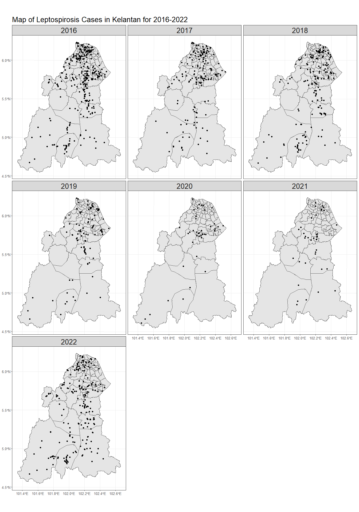<!-- -->

if you want to stratify based on more than one stratified variables (eg: gender and tahun_daftar), use **facet_grid()**


``` r
ggplot() +
  geom_sf(data = kel_map) +
  geom_sf(data = lepto) +
  ggtitle("Map of Leptospirosis Cases in Kelantan by gender for 2016-2022") +
  theme_bw() +
  facet_grid(gender ~ tahun_daftar) +
  theme(plot.title = element_text(size = 24),  strip.text = element_text(size = 20), axis.text.x=element_text(size=10), axis.text.y=element_text(size=10))
```

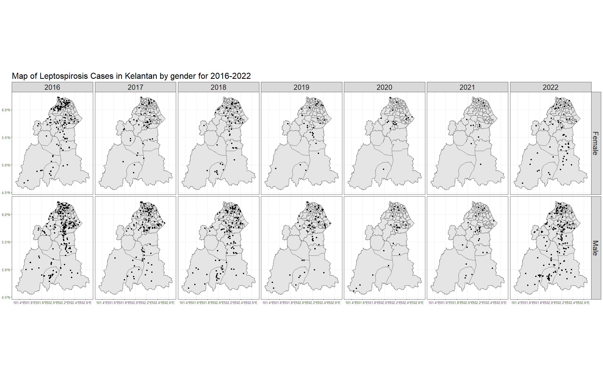<!-- -->

Interactive plot using plotly


``` r
library(plotly)

# Example ggplot object without facet_wrap
p <- ggplot() +
  geom_sf(data = kel_map) +
  geom_sf(data = lepto) +
  ggtitle("Map of Leptospirosis Cases in Kelantan for 2016-2022") +
  theme_bw() +
  theme(
    plot.title = element_text(size = 20),
    axis.text.x = element_text(size = 10),
    axis.text.y = element_text(size = 10)
  )

# Convert the ggplot object to plotly
ggplotly(p)
```

```{=html}
<div class="plotly html-widget html-fill-item" id="htmlwidget-7fec1c034f93390b4741" style="width:672px;height:480px;"></div>
<script type="application/json" data-for="htmlwidget-7fec1c034f93390b4741">{"x":{"data":[{"x":[378795.20450199529,378801.29840260086,378809.59588566399,378817.89979647443,378826.20987651357,378834.52586726577,378842.84751021623,378851.17454685835,378859.50671868015,378867.84376717621,378876.18543384492,378884.53146018321,378892.88158769225,378901.23555787263,378909.59311222896,378917.95399226295,378926.31793948141,378934.68469539116,378943.05400149868,378951.42559930973,378959.79923033458,378968.17463607911,378976.55155805347,378984.92973776301,378993.30891671526,379001.68883641914,379010.06923837878,379018.44986409898,379026.83045508451,379035.21075283847,379043.59049886063,379051.969434653,379060.34730171238,379068.7238415333,379077.09879561194,379085.47190543759,379093.84291249956,379102.21155828494,379110.57758427702,379118.94073195558,379127.30074279656,379135.65735827631,379144.01031986304,379152.35936902236,379160.70424721914,379169.04469590989,379177.38045654754,379185.71127058339,379194.03687946271,379202.35702462535,379210.67144750437,379218.9798895297,379227.28209212888,379235.57779671857,379243.86674471112,379252.14867751655,379260.42333653453,379268.69046315999,379276.94979878172,379285.2010847819,379293.44406253519,379301.67847340991,379309.90405876713,379318.12055996247,379326.32771833893,379334.52527523786,379342.71297198912,379350.89054991474,379359.05775032938,379367.21431454073,379375.35998384393,379383.49449952837,379391.61760287557,379399.72903515614,379407.82853763161,379407.96699471143,null,400988.95909493061,400994.30248417298,401001.80540876626,401009.3120394125,401016.8221176003,401024.33538482466,401031.85158257704,401039.37045235129,401046.89173564326,401054.41517394676,401061.9405087576,401069.4674815716,401076.99583388231,401084.52530718787,401092.05564298102,401099.58658275724,401107.1178680092,401114.64924022974,401122.18044090853,401129.71121153899,401137.24129360623,401144.77042860008,401152.29835800454,401159.8248233021,401167.34956597514,401174.87232750072,401182.39284935565,401189.91087301302,401197.42613994365,401204.93839161447,401212.44736948889,401219.95281502802,401227.45446969027,401234.95207492687,401242.44537218794,401249.93410291994,401257.41800856247,401264.89683055191,401272.37031031825,401279.83818929119,401287.30020889262,401294.75611053669,401302.20563563501,401309.64852559462,401317.08452181454,401324.51336568821,401331.93479860481,401339.34856194461,401346.75439708465,401354.1520453922,401361.5412482291,401368.92174694792,401376.29328290088,401383.65559742408,401391.00843185221,401398.35152751004,401405.68462571455,401413.00746777345,401420.31979499111,401427.62134865613,401434.91187005478,401442.191100461,401449.45878114103,401456.71465335245,401463.95845834393,401471.18993735034,401478.40883160429,401485.61488232354,401492.80783071602,401499.98741797998,401507.15338530415,401514.30547386606,401521.44342483458,401528.5669793631,401535.67587859894,401535.95023852313,null,423182.417888953,423187.07269067463,423193.79750767531,423200.52330624289,423207.24982785876,423213.97681400873,423220.70400617243,423227.43114583113,423234.1579744636,423240.88423354871,423247.60966456303,423254.33400898258,423261.05700828042,423267.77840392583,423274.49793739076,423281.21535013861,423287.93038363539,423294.64277934132,423301.35227871645,423308.05862321501,423314.76155428775,423321.46081338474,423328.15614194941,423334.84728142479,423341.53397324571,423348.21595884551,423354.89297965565,423361.56477709493,423368.23109258711,423374.8916675435,423381.54624337674,423388.19456148864,423394.83636327804,423401.47139013663,423408.09938345489,423414.72008461354,423421.33323498646,423427.93857594207,423434.53584884549,423441.12479504931,423447.70515590737,423454.27667275519,423460.83908693382,423467.39213976718,423473.93557257537,423480.46912667254,423486.99254335975,423493.5055639362,423500.00792968832,423506.49938189634,423512.97966183082,423519.44851075357,423525.90566991875,423532.35088056984,423538.78388394072,423545.2044212597,423551.61223373766,423558.0070625848,423564.38864899368,423570.75673415035,423577.11105923069,423583.45136540057,423589.77739381121,423596.08888560691,423602.385581918,423608.66722386685,423614.93355256232,423621.18430910085,423627.41923456843,423633.63807003864,423639.84055657499,423646.02643522352,423652.19544702244,423658.34733299643,423664.48183415731,423664.83316073054,null,445375.75778270938,445379.77944255556,445385.74257548241,445391.70396268077,445397.66334560816,445403.62046572147,445409.57506447099,445415.52688330825,445421.47566368157,445427.42114703247,445433.36307480285,445439.30118842889,445445.23522934498,445451.16493898001,445457.09005876054,445463.0103301066,445468.9254944374,445474.8352931618,445480.73946769012,445486.63775942416,445492.52990976197,445498.41566009616,445504.29475181259,445510.16692629462,445516.03192491538,445521.88948904647,445527.73936005111,445533.58127928403,445539.41498810082,445545.2402278402,445551.05673984153,445556.86426543532,445562.66254594305,445568.45132268168,445574.23033695843,445579.99933007144,445585.75804331654,445591.50621797552,445597.24359532562,445602.96991663106,445608.68492315401,445614.38835614268,445620.07995683968,445625.75946647569,445631.42662627116,445637.08117744292,445642.72286119009,445648.35141871043,445653.96659118292,445659.56811978359,445665.15574567451,445670.72921000631,445676.2882539219,445681.83261855086,445687.36204501189,445692.87627441663,445698.37504785578,445703.85810641828,445709.32519117574,445714.77604319132,445720.21040351054,445725.6280131716,445731.02861319861,445736.41194460361,445741.77774838294,445747.12576552364,445752.45573699661,445757.76740376279,445763.06050676369,445768.33478693344,445773.58998518827,445778.82584243151,445784.04209955211,445789.23849742557,445794.41477691045,445794.79347043484,null,467569.15552756359,467572.59337296843,467577.81121927581,467583.02458973182,467588.23322575155,467593.43686874502,467598.63526011858,467603.82814127154,467609.01525360416,467614.19633850624,467619.37113736517,467624.53939156322,467629.70084247529,467634.85523147165,467640.00229991751,467645.14178917109,467650.27344058442,467655.39699550421,467660.51219527045,467665.61878121475,467670.71649466158,467675.80507693376,467680.88426933863,467685.95381318347,467691.0134497626,467696.0629203656,467701.10196627449,467706.1303287613,467711.14774908847,467716.15396851301,467721.14872828388,467726.13176963932,467731.10283380537,467736.06166200578,467741.00799544959,467745.94157533889,467750.86214286415,467755.76943920943,467760.6632055426,467765.54318302806,467770.40911281644,467775.26073604682,467780.09779384959,467784.92002734239,467789.72717763291,467794.5189858193,467799.295192983,467804.05554019997,467808.79976852791,467813.52761901956,467818.23883270932,467822.93315062235,467827.61031377019,467832.27006315411,467836.91213975777,467841.53628455556,467846.14223850786,467850.72974255931,467855.2985376459,467859.84836468525,467864.37896458164,467868.89007822762,467873.3814464974,467877.85281025723,467882.30391034984,467886.73448761238,467891.1442828594,467895.53303689481,467899.90049050417,467904.24638446025,467908.5704595187,467912.87245641922,467917.15211588528,467921.40917862399,467925.64338532824,467926.00873627648,null,489762.78773694107,489765.68532892095,489770.17426130356,489774.65598486189,489779.13024095062,489783.59677091712,489788.05531610199,489792.50561784563,489796.94741747237,489801.38045630697,489805.80447566364,489810.21921685006,489814.62442116899,489819.01982991357,489823.40518436895,489827.7802258138,489832.14469551737,489836.49833474343,489840.84088474407,489845.17208676384,489849.4916820419,489853.79941180296,489858.09501726669,489862.37823964225,489866.64882012963,489870.90649991902,489875.15102019231,489879.38212211907,489883.59954685823,489887.80303556292,489891.99232937314,489896.16716941533,489900.32729680924,489904.4724526616,489908.60237807187,489912.71681412094,489916.81550188269,489920.89818242221,489924.96459678514,489929.01448601071,489933.04759112716,489937.06365314341,489941.06241306185,489945.04361187184,489949.00699054549,489952.9522900458,489956.87925132061,489960.78761530691,489964.67712292494,489968.54751508014,489972.39853266987,489976.22991657106,489980.04140765016,489983.83274675591,489987.60367472598,489991.35393238009,489995.08326052513,489998.79139994946,490002.47809143108,490006.14307572949,490009.78609358735,490013.40688573261,490017.00519287871,490020.58075571898,490024.13331493468,490027.66261118656,490031.16838512063,490034.65037736669,490038.10832853621,490041.54197922169,490044.95107000094,490048.33534143248,490051.69453405729,490055.02838839818,490058.33664496057,490058.65639575518,null,511956.8308956839,511959.22637250531,511963.00274018606,511966.76916320244,511970.52538282773,511974.27114033228,511978.00617697457,511981.73023400793,511985.44305267558,511989.14437421173,511992.83393984375,511996.51149078755,512000.17676825245,512003.82951343758,512007.46946753247,512011.09637171729,512014.7099671617,512018.30999502685,512021.89619646309,512025.46831260889,512029.02608459577,512032.56925354002,512036.09756055259,512039.61074672686,512043.10855315084,512046.5907208987,512050.05699103023,512053.50710460148,512056.94080264977,512060.35782619932,512063.75791626831,512067.14081385726,512070.50625995791,512073.85399554571,512077.18376158481,512080.49529902678,512083.78834880795,512087.0626518543,512090.31794907444,512093.55398136569,512096.77048961178,512099.96721467923,512103.143897423,512106.30027868337,512109.4360992845,512112.55110003514,512115.64502173004,512118.71760514996,512121.76859105896,512124.79772020486,512127.80473332223,512130.78937112383,512133.75137431454,512136.69048357534,512139.60643957614,512142.49898296822,512145.36785438401,512148.21279444167,512151.03354374098,512153.82984286657,512156.60143238056,512159.34805283241,512162.06944475096,512164.76534864743,512167.43550501508,512170.07965433045,512172.69753704744,512175.28889360343,512177.8534644171,512180.39098988939,512182.90121039783,512185.38386630634,512187.838697951,512190.26544565608,512192.66384972131,512192.91376454959,null,364237.09213499911,365582.00580453209,367375.36170106259,369168.71447296999,370962.0642099501,372755.41100170324,374548.75493794389,376342.09610838996,378135.434602772,379928.77051083068,381722.10392231005,383515.43492696848,385308.7636145716,387102.09007489606,388895.4143977213,390688.73667284206,392482.05699006101,394275.37543919054,396068.69211004692,397862.00709246047,399655.32047627005,401448.63235131983,403241.94280747185,405035.25193458574,406828.55982253555,408621.86656121048,410415.17224049487,412208.47695029952,414001.78078052623,415795.08382109791,417588.38616194611,419381.6878930055,421174.98910422198,422968.28988555551,424761.59032696794,426554.89051843737,428348.1905499429,430141.49051147641,431934.79049304593,433728.09058465442,435521.39087632764,437314.69145809411,439107.99241998704,440901.29385206132,442694.59584436606,444487.89848696976,446281.20186995028,448074.50608338579,449867.81121737335,451661.1173620164,453454.42460742075,455247.73304371414,457041.042761021,458834.35384948074,460627.66639924643,462420.98050046887,464214.29624331812,466007.61371797149,467800.93301461189,469594.2542234335,471387.57743463683,473180.90273844165,474974.23022506514,476767.5599847369,478560.89210770075,480354.22668420488,482147.5638045083,483940.90355887974,485734.24603759381,487527.59133093921,489320.93952921184,491114.29072271613,492907.6450017672,494701.00245668774,496494.36317781068,498287.72725547833,500081.09478004277,501874.46584186365,503667.84053131257,505461.21893876692,507254.60115461581,509047.98726926051,510841.3773731023,512634.77155656146,514428.16991006455,516221.57252404501,518014.9794889472,519808.39089522517,521601.80683334265,523395.22739377379,525188.65266699798,526872.12656500004,null,364237.09213499911,365757.12879323465,367549.1411964678,369341.15260394092,371133.16310503165,372925.17278912815,374717.18174563104,376509.19006395037,378301.19783350226,380093.20514372172,381885.21208404377,383677.21874391928,385469.22521280835,387261.23158018169,389053.23793551768,390845.24436830916,392637.25096805347,394429.25782426517,396221.26502645982,398013.27266417147,399805.28082694253,401597.28960431862,403389.29908586713,405181.30936115567,406973.32051976491,408765.33265129221,410557.34584533196,412349.36019150249,414141.3757794227,415933.39269872411,417725.41103905358,419517.43089005991,421309.45234140637,423101.47548276791,424893.5004038263,426685.52719427855,428477.55594382458,430269.58674217784,432061.61967906693,433853.65484421991,435645.69232738705,437437.73221832333,439229.77460678836,441021.81958256318,442813.8672354297,444605.91765518562,446397.97093163844,448190.0271545992,449982.08641389938,451774.14879937586,453566.21440087119,455358.28330824885,457150.35561137018,458942.43140011677,460734.51076437888,462526.59379404836,464318.68057904101,466110.77120927098,467902.8657746705,469694.96436517965,471487.06707074406,473279.17398132925,475071.28518690332,476863.40077744622,478655.52084295015,480447.64547341777,482239.77475886,484031.90878930071,485824.04765476781,487616.19144530816,489408.3402509751,491200.49416183145,492992.65326795075,494784.81765941822,496576.9874263262,498369.16265878367,500161.34344690427,501953.52988081251,503745.72205064679,505537.9200465515,507330.12395868497,509122.33387721569,510914.54989232053,512706.77209418535,514499.00057301234,516291.23541900946,518083.4767223947,519875.72457339981,521667.97906226275,523460.24027923815,525252.50831458485,526872.12656500004,null,364237.09213499911,365933.42075791326,367724.00354254135,369514.58745231462,371305.17257629515,373095.75900355482,374886.34682317643,376676.93612425297,378467.52699589077,380258.11952721042,382048.71380733442,383839.30992540345,385629.90797057026,387420.50803199317,389211.11019884516,391001.71456031263,392792.32120558707,394582.93022388004,396373.54170440364,398164.15573638905,399954.77240907541,401745.39181171439,403536.01403357036,405326.63916391478,407117.26729203062,408907.89850722032,410698.53289878432,412489.17055604764,414279.81156833458,416070.45602498658,417861.10401536128,419651.75562881952,421442.4109547321,423233.07008249284,425023.73310149409,426814.40010114887,428605.07117087062,430395.7464000961,432186.4258782682,433977.10969483719,435767.79793927021,437558.4907010477,439349.18806964927,441139.89013458329,442930.59698535217,444721.30871148419,446512.02540251019,448302.74714797165,450093.4740374292,451884.20616044995,453674.94360660564,455465.68646549684,457256.4348267141,459047.1887798768,460837.94841460948,462628.71382054273,464419.48508732679,466210.26230461814,468001.04556208767,469791.83494941599,471582.63055629283,473373.43247242505,475164.24078752915,476955.0555913244,478745.87697355502,480536.70502396865,482327.53983232612,484118.38148839993,485909.23008197069,487700.08570283646,489490.94844080403,491281.81838568818,493072.69562732091,494863.58025554102,496654.47236020205,498445.37203116709,500236.27935831202,502027.19443152164,503818.1173406954,505609.04817574233,507399.98702658125,509190.93398315029,510981.88913538796,512772.85257325065,514563.82438670698,516354.80466573453,518145.79350032337,519936.79098047345,521727.79719619936,523518.81223752798,525309.83619448915,526872.12656500004,null,364237.09213499911,364319.81127630913,366108.87515338487,367897.94217894785,369687.01244172337,371476.08603045199,373265.16303388373,375054.2435407837,376843.32763992553,378632.41542009567,380421.5069700976,382210.60237874201,383999.70173485449,385788.80512726918,387577.91264483862,389367.02437642147,391156.14041089214,392945.26083713549,394734.38574405387,396523.51522055472,398312.6493555592,400101.78823800437,401890.9319568369,403680.0806010185,405469.23425951914,407258.39302132296,409047.55697542889,410836.7262108415,412625.90081658779,414415.0808816952,416204.26649521332,417993.45774620119,419782.65472372773,421571.8575168731,423361.06621473923,425150.28090642794,426939.50168106274,428728.72862777417,430517.96183570428,432307.20139401685,434096.44739187503,435885.69991846354,437674.95906297804,439464.22491461952,441253.49756261363,443042.77709618572,444832.06360458583,446621.35717706609,448410.65790289297,450199.96587135212,451989.28117173642,453778.60389334656,455567.93412550807,457357.27195754508,459146.61747880367,460935.97077864117,462725.33194642077,464514.70107152645,466304.07824335073,468093.46355129807,469882.85708478681,471672.25893324503,473461.66918611876,475251.08793286182,477040.51526293973,478829.95126583398,480619.39603103942,482408.8496480576,484198.31220640946,485987.78379562043,487777.26450523705,489566.75442481448,491356.25364391773,493145.76225212758,494935.28033903701,496724.80799425254,498514.34530738986,500303.89236807986,502093.44926596584,503883.01609070145,505672.59293195559,507462.17987940728,509251.77702275396,511041.38445169549,512831.00225595158,514620.6305252547,516410.26934934623,518199.91881798278,519989.57902093243,521779.25004797452,523568.93198890716,525358.62493353128,526872.12656500004],"y":[493668.02187499998,495720.23807150096,498512.29023622244,501304.33947643003,504096.3859991146,506888.43001127162,509680.47171989211,512472.51133197517,515264.54905451258,518056.5850945022,520848.61965894251,523640.65295483259,526432.68518916715,529224.71656894824,532016.74730117293,534808.77759283886,537600.80765094853,540392.8376824992,543184.86789448792,545976.89849391615,548768.92968777975,551560.96168307471,554352.99468680355,557145.02890595666,559937.06454753201,562729.10181852395,565521.14092592651,568313.18207673321,571105.22547793097,573897.27133651066,576689.31985946547,579481.37125377986,582273.42572643654,585065.48348442011,587857.54473471537,590649.60968429921,593441.67854014656,596233.75150923955,599025.82879854797,601817.91061504267,604609.99716569367,607402.088657466,610194.18529732339,612986.2872922254,615778.39484913053,618570.50817499403,621362.62747676647,624154.75296139799,626946.88483583275,629739.02330701298,632531.16858187702,635323.32086735859,638115.48037039151,640907.64729790133,643699.82185681118,646492.00425404171,649284.19469650579,652076.39339112071,654868.60054478701,657660.81636440847,660453.04105688317,663245.27482910745,666037.51788796729,668829.77044034447,671622.03269312426,674414.30485317472,677206.58712736762,679998.8797225653,682791.18284562707,685583.49670340214,688375.82150274434,691168.15745049051,693960.50475347473,696752.86361853196,699545.23425248277,699593.04062500002,null,493668.02187499998,495657.4735032795,498449.48656724935,501241.49877667043,504033.51033832727,506825.52145899291,509617.532345452,512409.54320448375,515201.5542428678,517993.56566738331,520785.5776848094,523577.59050192463,526369.6043255066,529161.61936233565,531953.63581918192,534745.65390282706,537537.67382004182,540329.69577760203,543121.71998228063,545913.7466408452,548705.7759600695,551497.80814671807,554289.84340755828,557081.88194935618,559873.92397887271,562665.96970287303,565458.01932811178,568250.07306134619,571042.13110933325,573834.1936788226,576626.26097656658,579418.33320930833,582210.41058379773,585002.4933067743,587794.58158497594,590586.67562514055,593378.77563400113,596170.88181828754,598962.99438472441,601755.11354003823,604547.23949094582,607339.37244416494,610131.51260640915,612923.66018438409,615715.81538479635,618507.97841434693,621300.14947973343,624092.32878764835,626884.51654477825,629676.71295781084,632468.91823342023,635261.13257828448,638053.35619907384,640845.58930245345,643637.83209508553,646430.08478361997,649222.34757471096,652014.62067500351,654806.90429113852,657599.19862974796,660391.50389746146,663183.82030090166,665976.14804668736,668768.48734142771,671560.83839173231,674353.20140419621,677145.5765854182,679937.9641419804,682730.36428046483,685522.77720744885,688315.20312949852,691107.64225317386,693900.09478503035,696692.56093161425,699485.04089946591,699593.04062500002,null,493668.02187499998,495600.94841381622,498392.94380234665,501184.9404035224,503976.93842392036,506768.93807010457,509560.93954864243,512352.94306609727,515144.94882904086,517936.95704403199,520728.96791763633,523520.98165641213,526312.99846692185,529105.01855571894,531897.04212936282,534689.069394405,537481.10055739828,540273.13582489151,543065.17540343688,545857.21949957206,548649.26831984427,551441.32207079465,554233.38095895853,557025.44519087288,559817.51497306523,562609.59051206929,565401.67201441014,568193.7596866088,570985.85373518826,573777.95436665975,576570.06178754277,579362.17620434228,582154.29782356205,584946.42685171054,587738.56349527789,590530.70796076441,593322.8604546556,596115.0211834386,598907.19035359845,601699.36817160679,604491.55484393914,607283.75057706214,610075.95557744196,612868.17005153489,615660.39420579094,618452.62824666523,621244.87238059938,624037.12681402662,626829.39175338787,629621.66740510275,632413.95397560101,635206.25167129131,637998.56069859117,640790.88126390392,643583.21357362194,646375.55783414817,649167.91425186233,651960.28303314687,654752.66438437346,657545.05851191492,660337.4656221288,663129.88592137059,665922.31961598853,668714.76691232109,671507.22801670432,674299.70313546318,677092.19247491925,679884.69624138472,682677.21464116243,685469.74788055138,688262.29616584291,691054.85970331484,693847.43869924534,696640.03335989744,699432.64389153582,699593.04062500002,null,493668.02187499998,495550.53213865496,498342.53130382585,501134.53374623443,503926.53967224335,506718.54928820813,509510.56280048453,512302.58041543222,515094.60233939963,517886.62877873582,520678.6599397902,523470.69602890452,526262.73725242226,529054.78381668834,531846.83592803264,534638.89379279048,537430.95761729486,540223.02760787192,543015.10397084267,545807.18691253464,548599.27663925919,551391.37335733592,554183.47727307014,556975.58859277237,559767.70752274233,562559.83426927996,565351.96903868194,568144.11203723319,570936.26347122656,573728.42354694009,576520.59247065114,579312.77044863405,582104.95768715779,584897.15439248004,587689.36077086616,590481.57702856697,593273.80337182945,596066.04000689555,598858.28714000736,601650.54497739323,604442.8137252843,607235.09358989715,610027.38477744977,612819.68749415304,615612.00194620725,618404.32833981328,621196.66688116197,623989.01777643664,626781.38123181846,629573.75745347934,632366.14664758614,635158.54902029608,637950.9647777637,640743.39412613551,643535.83727154706,646328.29442013381,649120.76577801665,651913.25155131449,654705.75194613857,657498.26716859068,660290.79742476379,663083.34292074607,665875.90386261698,668668.48045645002,671461.07290830417,674253.68142423814,677046.30621029832,679838.94747252099,682631.60541694099,685424.28024957841,688216.9721764432,691009.6814035452,693802.4081368749,696595.15258242365,699387.91494616645,699593.04062500002,null,493668.02187499998,495506.09422557725,498298.11864638433,501090.14840657683,503882.18371230882,506674.22476972773,509466.27178498014,512258.32496421231,515050.38451356604,517842.45063917426,520634.5235471747,523426.60344369494,526218.69053486479,529010.78502680536,531802.88712563447,534594.99703747104,537387.11496842199,540179.24112459784,542971.37571209786,545763.51893702184,548555.67100546276,551347.83212351392,554140.00249725697,556932.1823327702,559724.37183612736,562516.57121340302,565308.78067065997,568101.00041395868,570893.23064935033,573685.4715828856,576477.72342060891,579269.98636855767,582062.26063275989,584854.54641925008,587646.84393404052,590439.15338314918,593231.47497258405,596023.80890834797,598816.15539643273,601608.51464283152,604400.88685352495,607193.27223449026,609985.6709916949,612778.08333110053,615570.50945866574,618362.94958033704,621155.40390205616,623947.87262975471,626740.35596936056,629532.85412679531,632325.36730796774,635117.89571877941,637910.43956513156,640702.99905290862,643495.57438798971,646288.16577625007,649080.77342355216,651873.39753575018,654666.03831869212,657458.69597821741,660251.37072015472,663044.06275032449,665836.77227454097,668629.49949860713,671422.24462831498,674215.00786945014,677007.78942779219,679800.58950910578,682593.408319148,685386.24606366421,688179.10294839588,690971.97917906707,693764.8749614004,696557.79050110176,699350.72600386979,699593.04062500002,null,493668.02187499998,495467.50442428869,498259.57560679223,501051.65418854734,503843.74037550477,506635.83437360293,509427.93638878502,512220.04662698304,515012.16529412981,517804.29259615415,520596.42873897345,523388.57392850489,526180.72837066394,528972.89227135712,531765.06583648897,534557.24927195616,537349.44278364955,540141.64657746407,542933.86085927044,545726.08583495812,548518.3217103926,551310.56869143876,554102.8269839586,556895.09679380583,559687.37832682952,562479.67178887222,565271.97738577018,568064.29532335431,570856.62580744841,573648.96904386592,576441.32523842307,579233.69459691946,582026.07732515654,584818.47362892202,587610.88371400151,590403.30778617179,593195.74605119741,595988.19871484616,598780.66598287097,601573.14806101867,604365.64515502879,607158.15747063176,609950.68521355593,612743.22858951474,615535.78780421836,618328.3630633651,621120.954572647,623913.56253775011,626706.18716434645,629498.82865810581,632291.48722468561,635084.16306973156,637876.85639889212,640669.5674177903,643462.29633205431,646255.04334729642,649047.80866911937,651840.59250312054,654633.39505488309,657426.21652998519,660219.05713398964,663011.91707245784,665804.79655093118,668597.69577495055,671390.61495004024,674183.55428171565,676976.51397548569,679769.49423684494,682562.49527127668,685355.51728425582,688148.56048125098,690941.62506770901,693734.71124907397,696527.8192307771,699320.9492182408,699593.04062500002,null,493668.02187499998,495434.63267610298,498226.772153578,501018.92108805774,503811.07968528889,506603.24815100624,509395.42669094098,512187.61551082786,514979.81481638236,517772.02481332287,520564.2457073612,523356.47770420747,526148.7210095526,528940.97582909989,531733.2423685306,534525.52083353209,537317.81142977974,540110.11436294229,542902.42983868124,545694.75806265848,548487.09924052283,551279.45357791847,554071.82128048013,556864.2025538428,559656.59760362562,562449.00663545053,565241.42985492025,568033.86746764241,570826.31967920915,573618.78669520572,576411.26872121636,579203.76596280595,581996.27862554963,584788.80691499356,587581.35103669076,590373.91119617911,593166.48759899358,595959.08045065682,598751.68995668134,601544.31632257742,604336.95975384011,607129.62045596086,609922.29863442248,612714.99449469126,615507.70824223186,618300.44008250209,621093.19022093946,623885.95886298281,626678.74621405685,629471.55247957795,632264.37786495266,635057.22257557535,637850.08681683301,640642.97079410555,643435.87471275427,646228.79877813929,649021.7431956043,651814.70817048836,654607.69390811154,657400.70061379345,660193.72849283635,662986.77775053203,665779.84859216202,668572.94122299843,671366.0558483043,674159.19267332263,676952.35190329386,679745.53374344425,682538.7383989899,685331.96607512899,688125.2169770546,690918.49130994454,693711.78927896963,696505.11108928232,699298.45694602618,699593.04062500002,null,497998.57887718308,497994.33319595415,497988.71406269324,497983.13708004367,497977.60217883653,497972.10928990401,497966.65834409132,497961.24927226157,497955.88200527651,497950.55647401826,497945.27260937,497940.03034222923,497934.82960350049,497929.67032410594,497924.55243496574,497919.47586701933,497914.44055121322,497909.44641850214,497904.49339985021,497899.58142623206,497894.71042863448,497889.88033805008,497885.09108548157,497880.34260194143,497875.63481845439,497870.96766605362,497866.34107577574,497861.7549786726,497857.20930580707,497852.70398824458,497848.23895706597,497843.81414335873,497839.42947821727,497835.08489274944,497830.78031807317,497826.51568530605,497822.29092558421,497818.10597005155,497813.9607498573,497809.85519616015,497805.78924013249,497801.76281294663,497797.77584579459,497793.82826986758,497789.92001637205,497786.05101651914,497782.22120153252,497778.43050263973,497774.67885107978,497770.96617809922,497767.29241495434,497763.65749291208,497760.06134324131,497756.5038972224,497752.98508614901,497749.50484131614,497746.0630940292,497742.65977560554,497739.29481736571,497735.96815063863,497732.67970676685,497729.42941709666,497726.21721298108,497723.04302578489,497719.90678688121,497716.80842764454,497713.74787946785,497710.7250737407,497707.73994187248,497704.79241526843,497701.88242534851,497699.00990354316,497696.17478128016,497693.37699000863,497690.61646117247,497687.89312623319,497685.20691665192,497682.55776390445,497679.94559946528,497677.3703548279,497674.83196148707,497672.33035093953,497669.8654546988,497667.43720428611,497665.04553121846,497662.69036702899,497660.37164326041,497658.08929145703,497655.84324317123,497653.63342996419,497651.45978340396,497649.45328932011,null,553281.90766541671,553277.04816078802,553271.36413610587,553265.72502299643,553260.1307525849,553254.58125600335,553249.07646438631,553243.61630889028,553238.20072067878,553232.82963091915,553227.50297079794,553222.22067150136,553216.98266423389,553211.78888021084,553206.63925064879,553201.53370678169,553196.47217985138,553191.45460110845,553186.4809018157,553181.5510132378,553176.66486666293,553171.82239337836,553167.02352468204,553162.26819189056,553157.55632631108,553152.88785928162,553148.26272213575,553143.68084622384,553139.14216290182,553134.6466035347,553130.19409949973,553125.78458218137,553121.41798297456,553117.09423328028,553112.8132645149,553108.57500809827,553104.37939546118,553100.22635804641,553096.11582730012,553092.04773468303,553088.02201165946,553084.03858971014,553080.09740031592,553076.19837497408,553072.34144518606,553068.52654246509,553064.75359832973,553061.02254431136,553057.33331194601,553053.68583278218,553050.08003837627,553046.51586029027,553042.99323009839,553039.51207937847,553036.07233972615,553032.67394273367,553029.3168200095,553026.00090317277,553022.72612384241,553019.49241364899,553016.29970423994,553013.14792725665,553010.03701435495,553006.96689720498,553003.93750747724,553000.94877685129,552998.00063701742,552995.09301967558,552992.22585652547,552989.399079283,552986.61261967209,552983.86640942097,552981.16038026032,552978.49446394318,552975.86859221524,552973.28269684257,552970.73670959042,552968.23056223197,552965.76418655843,552963.33751435392,552960.95047741896,552958.60300756188,552956.29503659368,552954.02649633598,552951.79731862049,552949.60743528209,552947.45677816169,552945.34527911327,552943.27286999254,552941.23948266741,552939.24504900898,552937.47788631916,null,608565.15344882361,608559.72401008615,608554.04062884394,608548.40491249296,608542.81679248693,608537.27620028437,608531.78306735272,608526.33732517494,608520.93890524097,608515.58773904631,608510.28375810618,608505.02689394052,608499.81707807898,608494.65424206329,608489.53831744276,608484.46923578123,608479.44692864572,608474.47132762079,608469.54236429406,608464.65997026709,608459.82407715276,608455.03461656801,608450.29152014258,608445.59471951704,608440.94414634129,608436.33973227674,608431.78140898573,608427.26910814922,608422.80276145879,608418.38230060856,608414.00765730208,608409.67876326083,608405.3955502077,608401.15794987907,608396.96589401655,608392.81931437692,608388.71814272041,608384.6623108224,608380.65175046131,608376.68639342894,608372.76617152512,608368.89101655665,608365.06086034165,608361.27563471079,608357.5352714964,608353.83970254194,608350.18885970628,608346.58267484501,608343.02107983304,608339.50400655472,608336.03138689324,608332.60315274796,608329.21923602733,608325.87956864329,608322.58408252185,608319.33270959416,608316.12538180267,608312.96203109552,608309.84258943051,608306.76698877756,608303.73516110692,608300.74703840364,608297.80255266232,608294.90163587849,608292.04422006477,608289.23023723345,608286.45961941034,608283.73229863006,608281.04820693436,608278.40727637138,608275.80943899788,608273.25462687877,608270.7427720899,608268.27380671119,608265.8476628327,608263.46427255007,608261.12356796907,608258.82548120315,608256.56994437403,608254.35688960867,608252.18624904542,608250.05795482476,608247.97193910182,608245.92813403427,608243.9264717889,608241.96688454063,608240.04930447065,608238.17366377043,608236.33989463211,608234.54792926647,608232.79769988277,608231.30734836974,null,663849.90074617811,663849.63635068922,663843.96851622919,663838.35116062732,663832.78421567753,663827.26761319104,663821.80128499423,663816.38516291347,663811.01917879202,663805.70326447883,663800.43735183938,663795.22137274593,663790.05525908258,663784.93894273997,663779.87235562305,663774.85542964342,663769.88809672813,663764.97028880729,663760.10193782591,663755.28297573666,663750.51333450689,663745.79294610629,663741.12174251978,663736.49965574057,663731.92661777569,663727.40256063233,663722.92741633567,663718.50111691921,663714.12359442562,663709.79478090443,663705.51460842218,663701.28300904413,663697.09991485614,663692.96525794559,663688.87897041114,663684.84098436753,663680.85123192833,663676.90964522562,663673.0161563924,663669.17069757869,663665.37320093904,663661.623598643,663657.92182286095,663654.26780577505,663650.66147958417,663647.10277648596,663643.59162869363,663640.12796842586,663636.71172791405,663633.34283939411,663630.02123511513,663626.74684733222,663623.51960830973,663620.33945032372,663617.206305656,663614.12010659778,663611.08078544692,663608.08827451465,663605.14250611956,663602.2434125857,663599.39092624851,663596.58497945312,663593.82550454617,663591.11243389477,663588.44569986314,663585.82523482991,663583.25097118353,663580.72284131509,663578.24077762745,663575.80471252755,663573.41457844118,663571.07030779275,663568.77183301596,663566.519086555,663564.31200086349,663562.15050839994,663560.03454163147,663557.96403303486,663555.93891509087,663553.95912029524,663552.02458114375,663550.13523014798,663548.29099982185,663546.49182268733,663544.73763127625,663543.02835812757,663541.36393578665,663539.74429680593,663538.1693737515,663536.63909918838,663535.1534056965,663533.71222585952,663532.53104812081],"type":"scatter","mode":"lines","line":{"width":1.8897637795275593,"color":"rgba(235,235,235,1)","dash":"solid"},"hoveron":"points","hoverinfo":"none","showlegend":false,"_isGraticule":true,"xaxis":"x","yaxis":"y","frame":null},{"x":[485501.8125,485717.3125,485966.40619999915,486065.59369999915,486068.09369999915,485981.09369999915,485982.6875,486033.8125,486148.3125,486294.40619999915,486521.59369999915,486574.8125,486343.40619999915,486150.6875,486138.40619999915,486208.5,486314.90619999915,486494.09369999915,486684.8125,486829.59369999915,486872.40619999915,486903.09369999915,486924.3125,486946.8125,486997.40619999915,486927.90619999915,486884.90619999915,486948.1875,487045,487157.1875,487092.5,487011.3125,487014.40619999915,486999.3125,486982.3125,486981.8125,486992.6875,487113.1875,487307.5,487390.3125,487354.40619999915,487152.59369999915,486972.90619999915,486941.3125,486920.3125,486944.40619999915,486989.3125,487172.59369999915,487254,487237.09369999915,487191.1875,487088.3125,486926.09369999915,486741.8125,486523.8125,486307.6875,486214.40619999915,486114.90619999915,486033.8125,485993,485914.09369999915,485844.40619999915,485814.90619999915,485792.5,485713.1875,485642.1875,485553.8125,485462.1875,485375.59369999915,485271.09369999915,485138.3125,485052.3125,484932.5,484881.09369999915,484775.3125,484722.8125,484703.59369999915,484670.59369999915,484618,484538.3125,484386.3125,484185.59369999915,484040.40619999915,484008.3125,483974.5,483905.1875,483848.90619999915,483759.3125,483618.1875,483475.40619999915,483428.5,483442.90619999915,483390.59369999915,483301.1875,483231.90619999915,483215.5,483172.3125,483122.8125,483052.6875,482920.59369999915,482837.8125,482778.40619999915,482755.1875,482716.09369999915,482678.8125,482619.3125,482542,482466.90619999915,482443.09369999915,482400.8125,482348.3125,482270.1875,482245.59369999915,482182.90619999915,482107.8125,482020,481911.8125,481857.8125,481830.8125,481810.5,481785.90619999915,481713.1875,481627.8125,481597,481545.40619999915,481457.1875,481346.8125,481302.3125,481316.6875,481299.40619999915,481298.90619999915,481324.09369999915,481356.8125,481335.8125,481299.1875,481222.40619999915,481122.90619999915,481052.59369999915,480985.09369999915,480963.5,480949.1875,480890,480828.6875,480823.8125,480811.8125,480794.1875,480809.09369999915,480821.8125,480810.6875,480766.3125,480703.6875,480693.59369999915,480697.8125,480738.59369999915,480765.1875,480762.90619999915,480759,480732,480703.59369999915,480755.3125,480880.1875,480985.8125,481019.3125,481050,481020.90619999915,480973.5,481012,481106.6875,481210.59369999915,481297.3125,481355.5,481454.8125,481513.40619999915,481597.5,481727.90619999915,481819.1875,481872,481908.90619999915,482018.3125,482067.8125,482168,482181.1875,482230.59369999915,482300.6875,482359.1875,482439.5,482565.6875,482624.90619999915,482683.3125,482767.90619999915,482941.3125,483031.59369999915,483064.8125,483101.40619999915,483126.90619999915,483191.3125,483253,483256.8125,483279.3125,483287.8125,483331.5,483416.40619999915,483494,483550.6875,483595.8125,483657,483755.1875,483806.09369999915,483780.8125,483817,483884.1875,483968.3125,484099.40619999915,484217.8125,484311,484339.3125,484372.40619999915,484430.90619999915,484597.40619999915,484751.5,484904.5,484975.8125,484889.5,484778.5,484735.1875,484844.3125,484889.5,484922.40619999915,484980.6875,485058.59369999915,485083.6875,485079.3125,485109.40619999915,485121.09369999915,485179,485239.8125,485359.8125,485501.8125,485501.8125,null,482895.59369999915,482931.1875,483059.8125,483030.5,483004,483023.6875,483132.8125,483323.59369999915,483407.59369999915,483423.8125,483442,483508.90619999915,483583.6875,483634.40619999915,483683.90619999915,483733.5,483770.8125,483807.8125,483825.8125,483830.8125,483838.90619999915,483831.40619999915,483761.8125,483692.40619999915,483663,483635.8125,483595.6875,483588.90619999915,483579.5,483567.3125,483635.8125,483696.8125,483770.5,483828,483859.59369999915,483896.3125,483993.90619999915,484066.59369999915,484145,484179.09369999915,484194.3125,484182.8125,484105.90619999915,484033.59369999915,483952.3125,483825.3125,483784.6875,483775.90619999915,483780.8125,483806.09369999915,483755.1875,483657,483595.8125,483550.6875,483494,483416.40619999915,483331.5,483287.8125,483279.3125,483256.8125,483253,483191.3125,483126.90619999915,483101.40619999915,483064.8125,483031.59369999915,482941.3125,482767.90619999915,482683.3125,482624.90619999915,482565.6875,482439.5,482359.1875,482300.6875,482230.59369999915,482181.1875,482168,482067.8125,482018.3125,481908.90619999915,481872,481819.1875,481727.90619999915,481597.5,481513.40619999915,481454.8125,481355.5,481297.3125,481210.59369999915,481106.6875,481012,480973.5,481020.90619999915,481050,481019.3125,480985.8125,480880.1875,480755.3125,480703.59369999915,480732,480759,480762.90619999915,480765.1875,480738.59369999915,480697.8125,480693.59369999915,480703.6875,480766.3125,480810.6875,480821.8125,480809.09369999915,480794.1875,480811.8125,480823.8125,480828.6875,480890,480949.1875,480963.5,480985.09369999915,481052.59369999915,481122.90619999915,481222.40619999915,481299.1875,481335.8125,481356.8125,481324.09369999915,481298.90619999915,481299.40619999915,481316.6875,481302.3125,481346.8125,481457.1875,481545.40619999915,481597,481627.8125,481713.1875,481785.90619999915,481810.5,481830.8125,481857.8125,481911.8125,482020,482107.8125,482182.90619999915,482245.59369999915,482270.1875,482348.3125,482400.8125,482443.09369999915,482466.90619999915,482542,482619.3125,482678.8125,482716.09369999915,482755.1875,482778.40619999915,482837.8125,482920.59369999915,483052.6875,483122.8125,483172.3125,483215.5,483231.90619999915,483301.1875,483390.59369999915,483442.90619999915,483428.5,483352.5,483220.3125,483066.6875,482936.90619999915,482847.5,482819.3125,482778.6875,482721.3125,482686.09369999915,482669.5,482657.90619999915,482653.6875,482621.09369999915,482598.40619999915,482578.09369999915,482572.8125,482540.90619999915,482538.3125,482521.90619999915,482515.8125,482510.8125,482503,482497.8125,482438.1875,482232.8125,482119.5,481992,481949.00780000165,481932.40619999915,481909.5,481710.3125,481624.3125,481568.40619999915,481516.8125,481543.8125,481498.90619999915,481384.1875,481163.90619999915,480947.8125,480860.1875,480792.6875,480763.5,480756.8125,480748.6875,480713.5,480666.90619999915,480627.40619999915,480597.8125,480579.3125,480462.6875,480290.59369999915,480210.5,480178.59369999915,480084,479978.09369999915,479878,479854.40619999915,479813.40619999915,479750.6875,479728.5,479702.59369999915,479648,479568,479508.1875,479463.1875,479460.3125,479434.5,479374.6875,479271,479175.3125,479166,479110.90619999915,479008.5,478951.59369999915,478898,478868.1875,478778.3125,478742.3125,478719.8125,478695.6875,478664.8125,478622.3125,478578.09369999915,478568.5,478509.8125,478405.3125,478302.40619999915,478230.59369999915,478186.5,478160.3125,478181.59369999915,478191.40619999915,478201.1875,478224.09369999915,478273.59369999915,478310.90619999915,478363.5,478427.3125,478467.40619999915,478498.8125,478582.90619999915,478712,478849.09369999915,478952.59369999915,479056.5,479023.3125,478961.90619999915,478907.5,478868.09369999915,478837.09369999915,478781,478725.59369999915,478690.59369999915,478639,478601.5,478581.8125,478585.1875,478595.1875,478639.40619999915,478672.59369999915,478723.40619999915,478831.59369999915,478945.5,478990.5,478963.6875,478840.1875,478737.6875,478701.40619999915,478634.6875,478633.8125,478622.5,478646,478668.90619999915,478676.3125,478692.3125,478654.8125,478579.09369999915,478465.09369999915,478429.3125,478357.40619999915,478273.1875,478211.1875,478208.90619999915,478255.40619999915,478300.8125,478355.8125,478359.09369999915,478343.1875,478349.68420000002,478361,478397.59369999915,478474.3125,478535.1875,478559.8125,478502.6875,478439.51440000162,478412.12070000172,478336.09160000086,478225.68840000033,478181.17000000179,478147.48829999939,478122.73959999904,478115.49540000036,478112.34219999984,478082.02870000154,478019.3515000008,477983.47320000082,477940.27270000055,477922.11389999837,477896.48660000041,477861.40560000017,477805.98620000109,477786.91440000013,477799.67410000041,477815.32229999825,477837.78680000082,477855.37180000171,477874.2360999994,477881.51170000061,477887.50140000135,477905.3900000006,477914.89680000022,477920.91770000011,477933.35579999909,477936.12860000134,477936.25569999963,477936.34910000116,477937.15850000083,477935.41560000181,477932.99049999937,477932.5634999983,477923.53209999949,477916.79809999838,477906.81599999964,477904.5978000015,477901.34959999844,477897.38850000128,477882.65289999917,477871.32400000095,477844.38809999824,477823.31480000168,477797.32959999889,477777.9199000001,477762.55059999973,477751.71000000089,477742.54470000044,477738.51110000163,477735.80420000106,477735.3125,477730.6875,477717.1875,477690.6875,477666.3125,477639,477607.3125,477644.6875,477669.1875,477673.8125,477695.59369999915,477715.59369999915,477730.5428000018,477763.09369999915,477774.8125,477835.8125,477882.59369999915,477930.3125,477959.3125,477981.8125,478030.6875,478068,478087.6875,478098.3125,478124.6875,478143.59369999915,478145.3125,478145.8125,478125.90619999915,478090.3125,478050.5,478043.1875,478044.09369999915,478047.40619999915,478057.5,478062.5,478074,478131.1875,478222.5,478348.40619999915,478454.09369999915,478536.8125,478613.3125,478662.40619999915,478699.5,478766.3125,478846.09369999915,478889.8125,478983.09369999915,479051,479179.90619999915,479239.5,479312.40619999915,479355.1875,479395.8125,479462.09369999915,479530.40619999915,479563.1875,479566.09959999844,479623.59369999915,479650.3125,479679.90619999915,479729.8125,479789.6875,479834.3125,479883.1875,479925.09369999915,480006.5,480089.59369999915,480132.1875,480184.5,480235.5,480290.09369999915,480340.09369999915,480387.6875,480408.3125,480465.40619999915,480503.6875,480600.5,480759,480796.6875,480888.59369999915,480943.40619999915,481006.59369999915,481057.1875,481125.90619999915,481179.09369999915,481215.09369999915,481231.59369999915,481277.1875,481334.90619999915,481389.40619999915,481435,481460.59369999915,481517.8125,481578.3125,481583.1875,481543.1875,481541.09369999915,481586.09369999915,481637.8125,481763.90619999915,481981,482072.09369999915,482149.3125,482312.40619999915,482503.1875,482703.59369999915,482714.3125,482818.59369999915,482895.09369999915,482912.5,482906.1875,482895.59369999915,482895.59369999915,null,470088.3125,470124.3125,470294.90619999915,470452.3125,470576.40619999915,470657.3125,470727,470791.6875,470841.59369999915,470872.3125,470818.40619999915,470665.5,470609,470559.90619999915,470557.1875,470558.90619999915,470568.5,470579.90619999915,470603.59369999915,470632.1875,470665.1875,470752.8125,470900,471122.1875,471215.09369999915,471304.8125,471320.3125,471434.59369999915,471530.3125,471610.8125,471687.6875,471760.5,471776.40619999915,471806.5,471825.8125,471854.40619999915,471923.3125,471982.5,471998.40619999915,471998.09369999915,471960.5,471941.40619999915,471864.3125,471784.6875,471727.59369999915,471741.8125,471787.8125,471808.90619999915,471806.86840000004,471789.81410000101,471781.5,471764.6875,471534.40619999915,471333.3125,471121.5,471017.59369999915,470978,470952.90619999915,470857.40619999915,470784.40619999915,470745.90619999915,470740.1875,470746.8125,470799,470866.59369999915,470922.90619999915,470930,470923.5,470924.6875,470925.6875,470917,470876,470831.09369999915,470820.90619999915,470756.40619999915,470748.6875,470742.8125,470740.90619999915,470698.59369999915,470590.09369999915,470456.09369999915,470278.8125,470220.59369999915,470185.90619999915,470089.5,470029.8125,470024.8125,470076.8125,470141.8125,470155.5,470153.1875,470146,470135.8125,470136.8125,470137.3125,470147.3125,470121.8125,470084.90619999915,470020.6875,469954.90619999915,469890.8125,469792.8125,469646.3125,469557.5,469509.3125,469457.3125,469348.6875,469292,469219.3125,469086.59369999915,468997.59369999915,468941.1875,468886.09369999915,468837.5,468766.8125,468696.5,468618.90619999915,468557.6875,468544.09369999915,468525.3125,468478.40619999915,468419.8125,468336.40619999915,468261.1875,468190.09369999915,468174.40619999915,468135.8125,468059.1875,467977.5,467909.1875,467839.40619999915,467719.8125,467665.1875,467582.1875,467424.6875,467292.09369999915,467201,467118.09369999915,467104,467008.6875,466957.3125,466917.5,466861.3125,466805.09369999915,466799.6875,466768.8125,466730.90619999915,466660,466655.09369999915,466645.3125,466632.1875,466589.3125,466516.5,466577.1875,466638.6875,466727.40619999915,466797.3125,466888.59369999915,466983,467049.59369999915,467135.90619999915,467220.8125,467318.8125,467410,467478.8125,467519.90619999915,467555.5,467566.3125,467600.8125,467669.40619999915,467748.09369999915,467883.3125,467912.3125,467908.90619999915,467901.40619999915,467900.8125,467890,467881.59369999915,467886.09369999915,467930.3125,467961.40619999915,467965.59369999915,467977.5,467976.40619999915,467968.59369999915,467933.1875,467862.8125,467837,467814.8125,467759.92449999973,467749,467743.40619999915,467736.1875,467715.5,467757.1875,467859,467916.3125,467989.3125,468036.09369999915,468129.6875,468205.3125,468291.90619999915,468362,468395.6875,468427.8125,468472.8125,468543.8125,468577.59369999915,468614.59369999915,468648.5,468709.5,468767.40619999915,468850.6875,468881.09369999915,468922.8125,468966,469032.09369999915,469086.5,469119.09369999915,469166.40619999915,469205,469308,469349.6875,469375.6875,469423.90619999915,469505.6875,469542.40619999915,469590.09369999915,469631.6875,469663.5,469724.40619999915,469790.3125,469880.1875,469938.8125,469994.09369999915,470009.1875,470035.90619999915,470088.3125,470088.3125,null,472727.8125,472958.40619999915,473087.8125,473256.3125,473368.3125,473563,473690.59369999915,473837.40619999915,473894.40619999915,473962.5,473982.3125,474065.6875,474151.40619999915,474228.9851000011,474250,474412.3125,474524.40619999915,474553.90619999915,474597.90619999915,474687.8125,474811.8125,474868.71620000154,474900.6875,474972.6875,475040.09369999915,475153.6875,475197.90619999915,475246.59369999915,475289.6875,475241.09369999915,475218.40619999915,475173,475165.40619999915,475231.09369999915,475247.59369999915,475190.1875,475113.09369999915,475059.3125,475087.59369999915,475100.6875,475006.3125,474917.40619999915,474853.40619999915,474839.8125,474868.59369999915,474916.40619999915,474942.90619999915,475006.59369999915,475031.59369999915,474999.6875,475043.3125,475203.1875,475276.40619999915,475295.5,475331.1875,475348,475347.5,475341.8125,475318.1875,475293,475288.1875,475284.1875,475272.09369999915,475259.8125,475260.90619999915,475255.09369999915,475258.5,475263.5,475297.40619999915,475285.1875,475285.5,475327.09369999915,475378.6875,475420.3125,475445.8125,475450.09369999915,475458.40619999915,475516.1875,475539.8125,475526.1875,475542,475610.5,475670.5,475774.6875,475824.5,475857.6875,475881.09739999846,475889.6875,475925.8125,475925.6875,475821,475748,475742,475739.8125,475655.90619999915,475573.40619999915,475533,475511.59369999915,475507.8125,475546.3125,475565.1875,475591.8125,475623,475716.8125,475819.3125,475933,476078.1875,476188.40619999915,476279,476328.09369999915,476354.8125,476358,476310.90619999915,476147.90619999915,476052.1875,475977.8125,475966.90619999915,475986.1875,475992.8125,475992.3125,476000.09369999915,476003,475942.5,475899.8125,475935.09369999915,476028.1875,476081,476096,476175.6875,476247.40619999915,476350.1875,476475.3125,476524.5,476544.3125,476550.3125,476559.3125,476560.3125,476595.8125,476550,476503.09369999915,476425.8125,476267.1875,476034.3125,475626.5,475284.5,474913.3125,474658.90619999915,474615.09369999915,474428.6875,474293.09369999915,474140.1875,474085.6875,474028.09369999915,473834.1875,473612.90619999915,473474.1875,473440.3125,473409.59369999915,473405.3125,473315.6875,473188.59369999915,473063.8125,473061.3125,473059.90619999915,473021.90619999915,472989.59369999915,472977.59369999915,472786,472493,472290.59369999915,472131.8125,472069,471788.40619999915,471552,471496.59369999915,471464.6875,471367.90619999915,471157.59369999915,471120.3125,471089.3125,470987.40619999915,470914,470807.8125,470583.5,470433.1875,470279.3125,470237.5,470214.6875,470180.59369999915,470157.09369999915,470147.3125,470137.3125,470136.8125,470135.8125,470146,470153.1875,470155.5,470141.8125,470076.8125,470024.8125,470029.8125,470089.5,470185.90619999915,470220.59369999915,470278.8125,470456.09369999915,470590.09369999915,470698.59369999915,470740.90619999915,470742.8125,470748.6875,470756.40619999915,470820.90619999915,470831.09369999915,470876,470917,470925.6875,470924.6875,470923.5,470930,470922.90619999915,470866.59369999915,470799,470746.8125,470740.1875,470745.90619999915,470784.40619999915,470857.40619999915,470952.90619999915,470978,471017.59369999915,471121.5,471333.3125,471534.40619999915,471764.6875,471781.5,471789.81410000101,471806.86840000004,471808.90619999915,471787.8125,471741.8125,471727.59369999915,471784.6875,471864.3125,471941.40619999915,471960.5,471998.09369999915,471998.40619999915,471982.5,471923.3125,471854.40619999915,471825.8125,471806.5,471776.40619999915,471760.5,471687.6875,471610.8125,471530.3125,471434.59369999915,471320.3125,471304.8125,471215.09369999915,471122.1875,470900,470752.8125,470665.1875,470632.1875,470603.59369999915,470579.90619999915,470568.5,470558.90619999915,470557.1875,470559.90619999915,470609,470665.5,470818.40619999915,470872.3125,470935.3125,471110.8125,471299.3125,471447.59369999915,471453.6875,471589.6875,471801.1875,471946,472049.59369999915,472048.40619999915,472041.5,472043.3125,472059.40619999915,472093.6875,472136.5,472305.5,472389.59369999915,472462.40619999915,472571.09369999915,472727.8125,472727.8125,null,480354.40619999915,480545.6875,480681.5,480758,480847.6875,480942.40619999915,481030.59369999915,481109.59369999915,481216.8125,481329.3125,481613.5,481580,481562.09369999915,481533.40619999915,481497.6875,481468.6875,481432.3125,481396.6875,481367.1875,481359.90619999915,481372.40619999915,481415.8125,481465.09369999915,481503,481518.3125,481544.59369999915,481568.6875,481620.59369999915,481636.6875,481638.5,481638.3125,481639.3125,481719.90619999915,481738.5,481730.09369999915,481704.6875,481697.40619999915,481673.09369999915,481619,481535.90619999915,481437.3125,481362.09369999915,481346.6875,481231.5,481162.40619999915,481100.09369999915,481078.8125,481055.1875,481041.40619999915,481033.59369999915,481025.09369999915,481017,480978.6875,480938.1875,480884.8125,480834.8125,480804.1875,480787.40619999915,480778.6875,480745.59369999915,480718.09369999915,480705.90619999915,480711.8125,480719.3125,480720.90619999915,480721.6875,480711.6875,480709.90619999915,480695,480686.90619999915,480679.40619999915,480651.1875,480613.90619999915,480544.6875,480488,480464.8125,480435.1875,480356.59369999915,480263.59369999915,480131.8125,480064,479999.40619999915,479933.3125,479879.8125,479820.1875,479812.08700000122,479768,479686.09369999915,479637.59369999915,479615.5,479596.5,479577.40619999915,479571.09369999915,479511.5,479439.59369999915,479333.1875,479302.42680000141,479203.8125,479112,479023.6875,478945.6875,478871.8125,478813.8125,478755.40619999915,478726,478708,478701,478684.6875,478667.8125,478645,478597.40619999915,478552.8125,478531.5,478511.09369999915,478489,478453.8125,478385,478387.1875,478387.5,478365,478346.3125,478376,478349,478309.8125,478292.90619999915,478289.90619999915,478247,478263.40619999915,478291.59369999915,478358.8125,478376.94220000133,478377.59369999915,478418.1875,478430.1875,478418.6875,478428,478436.1875,478447.5,478481.3125,478469.90619999915,478442.1875,478395.3125,478406.59369999915,478388.09369999915,478377.09369999915,478350.3125,478294.3125,478270.90619999915,478284.09369999915,478273.3125,478244.3125,478184.5,478173.6875,478161,478155.09369999915,478131.5,478130,478142.1875,478105.8125,478077,478046.90619999915,478025.90619999915,477981.3125,477951.09369999915,477936.09369999915,477952.59369999915,477956.1875,477918.1875,477880.6875,477823.5,477788.3125,477763.90619999915,477717,477624.3125,477585.1875,477591.59369999915,477620.6875,477651.3125,477682.09369999915,477708.5,477707.3125,477698.3125,477662.6875,477589.8125,477507.40619999915,477436.8125,477349.59369999915,477263.09369999915,477167.09369999915,477167.3125,477171.40619999915,477184.1875,477188.59369999915,477188.8125,477207.40619999915,477222.1875,477239.3125,477254.3125,477271.8125,477326.3125,477389.40619999915,477414.3125,477381,477375.1875,477361.09369999915,477321.1875,477269.1875,477217.8125,477199.59369999915,477151.3125,477097.90619999915,477073.5,477073.09369999915,477073.1875,477075.8125,477077.59369999915,477075.3125,477094.5,477099,477102.90619999915,477109.3125,477146.59369999915,477196.40619999915,477220.40619999915,477309.09369999915,477460.09369999915,477515.1875,477536.8125,477553.79690000042,477566.59369999915,477603,477600.3125,477616.8125,477647.1875,477653.59369999915,477651.1875,477634.6875,477563.09369999915,477544.6875,477533.40619999915,477524.8125,477455.3125,477407.40619999915,477347.90619999915,477311.3125,477300.8125,477308.59369999915,477320.90619999915,477351.59369999915,477384.6875,477405.59369999915,477403.3125,477387.8125,477357.40619999915,477335.3125,477318.6875,477309.3125,477291.5,477255.59369999915,477225.5,477212,477219.09369999915,477222.90619999915,477236.59369999915,477279.09369999915,477315.8125,477359.6875,477404.8125,477431.09369999915,477448.3125,477465.59369999915,477521.5,477565.09369999915,477615.90619999915,477639.5,477654.1875,477658,477669.3125,477693.8125,477699.3125,477711.6875,477729,477747.59369999915,477789.40619999915,477848.3125,477899.59369999915,477955.1875,478006.59369999915,478071.59369999915,478107.1875,478130.8125,478154.90619999915,478167.3125,478178.8125,478186.90619999915,478201.1875,478232.8125,478291.6875,478314.5,478387,478487.3125,478562.8125,478630.3125,478681.3125,478754.1875,478815.6875,478909.5,478976.1875,479018.5,479069.5,479133.1875,479179.8125,479241.09369999915,479279.6875,479328.8125,479366.8125,479388.6875,479416.59369999915,479527.8125,479733.8125,479919.09369999915,480151.8125,480256.09369999915,480268.3125,480275.59369999915,480288.8125,480354.40619999915,480354.40619999915,null,471119,471157.5,471224.8125,471337.19940000027,471397.59369999915,471407.5,471460.40619999915,471486.09369999915,471516.5,471535.8125,471599.8125,471649.5,471697.59369999915,471731.3125,471801.3125,471833.3125,471874.3125,471891.09369999915,471907.16180000082,471926.81549999863,471942.33159999922,471956.94029999897,471958.88210000098,471983.70780000091,471999.2239000015,472016.8088000007,472043.70329999924,472056.59369999915,472065.59369999915,472072.70729999989,472084,472129.6875,472163.90619999915,472177.40619999915,472186.69880000129,472196.52409999818,472207.0513000004,472214.77120000124,472221.78920000046,472228.8125,472266,472296.90619999915,472304.3125,472315.59369999915,472322.59369999915,472336.6875,472353.5,472371.3125,472384.09369999915,472370.5,472344.3125,472329.90619999915,472324.09369999915,472322.8125,472308.5,472336,472340.3125,472341.09369999915,472344.59369999915,472345.8125,472345,472355.5,472354.40619999915,472351.3125,472348.6875,472344.09369999915,472343.3125,472334,472332.8125,472332.5,472321.09369999915,472304.3125,472292,472268.8125,472243.6875,472240,472247.3125,472251.1875,472258.3125,472283.8125,472312.8125,472378.5,472457.8125,472539.3125,472574.6875,472593.8125,472603.40619999915,472620.3125,472710.90619999915,472748.5,472814.3125,472829.40619999915,472863,472902.59369999915,472955.6875,472986.1875,473004.59369999915,473019.3125,473068.90619999915,473145.09369999915,473270.6875,473331.8125,473418.09369999915,473504.3125,473582,473653.8125,473719.59369999915,473774.09369999915,473817.09369999915,473846.6875,473857.09369999915,473869.40619999915,473887.90619999915,473920,473994.40619999915,474055.3125,474099.8125,474105.8125,474118.09369999915,474132.3125,474152.5,474189.3125,474253.90619999915,474261.1875,474298.3125,474331.09369999915,474410.8125,474453,474507.78220000118,474511.3125,474568.6875,474632.1875,474698.3125,474725.1875,474737.3125,474775.8125,474855.8125,474952.1875,475010.6875,475041.09369999915,475060.5,475072.59369999915,475081.09369999915,475137.59369999915,475185.5,475217.5,475229.3125,475230.3125,475241.5,475251,475268.09369999915,475327.6875,475380.1875,475427.8125,475457.1875,475461.59369999915,475460.1875,475465.5,475490.3125,475530.3125,475540.8125,475542.90619999915,475554.5,475558.90619999915,475561.6875,475566.5,475577.1875,475575.5,475573.5,475573.40619999915,475572.59369999915,475578.3125,475594.8125,475621.40619999915,475659.1875,475690.5,475738.8125,475766.8125,475779.09369999915,475793.3125,475799.3125,475805.5,475800.8125,475800.5,475796.59369999915,475792.40619999915,475775,475757.1875,475736.90619999915,475696,475668.40619999915,475647.59369999915,475636,475642.40619999915,475643.09369999915,475648.90619999915,475657.3125,475663.8125,475684.8125,475719.59369999915,475755.3125,475804.6875,475819.8125,475819.90619999915,475729.1875,475682.59369999915,475645.5,475599.8125,475544.8125,475434.1875,475381.5,475313,475257.90619999915,475205.6875,475150.40619999915,475116.8125,475095.59369999915,475082.09369999915,475068.09369999915,475043.5,475000.5,474976.6875,474962.40619999915,475071.8125,475035.1875,475045.5,475024.8125,474922.5,474903.3125,474888.8125,474862.6875,474793.09369999915,474652.1875,474585,474598.6875,474545.3125,474404.90619999915,474335.5,474308.1875,474277.09369999915,474205.40619999915,474166.1875,474130.90619999915,474114,474114.8125,474112.6875,474103.90619999915,474062.6875,473986.1875,473894.90619999915,473822.3125,473772.90619999915,473723.09369999915,473692.40619999915,473624.6875,473587.40619999915,473570.6875,473554.3125,473553.6875,473570.3125,473576.59369999915,473563.59369999915,473500.8125,473467.6875,473372.90619999915,473297.3125,473284.5,473279.09369999915,473253.90619999915,473208,473176.3125,473130.3125,473103.1875,473055.6875,473005.8125,472961.3125,472930.8125,472917.8125,472890.59369999915,472866.1875,472846.3125,472801.3125,472768.5,472746.40619999915,472707.6875,472681.59369999915,472625.09369999915,472585.3125,472574.1875,472558.8125,472549.1875,472524.8125,472502.09369999915,472481,472480.1875,472491.3125,472509.5,472522.59369999915,472511.8125,472473,472445.5,472439.5,472415.3125,472383.09369999915,472367.59369999915,472359.1875,472332,472322.3125,472291.09369999915,472271.59369999915,472238.90619999915,472213.8125,472185.3125,472175.59369999915,472176.3125,472206.59369999915,472239,472221.59369999915,472176.5,472155.40619999915,472138.8125,472141.6875,472144.3125,472133.90619999915,472103.8125,472076.1875,472060.40619999915,472051.40619999915,472047.90619999915,472041.8125,472002.8125,471952.3125,471913.5,471876.1875,471865.8125,471840.59369999915,471788.40619999915,471689.09369999915,471646.09369999915,471606.5,471540.09369999915,471445.6875,471383.40619999915,471326.59369999915,471289.1875,471211.09369999915,471163.5,471120.1875,471103.3125,471081.90619999915,471043.09369999915,471015.09369999915,470979.8125,470969.40619999915,470931.09369999915,470902.3125,470895.09369999915,470857.59369999915,470831.8125,470819.1875,470816.3125,470773.09369999915,470652.40619999915,470574.1875,470505.6875,470467.40619999915,470452.90619999915,470357.59369999915,470285.40619999915,470236.1875,470248.3125,470263.6875,470280.09369999915,470281.8125,470292.40619999915,470298.6875,470290.3125,470289.8125,470293.09369999915,470311.09369999915,470312.5,470320.40619999915,470317.3125,470314.1875,470314,470312.6875,470304.8125,470310.3125,470308.5,470302.59369999915,470294.1875,470282.90619999915,470273.59369999915,470267.09369999915,470263.59369999915,470253.59369999915,470223.09369999915,470193.8125,470169.5,470146.8125,470140.1875,470138.40619999915,470122.3125,470114.90619999915,470082.5,470054.59369999915,470039.40619999915,470035.5,470019.59369999915,470000.90619999915,469991.59369999915,469966.6875,469951.1875,469941.8125,469929.40619999915,469916.90619999915,469904.40619999915,469901.3125,469901.3125,469898.3125,469898,469895.09369999915,469901.3125,469929.40619999915,469958.59369999915,469982.3125,470025.8125,470078.8125,470122.3125,470184.59369999915,470191.5,470218.8125,470290.59369999915,470328,470396.09369999915,470469.59369999915,470503.90619999915,470625.3125,470699.09369999915,470787.1875,470928.3125,470929.1939000003,471050.24069999903,471119,471119,null,475822.8125,475831.5,475859.3125,475891.6875,475927.90619999915,475936.1875,475940.90619999915,475949.3125,475955.3125,475981.5,476026,476057.09369999915,476085.59369999915,476128.09369999915,476205.6875,476278.8125,476332.3125,476380.5,476450,476457.3125,476468.90619999915,476483.59369999915,476508.3125,476550.8125,476565.90619999915,476574.8125,476581.09369999915,476598,476618.5,476657.90619999915,476674.1875,476688.1875,476702,476717.6875,476758.1875,476791.90619999915,476812.09369999915,476848.59369999915,476882.8125,476911.8125,476960.90619999915,477008.5,477048.6875,477075,477112,477142.3125,477183.5,477221.90619999915,477263.09369999915,477318.6875,477349.1875,477357.59369999915,477363.5,477372.1875,477387.3125,477404.8125,477433.3125,477466.8125,477499.3125,477500.40619999915,477502.09369999915,477511.59369999915,477520.1875,477537.8125,477573.5,477607.3125,477639,477666.3125,477690.6875,477717.1875,477730.6875,477735.3125,477735.80420000106,477738.51110000163,477742.54470000044,477751.71000000089,477762.55059999973,477777.9199000001,477797.32959999889,477823.31480000168,477844.38809999824,477871.32400000095,477882.65289999917,477897.38850000128,477901.34959999844,477904.5978000015,477906.81599999964,477916.79809999838,477923.53209999949,477932.5634999983,477932.99049999937,477935.41560000181,477937.15850000083,477936.34910000116,477936.25569999963,477936.12860000134,477933.35579999909,477920.91770000011,477914.89680000022,477905.3900000006,477887.50140000135,477881.51170000061,477874.2360999994,477855.37180000171,477837.78680000082,477815.32229999825,477799.67410000041,477786.91440000013,477805.98620000109,477861.40560000017,477896.48660000041,477922.11389999837,477940.27270000055,477983.47320000082,478019.3515000008,478082.02870000154,478112.34219999984,478115.49540000036,478122.73959999904,478147.48829999939,478181.17000000179,478225.68840000033,478336.09160000086,478412.12070000172,478439.51440000162,478502.6875,478559.8125,478535.1875,478474.3125,478397.59369999915,478361,478349.68420000002,478343.1875,478359.09369999915,478355.8125,478300.8125,478255.40619999915,478208.90619999915,478211.1875,478273.1875,478357.40619999915,478429.3125,478465.09369999915,478579.09369999915,478654.8125,478692.3125,478676.3125,478668.90619999915,478646,478622.5,478633.8125,478634.6875,478701.40619999915,478737.6875,478840.1875,478963.6875,478990.5,478945.5,478831.59369999915,478723.40619999915,478672.59369999915,478639.40619999915,478595.1875,478585.1875,478581.8125,478601.5,478639,478690.59369999915,478725.59369999915,478781,478837.09369999915,478868.09369999915,478907.5,478961.90619999915,479023.3125,479056.5,478952.59369999915,478849.09369999915,478712,478582.90619999915,478498.8125,478467.40619999915,478427.3125,478363.5,478310.90619999915,478273.59369999915,478224.09369999915,478201.1875,478191.40619999915,478181.59369999915,478160.3125,478122.8125,478026.59369999915,477998.8125,477907.6875,477792.1875,477738.6875,477662.5,477544.3125,477476.5,477339.5,477318.59369999915,477273.90619999915,477190.40619999915,477139.90619999915,477126.40619999915,477099.09369999915,477039.1875,476991.90619999915,476998.1875,476971.8125,476904.8125,476849.09369999915,476773.59369999915,476770.3125,476680,476583,476510.6875,476462.8125,476402.8125,476321.3125,476233.3125,476152,476164.3125,476140,476048.5,475893.5,475823.8125,475791.3125,475762,475682.90619999915,475591.5,475538.40619999915,475502.1875,475482.1875,475417.3125,475370.5,475289.6875,475246.59369999915,475197.90619999915,475153.6875,475040.09369999915,474972.6875,474900.6875,474868.71620000154,474811.8125,474687.8125,474597.90619999915,474553.90619999915,474524.40619999915,474492.09369999915,474459.59369999915,474439.8125,474417,474398.6875,474397.6875,474388.90619999915,474325.8125,474283.40619999915,474262.8125,474261.3125,474173.90619999915,474172.90619999915,474211.90619999915,474232.3125,474213.40619999915,474148.3125,474103,474072.8125,474084.8125,474127.59369999915,474172.09369999915,474177.5,474211.8125,474251,474316.8125,474407.1875,474456.40619999915,474463.59369999915,474492.09369999915,474509.90619999915,474528.90619999915,474559.6875,474555.59369999915,474509.90619999915,474460.5,474431.09369999915,474420.6875,474431.6875,474431.59369999915,474437.90619999915,474425.90619999915,474350.40619999915,474268.3125,474195.1875,474140,474088.09369999915,474022.09369999915,473979.1875,473923.3125,473910.59369999915,473926.59369999915,473927.1875,473968.59369999915,474020.6875,474076.3125,474140.40619999915,474203.3125,474278.3125,474335.1875,474380.59369999915,474480.6875,474537.8125,474603.5,474628.40619999915,474643,474656.3125,474682.90619999915,474687.6875,474723.8125,474757.09369999915,474798.40619999915,474838.6875,474889.5,474950.6875,475032,475116.8125,475150.40619999915,475205.6875,475257.90619999915,475313,475381.5,475434.1875,475544.8125,475599.8125,475645.5,475682.59369999915,475729.1875,475819.90619999915,475822.8125,475822.8125,null,474661.3125,474696.59369999915,474720.90619999915,474750.8125,474766.40619999915,474802.40619999915,474859,474886.40619999915,474899.1875,474945,474981.8125,474990.8125,475004.1875,475034.8125,475077.6875,475090.8125,475094.90619999915,475119.59369999915,475170.6875,475225.6875,475268.09369999915,475283.40619999915,475280.6875,475276.6875,475276.40619999915,475293.09369999915,475308,475324.40619999915,475373.59369999915,475421.3125,475450.09369999915,475492.40619999915,475503.90619999915,475512.5,475529.8125,475530,475542.59369999915,475561.8125,475601,475620.90619999915,475639.40619999915,475648.8125,475647.8125,475671.1875,475677.59369999915,475679.1875,475688.1875,475708.8125,475729.40619999915,475744.59369999915,475773.3125,475816.8125,475865.09369999915,475905.09369999915,475954.09369999915,475990.59369999915,476043.40619999915,476091.5,476116.40619999915,476165.40619999915,476182,476201.90619999915,476211.59369999915,476226.1875,476261.8125,476285.1875,476312.6875,476342.3125,476384.59369999915,476421.90619999915,476457.40619999915,476500.5,476525.90619999915,476565.8125,476567.1875,476530.6875,476520.3125,476563.1875,476611.40619999915,476664.90619999915,476688.3125,476670.5,476713.6875,476740.5,476744.3125,476768.59369999915,476779.8125,476789.8125,476807.40619999915,476819.6875,476844.6875,476911.59369999915,476945.3125,476980.90619999915,477019.09369999915,477040.5,477047.1875,477066.3125,477086.8125,477116.40619999915,477177.3125,477212.40619999915,477248.09369999915,477256.5,477240.59369999915,477231,477238.40619999915,477256.6875,477322.40619999915,477392.90619999915,477492.3125,477585.90619999915,477607.40619999915,477616.5,477629.90619999915,477705.6875,477806.3125,477783.3125,477744.90619999915,477710.1875,477701.5,477699.90619999915,477704.09369999915,477704.90619999915,477709.3125,477741.09369999915,477815.40619999915,477906.90619999915,477941.8125,477939.1875,477943.8125,477947.5,477954.90619999915,477983.3125,478000.6875,477983.59369999915,477952.90619999915,477948.8125,477941.3125,477924.5,477900.59369999915,477898.90619999915,477874.90619999915,477874.5,477872.8125,477903.59369999915,477936.59369999915,477994.8125,478065.40619999915,478114.09369999915,478158.3125,478192.59369999915,478219.8125,478242.59369999915,478265.3125,478286.6875,478305.5,478308.40619999915,478274.90619999915,478256.3125,478273.40619999915,478288.3125,478297.3125,478246.3125,478177.8125,478149.3125,478132.59369999915,478123.90619999915,478105,478079.5,478074,478062.5,478057.5,478047.40619999915,478044.09369999915,478043.1875,478050.5,478090.3125,478125.90619999915,478145.8125,478145.3125,478143.59369999915,478124.6875,478098.3125,478087.6875,478068,478030.6875,477981.8125,477959.3125,477930.3125,477882.59369999915,477835.8125,477774.8125,477763.09369999915,477730.5428000018,477715.59369999915,477695.59369999915,477673.8125,477669.1875,477644.6875,477607.3125,477573.5,477537.8125,477520.1875,477511.59369999915,477502.09369999915,477500.40619999915,477499.3125,477466.8125,477433.3125,477404.8125,477387.3125,477372.1875,477363.5,477357.59369999915,477349.1875,477318.6875,477263.09369999915,477221.90619999915,477183.5,477142.3125,477112,477075,477048.6875,477008.5,476960.90619999915,476911.8125,476882.8125,476848.59369999915,476812.09369999915,476791.90619999915,476758.1875,476717.6875,476702,476688.1875,476674.1875,476657.90619999915,476618.5,476598,476581.09369999915,476574.8125,476565.90619999915,476550.8125,476508.3125,476483.59369999915,476468.90619999915,476457.3125,476450,476380.5,476332.3125,476278.8125,476205.6875,476128.09369999915,476085.59369999915,476057.09369999915,476026,475981.5,475955.3125,475949.3125,475940.90619999915,475936.1875,475927.90619999915,475891.6875,475859.3125,475831.5,475822.8125,475819.90619999915,475819.8125,475804.6875,475755.3125,475719.59369999915,475684.8125,475663.8125,475657.3125,475648.90619999915,475643.09369999915,475642.40619999915,475636,475647.59369999915,475668.40619999915,475696,475736.90619999915,475757.1875,475775,475792.40619999915,475796.59369999915,475800.5,475800.8125,475805.5,475799.3125,475793.3125,475779.09369999915,475766.8125,475738.8125,475690.5,475659.1875,475621.40619999915,475594.8125,475578.3125,475572.59369999915,475573.40619999915,475573.5,475575.5,475577.1875,475566.5,475561.6875,475558.90619999915,475554.5,475542.90619999915,475540.8125,475530.3125,475490.3125,475465.5,475460.1875,475461.59369999915,475457.1875,475427.8125,475380.1875,475327.6875,475268.09369999915,475251,475241.5,475230.3125,475229.3125,475217.5,475185.5,475137.59369999915,475081.09369999915,475072.59369999915,475060.5,475041.09369999915,475010.6875,474952.1875,474855.8125,474775.8125,474737.3125,474725.1875,474698.3125,474632.1875,474568.6875,474511.3125,474453,474410.8125,474331.09369999915,474298.3125,474261.1875,474253.90619999915,474189.3125,474152.5,474132.3125,474118.09369999915,474105.8125,474099.8125,474055.3125,473994.40619999915,473920,473887.90619999915,473869.40619999915,473857.09369999915,473846.6875,473817.09369999915,473774.09369999915,473719.59369999915,473653.8125,473582,473504.3125,473418.09369999915,473331.8125,473270.6875,473145.09369999915,473068.90619999915,473019.3125,473004.59369999915,472986.1875,472955.6875,472902.59369999915,472863,472829.40619999915,472814.3125,472748.5,472710.90619999915,472620.3125,472603.40619999915,472593.8125,472574.6875,472539.3125,472457.8125,472378.5,472312.8125,472283.8125,472258.3125,472251.1875,472247.3125,472240,472243.6875,472268.8125,472292,472304.3125,472321.09369999915,472332.5,472332.8125,472334,472343.3125,472344.09369999915,472348.6875,472351.3125,472354.40619999915,472355.5,472345,472345.8125,472344.59369999915,472341.09369999915,472340.3125,472336,472308.5,472322.8125,472324.09369999915,472329.90619999915,472344.3125,472370.5,472384.09369999915,472418.5,472497.59369999915,472509.1875,472546.40619999915,472607.90619999915,472656.3125,472712.59369999915,472744.1875,472767.40619999915,472772.40619999915,472818.6875,472889.5,472932.40619999915,472944.90619999915,473030.8125,473097.59369999915,473129.8125,473150.90619999915,473157.40619999915,473158.6875,473236,473288.6875,473291.59369999915,473294.40619999915,473337,473352.09369999915,473354.09369999915,473356.90619999915,473370.59369999915,473377.6875,473402.90619999915,473417.90619999915,473422.40619999915,473422.3125,473427,473448.5,473456.09369999915,473466,473465.59369999915,473491.09369999915,473493.1875,473530.5,473548.90619999915,473561.1875,473580.3125,473591,473598.40619999915,473601.5,473625.3125,473637.1875,473639.1875,473642.90619999915,473785.90619999915,473837.59369999915,473927.5,474003.59369999915,474000.40619999915,474096,474161.5,474150.8125,474152.40619999915,474170.90619999915,474192.6875,474201.3125,474208.3125,474250.1875,474251.5,474271.8125,474315.6875,474320.90619999915,474323.3125,474343.8125,474365.1875,474372.90619999915,474385.59369999915,474412.6875,474420.90619999915,474434.8125,474432.5,474466.8125,474533.1875,474585.8125,474592,474607.90619999915,474615.40619999915,474633.40619999915,474652.40619999915,474669,474685.1875,474701.59369999915,474715.90619999915,474729.90619999915,474734,474709.1875,474677.3125,474667.90619999915,474673.8125,474689.5,474700.09369999915,474694.40619999915,474661.09369999915,474633.59369999915,474621.3125,474618.40619999915,474615.6875,474597.59369999915,474584.1875,474573.1875,474567.09369999915,474569,474570.1875,474566.90619999915,474542.40619999915,474531.1875,474527.40619999915,474502,474452.40619999915,474445.40619999915,474443.59369999915,474444.8125,474409.59369999915,474373.40619999915,474372.09369999915,474348.59369999915,474324.40619999915,474307.5,474294.59369999915,474292.3125,474244.8125,474231.6875,474211.5,474193.5,474195.6875,474184.09369999915,474134.5,474118.3125,474113.42980000004,474108.59369999915,474100.6875,474090.6875,474068.59369999915,474058.5,474047.09369999915,474030.3125,474018.1875,474013.1875,474005.5,474004,474014.40619999915,474046,474062.5,474058,474022.8125,473985.8125,473981.8125,473985.40619999915,473977.1875,473960.40619999915,473937.3125,473928.3125,473921.59369999915,473913.40619999915,473892.6875,473882.90619999915,473874.90619999915,473863.40619999915,473865.90619999915,473861.40619999915,473845.6875,473804.59369999915,473798.3125,473778.90619999915,473740.5,473717.09369999915,473703.59369999915,473677.09369999915,473673.40619999915,473681.1875,473640.59369999915,473640.5,473643.90619999915,473606.6875,473555.6875,473550,473569.3125,473588,473541.09369999915,473538.36100000143,473529.09369999915,473497.1875,473500.8125,473482,473497.90619999915,473501.3125,473509.09369999915,473525.40619999915,473532.5,473571.3125,473603.3125,473660.49450000003,473661.59369999915,473720.6875,473754.3125,473806.1875,473845.59369999915,473854.3125,473863.40619999915,473890.8125,473932.09369999915,473951.1875,473980.40619999915,474005.40619999915,474031.09369999915,474064.8125,474078.8125,474100.8125,474126.40619999915,474159.59369999915,474190.6875,474198.1875,474204.3125,474211.59369999915,474233.09369999915,474270.59369999915,474289,474291.6875,474297.90619999915,474325,474341.59369999915,474377.3125,474408.59369999915,474424.1875,474436.3125,474476.09369999915,474508.59369999915,474543.5,474536.1875,474532.1875,474583.59369999915,474616.6875,474636.8125,474642.3125,474647.6875,474655.40619999915,474661.3125,474661.3125,null,469457.3125,469509.3125,469557.5,469646.3125,469792.8125,469890.8125,469954.90619999915,470020.6875,470084.90619999915,470121.8125,470147.3125,470157.09369999915,470180.59369999915,470214.6875,470237.5,470279.3125,470433.1875,470583.5,470807.8125,470914,470987.40619999915,471089.3125,471120.3125,471157.59369999915,471367.90619999915,471464.6875,471496.59369999915,471552,471788.40619999915,472069,472131.8125,472290.59369999915,472493,472786,472977.59369999915,472989.59369999915,473021.90619999915,473059.90619999915,473061.3125,473063.8125,473188.59369999915,473315.6875,473405.3125,473409.59369999915,473440.3125,473474.1875,473612.90619999915,473834.1875,474028.09369999915,474085.6875,474140.1875,474293.09369999915,474428.6875,474615.09369999915,474658.90619999915,474913.3125,475284.5,475626.5,476034.3125,476267.1875,476425.8125,476503.09369999915,476550,476595.8125,476621.1875,476702.09369999915,476747.6875,476796.3125,476828.1875,476850.40619999915,476856.90619999915,476862.1875,476873.90619999915,476881.59369999915,476879.59369999915,476842.8125,476804.1875,476765.1875,476705.3125,476655.8125,476631,476644.3125,476615.90619999915,476580,476601.8125,476661.6875,476695.6875,476729.8125,476730.09369999915,476698.3125,476603.6875,476465.6875,476383.8125,476353.1875,476290.1875,476199.90619999915,476192.1875,476175.09369999915,476130.6875,476034.09369999915,475972.6875,475861.5,475800.3125,475715.09369999915,475662.09369999915,475643.5,475691.09369999915,475726.90619999915,475753.3125,475764.90619999915,475778.6875,475800.3125,475800.59369999915,475799.40619999915,475778.8125,475750.3125,475752.5,475766.5,475843.5,475880,475881.09369999915,475882.40619999915,475912.40619999915,475922.8125,475920.3125,475889.6875,475845.90619999915,475779.09369999915,475726.5,475635.40619999915,475550.6875,475514.1875,475537.3125,475621.1875,475722.5,475761.09369999915,475808.3125,475813,475838.90619999915,475824.09369999915,475774.90619999915,475627.5,475516.59369999915,475437.6875,475397.40619999915,475325.8125,475247.8125,475163,475062,474977,474925.59369999915,474882.40619999915,474848.09369999915,474800.59369999915,474820.90619999915,474889.5,474940,474967.1875,474959.8125,474931.40619999915,474906.59369999915,474893.59369999915,474823.40619999915,474724.5,474625.3125,474512.09369999915,474398.90619999915,474333.3125,474294.59369999915,474287.59369999915,474262,474241.09369999915,474225.8125,474180.90619999915,474114.90619999915,474059.40619999915,474029.3125,474009.09369999915,473903.59369999915,473792.8125,473666.6875,473520.5,473438.3125,473372.40619999915,473287.5,473200.90619999915,473153.59369999915,473132.3125,473110.09369999915,473078.6875,472963.3125,472780.8125,472665.8125,472580.09369999915,472505.90619999915,472473.8125,472411.3125,472396.59369999915,472374,472396.09369999915,472359.59369999915,472303,472260.8125,472156.6875,472045.40619999915,471967.59369999915,471920.6875,471957.6875,472020.3125,472004.59369999915,471923.3125,471904.3125,471899.5,471920.8125,471845.09369999915,471759.3125,471685.40619999915,471643.1875,471638.59369999915,471615.8125,471560.8125,471491.6875,471397.90619999915,471141.1875,471019.90619999915,470896.6875,470808.09369999915,470715.6875,470596.3125,470519.3125,470438.40619999915,470326.8125,470226.3125,470176.59369999915,470076.40619999915,469972.8125,469845.40619999915,469779.90619999915,469710.59369999915,469668.3125,469576.5,469488.3125,469405,469339.90619999915,469298.6875,469242.8125,469184.59369999915,469155.09369999915,469147.59369999915,469100.8125,469021.6875,468946.09369999915,468914.6875,468897.40619999915,468873.3125,468814.59369999915,468770.6875,468705.09369999915,468673.40619999915,468666.3125,468656.59369999915,468643.90619999915,468642.8125,468646.5,468564.5,468497.8125,468447.1875,468391,468321.90619999915,468265.8125,468253.3125,468222.1875,468188.1875,468156.3125,468100.59369999915,468058.6875,468006.40619999915,467958.40619999915,467891.90619999915,467842.09369999915,467778.40619999915,467705.59369999915,467623.59369999915,467571.8125,467515.3125,467472,467487.5,467501.8125,467506.8125,467502.3125,467496.40619999915,467495.40619999915,467504.90619999915,467505.09369999915,467508.6875,467525.5,467529.90619999915,467540.90619999915,467560.6875,467570.40619999915,467603.8125,467631.40619999915,467656.09369999915,467705.3125,467697.90619999915,467713.40619999915,467742,467740.3125,467735.59369999915,467763.09369999915,467788.90619999915,467769.3125,467768,467792.3125,467824.59369999915,467907,467981.90619999915,468007.1875,468071.8125,468167.3125,468196.5,468213.6875,468212.3125,468223.5,468259.1875,468285.09369999915,468330.8125,468372.59369999915,468436.5,468479.90619999915,468512.90619999915,468524.1875,468523.6875,468542.40619999915,468595.90619999915,468635.3125,468661.40619999915,468656.09369999915,468644.5,468643.59369999915,468641.90619999915,468557.6875,468618.90619999915,468696.5,468766.8125,468837.5,468886.09369999915,468941.1875,468997.59369999915,469086.59369999915,469219.3125,469292,469348.6875,469457.3125,469457.3125,null,476311.3125,476411.6875,476462.6875,476485.8125,476493.59369999915,476499.6875,476567,476592.8125,476643.5,476734.1875,476872.8125,476952.5,477041.90619999915,477130.8125,477151.6875,477170.09369999915,477187.1875,477212,477225.5,477255.59369999915,477291.5,477309.3125,477318.6875,477335.3125,477357.40619999915,477387.8125,477403.3125,477405.59369999915,477384.6875,477351.59369999915,477320.90619999915,477308.59369999915,477300.8125,477311.3125,477347.90619999915,477407.40619999915,477455.3125,477524.8125,477533.40619999915,477544.6875,477563.09369999915,477634.6875,477651.1875,477653.59369999915,477647.1875,477616.8125,477600.3125,477603,477566.59369999915,477553.79690000042,477536.8125,477515.1875,477460.09369999915,477309.09369999915,477220.40619999915,477196.40619999915,477146.59369999915,477109.3125,477102.90619999915,477099,477094.5,477075.3125,477077.59369999915,477075.8125,477073.1875,477073.09369999915,477073.5,477097.90619999915,477151.3125,477199.59369999915,477217.8125,477269.1875,477321.1875,477361.09369999915,477375.1875,477381,477414.3125,477389.40619999915,477326.3125,477271.8125,477254.3125,477239.3125,477222.1875,477207.40619999915,477188.8125,477188.59369999915,477184.1875,477171.40619999915,477167.3125,477167.09369999915,477263.09369999915,477349.59369999915,477436.8125,477507.40619999915,477589.8125,477662.6875,477698.3125,477707.3125,477708.5,477682.09369999915,477651.3125,477620.6875,477591.59369999915,477585.1875,477624.3125,477717,477763.90619999915,477788.3125,477823.5,477880.6875,477918.1875,477956.1875,477952.59369999915,477936.09369999915,477951.09369999915,477981.3125,478025.90619999915,478046.90619999915,478077,478105.8125,478142.1875,478130,478131.5,478155.09369999915,478161,478173.6875,478184.5,478244.3125,478273.3125,478284.09369999915,478270.90619999915,478294.3125,478350.3125,478377.09369999915,478388.09369999915,478406.59369999915,478395.3125,478442.1875,478469.90619999915,478481.3125,478447.5,478436.1875,478428,478418.6875,478430.1875,478418.1875,478377.59369999915,478358.8125,478291.59369999915,478263.40619999915,478247,478289.90619999915,478292.90619999915,478309.8125,478349,478376,478346.3125,478365,478387.5,478387.1875,478385,478453.8125,478486.63430000097,478489,478511.09369999915,478531.5,478552.8125,478597.40619999915,478645,478667.8125,478684.6875,478701,478687.3125,478629.8125,478595.1875,478572.8125,478536.3125,478501.40619999915,478482.3125,478469.5,478467.40619999915,478461.6875,478422.1875,478381.09369999915,478305.8125,478237.1875,478168.59369999915,478095.59369999915,478053.5,478009.31089999899,478008.6875,477964.5,477912.8125,477859.3125,477835.40619999915,477815.1875,477806.3125,477705.6875,477629.90619999915,477616.5,477607.40619999915,477585.90619999915,477492.3125,477392.90619999915,477322.40619999915,477256.6875,477238.40619999915,477231,477240.59369999915,477256.5,477248.09369999915,477212.40619999915,477177.3125,477116.40619999915,477086.8125,477066.3125,477047.1875,477040.5,477019.09369999915,476980.90619999915,476945.3125,476911.59369999915,476905.17000000179,476844.6875,476819.6875,476807.40619999915,476789.8125,476779.8125,476768.59369999915,476744.3125,476740.5,476713.6875,476670.5,476688.3125,476684.3590000011,476664.90619999915,476611.40619999915,476563.1875,476520.3125,476530.6875,476567.1875,476565.8125,476525.90619999915,476500.5,476457.40619999915,476421.90619999915,476384.59369999915,476342.3125,476312.6875,476285.1875,476261.8125,476226.1875,476211.59369999915,476201.90619999915,476182,476165.40619999915,476116.40619999915,476091.5,476043.40619999915,475990.59369999915,475954.09369999915,475905.09369999915,475865.09369999915,475816.8125,475773.3125,475744.59369999915,475729.40619999915,475708.8125,475688.1875,475679.1875,475677.59369999915,475671.1875,475647.8125,475648.8125,475639.40619999915,475620.90619999915,475601,475561.8125,475542.59369999915,475530,475529.8125,475512.5,475503.90619999915,475492.40619999915,475450.09369999915,475421.3125,475373.59369999915,475324.40619999915,475308,475293.09369999915,475276.40619999915,475276.6875,475280.6875,475283.40619999915,475268.09369999915,475225.6875,475170.6875,475119.59369999915,475094.90619999915,475090.8125,475077.6875,475034.8125,475004.1875,474990.8125,474981.8125,474945,474899.1875,474886.40619999915,474859,474803.52270000055,474802.40619999915,474766.40619999915,474750.8125,474720.90619999915,474696.59369999915,474661.3125,474655.40619999915,474647.6875,474642.3125,474636.8125,474616.6875,474583.59369999915,474532.1875,474536.1875,474543.5,474508.59369999915,474476.09369999915,474436.3125,474424.1875,474408.59369999915,474377.3125,474341.59369999915,474325,474297.90619999915,474291.6875,474289,474270.59369999915,474233.09369999915,474211.59369999915,474204.3125,474198.1875,474190.6875,474159.59369999915,474126.40619999915,474100.8125,474078.8125,474064.8125,474031.09369999915,474005.40619999915,473980.40619999915,473951.1875,473932.09369999915,473890.8125,473863.40619999915,473854.3125,473845.59369999915,473806.1875,473754.3125,473720.6875,473661.59369999915,473603.3125,473571.3125,473532.5,473538.09369999915,473544.5,473562,473562.1875,473554.59369999915,473550,473554.59369999915,473554.59369999915,473553.59369999915,473553.8125,473554.40619999915,473553.1875,473552.3125,473541.6875,473548.6875,473542.8125,473515,473506.8125,473499.09369999915,473500,473501.5,473543.3125,473545,473520.1875,473485.09369999915,473493.6875,473517.90619999915,473504.5,473517.90619999915,473497.09369999915,473504.6875,473519.5,473519,473585.90619999915,473571.3125,473562.09369999915,473561.1875,473561.90619999915,473586.8125,473593.8125,473595.1875,473595.3125,473579.8125,473579.5,473590.5,473590.90619999915,473583.3125,473578.5,473576.90619999915,473568,473556.6875,473532.1875,473507.59369999915,473491.3125,473543.8125,473543.8125,473545.90619999915,473552.40619999915,473560.6875,473570,473575.3125,473584.90619999915,473603.3125,473621.5,473626.90619999915,473639.1875,473650.90619999915,473677.40619999915,473683.5,473686.1875,473704.1875,473730.1875,473723.1875,473693.3125,473613.90619999915,473552.3125,473573.8125,473489.1875,473465.8125,473444.5,473321,473265.8125,473157,473165.59369999915,473144.90619999915,473137.59369999915,473141.90619999915,473154,473161.09369999915,473169.90619999915,473149.09369999915,473120.90619999915,473132.5,473133.6875,473116.6875,473099.59369999915,473032.1875,473013.3125,472978.3125,472987.40619999915,472999.6875,472989.6875,472952.1875,472891.3125,472886.90619999915,472895.59369999915,472908.40619999915,472899.09369999915,472863.09369999915,472817.6875,472823.40619999915,472824.59369999915,472826.5,472816.5,472831.8125,472844.5,472839.5,472806.8125,472739.59369999915,472669.09369999915,472656.5,472656.6875,472769.40619999915,472886.5,472958.09369999915,472992.6875,473022,473052.40619999915,473079,473104.40619999915,473133.5,473218.59369999915,473339.8125,473403.90619999915,473440.09369999915,473488.5,473497.8125,473480.3125,473458.3125,473469.90619999915,473476.1875,473473,473494.8125,473522.8125,473548,473599,473657.6875,473689.5,473703.5,473738.40619999915,473801.1875,473832.1875,473858.8125,473873.3125,473889.3125,473911.90619999915,473973,474006.1875,474059.5,474091.1875,474109,474120.3125,474181.40619999915,474232.8125,474282.24080000073,474284.8125,474293.8125,474293.8125,474296.09369999915,474302.90619999915,474327.3125,474414.8125,474470.90619999915,474524.5,474546.90619999915,474563.5,474610.8125,474665.1875,474692.09369999915,474730.1875,474764.40619999915,474782.59369999915,474800.3125,474817.5,474843.59369999915,474857.40619999915,474862.59369999915,474862.1875,474859,474841.1875,474842.90619999915,474847.0438000001,474851,474873.1875,474925.59369999915,474974.8125,475005.1875,475018.09369999915,475004.90619999915,474952,474887,474829.8125,474736.1875,474654.59369999915,474545.90619999915,474446.90619999915,474361,474310.8125,474278.09369999915,474260.90619999915,474248.3125,474274.6875,474355.40619999915,474435.6875,474537.09369999915,474634.5,474728.09369999915,474828.1875,474906.40619999915,474967.09369999915,474997.59870000184,475010.59369999915,475063.6875,475131.8125,475180.3125,475194.8125,475218.59369999915,475261.90619999915,475270.5,475276,475296.3125,475313.8125,475343.6875,475406,475527.09369999915,475633.3125,475708.09369999915,475819.3125,475905.1875,476008,476109.1875,476196.90619999915,476243.5,476260.59369999915,476274,476311.3125,476311.3125,null,474404.90619999915,474545.3125,474598.6875,474585,474652.1875,474793.09369999915,474862.6875,474888.8125,474903.3125,474922.5,475024.8125,475045.5,475035.1875,475071.8125,474962.40619999915,474976.6875,475000.5,475043.5,475068.09369999915,475082.09369999915,475095.59369999915,475116.8125,475032,474950.6875,474889.5,474838.6875,474798.40619999915,474757.09369999915,474723.8125,474687.6875,474682.90619999915,474656.3125,474643,474628.40619999915,474603.5,474537.8125,474480.6875,474380.59369999915,474335.1875,474278.3125,474203.3125,474140.40619999915,474076.3125,474020.6875,473968.59369999915,473927.1875,473926.59369999915,473910.59369999915,473923.3125,473979.1875,474022.09369999915,474088.09369999915,474140,474195.1875,474268.3125,474350.40619999915,474425.90619999915,474437.90619999915,474431.59369999915,474431.6875,474420.6875,474431.09369999915,474460.5,474509.90619999915,474555.59369999915,474559.6875,474528.90619999915,474509.90619999915,474492.09369999915,474463.59369999915,474456.40619999915,474407.1875,474316.8125,474251,474211.8125,474177.5,474172.09369999915,474127.59369999915,474084.8125,474072.8125,474103,474148.3125,474213.40619999915,474232.3125,474211.90619999915,474172.90619999915,474173.90619999915,474261.3125,474262.8125,474283.40619999915,474325.8125,474388.90619999915,474397.6875,474398.6875,474417,474439.8125,474459.59369999915,474492.09369999915,474524.40619999915,474412.3125,474250,474228.9851000011,474151.40619999915,474065.6875,473982.3125,473962.5,473894.40619999915,473837.40619999915,473690.59369999915,473563,473368.3125,473256.3125,473087.8125,472958.40619999915,472727.8125,472571.09369999915,472462.40619999915,472389.59369999915,472305.5,472136.5,472093.6875,472059.40619999915,472043.3125,472041.5,472048.40619999915,472049.59369999915,471946,471801.1875,471589.6875,471453.6875,471447.59369999915,471299.3125,471240.13749999925,471110.8125,470935.3125,470872.3125,470841.59369999915,470791.6875,470727,470657.3125,470576.40619999915,470452.3125,470294.90619999915,470124.3125,470088.3125,470051.6875,470042.90619999915,470029.1875,470003.8125,469955.1875,469910.40619999915,469883.3125,469833.09369999915,469760.1875,469687,469611.09369999915,469498.8125,469415.1875,469404.3125,469368.90619999915,469289.6875,469197.3125,469137.09369999915,469059.6875,469047.5,469009.59369999915,468985.59369999915,469032.8125,469108.09369999915,469118.5,469164.8125,469179.59369999915,469250,469341.1875,469570.3125,469665.40619999915,469703.59369999915,469767.3125,469808.59369999915,469849.09369999915,469858.59369999915,469901.6875,469935.5,469965.40619999915,469999.3125,470029.3125,470053.1875,470085.09369999915,470120.90619999915,470128.90619999915,470158.8125,470182.8125,470200.6875,470212.6875,470224.59369999915,470230.59369999915,470236.1875,470285.40619999915,470357.59369999915,470452.90619999915,470467.40619999915,470505.6875,470574.1875,470652.40619999915,470773.09369999915,470816.3125,470819.1875,470831.8125,470857.59369999915,470895.09369999915,470902.3125,470931.09369999915,470969.40619999915,470979.8125,471015.09369999915,471043.09369999915,471081.90619999915,471103.3125,471120.1875,471163.5,471211.09369999915,471289.1875,471326.59369999915,471383.40619999915,471445.6875,471540.09369999915,471606.5,471646.09369999915,471689.09369999915,471788.40619999915,471840.59369999915,471865.8125,471876.1875,471913.5,471952.3125,472002.8125,472041.8125,472047.90619999915,472051.40619999915,472060.40619999915,472076.1875,472103.8125,472133.90619999915,472144.3125,472141.6875,472138.8125,472155.40619999915,472176.5,472221.59369999915,472239,472206.59369999915,472176.3125,472175.59369999915,472185.3125,472213.8125,472238.90619999915,472271.59369999915,472291.09369999915,472322.3125,472332,472359.1875,472367.59369999915,472383.09369999915,472415.3125,472439.5,472445.5,472473,472511.8125,472522.59369999915,472509.5,472491.3125,472480.1875,472481,472502.09369999915,472524.8125,472549.1875,472558.8125,472574.1875,472585.3125,472625.09369999915,472681.59369999915,472707.6875,472746.40619999915,472768.5,472775.85339999944,472801.3125,472846.3125,472866.1875,472890.59369999915,472917.8125,472930.8125,472961.3125,473005.8125,473055.6875,473103.1875,473130.3125,473176.3125,473208,473253.90619999915,473279.09369999915,473284.5,473297.3125,473372.90619999915,473467.6875,473500.8125,473563.59369999915,473576.59369999915,473570.3125,473553.6875,473554.3125,473570.6875,473587.40619999915,473624.6875,473692.40619999915,473723.09369999915,473772.90619999915,473822.3125,473894.90619999915,473986.1875,474062.6875,474103.90619999915,474112.6875,474114.8125,474114,474130.90619999915,474166.1875,474205.40619999915,474277.09369999915,474308.1875,474335.5,474404.90619999915,474404.90619999915,null,487716.5,487615.40619999915,487485.40619999915,487383.6875,487410.59369999915,487468.3125,487502,487508.59369999915,487503.5,487603.09369999915,487606.59369999915,487732.90619999915,487507,487505,487506.3125,487511.8125,487525.8125,487559.1875,487574.3125,487539.1875,487483.40619999915,487418.8125,487415.09369999915,487411.40619999915,487409.09369999915,487408.6875,487405.8125,487402.6875,487399,487383.6875,487448.3125,487460.3125,487428.90619999915,487314,487228.90619999915,487220.6875,487337.90619999915,487401.3125,487390.90619999915,487318.3125,487385.09369999915,487468.59369999915,487500.09369999915,487562.09369999915,487642,487687.8125,487762.40619999915,487945.8125,488044.5,488190.6875,488260.59369999915,488198.1875,488112.09369999915,488150.6875,488282.5,488353.5,488386,488485.3125,488571.09369999915,488589.3125,488628.3125,488739.40619999915,488845.40619999915,488960.90619999915,489117.6875,489262.8125,489299.8125,489371.5,489441.6875,489540.09369999915,489633.09369999915,489706.3125,489818,489931.1875,490022.59369999915,490143.90619999915,490242.59369999915,490363.59369999915,490463.40619999915,490488.40619999915,490508.3125,490610.3125,490743.3125,490673.8125,490594.5,490545.5,490514.09369999915,490457.6875,490336.90619999915,490161.59369999915,489994.09369999915,489867.90619999915,489693.90619999915,489427.8125,489207.90619999915,489031.1875,488921.40619999915,488887.6875,488746.3125,488663.8125,488603.3125,488565.1875,488428.6875,488325.1875,488213,488075.6875,487906.3125,487739,487631.8125,487613.1875,487605.8125,487601.40619999915,487706.1875,487750.8125,487790.40619999915,487812,487823.59369999915,487833.8125,487849.3125,487839.8125,487719.8125,487600.90619999915,487534.40619999915,487506.90619999915,487340.8125,487253,487159.8125,487011.59369999915,486892.8125,486853.09369999915,486824.8125,486780.09369999915,486758.3125,486740.90619999915,486660.59369999915,486568.90619999915,486471.8125,486389.1875,486334.1875,486319.5,486307.5,486314.40619999915,486232.1875,486161.09369999915,486130.40619999915,486083.5,486068.40619999915,486050.40619999915,486026.09369999915,486011.5,486003.1875,485999.8125,485975,485956.6875,485848.40619999915,485777.5,485757.8125,485782.8125,485782.09369999915,485710.59369999915,485636.09369999915,485603.59369999915,485585.59369999915,485548.3125,485535.3125,485470.5,485373.3125,485300.09369999915,485278.09369999915,485265.1875,485217.8125,485096.40619999915,485013.8125,484942.5,484932.59369999915,484883.59369999915,484873.6875,484841.3125,484777.59369999915,484675,484556.6875,484424,484327,484244.40619999915,484162,484072.6875,484044.8125,483996,483952.8125,483951.9375,483922.40619999915,483877.5,483792.6875,483748,483706.59369999915,483625.40619999915,483601.90619999915,483624.3125,483637,483588.59369999915,483429.59369999915,483351.8125,483317.09369999915,483397.5,483511.3125,483543.6875,483526.09369999915,483537.8125,483582.90619999915,483583.8125,483487.3125,483324.8125,483158.59369999915,483051.90619999915,483022.3125,483031.59369999915,483061.59369999915,483138.6875,483226.09369999915,483331,483385,483357.90619999915,483303.5,483268.90619999915,483335.5,483333.40619999915,483196.8125,483160.40619999915,483074.8125,483063.8125,483058,483049.59369999915,483042.59369999915,483044.8125,483037.8125,483025.8125,482971.5,482958.1875,482961,482925.90619999915,482921,482916.59369999915,482823.59369999915,482744.8125,482792.8125,482868.8125,482862.90619999915,482771.09369999915,482736.09369999915,482722.5,482696.3125,482669.90619999915,482645.1875,482572.8125,482543.1875,482528,482513.1875,482493.09369999915,482544.59369999915,482575.40619999915,482560.90619999915,482569.40619999915,482565.1875,482560,482521.5,482500.3125,482477.40619999915,482459.59369999915,482491.59369999915,482527.1875,482530.5,482518.8125,482514.1875,482497.8125,482503,482510.8125,482515.8125,482521.90619999915,482538.3125,482540.90619999915,482572.8125,482578.09369999915,482598.40619999915,482621.09369999915,482653.6875,482657.90619999915,482669.5,482686.09369999915,482721.3125,482778.6875,482819.3125,482847.5,482936.90619999915,483066.6875,483220.3125,483352.5,483428.5,483475.40619999915,483618.1875,483759.3125,483848.90619999915,483905.1875,483974.5,484008.3125,484040.40619999915,484185.59369999915,484386.3125,484538.3125,484618,484670.59369999915,484703.59369999915,484722.8125,484775.3125,484881.09369999915,484932.5,485052.3125,485138.3125,485271.09369999915,485375.59369999915,485462.1875,485553.8125,485642.1875,485713.1875,485792.5,485814.90619999915,485844.40619999915,485914.09369999915,485993,486033.8125,486114.90619999915,486214.40619999915,486307.6875,486523.8125,486741.8125,486926.09369999915,487088.3125,487191.1875,487237.09369999915,487254,487277.8125,487308.1875,487348.09369999915,487431,487558.90619999915,487691.09369999915,487756.5,487748.8125,487744.5,487742.5,487738.3125,487716.5,487716.5,null,478230.59369999915,478302.40619999915,478405.3125,478509.8125,478568.5,478578.09369999915,478622.3125,478664.8125,478695.6875,478719.8125,478742.3125,478778.3125,478868.1875,478898,478951.59369999915,479008.5,479110.90619999915,479166,479175.3125,479271,479374.6875,479434.5,479460.3125,479463.1875,479508.1875,479568,479648,479702.59369999915,479728.5,479750.6875,479813.40619999915,479854.40619999915,479878,479978.09369999915,480084,480178.59369999915,480210.5,480290.59369999915,480462.6875,480579.3125,480597.8125,480627.40619999915,480666.90619999915,480713.5,480748.6875,480756.8125,480763.5,480792.6875,480860.1875,480947.8125,481163.90619999915,481384.1875,481498.90619999915,481543.8125,481516.8125,481568.40619999915,481624.3125,481710.3125,481909.5,481932.40619999915,481949.00780000165,481992,482119.5,482232.8125,482438.1875,482497.8125,482514.1875,482518.8125,482530.5,482527.1875,482491.59369999915,482459.59369999915,482477.40619999915,482500.3125,482521.5,482560,482565.1875,482569.40619999915,482560.90619999915,482575.40619999915,482544.59369999915,482493.09369999915,482459.6875,482354.1875,482305.09369999915,482291.59369999915,482265.1875,482185.40619999915,482067.5,481952.59369999915,481753.40619999915,481593.40619999915,481445.40619999915,481279.90619999915,481191.1875,481105.90619999915,481031,480982,480952.09369999915,480848.40619999915,480752.8125,480703.8125,480485.90619999915,480366.40619999915,480237.5,480155.09369999915,480096.40619999915,480053.3125,479898.1875,479762.1875,479658.3125,479601.5,479457.6875,479285.5,479213.1875,479141,479034.6875,478981.8125,478957.90619999915,478888.5,478766.5,478721.40619999915,478652.90619999915,478605.09369999915,478562.5,478510,478495.3125,478559.40619999915,478675.8125,478728.8125,478712.5,478654.6875,478524.90619999915,478407.5,478291.09369999915,478216.6875,478178.59369999915,478133.1875,478100.6875,478069.90619999915,477999.3125,477881.3125,477783.6875,477690.1875,477632,477544.3125,477420.90619999915,477182.5,477034.40619999915,476939.40619999915,476834.8125,476768.6875,476717.5,476679.1875,476650.59369999915,476611.8125,476592.1875,476595.8125,476560.3125,476559.3125,476550.3125,476544.3125,476524.5,476475.3125,476350.1875,476247.40619999915,476175.6875,476096,476081,476028.1875,475935.09369999915,475899.8125,475942.5,476003,476000.09369999915,475992.3125,475992.8125,475986.1875,475966.90619999915,475977.8125,476052.1875,476147.90619999915,476310.90619999915,476358,476354.8125,476328.09369999915,476279,476188.40619999915,476078.1875,475933,475819.3125,475716.8125,475623,475591.8125,475565.1875,475546.3125,475507.8125,475511.59369999915,475533,475573.40619999915,475655.90619999915,475739.8125,475742,475748,475821,475925.6875,475925.8125,475889.6875,475881.09739999846,475857.6875,475824.5,475774.6875,475670.5,475610.5,475542,475526.1875,475539.8125,475516.1875,475458.40619999915,475450.09369999915,475445.8125,475420.3125,475378.6875,475327.09369999915,475285.5,475285.1875,475297.40619999915,475263.5,475258.5,475255.09369999915,475260.90619999915,475259.8125,475272.09369999915,475284.1875,475288.1875,475293,475318.1875,475341.8125,475347.5,475348,475331.1875,475295.5,475276.40619999915,475203.1875,475043.3125,474999.6875,475031.59369999915,475006.59369999915,474942.90619999915,474916.40619999915,474868.59369999915,474839.8125,474853.40619999915,474917.40619999915,475006.3125,475100.6875,475087.59369999915,475059.3125,475113.09369999915,475190.1875,475247.59369999915,475231.09369999915,475165.40619999915,475173,475218.40619999915,475241.09369999915,475289.6875,475370.5,475417.3125,475482.1875,475502.1875,475538.40619999915,475591.5,475682.90619999915,475762,475791.3125,475823.8125,475893.5,476048.5,476140,476164.3125,476152,476233.3125,476321.3125,476402.8125,476462.8125,476510.6875,476583,476680,476770.3125,476773.59369999915,476849.09369999915,476904.8125,476971.8125,476998.1875,476991.90619999915,477039.1875,477099.09369999915,477126.40619999915,477139.90619999915,477190.40619999915,477273.90619999915,477318.59369999915,477339.5,477476.5,477544.3125,477662.5,477738.6875,477792.1875,477907.6875,477998.8125,478026.59369999915,478122.8125,478160.3125,478186.5,478230.59369999915,478230.59369999915,null,469833.09369999915,469883.3125,469910.40619999915,469955.1875,470003.8125,470029.1875,470042.90619999915,470051.6875,470088.3125,470035.90619999915,470009.1875,469994.09369999915,469938.8125,469880.1875,469790.3125,469724.40619999915,469663.5,469631.6875,469590.09369999915,469542.40619999915,469505.6875,469423.90619999915,469375.6875,469349.6875,469308,469205,469166.40619999915,469119.09369999915,469086.5,469032.09369999915,468966,468922.8125,468881.09369999915,468850.6875,468767.40619999915,468709.5,468648.5,468614.59369999915,468577.59369999915,468543.8125,468472.8125,468427.8125,468395.6875,468362,468291.90619999915,468205.3125,468129.6875,468036.09369999915,467989.3125,467916.3125,467859,467757.1875,467715.5,467736.1875,467743.40619999915,467749,467759.92449999973,467814.8125,467837,467862.8125,467933.1875,467968.59369999915,467976.40619999915,467977.5,467965.59369999915,467961.40619999915,467930.3125,467886.09369999915,467881.59369999915,467890,467900.8125,467901.40619999915,467908.90619999915,467912.3125,467883.3125,467748.09369999915,467669.40619999915,467600.8125,467566.3125,467555.5,467519.90619999915,467478.8125,467410,467318.8125,467220.8125,467135.90619999915,467049.59369999915,466983,466888.59369999915,466797.3125,466727.40619999915,466638.6875,466577.1875,466516.5,466508.09369999915,466489.8125,466469.90619999915,466445,466317.59369999915,466195.09369999915,466059.59369999915,465955.8125,465921,465881.3125,465820.1875,465717.5,465616.09369999915,465448.59369999915,465436.3125,465301,465126.8125,465108.59369999915,465045.5,464939.5,464722.5,464624.6875,464515.59369999915,464333.3125,464189.3125,464096.6875,464032.09369999915,463855.3125,463686.8125,463510.09369999915,463437.5,463269.3125,463245.1875,463148.3125,463049,462968.8125,462851.59369999915,462780.40619999915,462700.6875,462644.90619999915,462610.09369999915,462581.8125,462579.1875,462364.5,462227.5,462210.94049999863,462157.8125,462047.3125,461905.3125,461837.1875,461803.3125,461756.3125,461761.09369999915,461766.3125,461785.3125,461798,461804.90619999915,461809.1875,461815.09369999915,461829.3125,461839.90619999915,461862.59369999915,461874,461880.6875,461897.3125,461928.3125,461932.875,461965.8125,461993.90619999915,462004,462011.59369999915,462034.09369999915,462061.5,462119.8125,462170.09369999915,462236.6875,462257.5625,462310,462374.3125,462396.1875,462403.3125,462409.3125,462431.59369999915,462455,462490.40619999915,462512.8125,462541.40619999915,462578.8125,462606.5,462644.8125,462686,462704.6875,462857.5,462936,463024.8125,463245.1875,463404.09369999915,463487.3125,463741.1875,464030,464272.40619999915,464376.40619999915,464426.6875,464487.40619999915,464526.5,464559.1875,464619.1875,464687.3125,464744.3125,464796.40619999915,464874.3125,465030.3125,465074.59369999915,465168.5,465378.8125,465450.40619999915,465602,465776.8125,465967.59369999915,466035,466145.8125,466181.3125,466225.6875,466320.90619999915,466455.3125,466537,466702.8125,466855.40619999915,467037.90619999915,467049.8125,467185.59369999915,467277.8125,467302.5,467339.8125,467385.59369999915,467478.5,467549.59369999915,467661.90619999915,467679,467728,467795.90619999915,467853.90619999915,467886.09369999915,467990.8125,468096.8125,468186.6875,468264.8125,468300.3125,468374.1875,468390.5,468527,468668.59369999915,468789.90619999915,468954.59369999915,468985.59369999915,469009.59369999915,469047.5,469059.6875,469137.09369999915,469197.3125,469289.6875,469368.90619999915,469404.3125,469415.1875,469498.8125,469611.09369999915,469687,469760.1875,469833.09369999915,469833.09369999915,null,482756.5,482800.1875,482887.1875,482977.09369999915,483044.3125,483116.8125,483173.6875,483230.59369999915,483310.8125,483357.3125,483414.3125,483453.09369999915,483481.5,483530.6875,483559.09369999915,483610.90619999915,483641.90619999915,483685.90619999915,483706.59369999915,483729.90619999915,483758.3125,483755.6875,483745.40619999915,483722.09369999915,483688.5,483615.8125,483482.8125,483339.3125,483154,483046.09369999915,482926.90619999915,482799.1875,482707,482668.59369999915,482513.3125,482465.59369999915,482424.90619999915,482471.90619999915,482482.3125,482487.40619999915,482490.1875,482490.3125,482521.59369999915,482555.5,482581.40619999915,482587.8125,482652.6875,482658.1875,482695.59369999915,482718.6875,482761.59369999915,482824.3125,482857.3125,482877.09369999915,482886.59369999915,482887,482873.8125,482860.59369999915,482850.6875,482837.5,482821,482814.40619999915,482821,482811.09369999915,482804.5,482804.5,482817.6875,482844.09369999915,482850.6875,482860.59369999915,482863.90619999915,482854,482867.1875,482883.6875,482893.59369999915,482900.1875,482893.59369999915,482867.1875,482847.40619999915,482831.59369999915,482812.09369999915,482802.90619999915,482809,482818.1875,482824.40619999915,482821.3125,482818.1875,482809,482802.90619999915,482747.6875,482671,482612.6875,482563.59369999915,482505.3125,482413.3125,482348.90619999915,482293.6875,482226.1875,482221.43250000104,482177.09369999915,482109.59369999915,482069.6875,482050.09369999915,481968.5,481867.3125,481796.6875,481741.5,481664.8125,481615.6875,481529.8125,481443.90619999915,481407.09369999915,481333.5,481296.6875,481256.8125,481220,481186.3125,481097.3125,481060.5,481035.90619999915,480999.09369999915,480949.8125,480913.1875,480647.09369999915,480421.40619999915,480394.3125,480248.59369999915,480025.59369999915,479957.09369999915,479829,479768.3125,479753.5,479746.40619999915,479748.1875,479791.09369999915,479825,479841.8125,479838.5,479787.90619999915,479670,479548.6875,479481.3125,479477.90619999915,479481.3125,479491.40619999915,479525.09369999915,479562,479565.5,479606,479623.09369999915,479656.5,479727.3125,479764.3125,479801.40619999915,479845.1875,479871,479882.3125,479922.6875,479949.6875,479986.6875,480030.5,480097.90619999915,480148.5,480185.5,480222.59369999915,480269.8125,480337.1875,480397.8125,480475.3125,480509,480552.8125,480593.3125,480640.40619999915,480684.1875,480728,480765.09369999915,480819,480862.8125,480893.09369999915,480943.6875,481014.40619999915,481088.59369999915,481118.90619999915,481159.3125,481166.09369999915,481196.40619999915,481257,481280.59369999915,481284,481270.5,481243,481227.90619999915,481234.40619999915,481231.59369999915,481215.09369999915,481179.09369999915,481125.90619999915,481057.1875,481006.59369999915,480943.40619999915,480888.59369999915,480796.6875,480759,480600.5,480503.6875,480465.40619999915,480408.3125,480387.6875,480340.09369999915,480290.09369999915,480235.5,480184.5,480132.1875,480089.59369999915,480006.5,479925.09369999915,479883.1875,479834.3125,479789.6875,479729.8125,479679.90619999915,479650.3125,479623.59369999915,479566.09959999844,479563.1875,479530.40619999915,479462.09369999915,479395.8125,479355.1875,479312.40619999915,479239.5,479179.90619999915,479051,478983.09369999915,478889.8125,478846.09369999915,478766.3125,478699.5,478662.40619999915,478613.3125,478536.8125,478454.09369999915,478348.40619999915,478222.5,478131.1875,478074,478079.5,478105,478123.90619999915,478132.59369999915,478149.3125,478177.8125,478246.3125,478297.3125,478288.3125,478273.40619999915,478256.3125,478274.90619999915,478308.40619999915,478305.5,478286.6875,478265.3125,478242.59369999915,478219.8125,478192.59369999915,478158.3125,478114.09369999915,478065.40619999915,477994.8125,477936.59369999915,477903.59369999915,477872.8125,477874.5,477874.90619999915,477898.90619999915,477900.59369999915,477924.5,477941.3125,477948.8125,477952.90619999915,477983.59369999915,478000.6875,477983.3125,477954.90619999915,477947.5,477943.8125,477939.1875,477941.8125,477906.90619999915,477815.40619999915,477774.85330000147,477741.09369999915,477709.3125,477704.90619999915,477704.09369999915,477699.90619999915,477701.5,477710.1875,477744.90619999915,477783.3125,477806.3125,477815.1875,477835.40619999915,477859.3125,477912.8125,477964.5,478008.6875,478053.5,478095.59369999915,478168.59369999915,478237.1875,478305.8125,478381.09369999915,478422.1875,478461.6875,478467.40619999915,478469.5,478482.3125,478501.40619999915,478536.3125,478572.8125,478595.1875,478629.8125,478687.3125,478701,478708,478726,478755.40619999915,478813.8125,478871.8125,478945.6875,479023.6875,479112,479203.8125,479333.1875,479439.59369999915,479511.5,479571.09369999915,479577.40619999915,479596.5,479615.5,479637.59369999915,479686.09369999915,479768,479820.1875,479879.8125,479933.3125,479999.40619999915,480064,480131.8125,480263.59369999915,480356.59369999915,480435.1875,480464.8125,480488,480544.6875,480613.90619999915,480651.1875,480679.40619999915,480686.90619999915,480695,480709.90619999915,480711.6875,480721.6875,480720.90619999915,480719.3125,480711.8125,480705.90619999915,480718.09369999915,480745.59369999915,480778.6875,480787.40619999915,480804.1875,480834.8125,480884.8125,480938.1875,480978.6875,481017,481025.09369999915,481033.59369999915,481041.40619999915,481055.1875,481078.8125,481100.09369999915,481162.40619999915,481231.5,481346.6875,481362.09369999915,481437.3125,481535.90619999915,481619,481673.09369999915,481697.40619999915,481704.6875,481730.09369999915,481738.5,481719.90619999915,481639.3125,481638.3125,481638.5,481636.6875,481620.59369999915,481568.6875,481544.59369999915,481518.3125,481503,481465.09369999915,481415.8125,481372.40619999915,481359.90619999915,481367.1875,481396.6875,481432.3125,481468.6875,481497.6875,481533.40619999915,481562.09369999915,481580,481613.5,481771,482212.1875,482428.3125,482653.5,482756.5,482756.5,null,472236.59369999915,472244.5,472273.90619999915,472295,472324.40619999915,472344.1875,472355.8125,472363,472406.40619999915,472410,472446.5,472463.90619999915,472513.90619999915,472575.90619999915,472614.1875,472624.90619999915,472630.90619999915,472632.90619999915,472641.40619999915,472645.09369999915,472648.8125,472650.5,472656.6875,472656.5,472669.09369999915,472739.59369999915,472806.8125,472839.5,472844.5,472831.8125,472816.5,472826.5,472824.59369999915,472823.40619999915,472817.6875,472863.09369999915,472899.09369999915,472908.40619999915,472895.59369999915,472886.90619999915,472891.3125,472952.1875,472989.6875,472999.6875,472987.40619999915,472978.3125,473013.3125,473032.1875,473099.59369999915,473116.6875,473133.6875,473132.5,473120.90619999915,473149.09369999915,473169.90619999915,473161.09369999915,473154,473141.90619999915,473137.59369999915,473144.90619999915,473165.59369999915,473157,473265.8125,473321,473444.5,473465.8125,473489.1875,473573.8125,473552.3125,473613.90619999915,473693.3125,473723.1875,473730.1875,473704.1875,473703.72740000114,473686.1875,473683.5,473677.40619999915,473650.90619999915,473639.1875,473626.90619999915,473621.5,473603.3125,473584.90619999915,473575.3125,473570,473560.6875,473552.40619999915,473545.90619999915,473543.8125,473543.8125,473491.3125,473507.59369999915,473532.1875,473556.6875,473568,473576.90619999915,473578.5,473583.3125,473590.90619999915,473590.5,473579.5,473579.8125,473595.3125,473595.1875,473593.8125,473586.8125,473561.90619999915,473561.1875,473562.09369999915,473571.3125,473585.90619999915,473519,473519.5,473504.6875,473497.09369999915,473517.90619999915,473504.5,473517.90619999915,473493.6875,473485.09369999915,473520.1875,473545,473543.3125,473501.5,473500,473499.09369999915,473506.8125,473515,473542.8125,473548.6875,473541.6875,473552.3125,473553.1875,473554.40619999915,473553.8125,473553.59369999915,473554.59369999915,473554.59369999915,473550,473554.59369999915,473562.1875,473562,473544.5,473538.09369999915,473532.5,473525.40619999915,473509.09369999915,473501.3125,473497.90619999915,473482,473500.8125,473497.1875,473529.09369999915,473541.09369999915,473588,473569.3125,473550,473555.6875,473606.6875,473643.90619999915,473640.5,473640.59369999915,473681.1875,473673.40619999915,473677.09369999915,473703.59369999915,473717.09369999915,473740.5,473778.90619999915,473798.3125,473804.59369999915,473845.6875,473861.40619999915,473865.90619999915,473863.40619999915,473874.90619999915,473882.90619999915,473892.6875,473913.40619999915,473921.59369999915,473928.3125,473937.3125,473960.40619999915,473977.1875,473985.40619999915,473981.8125,473985.8125,474022.8125,474058,474062.5,474046,474014.40619999915,474004,474005.5,474013.1875,474018.1875,474030.3125,474047.09369999915,474058.5,474068.59369999915,474090.6875,474100.6875,474108.59369999915,474118.3125,474134.5,474184.09369999915,474195.6875,474193.5,474211.5,474231.6875,474244.8125,474292.3125,474294.59369999915,474307.5,474324.40619999915,474348.59369999915,474372.09369999915,474373.40619999915,474409.59369999915,474444.8125,474443.59369999915,474445.40619999915,474452.40619999915,474502,474527.40619999915,474531.1875,474542.40619999915,474566.90619999915,474570.1875,474569,474567.09369999915,474573.1875,474584.1875,474597.59369999915,474615.6875,474618.40619999915,474621.3125,474633.59369999915,474661.09369999915,474694.40619999915,474700.09369999915,474689.5,474673.8125,474667.90619999915,474677.3125,474709.1875,474734,474729.90619999915,474715.90619999915,474701.59369999915,474685.1875,474669,474652.40619999915,474633.40619999915,474615.40619999915,474607.90619999915,474592,474585.8125,474533.1875,474466.8125,474432.5,474434.8125,474420.90619999915,474412.6875,474385.59369999915,474372.90619999915,474365.1875,474343.8125,474323.3125,474320.90619999915,474315.6875,474271.8125,474251.5,474250.1875,474208.3125,474201.3125,474192.6875,474170.90619999915,474152.40619999915,474150.8125,474161.5,474096,474000.40619999915,474003.59369999915,473927.5,473837.59369999915,473785.90619999915,473642.90619999915,473639.1875,473637.1875,473625.3125,473601.5,473598.40619999915,473591,473580.3125,473561.1875,473548.90619999915,473530.5,473493.1875,473491.09369999915,473465.59369999915,473466,473456.09369999915,473448.5,473427,473422.3125,473422.40619999915,473417.90619999915,473402.90619999915,473377.6875,473370.59369999915,473356.90619999915,473354.09369999915,473352.09369999915,473337,473294.40619999915,473291.59369999915,473288.6875,473236,473158.6875,473157.40619999915,473150.90619999915,473149.82609999925,473129.8125,473097.59369999915,473030.8125,472944.90619999915,472932.40619999915,472889.5,472818.6875,472772.40619999915,472767.40619999915,472744.1875,472712.59369999915,472656.3125,472607.90619999915,472546.40619999915,472509.1875,472497.59369999915,472418.5,472384.09369999915,472371.3125,472353.5,472336.6875,472322.59369999915,472315.59369999915,472304.3125,472296.90619999915,472266,472228.8125,472221.78920000046,472214.77120000124,472207.0513000004,472196.52409999818,472186.69880000129,472177.40619999915,472163.90619999915,472129.6875,472084,472072.70729999989,472065.59369999915,472056.59369999915,472043.70329999924,472016.8088000007,471999.2239000015,471983.70780000091,471958.88210000098,471956.94029999897,471942.33159999922,471926.81549999863,471907.16180000082,471891.09369999915,471874.3125,471833.3125,471801.3125,471731.3125,471697.59369999915,471649.5,471599.8125,471535.8125,471516.5,471486.09369999915,471460.40619999915,471407.5,471397.59369999915,471337.19940000027,471224.8125,471157.5,471119,471050.24069999903,470929.1939000003,470928.3125,470787.1875,470699.09369999915,470625.3125,470503.90619999915,470542.6875,470596.3125,470632,470681.59369999915,470700.40619999915,470711.40619999915,470745.1875,470788.8125,470834.5,470843.09369999915,470896,470929.8125,470981.40619999915,471041,471086.59369999915,471120.40619999915,471181.8125,471207.3125,471244.8125,471295.90619999915,471350.40619999915,471353.8125,471377.6875,471415.90619999915,471425.40619999915,471445.8125,471456,471479.90619999915,471489.6875,471496.90619999915,471507.09369999915,471511.40619999915,471527.59369999915,471536.1875,471541.1875,471544.09369999915,471544.59369999915,471544.59369999915,471544.59369999915,471544.59369999915,471537.8125,471541.1875,471532.3125,471541.1875,471541.1875,471541.1875,471538.59369999915,471534.40619999915,471520.8125,471517.6875,471513.90619999915,471507.09369999915,471500.3125,471500.3125,471500.09369999915,471496.90619999915,471490.09369999915,471483,471479.09369999915,471481.78150000051,471483,471483,471486.90619999915,471475.1875,471464.40619999915,471463.40619999915,471463.40619999915,471463.40619999915,471461.8125,471459.5,471440,471443.90619999915,471447.8125,471455.59369999915,471450.3125,471443.90619999915,471451.6875,471467.3125,471483,471483.09369999915,471483,471502.5,471508.5,471638.3125,471700.90619999915,471765.09369999915,471828.40619999915,471892.90619999915,471954,471994.8125,472002.5,472044.6875,472102.90619999915,472179,472206.6875,472233.8125,472236.59369999915,472236.59369999915,null,469046.5,469088.3125,469107.59369999915,469270,469348.8125,469471,469554.6875,469622.1875,469683.3125,469710.6875,469797.59369999915,469850.6875,469882.90619999915,469940.8125,470022.90619999915,470150.09369999915,470328.8125,470494.6875,470559.1875,470652.6875,470691.40619999915,470722.09369999915,470762.3125,470793,470836.40619999915,470836.5,470894.40619999915,471032.90619999915,471176.3125,471231.1875,471257.09369999915,471260.40619999915,471273.3125,471379.5,471434.1875,471463.1875,471492.1875,471590.3125,471714,471784.8125,471987.5,472098.5,472201.40619999915,472288.1875,472368.5,472415.09369999915,472442.40619999915,472678.90619999915,472923.40619999915,473235.5,473581.3125,473856.40619999915,474099.1875,474375.8125,474514.1875,474845.40619999915,475139.8125,475319.8125,475479.09369999915,475585.3125,475710.8125,475826.59369999915,475900.5,475939.09369999915,475961.6875,475993.8125,476016.40619999915,476068.09369999915,476071.3125,476130.09369999915,476196.6875,476220.09369999915,476182.90619999915,476073.90619999915,476007.3125,475908.6875,475925.5,476013,476077.8125,476110.1875,476150.6875,476256,476319.1875,476307.59369999915,476362.8125,476420.09369999915,476392.5,476393.90619999915,476470.59369999915,476637.6875,476753.3125,476799.40619999915,476775.59369999915,476701,476594.40619999915,476475.90619999915,476421.5,476405.8125,476477.6875,476606.8125,476689.59369999915,476632.8125,476596.5,476554,476473.3125,476511.1875,476619.40619999915,476808.6875,476936.59369999915,477106.59369999915,477320.40619999915,477493.5,477635.6875,477739.3125,477891.6875,478023,478117.09369999915,478236.1875,478388.09369999915,478433.90619999915,478423.3125,478404.40619999915,478480.8125,478604.09369999915,478712.8125,478762.3125,478813.40619999915,478827.6875,478854.90619999915,478990.3125,479090.6875,479231.90619999915,479322.1875,479289.6875,479240.09369999915,479235.6875,479258.6875,479283.8125,479292.1875,479302.5,479306.5,479228.40619999915,479095.3125,478973,479045.09369999915,479067.8125,479039.90619999915,478972.6875,478966.09369999915,479044.09369999915,479192.6875,479409.8125,479613.8125,479726.3125,479843.6875,479864.6875,479885.59369999915,479882,479857.1875,479891.90619999915,479922,479876.40619999915,479874.5,479930.5,479885.1875,479701.8125,479381.6875,479161.3125,478955.3125,478649.8125,478403.59369999915,478094.5,477886.8125,477722.59369999915,477529.40619999915,477395.6875,477304,477233.1875,477191.3125,477170.40619999915,477081.8125,476748.59369999915,476545.8125,476437.90619999915,476301.3125,476114.6875,476034.3125,475976.5,475926.8125,475920.59369999915,475907.90619999915,475879,475857.3125,475747.09369999915,475558.6875,475351.09369999915,475153.09369999915,474901.90619999915,474771.59369999915,474679.8125,474646,474602.59369999915,474554.3125,474538.1875,474502.8125,474401.5,474208.5,474092.59369999915,474060.40619999915,474020.1875,474001.1875,473955.8125,473893.1875,473780.8125,473573.3125,473396.3125,473211.3125,473026.1875,472894.3125,472805.8125,472717.3125,472670.59369999915,472638.40619999915,472601.40619999915,472467.8125,472329.40619999915,472178.09369999915,472168.40619999915,472111.90619999915,472081.09369999915,472064.90619999915,471966.8125,471887.90619999915,471823.5,471677,471511.40619999915,471400.40619999915,471215.40619999915,471181.1875,471043.3125,470863.09369999915,470774.59369999915,470694.1875,470644.3125,470610.59369999915,470584.8125,470517.40619999915,470260,470160.09369999915,470074.8125,470010.3125,469960.40619999915,469934.59369999915,469902.40619999915,469886.3125,469863.6875,469844.3125,469853.90619999915,469898.8125,469950.09369999915,469987.09369999915,470017.5,470062.40619999915,470192.3125,470254.6875,470280.3125,470339.5,470395.59369999915,470440.5,470519.3125,470567.5,470580.3125,470552.8125,470544.8125,470511,470445.16120000184,470401.5,470298.40619999915,470222.8125,470171.52809999883,470139,470073,469999.09369999915,469935,469853.1875,469753.59369999915,469653.90619999915,469571.8125,469493,469420.6875,469386.90619999915,469372.09369999915,469357.1875,469336.09369999915,469260.5,469056.1875,468835.8125,468514.09369999915,468392.09369999915,468185.90619999915,468118.40619999915,468113.8125,468110.5,468107.1875,468102.3125,468087.5,468076,468035.5,468057.8125,468040.09369999915,467959.6875,467889,467752.40619999915,467633.40619999915,467554.5,467454.59369999915,467378.6875,467296.59369999915,467192,467039.1875,466997.3125,466931.3125,466833.1875,466739.8125,466678.6875,466652.8125,466607.6875,466567.3125,466498,466372.40619999915,466219.3125,466055.09369999915,465934.3125,465820.09369999915,465702.6875,465580.5,465432.5,465284.59369999915,465213.90619999915,465162.59369999915,465127.40619999915,465124.1875,465108.1875,465082.5,465018.1875,464941.09369999915,464828.5,464703.8125,464599.8125,464377.8125,464103.1875,463971.3125,463910.09369999915,463879.40619999915,463874.09369999915,463813.90619999915,463788.59369999915,463796.3125,463816.3125,463845.5,463913.3125,464008.40619999915,464082.8125,464111.40619999915,464146.6875,464207.8125,464272.09369999915,464295.90619999915,464362.09369999915,464399.6875,464428.90619999915,464430.40619999915,464437.59369999915,464481.8125,464560.8125,464699.3125,464883,464942.90619999915,464968,465077.6875,465239,465297.40619999915,465278.5,465444.8125,465460.90619999915,465507.6875,465588.3125,465710.6875,465810.59369999915,465847.59369999915,465873.3125,465907.09369999915,465952.09369999915,466026.09369999915,466069.5,466132.1875,466241.5,466313.8125,466316.90619999915,466379.5,466504.8125,466586.8125,466683.09369999915,466774.59369999915,466888.59369999915,466906.3125,466919.09369999915,466943.1875,466981.8125,467017,467081.1875,467142.3125,467218,467290.5,467345.1875,467393.3125,467438.3125,467520.3125,467657.1875,467744.1875,467806.8125,467834.1875,467916.3125,467992,468056.3125,468128.59369999915,468149.5,468181.6875,468246,468336.09369999915,468489.09369999915,468640.3125,468667.6875,468677.3125,468680.40619999915,468670.6875,468654.5,468654.40619999915,468672,468688,468663.8125,468676.5,468671.5,468702.09369999915,468777.6875,468847,468911.3125,468967.6875,469014.3125,469046.5,469046.5,null,469326.5,469275.3125,469209.6875,469190.59369999915,469224.8125,469337.8125,469381.5,469380.1875,469351.5,469332.3125,469318,469306.8125,469286,469273.3125,469218.6875,469176.90619999915,469194.8125,469248,469396.1875,469526.5,469664.8125,469706.6875,469738.8125,469764.40619999915,469806.09369999915,469864,469928.3125,469999.1875,470084.5,470202,470221.5,470221.6875,470287.8125,470369.6875,470387.3125,470482.09369999915,470525.40619999915,470525.40619999915,470601,470641.3125,470715.3125,470792.40619999915,470943.6875,471064.40619999915,471310.59369999915,471551.90619999915,471801.3125,472021.6875,472197.09369999915,472362.8125,472539.8125,472644.40619999915,472757,472860,472927.5,472996.6875,473020.8125,472993.6875,472910.3125,472788.1875,472627.59369999915,472495.8125,472381.6875,472315.90619999915,472156.59369999915,472069.8125,471849.8125,471811.3125,471869.3125,471909.59369999915,471932.1875,472048.09369999915,472169,472270.6875,472317.6875,472371.1875,472376.40619999915,472215.90619999915,472053.59369999915,471975,471936.59369999915,471923.8125,471875.6875,471829.09369999915,471885.59369999915,471948.40619999915,471934.09369999915,471847.40619999915,471818.5,471768.6875,471725.3125,471683.40619999915,471657.8125,471609.5,471553.3125,471518,471548.8125,471597.3125,471644.09369999915,471689.09369999915,471848.3125,471998,472049.8125,472114.1875,472347.5,472415.09369999915,472434.8125,472428.6875,472432.1875,472432.5,472405.3125,472394,472286.3125,472167.3125,472064.3125,472011.3125,471958.1875,471874.59369999915,471709.1875,471532.5,471387.8125,471254.3125,471088.59369999915,470884.3125,470752.5,470665.8125,470590.1875,470553.3125,470436.1875,470294.6875,470121.09369999915,470010.1875,469908.90619999915,469878.1875,469829.6875,469790.8125,469687.6875,469562.3125,469462.5,469393.40619999915,469304.90619999915,469229.3125,469123.1875,469078.09369999915,469031.40619999915,469015.1875,469012,468910.6875,468796.40619999915,468710.90619999915,468678.6875,468633.6875,468558.09369999915,468484,468442.09369999915,468311.8125,468260.3125,468126.6875,468142.59369999915,468136,468086,468029.6875,467976.59369999915,467952.5,467933.1875,467841.59369999915,467761.3125,467672.8125,467613.3125,467565.09369999915,467534.5,467457.3125,467310.8125,467254.5,467153.1875,467061.59369999915,466932.90619999915,466849.3125,466786.59369999915,466743.1875,466723.90619999915,466703,466686.90619999915,466683.59369999915,466667.5,466657.6875,466652.8125,466627,466556.3125,466424.40619999915,466437.09369999915,466396.3125,466344.3125,466331.1875,466269.90619999915,466200.6875,466057.3125,466074.90619999915,466023.3125,465965.40619999915,465910.6875,465854.3125,465833.40619999915,465774.1875,465703.59369999915,465636.3125,465597.6875,465555.90619999915,465528.5,465554.09369999915,465590.90619999915,465653.5,465677.5,465687,465685.3125,465649.8125,465543.59369999915,465447,465299.8125,465249,465218.40619999915,465065.5,464981.8125,464952.8125,464968.8125,465048.90619999915,465106.59369999915,465153,465152.8125,465112.3125,465095.90619999915,465069.90619999915,465045.3125,465088.59369999915,465157.59369999915,465181.5,465136.1875,465108.5,465101.6875,465101.40619999915,465136.59369999915,465199.1875,465234.5,465199.09369999915,465178.09369999915,465149.09369999915,465105.5,465020.1875,464892.90619999915,464855.6875,464845.8125,464881,464901.8125,464885.59369999915,464874.3125,464861.40619999915,464846.8125,464809.8125,464774.1875,464778.6875,464755.90619999915,464744.3125,464772.8125,464823.90619999915,464868.6875,464839.5,464754.09369999915,464802.40619999915,464855.5,464934.3125,464981,465027.59369999915,465138.59369999915,465256.09369999915,465376.59369999915,465458.5,465493.6875,465583.59369999915,465636.59369999915,465665.3125,465744.09369999915,465808.40619999915,465916.1875,466064.1875,466083.5,466118.8125,466157.40619999915,466249.09369999915,466361.59369999915,466446.90619999915,466514.59369999915,466587.09369999915,466683.6875,466783.5,466847.8125,466873.5,466929.90619999915,467132.59369999915,467301.5,467325.5,467359.1875,467471.8125,467631,467926.90619999915,467978.40619999915,468005.90619999915,468047.8125,468099.3125,468141.09369999915,468282.6875,468396.90619999915,468483.8125,468636.6875,468678.40619999915,468784.5,468831.3125,468889.3125,468955.1875,469032.3125,469106.3125,469160.90619999915,469209.09369999915,469236.40619999915,469255.59369999915,469326.5,469326.5,null,467891.90619999915,467958.40619999915,468006.40619999915,468058.6875,468100.59369999915,468156.3125,468188.1875,468222.1875,468253.3125,468265.8125,468321.90619999915,468391,468447.1875,468497.8125,468564.5,468646.5,468642.8125,468643.90619999915,468656.59369999915,468666.3125,468673.40619999915,468705.09369999915,468770.6875,468814.59369999915,468873.3125,468897.40619999915,468914.6875,468946.09369999915,469021.6875,469100.8125,469147.59369999915,469155.09369999915,469184.59369999915,469242.8125,469298.6875,469339.90619999915,469405,469488.3125,469576.5,469668.3125,469710.59369999915,469779.90619999915,469845.40619999915,469972.8125,470076.40619999915,470176.59369999915,470226.3125,470326.8125,470438.40619999915,470519.3125,470596.3125,470715.6875,470808.09369999915,470896.6875,471019.90619999915,471141.1875,471397.90619999915,471491.6875,471560.8125,471615.8125,471638.59369999915,471643.1875,471685.40619999915,471759.3125,471845.09369999915,471920.8125,471899.5,471904.3125,471923.3125,472004.59369999915,472020.3125,471957.6875,471920.6875,471967.59369999915,472045.40619999915,472156.6875,472260.8125,472291.44209999964,472303,472359.59369999915,472396.09369999915,472374,472396.59369999915,472411.3125,472473.8125,472505.90619999915,472580.09369999915,472618.0196999982,472665.8125,472780.8125,472963.3125,473078.6875,473110.09369999915,473132.3125,473153.59369999915,473200.90619999915,473287.5,473372.40619999915,473438.3125,473520.5,473666.6875,473792.8125,473903.59369999915,474009.09369999915,474029.3125,474059.40619999915,474114.90619999915,474180.90619999915,474225.8125,474241.09369999915,474262,474287.59369999915,474294.59369999915,474333.3125,474398.90619999915,474512.09369999915,474625.3125,474724.5,474823.40619999915,474893.59369999915,475093.59369999915,475287.59369999915,475462.6875,475560.6875,475667.6875,475800.40619999915,475986.90619999915,476152.3125,476307.5,476456.3125,476623.09369999915,476751.09369999915,476800.09369999915,476819.8125,476862.3125,476879.1875,476839,476737.3125,476675.90619999915,476706,476771.5,476745,476652.1875,476520.6875,476451,476390.8125,476309.8125,476237.8125,476166.5,476182,476160,476128.09369999915,476108.48820000142,476061.8125,476068.09369999915,476016.40619999915,475993.8125,475961.6875,475939.09369999915,475900.5,475826.59369999915,475710.8125,475585.3125,475479.09369999915,475319.8125,475139.8125,474845.40619999915,474514.1875,474375.8125,474099.1875,473856.40619999915,473581.3125,473235.5,472923.40619999915,472678.90619999915,472442.40619999915,472415.09369999915,472368.5,472288.1875,472201.40619999915,472098.5,471987.5,471784.8125,471714,471590.3125,471492.1875,471463.1875,471434.1875,471379.5,471273.3125,471260.40619999915,471257.09369999915,471231.1875,471176.3125,471032.90619999915,470894.40619999915,470836.5,470836.40619999915,470793,470762.3125,470722.09369999915,470691.40619999915,470652.6875,470559.1875,470494.6875,470328.8125,470150.09369999915,470022.90619999915,469940.8125,469882.90619999915,469850.6875,469797.59369999915,469710.6875,469683.3125,469622.1875,469554.6875,469471,469348.8125,469270,469107.59369999915,469088.3125,469046.5,469014.3125,468967.6875,468911.3125,468847,468777.6875,468702.09369999915,468671.5,468676.5,468663.8125,468688,468672,468654.40619999915,468654.5,468670.6875,468680.40619999915,468677.3125,468667.6875,468640.3125,468489.09369999915,468336.09369999915,468246,468181.6875,468149.5,468128.59369999915,468056.3125,467992,467916.3125,467834.1875,467806.8125,467744.1875,467657.1875,467520.3125,467438.3125,467393.3125,467345.1875,467290.5,467218,467142.3125,467081.1875,467017,466981.8125,466943.1875,466919.09369999915,466906.3125,466888.59369999915,466774.59369999915,466683.09369999915,466586.8125,466504.8125,466379.5,466316.90619999915,466313.8125,466241.5,466132.1875,466069.5,466026.09369999915,465952.09369999915,465907.09369999915,465873.3125,465847.59369999915,465810.59369999915,465710.6875,465588.3125,465507.6875,465460.90619999915,465444.8125,465278.5,465269.59369999915,465266.1875,465288.6875,465290.8125,465312.1875,465385.1875,465499.5,465541.40619999915,465613.59369999915,465720.59369999915,465735.8125,465800.5,465834.3125,465848.1875,465842.40619999915,465809.90619999915,465809.3125,465866.90619999915,465886,465919.40619999915,465957.59369999915,466030.8125,466170.8125,466316.8125,466334.8125,466502,466610.3125,466730.90619999915,466894.59369999915,466997.8125,467129.8125,467287.6875,467443.3125,467472,467515.3125,467571.8125,467623.59369999915,467705.59369999915,467778.40619999915,467842.09369999915,467891.90619999915,467891.90619999915,null,467554.5,467633.40619999915,467752.40619999915,467889,467959.6875,468040.09369999915,468057.8125,468035.5,468076,468087.5,468102.3125,468107.1875,468110.5,468113.8125,468118.40619999915,468079.90619999915,468073.59369999915,468069,468051.5,467963,467917.90619999915,467906.8125,467937.40619999915,467971.3125,468011.8125,468003.90619999915,467902.6875,467848,467848.09369999915,467893.5,467918,467974.6875,468008.59369999915,468047.3125,468111.6875,468156.8125,468175,468192.1875,468150.59369999915,468078.3125,467986.8125,467908.09369999915,467787.3125,467658.5,467586.09369999915,467549,467505.8125,467435.1875,467320.90619999915,467234,467161.5,467111.59369999915,467087.6875,467087.90619999915,467200.59369999915,467253.6875,467284.3125,467273.09369999915,467212,467173.40619999915,467126.8125,467105.8125,467081.8125,467040.3125,467050,467059.8125,467079.3125,467127.6875,467147.09369999915,467129.59369999915,467095.8125,467050.90619999915,467030,466989.6875,466930.40619999915,467133.5,467173.90619999915,467186.8125,467248.09369999915,467359.40619999915,467446.5,467514.3125,467551.5,467575.8125,467678.8125,467751.3125,467843.09369999915,467867.40619999915,467861.09369999915,467841.90619999915,467841.90619999915,467819.59369999915,467818.6875,467808.40619999915,467924.40619999915,467982.3125,468054.8125,468084,468130.90619999915,468202,468261.8125,468300.59369999915,468349.09369999915,468374.90619999915,468417,468446.09369999915,468534.59369999915,468581.40619999915,468589.5,468642.8125,468681.40619999915,468707.3125,468717,468754.09369999915,468781.59369999915,468823.6875,468862.5,468891.6875,468906.8125,468909.5,468945.09369999915,468972.6875,468980.90619999915,468984.40619999915,468989.5,469010.59369999915,469031.59369999915,469129.8125,469182.90619999915,469216.6875,469232.6875,469264.90619999915,469284.3125,469284.3125,469276.3125,469261.90619999915,469255.59369999915,469236.40619999915,469209.09369999915,469160.90619999915,469106.3125,469032.3125,468955.1875,468889.3125,468831.3125,468784.5,468678.40619999915,468636.6875,468483.8125,468396.90619999915,468282.6875,468141.09369999915,468099.3125,468047.8125,468005.90619999915,467978.40619999915,467926.90619999915,467631,467471.8125,467359.1875,467325.5,467301.5,467132.59369999915,466929.90619999915,466873.5,466847.8125,466783.5,466683.6875,466587.09369999915,466514.59369999915,466446.90619999915,466361.59369999915,466249.09369999915,466157.40619999915,466118.8125,466083.5,466064.1875,465916.1875,465808.40619999915,465744.09369999915,465665.3125,465636.59369999915,465583.59369999915,465493.6875,465458.5,465376.59369999915,465256.09369999915,465138.59369999915,465027.59369999915,464981,464934.3125,464855.5,464802.40619999915,464754.09369999915,464750.5,464769.5,464741.90619999915,464643.6875,464499.09369999915,464360.8125,464325.40619999915,464341.09369999915,464331.1875,464316.59369999915,464213.5,463920.59369999915,463722.5,463595.40619999915,463495.5,463449.09369999915,463389.59369999915,463196.40619999915,463114.3125,463059.6875,463085.59369999915,463092.3125,463086,462978.3125,462859.1875,462818.8125,462749.5,462667.40619999915,462443.6875,462195.8125,462209.09369999915,462211.09369999915,462189.40619999915,462175.09369999915,462100.09369999915,461997.3125,461951.1875,461952.8125,461896.8125,461851,461813.8125,461791.1875,461776.8125,461767.3125,461764.8125,461769.59369999915,461779.59369999915,461786.3125,461800.09369999915,461863.59369999915,461894.3125,461927.90619999915,462017.3125,462060.40619999915,462131.59369999915,462222.59369999915,462236.90619999915,462304.6875,462315.59369999915,462345.40619999915,462367.3125,462372.90619999915,462405.90619999915,462420.90619999915,462453.8125,462470.6875,462470.8125,462473,462471.3125,462470.8125,462472.3125,462473.8125,462479,462486.6875,462501.3125,462513.3125,462526.5,462541.40619999915,462563,462586.90619999915,462600.6875,462630.5,462647.3125,462666.09369999915,462693.3125,462731.8125,462764.1875,462801.1875,462839.59369999915,462889.40619999915,462937.1875,462982.09369999915,463034.8125,463077.8125,463109,463149,463188.40619999915,463222.3125,463247.8125,463275.6875,463298.09369999915,463324.5,463580.59369999915,463789.90619999915,464110.8125,464370.8125,464529.90619999915,464630.1875,464752.1875,464815.3125,464832,464831.5,464779.59369999915,464703.8125,464828.5,464941.09369999915,465018.1875,465082.5,465108.1875,465124.1875,465127.40619999915,465162.59369999915,465213.90619999915,465284.59369999915,465432.5,465580.5,465702.6875,465820.09369999915,465934.3125,466055.09369999915,466219.3125,466372.40619999915,466498,466567.3125,466607.6875,466652.8125,466678.6875,466739.8125,466833.1875,466931.3125,466997.3125,467039.1875,467192,467296.59369999915,467378.6875,467454.59369999915,467554.5,467554.5,null,463722.5,463920.59369999915,464213.5,464316.59369999915,464331.1875,464341.09369999915,464325.40619999915,464360.8125,464499.09369999915,464643.6875,464741.90619999915,464769.5,464750.5,464754.09369999915,464839.5,464868.6875,464823.90619999915,464772.8125,464744.3125,464755.90619999915,464778.6875,464774.1875,464809.8125,464846.8125,464861.40619999915,464874.3125,464885.59369999915,464901.8125,464881,464845.8125,464855.6875,464892.90619999915,465020.1875,465105.5,465149.09369999915,465178.09369999915,465199.09369999915,465234.5,465199.1875,465136.59369999915,465101.40619999915,465101.6875,465108.5,465136.1875,465181.5,465157.59369999915,465088.59369999915,465045.3125,465069.90619999915,465095.90619999915,465112.3125,465152.8125,465153,465106.59369999915,465048.90619999915,464968.8125,464952.8125,464981.8125,465065.5,465218.40619999915,465249,465299.8125,465447,465543.59369999915,465649.8125,465685.3125,465687,465677.5,465653.5,465590.90619999915,465554.09369999915,465528.5,465555.90619999915,465597.6875,465636.3125,465703.59369999915,465774.1875,465833.40619999915,465854.3125,465910.6875,465965.40619999915,466023.3125,466074.90619999915,466057.3125,466200.6875,466269.90619999915,466331.1875,466344.3125,466396.3125,466437.09369999915,466424.40619999915,466556.3125,466627,466652.8125,466657.6875,466667.5,466683.59369999915,466686.90619999915,466703,466723.90619999915,466716.09369999915,466774.09369999915,466909.3125,466978.59369999915,467004.8125,467045.40619999915,467132.8125,467141.09369999915,467114.1875,467118,467169.8125,467261.59369999915,467375.8125,467527.09369999915,467688.1875,467775.3125,467553.6875,467360.6875,467200,467053.59369999915,466859,466731.8125,466691.6875,466685.59369999915,466727.59369999915,466822.59369999915,467047.90619999915,467077.09369999915,467072.59369999915,467091.90619999915,467101.8125,467118.1875,467038,466885.3125,466626.1875,466351,466182.09369999915,465866.6875,465623.6875,465525.59369999915,465234.8125,465026.3125,465000.3125,464815.5,464635.6875,464568.1875,464454.09369999915,464321.90619999915,464262.1875,464202.40619999915,464101.09369999915,464007.8125,463952.6875,463941.1875,463829.90619999915,463739.40619999915,463693.8125,463640.09369999915,463588.09369999915,463553.90619999915,463502.09369999915,463469.8125,463379.59369999915,463196.3125,463054.90619999915,463006.8125,463028,463033.3125,463035.40619999915,463008.1875,462845.8125,462738,462615.8125,462553.1875,462503.3125,462374.6875,462263.6875,462191.1875,462117.1875,462097.90619999915,462069.40619999915,462043.1875,461943.59369999915,461761.90619999915,461538.40619999915,461229.90619999915,460900.59369999915,460609.6875,460095.5,459757.90619999915,459410.8125,459200.3125,459117,458978.09369999915,458795.90619999915,458644.3125,458565.3125,458420.09369999915,458350.59369999915,458155.5,458174.8125,458193.09369999915,458186.59369999915,458169.40619999915,458105.6875,458078.3125,458032.40619999915,457974.90619999915,457868.6875,457782.1875,457686.3125,457554.90619999915,457482.6875,457433.1875,457388.40619999915,457367.40619999915,457353.09369999915,457356.8125,457358.09369999915,457372,457364.5,457390,457450,457465.3125,457498.09369999915,457539.40619999915,457565.90619999915,457580.6875,457582.3125,457570.5,457593.5,457638.8125,457756.6875,457894.40619999915,458185.5,458249.8125,458428.90619999915,458630.59369999915,458890,459015.09369999915,459037.59369999915,459106.59369999915,459165.5,459259.8125,459302.90619999915,459354.59369999915,459396.59369999915,459448.09369999915,459488.3125,459572,459695.8125,459857.90619999915,460051.3125,460260.59369999915,460520.3125,460747.5,460948.8125,461114.6875,461185.59369999915,461401.5,461583.40619999915,461676.40619999915,461717,461784.8125,461823.1875,461828.40619999915,461786,461694,461535.3125,461469.8125,461424,461375.90619999915,461334.40619999915,461324.8125,461326.3125,461327.90619999915,461306.6875,461282.40619999915,461285.1875,461304,461352.90619999915,461422.6875,461491.40619999915,461537.8125,461610.90619999915,461623.59369999915,461643.09369999915,461662.90619999915,461690.59369999915,461810.09369999915,461950.59369999915,462068.59369999915,462142.1875,462193.59369999915,462195.8125,462443.6875,462667.40619999915,462749.5,462818.8125,462859.1875,462978.3125,463086,463092.3125,463085.59369999915,463059.6875,463114.3125,463196.40619999915,463389.59369999915,463449.09369999915,463495.5,463595.40619999915,463722.5,463722.5,null,469336.09369999915,469357.1875,469372.09369999915,469386.90619999915,469420.6875,469493,469571.8125,469653.90619999915,469753.59369999915,469853.1875,469935,469999.09369999915,470073,470139,470222.8125,470298.40619999915,470401.5,470511,470544.8125,470552.8125,470580.3125,470567.5,470519.3125,470440.5,470395.59369999915,470339.5,470280.3125,470254.6875,470192.3125,470062.40619999915,470017.5,469987.09369999915,469950.09369999915,469898.8125,469853.90619999915,469844.3125,469863.6875,469886.3125,469902.40619999915,469934.59369999915,469960.40619999915,470010.3125,470074.8125,470160.09369999915,470260,470517.40619999915,470584.8125,470610.59369999915,470644.3125,470694.1875,470774.59369999915,470863.09369999915,471043.3125,471181.1875,471215.40619999915,471400.40619999915,471511.40619999915,471677,471823.5,471887.90619999915,471966.8125,472064.90619999915,472081.09369999915,472111.90619999915,472168.40619999915,472178.09369999915,472329.40619999915,472467.8125,472601.40619999915,472638.40619999915,472670.59369999915,472717.3125,472805.8125,472894.3125,473026.1875,473211.3125,473396.3125,473573.3125,473780.8125,473893.1875,473955.8125,474001.1875,474020.1875,474060.40619999915,474092.59369999915,474208.5,474401.5,474502.8125,474538.1875,474554.3125,474602.59369999915,474646,474679.8125,474771.59369999915,474901.90619999915,475153.09369999915,475351.09369999915,475558.6875,475747.09369999915,475857.3125,475879,475907.90619999915,475920.59369999915,475926.8125,475976.5,476034.3125,476114.6875,476301.3125,476437.90619999915,476545.8125,476748.59369999915,477081.8125,477170.40619999915,477191.3125,477233.1875,477304,477395.6875,477529.40619999915,477722.59369999915,477886.8125,478094.5,478403.59369999915,478649.8125,478955.3125,479161.3125,479381.6875,479701.8125,479885.1875,479930.5,479992.5,480104,480212.90619999915,480233.3125,480213.40619999915,480210.8125,480198.1875,480170.8125,480134.40619999915,480088,480050.8125,480042.59369999915,480062.8125,480045.59369999915,480084.5,480242.59369999915,480438.09369999915,480600,480861.40619999915,481060.8125,481241.3125,481388.5,481592.40619999915,481744.40619999915,481880.40619999915,482006.1875,482222.3125,482366.5,482570.59369999915,482754,482913.90619999915,483172.6875,483300.09369999915,483397.90619999915,483505.1875,483653.90619999915,483755.3125,483868.6875,483926,483985.09369999915,484055.6875,484092.59369999915,484145.09369999915,484201.09369999915,484386.6875,484549.1875,484668.59369999915,484706.59369999915,484749.09369999915,484913.1875,485096,485187.59369999915,485297.6875,485386.6875,485474.1875,485537.84369999915,485686.9375,485733.4375,485754.125,485770.125,485869.75,486020.75,486152.84369999915,486228.9375,486303.125,486397.53119999915,486385.75,486450.75,486510.4375,486552.4375,486600.25,486643.9375,486697.34369999915,486823.03119999915,486902.03119999915,486966.9375,487009.34369999915,487029.125,487097.125,487243.25,487420.53119999915,487485.625,487552.125,487536.75,487450.53119999915,487349.53119999915,487277.34369999915,487244.53119999915,487208.125,487138.125,487092.625,487087.25,487100.84369999915,487105.125,487092.75,487114.125,487149.125,487263.03119999915,487349.9375,487437.125,487522.34369999915,487560.75,487468.25,487342.125,487193.75,487077.4375,486986.625,486947.625,486958.25,486983.53119999915,486996.03119999915,487053.53119999915,487096.53119999915,487207.34369999915,487334.03119999915,487484.4375,487543.34369999915,487594.53119999915,487641.9375,487712.25,487777.84369999915,487871.03119999915,487947.75,488003.34369999915,488100.625,488224.4375,488384.03119999915,488482.4375,488539.03119999915,488583.125,488619.34369999915,488647.25,488710.03119999915,488831.9375,488908.9375,489045.4375,489144.84369999915,489220.25,489239.53119999915,489348.625,489419.125,489574.84369999915,489730.4375,489852.4375,489923.03119999915,489971.625,489985.34369999915,489969.9375,489949.75,489937.4375,489911.9375,489883.625,489871.03119999915,489861.4375,489853.4375,489857.34369999915,489836.03119999915,489764.4375,489647.34369999915,489501.125,489378.84369999915,489320.84369999915,489368.75,489450.53119999915,489470.75,489436.34369999915,489387.4375,489407.53119999915,489405.25,489361.25,489310.34369999915,489265.84369999915,489381.9375,489423.4375,489527.9375,489620.25,489713.9375,489807.75,489902.53119999915,490021.53119999915,490135.25,490311.53119999915,490425.34369999915,490506.4375,490551.34369999915,490642.125,490795.75,490815.34369999915,490723.34369999915,490663.53119999915,490693.25,490666.625,490580.4375,490500.84369999915,490501.53119999915,490518.75,490519.34369999915,490539.03119999915,490564.9375,490608.53119999915,490629.4375,490673.1875,490717.125,490758.75,490821.625,490859.25,490939.34369999915,491064.5,491217.59369999915,491340.78119999915,491356.09369999915,491445.375,491520.71869999915,491597.53119999915,491772.09369999915,491921.25,492096.71869999915,492195.34369999915,492230.625,492307,492498.5,492649.53119999915,492744.78119999915,492982.3125,493152.21869999915,493216.84369999915,493190.78119999915,493152.25,493210.28119999915,493315.5,493468.375,493644.125,493787.09369999915,493905.09369999915,493941.1875,493963.5625,494014.5,493924.1875,493753.8125,493626.8125,493455.59369999915,493289.5,493212.3125,493165.40619999915,493077.40619999915,492960.3125,492860.8125,492675.40619999915,492534.59369999915,492481.59369999915,492425.6875,492216.40619999915,492106.40619999915,492095.3125,492087.40619999915,492017.8125,491887.90619999915,491750.6875,491625.3125,491564.6875,491507.5,491402.90619999915,491295.90619999915,491184.6875,491123,491001.09369999915,490953.1875,490849.5,490673.8125,490631.5,490567.90619999915,490534.09369999915,490408.40619999915,490372.8125,490260.8125,490138,490124.5,490121.6875,490077.6875,489931.40619999915,489832.8125,489707.59369999915,489552,489319.5,489268.1875,489209.8125,488985.8125,488793.8125,488794.09369999915,488794.8125,488736.90619999915,488653.3125,488464.5,488398.59369999915,488304.3125,488115,488066.40619999915,488083.59369999915,488172.5,488150.5,488063.5,487900.59369999915,487697.75,487288.40619999915,487003.8125,486755.3125,486555.5,486367.6875,486211.65619999915,486108.78119999915,485969.875,485825.5,485677.875,485581.28119999915,485430.8125,485286.5,485123.96869999915,484736.8125,484431.125,484148.5,483998.53119999915,483876.4375,483746.125,483567.625,483391.5,483236.71869999915,483079.28119999915,482965.6875,482814.03119999915,482689.8125,482461.21869999915,482364.28119999915,482310.53119999915,482268.90619999915,482104.8125,481739.875,481460.125,481271.9375,481165.75,480945.875,480732.40619999915,480550.40619999915,480440.8125,480376.5,480264,480098.5,480005.09369999915,479918.09369999915,479715.5,479462.8125,479335.6875,479286.1875,479202.8125,479063,479002,478975,478891.6875,478726.9375,478583.625,478467.4375,478366.90619999915,478302.3125,478186.5,477967.6875,477771.3125,477555.8125,477504.40619999915,477393.3125,477269.40619999915,477224.40619999915,477166.8125,477096.09369999915,476919.3125,476762,476660.90619999915,476601.59369999915,476611.59369999915,476647.3125,476563.8125,476451.1875,476267.8125,476168,475796.1875,475519.40619999915,475266.6875,474996.40619999915,474561.90619999915,474277.09369999915,473918.3125,473567.59369999915,473316.59369999915,473052.59369999915,472737.09369999915,472603.09369999915,472486,472481,472480.59369999915,472464.1875,472439.8125,472412.09369999915,472412,472410.3125,472407,472400.5,472394,472405.3125,472432.5,472432.1875,472428.6875,472434.8125,472415.09369999915,472347.5,472114.1875,472049.8125,471998,471848.3125,471689.09369999915,471644.09369999915,471597.3125,471548.8125,471518,471553.3125,471609.5,471657.8125,471683.40619999915,471725.3125,471768.6875,471818.5,471847.40619999915,471934.09369999915,471948.40619999915,471885.59369999915,471829.09369999915,471875.6875,471923.8125,471936.59369999915,471975,472053.59369999915,472215.90619999915,472376.40619999915,472371.1875,472317.6875,472270.6875,472169,472048.09369999915,471932.1875,471909.59369999915,471869.3125,471811.3125,471849.8125,472069.8125,472156.59369999915,472315.90619999915,472381.6875,472495.8125,472627.59369999915,472788.1875,472910.3125,472993.6875,473020.8125,472996.6875,472927.5,472860,472757,472644.40619999915,472539.8125,472362.8125,472197.09369999915,472021.6875,471801.3125,471551.90619999915,471310.59369999915,471064.40619999915,470943.6875,470792.40619999915,470715.3125,470641.3125,470601,470525.40619999915,470525.40619999915,470482.09369999915,470387.3125,470369.6875,470287.8125,470221.6875,470221.5,470202,470084.5,469999.1875,469928.3125,469864,469806.09369999915,469764.40619999915,469738.8125,469706.6875,469664.8125,469526.5,469396.1875,469248,469194.8125,469176.90619999915,469218.6875,469273.3125,469286,469306.8125,469318,469332.3125,469351.5,469380.1875,469381.5,469337.8125,469224.8125,469190.59369999915,469209.6875,469275.3125,469326.5,469255.59369999915,469261.90619999915,469276.3125,469284.3125,469284.3125,469264.90619999915,469232.6875,469216.6875,469182.90619999915,469129.8125,469031.59369999915,469010.59369999915,468989.5,468984.40619999915,468980.90619999915,468972.6875,468945.09369999915,468909.5,468906.8125,468891.6875,468862.5,468823.6875,468781.59369999915,468754.09369999915,468717,468707.3125,468681.40619999915,468642.8125,468589.5,468581.40619999915,468534.59369999915,468446.09369999915,468417,468374.90619999915,468349.09369999915,468300.59369999915,468261.8125,468202,468130.90619999915,468084,468054.8125,467982.3125,467924.40619999915,467808.40619999915,467818.6875,467819.59369999915,467841.90619999915,467841.90619999915,467861.09369999915,467867.40619999915,467843.09369999915,467751.3125,467678.8125,467575.8125,467551.5,467514.3125,467446.5,467359.40619999915,467248.09369999915,467186.8125,467173.90619999915,467133.5,466930.40619999915,466989.6875,467030,467050.90619999915,467095.8125,467129.59369999915,467147.09369999915,467127.6875,467079.3125,467059.8125,467050,467040.3125,467081.8125,467105.8125,467126.8125,467173.40619999915,467212,467273.09369999915,467284.3125,467253.6875,467200.59369999915,467087.90619999915,467087.6875,467111.59369999915,467161.5,467234,467320.90619999915,467435.1875,467505.8125,467549,467586.09369999915,467658.5,467787.3125,467908.09369999915,467986.8125,468078.3125,468150.59369999915,468192.1875,468175,468156.8125,468111.6875,468047.3125,468008.59369999915,467974.6875,467918,467893.5,467848.09369999915,467848,467902.6875,468003.90619999915,468011.8125,467971.3125,467937.40619999915,467906.8125,467917.90619999915,467963,468051.5,468069,468073.59369999915,468079.90619999915,468118.40619999915,468185.90619999915,468392.09369999915,468514.09369999915,468835.8125,469056.1875,469260.5,469336.09369999915,469336.09369999915,null,482744.8125,482823.59369999915,482916.59369999915,482921,482925.90619999915,482961,482958.1875,482971.5,483025.8125,483037.8125,483044.8125,483042.59369999915,483049.59369999915,483058,483063.8125,483074.8125,483160.40619999915,483196.8125,483333.40619999915,483335.5,483268.90619999915,483303.5,483357.90619999915,483385,483331,483226.09369999915,483138.6875,483061.59369999915,483031.59369999915,483022.3125,483051.90619999915,483158.59369999915,483324.8125,483487.3125,483583.8125,483582.90619999915,483537.8125,483526.09369999915,483543.6875,483511.3125,483397.5,483317.09369999915,483351.8125,483429.59369999915,483588.59369999915,483637,483624.3125,483601.90619999915,483584.09369999915,483560.1875,483528.1875,483480.5,483379.40619999915,483257.40619999915,483149.8125,483040.59369999915,482973.3125,482796.8125,482700.40619999915,482581.1875,482526.90619999915,482419.1875,482385.5,482353.40619999915,482305.3125,482219.1875,482152.3125,482039.8125,481880.09369999915,481743.09369999915,481678.59369999915,481575.3125,481500.90619999915,481439.8125,481360.3125,481243.3125,481174.3125,481132.59369999915,481081.1875,481060.1875,481021.59369999915,480986.3125,480785.09369999915,480657.8125,480541.6875,480446.90619999915,480321.40619999915,480154,480076.6875,480009.09369999915,479895,479833.90619999915,479771.3125,479745.59369999915,479713.3125,479565.59369999915,479401.5,479200.40619999915,479132.90619999915,479015.8125,478895.59369999915,478852.10240000114,478808.8125,478734.90619999915,478608.3125,478541,478473.8125,478434,478396,478343.5,478319.3125,478254.40619999915,478208.3125,478197.8125,478187.1875,478170.09369999915,478145.40619999915,478110.5,478061.3125,477951.8125,477866.59369999915,477800.3125,477691.40619999915,477561.40619999915,477521.1875,477451.90619999915,477341.3125,477250.09369999915,477192.59369999915,477093.5,477002.1875,476987.90619999915,476963.1875,476842.8125,476879.59369999915,476881.59369999915,476873.90619999915,476862.1875,476856.90619999915,476850.40619999915,476828.1875,476796.3125,476747.6875,476702.09369999915,476621.1875,476595.8125,476592.1875,476611.8125,476650.59369999915,476679.1875,476717.5,476768.6875,476834.8125,476939.40619999915,477034.40619999915,477182.5,477420.90619999915,477544.3125,477632,477690.1875,477783.6875,477881.3125,477999.3125,478069.90619999915,478100.6875,478133.1875,478178.59369999915,478216.6875,478291.09369999915,478407.5,478524.90619999915,478654.6875,478712.5,478728.8125,478675.8125,478559.40619999915,478495.3125,478510,478562.5,478605.09369999915,478652.90619999915,478721.40619999915,478766.5,478888.5,478957.90619999915,478981.8125,479034.6875,479141,479213.1875,479285.5,479457.6875,479601.5,479658.3125,479762.1875,479898.1875,480053.3125,480096.40619999915,480155.09369999915,480237.5,480366.40619999915,480485.90619999915,480703.8125,480752.8125,480848.40619999915,480952.09369999915,480982,481031,481105.90619999915,481191.1875,481279.90619999915,481445.40619999915,481593.40619999915,481753.40619999915,481952.59369999915,482067.5,482185.40619999915,482265.1875,482291.59369999915,482305.09369999915,482354.1875,482459.6875,482493.09369999915,482513.1875,482528,482543.1875,482572.8125,482645.1875,482669.90619999915,482696.3125,482722.5,482736.09369999915,482771.09369999915,482862.90619999915,482868.8125,482792.8125,482744.8125,482744.8125,null,452715.3125,452748.09369999915,452777.59369999915,452817.90619999915,452878.40619999915,452910.59369999915,452970.1875,453015.40619999915,453039.5,453186.3125,453386.3125,453597.3125,453748.8125,453885.6875,453975.6875,454082,454123.90619999915,454165.90619999915,454172.5,454261.3125,454356.59369999915,454409.6875,454479.1875,454597.1875,454608.1875,454657.6875,454764.09369999915,454812.90619999915,454853.5,454903.40619999915,454935.5,454940.3125,454968.90619999915,454990.8125,455053.3125,455156.1875,455297.8125,455492.3125,455601.5,455700,455686.5,455683.6875,455719.3125,455750,455752.1875,455826.5,455945.5,455974.3125,456001.59369999915,456030.5,456074,456141.6875,456286.59369999915,456348.90619999915,456388.3125,456473.6875,456522.6875,456543.59369999915,456545,456540.40619999915,456507.90619999915,456473.09369999915,456475.5,456497,456529.6875,456558.90619999915,456581.5,456630.8125,456535.59369999915,456520.1875,456531.6875,456543.6875,456450.8125,456393.1875,456295.40619999915,456210.8125,456169.6875,456107.40619999915,456054.59369999915,456032.1875,455925,455870.8125,455821,455769.5,455762.1875,455742.6875,455760.90619999915,455792.1875,455852.40619999915,455806.1875,455751.5,455698.5,455705.59369999915,455800.59369999915,455893.90619999915,455918.6875,455978.6875,456035.3125,456036.1875,456023,456044.40619999915,456144.3125,456170.5,456123.09369999915,456049,456006.1875,455979.5,455936.59369999915,455939,455921.6875,455910.6875,455909.3125,455884.90619999915,455847.6875,455796,455768.8125,455634.09369999915,455558.09369999915,455431.5,455398,455348.3125,455314.6875,455278.1875,455299.8125,455244.09369999915,455099.5,454954.6875,454852.3125,454746,454594,454500.8125,454449.6875,454409.09369999915,454298.1875,454227.5,454197.3125,454225.6875,454165.09369999915,453952.8125,453885.90619999915,453914.59369999915,453920.3125,453872.1875,453804.59369999915,453719.40619999915,453564.90619999915,453337.90619999915,453095.1875,453064.59369999915,452955.3125,452656.09369999915,452648.1875,452550.09369999915,452453.59369999915,451740.5,451370,451070.1875,450897.8125,450792.90619999915,450680.09369999915,450654.09369999915,450645.40619999915,450634.5,450576.1875,450474.6875,450323.59369999915,450229.59369999915,450147,449990.59369999915,449964.59369999915,449912.8125,449828.40619999915,449773.59369999915,449735.3125,449650.40619999915,449520.90619999915,449476.6875,449372.6875,449235.40619999915,449103,449025,449018.90619999915,449028.8125,448961.59369999915,448719,448521.59369999915,448462.5,448548.09369999915,448513.09369999915,448552.09369999915,448633.40619999915,448700.09369999915,448699.40619999915,448628.1875,448644.5,448726.3125,448799.8125,448852.8125,448910.8125,448984.5,449030.6875,449122.8125,449168.40619999915,449178.8125,449236.1875,449323.6875,449406.40619999915,449477.5,449543.5,449626.90619999915,449718.3125,449838.5,449956.90619999915,450051.40619999915,450181.5,450318.1875,450446.59369999915,450600.90619999915,450643.8125,450609.6875,450619,450654.3125,450760.59369999915,450779.90619999915,450813.5,450845.59369999915,450882.5,450941.90619999915,451047.8125,451137.90619999915,451181,451270.5,451360.8125,451470.3125,451521.59369999915,451622.1875,451719.8125,451727.59369999915,451749.6875,451784.6875,451886.6875,451912.3125,451973.5,452133,452314.90619999915,452421,452425.09369999915,452481.1875,452577.6875,452674.40619999915,452715.3125,452715.3125,null,455815.1875,455895.6875,455959.8125,456075.3125,456178.09369999915,456274.59369999915,456300.3125,456340.40619999915,456457.59369999915,456579.59369999915,456766,456880.09369999915,457065,457183.8125,457339.59369999915,457424.40619999915,457512.5,457648.6875,457753,457824.40619999915,457895.8125,458035.3125,458248.1875,458432.6875,458522.8125,458682.09369999915,458801.1875,458979.40619999915,459197.8125,459486.59369999915,459600.59369999915,459647.1875,459726.09369999915,459802,459861.59369999915,459889,459922.6875,459992.09369999915,460055.3125,460186.1875,460331.8125,460451,460533.3125,460578.40619999915,460642.90619999915,460657.90619999915,460644.5,460608.3125,460583,460520.5,460395.3125,460265.1875,460139.8125,460064.3125,459966.5,459926.1875,459903.1875,459854.5,459770.8125,459668.09369999915,459644,459579.09369999915,459536.3125,459491.6875,459424.1875,459383.90619999915,459344.40619999915,459333.90619999915,459290.8125,459242.59369999915,459164,459156.6875,459154.09369999915,459263.3125,459372.5,459364.8125,459359.8125,459365.5,459561.5,459624.09369999915,459602.8125,459597.6875,459670.59369999915,459826.59369999915,459900.40619999915,460001.8125,460041.3125,460180.03119999915,460188.40619999915,460280.3125,460407.40619999915,460480,460553.6875,460686.5,460767.90619999915,460992.1875,461035.5,461103.1875,461150.09369999915,461159.90619999915,461176.09369999915,461219.40619999915,461277.40619999915,461469.8125,461542.90619999915,461608.1875,461678.59369999915,461700.09369999915,461759.5,461873.5,461915.1875,461924.6875,461958.6875,461983.03119999915,461998,462107.3125,462189.09369999915,462229.40619999915,462284.5,462311.90619999915,462441.1875,462460.625,462495.40619999915,462528.90619999915,462568.90619999915,462626.59369999915,462718,462762.40619999915,462781.09369999915,462787.8125,462796.09369999915,462905,462993.09369999915,463180.90619999915,463281.8125,463429.1875,463568.59369999915,463797.8125,463869.90619999915,463955,464026.09369999915,464092,464112.8125,464140.09369999915,464207.5,464297.3125,464416.09369999915,464560.8125,464712,464998.1875,465190.90619999915,465261.40619999915,465364.5,465438.3125,465456,465488.1875,465523.59369999915,465573.3125,465783.8125,466039.3125,466264.40619999915,466376.90619999915,466445.8125,466474.90619999915,466492.6875,466551,466583.6875,466601.09369999915,466573.09369999915,466542.90619999915,466493.5,466493.6875,466423.3125,466378.6875,466379.40619999915,466383.09369999915,466370.09369999915,466394.59369999915,466398.09369999915,466451.3125,466581.3125,466731.1875,466753.8125,466800.59369999915,466859.1875,466938.6875,467069.3125,467247.90619999915,467363.6875,467339,467318,467317.09369999915,467317.8125,467311.90619999915,467312,467344,467391.5,467421.40619999915,467437.90619999915,467443.09369999915,467457.8125,467437.3125,467411.90619999915,467323.5,467223.5,467175.1875,467130.09369999915,467083.5,467000,466927.90619999915,466826.59369999915,466768.59369999915,466736.40619999915,466662.1875,466555.6875,466457.59369999915,466409.5,466338.8125,466313,466244,466211.8125,466177.90619999915,466102.1875,466015,465947.1875,465890,465814.8125,465718.09369999915,465640.09369999915,465536.1875,465450.1875,465387.3125,465353.5,465326.3125,465324.90619999915,465299.6875,465291.09369999915,465256.59369999915,465204,465191.40619999915,465161,465139.5,465117.1875,465063.6875,465013.5,464953.8125,464794.3125,464623.59369999915,464579.1875,464555,464497.8125,464406.59369999915,464271.5,463892.90619999915,463637.1875,463473,463400.59369999915,463373,463338.90619999915,463311.3125,463264.3125,463204.09369999915,463204,463190.90619999915,463181,463180.1875,463167.37240000069,463150.5,463093.1875,463035.90619999915,462925.5,462826.90619999915,462682,462627,462615.8125,462583.5,462552.8125,462504.40619999915,462333.09369999915,462233.1875,462107.6875,462069,462017.8125,461980.90619999915,461950.40619999915,461899,461852.3125,461741.5,461579.09369999915,461460.1875,461352.40619999915,461274.5,461157.8125,461114,461050.3125,460997.8125,460971.6875,460948.90619999915,460926,460915.90619999915,460865.09369999915,460741.90619999915,460727.09369999915,460728.09369999915,460756.90619999915,460838.6875,460914.1875,461016.6875,461045.5,461069.3125,461106.09369999915,461158.59369999915,461187,461202.59369999915,461202.3125,461131.1875,461048.6875,461003.40619999915,460933.90619999915,460862.6875,460781.5,460755.40619999915,460752.1875,460749.8125,460680.3125,460551,460501,460362.8125,460237.59369999915,460055.40619999915,459922.6875,459858,459780.8125,459682.40619999915,459671.8125,459638.59369999915,459614.09369999915,459493.1875,459361.1875,459237.09369999915,459203.1875,459172.59369999915,459090.40619999915,459009.90619999915,458921.1875,458856.90619999915,458809.1875,458795.3125,458758.5,458734.1875,458688.90619999915,458608,458515.5,458415.09369999915,458291.6875,458283.40619999915,458265.59369999915,458231.3125,458219.8125,458172.40619999915,458171.59369999915,458098.59369999915,458003.40619999915,457888.8125,457839.8125,457724.90619999915,457568.1875,457467.90619999915,457457.90619999915,457465.59369999915,457492.5,457517.09369999915,457524,457493.59369999915,457450.1875,457369.59369999915,457315.1875,457257.8125,457178.6875,457149.1875,457123,457108,457097.5,457054.40619999915,457081.09369999915,457111.59369999915,457132.1875,457165.6875,457208.3125,457184.5,457135,457067.8125,456986,456867,456769.8125,456615.3125,456399.90619999915,456286.09369999915,456092.09369999915,456042.3125,456045,456033.5,455960.09369999915,455862.90619999915,455773.6875,455737.6875,455815.1875,455815.1875,null,468135.8125,468174.40619999915,468190.09369999915,468261.1875,468336.40619999915,468419.8125,468478.40619999915,468525.3125,468544.09369999915,468557.6875,468641.90619999915,468643.59369999915,468644.5,468656.09369999915,468661.40619999915,468635.3125,468595.90619999915,468542.40619999915,468523.6875,468524.1875,468512.90619999915,468479.90619999915,468436.5,468372.59369999915,468330.8125,468285.09369999915,468259.1875,468223.5,468212.3125,468213.6875,468196.5,468167.3125,468071.8125,468007.1875,467981.90619999915,467907,467824.59369999915,467792.3125,467768,467769.3125,467788.90619999915,467763.09369999915,467735.59369999915,467740.3125,467742,467713.40619999915,467697.90619999915,467705.3125,467656.09369999915,467631.40619999915,467603.8125,467570.40619999915,467560.6875,467540.90619999915,467529.90619999915,467525.5,467508.6875,467505.09369999915,467504.90619999915,467495.40619999915,467496.40619999915,467502.3125,467506.8125,467501.8125,467487.5,467472,467443.3125,467287.6875,467129.8125,466997.8125,466894.59369999915,466730.90619999915,466610.3125,466502,466334.8125,466316.8125,466170.8125,466030.8125,465957.59369999915,465919.40619999915,465886,465866.90619999915,465809.3125,465802.90619999915,465808.59369999915,465713.59369999915,465567.3125,465471.40619999915,465345.8125,465214.59369999915,465174.09369999915,465076,464991.8125,464887.8125,464882.8125,464863,464842.40619999915,464817.8125,464792.1875,464754.5,464646.90619999915,464583.1875,464538.6875,464500.90619999915,464478.8125,464465.8125,464476.8125,464468.90619999915,464286.1875,464114.1875,463953.90619999915,463784.3125,463690.59369999915,463659.1875,463531.8125,463419.59369999915,463343.3125,463248,463188.40619999915,463145.40619999915,463106.6875,463075.59369999915,462989.90619999915,462890.5,462749.90619999915,462649.8125,462572.59369999915,462558.3125,462474.09369999915,462306.8125,462256.6875,462260.1875,462249.3125,462153.40619999915,462017,461911.1875,461803.5,461732.3125,461561.90619999915,461467.3125,461493,461537.3125,461525,461490.8125,461361.1875,461278.1875,461277.3125,461335.8125,461370.5,461347.6875,461260.6875,461234.1875,461262.5,461332.90619999915,461319.3125,461311.6875,461357.6875,461436.09369999915,461493.90619999915,461529.3125,461570.8125,461557.40619999915,461542.59369999915,461545.8125,461544.8125,461444.59369999915,461344.8125,461234.5,461088.1875,461050,461099.90619999915,461209.90619999915,461229.6875,461266.90619999915,461281.59369999915,461312.40619999915,461349.5,461393,461470.3125,461607.40619999915,461782,461924.3125,462071.1875,462238.5,462377.09369999915,462421.40619999915,462391.8125,462410.40619999915,462508.5,462624.5,462669,462753.90619999915,462800.59369999915,462832.8125,462865,462921.3125,462958.3125,463032.1875,463064.40619999915,463111.09369999915,463183.1875,463225,463273.40619999915,463334.8125,463409,463591.90619999915,463720.40619999915,463853.6875,463965.6875,463976.3125,463999.5,464033.1875,464098.40619999915,464139.1875,464184.3125,464229.5,464250.5,464282.59369999915,464322.90619999915,464413.1875,464542.09369999915,464640.09369999915,464699.5,464710.3125,464689.1875,464593.59369999915,464614,464671.5,464716.5,464728.8125,464731.40619999915,464783.8125,464768.8125,464723.6875,464683.1875,464628.3125,464560.40619999915,464550.3125,464557.8125,464557.1875,464556.5,464518.90619999915,464484.6875,464490.5,464514,464605.3125,464679.09369999915,464759.40619999915,464776.59369999915,464723,464668,464639.8125,464663,464668.5,464681.09369999915,464680.8125,464683.5,464711.1875,464717.40619999915,464688.1875,464608.59369999915,464529.6875,464463.3125,464438.40619999915,464433,464447.1875,464488.90619999915,464549.90619999915,464565.8125,464539.8125,464520.1875,464544,464633.59369999915,464717.1875,464800.90619999915,464857.3125,464905.5,464966.90619999915,465076.40619999915,465192.1875,465266.09369999915,465329.59369999915,465406.3125,465512.3125,465647.3125,465737,465780.09369999915,465813.59369999915,465834.1875,465859.8125,465892.09369999915,465938.6875,466000.8125,466080.8125,466178.6875,466419.5,466512.3125,466556.90619999915,466608.09369999915,466633.8125,466651.40619999915,466755.6875,466893.6875,466946.6875,466968.90619999915,466934.40619999915,466930.59369999915,466954.1875,466994.09369999915,467019.59369999915,467104,467118.09369999915,467201,467292.09369999915,467424.6875,467582.1875,467665.1875,467719.8125,467839.40619999915,467909.1875,467977.5,468059.1875,468135.8125,468135.8125,null,450229.59369999915,450323.59369999915,450474.6875,450576.1875,450634.5,450645.40619999915,450654.09369999915,450680.09369999915,450792.90619999915,450897.8125,451070.1875,451370,451740.5,452453.59369999915,452550.09369999915,452648.1875,452656.09369999915,452955.3125,453064.59369999915,453095.1875,453337.90619999915,453564.90619999915,453719.40619999915,453804.59369999915,453872.1875,453920.3125,453914.59369999915,453885.90619999915,453952.8125,454165.09369999915,454225.6875,454197.3125,454227.5,454298.1875,454409.09369999915,454449.6875,454500.8125,454594,454746,454852.3125,454954.6875,455099.5,455244.09369999915,455299.8125,455278.1875,455314.6875,455348.3125,455398,455431.5,455558.09369999915,455634.09369999915,455768.8125,455796,455847.6875,455884.90619999915,455909.3125,455938.5,456103.40619999915,456216.8125,456440.3125,456548.8125,456638.3125,456708.59369999915,456722.90619999915,456767.1875,456824,457019.5,457164.6875,457312.59369999915,457385,457415.6875,457416.3125,457514.5,457558,457657.90619999915,457799.5,457871.8125,457916.09369999915,457906.8125,457864.59369999915,457819.1875,457823,457898.90619999915,457960.1875,457981.59369999915,457953.09369999915,457927.8125,457952.5,457992.8125,458124.8125,458163.8125,458279.3125,458348.3125,458421.5,458480.09369999915,458509.5,458525.90619999915,458571.3125,458650.40619999915,458824.5,459009.5,459147.90619999915,459173.8125,459200.40619999915,459217.09369999915,459246.40619999915,459272.3125,459317.5,459433.3125,459597.40619999915,459668.3125,459700.8125,459722.3125,459676.09369999915,459571.59369999915,459496.3125,459472.90619999915,459387.90619999915,459325.09369999915,459257.90619999915,459257.5,459252.65239999816,459252,459156.1875,459106.5,459053.6875,459026.5,458999.40619999915,458988.3125,459083.5,459132.40619999915,459155.6875,459168.5,459169.6875,459121.09369999915,459007.8125,458912,458838.59369999915,458726.1875,458639.1875,458554.8125,458505.3125,458396.1875,458265.8125,458216.3125,458115.8125,458069.40619999915,457937.59369999915,457894.3125,457823.8125,457750.1875,457622.59369999915,457454,457290.40619999915,457051.6875,456915.1875,456741.8125,456679.5,456621,456534.6875,456470.5,456422.1875,456388.5,456332.5,456258.6875,456254.3125,456272.40619999915,456256.6875,456281.6875,456211.5,456064.40619999915,455913.6875,455740.90619999915,455656.1875,455618.40619999915,455598.59369999915,455565.59369999915,455521.5,455495.40619999915,455522.1875,455554.1875,455579.3125,455624.90619999915,455679.90619999915,455691.40619999915,455661.59369999915,455656.1875,455660.90619999915,455696.3125,455714.5,455726.6875,455727.6875,455737.6875,455778.6875,455845,455917.90619999915,455924.8125,455903.40619999915,455904,455960.8125,456020.90619999915,455997.5,455975.3125,455917.3125,455872.5,455847.5,455847.90619999915,455942.1875,455943,455943.6875,455960.3125,455973.3125,456051.3125,456123.09369999915,456130.40619999915,456131.8125,456127.59369999915,456131,456184.5,456242.8125,456243.40619999915,456243.8125,456243.8125,456244.3125,456154.1875,456063.6875,455967,455880.09369999915,455823.90619999915,455776.90619999915,455763.6875,455738.3125,455723.90619999915,455699.59369999915,455682.40619999915,455667,455578.8125,455436.8125,455368.8125,455291.90619999915,455203.90619999915,455141.5,455134.40619999915,455122.6875,455062.1875,454985.1875,454888.40619999915,454812.5,454684,454503.90619999915,454304.6875,454098.8125,453899.5,453751.5,453579.5,453516.8125,453399.5,453282.1875,453161.59369999915,453113.1875,453066.3125,453020.3125,453004.6875,452954.3125,452943.6875,452913.8125,452857.1875,452776.8125,452545.1875,452260.5,452051.1875,451906.1875,451774.1875,451690.5,451608.1875,451555.90619999915,451539.5,451487.5,451355.59369999915,451326.90619999915,451300.09369999915,451211.8125,451110.1875,451090.59369999915,451104.1875,451045.59369999915,451009.6875,451009.3125,450930.09369999915,450786.5,450668.6875,450621.90619999915,450590.3125,450569.90619999915,450455.3125,450397.1875,450355.3125,450321.59369999915,450276.40619999915,450210.59369999915,450085.1875,449956.3125,449851.59369999915,449798.40619999915,449753.40619999915,449705.40619999915,449672.40619999915,449612.59369999915,449592.5,449422.59369999915,449284.5,449146.3125,449013.90619999915,448902.3125,448800.40619999915,448692.3125,448589.1875,448513.40619999915,448465.5,448462.6875,448393.5,448354.59369999915,448230.5,448193.8125,448095.5,448052.40619999915,448022.5,447943.8125,447835.8125,447759.8125,447682.09369999915,447578.8125,447499.8125,447446.6875,447390.90619999915,447374,447374.59369999915,447349.3125,447330.3125,447286.8125,447225.3125,447193.90619999915,447169.09369999915,447060.8125,446975.1875,446891.90619999915,446892.6875,446880.6875,446834.8125,446801.40619999915,446760.3125,446702.8125,446609.09369999915,446493.09369999915,446390.09369999915,446392.1875,446399.40619999915,446317.40619999915,446178.6875,446064.5,446007,445964.3125,445830.5,445645.59369999915,445483.59369999915,445412.8125,445369.3125,445315.1875,445301.1875,445318.40619999915,445341.59369999915,445347.8125,445338.6875,445340.90619999915,445234.1875,445249.3125,445381.09369999915,445356.8125,445360.59369999915,445348.3125,445353.17540000007,445358.1875,445349.90619999915,445359.1875,445357,445356,445366.09369999915,445382.3125,445407.90619999915,445451.3125,445552.6875,445690.8125,445888.6875,446107.6875,446383.09369999915,446716.90619999915,446834.8125,446849.09369999915,446876.3125,446916.3125,446969,447049.3125,447216.90619999915,447300.6875,447330.5,447363.59369999915,447432.6875,447464.6875,447480.40619999915,447465.6875,447450.8125,447414.59369999915,447316.90619999915,447327.8125,447377.3125,447388,447424.1875,447494.90619999915,447576.90619999915,447708.6875,447879.90619999915,448051.5,448186.59369999915,448191.90619999915,448190.90619999915,448247.8125,448264.3125,448208.59369999915,448244.5,448209.3125,448253.3125,448330,448459.6875,448487.6875,448477,448461.09369999915,448434.09369999915,448366.8125,448350.40619999915,448296.5,448220.1875,448217.90619999915,448197.5,448159.6875,448175.59369999915,448175.3125,448174.8125,448169.09369999915,448153.59369999915,448175.59369999915,448243,448250.40619999915,448230.59369999915,448151.5,448118.6875,448151.59369999915,448200.90619999915,448214.6875,448210.8125,448194.5,448150.6875,448100.59369999915,448092,448169.40619999915,448284.90619999915,448278.09369999915,448206.8125,448122.6875,448017.90619999915,447892.59369999915,447725.09369999915,447732.40619999915,447778.3125,447739.40619999915,447642.6875,447610.09369999915,447575.6875,447600.90619999915,447601.90619999915,447563.09369999915,447534.3125,447546.40619999915,447725.87999999896,447557.25039999932,447565,447505.55240000039,447620.96209999919,447552.76550000161,447636.69979999959,447629.66699999943,447683.91290000081,447673.42110000178,447612.59369999915,447615.5,447624.6875,447590.09369999915,447528.09369999915,447419.59369999915,447341.6875,447338.3125,447344.40619999915,447364.8125,447394.6875,447452.40619999915,447534.09369999915,447538.09369999915,447514.90619999915,447471.09369999915,447483.6875,447501,447507.09369999915,447516,447548.5,447609.8125,447694,447779.90619999915,447863.09369999915,447877,447983.40619999915,448052.40619999915,448078.6875,448117.59369999915,448248.3125,448358.8125,448442.3125,448493.6875,448540.3125,448644.5,448628.1875,448699.40619999915,448700.09369999915,448633.40619999915,448552.09369999915,448513.09369999915,448548.09369999915,448462.5,448521.59369999915,448719,448961.59369999915,449028.8125,449018.90619999915,449025,449103,449235.40619999915,449372.6875,449476.6875,449520.90619999915,449650.40619999915,449735.3125,449773.59369999915,449828.40619999915,449912.8125,449964.59369999915,449990.59369999915,450147,450229.59369999915,450229.59369999915,null,461593.6875,461634.40619999915,461684,461726.40619999915,461756.3125,461803.3125,461837.1875,461905.3125,462047.3125,462157.8125,462227.5,462364.5,462579.1875,462581.8125,462610.09369999915,462644.90619999915,462700.6875,462780.40619999915,462851.59369999915,462968.8125,463049,463148.3125,463245.1875,463269.3125,463437.5,463510.09369999915,463686.8125,463855.3125,464032.09369999915,464096.6875,464189.3125,464333.3125,464515.59369999915,464624.6875,464722.5,464939.5,465045.5,465108.59369999915,465126.8125,465301,465436.3125,465448.59369999915,465616.09369999915,465717.5,465820.1875,465881.3125,465921,465955.8125,466059.59369999915,466195.09369999915,466317.59369999915,466445,466469.90619999915,466489.8125,466508.09369999915,466516.5,466589.3125,466632.1875,466645.3125,466655.09369999915,466660,466730.90619999915,466768.8125,466799.6875,466805.09369999915,466861.3125,466917.5,466957.3125,467008.6875,467104,467019.59369999915,466994.09369999915,466954.1875,466930.59369999915,466934.40619999915,466968.90619999915,466946.6875,466893.6875,466755.6875,466651.40619999915,466633.8125,466608.09369999915,466556.90619999915,466512.3125,466419.5,466178.6875,466080.8125,466000.8125,465938.6875,465892.09369999915,465859.8125,465834.1875,465813.59369999915,465780.09369999915,465737,465647.3125,465512.3125,465406.3125,465329.59369999915,465266.09369999915,465192.1875,465076.40619999915,464966.90619999915,464905.5,464857.3125,464800.90619999915,464717.1875,464633.59369999915,464544,464520.1875,464539.8125,464565.8125,464549.90619999915,464488.90619999915,464447.1875,464433,464438.40619999915,464463.3125,464529.6875,464608.59369999915,464688.1875,464717.40619999915,464711.1875,464683.5,464680.8125,464681.09369999915,464668.5,464663,464639.8125,464668,464723,464776.59369999915,464759.40619999915,464679.09369999915,464605.3125,464514,464490.5,464484.6875,464518.90619999915,464556.5,464557.1875,464557.8125,464550.3125,464560.40619999915,464628.3125,464683.1875,464723.6875,464768.8125,464783.8125,464731.40619999915,464728.8125,464716.5,464671.5,464614,464593.59369999915,464689.1875,464710.3125,464699.5,464640.09369999915,464542.09369999915,464413.1875,464322.90619999915,464282.59369999915,464250.5,464229.5,464184.3125,464139.1875,464098.40619999915,464033.1875,463999.5,463976.3125,463965.6875,463853.6875,463720.40619999915,463591.90619999915,463409,463334.8125,463273.40619999915,463225,463183.1875,463111.09369999915,463064.40619999915,463032.1875,462958.3125,462921.3125,462865,462832.8125,462800.59369999915,462753.90619999915,462669,462624.5,462508.5,462410.40619999915,462391.8125,462421.40619999915,462377.09369999915,462238.5,462071.1875,461924.3125,461782,461607.40619999915,461470.3125,461393,461349.5,461312.40619999915,461281.59369999915,461266.90619999915,461229.6875,461209.90619999915,461099.90619999915,461050,461088.1875,461234.5,461344.8125,461444.59369999915,461544.8125,461545.8125,461542.59369999915,461557.40619999915,461570.8125,461529.3125,461493.90619999915,461436.09369999915,461357.6875,461311.6875,461319.3125,461332.90619999915,461262.5,461234.1875,461260.6875,461347.6875,461370.5,461335.8125,461277.3125,461278.1875,461361.1875,461490.8125,461525,461537.3125,461493,461467.3125,461419.6875,461322.5,461187.1875,460996.40619999915,460854.40619999915,460715.90619999915,460548.3125,460478.3125,460406.3125,460371.3125,460261.8125,460126.3125,459977.5,459876,459789.09369999915,459764.5,459741.8125,459753.3125,459768.09369999915,459756.3125,459674.5,459672.84369999915,459586.3125,459376.6875,459119.09369999915,458902.90619999915,458542.8125,458330.3125,458127.59369999915,458041.59369999915,457917.8125,457782.6875,457678.1875,457610.90619999915,457627,457649.59369999915,457463.8125,457378.40619999915,457259.8125,457209.09369999915,457203.40619999915,457174.3125,457087.5,457007.8125,456907.3125,456811.1875,456639.90619999915,456554.09369999915,456523.8125,456493.59369999915,456470,456344.5,456214.59369999915,455952.8125,455781.8125,455643.90619999915,455565.5,455510.59369999915,455407.6875,455260.40619999915,455187.8125,454997.1875,454915.3125,454808.5,454717.90619999915,454608.6875,454459.5,454341,454171.09369999915,454020.6875,453981.09369999915,453821.6875,453611.5,453355.3125,453148.8125,452997.09369999915,452820,452679.3125,452382.6875,452201.5,452078.09369999915,451990.6875,451945.40619999915,451733.40619999915,451457.5,451201.59369999915,450848.3125,450587.3125,450223.5,450021.8125,449741.3125,449627.1875,449370.09369999915,449172.6875,448952.1875,448753.6875,448499.1875,448259,448108,447898.6875,447668.1875,447403.5,447300.5,447196.90619999915,447129.3125,447105.1875,446886.90619999915,446648.1875,446545.8125,446376.3125,446220.8125,446068.90619999915,446029,445964.3125,446007,446064.5,446178.6875,446317.40619999915,446399.40619999915,446392.1875,446390.09369999915,446493.09369999915,446609.09369999915,446702.8125,446760.3125,446801.40619999915,446834.8125,446880.6875,446892.6875,446891.90619999915,446975.1875,447060.8125,447169.09369999915,447193.90619999915,447225.3125,447286.8125,447330.3125,447349.3125,447374.59369999915,447374,447390.90619999915,447446.6875,447499.8125,447578.8125,447682.09369999915,447759.8125,447835.8125,447943.8125,448022.5,448052.40619999915,448095.5,448193.8125,448230.5,448354.59369999915,448393.5,448462.6875,448465.5,448513.40619999915,448589.1875,448692.3125,448800.40619999915,448902.3125,449013.90619999915,449146.3125,449284.5,449422.59369999915,449592.5,449612.59369999915,449672.40619999915,449705.40619999915,449753.40619999915,449798.40619999915,449851.59369999915,449956.3125,450085.1875,450210.59369999915,450276.40619999915,450321.59369999915,450355.3125,450397.1875,450455.3125,450569.90619999915,450590.3125,450621.90619999915,450668.6875,450786.5,450930.09369999915,451009.3125,451009.6875,451045.59369999915,451104.1875,451090.59369999915,451110.1875,451211.8125,451300.09369999915,451326.90619999915,451355.59369999915,451487.5,451539.5,451555.90619999915,451608.1875,451690.5,451774.1875,451906.1875,452051.1875,452260.5,452545.1875,452776.8125,452857.1875,452913.8125,452943.6875,452954.3125,453004.6875,453020.3125,453066.3125,453113.1875,453161.59369999915,453282.1875,453399.5,453516.8125,453579.5,453751.5,453899.5,454098.8125,454304.6875,454503.90619999915,454684,454812.5,454888.40619999915,454985.1875,455062.1875,455122.6875,455134.40619999915,455141.5,455203.90619999915,455291.90619999915,455368.8125,455436.8125,455578.8125,455667,455682.40619999915,455699.59369999915,455723.90619999915,455738.3125,455763.6875,455776.90619999915,455823.90619999915,455880.09369999915,455967,456063.6875,456154.1875,456244.3125,456243.8125,456243.8125,456243.40619999915,456242.8125,456184.5,456131,456127.59369999915,456131.8125,456130.40619999915,456123.09369999915,456051.3125,455973.3125,455960.3125,455943.6875,455943,455942.1875,455847.90619999915,455847.5,455872.5,455917.3125,455975.3125,455997.5,456020.90619999915,455960.8125,455904,455903.40619999915,455924.8125,455917.90619999915,455845,455778.6875,455737.6875,455727.6875,455726.6875,455714.5,455696.3125,455660.90619999915,455656.1875,455661.59369999915,455691.40619999915,455713.59369999915,455745.59369999915,455771.1875,455808,455990.5,456160.3125,456325.40619999915,456431.40619999915,456685.8125,456875.8125,456987,457092.90619999915,457195.09369999915,457322.1875,457406,457461,457533.40619999915,457628.40619999915,457879,458052.8125,458124.90619999915,458127.09369999915,458164.1875,458251.09369999915,458394.40619999915,458422.3125,458490.1875,458561,458680.3125,458791.59369999915,458886.5,458909.6875,458895.8125,458919.1875,458921.5,459014.90619999915,459096.90619999915,459128.40619999915,459127.90619999915,459187.1875,459251.59369999915,459311.40619999915,459368.1875,459510.40619999915,459563.6875,459598.90619999915,459650.1875,459708,459833.40619999915,459994.3125,460227.5,460345.6875,460389.40619999915,460441,460550.6875,460653.8125,460713.3125,460741.09369999915,460778.40619999915,460770.6875,460798.1875,460806,460822.3125,460828,460829.90619999915,460834.3125,460844.40619999915,460862.5,460888.40619999915,460918.59369999915,460969.90619999915,460999.8125,461000.5,460996.09369999915,460992.59369999915,460979.3125,460964.09369999915,460942.1875,460911.5,460880.5,460877.5,460876,460872.3125,460867.59369999915,460863.90619999915,460880.8125,460902.90619999915,460934,460961.1875,460989.59369999915,461143.1875,461176.6875,461190.8125,461245.5,461263,461247.8125,461266.90619999915,461300.3125,461382.09369999915,461423.90619999915,461465.6875,461505.8125,461525.1875,461563.8125,461599.3125,461673.40619999915,461715.09369999915,461751.90619999915,461828.40619999915,461895.8125,461939.40619999915,462013.8125,462071.8125,462108.8125,462200.6875,462266.5,462370.90619999915,462464.40619999915,462575.3125,462634.40619999915,462671.3125,462759.8125,462865.8125,462899,462982.3125,463048.3125,463148.40619999915,463237,463315.6875,463373.6875,463394.40619999915,463413.5,463390.6875,463383.90619999915,463367.40619999915,463334.5,463278.8125,463246.09369999915,463226.40619999915,463210,463190.1875,463163.90619999915,463046.90619999915,462965.09369999915,463035.90619999915,463093.5,463062,463049.59369999915,463051.1875,463069.3125,463064.3125,463036.09369999915,462998.5,462959.1875,462924.8125,462843.8125,462706.40619999915,462589.8125,462574.1875,462621.8125,462667.6875,462660.59369999915,462657.6875,462669.8125,462641.40619999915,462616.3125,462591.5,462549.09369999915,462438.5,462292.5,462072.3125,462065.3125,462041.8125,462012.3125,461962.09369999915,461918,461885.8125,461858.5,461837.1875,461806.6875,461789.09369999915,461751.5,461729,461701,461697,461676.40619999915,461662.1875,461630.6875,461595.59369999915,461579.8125,461565.8125,461555.8125,461547.3125,461520.8125,461498.59369999915,461488.1875,461479.09369999915,461472.5,461458.5,461458.1875,461458.59369999915,461455.6875,461451.59369999915,461453,461453.90619999915,461457.59369999915,461464.59369999915,461480.90619999915,461497.90619999915,461523.6875,461537.09369999915,461559,461593.6875,461593.6875,null,461184.5,461186.3125,461185.8125,461184.3125,461189.3125,461195.09369999915,461195,461198.40619999915,461200.59369999915,461201.6875,461199.59369999915,461200.40619999915,461200.1875,461197.8125,461202.6875,461204.5,461208.40619999915,461208.6875,461217.3125,461239.09369999915,461259.59369999915,461283,461302,461324.59369999915,461333.59369999915,461348.6875,461371.40619999915,461387.40619999915,461389.3125,461394.3125,461402.8125,461425.40619999915,461450.09369999915,461426.8125,461438.09369999915,461467.8125,461507.90619999915,461519.09369999915,461536.8125,461559.3125,461577.8125,461593.3125,461585.5,461597.09369999915,461603.6875,461625.40619999915,461641.8125,461665.90619999915,461682.09369999915,461696.5,461713.3125,461751.6875,461769.3125,461799.40619999915,461834.3125,461861.1875,461866.59369999915,461884.3125,461906.6875,461937.6875,461973.8125,462003.6875,462004.09369999915,462007.59369999915,462016.6875,462027.59369999915,462048,462072.3125,462292.5,462438.5,462549.09369999915,462591.5,462616.3125,462641.40619999915,462669.8125,462657.6875,462660.59369999915,462667.6875,462621.8125,462574.1875,462589.8125,462706.40619999915,462843.8125,462924.8125,462959.1875,462998.5,463036.09369999915,463064.3125,463069.3125,463051.1875,463049.59369999915,463062,463093.5,463035.90619999915,462965.09369999915,463046.90619999915,463163.90619999915,463190.1875,463210,463226.40619999915,463246.09369999915,463278.8125,463334.5,463367.40619999915,463383.90619999915,463390.6875,463413.5,463394.40619999915,463373.6875,463315.6875,463237,463148.40619999915,463048.3125,462982.3125,462899,462865.8125,462759.8125,462671.3125,462634.40619999915,462575.3125,462464.40619999915,462370.90619999915,462266.5,462200.6875,462108.8125,462071.8125,462013.8125,461939.40619999915,461895.8125,461828.40619999915,461751.90619999915,461715.09369999915,461673.40619999915,461599.3125,461563.8125,461525.1875,461505.8125,461465.6875,461423.90619999915,461382.09369999915,461300.3125,461266.90619999915,461247.8125,461263,461245.5,461190.8125,461176.6875,461143.1875,460989.59369999915,460961.1875,460934,460902.90619999915,460880.8125,460863.90619999915,460867.59369999915,460872.3125,460876,460877.5,460880.5,460911.5,460942.1875,460964.09369999915,460979.3125,460992.59369999915,460996.09369999915,461000.5,460999.8125,460969.90619999915,460918.59369999915,460888.40619999915,460862.5,460844.40619999915,460834.3125,460829.90619999915,460828,460822.3125,460806,460798.1875,460770.6875,460778.40619999915,460741.09369999915,460713.3125,460653.8125,460550.6875,460441,460389.40619999915,460345.6875,460227.5,459994.3125,459833.40619999915,459708,459650.1875,459598.90619999915,459563.6875,459510.40619999915,459368.1875,459311.40619999915,459251.59369999915,459187.1875,459127.90619999915,459128.40619999915,459096.90619999915,459014.90619999915,458921.5,458919.1875,458895.8125,458909.6875,458886.5,458791.59369999915,458680.3125,458561,458490.1875,458422.3125,458394.40619999915,458251.09369999915,458164.1875,458127.09369999915,458124.90619999915,458052.8125,457879,457628.40619999915,457533.40619999915,457461,457406,457322.1875,457195.09369999915,457092.90619999915,456987,456875.8125,456685.8125,456431.40619999915,456325.40619999915,456160.3125,455990.5,455808,455771.1875,455745.59369999915,455713.59369999915,455691.40619999915,455679.90619999915,455624.90619999915,455579.3125,455554.1875,455522.1875,455495.40619999915,455521.5,455565.59369999915,455598.59369999915,455618.40619999915,455656.1875,455740.90619999915,455913.6875,456064.40619999915,456211.5,456281.6875,456256.6875,456272.40619999915,456254.3125,456258.6875,456332.5,456388.5,456422.1875,456470.5,456534.6875,456621,456679.5,456741.8125,456915.1875,457051.6875,457290.40619999915,457454,457622.59369999915,457750.1875,457823.8125,457894.3125,457937.59369999915,458069.40619999915,458115.8125,458216.3125,458265.8125,458396.1875,458505.3125,458554.8125,458639.1875,458726.1875,458838.59369999915,458912,459007.8125,459121.09369999915,459169.6875,459168.5,459155.6875,459132.40619999915,459083.5,458988.3125,458999.40619999915,459026.5,459053.6875,459106.5,459156.1875,459252,459257.5,459257.90619999915,459325.09369999915,459387.90619999915,459472.90619999915,459496.3125,459571.59369999915,459676.09369999915,459722.3125,459700.8125,459668.3125,459597.40619999915,459433.3125,459317.5,459272.3125,459246.40619999915,459217.09369999915,459200.40619999915,459173.8125,459147.90619999915,459009.5,458824.5,458650.40619999915,458571.3125,458525.90619999915,458509.5,458480.09369999915,458421.5,458348.3125,458279.3125,458163.8125,458124.8125,457992.8125,457952.5,457927.8125,457953.09369999915,457981.59369999915,457960.1875,457898.90619999915,457823,457819.1875,457864.59369999915,457906.8125,457916.09369999915,457929.6875,457974.8125,458027.8125,458256.5,458525.09369999915,458640.8125,458721.1875,459083.09369999915,459185.90619999915,459675.1875,459996.3125,460074.09369999915,460531,460683.5,460917.09369999915,460930.6875,460969.8125,461014.5,461034.90619999915,461044.6875,461057.8125,461074,461103.6875,461140.8125,461175.40619999915,461217.8125,461237.09369999915,461255.09369999915,461252.59369999915,461249.1875,461244.40619999915,461228.09369999915,461212.3125,461201.90619999915,461189.59369999915,461184.1875,461184.5,461184.5,null,457369.59369999915,457450.1875,457493.59369999915,457524,457517.09369999915,457492.5,457465.59369999915,457457.90619999915,457467.90619999915,457568.1875,457724.90619999915,457839.8125,457888.8125,458003.40619999915,458098.59369999915,458171.59369999915,458172.40619999915,458219.8125,458231.3125,458265.59369999915,458283.40619999915,458291.6875,458415.09369999915,458515.5,458608,458688.90619999915,458734.1875,458758.5,458795.3125,458809.1875,458856.90619999915,458921.1875,459009.90619999915,459090.40619999915,459172.59369999915,459203.1875,459237.09369999915,459361.1875,459493.1875,459614.09369999915,459638.59369999915,459671.8125,459682.40619999915,459780.8125,459858,459922.6875,460055.40619999915,460237.59369999915,460362.8125,460501,460551,460680.3125,460749.8125,460752.1875,460755.40619999915,460781.5,460862.6875,460933.90619999915,461003.40619999915,461048.6875,461131.1875,461202.3125,461202.59369999915,461187,461158.59369999915,461106.09369999915,461069.3125,461045.5,461016.6875,460914.1875,460838.6875,460756.90619999915,460728.09369999915,460727.09369999915,460741.90619999915,460865.09369999915,460915.90619999915,460926,460948.90619999915,460971.6875,460997.8125,461050.3125,461114,461157.8125,461274.5,461352.40619999915,461460.1875,461579.09369999915,461741.5,461852.3125,461899,461950.40619999915,461980.90619999915,462017.8125,462069,462107.6875,462233.1875,462333.09369999915,462504.40619999915,462552.8125,462583.5,462615.8125,462627,462682,462826.90619999915,462925.5,463035.90619999915,463093.1875,463150.5,463167.37240000069,463180.1875,463181,463190.90619999915,463204,463204.09369999915,463264.3125,463311.3125,463338.90619999915,463373,463400.59369999915,463473,463637.1875,463892.90619999915,464271.5,464406.59369999915,464497.8125,464555,464579.1875,464623.59369999915,464794.3125,464953.8125,465013.5,465063.6875,465117.1875,465139.5,465087.8125,465054.3125,464996.3125,464984.1875,464955.59369999915,464901,464817.90619999915,464806.3125,464768.59369999915,464769.09369999915,464709.59369999915,464620.3125,464645.40619999915,464695.6875,464639.90619999915,464532.8125,464573.90619999915,464628.5,464687.5,464660.90619999915,464617,464636.1875,464637.3125,464649.1875,464699.90619999915,464692,464693.8125,464705.6875,464775.09369999915,464805.8125,464843,464893.09369999915,464946.59369999915,465019.90619999915,465035.40619999915,465063.8125,465074.59369999915,465030.3125,464874.3125,464796.40619999915,464744.3125,464687.3125,464619.1875,464559.1875,464526.5,464487.40619999915,464426.6875,464376.40619999915,464272.40619999915,464030,463741.1875,463487.3125,463404.09369999915,463245.1875,463024.8125,462936,462857.5,462704.6875,462707.59369999915,462707.6875,462706.5,462710.6875,462711.3125,462706.8125,462700.09369999915,462677.6875,462668.3125,462642.09369999915,462622.40619999915,462621.90619999915,462611,462592.09369999915,462572.3125,462573.59369999915,462576,462572.40619999915,462558.8125,462548.5,462564.8125,462553.8125,462527.40619999915,462507,462531.90619999915,462545.3125,462565.3125,462600.09369999915,462638.8125,462669.3125,462669.8125,462666.40619999915,462661.59369999915,462656.40619999915,462648.40619999915,462621.09369999915,462599.09369999915,462597.40619999915,462530.8125,462441.6875,462430.3125,462420.90619999915,462393.3125,462398,462376.09369999915,462356.59369999915,462326,462311.6875,462270.3125,462246.5,462221.3125,462216.6875,462186.40619999915,462182.3125,462166.40619999915,462124.5,462120.8125,462072.09369999915,462076.6875,462081.8125,462085,462087.1875,462080.8125,462065.5,462034.1875,462010.1875,461963.8125,461927.5,461893.8125,461859.59369999915,461851.6875,461834,461798.8125,461797.90619999915,461794.3125,461788.8125,461780.09369999915,461767.40619999915,461753.09369999915,461735.8125,461705.8125,461662.6875,461630.1875,461629.5,461620.3125,461600.09369999915,461565,461523.8125,461510.5,461477.40619999915,461441.5,461440.40619999915,461434.1875,461423.5,461406.40619999915,461373.09369999915,461334.09369999915,461290.90619999915,461247.8125,461217.09369999915,461215.6875,461164.59369999915,461170,461131.09369999915,461100.8125,461054.6875,461013.59369999915,460933.59369999915,460909.1875,460892,460898.1875,460907.5,460925,460917.8125,460892.59369999915,460895.59369999915,460868.40619999915,460806.90619999915,460775.6875,460732.3125,460660.8125,460588.40619999915,460485.90619999915,460466.59369999915,460434.1875,460379.3125,460316.3125,460245.1875,460251.3125,460266.5,460250.6875,460247,460257.8125,460244.5,460151.8125,460101.8125,460058.1875,460027.5,459980.59369999915,459927.3125,459874,459796.3125,459663.6875,459596.5,459524.6875,459503.6875,459445.6875,459371.59369999915,459242.59369999915,459179.40619999915,459138.5,459083.8125,458924.40619999915,458813.6875,458780.1875,458759,458750.3125,458744.8125,458746,458744,458728.90619999915,458693.90619999915,458623.8125,458551.5,458501.3125,458519.3125,458427.59369999915,458425.40619999915,458406.8125,458457.40619999915,458503.40619999915,458424.3125,458289.09369999915,458282.40619999915,458271.8125,458251.1875,458231,458211.5,458188.8125,457980.40619999915,457912.59369999915,457868.1875,457788,457702.3125,457663.09369999915,457591.8125,457449.90619999915,457271,457221.3125,457129.59369999915,457050.6875,456886.59369999915,456847.90619999915,456817.3125,456786.8125,456730.5,456632.40619999915,456543.59369999915,456522.6875,456473.6875,456388.3125,456348.90619999915,456286.59369999915,456141.6875,456074,456030.5,456001.59369999915,455974.3125,455945.5,455826.5,455752.1875,455750,455719.3125,455683.6875,455686.5,455700,455601.5,455492.3125,455297.8125,455156.1875,455053.3125,454990.8125,454968.90619999915,454940.3125,454935.5,454903.40619999915,454853.5,454812.90619999915,454764.09369999915,454657.6875,454608.1875,454597.1875,454479.1875,454409.6875,454356.59369999915,454261.3125,454172.5,454165.90619999915,454123.90619999915,454082,453975.6875,453885.6875,453748.8125,453597.3125,453386.3125,453186.3125,453039.5,453015.40619999915,452970.1875,452910.59369999915,452878.40619999915,452817.90619999915,452777.59369999915,452748.09369999915,452715.3125,452674.40619999915,452577.6875,452481.1875,452425.09369999915,452421,452314.90619999915,452133,451973.5,451912.3125,451979.5,451992,452011.09369999915,452066.90619999915,452114.5,452126.5,452160.5,452167.59369999915,452280.59369999915,452400.09369999915,452499.6875,452495.59369999915,452456.09369999915,452406.6875,452338.09369999915,452289.09369999915,452312.59369999915,452398.1875,452451.6875,452449.59369999915,452429.8125,452429,452461.90619999915,452527.5,452588.09369999915,452564.6875,452628.6875,452753.09369999915,452839.5,452880.1875,452992.90619999915,453092.90619999915,453134,453134.8125,453171.59369999915,453200.3125,453259.8125,453353.09369999915,453471.09369999915,453564.5,453571.59369999915,453602.8125,453693.8125,453709.6875,453729.8125,453727.40619999915,453779.8125,453909,453966.59369999915,453967.5,453907.5,453848.90619999915,453942.1875,454042.3125,454083.6875,454023.3125,454056.3125,454134.59369999915,454166.09369999915,454200.59369999915,454286.8125,454364.1875,454461,454510.5,454538.59369999915,454528.6875,454499.40619999915,454471.8125,454460.3125,454483.8125,454629.09369999915,454656.40619999915,454670.5,454673.09369999915,454738.8125,454791.8125,454837.90619999915,454862.8125,454871.09369999915,454901.90619999915,454987.59369999915,455045.5,455166.1875,455238.59369999915,455304.3125,455458.5,455549.8125,455618.3125,455611.1875,455541.6875,455482,455484.8125,455552.3125,455658.40619999915,455695.09369999915,455757.1875,455862.5,455964.6875,456033.09369999915,456042.3125,456092.09369999915,456286.09369999915,456399.90619999915,456615.3125,456769.8125,456867,456986,457067.8125,457135,457184.5,457208.3125,457165.6875,457132.1875,457111.59369999915,457081.09369999915,457054.40619999915,457097.5,457108,457123,457149.1875,457178.6875,457257.8125,457315.1875,457369.59369999915,457369.59369999915,null,467717,467755.59369999915,467790.8125,467954.6875,467991.6875,468052.90619999915,468138.40619999915,468351,468552.1875,468716.1875,468728.09369999915,468832.5,468881.5,468977.90619999915,469054.09369999915,469124.09369999915,469267.09369999915,469487.3125,469502.6875,469724.90619999915,469794,469880.59369999915,470122.3125,470138.40619999915,470140.1875,470146.8125,470169.5,470193.8125,470223.09369999915,470253.59369999915,470263.59369999915,470267.09369999915,470273.59369999915,470282.90619999915,470294.1875,470302.59369999915,470308.5,470310.3125,470304.8125,470312.6875,470314,470314.1875,470317.3125,470320.40619999915,470312.5,470311.09369999915,470293.09369999915,470289.8125,470290.3125,470298.6875,470292.40619999915,470281.8125,470280.09369999915,470263.6875,470248.3125,470236.1875,470230.59369999915,470224.59369999915,470212.6875,470200.6875,470182.8125,470158.8125,470128.90619999915,470120.90619999915,470085.09369999915,470053.1875,470029.3125,469999.3125,469965.40619999915,469935.5,469901.6875,469858.59369999915,469849.09369999915,469808.59369999915,469767.3125,469703.59369999915,469665.40619999915,469570.3125,469341.1875,469250,469179.59369999915,469164.8125,469118.5,469108.09369999915,469032.8125,468985.59369999915,468954.59369999915,468789.90619999915,468668.59369999915,468527,468390.5,468374.1875,468300.3125,468264.8125,468186.6875,468096.8125,467990.8125,467886.09369999915,467853.90619999915,467795.90619999915,467728,467679,467661.90619999915,467549.59369999915,467478.5,467385.59369999915,467339.8125,467302.5,467277.8125,467185.59369999915,467049.8125,467037.90619999915,466855.40619999915,466702.8125,466537,466455.3125,466320.90619999915,466225.6875,466181.3125,466145.8125,466035,465967.59369999915,465776.8125,465602,465450.40619999915,465378.8125,465168.5,465074.59369999915,465063.8125,465035.40619999915,465019.90619999915,464946.59369999915,464893.09369999915,464843,464805.8125,464775.09369999915,464705.6875,464693.8125,464692,464699.90619999915,464649.1875,464637.3125,464636.1875,464617,464660.90619999915,464687.5,464628.5,464573.90619999915,464532.8125,464639.90619999915,464695.6875,464645.40619999915,464620.3125,464709.59369999915,464769.09369999915,464768.59369999915,464806.3125,464817.90619999915,464901,464955.59369999915,464984.1875,464996.3125,465054.3125,465087.8125,465139.5,465161,465191.40619999915,465204,465256.59369999915,465291.09369999915,465299.6875,465324.90619999915,465326.3125,465353.5,465387.3125,465450.1875,465536.1875,465640.09369999915,465718.09369999915,465814.8125,465890,465947.1875,466015,466102.1875,466177.90619999915,466211.8125,466244,466313,466338.8125,466409.5,466457.59369999915,466555.6875,466662.1875,466736.40619999915,466768.59369999915,466826.59369999915,466927.90619999915,467000,467083.5,467130.09369999915,467175.1875,467223.5,467323.5,467411.90619999915,467437.3125,467457.8125,467443.09369999915,467437.90619999915,467421.40619999915,467391.5,467344,467312,467311.90619999915,467317.8125,467317.09369999915,467318,467339,467363.6875,467464.90619999915,467609.3125,467717,467717,null,457591.8125,457663.09369999915,457702.3125,457788,457868.1875,457912.59369999915,457980.40619999915,458188.8125,458211.5,458231,458251.1875,458271.8125,458282.40619999915,458289.09369999915,458424.3125,458503.40619999915,458457.40619999915,458406.8125,458425.40619999915,458427.59369999915,458519.3125,458501.3125,458551.5,458623.8125,458693.90619999915,458728.90619999915,458744,458746,458744.8125,458750.3125,458759,458780.1875,458813.6875,458924.40619999915,459083.8125,459138.5,459179.40619999915,459242.59369999915,459371.59369999915,459445.6875,459503.6875,459524.6875,459596.5,459663.6875,459796.3125,459874,459927.3125,459980.59369999915,460027.5,460058.1875,460101.8125,460151.8125,460244.5,460257.8125,460247,460250.6875,460266.5,460251.3125,460245.1875,460316.3125,460379.3125,460434.1875,460466.59369999915,460485.90619999915,460588.40619999915,460660.8125,460732.3125,460775.6875,460806.90619999915,460868.40619999915,460895.59369999915,460892.59369999915,460917.8125,460925,460907.5,460898.1875,460892,460909.1875,460933.59369999915,461013.59369999915,461054.6875,461100.8125,461131.09369999915,461170,461164.59369999915,461215.6875,461217.09369999915,461247.8125,461290.90619999915,461334.09369999915,461373.09369999915,461406.40619999915,461423.5,461434.1875,461440.40619999915,461441.5,461477.40619999915,461510.5,461523.8125,461565,461600.09369999915,461620.3125,461629.5,461630.1875,461662.6875,461705.8125,461735.8125,461753.09369999915,461767.40619999915,461780.09369999915,461788.8125,461794.3125,461797.90619999915,461798.8125,461834,461851.6875,461859.59369999915,461893.8125,461927.5,461963.8125,462010.1875,462034.1875,462065.5,462080.8125,462087.1875,462085,462081.8125,462076.6875,462072.09369999915,462120.8125,462124.5,462166.40619999915,462182.3125,462186.40619999915,462216.6875,462221.3125,462246.5,462270.3125,462311.6875,462326,462356.59369999915,462376.09369999915,462398,462393.3125,462396.49460000172,462420.90619999915,462430.3125,462441.6875,462530.8125,462597.40619999915,462599.09369999915,462621.09369999915,462648.40619999915,462656.40619999915,462661.59369999915,462666.40619999915,462669.8125,462669.3125,462638.8125,462600.09369999915,462565.3125,462545.3125,462531.90619999915,462507,462527.40619999915,462553.8125,462564.8125,462548.5,462558.8125,462572.40619999915,462576,462573.59369999915,462572.3125,462592.09369999915,462611,462621.90619999915,462622.40619999915,462642.09369999915,462668.3125,462677.6875,462700.09369999915,462706.8125,462711.3125,462710.6875,462706.5,462707.6875,462707.59369999915,462704.6875,462686,462644.8125,462606.5,462578.8125,462541.40619999915,462512.8125,462490.40619999915,462455,462431.59369999915,462409.3125,462403.3125,462396.1875,462374.3125,462310,462257.5625,462236.6875,462170.09369999915,462119.8125,462061.5,462034.09369999915,462011.59369999915,462004,461993.90619999915,461965.8125,461932.875,461928.3125,461897.3125,461880.6875,461874,461862.59369999915,461839.90619999915,461829.3125,461815.09369999915,461809.1875,461804.90619999915,461798,461785.3125,461766.3125,461761.09369999915,461756.3125,461726.40619999915,461684,461634.40619999915,461593.6875,461559,461537.09369999915,461523.6875,461497.90619999915,461480.90619999915,461464.59369999915,461457.59369999915,461453.90619999915,461453,461451.59369999915,461455.6875,461458.59369999915,461458.1875,461458.5,461472.5,461479.09369999915,461488.1875,461498.59369999915,461520.8125,461547.3125,461555.8125,461565.8125,461579.8125,461595.59369999915,461630.6875,461662.1875,461676.40619999915,461697,461701,461729,461751.5,461789.09369999915,461806.6875,461837.1875,461858.5,461885.8125,461918,461962.09369999915,462012.3125,462041.8125,462065.3125,462072.3125,462048,462027.59369999915,462016.6875,462007.59369999915,462004.09369999915,462003.6875,461973.8125,461937.6875,461906.6875,461884.3125,461866.59369999915,461861.1875,461834.3125,461799.40619999915,461769.3125,461751.6875,461713.3125,461696.5,461682.09369999915,461665.90619999915,461641.8125,461625.40619999915,461603.6875,461597.09369999915,461585.5,461593.3125,461577.8125,461559.3125,461536.8125,461519.09369999915,461507.90619999915,461467.8125,461438.09369999915,461426.8125,461450.09369999915,461425.40619999915,461402.8125,461394.3125,461389.3125,461387.40619999915,461371.40619999915,461348.6875,461333.59369999915,461324.59369999915,461302,461283,461259.59369999915,461239.09369999915,461217.3125,461208.6875,461208.40619999915,461204.5,461202.6875,461197.8125,461200.1875,461200.40619999915,461199.59369999915,461201.6875,461200.59369999915,461198.40619999915,461195,461195.09369999915,461189.3125,461184.3125,461185.8125,461186.3125,461184.5,461184.1875,461189.59369999915,461201.90619999915,461212.3125,461228.09369999915,461244.40619999915,461249.1875,461252.59369999915,461255.09369999915,461237.09369999915,461217.8125,461175.40619999915,461140.8125,461103.6875,461074,461057.8125,461044.6875,461034.90619999915,461014.5,460969.8125,460930.6875,460917.09369999915,460683.5,460531,460074.09369999915,459996.3125,459675.1875,459185.90619999915,459083.09369999915,458721.1875,458640.8125,458525.09369999915,458256.5,458027.8125,457974.8125,457929.6875,457916.09369999915,457871.8125,457799.5,457657.90619999915,457558,457514.5,457416.3125,457415.6875,457385,457312.59369999915,457164.6875,457019.5,456824,456767.1875,456722.90619999915,456708.59369999915,456638.3125,456548.8125,456440.3125,456216.8125,456103.40619999915,455938.5,455909.3125,455910.6875,455921.6875,455939,455936.59369999915,455979.5,456006.1875,456049,456123.09369999915,456170.5,456144.3125,456044.40619999915,456023,456036.1875,456035.3125,455978.6875,455918.6875,455893.90619999915,455800.59369999915,455705.59369999915,455698.5,455751.5,455806.1875,455852.40619999915,455792.1875,455760.90619999915,455742.6875,455762.1875,455769.5,455821,455870.8125,455925,456032.1875,456054.59369999915,456107.40619999915,456169.6875,456210.8125,456295.40619999915,456393.1875,456450.8125,456543.6875,456531.6875,456520.1875,456535.59369999915,456630.8125,456581.5,456558.90619999915,456529.6875,456497,456475.5,456473.09369999915,456507.90619999915,456540.40619999915,456545,456543.59369999915,456632.40619999915,456730.5,456786.8125,456817.3125,456847.90619999915,456886.59369999915,457050.6875,457129.59369999915,457221.3125,457271,457449.90619999915,457591.8125,457591.8125,null,447779.90619999915,447694,447609.8125,447548.5,447516,447507.09369999915,447501,447483.6875,447471.09369999915,447514.90619999915,447538.09369999915,447534.09369999915,447452.40619999915,447394.6875,447364.8125,447344.40619999915,447338.3125,447341.6875,447419.59369999915,447528.09369999915,447590.09369999915,447624.6875,447615.5,447612.59369999915,447673.42110000178,447683.91290000081,447629.66699999943,447636.69979999959,447552.76550000161,447620.96209999919,447505.55240000039,447565,447557.25039999932,447725.87999999896,447546.40619999915,447534.3125,447563.09369999915,447601.90619999915,447600.90619999915,447575.6875,447610.09369999915,447642.6875,447739.40619999915,447778.3125,447732.40619999915,447725.09369999915,447892.59369999915,448017.90619999915,448122.6875,448206.8125,448278.09369999915,448284.90619999915,448169.40619999915,448092,448100.59369999915,448150.6875,448194.5,448210.8125,448214.6875,448200.90619999915,448151.59369999915,448118.6875,448151.5,448230.59369999915,448250.40619999915,448243,448175.59369999915,448153.59369999915,448169.09369999915,448174.8125,448175.3125,448175.59369999915,448159.6875,448197.5,448217.90619999915,448220.1875,448296.5,448350.40619999915,448366.8125,448434.09369999915,448461.09369999915,448477,448487.6875,448459.6875,448330,448253.3125,448209.3125,448244.5,448208.59369999915,448264.3125,448247.8125,448190.90619999915,448191.90619999915,448186.59369999915,448051.5,447879.90619999915,447708.6875,447576.90619999915,447494.90619999915,447424.1875,447388,447377.3125,447327.8125,447316.90619999915,447414.59369999915,447450.8125,447465.6875,447480.40619999915,447464.6875,447432.6875,447363.59369999915,447330.5,447300.6875,447216.90619999915,447049.3125,446969,446916.3125,446876.3125,446849.09369999915,446834.8125,446716.90619999915,446383.09369999915,446107.6875,445888.6875,445690.8125,445552.6875,445451.3125,445407.90619999915,445382.3125,445366.09369999915,445356,445357,445359.1875,445349.90619999915,445358.1875,445353.17540000007,445348.3125,445360.59369999915,445356.8125,445381.09369999915,445249.3125,445234.1875,445340.90619999915,445338.6875,445347.8125,445341.59369999915,445318.40619999915,445301.1875,445236.90619999915,444979.1875,444796.6875,444584.1875,444423.1875,444287.8125,444060,443867.5,443597.1875,443366.90619999915,443061.1875,442868.40619999915,442763.09369999915,442706.90619999915,442664.6875,442548.8125,442466.5,442113.40619999915,440811.09369999915,439463.90619999915,438793.3125,438744.09369999915,438724.90619999915,438711,438742,438749.5,438762,438772.5,438791.5,438787,438788.1875,438794,438754.90619999915,438744.8125,438661.5,438633.1875,438602,438533.90619999915,438491.40619999915,438457,438406.5,438385.1875,438437.8125,438448.6875,438353.09369999915,438296.59369999915,438270.3125,438269.6875,438257.40619999915,438226.3125,438161.40619999915,438109.09369999915,438155.59369999915,438224.5,438223.90619999915,438077.1875,437998.5,437932.90619999915,437886.59369999915,437871.8125,437866.1875,437880.09369999915,437903.5,437903.09369999915,437841.3125,437755.8125,437668.6875,437527,437453.09369999915,437400.3125,437329.40619999915,437195.40619999915,437125.8125,437016.8125,436962.90619999915,436900.59369999915,436903.5,436968.90619999915,436956.90619999915,436935.5,436934.90619999915,436959.90619999915,437009.6875,437088.1875,437143.90619999915,437183.3125,437220.8125,437236.40619999915,437317.6875,437380.8125,437477.90619999915,437572.6875,437625.1875,437629.6875,437647,437653.09369999915,437659.3125,437686,437732.1875,437749.09369999915,437781.8125,437854.90619999915,437889.59369999915,437906.3125,437817.09369999915,437815.09369999915,437890.59369999915,437973.90619999915,437934.59369999915,437855.40619999915,437803.59369999915,437803.09369999915,437815.09369999915,437833.8125,437862.09369999915,437903.5,437907.5,437927.40619999915,437952.6875,437960.1875,437905.1875,437786.8125,437769.3125,437825.8125,437928.90619999915,438086.8125,438222,438347.59369999915,438422.09369999915,438539.8125,438727.8125,438888.1875,438977.5,439018.40619999915,439175.8125,439254.09369999915,439310.3125,439345.59369999915,439383.5,439442.1875,439409,439403.6875,439376.09369999915,439328.5,439218.40619999915,439149.09369999915,439169.09369999915,439187.6875,439188.40619999915,439235.90619999915,439270.1875,439272.8125,439205.59369999915,439138.5,439107.5,439120.8125,439078.3125,439024.6875,439015.5,439085.40619999915,439191.1875,439324.09369999915,439466.90619999915,439644.6875,439631.1875,439532.90619999915,439492.1875,439502.6875,439536,439463.3125,439379.59369999915,439295.6875,439338,439427.6875,439486.5,439517.40619999915,439572.6875,439661.1875,439704.6875,439729.3125,439762.59369999915,439791.90619999915,439821.09369999915,439928.90619999915,439960.3125,439968.8125,439960.09369999915,439886.5,439881.6875,439949,440108.6875,440166.90619999915,440167.8125,440165.59369999915,440236.90619999915,440440.6875,440429.90619999915,440405.1875,440367.8125,440257.40619999915,440208.3125,440260.6875,440395.8125,440483.40619999915,440486,440470.5,440477.1875,440582.09369999915,440650.40619999915,440641,440625.8125,440691.09369999915,440770.3125,440825.90619999915,440882.59369999915,440980.5,441035.3125,441068.8125,441112.3125,441176.59369999915,441199.5,441315.5,441392.40619999915,441301.59369999915,441236.90619999915,441172.09369999915,441135.90619999915,441271,441358.09369999915,441393.8125,441522.8125,441680.09369999915,441740.3125,441759.1875,441808.5,441869.3125,441988,442043.90619999915,442040.09369999915,442107,442260.90619999915,442347.1875,442437,442488.3125,442542.8125,442557.09369999915,442562.3125,442555.5,442552.09369999915,442541.90619999915,442531.59369999915,442518,442502.59369999915,442480.40619999915,442466.8125,442451.40619999915,442451.40619999915,442447.1875,442452.3125,442458.1875,442464.6875,442467.5,442471.09369999915,442474.5,442477.6875,442478.6875,442481,442483.8125,442483.59369999915,442482.5,442479.90619999915,442471.09369999915,442465,442457.59369999915,442452,442450.3125,442445,442437,442427.40619999915,442414.3125,442404.90619999915,442397.40619999915,442393.40619999915,442386.09369999915,442384.40619999915,442379.5,442366.59369999915,442354.5,442340.09369999915,442319.3125,442309.09369999915,442301.09369999915,442281.3125,442276.6875,442274.1875,442272.1875,442270.6875,442269.40619999915,442267.59369999915,442261.6875,442259.6875,442252.8125,442242.40619999915,442234.3125,442230.90619999915,442231.8125,442234.40619999915,442236.8125,442237.6875,442240.40619999915,442243.5,442248.3125,442255.09369999915,442258.90619999915,442264,442267.40619999915,442271,442285.3125,442301.40619999915,442324.8125,442341.8125,442362.3125,442386.6875,442413.59369999915,442426.59369999915,442443.1875,442460.8125,442493.59369999915,442527.3125,442553.3125,442577.6875,442603.5,442629.8125,442645.5,442661.90619999915,442677.90619999915,442704.40619999915,442716.8125,442734,442745.8125,442758.5,442776.8125,442791.8125,442801.40619999915,442803.1875,442811.59369999915,442834.09369999915,442856.90619999915,442870.5,442878.6875,442891.1875,442903.3125,442912.59369999915,442924.40619999915,442926.6875,442942.40619999915,442960.1875,442980.59369999915,442998.5,443018.1875,443029.5,443037.09369999915,443039.5,443054,443055.6875,443065.90619999915,443078.09369999915,443086,443097.1875,443108.1875,443111.8125,443218,443236.3125,443112.90619999915,443018.90619999915,443049.1875,443192.3125,443292.8125,443391.8125,443513.3125,443616.59369999915,443687.40619999915,443770.6875,443879.1875,443892.8125,443941.59369999915,444024.6875,444130.3125,444222.8125,444246.6875,444305.6875,444353.3125,444433.5,444523.40619999915,444600.40619999915,444596.59369999915,444695.8125,444779,444907.59369999915,445010.8125,445151.09369999915,445317,445354.1875,445489.5,445533,445573.09369999915,445690.3125,445774.8125,445837,445925.3125,446016.59369999915,446072.5,446105.90619999915,446124.6875,446114,446084.1875,446038.3125,446083.90619999915,446184.6875,446446.90619999915,446559.8125,446721.09369999915,446932,447055.6875,447212.8125,447297.5,447404.8125,447478.90619999915,447554.90619999915,447659.8125,447738.90619999915,447775.90619999915,447816.3125,447863.09369999915,447779.90619999915,447779.90619999915,null,486936.90619999915,486990.5,487091.09369999915,487141.6875,487168.40619999915,487180.90619999915,487283.90619999915,487373.09369999915,487384.5,487480.59369999915,487567,487729.40619999915,487833.8125,487879.1875,487919.5,487941,488081.6875,488185.3125,488297.5,488423.1875,488503.59369999915,488540.09369999915,488563.1875,488627.6875,488739.3125,488820.09369999915,488915.3125,488930.8125,488951.3125,488956.90619999915,488950.8125,489062.5,489114.3125,489147.8125,489159.8125,489362.59369999915,489452.5,489492.3125,489522,489509.8125,489580.09369999915,489649.59369999915,489730.59369999915,489797.09369999915,489860.3125,489880.6875,489969.09369999915,489975.09369999915,489985.40619999915,489997.5,490008.5,490016.40619999915,490026.8125,490036.1875,490046.40619999915,490057.8125,490069.09369999915,490082.40619999915,490094.90619999915,490105.90619999915,490116.6875,490126.6875,490137.5,490146.6875,490152.5,490160.3125,490170.09369999915,490173,490167.40619999915,490157.5,490148.6875,490141.3125,490143.8125,490147,490161.09369999915,490183.09369999915,490202.59369999915,490226.59369999915,490251,490277.59369999915,490289.90619999915,490299.09369999915,490308.3125,490323.1875,490337.6875,490348.6875,490355.90619999915,490364.59369999915,490372.5,490383.8125,490402.3125,490424.3125,490434.09369999915,490435.59369999915,490439.90619999915,490446.59369999915,490453,490455.3125,490456,490458.3125,490468,490475.90619999915,490485.09369999915,490493.6875,490498.8125,490505.09369999915,490514.6875,490527.09369999915,490539.3125,490550.3125,490560.5,490570.09369999915,490575.59369999915,490582.59369999915,490588.09369999915,490604.3125,490613.90619999915,490623.8125,490628.1875,490630.59369999915,490651.40619999915,490685.3125,490706.1875,490713.1875,490757.3125,490835,490932.59369999915,491036.40619999915,491070.1875,491087.3125,491088,491057.40619999915,490991.09369999915,490906.09369999915,490841.6875,490744,490671.6875,490599.90619999915,490580.8125,490512.8125,490434.40619999915,490331.6875,490232.8125,490156.40619999915,490083.8125,490014.6875,489965.6875,489860.8125,489732.6875,489623.1875,489543.40619999915,489432.8125,489408.90619999915,489386.8125,489341.1875,489203.5,489142.1875,488965.09369999915,488880.6875,488891.1875,488890.09369999915,488850.09369999915,488730.3125,488686.6875,488644.1875,488638.6875,488658.6875,488664.8125,488657.59369999915,488650.40619999915,488594.8125,488549.40619999915,488460.59369999915,488376.09369999915,488391.3125,488400.5,488393.40619999915,488394.59369999915,488413.90619999915,488431.90619999915,488426.09369999915,488383.90619999915,488299.8125,488280,488229.5,488188.6875,488064.6875,487975.90619999915,487956.40619999915,487878.1875,487783,487736.1875,487725.40619999915,487736.90619999915,487777.5,487833.1875,487923.09369999915,488012.90619999915,488069.6875,488105.09369999915,488086.6875,488006.40619999915,487866.5,487746.8125,487596.5,487499.5,487452,487440.5,487424,487418.59369999915,487423.5,487390.5,487343.1875,487286.09369999915,487162.8125,487069.3125,487065.3125,487046.5,487048.3125,487053.6875,487064.09369999915,487073.1875,487072.1875,487070.8125,487052.6875,486959.59369999915,486918.09369999915,486921.8125,486924.5,486951.3125,486979,487043.6875,487131.09369999915,487186,487198.5,487213.8125,487228.40619999915,487211.09369999915,487146.1875,487016.6875,486859.90619999915,486659,486591.40619999915,486510.59369999915,486491.59369999915,486465.40619999915,486421.40619999915,486318.09369999915,486296.90619999915,486204.40619999915,486118.3125,486075.59369999915,486049.5,486018.09369999915,486005.90619999915,485980.09369999915,485909.8125,485842.90619999915,485780.90619999915,485759.6875,485717.3125,485634.3125,485566.1875,485544.3125,485475.3125,485421.09369999915,485419,485408,485404.09369999915,485402.09369999915,485401.6875,485417.3125,485437.8125,485501.59369999915,485537.5,485545.3125,485717.1875,485842.5,486002.3125,486122.59369999915,486305,486475.90619999915,486625.59369999915,486753.09369999915,486821.59369999915,486860.40619999915,486919.09369999915,486936.90619999915,486936.90619999915,null,489459.5,489545.40619999915,489639.5,489673.6875,489761.3125,489789,489866.8125,489900.8125,489934.8125,489963.8125,490038.09369999915,490281.59369999915,490404.8125,490526,490629.3125,490751.5,490853.09369999915,490880.90619999915,490902.09369999915,490919.8125,490872.8125,490811.0625,490740.75,490628.125,490537.03119999915,490442.9375,490332.9375,490263.34369999915,490249.625,490188.03119999915,490070.03119999915,490039.59369999915,490057.96869999915,490112.34369999915,490146.4375,490161.9375,490161.40619999915,490159.4375,490166.25,490121.625,490061.125,490045.25,489990.53119999915,489934.03119999915,489816.53119999915,489748.9375,489703.75,489669.84369999915,489639.03119999915,489595.625,489525.53119999915,489460.34369999915,489438.4375,489382.4375,489321.65619999915,489238.75,489170.5625,489140.03119999915,489075.03119999915,489029.53119999915,488998.125,488968.4375,488902.63529999927,488898.625,488823.9375,488748.9375,488648.25,488558.84369999915,488491.625,488459.53119999915,488424.25,488363.34369999915,488238.53119999915,488087.75,487959.25,487851.625,487785.4375,487735.53119999915,487657.03119999915,487669.75,487710.9375,487735.75,487753.84369999915,487873.25,488023.34369999915,488141.25,488204.125,488230.125,488194.125,488079.75,487998.53119999915,487954.03119999915,487925.53119999915,487919.25,487862.125,487809.75,487798.125,487786.75,487739.75,487717.03119999915,487686.4375,487644.34369999915,487562.03119999915,487453.53119999915,487351.53119999915,487263.9375,487102.625,487003.84369999915,486929.34369999915,486804.625,486608.84369999915,486578.9375,486419.9375,486361.125,486362.9375,486382.75,486385.03119999915,486353.25,486323.125,486272.625,486175.625,486086.75,486087.125,486156.625,486156.9375,486141.74190000072,486115.75,485999.75,485903.125,485752.625,485725.84369999915,485711.53119999915,485695.625,485636.75,485552.25,485462,485384.1875,485346.1875,485325.3125,485273.59369999915,485158.90619999915,484982.6875,484827.5,484643.40619999915,484520.6875,484468.8125,484434,484412.09369999915,484372.09369999915,484334.5,484295,484238.3125,484182,484099.1875,484003.8125,483924.09369999915,483857.3125,483807.90619999915,483777.90619999915,483809,483902.40619999915,484007.3125,484054.1875,484109.3125,484120.8125,484140.1875,484140.5,484133.1875,484096,484049.6875,484009.8125,483985.90619999915,483918.5,483875.6875,483856.8125,483836,483789.5,483780.3125,483766.40619999915,483750.59369999915,483695.8125,483647.3125,483627.6875,483566.09369999915,483540.40619999915,483499.3125,483524.40619999915,483556.90619999915,483648.8125,483694.5,483686.8125,483602.09369999915,483510.90619999915,483481,483481.59369999915,483427.3125,483362.90619999915,483341.09369999915,483335,483226.1875,483164.59369999915,483102.09369999915,483017,482971.90619999915,482933,482865.09369999915,482787.6875,482726.1875,482658.5,482612.90619999915,482570.5,482534.6875,482511.8125,482480.6875,482396.59369999915,482349.59369999915,482316.90619999915,482231.3125,482172.90619999915,482172.6875,482181.5,482193.5,482192.90619999915,482170.1875,482130.1875,482106.1875,482071.09369999915,482004.3125,481900.8125,481805.5,481744.09369999915,481680.8125,481570.90619999915,481420.3125,481238.6875,481132.6875,481058.90619999915,480951.8125,480879.8125,480804.40619999915,480616.1875,480471.5,480294.59369999915,480079.1875,479839.59369999915,479645.1875,479505.3125,479428.09369999915,479375,479342.6875,479302.5,479292.1875,479283.8125,479258.6875,479235.6875,479240.09369999915,479289.6875,479322.1875,479231.90619999915,479090.6875,478990.3125,478854.90619999915,478840.1875,478752,478652.59369999915,478596.5,478589.5,478588.3125,478591.09369999915,478602.59369999915,478608.59369999915,478622.6875,478639,478645.3125,478643.8125,478647.6875,478655.09369999915,478693.59369999915,478725.6875,478833.40619999915,479048.09369999915,479213,479315.5,479463.1875,479592,479743.3125,479891.59369999915,480112.1875,480334.6875,480423.40619999915,480460.6875,480522,480538.1875,480567.40619999915,480670.90619999915,480687.8125,480692.1875,480711.8125,480723.3125,480739.5,480785.1875,480808,480824.5,480832.8125,480849.40619999915,480809.90619999915,480739.6875,480631,480607.5,480626,480650.90619999915,480677.5,480652.59369999915,480613.3125,480578.40619999915,480492,480463.59369999915,480482.5,480534,480751.59369999915,480891.59369999915,481059.3125,481262.09369999915,481389.1875,481543.5,481770,481948.3125,482203.90619999915,482366.09369999915,482517,482595.59369999915,482614.59369999915,482637.8125,482688.6875,482751.3125,482817,482813.3125,482796.1875,482834.3125,482877.3125,482894.6875,482849.3125,482810.1875,482782.3125,482781.6875,482771.5,482631.59369999915,482509.40619999915,482372.6875,482266.59369999915,482202.3125,482094.8125,481988.8125,481935.8125,481871.5,481787.8125,481758.1875,481757.8125,481810.59369999915,481953.6875,482093.1875,482160.40619999915,482221.3125,482330.3125,482453.59369999915,482493.5,482507.59369999915,482526.1875,482640.40619999915,482660.90619999915,482595.5,482538.09369999915,482508.1875,482495.09369999915,482478.3125,482442.1875,482431.5,482405.3125,482358.3125,482354.5,482355.40619999915,482375.3125,482430.8125,482504.09369999915,482539,482557.59369999915,482589.09369999915,482619.09369999915,482712,482788.59369999915,482858.6875,482896.8125,482922.40619999915,482930.09369999915,482961.8125,483011,483036.3125,483011.6875,483003.3125,482991.90619999915,482976.90619999915,482956.90619999915,482936.5,482936.1875,482935.8125,482917.59369999915,482916.90619999915,482954.8125,482999,483017.6875,483041.6875,483076.59369999915,483162.5,483216.6875,483253.1875,483289.90619999915,483315.3125,483440.6875,483541.90619999915,483683.40619999915,483754.09369999915,483818.3125,483893.8125,483948.3125,483975.5,484001.1875,484084.40619999915,484153.1875,484174,484186.31850000098,484189.90619999915,484282.8125,484444.8125,484527.90619999915,484630.1875,484721.40619999915,484778.90619999915,484872,484960.3125,485047,485108,485167.40619999915,485258.90619999915,485342.40619999915,485384,485427.3125,485465.8125,485470.3125,485484.40619999915,485483.8125,485517.90619999915,485524.09369999915,485535.09369999915,485560.40619999915,485587.6875,485671.3125,485735.40619999915,485757.3125,485756.5,485755.6875,485776.09369999915,485806.90619999915,485826.40619999915,485992.09369999915,486180.1875,486357.09369999915,486408.8125,486508.6875,486543.8125,486567.09369999915,486663.09369999915,486767.5,486796.40619999915,486830,486829.59369999915,486930.40619999915,487032.09369999915,487045.5,487230.5,487508.8125,487615,487684.09369999915,487737,487867.09369999915,488011.6875,488236.5,488390.6875,488463.3125,488601.59369999915,488944,489133.3125,489305.40619999915,489395.1875,489459.5,489459.5,null,481042.90619999915,481134.59369999915,481182.8125,481208.59369999915,481240.90619999915,481338.67130000144,481338.67130000144,481352.88969999924,481528.25010000169,481604.08159999922,481637.25780000165,481670.94830000028,481692.90619999915,481762.1875,481863.6875,481934.8125,481922.01509999856,481952.98990000039,482030.42689999938,482085.90619999915,482119.6875,482206.8125,482298.5,482440.1875,482496.5,482548,482598.09369999915,482612.09369999915,482596.40619999915,482595.3125,482616.40619999915,482631,482695.3125,482785.3125,482923.40619999915,482981.1875,483153.8125,483242.5,483315.1875,483352.3125,483403.8125,483431.1875,483455.1875,483514.8125,483690.8125,483853.6875,483897.1875,484013.09369999915,484167.1875,484260.59369999915,484423.3125,484526.1875,484584.3125,484769.3125,484894.8125,484928.1875,484940.5,485060.90619999915,485205.59369999915,485279.5,485332.6875,485432.59369999915,485504.90619999915,485530.5,485575.6875,485678.6875,485752.8125,485774.1875,485733.09369999915,485749.8125,485753.3125,485776.09369999915,485755.6875,485756.5,485757.3125,485735.40619999915,485671.3125,485587.6875,485560.40619999915,485535.09369999915,485524.09369999915,485517.90619999915,485483.8125,485484.40619999915,485470.3125,485465.8125,485427.3125,485384,485342.40619999915,485258.90619999915,485167.40619999915,485108,485047,484960.3125,484872,484778.90619999915,484721.40619999915,484630.1875,484527.90619999915,484444.8125,484282.8125,484189.90619999915,484186.31850000098,484174,484153.1875,484084.40619999915,484001.1875,483975.5,483948.3125,483893.8125,483818.3125,483754.09369999915,483683.40619999915,483541.90619999915,483440.6875,483315.3125,483289.90619999915,483253.1875,483216.6875,483162.5,483076.59369999915,483041.6875,483017.6875,482999,482954.8125,482916.90619999915,482917.59369999915,482935.8125,482936.1875,482936.5,482956.90619999915,482976.90619999915,482991.90619999915,483003.3125,483011.6875,483036.3125,483011,482961.8125,482930.09369999915,482922.40619999915,482896.8125,482858.6875,482788.59369999915,482712,482619.09369999915,482589.09369999915,482557.59369999915,482539,482504.09369999915,482430.8125,482375.3125,482355.40619999915,482354.5,482358.3125,482405.3125,482431.5,482442.1875,482478.3125,482495.09369999915,482508.1875,482538.09369999915,482595.5,482660.90619999915,482640.40619999915,482526.1875,482507.59369999915,482493.5,482453.59369999915,482330.3125,482221.3125,482160.40619999915,482093.1875,481953.6875,481810.59369999915,481757.8125,481758.1875,481787.8125,481871.5,481935.8125,481988.8125,482094.8125,482202.3125,482266.59369999915,482372.6875,482509.40619999915,482631.59369999915,482771.5,482781.6875,482782.3125,482810.1875,482849.3125,482894.6875,482877.3125,482834.3125,482796.1875,482813.3125,482817,482751.3125,482688.6875,482637.8125,482614.59369999915,482595.59369999915,482517,482366.09369999915,482203.90619999915,481948.3125,481770,481543.5,481389.1875,481262.09369999915,481059.3125,480891.59369999915,480751.59369999915,480534,480482.5,480463.59369999915,480492,480578.40619999915,480613.3125,480652.59369999915,480677.5,480650.90619999915,480626,480607.5,480631,480739.6875,480809.90619999915,480849.40619999915,480832.8125,480824.5,480808,480785.1875,480739.5,480723.3125,480711.8125,480692.1875,480687.8125,480670.90619999915,480567.40619999915,480538.1875,480522,480460.6875,480423.40619999915,480334.6875,480112.1875,479891.59369999915,479743.3125,479592,479463.1875,479315.5,479213,479048.09369999915,478833.40619999915,478725.6875,478693.59369999915,478655.09369999915,478647.6875,478643.8125,478645.3125,478639,478622.6875,478608.59369999915,478602.59369999915,478591.09369999915,478588.3125,478589.5,478596.5,478652.59369999915,478752,478840.1875,478854.90619999915,478827.6875,478813.40619999915,478762.3125,478712.8125,478604.09369999915,478480.8125,478404.40619999915,478423.3125,478433.90619999915,478388.09369999915,478236.1875,478117.09369999915,478023,477891.6875,477739.3125,477635.6875,477493.5,477320.40619999915,477106.59369999915,476936.59369999915,476808.6875,476619.40619999915,476511.1875,476473.3125,476554,476596.5,476632.8125,476689.59369999915,476606.8125,476477.6875,476405.8125,476421.5,476475.90619999915,476594.40619999915,476701,476775.59369999915,476799.40619999915,476753.3125,476637.6875,476470.59369999915,476393.90619999915,476392.5,476420.09369999915,476362.8125,476307.59369999915,476319.1875,476256,476150.6875,476110.1875,476077.8125,476013,475925.5,475908.6875,476007.3125,476073.90619999915,476182.90619999915,476220.09369999915,476196.6875,476130.09369999915,476071.3125,476068.09369999915,476061.8125,476108.48820000142,476128.09369999915,476160,476182,476166.5,476237.8125,476309.8125,476390.8125,476451,476520.6875,476652.1875,476745,476771.5,476706,476675.90619999915,476737.3125,476839,476879.1875,476862.3125,476921.6875,477082.8125,477285.8125,477393.90619999915,477648.09369999915,477781.6875,477867.09369999915,477947.59369999915,477987.6875,478043.59369999915,478119.1875,478212.40619999915,478288,478374.6875,478445.09369999915,478480.09369999915,478555.40619999915,478615,478779.40619999915,478865,478963.5,479053.40619999915,479112.59369999915,479147.5,479204.6875,479267.3125,479354.59369999915,479460.90619999915,479541.59369999915,479601.09369999915,479638,479657.1875,479691.09369999915,479710.5,479734.6875,479734.40619999915,479706.5,479707.3125,479725.8125,479726.8125,479725.8125,479712.1875,479737.1875,479867.1875,479994.40619999915,480091,480123.90619999915,480254.09369999915,480358.5,480378.29919999838,480390.55029999837,480447.72170000151,480500.80950000137,480594.7340000011,480688.65850000083,480696.82580000162,480492.64209999889,480484.47480000183,480488.55840000138,480499.8125,480506.09369999915,480525.1875,480694.25649999827,480735.09369999915,480815.80099999905,480848.21279999986,480945.44839999825,480953,481042.90619999915,481042.90619999915,null,495179.4375,495232.9375,495358.03119999915,495473.4375,495623.125,495702.125,495751.03119999915,495732.125,495620.25,495518.125,495408.125,495328.34369999915,495277.03119999915,495220.34369999915,495155.625,495068.625,495022.25,495005.25,495017.125,495030.34369999915,495030.625,495040.53119999915,495100.53119999915,495226.125,495372.4375,495454.4375,495563.34369999915,495655.84369999915,495711.34369999915,495774.84369999915,495897.9375,495973.34369999915,496015.125,496031.25,496045.84369999915,496126.25,496302.25,496410.9375,496530.125,496700.4375,496826.03119999915,496877.625,496878.125,496872.125,497007.9375,497048.25,497105.125,497148.75,497246.625,497325.25,497362.34369999915,497378.625,497351.625,497302.4375,497216.4375,497127.125,496976.75,496897.03119999915,496835.125,496811.03119999915,496779.125,496747.125,496639.625,496585.25,496529.25,496455.25,496356.25,496286.125,496267.25,496262.625,496246.75,496232.4375,496213.625,496180.53119999915,496133.34369999915,496100.34369999915,496041.625,495989.53119999915,495964.4375,496008.25,496090.84369999915,496144.625,496147.03119999915,496212.34369999915,496287.125,496360.125,496447.53119999915,496516.84369999915,496641.75,496760.3125,496838.1875,496896.84369999915,496874.6875,496819.5,496765.875,496756.46869999915,496779.5,496802.59369999915,496843.28119999915,496877.84369999915,496909.90619999915,496931.5,497010.53119999915,497086.1875,497135.59369999915,497158.6875,497175.1875,497255.25,497359.5625,497493.46869999915,497615.625,497802.0625,497915.6875,498043.5,498150.21869999915,498205.53119999915,498224.875,498250.65619999915,498331.625,498378.03119999915,498428,498439.75,498528.6875,498548.34369999915,498591.375,498621.0625,498674.3125,498403.90619999915,498013.5,497498.59369999915,496962.5,496521.90619999915,496422.40619999915,496063.6875,495920.8125,495635.1875,495417.8125,495149.8125,494975.8125,494726.78119999915,494714.90619999915,494694.4375,494664.21869999915,494639.78119999915,494633.28119999915,494605.25,494529.78119999915,494429.875,494414,494413.6875,494473,494610.5,494685.40619999915,494690.8125,494664.78119999915,494606.40619999915,494493.21869999915,494487.21869999915,494495.71869999915,494391.03119999915,494346.875,494318.78119999915,494278.46869999915,494249.625,494201.21869999915,494133.03119999915,494071.65619999915,493985.07999999821,493970.40619999915,493858.84369999915,493793.875,493750.53119999915,493677.75,493643.46869999915,493610.15619999915,493591.9375,493569.3125,493517.21869999915,493516.1875,493460.84369999915,493413.65619999915,493417.875,493417.46869999915,493416,493406.6875,493324.96869999915,493233.1875,493253.09369999915,493244.875,493219.53119999915,493209.4375,493217.25,493232.75,493240.03119999915,493255.25,493289.84369999915,493280.84369999915,493210.53119999915,493174.125,493214.9375,493194.75,493193.84369999915,493215.53119999915,493269.75,493274.34369999915,493277.4375,493272.25,493294.34369999915,493328.84369999915,493337.75,493333.75,493373.625,493427.84369999915,493472.9375,493514.75,493577.53119999915,493601.625,493630.625,493719.125,493828.625,493905.75,493992.4375,494007.9375,494006.84369999915,494015.75,494016.53119999915,494004.84369999915,494003.03119999915,493994.75,493997.125,494018.75,494046.34369999915,494092.53119999915,494120.34369999915,494154.75,494189.25,494226.75,494246.75,494268.625,494217.125,494194.625,494152.75,494130.25,494106.25,494053.25,493968.03119999915,493900.84369999915,493863.75,493844.53119999915,493796.4375,493754.9375,493674.625,493600.9375,493567.4375,493495.4375,493443.84369999915,493437.03119999915,493427.125,493397.53119999915,493369.34369999915,493350.9375,493379.53119999915,493430.34369999915,493425.03119999915,493401.84369999915,493347.9375,493300.84369999915,493300.34369999915,493312.43820000067,493315.4375,493315.25,493305.03119999915,493282.125,493262.125,493254.75,493274.625,493227.03119999915,493130.9375,493080.25,493111.53119999915,493139.125,493151.25,493170.53119999915,493204.125,493234.53119999915,493277.75,493343.25,493429.4375,493522.8125,493607.84369999915,493674.34369999915,493692.9375,493725.53119999915,493741.34369999915,493742.25,493725.9375,493717.75,493699.625,493694.125,493722.4375,493768.75,493834.34369999915,493899.9375,493905.03119999915,493936.25,493964.25,494011.34369999915,494066.34369999915,494146.75,494225.25,494263.34369999915,494308.03119999915,494439.625,494535.84369999915,494686.84369999915,494778.4375,494890.4375,494944.75,494992.625,495063.125,495117.84369999915,495126.625,495143.4375,495179.4375,495179.4375,null,484556.6875,484675,484777.59369999915,484841.3125,484873.6875,484883.59369999915,484932.59369999915,484942.5,485013.8125,485096.40619999915,485217.8125,485265.1875,485278.09369999915,485300.09369999915,485373.3125,485470.5,485535.3125,485548.3125,485585.59369999915,485603.59369999915,485636.09369999915,485710.59369999915,485782.09369999915,485782.8125,485757.8125,485777.5,485848.40619999915,485956.6875,485975,485999.8125,486003.1875,486011.5,486026.09369999915,486050.40619999915,486068.40619999915,486083.5,486130.40619999915,486161.09369999915,486232.1875,486314.40619999915,486414.09369999915,486483.3125,486507.8125,486611.6875,486728.5,486774,486883.8125,487004.40619999915,487060.40619999915,487157.40619999915,487224.90619999915,487255.59369999915,487281.1875,487326.09369999915,487399.8125,487517.1875,487580.59369999915,487648.59369999915,487756.5,487800,487824.90619999915,487741.90619999915,487723.40619999915,487735.1875,487812.5,487912.3125,487866.3125,487807.3125,487839.8125,487868.8125,487907.1875,487997.3125,488025.1875,487969.09369999915,487929.1875,487915,487915.3125,487939.8125,487973.8125,488027,488159,488321.59369999915,488436.40619999915,488503,488600.40619999915,488706.40619999915,488754.40619999915,488805.3125,488838.3125,488882.6875,488932.8125,489090.8125,489221,489314,489384.3125,489450.3125,489500.59369999915,489552.59369999915,489645.1875,489676,489714.6875,489755,489820.8125,489869,489920.59369999915,489970.6875,490036.90619999915,490121.40619999915,490196.1875,490295,490351.5,490327.59369999915,490305.40619999915,490305.8125,490198.6875,490085.40619999915,489966.3125,489925,489924.40619999915,489952.40619999915,490091.3125,490250.8125,490429.6875,490497.59369999915,490557.6875,490505.5,490405.8125,490351.3125,490303.6875,490281.59369999915,490038.09369999915,489963.8125,489934.8125,489900.8125,489866.8125,489789,489761.3125,489673.6875,489639.5,489545.40619999915,489459.5,489395.1875,489305.40619999915,489133.3125,488944,488601.59369999915,488463.3125,488390.6875,488236.5,488011.6875,487867.09369999915,487737,487684.09369999915,487615,487508.8125,487230.5,487045.5,487032.09369999915,486930.40619999915,486829.59369999915,486830,486796.40619999915,486767.5,486663.09369999915,486567.09369999915,486543.8125,486508.6875,486408.8125,486357.09369999915,486180.1875,485992.09369999915,485826.40619999915,485806.90619999915,485776.09369999915,485753.3125,485749.8125,485733.09369999915,485774.1875,485752.8125,485678.6875,485575.6875,485530.5,485504.90619999915,485432.59369999915,485332.6875,485279.5,485205.59369999915,485060.90619999915,484940.5,484928.1875,484894.8125,484769.3125,484584.3125,484526.1875,484423.3125,484260.59369999915,484167.1875,484013.09369999915,483897.1875,483853.6875,483690.8125,483514.8125,483455.1875,483431.1875,483403.8125,483352.3125,483315.1875,483242.5,483153.8125,482981.1875,482923.40619999915,482785.3125,482695.3125,482631,482616.40619999915,482595.3125,482596.40619999915,482612.09369999915,482598.09369999915,482548,482496.5,482440.1875,482298.5,482206.8125,482119.6875,482085.90619999915,482030.42689999938,481952.98990000039,481922.01509999856,481934.8125,481863.6875,481762.1875,481692.90619999915,481670.94830000028,481637.25780000165,481604.08159999922,481528.25010000169,481352.88969999924,481338.67130000144,481338.67130000144,481240.90619999915,481208.59369999915,481182.8125,481134.59369999915,481042.90619999915,480953,480945.44839999825,480848.21279999986,480815.80099999905,480735.09369999915,480694.25649999827,480525.1875,480506.09369999915,480499.8125,480488.55840000138,480484.47480000183,480492.64209999889,480696.82580000162,480688.65850000083,480594.7340000011,480500.80950000137,480447.72170000151,480390.55029999837,480378.29919999838,480358.5,480254.09369999915,480123.90619999915,480091,479994.40619999915,479867.1875,479737.1875,479712.1875,479725.8125,479726.8125,479725.8125,479707.3125,479706.5,479734.40619999915,479734.6875,479710.5,479691.09369999915,479657.1875,479638,479601.09369999915,479541.59369999915,479460.90619999915,479354.59369999915,479267.3125,479204.6875,479147.5,479112.59369999915,479053.40619999915,478963.5,478865,478779.40619999915,478615,478555.40619999915,478480.09369999915,478445.09369999915,478374.6875,478288,478212.40619999915,478119.1875,478043.59369999915,477987.6875,477947.59369999915,477867.09369999915,477781.6875,477648.09369999915,477393.90619999915,477285.8125,477082.8125,476921.6875,476862.3125,476819.8125,476800.09369999915,476751.09369999915,476623.09369999915,476456.3125,476307.5,476152.3125,475986.90619999915,475800.40619999915,475667.6875,475560.6875,475462.6875,475287.59369999915,475093.59369999915,474893.59369999915,474906.59369999915,474931.40619999915,474959.8125,474967.1875,474940,474889.5,474820.90619999915,474800.59369999915,474848.09369999915,474882.40619999915,474925.59369999915,474977,475062,475163,475247.8125,475325.8125,475397.40619999915,475437.6875,475516.59369999915,475627.5,475774.90619999915,475824.09369999915,475838.90619999915,475813,475808.3125,475761.09369999915,475722.5,475621.1875,475537.3125,475514.1875,475550.6875,475635.40619999915,475726.5,475779.09369999915,475845.90619999915,475889.6875,475920.3125,475922.8125,475912.40619999915,475882.40619999915,475881.09369999915,475880,475843.5,475766.5,475752.5,475750.3125,475778.8125,475799.40619999915,475800.59369999915,475800.3125,475778.6875,475764.90619999915,475753.3125,475726.90619999915,475691.09369999915,475643.5,475662.09369999915,475715.09369999915,475800.3125,475861.5,475972.6875,476034.09369999915,476130.6875,476175.09369999915,476192.1875,476199.90619999915,476290.1875,476353.1875,476383.8125,476465.6875,476603.6875,476698.3125,476730.09369999915,476729.8125,476695.6875,476661.6875,476601.8125,476580,476615.90619999915,476644.3125,476631,476655.8125,476705.3125,476765.1875,476804.1875,476842.8125,476963.1875,476987.90619999915,477002.1875,477093.5,477192.59369999915,477250.09369999915,477341.3125,477451.90619999915,477521.1875,477561.40619999915,477691.40619999915,477800.3125,477866.59369999915,477951.8125,478061.3125,478110.5,478145.40619999915,478170.09369999915,478187.1875,478197.8125,478208.3125,478254.40619999915,478319.3125,478343.5,478396,478434,478473.8125,478541,478608.3125,478734.90619999915,478808.8125,478895.59369999915,479015.8125,479132.90619999915,479200.40619999915,479401.5,479565.59369999915,479713.3125,479745.59369999915,479771.3125,479833.90619999915,479895,480009.09369999915,480076.6875,480154,480321.40619999915,480446.90619999915,480541.6875,480657.8125,480785.09369999915,480986.3125,481021.59369999915,481060.1875,481081.1875,481132.59369999915,481174.3125,481243.3125,481360.3125,481439.8125,481500.90619999915,481575.3125,481678.59369999915,481743.09369999915,481880.09369999915,482039.8125,482152.3125,482219.1875,482305.3125,482353.40619999915,482385.5,482419.1875,482526.90619999915,482581.1875,482700.40619999915,482796.8125,482973.3125,483040.59369999915,483149.8125,483257.40619999915,483379.40619999915,483480.5,483528.1875,483560.1875,483584.09369999915,483601.90619999915,483625.40619999915,483706.59369999915,483748,483792.6875,483877.5,483922.40619999915,483951.9375,483952.8125,483996,484044.8125,484072.6875,484162,484244.40619999915,484327,484424,484556.6875,484556.6875,null,493139.125,493111.53119999915,493080.25,493130.9375,493227.03119999915,493274.625,493254.75,493262.125,493282.125,493305.03119999915,493315.25,493315.4375,493312.43820000067,493300.34369999915,493300.84369999915,493347.9375,493401.84369999915,493425.03119999915,493430.34369999915,493379.53119999915,493350.9375,493369.34369999915,493397.53119999915,493427.125,493437.03119999915,493443.84369999915,493495.4375,493567.4375,493600.9375,493674.625,493754.9375,493796.4375,493844.53119999915,493863.75,493900.84369999915,493968.03119999915,494053.25,494106.25,494130.25,494152.75,494194.625,494217.125,494268.625,494246.75,494226.75,494189.25,494154.75,494120.34369999915,494092.53119999915,494046.34369999915,494018.75,493997.125,493994.75,494003.03119999915,494004.84369999915,494016.53119999915,494015.75,494006.84369999915,494007.9375,493992.4375,493905.75,493828.625,493719.125,493630.625,493601.625,493577.53119999915,493514.75,493472.9375,493427.84369999915,493373.625,493333.75,493337.75,493328.84369999915,493294.34369999915,493272.25,493277.4375,493274.34369999915,493269.75,493215.53119999915,493193.84369999915,493194.75,493214.9375,493174.125,493210.53119999915,493280.84369999915,493289.84369999915,493255.25,493240.03119999915,493232.75,493217.25,493209.4375,493219.53119999915,493244.875,493253.09369999915,493233.1875,493324.96869999915,493406.6875,493416,493417.46869999915,493417.875,493413.65619999915,493460.84369999915,493516.1875,493517.21869999915,493569.3125,493591.9375,493610.15619999915,493643.46869999915,493677.75,493750.53119999915,493793.875,493858.84369999915,493970.40619999915,493985.07999999821,494071.65619999915,494133.03119999915,494201.21869999915,494249.625,494278.46869999915,494318.78119999915,494346.875,494391.03119999915,494495.71869999915,494487.21869999915,494493.21869999915,494606.40619999915,494664.78119999915,494690.8125,494685.40619999915,494610.5,494473,494413.6875,494414,494429.875,494529.78119999915,494605.25,494633.28119999915,494639.78119999915,494664.21869999915,494694.4375,494714.90619999915,494726.78119999915,494501.5,494014.5,493963.5625,493941.1875,493905.09369999915,493787.09369999915,493644.125,493468.375,493315.5,493210.28119999915,493152.25,493190.78119999915,493216.84369999915,493152.21869999915,492982.3125,492744.78119999915,492649.53119999915,492498.5,492377.8227000013,492307,492230.625,492195.34369999915,492096.71869999915,491921.25,491772.09369999915,491597.53119999915,491520.71869999915,491445.375,491356.09369999915,491340.78119999915,491217.59369999915,491064.5,490939.34369999915,490859.25,490821.625,490758.75,490717.125,490673.1875,490629.4375,490608.53119999915,490564.9375,490539.03119999915,490519.34369999915,490518.75,490501.53119999915,490500.84369999915,490580.4375,490666.625,490693.25,490663.53119999915,490723.34369999915,490815.34369999915,490795.75,490642.125,490551.34369999915,490506.4375,490425.34369999915,490311.53119999915,490135.25,490021.53119999915,489902.53119999915,489807.75,489713.9375,489620.25,489527.9375,489423.4375,489381.9375,489265.84369999915,489310.34369999915,489361.25,489405.25,489407.53119999915,489387.4375,489436.34369999915,489470.75,489450.53119999915,489368.75,489320.84369999915,489378.84369999915,489501.125,489647.34369999915,489764.4375,489836.03119999915,489857.34369999915,489853.4375,489861.4375,489871.03119999915,489883.625,489911.9375,489937.4375,489949.75,489969.9375,489985.34369999915,489971.625,489923.03119999915,489852.4375,489730.4375,489574.84369999915,489419.125,489348.625,489239.53119999915,489220.25,489144.84369999915,489045.4375,488908.9375,488831.9375,488710.03119999915,488647.25,488619.34369999915,488583.125,488539.03119999915,488482.4375,488384.03119999915,488224.4375,488100.625,488003.34369999915,487947.75,487871.03119999915,487777.84369999915,487712.25,487641.9375,487594.53119999915,487543.34369999915,487484.4375,487334.03119999915,487207.34369999915,487096.53119999915,487053.53119999915,486996.03119999915,486983.53119999915,486958.25,486947.625,486986.625,487077.4375,487193.75,487342.125,487468.25,487560.75,487522.34369999915,487437.125,487349.9375,487263.03119999915,487149.125,487114.125,487092.75,487105.125,487100.84369999915,487087.25,487092.625,487138.125,487208.125,487244.53119999915,487277.34369999915,487349.53119999915,487450.53119999915,487536.75,487552.125,487485.625,487420.53119999915,487243.25,487097.125,487029.125,487009.34369999915,486966.9375,486902.03119999915,486823.03119999915,486697.34369999915,486643.9375,486600.25,486624.25,486641.75,486648.03119999915,486689.625,486753.84369999915,486811.4375,486857.84369999915,486909.125,486989.34369999915,487017.75,487019.9375,487036.75,487042.25,487007.625,486964.84369999915,486953.4375,486889.84369999915,486832.53119999915,486801.34369999915,486859.84369999915,486930.84369999915,486932.25,486896.03119999915,486890.625,486844.625,486794.25,486709.84369999915,486687.75,486771.25,486813.03119999915,486859.25,486892.53119999915,486885.4375,486869.03119999915,486796.25,486702.53119999915,486676.53119999915,486682.53119999915,486712.53119999915,486777.84369999915,486844.84369999915,486884.53119999915,486887.4375,486864.125,486849.03119999915,486819.34369999915,486791.75,486738.625,486598.53119999915,486513.625,486415.34369999915,486360.53119999915,486313.625,486232.53119999915,486188.75,486136.84369999915,486108.9375,486084.34369999915,486080.4375,486063.84369999915,486050.125,486038.4375,486031.625,486026.34369999915,486021.03119999915,486031.25,486038.9375,486071.75,486102.84369999915,486112.625,486134.53119999915,486172.75,486251.03119999915,486329.25,486444.4375,486603.03119999915,486684.625,486788.75,486835.25,486923.25,487078.75,487158.34369999915,487213.625,487319.625,487480.4375,487619.125,487793.75,487911.75,488068.25,488118.125,488144.03119999915,488193.84369999915,488339.9375,488463.25,488540.03119999915,488546.25,488586.125,488629.125,488691.34369999915,488729.125,488710.53119999915,488711.9375,488775.84369999915,488851.125,488934.625,489000.625,489069.53119999915,489155.625,489192.125,489219.34369999915,489251.53119999915,489311.125,489347.9375,489419.9375,489470.84369999915,489503.9375,489563.03119999915,489610.84369999915,489666.9375,489686.25,489720.03119999915,489770.03119999915,489799.25,489844.25,489897.25,489947.125,490022.625,490128.9375,490167.25,490182.84369999915,490230.75,490291.53119999915,490335.03119999915,490394.9375,490489.75,490529.34369999915,490525.34369999915,490497.4375,490514.9375,490527.4375,490564.125,490583.125,490616.53119999915,490632.75,490661.75,490690.625,490722.75,490762.84369999915,490818.84369999915,490900.625,491008.125,491082.75,491144.4375,491165.25,491184.34369999915,491198.53119999915,491217.4375,491260.53119999915,491312.03119999915,491358.53119999915,491417.75,491422.6229000017,491441.25,491501.75,491539.15019999817,491539.95129999891,491596.14669999853,491633.00780000165,491712.51709999889,491716.59059999883,491752.84369999915,491788.03119999915,491818.03119999915,491861.4375,491897.03119999915,491950.03119999915,491981.84369999915,491997.53119999915,492014.75,492032.25,492091.25,492132.125,492132.75,492164.625,492196.4375,492268.34369999915,492274.34369999915,492295.25,492386.9375,492434.53119999915,492484.125,492511.75,492545.625,492580.84369999915,492599.75,492674.84369999915,492708.625,492740.84369999915,492757.03119999915,492784.53119999915,492803.9375,492836.125,492863.4375,492895.53119999915,492943.625,493009.03119999915,493087.125,493151.25,493139.125,493139.125,null,488478.75,488588.4375,488707.25,488861.53119999915,488914.53119999915,488956.25,488990.03119999915,489055.75,489098.75,489124.25,489167.25,489228.125,489348.75,489414.84369999915,489477.84369999915,489479.84369999915,489478.53119999915,489549.625,489581.75,489661.84369999915,489695.75,489719.03119999915,489708.53119999915,489728.34369999915,489830.03119999915,489901.25,489951.75,489962.125,489988.625,490018.125,490073.34369999915,490098.25,490039.75,490019.4375,490114.4375,490184.84369999915,490249.4375,490248.125,490210.625,490161.75,490160.625,490278.125,490369.625,490412.9375,490439.125,490474.75,490497.4375,490525.34369999915,490529.34369999915,490489.75,490394.9375,490335.03119999915,490291.53119999915,490230.75,490182.84369999915,490167.25,490128.9375,490022.625,489947.125,489897.25,489844.25,489799.25,489770.03119999915,489720.03119999915,489686.25,489666.9375,489610.84369999915,489563.03119999915,489503.9375,489470.84369999915,489419.9375,489347.9375,489311.125,489251.53119999915,489219.34369999915,489192.125,489155.625,489069.53119999915,489000.625,488934.625,488851.125,488775.84369999915,488711.9375,488710.53119999915,488729.125,488691.34369999915,488629.125,488586.125,488546.25,488540.03119999915,488463.25,488339.9375,488193.84369999915,488144.03119999915,488118.125,488068.25,487911.75,487793.75,487619.125,487480.4375,487319.625,487213.625,487158.34369999915,487078.75,486923.25,486835.25,486788.75,486684.625,486603.03119999915,486444.4375,486329.25,486251.03119999915,486172.75,486134.53119999915,486112.625,486102.84369999915,486071.75,486038.9375,486031.25,486021.03119999915,486026.34369999915,486031.625,486038.4375,486050.125,486063.84369999915,486080.4375,486084.34369999915,486108.9375,486136.84369999915,486188.75,486232.53119999915,486313.625,486360.53119999915,486415.34369999915,486513.625,486598.53119999915,486738.625,486791.75,486819.34369999915,486849.03119999915,486864.125,486887.4375,486884.53119999915,486844.84369999915,486777.84369999915,486712.53119999915,486682.53119999915,486676.53119999915,486702.53119999915,486796.25,486869.03119999915,486885.4375,486892.53119999915,486859.25,486813.03119999915,486771.25,486687.75,486709.84369999915,486794.25,486844.625,486890.625,486896.03119999915,486932.25,486930.84369999915,486859.84369999915,486801.34369999915,486832.53119999915,486889.84369999915,486953.4375,486964.84369999915,487007.625,487042.25,487036.75,487019.9375,487017.75,486989.34369999915,486909.125,486857.84369999915,486811.4375,486753.84369999915,486689.625,486648.03119999915,486641.75,486624.25,486600.25,486552.4375,486510.4375,486450.75,486385.75,486397.53119999915,486303.125,486228.9375,486152.84369999915,486020.75,485869.75,485770.125,485754.125,485733.4375,485686.9375,485537.84369999915,485474.1875,485386.6875,485297.6875,485187.59369999915,485096,484913.1875,484749.09369999915,484706.59369999915,484668.59369999915,484549.1875,484386.6875,484201.09369999915,484145.09369999915,484092.59369999915,484055.6875,483985.09369999915,483926,483868.6875,483755.3125,483653.90619999915,483505.1875,483397.90619999915,483300.09369999915,483172.6875,482913.90619999915,482754,482570.59369999915,482366.5,482222.3125,482006.1875,481880.40619999915,481744.40619999915,481592.40619999915,481388.5,481241.3125,481060.8125,480861.40619999915,480600,480438.09369999915,480242.59369999915,480084.5,480045.59369999915,480062.8125,480042.59369999915,480050.8125,480088,480134.40619999915,480170.8125,480198.1875,480210.8125,480213.40619999915,480233.3125,480212.90619999915,480104,479992.5,479930.5,479874.5,479876.40619999915,479922,479891.90619999915,479857.1875,479882,479885.59369999915,479864.6875,479843.6875,479726.3125,479613.8125,479409.8125,479192.6875,479044.09369999915,478966.09369999915,478972.6875,479039.90619999915,479067.8125,479045.09369999915,478973,479095.3125,479228.40619999915,479306.5,479302.5,479342.6875,479375,479428.09369999915,479505.3125,479645.1875,479839.59369999915,480079.1875,480294.59369999915,480471.5,480616.1875,480804.40619999915,480879.8125,480951.8125,481058.90619999915,481132.6875,481238.6875,481420.3125,481570.90619999915,481680.8125,481744.09369999915,481805.5,481900.8125,482004.3125,482071.09369999915,482106.1875,482130.1875,482170.1875,482192.90619999915,482193.5,482181.5,482172.6875,482172.90619999915,482231.3125,482316.90619999915,482349.59369999915,482396.59369999915,482480.6875,482511.8125,482534.6875,482570.5,482612.90619999915,482658.5,482726.1875,482787.6875,482865.09369999915,482933,482971.90619999915,483017,483102.09369999915,483164.59369999915,483226.1875,483335,483341.09369999915,483362.90619999915,483427.3125,483481.59369999915,483481,483510.90619999915,483602.09369999915,483686.8125,483694.5,483648.8125,483556.90619999915,483524.40619999915,483499.3125,483540.40619999915,483566.09369999915,483627.6875,483647.3125,483695.8125,483750.59369999915,483766.40619999915,483780.3125,483789.5,483836,483856.8125,483875.6875,483918.5,483985.90619999915,484009.8125,484049.6875,484096,484133.1875,484140.5,484140.1875,484120.8125,484109.3125,484054.1875,484007.3125,483902.40619999915,483809,483777.90619999915,483807.90619999915,483857.3125,483924.09369999915,484003.8125,484099.1875,484182,484238.3125,484295,484334.5,484372.09369999915,484412.09369999915,484434,484468.8125,484520.6875,484643.40619999915,484827.5,484982.6875,485158.90619999915,485273.59369999915,485325.3125,485346.1875,485384.1875,485462,485552.25,485636.75,485695.625,485711.53119999915,485725.84369999915,485752.625,485903.125,485999.75,486115.75,486141.74190000072,486156.9375,486156.625,486087.125,486086.75,486175.625,486272.625,486323.125,486353.25,486385.03119999915,486382.75,486362.9375,486361.125,486419.9375,486578.9375,486608.84369999915,486804.625,486929.34369999915,487003.84369999915,487102.625,487263.9375,487351.53119999915,487453.53119999915,487562.03119999915,487644.34369999915,487686.4375,487717.03119999915,487739.75,487786.75,487798.125,487773.34369999915,487765.84369999915,487783.9375,487811.53119999915,487850.34369999915,487879.34369999915,488006.625,488206.25,488286.84369999915,488333.625,488414.34369999915,488478.75,488478.75,null,491834.96869999915,491786.0625,491748.9375,491728.4375,491709.4375,491623.75,491542.625,491454.75,491402.125,491364.03119999915,491326.34369999915,491357.53119999915,491398.53119999915,491429.9375,491458.25,491408.9375,491293.25,491217.75,491135.75,491098.84369999915,491081.25,491031.625,491001.75,491016.6875,491020.46869999915,491044.28119999915,491067.5625,491088.375,491103.46869999915,491115.5625,491135.375,491150.25,491173.25,491191.75,491209.46869999915,491231.5625,491256.15619999915,491280.59369999915,491303.5,491321.9375,491340.34369999915,491359.03119999915,491376.4375,491392.53119999915,491401.84369999915,491408.75,491678.9375,491777.84369999915,491834.625,491888.03119999915,491923.4375,491989.53119999915,492150.125,492281.4375,492414.34369999915,492494.34369999915,492579.25,492626.25,492724.84369999915,492744.34369999915,492760.75,492766.03119999915,492678.125,492546.75,492497.4375,492527.03119999915,492646.25,492752.25,492810.03119999915,492830.9375,492936.84369999915,493023.4375,493078.75,493144.84369999915,493229.75,493243.53119999915,493255.4375,493291.84369999915,493376.53119999915,493448.75,493507.125,493548.53119999915,493583.25,493669.34369999915,493750.125,493829.25,493860.25,493907.34369999915,493920.53119999915,493920.75,493899.9375,493834.34369999915,493768.75,493722.4375,493694.125,493699.625,493717.75,493725.9375,493742.25,493741.34369999915,493725.53119999915,493692.9375,493674.34369999915,493607.84369999915,493522.8125,493429.4375,493343.25,493277.75,493234.53119999915,493204.125,493170.53119999915,493151.25,493087.125,493009.03119999915,492943.625,492895.53119999915,492863.4375,492836.125,492803.9375,492784.53119999915,492757.03119999915,492740.84369999915,492708.625,492674.84369999915,492599.75,492580.84369999915,492545.625,492511.75,492484.125,492434.53119999915,492386.9375,492295.25,492274.34369999915,492268.34369999915,492196.4375,492164.625,492132.75,492132.125,492091.25,492032.25,492014.75,491997.53119999915,491981.84369999915,491950.03119999915,491897.03119999915,491861.4375,491818.03119999915,491788.03119999915,491752.84369999915,491709.4375,491688.4375,491662.625,491659.89710000157,491587.03119999915,491553.25,491539.15019999817,491501.75,491441.25,491422.6229000017,491417.75,491358.53119999915,491312.03119999915,491260.53119999915,491217.4375,491198.53119999915,491184.34369999915,491165.25,491144.4375,491082.75,491008.125,490900.625,490818.84369999915,490762.84369999915,490722.75,490690.625,490661.75,490632.75,490616.53119999915,490583.125,490564.125,490527.4375,490514.9375,490497.4375,490474.75,490439.125,490412.9375,490369.625,490278.125,490160.625,490161.75,490210.625,490248.125,490249.4375,490184.84369999915,490114.4375,490019.4375,490039.75,490098.25,490073.34369999915,490018.125,489988.625,489962.125,489951.75,489901.25,489830.03119999915,489728.34369999915,489708.53119999915,489719.03119999915,489695.75,489661.84369999915,489581.75,489549.625,489478.53119999915,489479.84369999915,489477.84369999915,489414.84369999915,489348.75,489228.125,489167.25,489124.25,489098.75,489055.75,488990.03119999915,488956.25,488914.53119999915,488861.53119999915,488707.25,488588.4375,488478.75,488414.34369999915,488333.625,488286.84369999915,488206.25,488006.625,487879.34369999915,487850.34369999915,487811.53119999915,487783.9375,487765.84369999915,487773.34369999915,487798.125,487809.75,487862.125,487919.25,487925.53119999915,487954.03119999915,487998.53119999915,488079.75,488194.125,488230.125,488204.125,488141.25,488023.34369999915,487873.25,487753.84369999915,487735.75,487710.9375,487669.75,487657.03119999915,487735.53119999915,487785.4375,487851.625,487959.25,488087.75,488238.53119999915,488363.34369999915,488424.25,488459.53119999915,488491.625,488558.84369999915,488648.25,488748.9375,488823.9375,488898.625,488902.63529999927,488968.4375,488998.125,489029.53119999915,489075.03119999915,489140.03119999915,489170.5625,489238.75,489321.65619999915,489382.4375,489438.4375,489460.34369999915,489525.53119999915,489595.625,489639.03119999915,489669.84369999915,489703.75,489748.9375,489816.53119999915,489934.03119999915,489990.53119999915,490045.25,490061.125,490121.625,490166.25,490216.34369999915,490285.84369999915,490387.34369999915,490474.34369999915,490508.125,490541.84369999915,490620.4375,490729.4375,490842.03119999915,490951.4375,491060.9375,491139.84369999915,491209.125,491275.125,491326.53119999915,491384.875,491397.46869999915,491390.375,491426.75,491511.84369999915,491569.03119999915,491602.625,491659.03119999915,491681.9375,491688.53119999915,491793.75,491866.9375,491834.96869999915,491834.96869999915,null,501297.1875,501604.5,501920.5,501994.1875,502045.59369999915,502158.09369999915,502242,502345.75,502865.25,503336.875,503507.125,503534.34369999915,503557.03119999915,503604.125,503805.40619999915,504042.4375,504242.875,504274.46869999915,504301.5,504350.3125,504417.625,504484.125,504668.38340000063,504855.71869999915,505135.90619999915,505306.6875,504874.8125,503693.1875,503452,503205.125,502180.8125,501919.46869999915,501826.40619999915,501194,501076,500964.59369999915,500881.90619999915,500801.40619999915,500731.90619999915,500707.8125,500324.5,500020.8125,499705.6875,499272.6875,498977.3125,498674.3125,498621.0625,498591.375,498548.34369999915,498528.6875,498439.75,498428,498378.03119999915,498331.625,498250.65619999915,498224.875,498205.53119999915,498150.21869999915,498043.5,497915.6875,497802.0625,497615.625,497493.46869999915,497359.5625,497255.25,497175.1875,497158.6875,497135.59369999915,497086.1875,497010.53119999915,496931.5,496909.90619999915,496877.84369999915,496843.28119999915,496802.59369999915,496779.5,496756.46869999915,496765.875,496819.5,496874.6875,496896.84369999915,496838.1875,496760.3125,496641.75,496516.84369999915,496447.53119999915,496360.125,496287.125,496212.34369999915,496147.03119999915,496144.625,496090.84369999915,496008.25,495964.4375,495989.53119999915,496041.625,496100.34369999915,496133.34369999915,496180.53119999915,496213.625,496232.4375,496246.75,496262.625,496267.25,496286.125,496356.25,496455.25,496529.25,496585.25,496639.625,496747.125,496779.125,496811.03119999915,496835.125,496897.03119999915,496976.75,497127.125,497216.4375,497302.4375,497351.625,497378.625,497362.34369999915,497325.25,497246.625,497148.75,497105.125,497048.25,497007.9375,496872.125,496878.125,496877.625,496826.03119999915,496700.4375,496530.125,496410.9375,496302.25,496126.25,496045.84369999915,496031.25,496015.125,495973.34369999915,495897.9375,495774.84369999915,495711.34369999915,495655.84369999915,495563.34369999915,495454.4375,495372.4375,495226.125,495100.53119999915,495040.53119999915,495030.625,495030.34369999915,495017.125,495005.25,495022.25,495068.625,495155.625,495220.34369999915,495277.03119999915,495328.34369999915,495408.125,495518.125,495620.25,495732.125,495751.03119999915,495702.125,495623.125,495473.4375,495358.03119999915,495232.9375,495179.4375,495143.4375,495126.625,495117.84369999915,495063.125,494992.625,494944.75,494890.4375,494778.4375,494686.84369999915,494535.84369999915,494439.625,494308.03119999915,494263.34369999915,494225.25,494146.75,494066.34369999915,494011.34369999915,493964.25,493936.25,493905.03119999915,493899.9375,493920.75,493920.53119999915,493907.34369999915,493860.25,493829.25,493750.125,493669.34369999915,493583.25,493548.53119999915,493507.125,493448.75,493376.53119999915,493291.84369999915,493255.4375,493243.53119999915,493229.75,493144.84369999915,493078.75,493023.4375,492936.84369999915,492830.9375,492810.03119999915,492752.25,492646.25,492527.03119999915,492497.4375,492546.75,492678.125,492766.03119999915,492760.75,492744.34369999915,492724.84369999915,492626.25,492579.25,492494.34369999915,492414.34369999915,492281.4375,492150.125,491989.53119999915,491923.4375,491888.03119999915,491834.625,491777.84369999915,491678.9375,491408.75,491401.84369999915,491392.53119999915,491376.4375,491359.03119999915,491340.34369999915,491321.9375,491303.5,491280.59369999915,491256.15619999915,491231.5625,491209.46869999915,491191.75,491173.25,491150.25,491135.375,491115.5625,491103.46869999915,491088.375,491067.5625,491044.28119999915,491020.46869999915,491016.6875,491001.75,491031.625,491081.25,491098.84369999915,491135.75,491217.75,491293.25,491408.9375,491458.25,491429.9375,491398.53119999915,491357.53119999915,491326.34369999915,491364.03119999915,491402.125,491454.75,491542.625,491623.75,491709.4375,491728.4375,491748.9375,491786.0625,491834.96869999915,491866.9375,491793.75,491688.53119999915,491681.9375,491659.03119999915,491602.625,491569.03119999915,491511.84369999915,491426.75,491390.375,491397.46869999915,491384.875,491326.53119999915,491275.125,491209.125,491139.84369999915,491060.9375,490951.4375,490842.03119999915,490729.4375,490620.4375,490541.84369999915,490508.125,490474.34369999915,490387.34369999915,490285.84369999915,490216.34369999915,490166.25,490159.4375,490161.40619999915,490161.9375,490146.4375,490112.34369999915,490057.96869999915,490039.59369999915,490070.03119999915,490188.03119999915,490249.625,490263.34369999915,490332.9375,490442.9375,490537.03119999915,490628.125,490740.75,490811.0625,490872.8125,490919.8125,490902.09369999915,490880.90619999915,490853.09369999915,490751.5,490629.3125,490526,490404.8125,490281.59369999915,490303.6875,490351.3125,490405.8125,490505.5,490557.6875,490497.59369999915,490429.6875,490250.8125,490091.3125,489952.40619999915,489924.40619999915,489925,489966.3125,490085.40619999915,490198.6875,490305.8125,490305.40619999915,490327.59369999915,490351.5,490405.90619999915,490524.5,490639.90619999915,490804.90619999915,490942.90619999915,491264.8125,491542.3125,491662.09369999915,491710.1875,491764.5,491911.90619999915,492067.1875,492212.5,492454.40619999915,492653.3125,492848.3125,492992.5,493013.3125,493050.1875,493109.40619999915,493237.5,493336.6875,493390.90619999915,493612.3125,493849.40619999915,494038.59369999915,494264.5,494432.6875,494727.59369999915,494996.59369999915,495134.5,495350.6875,495382.6875,495419.59369999915,495493.3125,495627.8125,495786.5,496025.1875,496193.5,496390.6875,496608.59369999915,496813.6875,496904.5,496993.40619999915,497172.90619999915,497201.59369999915,497267.1875,497326.5,497438.6875,497574.8125,497605.59369999915,497623.5,497693.3125,497829.90619999915,498015.40619999915,498236.1875,498442.59369999915,498642.3125,498760.8125,498889.8125,498920.59369999915,498936.90619999915,499008,499189.59369999915,499494.5,499778.1875,499966.40619999915,500226.8125,500527.09369999915,500816.1875,500914.8125,500943.09369999915,500985.09369999915,501038.6875,501152.6875,501297.1875,501297.1875,null,458542.8125,458902.90619999915,459119.09369999915,459376.6875,459586.3125,459672.84369999915,459674.5,459756.3125,459768.09369999915,459753.3125,459741.8125,459764.5,459789.09369999915,459876,459977.5,460126.3125,460261.8125,460371.3125,460378.35280000046,460406.3125,460478.3125,460548.3125,460715.90619999915,460854.40619999915,460996.40619999915,461187.1875,461322.5,461419.6875,461467.3125,461561.90619999915,461732.3125,461803.5,461911.1875,462017,462153.40619999915,462249.3125,462260.1875,462256.6875,462306.8125,462474.09369999915,462558.3125,462572.59369999915,462649.8125,462749.90619999915,462890.5,462989.90619999915,463075.59369999915,463106.6875,463145.40619999915,463188.40619999915,463248,463343.3125,463419.59369999915,463531.8125,463659.1875,463690.59369999915,463784.3125,463953.90619999915,464114.1875,464286.1875,464468.90619999915,464476.8125,464465.8125,464478.8125,464500.90619999915,464538.6875,464583.1875,464646.90619999915,464754.5,464792.1875,464817.8125,464842.40619999915,464863,464882.8125,464887.8125,464991.8125,465076,465174.09369999915,465214.59369999915,465345.8125,465471.40619999915,465567.3125,465713.59369999915,465808.59369999915,465802.90619999915,465809.3125,465809.90619999915,465842.40619999915,465848.1875,465834.3125,465800.5,465735.8125,465720.59369999915,465613.59369999915,465541.40619999915,465499.5,465385.1875,465312.1875,465290.8125,465288.6875,465266.1875,465269.59369999915,465278.5,465297.40619999915,465239,465077.6875,464968,464942.90619999915,464883,464699.3125,464560.8125,464481.8125,464437.59369999915,464430.40619999915,464428.90619999915,464399.6875,464362.09369999915,464295.90619999915,464272.09369999915,464207.8125,464146.6875,464111.40619999915,464082.8125,464008.40619999915,463913.3125,463845.5,463816.3125,463796.3125,463788.59369999915,463813.90619999915,463874.09369999915,463879.40619999915,463910.09369999915,463971.3125,464103.1875,464377.8125,464599.8125,464703.8125,464779.59369999915,464831.5,464832,464815.3125,464752.1875,464630.1875,464529.90619999915,464370.8125,464110.8125,463789.90619999915,463580.59369999915,463324.5,463298.09369999915,463275.6875,463247.8125,463222.3125,463188.40619999915,463149,463109,463077.8125,463034.8125,462982.09369999915,462937.1875,462889.40619999915,462839.59369999915,462801.1875,462764.1875,462731.8125,462693.3125,462666.09369999915,462647.3125,462630.5,462600.6875,462586.90619999915,462563,462541.40619999915,462526.5,462513.3125,462501.3125,462486.6875,462479,462473.8125,462472.3125,462470.8125,462471.3125,462473,462470.8125,462470.6875,462453.8125,462420.90619999915,462405.90619999915,462372.90619999915,462367.3125,462345.40619999915,462315.59369999915,462304.6875,462236.90619999915,462110.09369999915,461856.40619999915,461627.3125,461509,461398.09369999915,461349.8125,461336.8125,461318,461185.1875,461100.3125,461063.59369999915,461011,460950.8125,460904.40619999915,460849.8125,460819.90619999915,460768.59369999915,460749.6875,460721.09369999915,460814.09369999915,460815.09369999915,460735.1875,460558.8125,460488.59369999915,460450.59369999915,460365.3125,460211.40619999915,460061.1875,460051.59369999915,460077.6875,460136.8125,460129.09369999915,460101.3125,460176.8125,460267,460295.09369999915,460296.31019999832,460300.09369999915,460311.6875,460336.59369999915,460346,460339.8125,460341.5,460345.59369999915,460384.1875,460528.5,460602.1875,460623.90619999915,460647.3125,460617.8125,460512.6875,460369.40619999915,460310.8125,460321.90619999915,460286.40619999915,460228.90619999915,460201.1875,460165.09369999915,460109.5,459978.1875,459868.5,459737.09369999915,459504,459290.09369999915,459224.20430000126,459018.59369999915,458953.40619999915,458899.6875,458521.1875,458336.90619999915,458137.1875,458001.8125,457913.59369999915,457819.8125,457694.6875,457538.5,457430.3125,457362.09369999915,457125.5,456830.09369999915,456642.8125,456399.5,456213.40619999915,456109.3125,456091.40619999915,456065.09369999915,456035.3125,455990.1875,455920.90619999915,455863,455691.8125,455405.1875,455285.5,455214.5,455047.3125,454895.1875,454678.90619999915,454429.6875,454170.8125,454096.09369999915,454060.6875,454048.40619999915,454034.5,453986.59369999915,453923.40619999915,453897.8125,453835.5,453743.90619999915,453670.59369999915,453531.5,453396.1875,453226.6875,453115.09369999915,453050.1875,453000.3125,452947.5,452871.6875,452696.09369999915,452556.1875,452445.90619999915,452326.8125,452203.40619999915,452083.8125,451941.6875,451877.90619999915,451853.90619999915,451779.09369999915,451707,451633.3125,451605.40619999915,451551.5,451499.6875,451371.59369999915,451304.5,451286.8125,451294,451232.1875,451172.90619999915,451171.59369999915,451182,451227.59369999915,451321.40619999915,451395.90619999915,451441.1875,451422.59369999915,451400.8125,451326.40619999915,451260.5,451221.40619999915,451224.8125,451267.3125,451340.59369999915,451374.8125,451387.5,451314,451280.40619999915,451307.5,451393.6875,451394.1875,451264.3125,451132.40619999915,451066.1875,450997.6875,451201.59369999915,451421.5,451703.8125,451724.6875,451826.3125,451936.6875,451984.3125,452027.8125,452076.40619999915,452184,452197.40619999915,452129.3125,452081.5,452129.6875,452181.8125,452211.90619999915,452184.90619999915,452212.6875,452363.6875,452531.09369999915,452637.84369999915,452641.3125,452776.09369999915,452797.1875,452551.6875,452333.40619999915,452171,451945.40619999915,451990.6875,452078.09369999915,452201.5,452382.6875,452679.3125,452820,452997.09369999915,453148.8125,453355.3125,453611.5,453821.6875,453981.09369999915,454020.6875,454171.09369999915,454341,454459.5,454608.6875,454717.90619999915,454808.5,454915.3125,454997.1875,455187.8125,455260.40619999915,455407.6875,455510.59369999915,455565.5,455643.90619999915,455781.8125,455952.8125,456214.59369999915,456344.5,456470,456493.59369999915,456523.8125,456554.09369999915,456639.90619999915,456811.1875,456907.3125,457007.8125,457087.5,457174.3125,457203.40619999915,457209.09369999915,457259.8125,457378.40619999915,457463.8125,457649.59369999915,457627,457610.90619999915,457678.1875,457782.6875,457917.8125,458041.59369999915,458127.59369999915,458330.3125,458542.8125,458542.8125,null,449370.09369999915,449627.1875,449741.3125,450021.8125,450223.5,450587.3125,450848.3125,451201.59369999915,451457.5,451733.40619999915,451945.40619999915,452171,452333.40619999915,452551.6875,452797.1875,452776.09369999915,452641.3125,452637.84369999915,452531.09369999915,452363.6875,452212.6875,452184.90619999915,452211.90619999915,452181.8125,452129.6875,452081.5,452129.3125,452197.40619999915,452184,452076.40619999915,452027.8125,451984.3125,451936.6875,451826.3125,451724.6875,451703.8125,451421.5,451201.59369999915,450997.6875,450967.8125,450831.8125,450639.1875,450384.6875,450145.8125,449918.8125,449690.09369999915,449521.8125,449291.6875,449133.8125,448972.90619999915,448825.3125,448695.8125,448497.8125,448472.1875,448290.40619999915,447998.90619999915,447771.5,447585,447394.8125,447159.90619999915,447027.3125,446919.6875,446843.59369999915,446700.1875,446642.40619999915,446581.09369999915,446488.3125,446382.09369999915,446271.3125,446219.3125,446232.6875,446284.5,446370.8125,446455.40619999915,446520.40619999915,446563.09369999915,446568.6875,446538.8125,446526.5,446524.8125,446581.3125,446647.5,446696.40619999915,446727.5,446755.90619999915,446756.5,446769,446787.59369999915,446824.8125,446861,446948.90619999915,446979.5,446970,446963.8125,446941.1875,446904.09369999915,446860.6875,446891.40619999915,446998.3125,447156.09369999915,447263,447297.09369999915,447228.90619999915,447131.3125,447062.09369999915,447022,447058.40619999915,447080.90619999915,447081.3125,447088.5,447131.6875,447138.1875,447117.6875,447045.40619999915,446982.8125,446955.90619999915,446894.1875,446848.90619999915,446839.6875,446874,446851,446797,446740.40619999915,446716.09369999915,446713.1875,446663,446596.90619999915,446551.90619999915,446477.3125,446361.6875,446279.8125,446230.1875,446175.5,446161.5,446163.40619999915,446168.5,446167.5,446141.40619999915,446134.3125,446083.3125,445873.1875,445757.59369999915,445597.5,445512.40619999915,445474.09369999915,445435.8125,445401.90619999915,445351,445307.3125,445195.1875,445106.8125,444993.40619999915,444888.8125,444743.40619999915,444609.1875,444492,444345.6875,444198.5,444085.3125,443974.6875,443869.5,443768.3125,443589,443416.8125,443205,442992.09369999915,442860.3125,442687.90619999915,442536,442400.6875,442232.6875,442124.1875,442077.3125,442011.5,441963.5,441948.09369999915,441973,442036.09369999915,442104.6875,442206,442252.40619999915,442217.3125,442171.6875,442026,441927,441756,441638.90619999915,441520.5,441323.59369999915,441093.59369999915,440936.6875,440786.09369999915,440689.1875,440627.59369999915,440398.1875,440209.8125,440029.3125,439892.8125,439712.59369999915,439662.3125,439474.8125,439379.59369999915,439258.40619999915,439239.3125,439209.3125,439160.1875,439067.8125,438971.90619999915,438911.34439999983,438748.1875,438591.3125,438477.3125,438550.3125,438553.09369999915,438557.90619999915,438540.3125,438566.6875,438584.09369999915,438550.3125,438416.90619999915,438419.09369999915,438303.09369999915,438124,438125,437980.90619999915,437963.3610999994,437809.5,437735.09369999915,437518.90619999915,437328.8125,437127.3125,436974.5,436934.59369999915,436945.5,436892.90619999915,436895.5,436840,436663.40619999915,436506.59369999915,436432.40619999915,436448,436354.1875,436191.1875,436052.6875,435905.6875,435871.59369999915,435600.3125,435474.90619999915,435484.59369999915,435400,435261.8125,435202.59369999915,435122.59369999915,435090.8125,435050.59369999915,434931.6875,434923,434890.3125,434770.8125,434699.40619999915,434611.6875,434596.09369999915,434529,434441.3125,434395,434386,434382.5,434360.3125,434314.6875,434278.875,434200.59369999915,434008.09369999915,433823.8125,433813.90619999915,433806.6875,433792.1875,433768.3125,433744.59369999915,433697.90619999915,433641.40619999915,433621.8125,433606.09369999915,433597.3125,433587.8125,433565.90619999915,433529.6875,433500.59369999915,433470.3125,433449.3125,433408.3125,433386.3125,433391.3125,433411.59369999915,433418.1875,433398.8125,433382.5,433360.3125,433357.8125,433376.59369999915,433425.8125,433452.90619999915,433450.8125,433452.5,433481,433511.8125,433539.40619999915,433564.3125,433547.90619999915,433515.40619999915,433507.1875,433494.6875,433490.90619999915,433488.6875,433490.09369999915,433506.40619999915,433530.5,433595.09369999915,433633.5,433673,433674.90619999915,433644,433522.59369999915,433406.6875,433293.5,433203.5,433060.1875,432886.40619999915,432774.5,432744.90619999915,432679.90619999915,432659.40619999915,432651.59369999915,432654,432647,432633.5,432604.59369999915,432576.3125,432544.8125,432467.3125,432364,432261.8125,432178,432154.3125,432160.5,432180.40619999915,432191.40619999915,432196.1875,432185.40619999915,432173.3125,432231,432277.3125,432313.40619999915,432350.09369999915,432343.6875,432409.59369999915,432464.40619999915,432415.5,432405.59369999915,432525.6875,432678.8125,432774.90619999915,432860.3125,432932.90619999915,432847.3125,432880.3125,432978.59369999915,433084,433215.5,433330.40619999915,433428.3125,433666.8125,433700.8125,433724.3125,433757.40619999915,433795.59369999915,433876.59369999915,433923.3125,434076.1875,434213.1875,434356,434513,434543.3125,434616.59369999915,434728.5,434823.90619999915,434864.8125,434937.59369999915,434993.1875,435022.8125,435059.6875,435088.1875,435168.09369999915,435265.40619999915,435352.09369999915,435440.3125,435521.09369999915,435595,435675.6875,435738.59369999915,435765.6875,435820,435897.8125,435978.8125,436071.5,436115.59369999915,436151.90619999915,436169.59369999915,436186.8125,436227.40619999915,436284.3125,436314.6875,436332.3125,436438.5,436452.40619999915,436478.5,436527.3125,436555.59369999915,436646.40619999915,436771.1875,436898.90619999915,436983.6875,437095.90619999915,437187.3125,437239.1875,437301.1875,437418.90619999915,437557.09369999915,437644.6875,437684.1875,437801.09369999915,437875.3125,437815.6875,437761.40619999915,437683.3125,437664.3125,437652.1875,437663.1875,437735.90619999915,437815.09369999915,437921.6875,438022.6875,438158.8125,438347.5,438549.09369999915,438622.6875,438718.3125,438772.3125,438795.1875,438822.40619999915,438893.1875,438931.90619999915,439015.8125,439091.3125,439068.8125,439129.09369999915,439179.1875,439246,439296.09369999915,439424.6875,439420.3125,439281.8125,439225.8125,439111.40619999915,439073.1875,439028.90619999915,439044.6875,439056.09369999915,439063.8125,439105.90619999915,439098.59369999915,438992.3125,438977.90619999915,438993.59369999915,438928.09369999915,438704.59369999915,438699.09369999915,438744.8125,438754.90619999915,438794,438788.1875,438787,438791.5,438772.5,438762,438749.5,438742,438711,438724.90619999915,438744.09369999915,438793.3125,439463.90619999915,440811.09369999915,442113.40619999915,442466.5,442548.8125,442664.6875,442706.90619999915,442763.09369999915,442868.40619999915,443061.1875,443366.90619999915,443597.1875,443867.5,444060,444287.8125,444423.1875,444584.1875,444796.6875,444979.1875,445236.90619999915,445301.1875,445315.1875,445369.3125,445412.8125,445483.59369999915,445645.59369999915,445830.5,445964.3125,446029,446068.90619999915,446220.8125,446376.3125,446545.8125,446648.1875,446886.90619999915,447105.1875,447129.3125,447196.90619999915,447300.5,447403.5,447668.1875,447898.6875,448108,448259,448499.1875,448753.6875,448952.1875,449172.6875,449370.09369999915,449370.09369999915,null,490841.6875,490906.09369999915,490991.09369999915,491057.40619999915,491088,491233,491309.3125,491352.1875,491375.90619999915,491382.90619999915,491383.3125,491507.90619999915,491599,491658.8125,491725.1875,491773,491801.3125,491837.5,491904.6875,491965.40619999915,492015,492065.1875,492102,492118.59369999915,492127,492170.59369999915,492171,492171.90619999915,492181.8125,492255.3125,492379.8125,492470.3125,492581.6875,492650.5,492672.1875,492693.6875,492816.90619999915,492934.8125,493028.59369999915,493119.59369999915,493272.3125,493367.90619999915,493462.3125,493541.3125,493646.59369999915,493740.6875,493822.90619999915,493854.90619999915,493871.90619999915,493878.8125,493882.6875,493907.59369999915,493749.09369999915,493498,493365.1875,493243.5,493148.5,493070.09369999915,492980.3125,492887.09369999915,492825.90619999915,492642.3125,492470.3125,492340.3125,492253.8125,492178,492121.90619999915,492086.40619999915,492068.59369999915,491895,491651.59369999915,491499,491406.3125,491378.90619999915,491357.1875,491360.3125,491369.40619999915,491421,491496.90619999915,491626.6875,491731.8125,491804.90619999915,491878.5,491987.59369999915,492005.6875,492051.09369999915,492063.59369999915,492122.59369999915,492154.1875,492147.5,492089,491971.1875,491930.5,492011.3125,492085.09369999915,492132.5,492166.3125,492180.6875,492185.09369999915,492185.3125,492097.90619999915,491865.40619999915,491560.3125,491333.3125,491252.6875,491185.8125,491068.1875,490980.40619999915,490949.5,490806.5,490743.3125,490610.3125,490508.3125,490488.40619999915,490463.40619999915,490363.59369999915,490242.59369999915,490143.90619999915,490022.59369999915,489931.1875,489818,489706.3125,489633.09369999915,489540.09369999915,489441.6875,489371.5,489299.8125,489262.8125,489117.6875,488960.90619999915,488845.40619999915,488739.40619999915,488628.3125,488589.3125,488571.09369999915,488485.3125,488386,488353.5,488282.5,488150.6875,488112.09369999915,488198.1875,488260.59369999915,488190.6875,488044.5,487945.8125,487762.40619999915,487687.8125,487642,487562.09369999915,487500.09369999915,487468.59369999915,487385.09369999915,487318.3125,487390.90619999915,487401.3125,487337.90619999915,487220.6875,487228.90619999915,487314,487428.90619999915,487460.3125,487448.3125,487383.6875,487399,487402.6875,487405.8125,487408.6875,487409.09369999915,487411.40619999915,487415.09369999915,487418.8125,487483.40619999915,487539.1875,487574.3125,487559.1875,487525.8125,487511.8125,487506.3125,487505,487507,487732.90619999915,487606.59369999915,487603.09369999915,487503.5,487508.59369999915,487502,487468.3125,487410.59369999915,487383.6875,487485.40619999915,487615.40619999915,487716.5,487738.3125,487742.5,487744.5,487748.8125,487756.5,487691.09369999915,487558.90619999915,487431,487348.09369999915,487308.1875,487277.8125,487254,487172.59369999915,486989.3125,486944.40619999915,486920.3125,486941.3125,486972.90619999915,487152.59369999915,487354.40619999915,487390.3125,487307.5,487113.1875,486992.6875,486981.8125,486982.3125,486999.3125,487014.40619999915,487033.8125,487056.40619999915,487098.09369999915,487146,487211.90619999915,487283.90619999915,487362.09369999915,487456.1875,487592.09369999915,487741.1875,487857.09369999915,487975.1875,488056.8125,488158.8125,488219.40619999915,488301.09369999915,488381,488523.1875,488609.1875,488670.90619999915,488720.1875,488769.09369999915,488811,488870.5,488880.6875,488965.09369999915,489142.1875,489203.5,489341.1875,489386.8125,489408.90619999915,489432.8125,489543.40619999915,489623.1875,489732.6875,489860.8125,489965.6875,490014.6875,490083.8125,490156.40619999915,490232.8125,490331.6875,490434.40619999915,490512.8125,490580.8125,490599.90619999915,490671.6875,490744,490841.6875,490841.6875,null,451304.5,451371.59369999915,451499.6875,451551.5,451605.40619999915,451633.3125,451707,451779.09369999915,451853.90619999915,451877.90619999915,451941.6875,452083.8125,452203.40619999915,452326.8125,452445.90619999915,452556.1875,452696.09369999915,452871.6875,452947.5,453000.3125,453050.1875,453115.09369999915,453226.6875,453396.1875,453531.5,453670.59369999915,453743.90619999915,453835.5,453897.8125,453923.40619999915,453986.59369999915,454034.5,454048.40619999915,454060.6875,454096.09369999915,454170.8125,454429.6875,454678.90619999915,454895.1875,455047.3125,455214.5,455285.5,455405.1875,455691.8125,455863,455920.90619999915,455990.1875,456035.3125,456065.09369999915,456091.40619999915,456109.3125,456213.40619999915,456399.5,456642.8125,456830.09369999915,457125.5,457362.09369999915,457430.3125,457538.5,457694.6875,457819.8125,457913.59369999915,458001.8125,458137.1875,458336.90619999915,458521.1875,458899.6875,458953.40619999915,459018.59369999915,459290.09369999915,459504,459737.09369999915,459868.5,459978.1875,460109.5,460165.09369999915,460201.1875,460228.90619999915,460286.40619999915,460321.90619999915,460310.8125,460369.40619999915,460512.6875,460617.8125,460647.3125,460623.90619999915,460602.1875,460528.5,460384.1875,460345.59369999915,460341.5,460339.8125,460346,460336.59369999915,460311.6875,460300.09369999915,460295.09369999915,460267,460176.8125,460101.3125,460129.09369999915,460136.8125,460077.6875,460051.59369999915,460061.1875,460211.40619999915,460365.3125,460450.59369999915,460488.59369999915,460558.8125,460735.1875,460815.09369999915,460814.09369999915,460721.09369999915,460749.6875,460768.59369999915,460819.90619999915,460849.8125,460904.40619999915,460950.8125,461011,461063.59369999915,461100.3125,461185.1875,461318,461336.8125,461349.8125,461398.09369999915,461509,461627.3125,461856.40619999915,462110.09369999915,462236.90619999915,462222.59369999915,462131.59369999915,462060.40619999915,462017.3125,461927.90619999915,461894.3125,461863.59369999915,461800.09369999915,461786.3125,461779.59369999915,461769.59369999915,461764.8125,461767.3125,461776.8125,461791.1875,461813.8125,461851,461896.8125,461952.8125,461951.1875,461997.3125,462100.09369999915,462175.09369999915,462189.40619999915,462211.09369999915,462209.09369999915,462195.8125,462193.59369999915,462142.1875,462068.59369999915,461950.59369999915,461810.09369999915,461690.59369999915,461662.90619999915,461643.09369999915,461623.59369999915,461610.90619999915,461537.8125,461491.40619999915,461422.6875,461352.90619999915,461304,461285.1875,461282.40619999915,461306.6875,461327.90619999915,461326.3125,461324.8125,461334.40619999915,461375.90619999915,461424,461469.8125,461535.3125,461694,461786,461828.40619999915,461823.1875,461784.8125,461717,461676.40619999915,461583.40619999915,461401.5,461185.59369999915,461114.6875,460948.8125,460747.5,460520.3125,460260.59369999915,460051.3125,459857.90619999915,459695.8125,459572,459488.3125,459448.09369999915,459396.59369999915,459354.59369999915,459302.90619999915,459259.8125,459165.5,459106.59369999915,459037.59369999915,459015.09369999915,458890,458630.59369999915,458428.90619999915,458249.8125,458185.5,457894.40619999915,457756.6875,457638.8125,457593.5,457570.5,457582.3125,457580.6875,457565.90619999915,457539.40619999915,457498.09369999915,457465.3125,457450,457390,457364.5,457372,457358.09369999915,457356.8125,457353.09369999915,457367.40619999915,457388.40619999915,457433.1875,457482.6875,457554.90619999915,457686.3125,457782.1875,457868.6875,457974.90619999915,458032.40619999915,458078.3125,458105.6875,458169.40619999915,458186.59369999915,458193.09369999915,458174.8125,458155.5,457999.3125,457851.40619999915,457733,457803.09369999915,457813.8125,457674.1875,457558.59369999915,457448.3125,457384.90619999915,457289.8125,457152,456921.5,456729.09369999915,456502.1875,456274.09369999915,456147.1875,456038.59369999915,456094.8125,456122.59369999915,456132.6875,456124.1875,456201.6875,456309.8125,456330.59369999915,456427.8125,456534.3125,456588.59369999915,456528.3125,456459.8125,456275.6875,456129.8125,455846.90619999915,455683,455459.09369999915,455294,455225.3125,455262.90619999915,455272.09369999915,455191,455191.8125,455245.59369999915,455221.3125,455058.59369999915,454854,454766.90619999915,454611.59369999915,454408.59369999915,454273.5,454113.3125,453949.59369999915,453778.3125,453604.09369999915,453444.59369999915,453287.6875,453145.6875,452921.6875,452714.3125,452479.6875,452297.6875,452154.8125,451963.6875,451870.3125,451861.90619999915,451744.1875,451494,451417.90619999915,451348,451236.1875,451194.3125,451158,450953.1875,450897.59369999915,450839.90619999915,450737.3125,450626.8125,450605.8125,450617,450581.90619999915,450542.8125,450532,450539.8125,450509.40619999915,450418.40619999915,450310.3125,450224.09369999915,450128.5,450041.40619999915,449971.90619999915,449883.40619999915,449782.8125,449730.09369999915,449710.1875,449623,449525,449454.3125,449420.8125,449444.3125,449531.6875,449645.59369999915,449710.3125,449705.6875,449612.8125,449468,449273.1875,449141.6875,449069.3125,448971.09369999915,448849.3125,448788.59369999915,448776.8125,448887.6875,449007.09369999915,449017.8125,448991.90619999915,448931.3125,448867.40619999915,448902.09369999915,449030.3125,449062.3125,449079,449007.8125,448939.8125,448748.59369999915,448613.8125,448426.59369999915,448169.8125,447991.3125,447821.09369999915,447678.09369999915,447501.09369999915,447409.59369999915,447315.1875,447199.59369999915,447088.40619999915,446946.40619999915,446852.5,446745.3125,446541.6875,446356.59369999915,446201.6875,446114.8125,446023.40619999915,445820.6875,445660,445601.09369999915,445374.5,445090.1875,444834.09369999915,444612.6875,444419.1875,444304,444240.8125,444151,444067.8125,444021.5,444016.59369999915,443963.8125,443862.3125,443587,443438.3125,443319,443147.40619999915,443007.90619999915,442880.3125,442841.8125,442804.1875,442684.90619999915,442563.40619999915,442432.3125,442311.3125,442228,442127.90619999915,442085.1875,441992.5,441858,441814,441772.3125,441683.5,441709.8125,441816.5,441934.09369999915,442077.8125,442205,442237.5,442306.09369999915,442399.6875,442454.40619999915,442525.3125,442503.5,442465.6875,442464,442448.59369999915,442440.09369999915,442383.3125,442344,442332.3125,442332,442218.8125,442100.09369999915,441976.09369999915,441863,441776.40619999915,441681.90619999915,441657.09369999915,441660.59369999915,441615.59369999915,441551.90619999915,441546.1875,441555.40619999915,441566.3125,441506.6875,441413.90619999915,441295.8125,441112.6875,440881.8125,440674.40619999915,440565.3125,440376.90619999915,440234.59369999915,440008.59369999915,439919.5,439882.5,439777.3125,439740.59369999915,439690.59369999915,439624.90619999915,439560.59369999915,439519.3125,439467.5,439468,439557.3125,439653.5,439689.8125,439702.40619999915,439711.3125,439750.40619999915,439808.1875,439943.5,440048.3125,440180.1875,440358.90619999915,440469.8125,440656.3125,440771.09369999915,440858.1875,440977.8125,441094.59369999915,441226.5,441250.6875,441289.90619999915,441340.3125,441434.3125,441471.5,441502.90619999915,441562.8125,441669.09369999915,441723.3125,441831.3125,441839,441822.8125,441878.90619999915,441961.3125,441893.1875,441830.1875,441843.3125,441888.3125,442002.59369999915,442019.5,442012,441966.09369999915,441992.90619999915,442036,442025,441991.09369999915,442112.1875,442226.40619999915,442233.1875,442273.3125,442439.5,442610.8125,442793.8125,442887.40619999915,443021.40619999915,442971.8125,442827.8125,442650.3125,442551.09369999915,442547.59369999915,442382.90619999915,442363.1875,442399.90619999915,442219.5,442123.09369999915,441934,441811.5,441754.8125,441640.59369999915,441506.8125,441345.90619999915,441227.6875,441137.5,441088.09369999915,441079.3125,441020.3125,440975.90619999915,440985.90619999915,441014.90619999915,440996.40619999915,440905.3125,440859.8125,440876.90619999915,440855.1875,440831.5,440870.3125,440938.8125,441020.40619999915,441047.3125,441133.1875,441266.40619999915,441366.8125,441497.1875,441660.90619999915,441866.8125,442055.59369999915,442201.40619999915,442339.8125,442426,442433.90619999915,442368.6875,442272.8125,442252.40619999915,442206,442104.6875,442036.09369999915,441973,441948.09369999915,441963.5,442011.5,442077.3125,442124.1875,442232.6875,442400.6875,442536,442687.90619999915,442860.3125,442992.09369999915,443205,443416.8125,443589,443768.3125,443869.5,443974.6875,444085.3125,444198.5,444345.6875,444492,444609.1875,444743.40619999915,444888.8125,444993.40619999915,445106.8125,445195.1875,445307.3125,445351,445401.90619999915,445435.8125,445474.09369999915,445512.40619999915,445597.5,445757.59369999915,445873.1875,446083.3125,446134.3125,446141.40619999915,446167.5,446168.5,446163.40619999915,446161.5,446175.5,446230.1875,446279.8125,446361.6875,446477.3125,446551.90619999915,446596.90619999915,446663,446713.1875,446716.09369999915,446740.40619999915,446797,446851,446874,446839.6875,446848.90619999915,446894.1875,446955.90619999915,446982.8125,447045.40619999915,447117.6875,447138.1875,447131.6875,447088.5,447081.3125,447080.90619999915,447058.40619999915,447022,447062.09369999915,447131.3125,447228.90619999915,447297.09369999915,447263,447156.09369999915,446998.3125,446891.40619999915,446860.6875,446904.09369999915,446941.1875,446963.8125,446970,446979.5,446948.90619999915,446861,446824.8125,446787.59369999915,446769,446756.5,446755.90619999915,446727.5,446696.40619999915,446647.5,446581.3125,446524.8125,446526.5,446538.8125,446568.6875,446563.09369999915,446520.40619999915,446455.40619999915,446370.8125,446284.5,446232.6875,446219.3125,446271.3125,446382.09369999915,446488.3125,446581.09369999915,446642.40619999915,446700.1875,446843.59369999915,446919.6875,447027.3125,447159.90619999915,447394.8125,447585,447771.5,447998.90619999915,448290.40619999915,448472.1875,448497.8125,448695.8125,448753.22850000113,448825.3125,448972.90619999915,449133.8125,449291.6875,449521.8125,449690.09369999915,449918.8125,450145.8125,450384.6875,450639.1875,450831.8125,450967.8125,450997.6875,451066.1875,451132.40619999915,451264.3125,451394.1875,451393.6875,451307.5,451280.40619999915,451314,451387.5,451374.8125,451340.59369999915,451267.3125,451224.8125,451221.40619999915,451260.5,451326.40619999915,451400.8125,451422.59369999915,451441.1875,451395.90619999915,451321.40619999915,451227.59369999915,451182,451171.59369999915,451172.90619999915,451232.1875,451294,451286.8125,451304.5,451304.5,null,458891,458930,458987.8125,459064.6875,459141.8125,459177.3125,459211.5,459261,459283.3125,459306.90619999915,459324.1875,459367.3125,459417.09369999915,459495.6875,459519.5,459570.8125,459607.8125,459668.6875,459757.3125,459852.3125,459913.40619999915,459994.09369999915,460047.3125,460139.09369999915,460245.3125,460285.59369999915,460346.8125,460409.3125,460448.90619999915,460448.59369999915,460453.3125,460486.90619999915,460522.1875,460555.90619999915,460628.3125,460707.09369999915,460768.3125,460843.6875,460878.90619999915,460967.6875,460983.90619999915,461016.3125,461085.5,461170.5,461185,461212.8125,461216.1875,461210.1875,461135.6875,461088.40619999915,461077.90619999915,461128,461272.90619999915,461409.40619999915,461475.3125,461526.6875,461552.40619999915,461597.3125,461590,461580.09369999915,461521.3125,461461,461405.1875,461379.8125,461367.3125,461377.1875,461401.90619999915,461402.8125,461339.09369999915,461325.40619999915,461305.1875,461278.6875,461266.5,461328,461394,461481,461522.90619999915,461561.59369999915,461584.1875,461603.5,461589.1875,461511,461447.40619999915,461352.90619999915,461280.40619999915,461207.90619999915,461110,461041.09369999915,460996.40619999915,460974.1875,460922.6875,460918.8125,460912.09369999915,460914.3125,460927.59369999915,460927.8125,460914.5,460898.3125,460884.3125,460830.1875,460817.6875,460824.40619999915,460840.6875,460823.09369999915,460796.1875,460735.6875,460631.1875,460553.6875,460480.90619999915,460419.90619999915,460349.40619999915,460274.59369999915,460244.5,460222.1875,460219.1875,460227.3125,460227.5,460248.5,460366.09369999915,460419.1875,460449.8125,460450.1875,460424.59369999915,460397.90619999915,460390.1875,460377.59369999915,460353.59369999915,460320.3125,460272.6875,460273.59369999915,460356,460438,460489.5,460516,460539.3125,460659.6875,460754.5,460775.6875,460785.6875,460989.6875,461230.3125,461377.6875,461498,461649.09369999915,461747.40619999915,461730.3125,461649.09369999915,461602.8125,461706.09369999915,461804.5,461896.3125,461918.90619999915,462030.09369999915,462073.5,462135,462191.5,462251,462337.09369999915,462370.6875,462396.6875,462421,462338,462327.09369999915,462385.40619999915,462432.09369999915,462448.40619999915,462469.5,462643.40619999915,462679,462777.59369999915,462803.59369999915,462848.40619999915,462890.8125,463016.59369999915,463165.3125,463294.59369999915,463399.59369999915,463501,463539.40619999915,463601.1875,463645.90619999915,463681.1875,463727.09369999915,463739.8125,463759.6875,463851.5,463914.3125,463940.90619999915,464090.8125,464295.59369999915,464340.8125,464363.5,464390.09369999915,464349.59369999915,464298.59369999915,464233,464174,464106.90619999915,463972.59369999915,463831.3125,463753.09369999915,463751.8125,463699.3125,463649.59369999915,463589.90619999915,463523.8125,463438.8125,463342.59369999915,463284.3125,463229.59369999915,463120.40619999915,463051.3125,462951.59369999915,462908.40619999915,462879.59369999915,462849.1875,462838.1875,462817.59369999915,462807.5,462801.09369999915,462799.6875,462819.6875,462844.09369999915,462935.8125,463014.59369999915,463083.8125,463174.3125,463226.1875,463301.6875,463359.3125,463418.6875,463473.3125,463492.6875,463516.90619999915,463563.59369999915,463663.40619999915,463803.40619999915,463832.5,463833,463815.8125,463808.59369999915,463810.8125,463808.90619999915,463763.40619999915,463776.40619999915,463872.90619999915,463943.59369999915,463960.6875,463955,463869.90619999915,463797.8125,463568.59369999915,463429.1875,463281.8125,463180.90619999915,462993.09369999915,462905,462796.09369999915,462787.8125,462781.09369999915,462762.40619999915,462718,462626.59369999915,462568.90619999915,462528.90619999915,462495.40619999915,462460.625,462441.1875,462311.90619999915,462284.5,462229.40619999915,462189.09369999915,462107.3125,461998,461983.03119999915,461958.6875,461924.6875,461915.1875,461873.5,461759.5,461700.09369999915,461678.59369999915,461608.1875,461542.90619999915,461469.8125,461277.40619999915,461219.40619999915,461176.09369999915,461159.90619999915,461150.09369999915,461103.1875,461035.5,460992.1875,460767.90619999915,460686.5,460553.6875,460480,460407.40619999915,460280.3125,460188.40619999915,460180.03119999915,460041.3125,460001.8125,459900.40619999915,459826.59369999915,459670.59369999915,459597.6875,459602.8125,459624.09369999915,459561.5,459365.5,459359.8125,459364.8125,459372.5,459263.3125,459154.09369999915,459156.6875,459164,459242.59369999915,459290.8125,459333.90619999915,459344.40619999915,459383.90619999915,459424.1875,459491.6875,459536.3125,459579.09369999915,459644,459668.09369999915,459770.8125,459854.5,459903.1875,459926.1875,459966.5,460064.3125,460139.8125,460265.1875,460395.3125,460520.5,460583,460608.3125,460644.5,460657.90619999915,460642.90619999915,460578.40619999915,460533.3125,460451,460331.8125,460186.1875,460055.3125,459992.09369999915,459922.6875,459889,459861.59369999915,459802,459726.09369999915,459647.1875,459600.59369999915,459486.59369999915,459197.8125,458979.40619999915,458801.1875,458682.09369999915,458522.8125,458432.6875,458248.1875,458035.3125,457895.8125,457824.40619999915,457753,457648.6875,457512.5,457424.40619999915,457339.59369999915,457183.8125,457065,456880.09369999915,456766,456579.59369999915,456457.59369999915,456340.40619999915,456300.3125,456274.59369999915,456274.40619999915,456277.40619999915,456296.40619999915,456305.6875,456326.09369999915,456412.3125,456593,456712.6875,456681.09369999915,456612.6875,456499.90619999915,456410.59369999915,456372.59369999915,456355.6875,456404.8125,456471.5,456512.8125,456535.1875,456568.8125,456616.6875,456699.8125,456832.6875,457001.5,457191.6875,457302.90619999915,457355.8125,457406.5,457447.5,457501.3125,457510.6875,457524.8125,457545.1875,457567.40619999915,457578.40619999915,457582.90619999915,457592,457485.1875,457330.40619999915,457185.09369999915,457102.40619999915,457108.09369999915,457052.90619999915,456964.3125,457005.3125,457078.59369999915,457149.1875,457224.3125,457262.3125,457350.59369999915,457453.1875,457505.59369999915,457495.40619999915,457454.6875,457447.90619999915,457467.8125,457513.3125,457609.59369999915,457692.8125,457701.90619999915,457656.6875,457608,457560.6875,457567.8125,457653.40619999915,457776,457849.3125,457816.3125,457788.5,457800.6875,457813.6875,457831,457849.8125,457888.09369999915,457889.64900000021,457902.6875,457943.40619999915,457960.6875,457992.1875,458014.1875,458050.90619999915,458100.40619999915,458196.5,458326.5,458365.40619999915,458385.3125,458393.8125,458447,458446.6875,458444.5,458465,458507.8125,458571.8125,458639.40619999915,458682.59369999915,458756,458791,458868.09369999915,458891,458891,null,469537.8125,469771.6875,469875.09369999915,469934.8125,470002.40619999915,470261.90619999915,470551.90619999915,470694.6875,470832.8125,470889,471042,471080.6875,471138.8125,471161.3125,471196.09369999915,471225.90619999915,471320.90619999915,471378.59369999915,471421.90619999915,471454.09369999915,471483.09369999915,471483,471467.3125,471451.6875,471443.90619999915,471450.3125,471455.59369999915,471447.8125,471443.90619999915,471440,471459.5,471461.8125,471463.40619999915,471463.40619999915,471463.40619999915,471464.40619999915,471475.1875,471486.90619999915,471483,471483,471481.78150000051,471479.09369999915,471483,471490.09369999915,471496.90619999915,471500.09369999915,471500.3125,471500.3125,471507.09369999915,471513.90619999915,471517.6875,471520.8125,471534.40619999915,471538.59369999915,471541.1875,471541.1875,471541.1875,471532.3125,471541.1875,471537.8125,471544.59369999915,471544.59369999915,471544.59369999915,471544.59369999915,471544.09369999915,471436.6875,471140.3125,470901.1875,470821.40619999915,470773.1875,470554.6875,470238.09369999915,470062.90619999915,469988.59369999915,469889.09369999915,469836.09369999915,469691.5,469471.5,469342.8125,469227.90619999915,469197.8125,469172,469091.1875,469026.6875,468990.59369999915,468925.90619999915,468828.3125,468749.3125,468661.5,468610.3125,468559.09369999915,468474.3125,468331.3125,468314.3125,468303.8125,468291.5,468282.09369999915,468275.59369999915,468269.59369999915,468257,468242.90619999915,468233.3125,468212.09369999915,468194.5,468178.09369999915,468161.09369999915,468153.8125,468141.59369999915,468126.8125,468121.3125,468111.1875,468108.3125,468099.59369999915,468097,468095,468085.1875,468074.8125,468062.59369999915,468043.1875,468033.6875,468025.40619999915,468022.6875,468016.3125,468010.5,468007.90619999915,467998,467991.8125,467984.8125,467979.8125,467911.1875,467839.8125,467812.1875,467784.3125,467782.3125,467772.5,467762.6875,467746.5,467701.3125,467659.3125,467648,467541.5,467542.8125,467594.8125,467545.8125,467410.5,467326.8125,467281.6875,467236.5,467151.3125,467040.3125,466911.6875,466861.8125,466831.1875,466774.6875,466708.5,466634.6875,466553.3125,466527.90619999915,466394.59369999915,466394,466350.3125,466197.8125,466096.40619999915,466012.8125,465879.40619999915,465697.6875,465487,465453.1875,465419.40619999915,465382.59369999915,465393.09369999915,465438.90619999915,465470.40619999915,465510.09369999915,465524.1875,465551.09369999915,465592.3125,465614.90619999915,465613.6875,465680.8125,465799.40619999915,465874.5,465896.90619999915,465920.90619999915,465989.8125,466122.40619999915,466250,466348.3125,466373.6875,466492.09369999915,466573.90619999915,466623.59369999915,466657.3125,466678.09369999915,466790.40619999915,466978.09369999915,467123.90619999915,467269.8125,467496,467658,467788.1875,467974.5,468110.90619999915,468179.90619999915,468224.8125,468257.09369999915,468308.1875,468407.5,468535.6875,468535.3125,468497.8125,468470.1875,468447.1875,468423.90619999915,468486.8125,468616.8125,468794.90619999915,468870.3125,468997.40619999915,469100.3125,469129.1875,469171,469265.90619999915,469399.3125,469537.8125,469537.8125,null,459463.90619999915,459444.8125,459383.90619999915,459319.59369999915,459277.90619999915,459215.59369999915,459170.6875,459133.6875,459103.09369999915,459075.8125,459050,458960.8125,458887.40619999915,458855.5,458796,458755.8125,458723.59369999915,458694.8125,458690.3125,458655.1875,458628,458596.09369999915,458549.6875,458511.40619999915,458442.6875,458381.90619999915,458302,458263.6875,458223.8125,458211.09369999915,458198.40619999915,458208.1875,458208.8125,458146.5,458069.09369999915,458023.90619999915,457999.6875,457951.6875,457907.09369999915,457876.90619999915,457803.1875,457745.3125,457671.09369999915,457628,457627,457641.8125,457632.3125,457653.40619999915,457626.5,457601.3125,457589,457618.09369999915,457636.1875,457612.5,457513,457466.3125,457431.09369999915,457402.40619999915,457327,457256.1875,457198.3125,457113.40619999915,457004.40619999915,456951.40619999915,456861.3125,456819.40619999915,456790.5,456747.5,456781.59369999915,456847.8125,456854.40619999915,456850,456867.90619999915,456919.6875,456881.3125,456862.3125,456857.8125,456851.59369999915,456848.5,456848.8125,456883,456931.59369999915,456923.8125,456913.09369999915,456932.6875,456993.90619999915,457057.90619999915,457081.40619999915,457153.5,457248.90619999915,457319.6875,457452.90619999915,457546.1875,457729.3125,457739.3125,457688.6875,457721.59369999915,457758.90619999915,457800.6875,457788.5,457816.3125,457849.3125,457776,457653.40619999915,457567.8125,457560.6875,457608,457656.6875,457701.90619999915,457692.8125,457609.59369999915,457513.3125,457467.8125,457447.90619999915,457454.6875,457495.40619999915,457505.59369999915,457453.1875,457350.59369999915,457262.3125,457224.3125,457149.1875,457078.59369999915,457005.3125,456964.3125,457052.90619999915,457108.09369999915,457102.40619999915,457185.09369999915,457330.40619999915,457485.1875,457592,457582.90619999915,457578.40619999915,457567.40619999915,457545.1875,457524.8125,457510.6875,457501.3125,457447.5,457406.5,457355.8125,457302.90619999915,457191.6875,457001.5,456832.6875,456699.8125,456616.6875,456568.8125,456535.1875,456512.8125,456471.5,456404.8125,456355.6875,456372.59369999915,456410.59369999915,456499.90619999915,456612.6875,456681.09369999915,456712.6875,456593,456412.3125,456326.09369999915,456305.6875,456296.40619999915,456277.40619999915,456274.40619999915,456274.59369999915,456178.09369999915,456075.3125,455959.8125,455895.6875,455815.1875,455830.59369999915,455805.6875,455685.6875,455593.09369999915,455549.59369999915,455396.1875,455312.90619999915,455168.09369999915,455128.90619999915,455092.8125,455096.6875,455101,455158.3125,455208.90619999915,455233.90619999915,455205.6875,455110.40619999915,455019.90619999915,454938.6875,454932,454908.8125,454881.1875,454823,454769.8125,454687,454658.40619999915,454563.5,454530.5,454541.8125,454588.59369999915,454637,454677.6875,454711.90619999915,454718.06329999864,454737.40619999915,454745.90619999915,454742.3125,454738.8125,454696.3125,454621.09369999915,454523.09369999915,454543.6875,454582.5,454609.3125,454626.8125,454644.1875,454683.40619999915,454758.6875,454808.90619999915,454720.8125,454682.40619999915,454674.8125,454680.09369999915,454690.6875,454724,454782,454880,454948.59369999915,454906.8125,454930.8125,454987.8125,455016.40619999915,455048.40619999915,455032.09369999915,455108.5,455347.90619999915,455522,455584.3125,455630.40619999915,455692.59369999915,455797.90619999915,455887.1875,455926.90619999915,455947.5,456036.5,456084.09369999915,456106.09369999915,456121.90619999915,456132.90619999915,456132.6875,456132.59369999915,456132.40619999915,456141.90619999915,456156.09369999915,456147.8125,456127.5,456192.09369999915,456280.8125,456375.90619999915,456500,456630.5,456759.59369999915,456919.40619999915,457043.59369999915,457177.5,457298.5,457478.90619999915,457644.8125,457785.09369999915,457881.8125,457991.5,458115.5,458268.59369999915,458403.90619999915,458434.59369999915,458513.5,458627.6875,458693.59369999915,458750.09369999915,458880.8125,458921.09369999915,458966.1875,459000.09369999915,459082.09369999915,459120.90619999915,459201.59369999915,459240.3125,459256.5,459278.59369999915,459303.59369999915,459325,459341.40619999915,459418.09369999915,459463.3125,459473.3125,459463.90619999915,459463.90619999915,null,470515.8125,470587,470631.40619999915,470675.90619999915,470702.59369999915,470718.40619999915,470720.40619999915,470738.1875,470756,470800.5,470853.90619999915,470898.3125,470951.8125,471014,471076.3125,471147.5,471165.3125,471200.8125,471245.3125,471334.3125,471405.5,471467.8125,471512.3125,471516.6875,471556.6875,471592.3125,471606.09369999915,471610.09369999915,471610.09369999915,471619,471627.90619999915,471627.90619999915,471636.8125,471663.5,471690.1875,471743.59369999915,471788,471823.59369999915,471859.1875,471903.6875,471957.09369999915,471990,472117.1875,472152.8125,472232.90619999915,472330.8125,472373.3125,472437.5,472535.40619999915,472624.3125,472731.09369999915,472829,472891.3125,472899.09369999915,473006.90619999915,473051.40619999915,473104.8125,473164.5,473167.09369999915,473202.3125,473211.5,473237.8125,473264.90619999915,473273.8125,473229.3125,473060.3125,472935.8125,472704.40619999915,472703.59369999915,472553.1875,472437.5,472357.40619999915,472295.1875,472282.59369999915,472250.6875,472206.1875,472057.5,472010.59369999915,471972.09369999915,471959.8125,471936.09369999915,471920.6875,471889.5,471862.3125,471834.8125,471795.6875,471752.6875,471733.8125,471717.5,471690.09369999915,471666.6875,471619.8125,471565.09369999915,471543.09369999915,471541.59369999915,471522.09369999915,471508.5,471502.5,471483,471483.09369999915,471454.09369999915,471421.90619999915,471378.59369999915,471320.90619999915,471225.90619999915,471196.09369999915,471161.3125,471138.8125,471080.6875,471042,470889,470832.8125,470694.6875,470551.90619999915,470261.90619999915,470002.40619999915,469934.8125,469875.09369999915,469771.6875,469537.8125,469399.3125,469265.90619999915,469171,469129.1875,469100.3125,468997.40619999915,468870.3125,468794.90619999915,468616.8125,468486.8125,468423.90619999915,468385.59369999915,468340.09369999915,468315.90619999915,468256.3125,468144.90619999915,468091.1875,468013.5,467860.3125,467739.3125,467743.8125,467758,467727.09369999915,467727.59369999915,467767.1875,467887.1875,468039.5,468097,468174.1875,468200.8125,468241.90619999915,468299.3125,468364.8125,468410.01469999924,468434.6875,468443.59369999915,468428.90619999915,468385.90619999915,468359.3125,468286.8125,468215.90619999915,468199.8125,468151.3125,468121,468059.3125,468005.09369999915,467938.59369999915,467865.8125,467791.40619999915,467752.40619999915,467723.09369999915,467730.59369999915,467729.90619999915,467723.59369999915,467670.8125,467621.40619999915,467609.09369999915,467595,467568.59369999915,467452.1875,467318.5,467118.90619999915,466927.40619999915,466768.40619999915,466705.6875,466669.09369999915,466599.3125,466536.1875,466513.09369999915,466562.1875,466693.3125,466863,467003.90619999915,467083.40619999915,467111.8125,467095.1875,467040.09369999915,466994.90619999915,466829,466653.6875,466465.8125,466322.90619999915,466164.1875,466013.09369999915,465868.40619999915,465754.1875,465683.3125,465634.59369999915,465569.40619999915,465565.5,465564.5,465562.59369999915,465620,465728.59369999915,465787,465838.40619999915,466100.5,466357.90619999915,466934.1875,467347.09369999915,467541.59369999915,467591.40619999915,467602.8125,467668.40619999915,467811.1875,467933.1875,468007,468082.6875,468282.8125,468981.90619999915,469692.09369999915,470248.3125,470435.6875,470515.8125,470515.8125,null,464448.8125,464501.90619999915,464551.59369999915,464542.6875,464593.8125,464688.5,464713.90619999915,464709.90619999915,464752.8125,464799.09369999915,464837.5,464858.3125,464908,464943.1875,465021.8125,465086.1875,465178.09369999915,465266.59369999915,465348.6875,465411.6875,465503.8125,465561.90619999915,465634.3125,465703.3125,465777.3125,465886.90619999915,465970.40619999915,466040.8125,466091.8125,466094.30270000175,466295.6875,466444.8125,466496,466616.8125,466795.3125,466987.8125,467074.1875,467183.3125,467282.90619999915,467323,467512.40619999915,467642.3125,467672.8125,467698.40619999915,467730.59369999915,467723.09369999915,467752.40619999915,467791.40619999915,467865.8125,467938.59369999915,468005.09369999915,468059.3125,468121,468151.3125,468199.8125,468215.90619999915,468286.8125,468359.3125,468385.90619999915,468428.90619999915,468443.59369999915,468434.6875,468364.8125,468299.3125,468241.90619999915,468200.8125,468174.1875,468097,468039.5,467887.1875,467767.1875,467727.59369999915,467727.09369999915,467758,467743.8125,467739.3125,467860.3125,468013.5,468091.1875,468144.90619999915,468256.3125,468315.90619999915,468340.09369999915,468385.59369999915,468423.90619999915,468447.1875,468470.1875,468497.8125,468535.3125,468535.6875,468407.5,468308.1875,468257.09369999915,468224.8125,468179.90619999915,468110.90619999915,467974.5,467788.1875,467658,467496,467269.8125,467123.90619999915,466978.09369999915,466790.40619999915,466678.09369999915,466657.3125,466623.59369999915,466573.90619999915,466492.09369999915,466373.6875,466348.3125,466250,466122.40619999915,465989.8125,465920.90619999915,465896.90619999915,465874.5,465799.40619999915,465680.8125,465613.6875,465614.90619999915,465592.3125,465551.09369999915,465524.1875,465510.09369999915,465470.40619999915,465438.90619999915,465393.09369999915,465382.59369999915,465364.6875,465345.6875,465240,465180.90619999915,465134.6875,465117.1875,465090.09369999915,465056.8125,465015.59369999915,464884.8125,464787.5,464708.1875,464662.1875,464630.3125,464568,464491.40619999915,464437.1875,464390.09369999915,464363.5,464340.8125,464295.59369999915,464090.8125,463940.90619999915,463914.3125,463851.5,463759.6875,463739.8125,463727.09369999915,463681.1875,463645.90619999915,463601.1875,463539.40619999915,463501,463399.59369999915,463294.59369999915,463165.3125,463016.59369999915,462890.8125,462848.40619999915,462803.59369999915,462777.59369999915,462679,462643.40619999915,462469.5,462448.40619999915,462432.09369999915,462385.40619999915,462327.09369999915,462338,462421,462396.6875,462370.6875,462337.09369999915,462251,462191.5,462135,462073.5,462030.09369999915,461918.90619999915,461896.3125,461804.5,461706.09369999915,461602.8125,461649.09369999915,461730.3125,461747.40619999915,461649.09369999915,461498,461377.6875,461230.3125,460989.6875,460785.6875,460775.6875,460754.5,460659.6875,460539.3125,460516,460489.5,460438,460356,460273.59369999915,460272.6875,460320.3125,460353.59369999915,460377.59369999915,460390.1875,460397.90619999915,460424.59369999915,460450.1875,460449.8125,460419.1875,460366.09369999915,460248.5,460227.5,460227.3125,460219.1875,460222.1875,460244.5,460274.59369999915,460349.40619999915,460419.90619999915,460480.90619999915,460553.6875,460631.1875,460735.6875,460796.1875,460823.09369999915,460840.6875,460824.40619999915,460817.6875,460830.1875,460884.3125,460898.3125,460914.5,460927.8125,460927.59369999915,460914.3125,460912.09369999915,460918.8125,460922.6875,460974.1875,460996.40619999915,461041.09369999915,461110,461207.90619999915,461280.40619999915,461352.90619999915,461447.40619999915,461511,461589.1875,461603.5,461675.8125,461909,462023.1875,462263.09369999915,462477.1875,462617.3125,462673.5,462797,462856.09369999915,462918.8125,462991.09369999915,463048.90619999915,463088.90619999915,463119,463139.3125,463192.8125,463191.8125,463155.8125,463111.40619999915,463089.8125,463088.8125,463152,463167.8125,463241.6875,463271,463361.1875,463407.6875,463434.3125,463433.40619999915,463490.5,463546.1875,463638.40619999915,463674.6875,463695.3125,463760.1875,463809.40619999915,463825.1875,463850.59369999915,463882.3125,463930.90619999915,464050.40619999915,464115.09369999915,464173.3125,464244.1875,464281.1875,464321.3125,464334.3125,464382.8125,464448.8125,464448.8125,null,459625.8125,459716.09369999915,459832.3125,459975.6875,460043.40619999915,460072.3125,460141.59369999915,460223.90619999915,460327.3125,460438.3125,460512.3125,460552.59369999915,460594.5,460675.09369999915,460805.5,460993.8125,461227.3125,461456.09369999915,461737.90619999915,461937.40619999915,462128.8125,462270.40619999915,462296.90619999915,462302,462331.5,462400.09369999915,462499,462567.59369999915,462584.90619999915,462608.59369999915,462656,462687.6875,462713.40619999915,462814.5,462934.90619999915,463034.59369999915,463161.1875,463214.40619999915,463478,463602,463589.1875,463526.5,463464.3125,463471,463488.5,463510.6875,463528.90619999915,463550.3125,463564.1875,463583.59369999915,463587.8125,463592.6875,463596.40619999915,463603.40619999915,463612.40619999915,463628.59369999915,463647.8125,463669.6875,463691,463713.5,463732.90619999915,463752.90619999915,463772.1875,463793.90619999915,463804.40619999915,463811.90619999915,463826.59369999915,463843.09369999915,463849.40619999915,463855,463859.59369999915,463869.90619999915,463883.59369999915,463894.8125,463907.59369999915,463920.3125,463932.3125,463943.1875,463955.40619999915,463963.90619999915,463968.3125,463973.1875,463977.90619999915,463985.6875,463994,464005.59369999915,464024.40619999915,464040.90619999915,464059.8125,464077,464094.8125,464106.3125,464110.6875,464116.5,464118.6875,464118.90619999915,464130.8125,464144,464168.3125,464191.90619999915,464207,464218.8125,464229.90619999915,464234.5,464237.5,464239.1875,464243.8125,464254.59369999915,464267,464291,464311,464328.8125,464349.1875,464365.5,464380.3125,464398.6875,464419.6875,464444.40619999915,464472.5,464492.59369999915,464516.59369999915,464542.59369999915,464559.6875,464583,464593.5,464602.3125,464618.59369999915,464624.40619999915,464627,464632.6875,464651.3125,464666.6875,464688.8125,464710.59369999915,464730.90619999915,464755.8125,464776.3125,464796.09369999915,464803.09369999915,464829.59369999915,464861.1875,464883.6875,464891.59369999915,464899.40619999915,464902.90619999915,464907.6875,464913.3125,464918.8125,464926.6875,464944.8125,464961.90619999915,464982.59369999915,465006.90619999915,465024.90619999915,465047.40619999915,465073.40619999915,465090.59369999915,465112.3125,465129.5,465144.59369999915,465162.90619999915,465186.09369999915,465203.40619999915,465219.3125,465237,465255.90619999915,465270.40619999915,465287.59369999915,465307.1875,465330,465340.6875,465346.3125,465354,465358.3125,465365.5,465380.6875,465396.3125,465414.3125,465433.59369999915,465454.3125,465472.90619999915,465487.8125,465500.09369999915,465517.59369999915,465536.3125,465555.8125,465571.40619999915,465585.90619999915,465602.59369999915,465621.09369999915,465636.3125,465647.90619999915,465659.6875,465668.59369999915,465674.59369999915,465675.90619999915,465676.59369999915,465671,465666.3125,465658.40619999915,465647.09369999915,465639.3125,465631.3125,465628.09369999915,465625,465620.1875,465610.6875,465598.3125,465593.1875,465593.1875,465598.09369999915,465605.40619999915,465611,465614.5,465623.5,465637.6875,465653,465660.5,465628.8125,465634.59369999915,465683.3125,465754.1875,465868.40619999915,466013.09369999915,466164.1875,466322.90619999915,466465.8125,466653.6875,466829,466994.90619999915,467040.09369999915,467095.1875,467111.8125,467083.40619999915,467003.90619999915,466863,466693.3125,466562.1875,466513.09369999915,466536.1875,466599.3125,466669.09369999915,466705.6875,466768.40619999915,466927.40619999915,467118.90619999915,467318.5,467452.1875,467568.59369999915,467595,467609.09369999915,467621.40619999915,467670.8125,467723.59369999915,467729.90619999915,467730.59369999915,467698.40619999915,467672.8125,467642.3125,467512.40619999915,467323,467282.90619999915,467183.3125,467074.1875,466987.8125,466795.3125,466616.8125,466496,466444.8125,466295.6875,466094.30270000175,466091.8125,466040.8125,465970.40619999915,465886.90619999915,465777.3125,465703.3125,465634.3125,465561.90619999915,465503.8125,465411.6875,465348.6875,465266.59369999915,465178.09369999915,465086.1875,465021.8125,464943.1875,464908,464858.3125,464837.5,464799.09369999915,464752.8125,464709.90619999915,464713.90619999915,464688.5,464593.8125,464542.6875,464551.59369999915,464501.90619999915,464448.8125,464382.8125,464334.3125,464321.3125,464281.1875,464244.1875,464173.3125,464115.09369999915,464050.40619999915,463930.90619999915,463882.3125,463850.59369999915,463825.1875,463809.40619999915,463760.1875,463695.3125,463674.6875,463638.40619999915,463546.1875,463490.5,463433.40619999915,463434.3125,463407.6875,463361.1875,463271,463241.6875,463167.8125,463152,463088.8125,463089.8125,463111.40619999915,463155.8125,463191.8125,463192.8125,463139.3125,463119,463088.90619999915,463048.90619999915,462991.09369999915,462918.8125,462856.09369999915,462797,462673.5,462617.3125,462477.1875,462263.09369999915,462023.1875,461909,461675.8125,461603.5,461584.1875,461561.59369999915,461522.90619999915,461481,461394,461328,461266.5,461278.6875,461305.1875,461325.40619999915,461339.09369999915,461402.8125,461401.90619999915,461377.1875,461367.3125,461379.8125,461405.1875,461461,461521.3125,461580.09369999915,461590,461597.3125,461552.40619999915,461526.6875,461475.3125,461409.40619999915,461272.90619999915,461128,461077.90619999915,461088.40619999915,461135.6875,461210.1875,461216.1875,461212.8125,461185,461170.5,461085.5,461016.3125,460983.90619999915,460967.6875,460878.90619999915,460843.6875,460768.3125,460707.09369999915,460628.3125,460555.90619999915,460522.1875,460486.90619999915,460453.3125,460448.59369999915,460448.90619999915,460409.3125,460346.8125,460285.59369999915,460245.3125,460139.09369999915,460047.3125,459994.09369999915,459913.40619999915,459852.3125,459757.3125,459668.6875,459607.8125,459570.8125,459519.5,459495.6875,459417.09369999915,459367.3125,459324.1875,459306.90619999915,459283.3125,459261,459211.5,459177.3125,459141.8125,459064.6875,458987.8125,458930,458891,458868.09369999915,458791,458756,458682.59369999915,458639.40619999915,458571.8125,458507.8125,458465,458444.5,458446.6875,458447,458393.8125,458385.3125,458365.40619999915,458326.5,458196.5,458100.40619999915,458050.90619999915,458014.1875,457992.1875,457960.6875,457943.40619999915,457902.6875,457889.64900000021,457888.09369999915,457849.8125,457831,457813.6875,457800.6875,457758.90619999915,457721.59369999915,457688.6875,457739.3125,457729.3125,457546.1875,457452.90619999915,457319.6875,457248.90619999915,457153.5,457081.40619999915,457057.90619999915,456993.90619999915,456932.6875,456913.09369999915,456923.8125,456931.59369999915,456883,456848.8125,456848.5,456851.59369999915,456857.8125,456862.3125,456881.3125,456919.6875,456867.90619999915,456850,456854.40619999915,456847.8125,456781.59369999915,456747.5,456790.5,456819.40619999915,456861.3125,456951.40619999915,457004.40619999915,457113.40619999915,457198.3125,457256.1875,457327,457402.40619999915,457431.09369999915,457466.3125,457513,457612.5,457636.1875,457618.09369999915,457589,457601.3125,457626.5,457653.40619999915,457632.3125,457641.8125,457627,457628,457671.09369999915,457745.3125,457803.1875,457876.90619999915,457907.09369999915,457951.6875,457999.6875,458023.90619999915,458069.09369999915,458146.5,458208.8125,458208.1875,458198.40619999915,458211.09369999915,458223.8125,458263.6875,458302,458381.90619999915,458442.6875,458511.40619999915,458549.6875,458596.09369999915,458628,458655.1875,458690.3125,458694.8125,458723.59369999915,458755.8125,458796,458855.5,458887.40619999915,458960.8125,459050,459075.8125,459103.09369999915,459133.6875,459170.6875,459215.59369999915,459277.90619999915,459319.59369999915,459383.90619999915,459444.8125,459463.90619999915,459473.3125,459463.3125,459418.09369999915,459341.40619999915,459403.1875,459491.8125,459577.3125,459625.8125,459625.8125,null,466394.59369999915,466527.90619999915,466553.3125,466634.6875,466708.5,466774.6875,466831.1875,466861.8125,466911.6875,467040.3125,467151.3125,467236.5,467281.6875,467326.8125,467410.5,467545.8125,467594.8125,467542.8125,467541.5,467648,467659.3125,467701.3125,467746.5,467762.6875,467772.5,467782.3125,467784.3125,467812.1875,467839.8125,467911.1875,467979.8125,467984.8125,467991.8125,467998,468007.90619999915,468010.5,468016.3125,468022.6875,468025.40619999915,468033.6875,468043.1875,468062.59369999915,468074.8125,468085.1875,468095,468097,468099.59369999915,468108.3125,468111.1875,468121.3125,468126.8125,468141.59369999915,468153.8125,468161.09369999915,468178.09369999915,468194.5,468212.09369999915,468233.3125,468242.90619999915,468257,468269.59369999915,468275.59369999915,468282.09369999915,468291.5,468303.8125,468314.3125,468331.3125,468474.3125,468559.09369999915,468610.3125,468661.5,468749.3125,468828.3125,468925.90619999915,468990.59369999915,469026.6875,469091.1875,469172,469197.8125,469227.90619999915,469342.8125,469471.5,469691.5,469836.09369999915,469889.09369999915,469988.59369999915,470062.90619999915,470238.09369999915,470554.6875,470773.1875,470821.40619999915,470901.1875,471140.3125,471436.6875,471544.09369999915,471541.1875,471536.1875,471527.59369999915,471511.40619999915,471507.09369999915,471496.90619999915,471489.6875,471479.90619999915,471456,471445.8125,471425.40619999915,471415.90619999915,471377.6875,471353.8125,471350.40619999915,471295.90619999915,471244.8125,471207.3125,471181.8125,471120.40619999915,471086.59369999915,471041,470981.40619999915,470929.8125,470896,470843.09369999915,470834.5,470788.8125,470745.1875,470711.40619999915,470700.40619999915,470681.59369999915,470632,470596.3125,470542.6875,470503.90619999915,470469.59369999915,470396.09369999915,470328,470290.59369999915,470218.8125,470191.5,470184.59369999915,470122.3125,470078.8125,470025.8125,469982.3125,469958.59369999915,469929.40619999915,469901.3125,469895.09369999915,469898,469898.3125,469901.3125,469901.3125,469904.40619999915,469916.90619999915,469929.40619999915,469941.8125,469951.1875,469966.6875,469991.59369999915,470000.90619999915,470019.59369999915,470035.5,470039.40619999915,470054.59369999915,470082.5,470114.90619999915,470122.3125,469880.59369999915,469794,469724.90619999915,469502.6875,469487.3125,469267.09369999915,469124.09369999915,469054.09369999915,468977.90619999915,468881.5,468832.5,468728.09369999915,468716.1875,468552.1875,468351,468138.40619999915,468052.90619999915,467991.6875,467954.6875,467790.8125,467755.59369999915,467717,467609.3125,467464.90619999915,467363.6875,467247.90619999915,467069.3125,466938.6875,466859.1875,466800.59369999915,466753.8125,466731.1875,466581.3125,466451.3125,466398.09369999915,466394.59369999915,466370.09369999915,466383.09369999915,466379.40619999915,466378.6875,466423.3125,466493.6875,466493.5,466542.90619999915,466573.09369999915,466601.09369999915,466583.6875,466551,466492.6875,466474.90619999915,466445.8125,466376.90619999915,466264.40619999915,466039.3125,465783.8125,465573.3125,465523.59369999915,465488.1875,465456,465438.3125,465364.5,465261.40619999915,465190.90619999915,464998.1875,464712,464639.99920000136,464560.8125,464416.09369999915,464297.3125,464207.5,464140.09369999915,464112.8125,464092,464026.09369999915,463955,463960.6875,463943.59369999915,463872.90619999915,463776.40619999915,463763.40619999915,463808.90619999915,463810.8125,463808.59369999915,463815.8125,463833,463832.5,463803.40619999915,463663.40619999915,463563.59369999915,463516.90619999915,463492.6875,463473.3125,463418.6875,463359.3125,463301.6875,463226.1875,463174.3125,463083.8125,463014.59369999915,462935.8125,462844.09369999915,462819.6875,462799.6875,462801.09369999915,462807.5,462817.59369999915,462838.1875,462849.1875,462879.59369999915,462908.40619999915,462951.59369999915,463051.3125,463120.40619999915,463229.59369999915,463284.3125,463342.59369999915,463438.8125,463523.8125,463589.90619999915,463649.59369999915,463699.3125,463751.8125,463753.09369999915,463831.3125,463972.59369999915,464106.90619999915,464174,464233,464298.59369999915,464349.59369999915,464390.09369999915,464437.1875,464491.40619999915,464568,464630.3125,464662.1875,464708.1875,464787.5,464884.8125,465015.59369999915,465056.8125,465090.09369999915,465117.1875,465134.6875,465180.90619999915,465240,465345.6875,465364.6875,465382.59369999915,465419.40619999915,465453.1875,465487,465697.6875,465879.40619999915,466012.8125,466096.40619999915,466197.8125,466350.3125,466394,466394.59369999915,466394.59369999915,null,452225.8125,452515.59369999915,452675.09369999915,452790.1875,452975.40619999915,453115.3125,453240.90619999915,453348.1875,453475.09369999915,454664.6875,458144.6875,459164.8125,458969.46550000086,458947.59369999915,458821.3125,458536.8125,458431.34490000084,457976.40619999915,458173.90619999915,454286.40619999915,453205.78119999915,452636.59369999915,451354.09369999915,448154.21869999915,448022.625,447923.65619999915,447923.75,447918.375,447824.40619999915,447749.65619999915,447739.46869999915,447671.03119999915,447554.03119999915,447521.65619999915,447455.375,447348.6875,447174.25,447013.03119999915,446833.5625,446737.78119999915,446699.1875,446679,446614.1875,446477.09369999915,446450.96869999915,446388.71869999915,446193.0625,445888.46869999915,445839.96869999915,445795.125,445754.125,445611.90619999915,445529.5625,445525.4375,445580.75,445581.59369999915,445563.34369999915,445572.25,445654.8125,445658.40619999915,445598.875,445511.1875,445468.09369999915,445122.78119999915,444927.375,444771.59369999915,444708.125,444578.75,444543.6875,444448.21869999915,444371.625,444317.0625,444178.34369999915,444112.125,444057.375,444010.90619999915,443939.71869999915,443920.96869999915,443985,443976.8125,443970.875,444031.1875,444099.15619999915,444097.96869999915,443992.875,443892.3125,443771.96869999915,443675.9375,443662.15619999915,443745.09369999915,443834.4375,443875.625,443900.46869999915,443806.78119999915,443748.9375,443633.59369999915,443504.28119999915,443457.78119999915,443261.96869999915,443182.4375,443112.59369999915,443033.375,442886.875,442703.0625,442589.59369999915,442454.96869999915,442352.3125,442143.15619999915,442068.3125,442010.34369999915,441989.375,441984.125,441989.28119999915,441935.0625,441794.71869999915,441606.46869999915,441548,441454.65619999915,441278.28119999915,441114.71869999915,440970.6875,440855.53119999915,440791.875,440685.3125,440525.15619999915,440398.40619999915,440070.125,439975.03119999915,439858.40619999915,439851.8125,439840.1875,439792.9375,439786.40619999915,439892.59369999915,439978,440051.09369999915,440146.1875,440167.6875,440117.90619999915,440055.21869999915,440017.59369999915,439998.21869999915,439995.84369999915,439991.34369999915,439975.8125,439963.46869999915,439951.21869999915,439953.3125,439997.1875,440065.375,440104.875,440124.9375,440151.6875,440156,440140.75,440151.625,440116.5,440068.25,439989.40619999915,439916.5,439893.125,439863.78119999915,439809.9375,439764.0625,439743.8125,439723.84369999915,439683.53119999915,439689.84369999915,439662.1875,439618.15619999915,439593.59369999915,439606.71869999915,439581.53119999915,439555.21869999915,439495.75,439370.65619999915,439269.15619999915,439263.34369999915,439264.25,439185,439128.0625,439128.78119999915,439187.96869999915,439308.25,439307.71869999915,439244.65619999915,439196.0625,439129.75,439113.28119999915,439099.8125,439084.78119999915,439070.875,439027.875,438925.71869999915,438811.15619999915,438734.3125,438637.96869999915,438500.53119999915,438295.28119999915,438089.6875,437730.15619999915,437611.375,437445.875,437300.15619999915,437138.125,437081.59369999915,436994.65619999915,436939.9375,436952.1875,436953.96869999915,436896.09369999915,436798.46869999915,436682.96869999915,436498.46869999915,436326.96869999915,436223.125,436044.9375,435994.75,435989.4375,435932.21869999915,435858.71869999915,435803.21869999915,435809.15619999915,435862.8125,435786,435787.125,435766.40619999915,435702.46869999915,435325.40619999915,434970.6875,434644.03119999915,434286.28119999915,433957.75,433767.875,433748.65619999915,433622.125,433556.71869999915,433453.875,433269.90619999915,433154.8125,433120.09369999915,433142.125,433206.6875,433283.90619999915,433396.5625,433617.40619999915,433589,433415.46869999915,433400.875,433452.15619999915,433572.75,433422.5,433162,432898.21869999915,433028.03119999915,433071,432803.3125,432553.8125,432190.5625,431934.34369999915,431600.4375,431106.25,430760.71869999915,430488.34369999915,430333.78119999915,430359.75,430228.15619999915,430141.8125,429943.21869999915,429654.59369999915,429534.625,429295.125,429262.5625,428947.84369999915,428657.09369999915,428458.90619999915,428417.875,428293.53119999915,428231.25,428193.53119999915,428312.4375,428404.40619999915,428248.0625,428037.5,427916.375,427855.21869999915,427602.125,427218.78119999915,427002.25,426847.3125,426538.34369999915,426243.84369999915,425863.8125,425647.4375,425434.84369999915,425368.53119999915,425382.4375,425470.09369999915,425493.375,425548.5625,425463.875,425502.0625,425556.96869999915,425528.03119999915,425437.25,427988.09369999915,427889.8125,427275.59369999915,427377.90619999915,427586.1875,427766.09369999915,427910.46889999881,427915.5,426892.8125,431596.5,434385.73020000011,436936.1875,438760.6875,441828.3125,442924.3125,443752.5,448584.90619999915,452539.59369999915,452507.8125,452379,452120.5,452001.40619999915,452095.90619999915,452225.8125,452225.8125,null,416979.59369999915,422387.34369999915,422676.34369999915,422778.25,424332.59369999915,424508.3125,426223.40619999915,426490.5,428341,429895.3125,431241.6875,432453.5,433174.8125,436066.59369999915,437432.65249999985,440732.90619999915,446834.1875,446913.1875,448513.3125,449466.40619999915,451541.6875,452601.3125,452838.09369999915,453936.5,454278.6875,454939.1875,456926.09369999915,458344.1875,460140,461106,462125.1875,462614,462617.1875,462598.6875,460456.3125,459675.09369999915,459164.8125,458144.6875,454664.6875,453475.09369999915,453348.1875,453240.90619999915,453115.3125,452975.40619999915,452790.1875,452675.09369999915,452515.59369999915,452225.8125,452095.90619999915,452001.40619999915,452120.5,452379,452507.8125,452539.59369999915,448584.90619999915,443752.5,442924.3125,441828.3125,438760.6875,436936.1875,431596.5,426892.8125,427915.5,427766.09369999915,427586.1875,427377.90619999915,427275.59369999915,427889.8125,427988.09369999915,425437.25,425301.46869999915,425078.46869999915,425004.71869999915,424887.15619999915,424536.625,424193.75,423843.1875,423581.09369999915,423281,422841.84369999915,422889.90619999915,422905.875,422773.6875,422352.75,421964.96869999915,421600.375,421215.78119999915,421051.5625,420970.1875,420860.53119999915,420666.875,420603.21869999915,420541.53119999915,420525.40619999915,420411.625,420369.0625,420442.65619999915,420415.5,420366.3125,420336.28119999915,420304.21869999915,420269.28119999915,420290.53119999915,420284.28119999915,420484.5625,420419.625,420281.03119999915,420442.46869999915,420626.625,420528.625,420344.21869999915,420201.90619999915,420098.46869999915,419967.75,419863.21869999915,419952.75,420065.46869999915,420029.8125,420018.28119999915,420043.375,419961.4375,419907.1875,419858.65619999915,419792.09369999915,419791.125,419902.625,420084.03119999915,420250.53119999915,420258.75,420278.34369999915,420348.09369999915,420339.3125,420247.78119999915,420019.125,419712.34369999915,419695.90619999915,419741.75,419709.15619999915,419687.6875,419648.8125,419610.15619999915,419611.28119999915,419617.6875,419481.5,419418.28119999915,419391.71869999915,419265.21869999915,419231.53119999915,419058.65619999915,418869.1875,418752.0625,418520.34369999915,418446.9375,418389.8125,418232.375,418056.78119999915,417945.625,418077.71869999915,418080.84369999915,418026,418146.5625,418176.3125,417924.84369999915,417778.3125,417415.5625,417186.71869999915,416905.9375,416662.5625,416406.21869999915,416222.84369999915,416020.96869999915,415854.53119999915,415689.46869999915,415474.96869999915,415250.78119999915,415106.375,414910.40619999915,414864.15619999915,414844.875,414871.03119999915,414979.96869999915,414981.75,414898.78119999915,414643.21869999915,414448.28119999915,414176.5,414025.71869999915,413889.21869999915,413739.25,413504.59369999915,413345.59369999915,413172.0625,412968.3125,412797.5625,412422.28119999915,411962.5625,411671.625,411328.9375,411051,410728.40619999915,410421.0625,410058.46869999915,409736.5,409450.4375,409130.71869999915,408991.6875,408870.03119999915,408709,408620.09369999915,408587.875,408537.0625,408476.4375,408531.625,408499.1875,408390.8125,408273.71869999915,408118.6875,408021.3125,407881.65619999915,407559.1875,407273.34369999915,406970.125,406762.9375,406573.25,406204.375,406017.59369999915,405812.0625,405589.59369999915,405298.8125,405045.59369999915,404875.65619999915,404714.59369999915,404510.65619999915,404262.9375,404023.28119999915,403870.625,403650.15619999915,403367.09369999915,403208.96869999915,402985.1875,402971.03119999915,402907.09369999915,402848.5625,402714.1875,402688.9375,402560.09369999915,402335.0625,402027.03119999915,401803.78119999915,401588.625,401354.75,401088.9375,400878.71869999915,400707.625,400529.46869999915,400451.53119999915,400120.90619999915,400042.84369999915,399993.75,399886.21869999915,399773.8125,399509.875,399382,399390.65619999915,399420.03119999915,399343.8125,399195.65619999915,398931.96869999915,398718.5625,398534.34369999915,398420.5,398259.125,398170.40619999915,398230.4375,398234.5,398201.625,398113.78119999915,398048.90619999915,397827.9375,397789.8125,397390.96869999915,397214,396756.625,396486.25,396138.5,395999.46869999915,395880.78119999915,395710.34369999915,395509.4375,395292.75,395224.9375,395150.84369999915,395047.03119999915,394993.03119999915,395009.09369999915,395001.40619999915,394948.34369999915,394824.6875,394705.46869999915,394480.90619999915,394215,393986.65619999915,393785.625,393738.15619999915,393669.4375,393495.40619999915,393176.5,392857.78119999915,392661.375,392544.59369999915,392397.1875,392145.0625,392011,391915.375,391790.125,391697.375,391510.375,391292,391090.5625,390966.65619999915,390739.03119999915,390599.3125,390441.96869999915,390225.75,390114.125,390007.125,389895.84369999915,389730,389524.5625,389443.78119999915,389296.8125,389081,388837.6875,388549,388396.0625,388099.71869999915,387789.96869999915,387729.34369999915,387594,387487.375,387490.5,387482,387408.4375,387397.53119999915,387389.71869999915,387289.0625,387296.6875,387370.78119999915,387413.34369999915,387245.71869999915,386976.15619999915,386752.59369999915,386610.375,386438.0625,386216.03119999915,386041.34369999915,385795.6875,385566.84369999915,385338.46869999915,385046.15619999915,384809.625,384630.40619999915,384381.9375,384139.0625,384071.09369999915,384083.625,384041.46869999915,384010.90619999915,383990.59369999915,383974.09369999915,383940.53119999915,383890.21869999915,383862.9375,383849,383812.96869999915,383723.65619999915,383535.5625,383344.28119999915,383182.90619999915,383090.09369999915,382900.53119999915,382765.5,382661.4375,382523.625,382480.9375,382390.90619999915,382206.125,382001.5625,381781.75,381708.21869999915,381606.0625,381382.78119999915,381271.625,381209.125,381129.15619999915,380954.40619999915,380721.40619999915,380649.65619999915,380483.34369999915,380391.25,380341.96869999915,380186.8125,379930.34369999915,379765.75,379670.59369999915,379551.65619999915,379381.15619999915,379266.4375,379022.34369999915,378937.625,378739.53119999915,378673.8125,378603.9375,378510.84369999915,378305.15619999915,378086.90619999915,377814.90619999915,377644.96869999915,377605.15619999915,377560.25,377501.65619999915,377374.25,377225.125,377115.90619999915,377010.5,376952.9375,376853.8125,376784.9375,376691.5625,376587.09369999915,376440.125,376331.0625,376223.625,376030.375,375891.125,375761.90619999915,375611.40619999915,375534.40619999915,375432.90619999915,375477.90619999915,375544.6875,375644,375765.90619999915,375956.1875,376042.59369999915,375994,375930.5,375777,375572.59369999915,375471.3125,375345.6875,375210.8125,375020.90619999915,374869.59369999915,374681.3125,374526.8125,374470.40619999915,374444,374425,374426.5,374427.8125,374382.09369999915,374324.8125,374218.5,374108.8125,373848.3125,373722.40619999915,373627.8125,373504.6875,373469.09369999915,373367.6875,373273.6875,373132.3125,373027.90619999915,372923,372840.09369999915,372739.59369999915,372643.40619999915,372575.40619999915,372500.6875,372401.09369999915,372272,372171.09369999915,372120.40619999915,372042.8125,371968.5,371891.3125,371850.1875,371736.8125,371629.59369999915,371771.59369999915,371803.09369999915,371739.3125,371653.8125,371776.5,371841.59369999915,372162.59369999915,372219.3125,372223.3125,372147.5,372255.3125,372370.40619999915,372442,372586.09369999915,372748.1875,372930.8125,373042.3125,373134.8125,373278.8125,373602.6875,373915.3125,374131.5,374368.3125,374600.90619999915,374740.6875,374909.09369999915,375051.8125,375339.90619999915,375430.6875,375613.3125,375625.40619999915,375752.40619999915,375976.40619999915,376171.3125,376363.40619999915,376491.59369999915,376622.09369999915,376701.3125,376751.3125,376800.6875,376938.40619999915,377030.8125,377092.3125,377253.90619999915,377406.6875,377409.3125,377376.8125,377389.5,377438.6875,377427,377348.59369999915,377264.3125,377232.09369999915,377194,377177.8125,377041.3125,376959.59369999915,376880.59369999915,376703.90619999915,376619.6875,376630,376626,376568.3125,376492.8125,376476.1875,376463,376442.40619999915,376389.6875,376341.09369999915,376300.8125,376228.3125,376088.40619999915,375966.8125,375966.1875,376035.90619999915,376148.40619999915,376294.8125,376705.90619999915,376757.09369999915,376935.5,377110,377292,377444.90619999915,377559.40619999915,377629.1875,377974,378345.59369999915,378537.59369999915,378533.90619999915,378523.6875,378395.59369999915,378418.8125,378572.3125,378710.40619999915,378887.6875,379095.09369999915,379286.40619999915,379404.8125,379555.1875,379603.09369999915,379590.90619999915,379749.90619999915,379889.1875,379990.09369999915,380060.09369999915,380220.09369999915,380296.1875,380335.6875,380486.5,380545.6875,380537.3125,380407.40619999915,380177.40619999915,379988.6875,379849.3125,379703.09369999915,379510.09369999915,379287.6875,379092,378950,378989.5,379141.8125,379233,379258.40619999915,379166.6875,379297.6875,379491.5,379627.8125,379774.5,380004.40619999915,380152.5,380227.09369999915,380224.5,380174.1875,380045.6875,379972.3125,379996.40619999915,380002.3125,380003.1875,379984.90619999915,379972.6875,379973.3125,379976,380060.5,380146.90619999915,380230.90619999915,380298.5,380400,380589.09369999915,380704.6875,380868.3125,381007.5,381163.59369999915,381289.1875,381359.1875,381398.8125,381534.5,381630.6875,381743.3125,381876.59369999915,381996.5,382108.6875,382216,382205.59369999915,382186.1875,382325.90619999915,382372.09369999915,382547.6875,382542.6875,382590.40619999915,382675.90619999915,382823.3125,383156.90619999915,383396.5,383609.8125,383878.1875,383972.59369999915,383932.8125,383709.3125,383509.5,383167.59369999915,382969.59369999915,382940.5,383085.8125,383101,383100.3125,382968.6875,382934,382974.40619999915,382874.5,382948.5,382946.6875,382944,383144.3125,383262.8125,383416.3125,383729.90619999915,383890.3125,383997.1875,383893.3125,383935.3125,384070.1875,384251.6875,384263.8125,384362.3125,384578.1875,384730.59369999915,384798.6875,384839.09369999915,384798.8125,384664.3125,384548,384603.8125,384750.1875,384888.59369999915,384886.90619999915,384926,385009.5,384983,384924.8125,384888,384885.8125,384835.6875,384609.40619999915,384535.1875,384449.09369999915,384445.6875,384336,384273.90619999915,384273.5,384216.6875,384030.5,383882.09369999915,383818,383779.59369999915,383923.8125,384051.40619999915,384129.40619999915,384349.3125,384361.1875,384236.09369999915,384245.59369999915,384103.1875,384028.40619999915,383971.8125,383937.90619999915,383866.40619999915,383673.59369999915,383562.90619999915,383487,383283.8125,383177.3125,383025,382912.40619999915,382820.40619999915,382734.6875,382551.09369999915,382413.40619999915,382213.40619999915,382135.59369999915,381833,381778.90619999915,381799,381734.09369999915,381631.6875,381559.5,381432.59369999915,381628.90619999915,381774.40619999915,381943.5,382022.1875,382175.40619999915,382266.3125,382429.40619999915,382585.90619999915,382672.5,382826.59369999915,382966,383127.09369999915,383217.3125,383322.09369999915,383417.09369999915,383497.90619999915,383553.1875,383619.90619999915,383704.8125,383874.09369999915,384085.90619999915,384207.90619999915,384224.8125,384517.1875,384921.40619999915,385234.09369999915,385615.40619999915,385938.6875,385967.3125,386023.40619999915,386323.8125,386337.1875,386440.6875,386538.09369999915,386625.3125,386655.6875,386790.8125,386904.1875,386909.3125,386968.90619999915,387022,387136.09369999915,387203.3125,387197.40619999915,387122.90619999915,387083.3125,387163.8125,387172.1875,387123.90619999915,387168.8125,387261.1875,387338.90619999915,387388.8125,387369.40619999915,387340.3125,387232.8125,387221.40619999915,387304.6875,387409.6875,387530.59369999915,387524.59369999915,387534.8125,387625.40619999915,387739.09369999915,387898.5,388057.90619999915,388134.8125,388305.5,388373.5,388736.3125,388855.40619999915,389125.3125,389206.59369999915,389233.5,389216,389057.90619999915,388901.09369999915,388744.09369999915,388580.59369999915,388532.40619999915,388590.6875,388671.40619999915,388728.8125,388679.3125,388580.1875,388571.8125,388647.1875,388787.1875,388925.90619999915,388940,388990.1875,389064.59369999915,389142.3125,389177.6875,389206.90619999915,389262.1875,389261.3125,389181,389262.1875,389311.1875,389372.5,389354.6875,389266.5,389183.6875,389103,388895.3125,388788,388727.1875,388730.5,388770.8125,388798.40619999915,388775.3125,388778.40619999915,388843,388901.3125,388938.8125,388979.8125,389089.6875,389167.09369999915,389309.40619999915,389440.40619999915,389552.09369999915,389636.6875,389685.6875,389600,389535.8125,389399.6875,389337.3125,389261.09369999915,389237.3125,389228.09369999915,389219.8125,389198.90619999915,389190.8125,389223.40619999915,389302.6875,389536,389620.3125,389756.3125,389845.6875,389868.5,389818.90619999915,389800.8125,389849.90619999915,389873.8125,389873.40619999915,389876,389882.59369999915,389909.3125,389982.09369999915,390087.3125,390232,390338.8125,390638.8125,390749.6875,390967.5,391168.5,391315.5,391356.59369999915,391397.40619999915,391528.40619999915,391711.8125,391773.09369999915,391648,391644.6875,391672.5,391785.59369999915,391834.40619999915,391937.8125,392070.40619999915,392180.5,392060.90619999915,391981.8125,391842.3125,391743.3125,391708.3125,391662.3125,391705.1875,391914.5,392101.6875,392236.40619999915,392307.59369999915,392539.40619999915,392779.6875,392925.90619999915,392976.6875,392875.3125,392780.3125,392723.8125,392671.90619999915,392732.3125,392742.8125,392777.5,392878.40619999915,392889.3125,392851.40619999915,392826,392826.8125,392825.09369999915,392891.40619999915,393003.90619999915,393145,393257.8125,393346,393465.59369999915,393513.59369999915,393718.3125,393766.6875,393888.90619999915,393991.8125,394020,394019,394076.8125,394216.09369999915,394469.5,394761.09369999915,394874.3125,394990.59369999915,395146.3125,395220.40619999915,395293.3125,395394.6875,395430.8125,395545,395592.3125,395642.1875,395711.40619999915,395706.3125,395780.5,395779.6875,395694.8125,395631.90619999915,395670.09369999915,395683.5,395625.40619999915,395574.3125,395648,395668.6875,395661.8125,395737.09369999915,395941.3125,396204.3125,396410.90619999915,396644.59369999915,396753,396857,396937.40619999915,397054.59369999915,397143.6875,397321,397393.3125,397474.09369999915,397549.59369999915,397707.5,397874.8125,398003,398071.8125,398085,398131.1875,398204.3125,398256,398287.5,398410.5,398483.59369999915,398449.6875,398348.59369999915,398185.1875,398020.3125,398021.5,398114.40619999915,398147,398171.90619999915,398177.3125,398228.5,398254.59369999915,398304.09369999915,398354.8125,398384.5,398427.1875,398483.1875,398557.1875,398505.8125,398518.5,398606.09369999915,398790.90619999915,399065.40619999915,399365,399561.40619999915,399732.59369999915,399873.1875,400023.3125,400239,400483.59369999915,400606.40619999915,400736.90619999915,400956.40619999915,401077.3125,401212.6875,401315.09369999915,401357.8125,401293.6875,401281.1875,401347.3125,401557.90619999915,401641.5,401708.59369999915,401767.8125,401841.8125,401939.90619999915,402095.59369999915,402216.3125,402333.59369999915,402341.5,402308.3125,402230.40619999915,402238.3125,402229.09369999915,402206.8125,402194.5,402184.90619999915,402259.3125,402256.1875,402288.3125,402326.59369999915,402359.1875,402455.59369999915,402673.90619999915,402828.1875,402993.90619999915,403094.1875,403167.59369999915,403267.59369999915,403379.1875,403473.5,403619.8125,403740.09369999915,403841.1875,403932.3125,404041.1875,404170.5,404308,404393.1875,404455.59369999915,404567.40619999915,404718.09369999915,404868,405141.40619999915,405252.6875,405324.6875,405375.59369999915,405446.6875,405518.8125,405572.59369999915,405705.90619999915,405822.3125,405896.6875,406004.5,406106.90619999915,406133.59369999915,406177.5,406180.5,406219.09369999915,406286.5,406480.09369999915,406655.6875,406888.8125,407131.6875,407246.1875,407396.8125,407544.3125,407685.8125,407741.09369999915,407763.6875,407783,407802.40619999915,407928.09369999915,408243,408278.1875,408375.59369999915,408525.8125,408617.8125,408782.09369999915,408904.3125,408946.6875,409107.8125,409137.1875,409175.40619999915,409164.6875,409168.6875,409219,409414.90619999915,409516.1875,409547.59369999915,409632.8125,409678,409706.90619999915,409763.1875,409889.90619999915,409992,410069.5,410208.8125,410329.90619999915,410523.40619999915,410750.5,410899.40619999915,411087.40619999915,411257.1875,411488.40619999915,411732.6875,412064.59369999915,412234.09369999915,412611.09369999915,412729.40619999915,412960.40619999915,413101.3125,413079.1875,413272.8125,413383.1875,413536.09369999915,413675.40619999915,413890.3125,414137.5,414420.40619999915,414719.8125,414819.1875,415015,415136.8125,415292.40619999915,415616.6875,415766.3125,415856.40619999915,416033.8125,416345.40619999915,416639.09369999915,416806.8125,416940.5,417089.59369999915,417210.90619999915,417321.8125,417396.59369999915,417363.3125,417388.3125,417483.40619999915,417555.1875,417826.8125,417964.5,418004.59369999915,418160.8125,418183.59369999915,418295,418336,418275.5,418161.09369999915,417958.09369999915,417876.8125,417792.59369999915,417647.8125,417474.8125,417381.90619999915,417294.8125,417287.59369999915,417303.09369999915,417211.09369999915,417099,416967.8125,416881,416891.3125,416881.90619999915,416767.3125,416687.1875,416680.90619999915,416724.5,416725.40619999915,416714.5,416731.59369999915,416764.40619999915,416784.59369999915,416979.59369999915,416979.59369999915,null,486910.8125,487048.90619999915,487154.3125,487172.5,487180.90619999915,487168.40619999915,487141.6875,487091.09369999915,486990.5,486936.90619999915,486919.09369999915,486860.40619999915,486821.59369999915,486753.09369999915,486625.59369999915,486475.90619999915,486305,486122.59369999915,486002.3125,485842.5,485717.1875,485545.3125,485537.5,485501.59369999915,485437.8125,485417.3125,485401.6875,485402.09369999915,485404.09369999915,485408,485419,485421.09369999915,485475.3125,485544.3125,485566.1875,485634.3125,485717.3125,485759.6875,485780.90619999915,485842.90619999915,485909.8125,485980.09369999915,486005.90619999915,486018.09369999915,486049.5,486075.59369999915,486118.3125,486204.40619999915,486296.90619999915,486318.09369999915,486421.40619999915,486465.40619999915,486491.59369999915,486510.59369999915,486591.40619999915,486659,486859.90619999915,487016.6875,487146.1875,487211.09369999915,487228.40619999915,487213.8125,487198.5,487186,487131.09369999915,487043.6875,486979,486951.3125,486924.5,486921.8125,486918.09369999915,486959.59369999915,487052.6875,487070.8125,487072.1875,487073.1875,487064.09369999915,487053.6875,487048.3125,487046.5,487065.3125,487069.3125,486981.5,486820.59369999915,486698,486642.59369999915,486608.3125,486639.8125,486694.8125,486724.3125,486714.3125,486669.09369999915,486617.8125,486575.90619999915,486526.59369999915,486465.5,486359,486269.09369999915,486243.8125,486197.3125,486158.6875,486066.8125,485960.40619999915,485851,485679,485554.3125,485522.40619999915,485499.1875,485429.09369999915,485389.6875,485317.6875,485230.09369999915,485205.59369999915,485195.40619999915,485154.40619999915,485090.40619999915,485012.1875,484952.3125,484902,484867.90619999915,484852,484802.6875,484750.5,484623.40619999915,484561.59369999915,484478.59369999915,484385.90619999915,484300.6875,484228.59369999915,484123.59369999915,484021.40619999915,483956.40619999915,483885.1875,483810.3125,483758.1875,483725.40619999915,483699.40619999915,483665.8125,483575.6875,483476.5,483360.6875,483277.8125,483154.6875,483069.1875,482929.40619999915,482846.59369999915,482801.90619999915,482770.3125,482752.8125,482714.3125,482703.59369999915,482503.1875,482312.40619999915,482149.3125,482072.09369999915,481981,481763.90619999915,481637.8125,481586.09369999915,481541.09369999915,481543.1875,481583.1875,481578.3125,481517.8125,481460.59369999915,481435,481389.40619999915,481334.90619999915,481277.1875,481231.59369999915,481234.40619999915,481227.90619999915,481243,481270.5,481284,481280.59369999915,481257,481196.40619999915,481166.09369999915,481159.3125,481118.90619999915,481088.59369999915,481014.40619999915,480943.6875,480893.09369999915,480862.8125,480819,480765.09369999915,480728,480684.1875,480640.40619999915,480593.3125,480552.8125,480509,480475.3125,480397.8125,480337.1875,480269.8125,480222.59369999915,480185.5,480148.5,480097.90619999915,480030.5,479986.6875,479949.6875,479922.6875,479882.3125,479871,479845.1875,479801.40619999915,479764.3125,479727.3125,479656.5,479623.09369999915,479606,479565.5,479562,479525.09369999915,479491.40619999915,479481.3125,479477.90619999915,479481.3125,479548.6875,479670,479787.90619999915,479838.5,479841.8125,479825,479791.09369999915,479748.1875,479746.40619999915,479753.5,479768.3125,479829,479957.09369999915,480025.59369999915,480248.59369999915,480394.3125,480421.40619999915,480647.09369999915,480684.33920000121,480913.1875,480949.8125,480999.09369999915,481035.90619999915,481060.5,481097.3125,481186.3125,481220,481256.8125,481296.6875,481333.5,481407.09369999915,481443.90619999915,481529.8125,481615.6875,481664.8125,481741.5,481796.6875,481867.3125,481968.5,482050.09369999915,482069.6875,482109.59369999915,482177.09369999915,482221.43250000104,482226.1875,482293.6875,482348.90619999915,482413.3125,482505.3125,482563.59369999915,482612.6875,482671,482747.6875,482802.90619999915,482809,482818.1875,482821.3125,482824.40619999915,482818.1875,482809,482802.90619999915,482812.09369999915,482831.59369999915,482847.40619999915,482867.1875,482893.59369999915,482900.1875,482893.59369999915,482883.6875,482867.1875,482854,482863.90619999915,482860.59369999915,482850.6875,482844.09369999915,482817.6875,482804.5,482804.5,482811.09369999915,482821,482814.40619999915,482821,482837.5,482850.6875,482860.59369999915,482873.8125,482887,482886.59369999915,482877.09369999915,482857.3125,482824.3125,482761.59369999915,482718.6875,482695.59369999915,482658.1875,482652.6875,482587.8125,482581.40619999915,482555.5,482521.59369999915,482490.3125,482490.1875,482487.40619999915,482482.3125,482471.90619999915,482424.90619999915,482465.59369999915,482513.3125,482668.59369999915,482707,482799.1875,482926.90619999915,483046.09369999915,483154,483339.3125,483482.8125,483615.8125,483688.5,483722.09369999915,483745.40619999915,483755.6875,483758.3125,483729.90619999915,483706.59369999915,483685.90619999915,483641.90619999915,483610.90619999915,483559.09369999915,483530.6875,483481.5,483453.09369999915,483535.59369999915,483787.90619999915,484059.90619999915,484115.59369999915,484187.6875,484230.59369999915,484255.40619999915,484363.59369999915,484474.3125,484578,484723.09369999915,484810.3125,484869.90619999915,484884.90619999915,484957.09369999915,485119.3125,485327.3125,485446,485542,485727.5,485928.09369999915,486111.1875,486288.3125,486470.3125,486607.6875,486753.6875,486910.8125,486910.8125,null,491774.2760999985,491792.4748999998,491825.53180000186,491838.44469999894,491849.80799999833,491900.42639999837,491970.67229999974,492012.09230000153,492016.80820000172,491906.87000000104,491828.74529999867,491757.31709999964,491747.83049999923,491775.44359999895,491837.54309999943,491930.67819999903,492023.98600000143,492184.75530000031,492251.1110999994,492309.31639999896,492371.38340000063,492489.6678000018,492569.09180000052,492570.75899999961,492490.19999999925,492478.60429999977,492494.91090000048,492472.96040000021,492437.5271999985,492390.84019999951,492322.98460000008,492297.93100000173,492254.94339999929,492163.05429999903,492053.65029999986,491950.58850000054,491767.67130000144,491706.33980000019,491653.98369999975,491590.11180000007,491454.38639999926,491675.03170000017,491848.08100000024,492133.03229999915,492253.32550000027,492479.53819999844,492576.45949999988,492765.84620000049,492857.19619999826,493106.49560000002,493202.24240000173,493351.76830000058,493633.6165000014,493878.41959999874,494240.03819999844,494451.39130000025,494731.18829999864,494843.90560000017,495183.96000000089,495385.9327000007,495414.30380000174,495516.97749999911,495697.81689999998,495854.07660000026,496114.05249999836,496360.62209999934,496594.75840000063,496741.23620000109,497018.31230000034,497168.28700000048,497157.10249999911,497165.69209999964,497255.60819999874,497367.73910000175,497507.24480000138,497767.42179999873,497990.43870000169,498122.12070000172,498183.05799999833,498334.99700000137,498398.61950000003,498642.07310000062,498654.44900000095,498893.64550000057,499047.45089999959,499146.7949000001,499254.63039999828,499357.35009999946,499377.27969999984,499427.3414000012,499516.0923999995,499690.0326000005,500017.82310000062,500437.43640000001,500636.38949999958,500819.17110000178,501248.5447999984,501566.85869999975,501828.33999999985,502048.0223999992,502307.71999999881,502564.31260000169,502617.0971999988,502588.41120000184,502597.40769999847,502695.691300001,502798.01839999855,502891.83779999986,503029.05389999971,503103.32030000165,503239.6838000007,503487.26339999959,503638.03799999878,503832.00319999829,504002.18310000002,504047.30319999903,504045.70439999923,504024.81239999831,503819.09329999983,503742.50809999928,503663.83049999923,503566.83150000125,503429.4010999985,503262.65810000151,502987.31109999865,502977.31740000099,503009.8236999996,502990.53620000184,502970.49689999968,502959.2313000001,502974.81410000101,502698.30550000072,502549.41440000013,502461.32319999859,502280.81230000034,502153.68780000135,501931.28819999844,501758.0485999994,501559.96180000156,501492.91079999879,501398.80669999868,501394.67909999937,501272.21999999881,501194.90150000155,501170.6838000007,501116.62299999967,501052.93800000101,500967.92760000005,500920.96290000156,500852.40249999985,500828.18400000036,500842.00569999963,501061.08669999987,501312.29069999978,501490.37559999898,501570.43549999967,501661.78269999847,501779.79149999842,501971.53480000049,502113.65839999914,502230.90529999882,502339.4215000011,502350.58610000089,502255.00519999862,502090.53599999845,502051.63789999858,501975,501969.1875,501990.09369999915,502044.8125,502075,502191.1875,502337.6875,502438.3125,502608.8125,502672.40619999915,502724.5,502703.3125,502623.90619999915,502574.09369999915,502623.5,502740.3125,502811.5,502941.6875,503033.3125,503040.09369999915,502895,502799.3125,502702.1875,502643.5,502578.5,502499.59369999915,502472.1875,502434.3125,502323.09369999915,502156.8125,502114.1875,501769.3125,501607.09369999915,501468.90619999915,501249.1875,501067.5,500897.40619999915,500761.3125,500671.8125,500940.8125,500905.1875,500894.8125,500901.3125,500847.8125,500781,500732.40619999915,500865.5,500995.59369999915,501030,501124.09369999915,501058.3125,501220.6875,501298.5,501385.59369999915,501458.1875,501559.1875,501591.1875,501714.5,501815.40619999915,502011.59369999915,502063.5,502074.6875,502331,502464.6875,502728.3125,502964.1875,503150.90619999915,503343.6875,503285,503101.8125,503041.40619999915,502947.90619999915,502841.6875,502675.3125,502657.40619999915,502700.3125,502874.40619999915,503146.5,503284.3125,503213.6875,502835.1875,502787.59950000048,502652.90619999915,502539.09369999915,502429.8125,502344.8125,502393.3125,502530.59369999915,502542.3125,502538,502543,502419.6875,502292.1875,502225.1875,502280.6875,502181.3125,502053.6875,501902.59369999915,501807,501786.6875,501905.40619999915,502132.3125,502443.40619999915,502785.59369999915,503134,503502.1875,503887,504227.1875,504471,504576.1875,504639.1875,504792.3125,504836.1875,504939.6875,505034.40619999915,505268.8125,505475.59369999915,505691.6875,505899.5,506151,506371.59369999915,506472.5,506680.8125,506876.59369999915,507206.3125,507456.5,507632.5,507759.1875,507819.90619999915,507935.40619999915,508073.1875,508130.1875,508158.59369999915,508297.90619999915,508520.1875,508811.3125,509044.09369999915,509138.09369999915,509223.3125,509291.5,509505.59369999915,509653.8125,509812.8125,509897.6875,510039.8125,510229.09369999915,510409.1875,510512.1875,510764.5,510780.59369999915,510813.6875,510888.09369999915,510989.3125,511240.1875,511378.09369999915,511593.09369999915,511960.5,512260.59369999915,512403.5,512614.1875,512855.8125,513023.1875,513202.3125,513333.1875,513464.5,513636.1875,513751.8125,513910.59369999915,514013.6875,514186.3125,514419.3125,514548,514764.90619999915,514992,515144.5,515283.3125,515400.8125,515634.8125,515754.5,515810.59369999915,515982.40619999915,516191.3125,516366.3125,516527.40619999915,516639.90619999915,516922.1875,517236.3125,517343.6875,517533,517646.90619999915,517763.6875,517835.8125,517873.6875,518031.1875,518010.09369999915,517948.3125,517917,517729.5,517684,517633.1875,517482.1875,517484.8125,517476.8125,517402.09369999915,517255.8125,517127.1875,517100.8125,517111.3125,517144.6875,517197.8125,517203.1875,517144.6875,517112.5,517179,517305.8125,517495.5,517587.3125,517765.40619999915,517830.8125,517922.3125,518126.875,518226.96869999915,518306.90619999915,518427.3125,518591.28119999915,518656.96869999915,518714.375,518740.8125,518690.46869999915,518687.5,518807.09369999915,518805.375,518789.75,518825.90619999915,518936.15619999915,519019.9375,519141.875,519297.71869999915,519394.5625,519421.84369999915,519479.625,519394.21869999915,519245.65619999915,519115.59369999915,519114.96869999915,519130.0625,519159.46869999915,519140.25,518900.375,518732.46869999915,518561.5,518488.15619999915,518398.21869999915,518331.4375,518255.9375,518133.78119999915,517849.65619999915,517684.53119999915,517525.53119999915,517351.78119999915,517092.5625,516922.28119999915,516550.0625,516341.28119999915,516185.4375,515933.4375,515766.75,515573.25,515418.53119999915,515346.78119999915,515202.75,515077.625,514626.40619999915,514332.78119999915,514103.78119999915,513926.1875,513845.90619999915,513653.0625,513466.65619999915,513396.09369999915,513317.71869999915,513266.46869999915,513114.625,513002.96869999915,512939.28119999915,512923.8125,512920.3125,512844.03119999915,512768.09369999915,512700.25,512392.5625,512224.71869999915,512091.75,512234.15619999915,512435.125,512542.96869999915,512494.75,512523.9375,512635.53119999915,512650.90619999915,512394.5625,512129.78119999915,512041.34369999915,512043.28119999915,511873.375,511790.65619999915,511916.375,511925.0625,511739.78119999915,511591.21869999915,511517.875,511661.34369999915,511995.8125,512153.40619999915,512250.9375,512294.9375,512349.40619999915,512359.28119999915,512277.78119999915,512314.65619999915,512364.9375,512418.84369999915,512448.84369999915,512540.65619999915,512611.75,512551.15619999915,512384.78119999915,512337,512390.78119999915,512309,512429.40619999915,512446.875,512402.625,512216.125,512008,511803.53119999915,511607.53119999915,511418.84369999915,511260.25,511136.71869999915,511023.625,510843.875,510680.4375,510578.0625,510489.09369999915,510251.71869999915,510059.5625,509859.90619999915,509643.625,509463.25,509197.25,509047.03119999915,508885.71869999915,508755.3125,508587.5,508357.625,508171.84369999915,507924.75,507797.25,507671.5625,507530.65619999915,507268.40619999915,507090.75,506880.9375,506758.09369999915,506539.65619999915,506338.75,506211.4375,506148.28119999915,506018.71869999915,505967.65619999915,505915,505934.9375,505909.84369999915,505849.78119999915,505805.0625,505707.1875,505617.8125,505506.0625,505333.3125,505177.75,505049.5625,504921.4375,504780.875,504727.18789999932,504552.5,504387.625,504287.3125,504310.6875,504328.03119999915,504218.8125,504190.5,504054.65619999915,503811.5,503584.375,503410.0625,503202.59369999915,503027.28119999915,502856.125,502684.5625,502514.59369999915,502457.5,502320.1875,501995.84369999915,501764.75,501536.375,501335.1875,501236.53119999915,501131.6875,500952.1875,500688.625,500543.4375,500251.34369999915,500027.25,499793.9375,499656.25,499406,499276.75,499019.15619999915,498911.90619999915,498677.90619999915,498458.34369999915,498201.78119999915,497949.875,497677.28119999915,497409.5,497164.21869999915,496904.625,496738.40619999915,496660.125,496475.59369999915,496227.21869999915,496208.5625,496365.09369999915,496496.21869999915,496482.53119999915,496323.8125,496117.28119999915,495887.09369999915,495660.875,495473.125,495242.46869999915,494941.96869999915,494761.53119999915,494610.15619999915,494288.71869999915,494081.25,493875.28119999915,493568.96869999915,493319.5,493023.21869999915,492780.5625,492580.125,492476.46869999915,492413.84369999915,492121.6875,491838.96869999915,491610.4375,491420.8125,491137.96869999915,490865.09369999915,490694.28119999915,490677.0625,490496.40619999915,490392.0625,490320.65619999915,490160.875,489932.90619999915,489574.71869999915,489140.53119999915,488667.84369999915,488196.71869999915,487841.15619999915,487649.6875,487461.1875,487394.15619999915,487234.40619999915,487031.59369999915,486817.84369999915,486571.84369999915,486383.125,486193.03119999915,486135.9375,486033.78119999915,485919.25,485752.46869999915,485620.8125,485595.90619999915,485662.09369999915,485712.4375,485960.59369999915,486312.96869999915,486590.5625,486812.15619999915,486859.65619999915,486835.5,486795.28119999915,486741.96869999915,486557.53119999915,486352.40619999915,486160,486068.9375,486025.5625,486025.53119999915,485897.21869999915,485584.21869999915,485253.3125,485020.5,484721.03119999915,484593.5896999985,484563.6875,484515.25,484323.71869999915,484143.125,484034.5625,483976.96869999915,483877.96869999915,483777.1875,483686.28119999915,483613.28119999915,483588.71869999915,483677.6875,483720.53119999915,483800.28119999915,483787.84369999915,483679.53119999915,483518.5625,483325.25,483158,483083.1875,483046.78119999915,482969.90619999915,482816.21869999915,482694.96869999915,482620.4375,482619.8125,482600.1875,482490.25,482276.53119999915,482116.875,482013.875,481826,481653.21869999915,481559.90619999915,481418.59369999915,481216.5,481044.875,480936.375,480770.96869999915,480639.8125,480540.25,480440.15619999915,480396.125,480271.59369999915,480084.3125,479957.8125,479787.0625,479597,479415.03119999915,479324.0625,479091.34369999915,478990.9375,478848.3125,478670.15619999915,478535.28119999915,478348.3125,478201.15619999915,478146.875,477990.21869999915,477839.28119999915,477717.6875,477644.375,477511.875,477417.78119999915,477354.25,477205.90619999915,477029.8125,476839.0625,476712.6875,476482.46869999915,476232.21869999915,475967.375,475782.6875,475636.84369999915,475550.65619999915,475517.46869999915,475137.96869999915,474883.5625,474758,474558.53119999915,474224.65619999915,474003.5625,473748.9375,473428.4375,473256.375,473068.53119999915,472910,472679.9375,472366.03119999915,472068.3125,471803.75,471572.96869999915,471450.59369999915,471304.65619999915,471237.625,471168.6875,471045.40619999915,470926.53119999915,470953.5,470981.3125,471088.84369999915,471203.625,471365.15619999915,471321.71869999915,471069.5,470841.6875,470627.90619999915,470389.84369999915,470298.46869999915,470242.34369999915,470145.9375,469965.625,469800.0625,469640.71869999915,469398.78119999915,469191.9375,469007.34369999915,468750.6875,468559.21869999915,468393.4375,468179.59369999915,467991.53119999915,467783.34369999915,467597.65619999915,467376.8125,467247.5625,467147.96869999915,467058.28119999915,466954.28119999915,466841,466803.28119999915,466773.53119999915,466689.0625,466619.625,466575.9375,466501.6875,466465.96869999915,466381.75,466299.21869999915,466160.09369999915,465975.75,465757.75,465517.5625,465326.96869999915,465201.5,464921.9375,464812.125,464759.90619999915,464667.9375,464620.3125,464717.0625,464844.1875,464876.25,464860.40619999915,464876.6875,464847.9375,464693.125,464561.84369999915,464423.40619999915,464278.375,464218.5,464039.65619999915,463824.875,463729.71869999915,463611.6875,463545.28119999915,463499.8125,463467.25,463402.40619999915,463322.875,463235,463182.0625,463149.625,462983.375,462783.0625,462570.125,462498.6875,462358.625,462218.28119999915,462095.53119999915,462010.90619999915,461753.96869999915,461585.84369999915,461366.9375,461067.5,460703.8125,460520.65619999915,460426,460253.90619999915,460034.28119999915,459832.03119999915,459704.59369999915,459554.71869999915,459296.71869999915,459132.21869999915,459144.1875,459274.84369999915,459318.5625,459310.9375,459341.4375,459364,459354.84369999915,459468.1875,459559.625,459413.09369999915,459250.6875,459073.875,458983.90619999915,458886.3125,458808.375,458751.40619999915,458706.34369999915,458540.5625,458461.59369999915,458355.125,458246.875,458080.75,457889.5625,457591.28119999915,457204.65619999915,456952.78119999915,456781.0625,456511.375,456335.25,456123.875,455940.71869999915,455666.90619999915,455512.625,455321.15619999915,455035.125,454967.6875,454746.28119999915,454566.53119999915,454426.28119999915,454139.78119999915,453940.125,453800.9375,453619.71869999915,453420.5,453286.15619999915,452992.21869999915,452849.78119999915,452597.9375,452453.71869999915,452320.46869999915,452200.8125,452095.3125,451895.0625,451763.78119999915,450995.0625,450951.90619999915,450982.875,451068.71869999915,451083.9375,451033.78119999915,451013.9375,450953.59369999915,450863.6875,450726.59369999915,450638.96869999915,450559.84369999915,450300.1875,450176.46869999915,450146.0625,450093.03119999915,449970.5,449878.5,449794.8125,449722.8125,449561.1875,449472.5625,449285.40619999915,449225.28119999915,449146.875,449070.65619999915,448999.03119999915,448983.65619999915,448864.15619999915,448722,448530.25,448406.46869999915,448154.21869999915,451354.09369999915,452636.59369999915,453205.78119999915,454286.40619999915,458173.90619999915,457976.40619999915,458431.34490000084,458536.8125,458821.3125,458947.59369999915,458969.46550000086,459164.8125,459675.09369999915,460081.45609999821,460456.3125,460723.26639999822,462598.6875,462617.1875,462614,462519.55759999901,462125.1875,461558.44299999997,461382.31670000032,461106,460812.09369999915,460321.59369999915,460177.6875,461320.5,462334.51550000161,463199.09369999915,466973.09369999915,467020.98570000008,469292.815200001,470051.3125,470408.5,472398.3125,474175.44260000065,475324.3125,476899.3125,476967.95439999923,477583.40619999915,478059.90619999915,479633.71869999915,480893.4375,484050.8125,484137.0625,484235.78119999915,487959.375,490396.25,491970.90619999915,491984.26480000094,491971.12539999932,492001.36259999871,491990.77959999815,491849.16869999841,491763.49670000002,491736.92199999839,491804.88379999995,491878.53420000151,491975.96409999952,491912.50259999931,491862.17660000175,491851.91180000082,491961.71909999847,491995.14240000024,492056.54300000146,492127.66090000048,492176.3599999994,492187.4411999993,492172.07349999994,492040.48119999841,491938.10029999912,491938.98290000111,491972.5214000009,491907.20949999988,491771.28590000048,491773.56410000101,491774.2760999985,491774.2760999985,null,488006.6875,488187.90619999915,488306.5,488319,488353.3125,488487.6875,488668.09369999915,488722,488797.1875,488758,488639,488610.3125,488610.8125,488606.1875,488609,488637,488723.8125,488855.3125,488831.90619999915,488792.40619999915,488737.1875,488715.59369999915,488739.3125,488721,488666.3125,488714,488769.8125,488775.6875,488744.5,488777.90619999915,488882.8125,488979.40619999915,489052.09369999915,489069.3125,489111.1875,489114,489064.6875,489000.40619999915,488925.3125,488918.1875,488950.59369999915,489018.1875,489125.3125,489227,489306.3125,489354.3125,489452.8125,489552.6875,489570.90619999915,489584.59369999915,489619.3125,489647.3125,489636.3125,489671.6875,489709.09369999915,489823.59369999915,489965,489978.6875,489987.5,490028,490115.6875,490196.40619999915,490274.09369999915,490359.8125,490453.6875,490461.59369999915,490374.5,490237.09369999915,490218.59369999915,490185.1875,490120,490008.90619999915,489994.3125,490060.1875,490015.6875,489907.8125,489898.40619999915,489921.8125,489911.6875,489928.6875,489944.1875,489923.09369999915,489872.3125,489896.3125,489935.5,489950.40619999915,489953,489921,489937.1875,490088.5,490200.6875,490250.59369999915,490259.3125,490345,490447.5,490469,490488.40619999915,490568.09369999915,490696.90619999915,490688.40619999915,490616.09369999915,490657.40619999915,490766.59369999915,490855.40619999915,490858.40619999915,491030.40619999915,491101.40619999915,491124.40619999915,491066.3125,490939.59369999915,490854.40619999915,490758.59369999915,490601.8125,490403.40619999915,490301.5,490240.5,490293.6875,490347.8125,490320.3125,490240.59369999915,490083.3125,489963.59369999915,489894.6875,489483.3125,489481.5,489406.6875,489313.90619999915,489276.8125,489119.90619999915,488972.09369999915,488752.90619999915,488564.6875,488444.5,488296.5,488171.90619999915,488092.6875,488029.6875,488095.09369999915,488198.5,488235.09369999915,488314.8125,488384.09369999915,488474.09369999915,488685.59369999915,488755.59369999915,488811.6875,488882,488972.3125,489075,489161.09369999915,489302.8125,489431.3125,489442.6875,489385.59369999915,489280.8125,489244.8125,489253.6875,489253.59369999915,489237,489059.90619999915,489118.59369999915,489148.09369999915,489128.82869999856,489067.5,489066.6875,489301.6875,489311.62460000068,489528.59369999915,489730.5,489921.1875,490015.5,490081.40619999915,490200.59369999915,490142.3125,490129.6875,490046.90619999915,489878,490084.6875,490024.8125,490062.90619999915,490177.1875,490348.09369999915,490361.40619999915,490422.40619999915,490587.1875,490513.1875,490414.90619999915,490456.3125,489992.09369999915,489853.1875,489780.40619999915,489563.8125,489351.59369999915,489109.0625,488917.4375,488821.8125,488762.4375,488665.6875,488510.78119999915,488348.15619999915,488254.0625,488250.03119999915,488122.96869999915,488036.90619999915,487881.375,487786.21869999915,487713.1875,487609.4375,487537.75,487353.09369999915,487132.46869999915,486950.9375,486791,486647.0625,486500.25,486367.21869999915,486325.8125,486204.34369999915,486089.25,485924.875,485766.59369999915,485646.75,485503.53119999915,485370.75,485305.09369999915,485198.25,485125,484932.25,484710.5625,484519.40619999915,484235.59369999915,484087.125,483842.96869999915,483628.09369999915,483207.28119999915,482849.46869999915,482499.9375,482369.1875,482258.28119999915,482201.46869999915,482141.4375,482082.375,482040.21869999915,481924.25,481547.3125,481205.59369999915,480993.46869999915,480919.25,480737.3125,480531.875,480215.59369999915,480026.21869999915,479960.15619999915,479963.03119999915,480017.5,480028.03119999915,479799.90619999915,479603.25,479581.75,479447.75,479383.375,479152.9375,478778.46869999915,478410.6875,478338.5,478114.09369999915,477849.40619999915,477454.6875,477129.5,476924.59369999915,476751.40619999915,476569.09369999915,476509,476330.8125,476117.6875,475815.40619999915,475528.3125,475397,475415.09369999915,475126.8125,475101.09369999915,475124.90619999915,475098.09369999915,475110.59369999915,475117.09369999915,475139.3125,475090.40619999915,475079,475059.40619999915,475015.90619999915,474966.09369999915,474874.59369999915,474831.5,474666.09369999915,474477.09369999915,474411.59369999915,474348,474299.5,474103,473803.6875,473476,473238.8125,473033.8125,472933.5,472834.3125,472688.1875,472420.6875,472151.09369999915,471988.8125,471647.59369999915,471448.8125,471330.09369999915,471274.3125,471171.1875,471083.8125,470995.40619999915,470913,470733.09369999915,470689.1875,470647.09369999915,470534.59369999915,470432.1875,470387.8125,470321.8125,470275.59369999915,470180.8125,470119.90619999915,469991,469918.1875,469860,469797.1875,469734.6875,469598,469434.59369999915,469303.1875,469242.5,469180.3125,469124.5,469053.5,469084.5,469100.59369999915,469067.1875,469013.3125,469025.40619999915,469091.09369999915,469063.3125,469002.3125,468890.8125,468939.6875,469025.3125,469123.40619999915,469155,469044.3125,468938.40619999915,468760.8125,468711.6875,468648.3125,468594.09369999915,468529.40619999915,468486.1875,468421.59369999915,468295.59369999915,468166.8125,468051.90619999915,467796.3125,467550.90619999915,467325.3125,467136.6875,467015.09369999915,466807.6875,466629.8125,466386.6875,466166.90619999915,466043.1875,465948.6875,465823.1875,465729,465553.3125,465462.3125,465522.3125,465593.8125,465479.40619999915,465258.40619999915,465130.3125,464918.5,464899,464822.09369999915,464754.5,464599.8125,464383.1875,464158.8125,464042.90619999915,463830.90619999915,463746.1875,463638.5,463525.6875,463242,462865.3125,462593.1875,462246.6875,461863.1875,461549.6875,461305.5,461036.8125,460820.5,460558.1875,460467.40619999915,460270.8125,460131.1875,460074.8125,460046.09369999915,460022.3125,460002.3125,460004.3125,460006.40619999915,459987,459901.09369999915,459835.8125,459633.3125,459524.6875,459426.8125,459331.40619999915,459216.1875,459087.8125,458928.40619999915,458829.3125,458734.59369999915,458610.90619999915,458471.6875,458383.3125,458137.59369999915,458085,457920.09369999915,457721.5,457595.3125,457368.90619999915,457235.3125,457201.90619999915,457161.3125,457064.59369999915,457018.90619999915,457057.1875,457128.1875,457195.09369999915,457314.3125,457464.59369999915,457545.09369999915,457522.8125,457379.6875,457194.1875,457147.6875,456941.3125,456785.3125,456674.1875,456473.8125,456359.09369999915,456295.8125,456148.59369999915,456200.5,456278.09369999915,456320,456295.3125,456239,456215.59369999915,456142.3125,456050.5,455983.8125,455913.6875,455871.59369999915,455790.8125,455720.09369999915,455611.8125,455544.1875,455476.59369999915,455387.8125,455297.8125,455134.5,455036.59369999915,454878.3125,454766.5,454627.6875,454413.6875,454161.09369999915,453945.6875,453673.90619999915,453411.90619999915,453197.09369999915,453108.8125,452937.5,452768.6875,452677.6875,452579.90619999915,452405.3125,452312.3125,452200.40619999915,452002.8125,451810.3125,451672.3125,451370.40619999915,451241.09369999915,451057.5,450949.40619999915,450719.40619999915,450315.6875,450094.09369999915,449963.8125,449799,449641.3125,449537.09369999915,449335.09369999915,449082.3125,448939.8125,449007.8125,449079,449062.3125,449030.3125,448902.09369999915,448867.40619999915,448931.3125,448991.90619999915,449017.8125,449007.09369999915,448887.6875,448776.8125,448788.59369999915,448849.3125,448971.09369999915,449069.3125,449141.6875,449273.1875,449468,449612.8125,449705.6875,449710.3125,449645.59369999915,449531.6875,449444.3125,449420.8125,449454.3125,449525,449623,449710.1875,449730.09369999915,449782.8125,449883.40619999915,449971.90619999915,450041.40619999915,450128.5,450224.09369999915,450310.3125,450418.40619999915,450509.40619999915,450539.8125,450532,450542.8125,450581.90619999915,450617,450605.8125,450626.8125,450737.3125,450839.90619999915,450897.59369999915,450953.1875,451158,451194.3125,451236.1875,451348,451417.90619999915,451494,451744.1875,451861.90619999915,451870.3125,451963.6875,452154.8125,452297.6875,452479.6875,452714.3125,452921.6875,453145.6875,453287.6875,453444.59369999915,453604.09369999915,453778.3125,453949.59369999915,454113.3125,454273.5,454408.59369999915,454611.59369999915,454766.90619999915,454854,455058.59369999915,455221.3125,455245.59369999915,455191.8125,455191,455272.09369999915,455262.90619999915,455225.3125,455294,455459.09369999915,455683,455846.90619999915,456129.8125,456275.6875,456459.8125,456528.3125,456588.59369999915,456534.3125,456427.8125,456330.59369999915,456309.8125,456201.6875,456124.1875,456132.6875,456122.59369999915,456094.8125,456038.59369999915,456147.1875,456274.09369999915,456502.1875,456729.09369999915,456921.5,457152,457289.8125,457384.90619999915,457448.3125,457558.59369999915,457674.1875,457813.8125,457803.09369999915,457733,457851.40619999915,457999.3125,458155.5,458350.59369999915,458420.09369999915,458565.3125,458644.3125,458795.90619999915,458978.09369999915,459117,459200.3125,459410.8125,459757.90619999915,460095.5,460609.6875,460900.59369999915,461229.90619999915,461538.40619999915,461761.90619999915,461943.59369999915,462043.1875,462069.40619999915,462097.90619999915,462117.1875,462191.1875,462263.6875,462374.6875,462503.3125,462553.1875,462615.8125,462738,462845.8125,463008.1875,463035.40619999915,463033.3125,463028,463006.8125,463054.90619999915,463196.3125,463379.59369999915,463469.8125,463502.09369999915,463553.90619999915,463588.09369999915,463640.09369999915,463693.8125,463739.40619999915,463829.90619999915,463941.1875,463952.6875,464007.8125,464101.09369999915,464202.40619999915,464262.1875,464321.90619999915,464454.09369999915,464568.1875,464635.6875,464815.5,465000.3125,465026.3125,465234.8125,465525.59369999915,465623.6875,465866.6875,466182.09369999915,466351,466626.1875,466885.3125,467038,467118.1875,467101.8125,467091.90619999915,467072.59369999915,467077.09369999915,467047.90619999915,466822.59369999915,466727.59369999915,466685.59369999915,466691.6875,466731.8125,466859,467053.59369999915,467200,467360.6875,467553.6875,467775.3125,467688.1875,467527.09369999915,467375.8125,467261.59369999915,467169.8125,467118,467114.1875,467141.09369999915,467132.8125,467045.40619999915,467004.8125,466978.59369999915,466909.3125,466774.09369999915,466716.09369999915,466723.90619999915,466743.1875,466786.59369999915,466849.3125,466932.90619999915,467061.59369999915,467153.1875,467254.5,467310.8125,467457.3125,467534.5,467565.09369999915,467613.3125,467672.8125,467761.3125,467841.59369999915,467933.1875,467952.5,467976.59369999915,468029.6875,468086,468136,468142.59369999915,468126.6875,468260.3125,468311.8125,468442.09369999915,468484,468558.09369999915,468633.6875,468678.6875,468710.90619999915,468796.40619999915,468910.6875,469012,469015.1875,469031.40619999915,469078.09369999915,469123.1875,469229.3125,469304.90619999915,469393.40619999915,469462.5,469562.3125,469687.6875,469790.8125,469829.6875,469878.1875,469908.90619999915,470010.1875,470121.09369999915,470294.6875,470436.1875,470553.3125,470590.1875,470665.8125,470752.5,470884.3125,471088.59369999915,471254.3125,471387.8125,471532.5,471709.1875,471874.59369999915,471958.1875,472011.3125,472064.3125,472167.3125,472286.3125,472394,472400.5,472407,472410.3125,472412,472412.09369999915,472439.8125,472464.21519999951,472472.50409999862,472480.47740000114,472480.95439999923,472480.95439999923,472485.933699999,472603.09369999915,472737.09369999915,473052.59369999915,473316.59369999915,473567.59369999915,473918.3125,474277.09369999915,474561.90619999915,474996.40619999915,475266.6875,475519.40619999915,475796.1875,476168,476267.8125,476451.1875,476563.8125,476647.3125,476611.59369999915,476601.59369999915,476660.90619999915,476762,476919.3125,477096.09369999915,477166.8125,477224.40619999915,477269.40619999915,477393.3125,477504.40619999915,477555.8125,477771.3125,477967.6875,478186.5,478302.3125,478366.90619999915,478467.4375,478583.625,478726.9375,478891.6875,478975,479002,479063,479202.8125,479286.1875,479335.6875,479462.8125,479715.5,479918.09369999915,480005.09369999915,480098.5,480264,480376.5,480440.8125,480550.40619999915,480732.40619999915,480945.875,481165.75,481271.9375,481460.125,481739.875,482104.8125,482268.90619999915,482310.53119999915,482364.28119999915,482461.21869999915,482689.8125,482814.03119999915,482965.6875,483079.28119999915,483236.71869999915,483391.5,483567.625,483746.125,483876.4375,483998.53119999915,484148.5,484431.125,484736.8125,485123.96869999915,485286.5,485430.8125,485581.28119999915,485677.875,485825.5,485969.875,486108.78119999915,486211.65619999915,486367.6875,486555.5,486755.3125,487003.8125,487288.40619999915,487697.75,487900.59369999915,488006.6875,488006.6875,null,471083.8125,471171.1875,471274.3125,471330.09369999915,471448.8125,471647.59369999915,471988.8125,472151.09369999915,472420.6875,472688.1875,472834.3125,472933.5,473033.8125,473238.8125,473476,473803.6875,474103,474299.5,474348,474411.59369999915,474477.09369999915,474666.09369999915,474831.5,474874.59369999915,474966.09369999915,475015.90619999915,475059.40619999915,475079,475090.40619999915,475139.3125,475117.09369999915,475110.59369999915,475098.09369999915,475124.90619999915,475101.09369999915,475126.8125,475415.09369999915,475397,475528.3125,475815.40619999915,476117.6875,476330.8125,476509,476569.09369999915,476751.40619999915,476924.59369999915,477129.5,477454.6875,477849.40619999915,478114.09369999915,478338.5,478410.6875,478778.46869999915,479152.9375,479383.375,479447.75,479581.75,479603.25,479799.90619999915,480028.03119999915,480017.5,479963.03119999915,479960.15619999915,480026.21869999915,480215.59369999915,480531.875,480737.3125,480919.25,480993.46869999915,481121.80490000173,481205.59369999915,481547.3125,481924.25,482040.21869999915,482082.375,482141.4375,482201.46869999915,482258.28119999915,482369.1875,482499.9375,482849.46869999915,483207.28119999915,483628.09369999915,483842.96869999915,484087.125,484235.59369999915,484519.40619999915,484710.5625,484932.25,485125,485198.25,485305.09369999915,485370.75,485503.53119999915,485646.75,485766.59369999915,485924.875,486089.25,486204.34369999915,486325.8125,486367.21869999915,486500.25,486647.0625,486791,486950.9375,487132.46869999915,487353.09369999915,487537.75,487609.4375,487713.1875,487786.21869999915,487881.375,488036.90619999915,488122.96869999915,488250.03119999915,488254.0625,488348.15619999915,488510.78119999915,488665.6875,488762.4375,488821.8125,488917.4375,489109.0625,489351.59369999915,489563.8125,489780.40619999915,489853.1875,489827.8125,489791.5,489640.1875,489545.40619999915,489483.90619999915,489102.5,488856.59369999915,488612.6875,488458.8125,488465.1875,488487,488426.6875,488481.09369999915,488573.5,488574.40619999915,488706.8125,488872.5,489107.1875,489263.5,489364.40619999915,489452.3125,489512.3125,489648.6875,489802.90619999915,489964.59369999915,490029.40619999915,490072.1875,490151.59369999915,490212.3125,490231.90619999915,490461.1875,490630.6875,490732.8125,490939.8125,491209.5,491399.09369999915,491463.3125,491540.60550000146,491573.3125,491632.6875,492112.5,492369.6875,492494.6875,492525.8125,492498,492386.1875,492438,492378.3125,492391,492576.40619999915,492677.40619999915,492777.5,492879.3125,492955.8125,493017,493156.1875,493313.5,493423.5,493465.5,493558.3125,493728.1875,493839.40619999915,493912.3125,494123.40619999915,494391.1875,494520.6875,494559.3125,494592.3125,494776.59369999915,494879.90619999915,494804.8125,494741.1875,494734,494575.5,494447.8125,494292.1875,494088.5,493800.3125,493462.3125,493269,493061.8125,493043.09369999915,493177,493252,493215.6875,493113.1875,493045.09369999915,493065.90619999915,493121.1875,493202.90619999915,493270.3125,493255.6875,493197.69139999896,493170.59369999915,492966.5,492807.59369999915,492539,492349.5,492265.90619999915,492283.59369999915,492159,492093,492065.59369999915,492030.1875,492059.6875,492056.6875,492001.6875,491984.26480000094,491970.90619999915,490396.25,487959.375,484235.78119999915,484137.0625,484050.8125,480893.4375,479633.71869999915,478059.90619999915,477583.40619999915,476967.95439999923,476899.3125,475324.3125,472398.3125,470408.5,470051.3125,469292.815200001,466973.09369999915,463199.09369999915,461320.5,460177.6875,460158.09369999915,460172.09369999915,460176.1875,460175.83049999923,460154.90619999915,460156.8125,460194.6875,460212.8125,460242.8125,460282.09369999915,460310.40619999915,460303.6875,460306.8125,460276.90619999915,460332.09369999915,460424.1875,460581.09369999915,460716.90619999915,460763.3125,460945.90619999915,461110.3125,461166.59369999915,461173.3125,461139.3125,461197.90619999915,461193.3125,461271.6875,461406.3125,461490.8125,461510.5,461573,461651.90619999915,461726.1875,461806.90619999915,461834,461835.3125,461924.90619999915,462052.8125,462138.90619999915,462162.59369999915,462146,462213.59369999915,462372.1875,462581.1875,462757.5,462908.3125,463082.6875,463229,463316.1875,463390.59369999915,463421.5,463519.6875,463653.59369999915,463844.6875,464075.8125,464191.5,464120.09369999915,463970.40619999915,463833.59369999915,463682.90619999915,463493.5,463319.3125,463164.90619999915,463032.6875,462840.1875,462719.40619999915,462550.90619999915,462349.8125,462189.09369999915,461973,461715.3125,461494.1875,461274.90619999915,461151.8125,460954.09369999915,460798.59369999915,460640.8125,460489.1875,460323.40619999915,460106.40619999915,459911.5,459818.3125,459782.40619999915,459822.1875,459848.5,459804.59369999915,459663.59369999915,459525.6875,459358.59369999915,459210.59369999915,459061.1875,458941.5,458793.40619999915,458742.40619999915,458708,458650.40619999915,458609.5,458631.8125,458692.40619999915,458772,458905.5,459099.8125,459252.40619999915,459348,459422.3125,459562.3125,459721.8125,459838.5,459973.90619999915,460051.90619999915,460088.3125,460107.1875,460074.8125,460131.1875,460270.8125,460467.40619999915,460558.1875,460820.5,461036.8125,461305.5,461549.6875,461863.1875,462246.6875,462593.1875,462865.3125,463242,463525.6875,463638.5,463746.1875,463830.90619999915,464042.90619999915,464158.8125,464383.1875,464599.8125,464754.5,464822.09369999915,464899,464918.5,465130.3125,465258.40619999915,465479.40619999915,465593.8125,465522.3125,465462.3125,465553.3125,465729,465823.1875,465948.6875,466043.1875,466166.90619999915,466386.6875,466629.8125,466807.6875,467015.09369999915,467136.6875,467325.3125,467550.90619999915,467796.3125,468051.90619999915,468166.8125,468295.59369999915,468421.59369999915,468486.1875,468529.40619999915,468594.09369999915,468648.3125,468711.6875,468760.8125,468938.40619999915,469044.3125,469155,469123.40619999915,469025.3125,468939.6875,468890.8125,469002.3125,469063.3125,469091.09369999915,469025.40619999915,469013.3125,469067.1875,469100.59369999915,469084.5,469053.5,469124.5,469180.3125,469242.5,469303.1875,469434.59369999915,469598,469734.6875,469797.1875,469860,469918.1875,469991,470119.90619999915,470180.8125,470275.59369999915,470321.8125,470387.8125,470432.1875,470534.59369999915,470647.09369999915,470689.1875,470733.09369999915,470913,470995.40619999915,471083.8125,471083.8125,null,447409.59369999915,447501.09369999915,447678.09369999915,447821.09369999915,447991.3125,448169.8125,448426.59369999915,448613.8125,448748.59369999915,448939.8125,449082.3125,449335.09369999915,449537.09369999915,449641.3125,449799,449963.8125,450094.09369999915,450315.6875,450719.40619999915,450949.40619999915,451057.5,451241.09369999915,451370.40619999915,451672.3125,451810.3125,452002.8125,452200.40619999915,452312.3125,452405.3125,452579.90619999915,452677.6875,452768.6875,452937.5,453108.8125,453197.09369999915,453411.90619999915,453673.90619999915,453945.6875,454161.09369999915,454413.6875,454627.6875,454766.5,454878.3125,455036.59369999915,455134.5,455297.8125,455387.8125,455476.59369999915,455544.1875,455611.8125,455720.09369999915,455790.8125,455871.59369999915,455913.6875,455983.8125,456050.5,456142.3125,456215.59369999915,456239,456295.3125,456320,456278.09369999915,456200.5,456148.59369999915,456295.8125,456359.09369999915,456473.8125,456674.1875,456785.3125,456941.3125,457147.6875,457194.1875,457379.6875,457522.8125,457545.09369999915,457464.59369999915,457314.3125,457195.09369999915,457128.1875,457057.1875,457018.90619999915,457064.59369999915,457161.3125,457201.90619999915,457235.3125,457368.90619999915,457595.3125,457721.5,457920.09369999915,458085,458137.59369999915,458383.3125,458471.6875,458610.90619999915,458734.59369999915,458829.3125,458928.40619999915,459087.8125,459216.1875,459331.40619999915,459426.8125,459524.6875,459633.3125,459835.8125,459901.09369999915,459987,460006.40619999915,460004.3125,460002.3125,460022.3125,460046.09369999915,460074.8125,460107.1875,460088.3125,460051.90619999915,459973.90619999915,459838.5,459721.8125,459562.3125,459422.3125,459348,459252.40619999915,459099.8125,458905.5,458772,458692.40619999915,458631.8125,458609.5,458650.40619999915,458708,458742.40619999915,458793.40619999915,458941.5,459061.1875,459210.59369999915,459358.59369999915,459525.6875,459663.59369999915,459804.59369999915,459848.5,459822.1875,459782.40619999915,459818.3125,459911.5,460106.40619999915,460323.40619999915,460489.1875,460640.8125,460798.59369999915,460954.09369999915,461151.8125,461274.90619999915,461494.1875,461715.3125,461973,462189.09369999915,462349.8125,462550.90619999915,462719.40619999915,462840.1875,463032.6875,463164.90619999915,463319.3125,463493.5,463682.90619999915,463833.59369999915,463970.40619999915,464120.09369999915,464191.5,464075.8125,463844.6875,463653.59369999915,463519.6875,463421.5,463390.59369999915,463316.1875,463229,463082.6875,462908.3125,462757.5,462581.1875,462372.1875,462213.59369999915,462146,462162.59369999915,462138.90619999915,462052.8125,461924.90619999915,461835.3125,461834,461806.90619999915,461726.1875,461651.90619999915,461573,461510.5,461490.8125,461406.3125,461271.6875,461193.3125,461197.90619999915,461139.3125,461173.3125,461166.59369999915,461110.3125,460945.90619999915,460763.3125,460716.90619999915,460581.09369999915,460424.1875,460332.09369999915,460276.90619999915,460306.8125,460303.6875,460310.40619999915,460282.09369999915,460242.8125,460212.8125,460194.6875,460156.8125,460154.90619999915,460175.83049999923,460176.1875,460172.09369999915,460158.09369999915,460177.6875,460321.59369999915,460812.09369999915,461106,460140,458344.1875,456926.09369999915,454939.1875,454278.6875,453936.5,452838.09369999915,452601.3125,451541.6875,449466.40619999915,448513.3125,446913.1875,446834.1875,446222.56819999963,440732.90619999915,436066.59369999915,433174.8125,432453.5,431241.6875,429895.3125,428341,426490.5,426223.40619999915,424694.67020000145,424508.3125,424332.59369999915,422778.25,422676.34369999915,422387.34369999915,432718.6875,432808.8125,435284,441884.09369999915,441884,441830.8125,441775.90619999915,441741.90619999915,441719.3125,441719.1875,441714.1875,441784.90619999915,441908.8125,441998.90619999915,442052,442034.09369999915,441985.6875,442009.5,442057.59369999915,442253.5,442431.6875,442587.3125,442711,442842.90619999915,443064.8125,443161.09369999915,443210.6875,443181.40619999915,443190.8125,443243.5,443254.5,443148.09369999915,442975.5,442954.40619999915,442989.5,443085.8125,443096.59369999915,442986.8125,442930.1875,442955.8125,443031.09369999915,443066,443163.8125,443223,443266.1875,443259.5,443209.3125,443162.1875,443202.09369999915,443324.3125,443633.1875,443802.09369999915,443985.5,444125.3125,444205.5,444176.3125,444212.90619999915,444383.1875,444509.90619999915,444603,444706.90619999915,444727.59369999915,444603.3125,444470.8125,444449.3125,444474.5,444435.40619999915,444435,444595.59369999915,444767.6875,444936.3125,445011.5,445022.1875,445016.90619999915,445016.8125,445000.1875,444980.5,444967.5,444944.90619999915,444931.90619999915,444930.09369999915,444915,444903.59369999915,444769.8125,444550.8125,444474.8125,444527.1875,444571.3125,444568.90619999915,444576.59369999915,444573.1875,444574.59369999915,444588.90619999915,444646.3125,444745.8125,444883.90619999915,444919.09369999915,444719.1875,444649.6875,444694.09369999915,444801.6875,444893,444929.6875,444908.40619999915,444932.40619999915,445014.1875,445147.40619999915,445166.59369999915,445161.5,445161,445090.1875,445374.5,445601.09369999915,445660,445820.6875,446023.40619999915,446114.8125,446201.6875,446356.59369999915,446541.6875,446745.3125,446852.5,446946.40619999915,447088.40619999915,447199.59369999915,447315.1875,447409.59369999915,447409.59369999915,null,413865.68750000373,414288.78119999915,414488.25000000373,414760.81250000373,415083.4375,415539.875,415727.90619999915,415863.96869999915,415984.4375,416004.78120000288,416072.40619999915,416285.28119999915,416469.15620000288,416644.875,416866.43750000373,417023.00000000373,417155.4375,417268.125,417398.53120000288,417479.25,417513.65619999915,417570.71870000288,417691.15619999915,417816.87500000373,418018.59370000288,418266.93750000373,418460.00000000373,418578.875,418777.87500000373,418976.43750000373,419119.75,419272.84370000288,419377.125,419531.28120000288,419652.5625,419737.06250000373,419877.34370000288,420044.96869999915,420224.5625,420358.15620000288,420422.87500000373,420604.96870000288,420864.15619999915,421034.875,421067.56250000373,420979.65620000288,420875.75,420823.1562000066,420826.96870000288,420861.25,420929.37500000373,421024.56250000373,421127.875,421240.75,421319.75000000373,421395.5625,421461.56250000373,421534.15620000288,421592.15619999915,421521.37500000373,421429.875,421277.15620000288,421126.0625,421002.46870000288,420944.87500000373,420895.5625,420855.75000000745,420761.0625,420666.375,420642.37500000373,420584.87500000373,420535.15620000288,420489.0625,420460.56250000373,420346.46869999915,420216.375,420194.0625,420141.25000000373,419996.65620000288,419752.46869999915,419652.96869999915,419617.875,419611.65620000288,419632.75000000745,419647.375,419665.15619999915,419686.0625,419719.96869999915,419768.37500000373,419887.65619999915,419981.37500000373,420169.96869999915,420316.875,420439.5625,420494.46869999915,420769.56250000373,420916.25,420972.875,420997.25000000373,421050.65619999915,421134.65620000288,421266.87500000373,421357.15620000288,421445.96870000288,421516.96869999915,421595.96870000288,421642.75,421710.56250000373,421785.00590376556,421792.96870000288,421807.5625,421827.0625,421883.56250000373,421939.96870000288,422046.25000000373,422157.46870000288,422204.25,422233.375,422302.9687000066,422352.96869999915,422432.25000000373,422535.46869999915,422696.46870000288,422878.37500000373,423039.65619999915,423176.875,423259.46869999915,423255.25,423284.65619999915,423261.06250000373,423184.25000000373,423165.37500000373,423239.65619999915,423362.15619999915,423364.65619999915,423363.56250000373,423384.75,423425.37500000373,423380.87500000373,423291.15620000288,423175.46870000288,423080.65619999915,423042.375,422909.15620000288,422748.37500000373,422593.87500000373,422439.46870000288,422302.875,422254.56250000373,422220.875,422143.75,422069.87500000373,422023.46869999915,422034.96870000288,422064.15619999915,422122.25,422212.75000000373,422221.0625,422163.46869999915,422062.46870000288,422072.25,422088.65619999915,422048.65620000288,422000.46870000288,421880.25,421766.375,421689.46869999915,421662.375,421659.25000000373,421628.96870000288,421587.15619999915,421559.75,421508.25,421450.375,421342.65619999915,421198.25,421061.87500000373,420946.5625,420853.375,420792.75000000373,420793.15620000288,420848.46869999915,420871.375,420865.375,420974.87500000373,421139.06250000373,421174.56250000373,421308.46870000288,421469.875,421598.96870000288,421760.37500000373,421817.0625,421793.06250000373,421833.56250000373,421899.87500000373,421933.875,421840.56250000373,421811.5625,421745.75000000373,421670.46870000288,421590.37500000373,421394.375,421224.25000000373,420975.375,420919.25,420827.65620000288,420705.46870000288,420548.15620000288,420366.65619999915,420297.87500000373,420228.875,420150.0625,420106.75000000373,420036.25000000373,419933.46870000288,419791.96870000288,419640.875,419508.65619999915,419447.37500000373,419330.06250000373,419288.25000000373,419210.96869999915,419125.65620000288,419064.87500000373,418963.875,418905.875,418806.71870000288,418715.125,418612.59370000288,418568.21869999915,418406,418332.31250000373,418278.56250000373,418260.71870000288,418202.75,418074.34370000288,418041.21869999915,417998.46869999915,417948.34369999915,417919.03119999915,417860.71870000288,417912.78119999915,417893.84369999915,417893.96870000288,417994.65620000288,418118.18750000373,418134.21869999915,418017.78119999915,417915.03120000288,417926.34369999915,418013.65619999915,418017.81250000373,418132.43750000373,418170.96869999915,418186.90619999915,418260.71870000288,418409.65619999915,418453.40619999915,418307.1875,418072.46869999915,417939.28120000288,417738.1875,417458.43750000373,417394.25,417207.37500000373,417120.8125,417072.46869999915,417086.93750000373,417022.5625,416955.37500000373,416871.71869999915,416739.59369999915,416655.5625,416537.53120000288,416408.625,416432.6875,416464.4375,416426.40620000288,416397.6875,416395.21870000288,416505.5625,416528.31250000373,416419.5,416308.87500000373,416257.25000000373,416252,416276.46869999915,416305.34370000288,416284.03119999915,416228.62500000373,416155.09369999915,416144.0625,416181.00000000373,416186.53119999915,416252.56250000373,416356.90619999915,416321.21870000288,416257.21869999915,416253,416270.71870000288,416274.93750000373,416392.84370000288,416384.06250000373,416390.9375,416389.18750000373,416362.3125,416290,416171.50000000373,416045.3125,415913.6875,415837.09370000288,415737.31250000373,415649.81250000373,415595.18750000373,415511.1875,415406.5,415322.50000000373,415216.59369999915,415114.1875,414835.5,414721.09370000288,414568.59369999915,414485.09369999915,414392.09370000288,414328.90620000288,414246.6875,414144.09369999915,414158.6875,414181.81250000373,414072.18750000373,413777.1875,413578.59370000288,413400.90620000288,413325.31250000373,413213.40620000288,413078.40620000288,412995.3125,412912.5,412802.50000000373,412641,412514.90620000288,412366.1875,412307,412186.09370000288,412099.6875,411979.40619999915,411922.90620000288,411914.8125,411865.09369999915,411775.40619999915,411698,411645,411621.8125,411559.50000000373,411364.18750000373,411193.59369999915,411077.8125,410910.8125,410801.81250000373,410661.90619999915,410585.81250000373,410426.5937000066,410273.68750000373,410004.8125,409832.18750000373,409730.90619999915,409706.40620000288,409649.50000000373,409483.5,409270.59370000288,408964.1875,408771.59370000288,408512.00000000373,408241.1875,408064.59370000288,407952.31250000373,406919.18750000373,406735.90619999915,406756.09369999915,406790.90619999915,406810.6875,406935.90620000288,407053.68750000373,407097.40619999915,407232.40619999915,407457.81250000373,407611.09370000288,407685.8125,407607.81250000373,407572.31250000373,407652.31250000373,407728.6875,407887.68750000373,407844.81250000373,407797.31250000373,407819.09369999915,407926,408106.31250000373,408312.40619999915,408478.6875,408573,408627.40619999915,408725.81250000373,408831.09370000288,408767.90620000288,408646.40620000288,408584.40619999915,408516.18750000373,408562.90619999915,408593.09369999915,408679.3125,408842.5,408938.09370000288,408996.6875,409183.40619999915,409281.59369999915,409273.40619999915,409250.8125,409249.1875,409154.3125,409083.3125,409070.40620000288,409131.18750000373,409209.40619999915,409309.1875,409364.1875,409398.90619999915,409514.68750000373,409616.09369999915,409701.31250000373,409773.6875,409880.1875,409884.00000000373,409778.09369999915,409546.5,409453.18750000373,409323.40619999915,409235.50000000373,409176.40619999915,409067.09369999915,408999.3125,408930.09369999915,408871.8125,408818.00000000373,408496.59370000288,408389.00000000373,408329.31250000373,408309.68750000373,408225.09370000288,408083.09369999915,407977.31250000373,407906.3125,407779.09369999915,407650.59370000288,407512.40620000288,407399.6875,407259.18750000373,407202.81250000373,407063.59370000288,407020.40619999915,406905.40619999915,406795.3125,406626.09369999915,406510.5,406407.8125,406188.09370000288,406107,406121.6875,406287.81250000745,406396,406466.3125,406394.09369999915,406294.31250000373,406163.5,406278.00000000373,406375.40619999915,406514.1875,406575.5,406731.31250000373,406900.09369999915,406997.00000000745,407051.50000000373,406919.90619999915,406700.3125,406578,406443.6875,406360.3125,406336,406426.5,406508,406541.90620000288,406551.31250000373,406623,406617.50000000373,406525.8125,406492.50000000373,406505.90619999915,406427.00000000373,406376.90620000288,406425.09370000288,406464.68750000373,406458.8125,406552.00000000373,406499.59370000288,406585.5,406703.90620000288,406901.09369999915,407027.6875,407175.1875,407139.8125,407258.9062000066,407464.09369999915,407589.5,407613.00000000373,407697.81250000373,407887.68750000373,408035.09370000288,408107.09370000288,408126.59369999915,408164.31250000373,408344.18750000373,408495.90620000288,408540.90620000288,408568.68750000373,408671.09370000288,409094.1875,409304.09369999915,409563.3125,409714.09370000288,409821,409945.6875,410160.3125,410217.3125,410180.09369999915,410093.81250000373,410041.50000000373,409921.81250000373,409886.31250000373,409923,409860.90619999915,409797.68750000373,409756.59370000288,409753.5,409563.3125,409375.40620000288,409481,409728.3125,409846,409865.3125,409837.00000000373,409802.90619999915,409703.81250000373,409649.50000000373,409618.1875,409572.59370000288,409478.5,409452.8125,409475.8125,409544.1875,409641.59369999915,409647.8125,409938,410095.84370000288,410242.34370000288,410277.90620000288,410397.06250000373,410561.06250000373,410847.15619999915,411202.75000000373,411542.21869999915,411673.71870000288,411860,412077.21870000288,412304.78119999915,412571.93750000373,412729.65619999915,412813.84370000288,412896.87500000373,412996.81250000373,413061.53119999915,413100.78119999915,413155.65619999915,413277.96869999915,413486.28120000288,413611.84370000288,413644.84370000288,413683.84369999915,413865.68750000373,413865.68750000373,null,432774.50000000373,432886.40620000288,433060.1875,433203.50000000373,433293.50000000373,433406.68750000373,433522.59369999915,433644,433674.90620000288,433673.00000000373,433633.50000000373,433595.09369999915,433530.50000000373,433506.40619999915,433490.09369999915,433488.68750000373,433490.90620000288,433494.6875,433507.1875,433515.40620000288,433547.90620000288,433564.3125,433539.40619999915,433511.8125,433481.00000000373,433452.5,433450.81250000373,433452.90620000288,433425.81250000373,433376.59370000288,433357.81250000373,433360.31250000373,433382.5,433398.81250000373,433418.1875,433411.59370000288,433391.31250000373,433386.31250000373,433408.31250000373,433449.3125,433470.31250000373,433500.59370000288,433529.6875,433565.90620000288,433587.81250000373,433597.3125,433606.09370000288,433621.8125,433641.40619999915,433697.90620000288,433744.59369999915,433768.3125,433792.1875,433806.6875,433813.90619999915,433823.8125,434008.09370000288,434200.59369999915,434278.875,434314.68750000373,434360.3125,434382.50000000373,434386,434395.00000000373,434441.31250000373,434529.00000000373,434596.09369999915,434611.68750000373,434699.4062000066,434770.81250000373,434890.31250000373,434923.00000000373,434931.68750000373,435050.59370000288,435090.81250000373,435122.59369999915,435202.59369999915,435261.8125,435400.00000000373,435484.59369999915,435474.90620000288,435600.3125,435871.59369999915,435905.6875,436052.6875,436191.1875,436354.18750000373,436448,436432.40619999915,436506.59370000288,436663.40620000288,436840.00000000373,436895.50000000373,436892.90620000288,436945.50000000373,436934.59369999915,436974.5,437127.31250000373,437328.81250000373,437518.90620000288,437735.09369999915,437809.50000000745,437980.90620000288,438125,438124.00000000745,438303.09370000288,438419.09369999915,438416.90619999915,438550.31250000373,438584.09369999915,438566.6875,438540.31250000373,438557.90620000288,438553.09370000288,438550.31250000373,438504.33050000295,438477.31250000373,438591.3125,438748.18750000373,438971.90620000288,439067.8125,439160.1875,439209.31250000373,439239.31250000373,439258.40620000288,439379.59370000288,439474.8125,439662.3125,439712.59369999915,439892.81250000373,440029.3125,440053.2547999993,440209.81250000373,440398.1875,440627.5937000066,440689.18750000373,440786.09369999915,440936.68750000373,441093.59370000288,441323.59370000288,441520.50000000373,441638.90619999915,441756,441927.00000000373,442026,442171.68750000373,442217.3125,442252.40619999915,442272.8125,442368.6875,442433.90620000288,442426.00000000373,442339.8125,442201.40620000288,442055.59369999915,441866.81250000373,441660.90619999915,441497.1875,441366.8125,441266.40619999915,441133.1875,441047.3125,441020.40619999915,440938.81250000373,440870.3125,440831.50000000373,440855.1875,440876.90619999915,440859.8125,440905.3125,440996.40620000288,441014.90619999915,440985.90620000288,440975.90620000288,441020.31250000373,441079.3125,441088.09369999915,441137.5,441227.6875,441345.90620000288,441506.8125,441640.59370000288,441754.81250000373,441811.5,441934,442123.09369999915,442219.50000000373,442399.90619999915,442363.1875,442382.90619999915,442547.59369999915,442551.09370000288,442650.31250000373,442827.81250000373,442971.8125,443021.40619999915,442887.40619999915,442793.8125,442610.81250000373,442439.50000000745,442273.31250000373,442233.1875,442226.40620000288,442112.18750000373,441991.09369999915,442025.00000000373,442036,441992.90619999915,441966.09369999915,442012.00000000373,442019.50000000373,442002.59370000288,441888.3125,441843.3125,441830.18750000373,441893.18750000745,441961.31250000373,441878.90619999915,441822.8125,441839,441831.3125,441723.3125,441669.09369999915,441562.81250000373,441502.90620000288,441471.5,441434.3125,441340.31250000373,441289.90619999915,441250.68750000373,441226.5,441094.59369999915,440977.8125,440858.1875,440771.09369999915,440656.31250000373,440469.81250000373,440358.90619999915,440180.18750000373,440048.3125,439943.50000000373,439808.18750000373,439750.40620000288,439711.3125,439702.40619999915,439689.8125,439653.50000000373,439557.3125,439468,439467.5,439425.81250000373,439364.59370000288,439332.40619999915,439248.6875,439179.40620000288,439153.40619999915,439122.59369999915,439093.40619999915,439101.09369999915,439102.5,439047.59370000288,438931.6875,438825.40619999915,438781.6875,438677.00000000373,438583.5,438437,438356.3125,438280.81250000373,438179.6875,437964.3125,437761.8125,437679.68750000373,437512.40619999915,437404.50000000373,437325.59369999915,437166.3125,437077.68750000373,437001.81250000373,436905.18750000373,436733.09370000288,436602.81250000373,436459.8125,436305.59369999915,436249.4062000066,436111.1875,435921.59370000288,435738.3125,435517.68750000373,435245.81250000373,435089.6875,434912.59369999915,434798.31250000373,434727.3125,434674.18750000373,434625.81250000373,434545.09369999915,434430.5,434351.40620000288,434198.5,434071.1875,434045.09370000288,433971,433805.31250000373,433716.6875,433596.00000000373,433475.50000000373,433300.40619999915,433247.5,433226.80620000139,433208.99929999933,433183.42390000448,433185.25450000539,433149.99750000238,433011.59370000288,432947.31700000167,432852.20150000229,432772.40370000526,432764.74949999899,432811.81179999933,432755.70660000294,432560.90420000255,432467.50000000373,432377.40620000288,432285.8125,432229.5,432158.90619999915,432024,431879.3125,431785.81250000373,431708.68750000373,431564.09370000288,431376.1875,431184.90620000288,430991.81250000373,430929.09369999915,430786,430679.59369999915,430506.00000000373,430369.59369999915,430181.68750000373,429887.5,429601.09369999915,429556.09369999915,429314.81250000373,429018.90619999915,428821.40620000288,428557.8125,428336.1875,428064.31250000373,427792.31250000373,427560.59370000288,427332.3125,427324.18750000373,427283.59370000288,427246.09370000288,427157,426942.59369999915,426737.8125,426682.68750000373,426561.81250000373,426472.59370000288,426420.68750000373,426169.40619999915,425992.1875,425766.90619999915,425474.50000000745,425193.3125,424932.90619999915,424775.50000000373,424726,424639.59369999915,424450.09369999915,424339.09369999915,424218.9062000066,424098.90620000288,423923.68750000373,423753.78119999915,423547.00000000373,423404.90620000288,423244.06250000745,423088.56250000373,422883.15619999915,422815.46869999915,422681.87500000373,422535.75,422388.0625,422246.46869999915,422149.75,422054.65619999915,421933.875,421899.87500000373,421833.56250000373,421793.06250000373,421817.0625,421760.37500000373,421598.96870000288,421469.875,421308.46870000288,421174.56250000373,421139.06250000373,420974.87500000373,420865.375,420871.375,420848.46869999915,420793.15620000288,420792.75000000373,420853.375,420946.5625,421061.87500000373,421198.25,421342.65619999915,421450.375,421508.25,421559.75,421587.15619999915,421628.96870000288,421659.25000000373,421662.375,421689.46869999915,421766.375,421880.25,422000.46870000288,422048.65620000288,422088.65619999915,422072.25,422062.46870000288,422163.46869999915,422221.0625,422212.75000000373,422122.25,422064.15619999915,422034.96870000288,422023.46869999915,422069.87500000373,422143.75,422220.875,422254.56250000373,422302.875,422439.46870000288,422593.87500000373,422748.37500000373,422909.15620000288,423042.375,423080.65619999915,423175.46870000288,423291.15620000288,423380.87500000373,423425.37500000373,423384.75,423363.56250000373,423364.65619999915,423362.15619999915,423239.65619999915,423165.37500000373,423184.25000000373,423261.06250000373,423284.65619999915,423255.25,423259.46869999915,423176.875,423039.65619999915,422878.37500000373,422696.46870000288,422535.46869999915,422432.25000000373,422352.96869999915,422302.9687000066,422233.375,422204.25,422157.46870000288,422046.25000000373,421939.96870000288,421883.56250000373,421827.0625,421807.5625,421792.96870000288,421785.00590376556,421710.56250000373,421642.75,421595.96870000288,421516.96869999915,421445.96870000288,421357.15620000288,421266.87500000373,421134.65620000288,421050.65619999915,420997.25000000373,420972.875,420916.25,420769.56250000373,420494.46869999915,420439.5625,420316.875,420169.96869999915,419981.37500000373,419887.65619999915,419768.37500000373,419719.96869999915,419686.0625,419665.15619999915,419647.375,419632.75000000745,419611.65620000288,419617.875,419652.96869999915,419752.46869999915,419996.65620000288,420141.25000000373,420194.0625,420216.375,420346.46869999915,420460.56250000373,420489.0625,420535.15620000288,420584.87500000373,420642.37500000373,420666.375,420761.0625,420855.75000000745,420895.5625,420944.87500000373,421002.46870000288,421126.0625,421277.15620000288,421429.875,421521.37500000373,421592.15619999915,421722.75,421871.06250000373,422019.375,422230.46870000288,422357.875,422428.96869999915,422604.65620000288,422683.65619999915,422799.56250000373,422851.06250000373,422963.75000000373,423116.56250000373,423306.375,423428.65620000288,423571.96869999915,423662.37500000373,423802.3125,423915.1875,423994.18750000373,424079.8125,424184.40619999915,424308.18750000373,424409.40619999915,424562.1875,424694.31250000373,424850.8125,424968.40619999915,425034.50000000373,425117.00000000373,425230,425299.50000000373,425328.81250000373,425354.68750000373,425423.90620000288,425687.6875,425869.40619999915,425998.09370000288,426205.50000000373,426358.3125,426519,426557.50000000373,426550.59369999915,426493.6875,426435.5,426407.90619999915,426401.1875,426386.59369999915,426386.3125,426386.3125,426386.1875,426373.18750000373,426377.59370000288,426367.59370000288,426354.1875,426335.8125,426275.8125,426193.6875,426029.5,425836.40619999915,425784.40619999915,425843.68750000373,425946.59369999915,426068.50000000373,426135.50000000373,426270.00000000373,426356.5,426471.81250000373,426547.00000000373,426545.18750000373,426620.3125,426716.68750000373,426787.00000000373,426846.1875,426992.18750000373,427081.8125,427192.40619999915,427373.59370000288,427436.09370000288,427553.18750000373,427596.3125,427648.90619999915,427756.3125,427810.8125,427937.8125,428035.8125,428119.31250000373,428164.40620000288,428248.3125,428418.81250000373,428544.09370000288,428671.18750000373,428751.50000000373,428854.3125,429012,429169.59369999915,429356.1875,429549.09369999915,429679.40400000289,429790.02250000089,429863.84400000423,429942.65980000421,430034.59190000221,430123.09420000017,430243.22220000252,430409.66360000148,430518.81930000335,430560.81529999897,430591.43120000511,430604.40650000423,430766.8125,430901.81250000373,431068.6875,430972.00000000373,430846.59369999915,430706.3125,430733.00000000373,430681.3125,430559,430481.90619999915,430335.40620000288,430465.09369999915,430556.40619999915,430704.1875,430802.40620000288,430969.6875,431183.40619999915,431281.40620000288,431324.59370000288,431405,431496.81250000373,431643.59370000288,431696.8125,431839.6875,431942.3125,432059.5,432157.31250000373,432180.81250000745,432241.8125,432335.09370000288,432455.50000000373,432506.90620000288,432542.31250000373,432651.59369999915,432659.40620000288,432679.90620000288,432744.90620000288,432774.50000000373,432774.50000000373,null,426561.8125,426682.6875,426737.8125,426942.59369999915,427157,427246.09369999915,427283.59369999915,427324.1875,427332.3125,427560.59369999915,427792.3125,428064.3125,428336.1875,428557.8125,428821.40619999915,429018.90619999915,429314.8125,429556.09369999915,429601.09369999915,429887.5,430181.6875,430369.59369999915,430506,430679.59369999915,430786,430929.09369999915,430991.8125,431184.90619999915,431376.1875,431564.09369999915,431708.6875,431785.8125,431879.3125,432024,432158.90619999915,432229.5,432285.8125,432377.40619999915,432467.5,432560.90419999883,432755.70659999922,432811.81179999933,432764.74949999899,432772.40370000154,432852.20149999857,432947.31700000167,433011.59369999915,433149.99749999866,433185.25450000167,433183.42390000075,433208.99929999933,433226.80620000139,433247.5,433300.40619999915,433475.5,433596,433716.6875,433805.3125,433971,434045.09369999915,434071.1875,434198.5,434351.40619999915,434430.5,434545.09369999915,434625.8125,434674.1875,434727.3125,434798.3125,434912.59369999915,435089.6875,435245.8125,435517.6875,435738.3125,435921.59369999915,436111.1875,436249.40619999915,436305.59369999915,436459.8125,436602.8125,436733.09369999915,436905.1875,437001.8125,437077.6875,437166.3125,437325.59369999915,437404.5,437512.40619999915,437679.6875,437761.8125,437964.3125,438179.6875,438280.8125,438356.3125,438437,438583.5,438677,438781.6875,438825.40619999915,438931.6875,439047.59369999915,439102.5,439101.09369999915,439093.40619999915,439122.59369999915,439153.40619999915,439179.40619999915,439248.6875,439332.40619999915,439364.59369999915,439425.8125,439467.5,439519.3125,439560.59369999915,439624.90619999915,439690.59369999915,439740.59369999915,439777.3125,439882.5,439919.5,440008.59369999915,440234.59369999915,440376.90619999915,440565.3125,440674.40619999915,440881.8125,441112.6875,441295.8125,441413.90619999915,441506.6875,441566.3125,441555.40619999915,441546.1875,441551.90619999915,441615.59369999915,441660.59369999915,441657.09369999915,441681.90619999915,441776.40619999915,441863,441976.09369999915,442100.09369999915,442218.8125,442332,442332.3125,442344,442383.3125,442440.09369999915,442448.59369999915,442464,442465.6875,442503.5,442525.3125,442454.40619999915,442399.6875,442306.09369999915,442237.5,442205,442077.8125,441934.09369999915,441816.5,441709.8125,441683.5,441772.3125,441814,441858,441992.5,442085.1875,442127.90619999915,442228,442311.3125,442432.3125,442563.40619999915,442684.90619999915,442804.1875,442841.8125,442880.3125,443007.90619999915,443147.40619999915,443319,443438.3125,443587,443862.3125,443963.8125,444016.59369999915,444021.5,444067.8125,444151,444240.8125,444304,444419.1875,444612.6875,444834.09369999915,445090.1875,445161,445161.5,445166.59369999915,445147.40619999915,445014.1875,444932.40619999915,444908.40619999915,444929.6875,444893,444801.6875,444694.09369999915,444649.6875,444719.1875,444919.09369999915,444883.90619999915,444745.8125,444646.3125,444588.90619999915,444574.59369999915,444573.1875,444576.59369999915,444568.90619999915,444571.3125,444527.1875,444474.8125,444550.8125,444769.8125,444903.59369999915,444915,444930.09369999915,444931.90619999915,444944.90619999915,444967.5,444980.5,445000.1875,445016.8125,445016.90619999915,445022.1875,445011.5,444936.3125,444767.6875,444595.59369999915,444435,444435.40619999915,444474.5,444449.3125,444470.8125,444603.3125,444727.59369999915,444706.90619999915,444603,444509.90619999915,444383.1875,444212.90619999915,444176.3125,444205.5,444125.3125,443985.5,443802.09369999915,443633.1875,443324.3125,443202.09369999915,443162.1875,443209.3125,443259.5,443266.1875,443223,443163.8125,443066,443031.09369999915,442955.8125,442930.1875,442986.8125,443096.59369999915,443085.8125,442989.5,442954.40619999915,442975.5,443148.09369999915,443254.5,443243.5,443190.8125,443181.40619999915,443210.6875,443161.09369999915,443064.8125,442842.90619999915,442711,442587.3125,442431.6875,442253.5,442057.59369999915,442009.5,441985.6875,442034.09369999915,442052,441998.90619999915,441908.8125,441784.90619999915,441714.1875,441719.1875,441719.3125,441741.90619999915,441775.90619999915,441830.8125,441884,441884.09369999915,435284,432808.8125,432718.6875,422387.34369999915,416979.59369999915,416959.40619999915,416901.59369999915,416979.3125,417093.3125,417103.5,417029.1875,417108.1875,417177.90619999915,417023.1875,416863.8125,416761,416722.8125,416720.5,416733.5,416673.40619999915,416676.40619999915,416734.90619999915,416724.40619999915,416695.3125,416676.90619999915,416689.1875,416706.3125,416661.5,416657.90619999915,416656.90619999915,416650.3125,416628.59369999915,416612,416611.6875,416595.90619999915,416569.5,416428,416302.1875,416236.59369999915,416131.1875,416098.1875,416222.6875,416291.8125,416408.3125,416515.09369999915,416668.09369999915,416766.8125,416876.5,417025.90619999915,417159.8125,417234.09369999915,417291.3125,417298.3125,417327.40619999915,417350.1875,417374.3125,417415.90619999915,417427.59369999915,417411.1875,417375.59369999915,417332.40619999915,417210.40619999915,417200.8125,417197.3125,417215.40619999915,417198.59369999915,417122.40619999915,417122.3125,417071.09369999915,416996.1875,416939.90619999915,416893.59369999915,416850.3125,416777.40619999915,416762.1875,416703.40619999915,416623.09369999915,416561.09369999915,416467.1875,416439.6875,416389.1875,416390.9375,416384.0625,416392.84369999915,416274.9375,416270.71869999915,416253,416257.21869999915,416321.21869999915,416356.90619999915,416252.5625,416186.53119999915,416181,416144.0625,416155.09369999915,416228.625,416284.03119999915,416305.34369999915,416276.46869999915,416252,416257.25,416308.875,416419.5,416528.3125,416505.5625,416395.21869999915,416397.6875,416426.40619999915,416464.4375,416432.6875,416408.625,416537.53119999915,416655.5625,416739.59369999915,416871.71869999915,416955.375,417022.5625,417086.9375,417072.46869999915,417120.8125,417207.375,417394.25,417458.4375,417738.1875,417939.28119999915,418072.46869999915,418307.1875,418453.40619999915,418409.65619999915,418260.71869999915,418186.90619999915,418170.96869999915,418132.4375,418017.8125,418013.65619999915,417926.34369999915,417915.03119999915,418017.78119999915,418134.21869999915,418118.1875,417994.65619999915,417893.96869999915,417893.84369999915,417912.78119999915,417860.71869999915,417919.03119999915,417948.34369999915,417998.46869999915,418041.21869999915,418074.34369999915,418202.75,418260.71869999915,418278.5625,418332.3125,418406,418568.21869999915,418612.59369999915,418715.125,418806.71869999915,418905.875,418963.875,419064.875,419125.65619999915,419210.96869999915,419288.25,419330.0625,419447.375,419508.65619999915,419640.875,419791.96869999915,419933.46869999915,420036.25,420106.75,420150.0625,420228.875,420297.875,420366.65619999915,420548.15619999915,420705.46869999915,420827.65619999915,420919.25,420975.375,421224.25,421394.375,421590.375,421670.46869999915,421745.75,421811.5625,421840.5625,421933.875,422054.65619999915,422149.75,422246.46869999915,422388.0625,422535.75,422681.875,422815.46869999915,422883.15619999915,423088.5625,423244.0625,423404.90619999915,423547,423753.78119999915,423923.6875,424098.90619999915,424218.90619999915,424339.09369999915,424450.09369999915,424639.59369999915,424726,424775.5,424932.90619999915,425193.3125,425474.5,425766.90619999915,425992.1875,426169.40619999915,426420.6875,426472.59369999915,426561.8125,426561.8125,null,494037.6875,494125,494217.3125,494246.3125,494255,494326.6875,494428,494524.6875,494609.09369999915,494613.3125,494624,494621.59369999915,494715.59369999915,494879.8125,495042.8125,495161.40619999915,495258.3125,495292.59369999915,495314.40619999915,495329.8125,495471,495551.3125,495602.59369999915,495622.6875,495623.5,495843.5,496003.59369999915,496179,496300.8125,496428.90619999915,496560.5,496723.8125,496959.1875,497202.1875,497357,497442.09369999915,497498.09369999915,497574.8125,497438.6875,497326.5,497267.1875,497201.59369999915,497172.90619999915,496993.40619999915,496904.5,496813.6875,496608.59369999915,496390.6875,496193.5,496025.1875,495786.5,495627.8125,495493.3125,495419.59369999915,495382.6875,495350.6875,495134.5,494996.59369999915,494727.59369999915,494432.6875,494264.5,494038.59369999915,493849.40619999915,493612.3125,493390.90619999915,493336.6875,493237.5,493109.40619999915,493050.1875,493013.3125,492992.5,492848.3125,492653.3125,492454.40619999915,492212.5,492067.1875,491911.90619999915,491764.5,491710.1875,491662.09369999915,491542.3125,491264.8125,490942.90619999915,490804.90619999915,490639.90619999915,490524.5,490405.90619999915,490351.5,490295,490196.1875,490121.40619999915,490036.90619999915,489970.6875,489920.59369999915,489869,489820.8125,489755,489714.6875,489676,489645.1875,489552.59369999915,489500.59369999915,489450.3125,489384.3125,489314,489221,489090.8125,488932.8125,488882.6875,488838.3125,488805.3125,488754.40619999915,488706.40619999915,488600.40619999915,488503,488436.40619999915,488321.59369999915,488159,488027,487973.8125,487939.8125,487915.3125,487915,487929.1875,487969.09369999915,488025.1875,487997.3125,487907.1875,487868.8125,487839.8125,487807.3125,487866.3125,487912.3125,487812.5,487735.1875,487723.40619999915,487741.90619999915,487824.90619999915,487800,487756.5,487648.59369999915,487580.59369999915,487517.1875,487399.8125,487326.09369999915,487281.1875,487255.59369999915,487224.90619999915,487157.40619999915,487060.40619999915,487004.40619999915,486883.8125,486774,486728.5,486611.6875,486507.8125,486483.3125,486414.09369999915,486314.40619999915,486307.5,486319.5,486334.1875,486389.1875,486471.8125,486568.90619999915,486660.59369999915,486740.90619999915,486758.3125,486780.09369999915,486824.8125,486853.09369999915,486892.8125,487011.59369999915,487159.8125,487253,487340.8125,487506.90619999915,487534.40619999915,487600.90619999915,487719.8125,487839.8125,487849.3125,487833.8125,487823.59369999915,487812,487790.40619999915,487750.8125,487706.1875,487601.40619999915,487605.8125,487613.1875,487631.8125,487739,487906.3125,488075.6875,488213,488325.1875,488428.6875,488565.1875,488603.3125,488663.8125,488746.3125,488887.6875,488921.40619999915,489031.1875,489207.90619999915,489427.8125,489693.90619999915,489867.90619999915,489994.09369999915,490161.59369999915,490336.90619999915,490457.6875,490514.09369999915,490545.5,490594.5,490673.8125,490743.3125,490806.5,490949.5,490980.40619999915,491068.1875,491185.8125,491252.6875,491333.3125,491560.3125,491865.40619999915,492097.90619999915,492185.3125,492185.09369999915,492180.6875,492166.3125,492132.5,492085.09369999915,492011.3125,491930.5,491971.1875,492089,492147.5,492154.1875,492122.59369999915,492063.59369999915,492051.09369999915,492005.6875,491987.59369999915,491878.5,491804.90619999915,491731.8125,491626.6875,491496.90619999915,491421,491369.40619999915,491360.3125,491357.1875,491378.90619999915,491406.3125,491499,491651.59369999915,491895,492068.59369999915,492086.40619999915,492121.90619999915,492178,492253.8125,492340.3125,492470.3125,492642.3125,492825.90619999915,492887.09369999915,492980.3125,493070.09369999915,493148.5,493243.5,493365.1875,493498,493749.09369999915,493907.59369999915,493933.8125,494037.6875,494037.6875,null,487866.5,488006.40619999915,488086.6875,488105.09369999915,488069.6875,488012.90619999915,487923.09369999915,487833.1875,487777.5,487736.90619999915,487725.40619999915,487736.1875,487783,487878.1875,487956.40619999915,487975.90619999915,488064.6875,488188.6875,488229.5,488280,488299.8125,488383.90619999915,488426.09369999915,488431.90619999915,488413.90619999915,488394.59369999915,488393.40619999915,488400.5,488391.3125,488376.09369999915,488460.59369999915,488549.40619999915,488594.8125,488650.40619999915,488657.59369999915,488664.8125,488658.6875,488638.6875,488644.1875,488686.6875,488730.3125,488850.09369999915,488890.09369999915,488891.1875,488880.6875,488870.5,488811,488769.09369999915,488720.1875,488670.90619999915,488609.1875,488523.1875,488381,488301.09369999915,488219.40619999915,488158.8125,488056.8125,487975.1875,487857.09369999915,487741.1875,487592.09369999915,487456.1875,487362.09369999915,487283.90619999915,487211.90619999915,487146,487098.09369999915,487056.40619999915,487033.8125,487014.40619999915,487011.3125,487092.5,487157.1875,487045,486948.1875,486884.90619999915,486927.90619999915,486997.40619999915,486946.8125,486924.3125,486903.09369999915,486872.40619999915,486829.59369999915,486684.8125,486494.09369999915,486314.90619999915,486208.5,486138.40619999915,486150.6875,486343.40619999915,486574.8125,486521.59369999915,486294.40619999915,486148.3125,486033.8125,485982.6875,485981.09369999915,486068.09369999915,486065.59369999915,485966.40619999915,485717.3125,485501.8125,485359.8125,485239.8125,485179,485121.09369999915,485109.40619999915,485079.3125,485083.6875,485058.59369999915,484980.6875,484922.40619999915,484889.5,484844.3125,484735.1875,484778.5,484889.5,484975.8125,484904.5,484751.5,484597.40619999915,484430.90619999915,484372.40619999915,484339.3125,484311,484217.8125,484099.40619999915,483968.3125,483884.1875,483817,483780.8125,483775.90619999915,483784.6875,483825.3125,483952.3125,484033.59369999915,484105.90619999915,484182.8125,484194.3125,484179.09369999915,484145,484066.59369999915,483993.90619999915,483896.3125,483859.59369999915,483828,483770.5,483696.8125,483635.8125,483567.3125,483579.5,483588.90619999915,483595.6875,483635.8125,483663,483692.40619999915,483761.8125,483831.40619999915,483838.90619999915,483830.8125,483825.8125,483807.8125,483770.8125,483733.5,483683.90619999915,483634.40619999915,483583.6875,483508.90619999915,483442,483423.8125,483407.59369999915,483323.59369999915,483132.8125,483023.6875,483004,483030.5,483059.8125,482931.1875,482895.59369999915,482906.1875,482912.5,482895.09369999915,482818.59369999915,482714.3125,482752.8125,482770.3125,482801.90619999915,482846.59369999915,482929.40619999915,483069.1875,483154.6875,483277.8125,483360.6875,483476.5,483575.6875,483665.8125,483699.40619999915,483725.40619999915,483758.1875,483810.3125,483885.1875,483956.40619999915,484021.40619999915,484123.59369999915,484228.59369999915,484300.6875,484385.90619999915,484478.59369999915,484561.59369999915,484623.40619999915,484750.5,484802.6875,484852,484867.90619999915,484902,484952.3125,485012.1875,485090.40619999915,485154.40619999915,485195.40619999915,485205.59369999915,485230.09369999915,485317.6875,485389.6875,485429.09369999915,485499.1875,485522.40619999915,485554.3125,485679,485851,485960.40619999915,486066.8125,486158.6875,486197.3125,486243.8125,486269.09369999915,486359,486465.5,486526.59369999915,486575.90619999915,486617.8125,486669.09369999915,486714.3125,486724.3125,486694.8125,486639.8125,486608.3125,486642.59369999915,486698,486820.59369999915,486981.5,487069.3125,487162.8125,487286.09369999915,487343.1875,487390.5,487423.5,487418.59369999915,487424,487440.5,487452,487499.5,487596.5,487746.8125,487866.5,487866.5,null,474497.1875,474556.6875,474590.3125,474666.1875,474802.90619999915,475064.6875,475168,475220.59369999915,475277.3125,475339.40619999915,475368.8125,475383.5,475499.6875,475713.09369999915,475856.40619999915,476051.8125,476119.8125,476208.1875,476225.6875,476243.90619999915,476320.09369999915,476375,476480,476616.09369999915,476712.1875,476844.40619999915,476991.90619999915,477131,477278,477429.5,477535.5,477568.8125,477573.90619999915,477774.90619999915,477869.90619999915,478036.09369999915,478197,478314.8125,478357.09369999915,478415.5,478440.8125,478518.1875,478688.1875,478806.40619999915,478944.5,479067.40619999915,479159.8125,479244.3125,479306.90619999915,479350.40619999915,479388.6875,479366.8125,479328.8125,479279.6875,479241.09369999915,479179.8125,479133.1875,479069.5,479018.5,478976.1875,478909.5,478815.6875,478754.1875,478681.3125,478630.3125,478562.8125,478487.3125,478387,478314.5,478291.6875,478232.8125,478201.1875,478186.90619999915,478178.8125,478167.3125,478154.90619999915,478130.8125,478107.1875,478071.59369999915,478006.59369999915,477955.1875,477899.59369999915,477848.3125,477789.40619999915,477747.59369999915,477729,477711.6875,477699.3125,477693.8125,477669.3125,477658,477654.1875,477639.5,477615.90619999915,477565.09369999915,477521.5,477465.59369999915,477448.3125,477431.09369999915,477404.8125,477359.6875,477315.8125,477279.09369999915,477236.59369999915,477222.90619999915,477219.09369999915,477212,477187.1875,477170.09369999915,477151.6875,477130.8125,477041.90619999915,476952.5,476872.8125,476734.1875,476643.5,476592.8125,476567,476499.6875,476493.59369999915,476485.8125,476462.6875,476411.6875,476311.3125,476274,476260.59369999915,476243.5,476196.90619999915,476109.1875,476008,475905.1875,475819.3125,475708.09369999915,475633.3125,475527.09369999915,475406,475344.53500000015,475343.6875,475313.8125,475296.3125,475276,475270.5,475269.41660000011,475261.90619999915,475218.59369999915,475194.8125,475180.3125,475131.8125,475063.6875,475010.59369999915,474997.59870000184,474967.09369999915,474906.40619999915,474828.1875,474728.09369999915,474634.5,474537.09369999915,474435.6875,474355.40619999915,474274.6875,474248.3125,474260.90619999915,474278.09369999915,474310.8125,474361,474446.90619999915,474545.90619999915,474654.59369999915,474736.1875,474829.8125,474887,474952,475004.90619999915,475018.09369999915,475005.1875,474974.8125,474925.59369999915,474873.1875,474851,474842.90619999915,474841.1875,474859,474862.1875,474862.59369999915,474857.40619999915,474843.59369999915,474817.5,474800.3125,474782.59369999915,474764.40619999915,474730.1875,474692.09369999915,474665.1875,474610.8125,474563.5,474546.90619999915,474524.5,474470.90619999915,474414.8125,474327.3125,474302.90619999915,474296.09369999915,474293.8125,474293.8125,474284.8125,474232.8125,474181.40619999915,474120.3125,474109,474091.1875,474059.5,474006.1875,473973,473911.90619999915,473889.3125,473873.3125,473858.8125,473832.1875,473801.1875,473738.40619999915,473703.5,473689.5,473657.6875,473599,473548,473522.8125,473494.8125,473476.89710000157,473473,473476.1875,473469.90619999915,473458.3125,473480.3125,473497.8125,473488.5,473440.09369999915,473403.90619999915,473339.8125,473218.59369999915,473133.5,473104.40619999915,473079,473052.40619999915,473022,472992.6875,472958.09369999915,472886.5,472769.40619999915,472656.6875,472650.5,472648.8125,472645.09369999915,472641.40619999915,472632.90619999915,472630.90619999915,472624.90619999915,472614.1875,472575.90619999915,472513.90619999915,472463.90619999915,472446.5,472410,472406.40619999915,472363,472355.8125,472344.1875,472324.40619999915,472295,472273.90619999915,472244.5,472236.59369999915,472233.8125,472206.6875,472179,472102.90619999915,472090.32440000027,472044.6875,472002.5,471994.8125,471954,471892.90619999915,471828.40619999915,471765.09369999915,471700.90619999915,471638.3125,471508.5,471522.09369999915,471541.59369999915,471543.09369999915,471565.09369999915,471619.8125,471666.6875,471690.09369999915,471717.5,471733.8125,471752.6875,471795.6875,471834.8125,471862.3125,471889.5,471920.6875,471936.09369999915,471959.8125,471972.09369999915,472010.59369999915,472057.5,472206.1875,472250.6875,472282.59369999915,472295.1875,472357.40619999915,472437.5,472553.1875,472703.59369999915,472704.40619999915,472935.8125,473060.3125,473229.3125,473273.8125,473264.90619999915,473237.8125,473211.5,473202.3125,473167.09369999915,473164.5,473104.8125,473051.40619999915,473006.90619999915,472899.09369999915,472891.3125,472829,472731.09369999915,472624.3125,472535.40619999915,472437.5,472373.3125,472330.8125,472232.90619999915,472152.8125,472117.1875,471990,471957.09369999915,471903.6875,471859.1875,471823.59369999915,471788,471743.59369999915,471690.1875,471663.5,471636.8125,471627.90619999915,471627.90619999915,471619,471610.09369999915,471610.09369999915,471606.09369999915,471592.3125,471556.6875,471516.6875,471512.3125,471467.8125,471405.5,471334.3125,471245.3125,471200.8125,471165.3125,471147.5,471076.3125,471014,470951.8125,470898.3125,470853.90619999915,470800.5,470756,470738.1875,470720.40619999915,470718.40619999915,470702.59369999915,470675.90619999915,470631.40619999915,470587,470515.8125,470435.6875,470515.8125,470587,470764.90619999915,470871.6875,471049.59369999915,471218.6875,471405.5,471556.6875,471853.40619999915,471965,472138.40619999915,472303.8125,472558.90619999915,472762.5,472893,472994.90619999915,473134.6875,473319.09369999915,473445.09369999915,473477.5,473572.3125,473756.8125,473905,474040.3125,474242.8125,474332.6875,474433.1875,474497.1875,474497.1875],"y":[669698.8125,669694.625,669699.125,669639.6875,669501.125,669336.625,669246.3125,669177.875,669160.625,669169.8125,669144.875,669047.5,668867.5,668765.625,668649.3125,668505.375,668492.875,668538.125,668659.3125,668744.125,668772.3125,668768.125,668749.125,668751.125,668623,668376.6875,668182.375,668061,667954.6875,667887.375,667729.8125,667597.8125,667520.375,667465.3125,667431.125,667368.1875,667212,667130.3125,667051.625,666924.125,666862.3125,666819.8125,666798.8125,666770.875,666686.625,666599.875,666516.875,666344.5,666286.3125,666265.5,666225.875,666136.875,666046.8125,666014.375,665984.5,665935.3125,665770.6875,665675.3125,665541.5,665489.125,665495.6875,665480.6875,665471.3125,665464.375,665408.125,665340.625,665253.5,665163.125,665067.875,664980.5,664950.625,664908.6875,664779,664781.3125,664763.1875,664733.1875,664731.3125,664687.125,664663.5,664629.8125,664591.375,664581.3125,664610.875,664603.8125,664609.625,664618,664618.625,664595.875,664580.375,664653.625,664748.1875,664887.875,665043.3125,665181.875,665306.6875,665328.3125,665351.8125,665368.375,665380.875,665401.5,665410.125,665437.625,665482.8125,665594.625,665687.875,665769.8125,665807.6875,665878.3125,665931.3125,665965.5,665973.125,666096.375,666139.6875,666200.375,666227.625,666225.875,666266.875,666331.875,666397.625,666434.125,666468.6875,666476.875,666544.8125,666601.625,666675,666656.5,666662.875,666697.5,666721.125,666754,666799.125,666859.3125,666970,667052.6875,667115,667188.8125,667284,667325.5,667314.625,667258.3125,667157.375,667133.625,667199,667253.125,667299.3125,667360.6875,667484,667558.875,667664.3125,667755.125,667816,667914.625,667950.5,667995.375,668057.125,668095.875,668162.875,668249.625,668366.8125,668450.625,668487.625,668573.625,668622.625,668729.625,668833.875,668986.375,669022.8125,669067.1875,669129.3125,669229.125,669276.125,669341.3125,669330.125,669340.6875,669382,669365.8125,669290.8125,669225.125,669068.875,669011.5,669005,669006.3125,669006.3125,669037.6875,669078.125,669123.875,669236.875,669314.3125,669355.5,669353.1875,669368.3125,669387.8125,669437.8125,669534.5,669647.5,669695.3125,669681.875,669616,669532.3125,669477.3125,669480.6875,669523.625,669593.125,669651.3125,669712.3125,669760.875,669827.8125,669919.8125,670061.8125,670045.375,669975.625,669859.375,669724.8125,669581.8125,669583.5,669616.3125,669649.125,669708.3125,669743.5,669668.875,669655.625,669802.125,669947.1875,670129,670294.3125,670310.8125,670279.625,670259,670235.875,670192.1875,670139.375,670116.8125,670054.375,670032.125,669942.8125,669784.3125,669723.625,669698.8125,669698.8125,null,672246.3125,672230.375,672250,672090.125,671942.875,671806.8125,671762.6875,671742.375,671699.875,671602.375,671524.875,671495.625,671534,671573.5,671590.1875,671574.5,671471.6875,671337.375,671225.5,671121,671091.625,671050.375,670935,670845.625,670760.375,670704.5,670663.6875,670610.875,670558.875,670489.625,670433.375,670425.3125,670450.5,670490.125,670531,670581.125,670671.6875,670712.3125,670713.8125,670702.375,670652.3125,670577,670449.6875,670391.125,670341.3125,670270.375,670195.3125,670088.6875,670061.8125,669919.8125,669827.8125,669760.875,669712.3125,669651.3125,669593.125,669523.625,669480.6875,669477.3125,669532.3125,669616,669681.875,669695.3125,669647.5,669534.5,669437.8125,669387.8125,669368.3125,669353.1875,669355.5,669314.3125,669236.875,669123.875,669078.125,669037.6875,669006.3125,669006.3125,669005,669011.5,669068.875,669225.125,669290.8125,669365.8125,669382,669340.6875,669330.125,669341.3125,669276.125,669229.125,669129.3125,669067.1875,669022.8125,668986.375,668833.875,668729.625,668622.625,668573.625,668487.625,668450.625,668366.8125,668249.625,668162.875,668095.875,668057.125,667995.375,667950.5,667914.625,667816,667755.125,667664.3125,667558.875,667484,667360.6875,667299.3125,667253.125,667199,667133.625,667157.375,667258.3125,667314.625,667325.5,667284,667188.8125,667115,667052.6875,666970,666859.3125,666799.125,666754,666721.125,666697.5,666662.875,666656.5,666675,666601.625,666544.8125,666476.875,666468.6875,666434.125,666397.625,666331.875,666266.875,666225.875,666227.625,666200.375,666139.6875,666096.375,665973.125,665965.5,665931.3125,665878.3125,665807.6875,665769.8125,665687.875,665594.625,665482.8125,665437.625,665410.125,665401.5,665380.875,665368.375,665351.8125,665328.3125,665306.6875,665181.875,665043.3125,664887.875,664748.1875,664680.8125,664648.375,664647.875,664639.625,664596.875,664578.125,664552.125,664488.625,664432.8125,664390.6875,664341.125,664318.6875,664214.125,664160.8125,664015.6875,663799.875,663610.625,663456.875,663277,663205.625,663146.875,663074.5,663023.125,662991.875,663066.8125,663142,663266.875,663302.04430000111,663315.625,663334.1875,663495.6875,663613.875,663724.625,663904.375,664038.875,664161.875,664286,664441.5,664620.3125,664761,664983.375,665079.125,665112.625,665149.375,665201.6875,665249,665283.625,665299.3125,665304.875,665356.5,665422.3125,665453.3125,665467.125,665508.8125,665567.125,665614.375,665625.3125,665644.3125,665698.625,665743.6875,665751.5,665807.625,665926.625,665966.625,666014.8125,666058.5,666079.375,666132.3125,666209.3125,666276.8125,666328.625,666396.375,666468.8125,666515.375,666516.625,666516.375,666504.1875,666513.625,666576.8125,666690.3125,666735.625,666723.8125,666731.375,666788.1875,666846.1875,666918.3125,667021.125,667116.3125,667156.3125,667186.875,667213.125,667266.875,667335.3125,667399.125,667506.875,667574.3125,667640,667685.625,667706.6875,667717.8125,667762.3125,667842.375,667923.875,668028.375,668089.875,668183.8125,668220.875,668192.625,668172.125,668187.625,668212.375,668152.875,668140.375,668135.375,668138.375,668172.8125,668276.875,668384,668430.875,668476.1875,668515.5,668552.375,668652.3125,668736.625,668794.375,668862.8125,668919.125,668980.8125,669065.3125,669103.3125,669159.625,669224,669304.3125,669386.8125,669443.125,669497.625,669510.5,669494.1875,669460.3125,669396.125,669379.8125,669441.625,669489.5,669541.625,669569.8125,669598.125,669629.375,669672.6875,669687.32239999995,669712.8125,669761.6875,669812.625,669853.5,669912.1875,669968.125,670013.12689999864,669972.87009999901,669955.24020000175,669940.53489999846,669935.55590000004,669930.86980000138,669917.10420000181,669916.35759999976,669916.0791000016,669912.12519999966,669864.38509999961,669832.46070000157,669802.73299999908,669797.4609999992,669789.9924999997,669785.8786999993,669817.98149999976,669829.31329999864,669834.36800000072,669846.19929999858,669869.29069999978,669895.60190000013,669919.34710000083,669931.68329999968,669941.78889999911,669968.45699999854,669985.56929999962,669994.75910000131,670029.61730000004,670051.56219999865,670053.38120000064,670055.53090000153,670074.45769999921,670097.51159999892,670112.19689999893,670114.78229999915,670162.39539999887,670184.73629999906,670215.07880000025,670229.10130000114,670237.97430000082,670244.62900000066,670253.89820000157,670256.35410000011,670253.50200000033,670247.48110000044,670242.41079999879,670242.17309999838,670242.6484999992,670243.69339999929,670246.82959999889,670247.98869999871,670249.86190000176,670250.1875,670260.375,670265.875,670272.3125,670275.375,670276.875,670276.375,670302.125,670321.875,670325.625,670348.5,670370.8125,670387.59090000018,670424.125,670443.875,670531.6875,670600.375,670687.8125,670790.125,670868.875,670990.6875,671084.625,671150.8125,671186.1875,671318.625,671403.875,671484.125,671505.375,671603.625,671709.6875,671795.8125,671821.125,671878,671938.625,671997.875,672090.375,672168.875,672171.3125,672175.375,672170.3125,672162.875,672175.1875,672189.8125,672201.8125,672213.8125,672234.8125,672277.375,672295.125,672288.125,672261.5,672247.3125,672265.375,672285.625,672240.625,672219.125,672224.3125,672212.125,672211.3125,672210.49599999934,672194.375,672150.625,672107.3125,672106.125,672173.375,672203.875,672265.625,672287.875,672305.625,672344,672408,672487.125,672574.875,672670.375,672770.875,672835.125,672871.3125,672920.625,672944.8125,673027.8125,673098.1875,673119.875,673190.875,673225,673249.875,673278.3125,673298.3125,673308,673319.8125,673338.1875,673253.375,673227.5,673213.875,673206,673194.125,673161.8125,673111.625,673071.625,672999.875,672948,672912.3125,672893.8125,672833.3125,672762,672740.8125,672700.125,672681.6875,672625.875,672563.125,672558.125,672509.375,672473,672417.625,672317.3125,672246.3125,672246.3125,null,668052.625,668028.6875,668030.125,668046.8125,668037.3125,668017.875,667995.1875,667980.5,667975.5,667968.875,667935.1875,667787.375,667713.625,667508.875,667374.3125,667269.625,667171.625,667068.8125,666994.125,666921.1875,666868.1875,666825.375,666774.3125,666722.875,666721,666710.8125,666709,666706.8125,666704.5,666655.875,666488.5,666283.125,666223.625,666142.5,666079.125,665985.375,665752.375,665564.1875,665527.875,665465.3125,665478.8125,665409.6875,665288.1875,665118.875,664873.625,664740.3125,664559.1875,664491.8125,664489.7677000016,664472.65509999916,664464.3125,664447.375,664387.875,664416.875,664514.625,664584.8125,664620.6875,664633.6875,664632.8125,664570.875,664507.6875,664453.125,664428.375,664257.375,663999.1875,663774,663599.375,663503.8125,663423.125,663352.3125,663304.375,663200,663112.1875,663092.125,662977.375,662857.125,662771.3125,662745,662615.875,662468.875,662316.125,662168.625,662125.875,662103.5,661949.3125,661794.5,661710.375,661582.125,661434.3125,661298.3125,661073.125,660851.1875,660713,660662.125,660629.3125,660599.625,660602.625,660604.6875,660604.3125,660602.125,660595,660590.125,660588.125,660598.125,660593,660612.375,660637.875,660650.625,660654.375,660655.8125,660655.625,660640.3125,660636.375,660624.625,660603.6875,660584,660556.625,660586.875,660630.625,660723.375,660836.3125,660952,661099.625,661245.8125,661386.8125,661417.875,661526.3125,661652.8125,661820.1875,661947.125,662047.625,662172.125,662209.125,662274.3125,662391.875,662489.125,662560.375,662627.125,662646,662773.3125,662905.875,663062.3125,663237.625,663379.875,663398.1875,663501.8125,663620.375,663811.5,663837.625,663880.125,663937.3125,664020.8125,664152.3125,664144.125,664151.1875,664222.3125,664299.125,664380.375,664470.3125,664565.125,664636.3125,664672.625,664689.625,664734.375,664831.3125,664943.1875,665084.875,665258.375,665301.875,665338.875,665351.375,665365,665448.125,665531.125,665579.125,665612.375,665665.125,665758,665856.5,665983.8125,666038.1875,666073.875,666126.1875,666177.8125,666247.375,666324.125,666377.1875,666454.3125,666519.875,666569.86320000142,666579.8125,666619.625,666742.8125,666813.375,666825.6875,666909.5,666954.3125,666941.1875,666940.1875,667031.625,667048.625,667079.3125,667132.5,667147.3125,667158.8125,667167.375,667171.875,667176.8125,667183.1875,667184.625,667205.3125,667214.1875,667252.3125,667266.6875,667284.8125,667302.875,667305.125,667333.625,667413,667476.1875,667485.6875,667498.5,667512.875,667598.8125,667688.125,667711.625,667728.875,667769.5,667785.1875,667803.875,667806.8125,667830.8125,667848.625,667898.375,667946.3125,667988.6875,668019.8125,668052.625,668052.625,null,666306.625,666292.5,666386,666482.3125,666514.875,666469.8125,666440.625,666419,666410.125,666400.125,666398.5,666391.625,666398.5,666409.41759999841,666412.375,666470.3125,666481.6875,666432.625,666395.125,666289.125,666184.125,666190.20760000125,666193.625,666278.875,666348.3125,666376,666367.3125,666327.375,666320.125,666233.375,666211.875,666100.125,665990.125,665838.3125,665751.3125,665665.125,665581,665485.3125,665309.125,665231,665049.125,664939.5,664888.125,664841.375,664787.875,664756.3125,664732.625,664722.3125,664619.3125,664508.1875,664361.8125,664258.375,663913.875,663819.125,663745.625,663716.8125,663684,663605.3125,663556.375,663509.125,663480.8125,663457.1875,663406.875,663371.125,663313,663280.625,663253.375,663187.125,663118.375,663079.375,663060.125,663006.125,662924.875,662849.875,662763.3125,662695.625,662578,662443.6875,662347.3125,662190.375,662077.8125,662000.3125,661940.1875,661868.125,661829.375,661804.3125,661796.63109999895,661793.8125,661749.125,661603.8125,661541.875,661448.5,661336.875,661156.125,661005.875,660906.5,660858.8125,660821.3125,660790.5,660749.3125,660715.8125,660694.625,660679.125,660679.375,660705.6875,660688.625,660546.125,660435.1875,660330.3125,660260.3125,660183.3125,660133.3125,660040.375,659840.625,659709.625,659614.625,659551.375,659455,659400.3125,659368,659327.8125,659237.375,659163.6875,659090.1875,658998.875,658913.6875,658829.1875,658766.625,658697.125,658672.8125,658634.625,658555,658481.875,658416.3125,658381,658348.875,658318.375,658276,658249.3125,658256.375,658254.8125,658275.625,658296.375,658339.1875,658436.5,658623.8125,658860.3125,658900.625,659197.6875,659215.3125,659268,659279.8125,659306.1875,659397.375,659515.5,659588.125,659592.125,659601.125,659602.3125,659646.3125,659682.875,659804,659834.625,659884.8125,659949.1875,659954.375,659956.3125,659994.125,660060.875,660132.125,660215.375,660248.1875,660382.8125,660499.8125,660498.8125,660512.875,660522.625,660646,660645.3125,660644.625,660585.125,660524.375,660503.8125,660475.125,660479.125,660497.5,660501.125,660523.375,660548.625,660584.625,660599.625,660629.3125,660662.125,660713,660851.1875,661073.125,661298.3125,661434.3125,661582.125,661710.375,661794.5,661949.3125,662103.5,662125.875,662168.625,662316.125,662468.875,662615.875,662745,662771.3125,662857.125,662977.375,663092.125,663112.1875,663200,663304.375,663352.3125,663423.125,663503.8125,663599.375,663774,663999.1875,664257.375,664428.375,664453.125,664507.6875,664570.875,664632.8125,664633.6875,664620.6875,664584.8125,664514.625,664416.875,664387.875,664447.375,664464.3125,664472.65509999916,664489.7677000016,664491.8125,664559.1875,664740.3125,664873.625,665118.875,665288.1875,665409.6875,665478.8125,665465.3125,665527.875,665564.1875,665752.375,665985.375,666079.125,666142.5,666223.625,666283.125,666488.5,666655.875,666704.5,666706.8125,666709,666710.8125,666721,666722.875,666774.3125,666825.375,666868.1875,666921.1875,666994.125,667068.8125,667171.625,667269.625,667374.3125,667508.875,667713.625,667787.375,667935.1875,667968.875,668009.375,667995.1875,667965.875,667928.625,667925.125,667848.875,667705.8125,667543.625,667414.6875,667358.625,667277.625,667231.3125,667143.625,666893.6875,666744.625,666567.875,666482,666441.125,666369.8125,666306.625,666306.625,null,683718.875,683623.3125,683574,683555.3125,683517.125,683490.375,683477.875,683461.125,683409.125,683350.125,683181.125,683128.625,683028.8125,682921.875,682768.3125,682664.6875,682560.5,682464,682365.375,682251.1875,682192.8125,682041.125,681915.375,681803.5,681685.625,681594.125,681510.6875,681360.8125,681293.875,681254.3125,681237.6875,681231.3125,681035.375,680936.625,680828.125,680724.3125,680697.375,680607.3125,680500.3125,680411.6875,680340.6875,680287.8125,680276.625,680205.1875,680114.375,679986.5,679910.8125,679801.3125,679698.625,679622.6875,679587.6875,679578.875,679464.625,679368.125,679268.125,679186.625,679141.8125,679120.375,679105.1875,679057.3125,678972.125,678893.125,678803.375,678737.375,678683.125,678608.875,678531.875,678518.3125,678463,678449.6875,678439.625,678391.625,678344.3125,678319.375,678323.125,678329.875,678338.8125,678381.1875,678400.1875,678358.625,678311.3125,678270.875,678217.875,678185,678156.125,678152.50649999827,678132.8125,678078.125,678017.625,677970.125,677961.5,677950.3125,677937.6875,677907.375,677873,677812.375,677791.67469999939,677725.3125,677658.6875,677586.1875,677514.125,677422.8125,677341.375,677268.375,677224.1875,677199,677184.8125,677197.3125,677209.8125,677232.5,677276.875,677312.1875,677349.6875,677414.625,677444.375,677460.375,677464.875,677487.875,677509.625,677552.875,677571.125,677594.875,677626.6875,677651.125,677665.375,677707.6875,677735.3125,677773.375,677779.3125,677787.625,677857.00670000166,677859.5,677918.3125,677984.5,678065.875,678121.375,678133.3125,678156.8125,678198.6875,678222.875,678246.375,678293.3125,678350.625,678420.625,678458.625,678421.3125,678387.1875,678417.6875,678482,678489.875,678475.125,678390.5,678404.8125,678490.6875,678501.6875,678518.8125,678577.625,678617.625,678625.3125,678620.125,678611.6875,678670.3125,678708.1875,678736.8125,678741.625,678783.5,678818.625,678850.625,678828.875,678838.875,678855.625,678856.125,678897.1875,678982.625,679015.3125,679032.5,679062.625,679110,679204.6875,679337.8125,679497.6875,679620.625,679764.375,679907.125,680025,680117.125,680233.125,680322.875,680428.3125,680438.5,680446.125,680468.875,680479.6875,680487.3125,680508.8125,680533,680557.375,680583.875,680614.3125,680663.1875,680677.375,680708.875,680768.3125,680816.625,680824.875,680844.8125,680875.8125,680908.125,680916.8125,680943.3125,680969.125,681007.875,681019.375,681027.8125,681075.6875,681153,681241.3125,681340.625,681394.3125,681409.625,681426.6875,681471.375,681500.5,681509,681525.3125,681541.6875,681557.875,681570.875,681589.55249999836,681603.625,681671.375,681771.8125,681817.625,681843.8125,681908.3125,682029.125,682065.875,682048.6875,682081.625,682184.125,682218.1875,682184.875,682164.125,682221.375,682264.3125,682315.125,682324.375,682330.625,682341.625,682351.8125,682362.3125,682370,682396.5,682439.3125,682472.875,682502,682522.625,682561.3125,682602.875,682629.6875,682633.8125,682640.375,682649.3125,682672.625,682736.375,682783,682825,682867,682910.625,682912.875,682928.5,682959.375,682976.5,682992.125,683018.625,683024,683031.625,683053.125,683096.8125,683101.8125,683116.3125,683131.875,683148.1875,683171.6875,683195.5,683198.375,683204.375,683219.375,683243.6875,683295.375,683365.3125,683426.3125,683482.875,683513.375,683527.875,683541.8125,683575,683635.3125,683652.125,683692.875,683707,683705.625,683689.625,683676.5,683660.375,683651.625,683650.375,683664.5,683677.125,683704.3125,683761.875,683817.875,683880.125,683931.125,683993.375,684044.5,684080.625,684108.125,684049.125,683964.6875,683876.125,683785.375,683748.875,683747.375,683746,683743.125,683718.875,683718.875,null,675268.1875,675245.8125,675248.875,675212.44940000027,675192.875,675189.625,675200.875,675218.5,675218.5,675228.125,675220.125,675212.125,675192.8125,675199.3125,675194.625,675191.875,675192,675198.8125,675204.62790000066,675207.73110000044,675210.83430000022,675214.48649999872,675214.97199999914,675223.24720000103,675234.62570000067,675238.76330000162,675239.79769999906,675240.1875,675227.3125,675223.47190000117,675217.375,675219.875,675222.375,675225.1875,675219.78079999983,675218.37719999999,675219.07899999991,675219.78079999983,675219.78079999983,675224.3125,675222.6875,675226.875,675228.875,675244.3125,675248.125,675247.8125,675242.375,675237.3125,675230.375,675202.875,675123.5,675020.3125,674994.8125,674986.5,674970.8125,674936.375,674921.625,674912.125,674900.5,674857,674802.6875,674732.1875,674713.375,674654.3125,674646.6875,674621.875,674572.6875,674521.125,674479.625,674462.3125,674432.5,674370.1875,674282.3125,674161.3125,674032,673953.125,673947.625,673924.625,673909.6875,673900.3125,673889.5,673872.3125,673833.125,673776.625,673759.375,673750.6875,673744.8125,673732.3125,673673.125,673661.5,673651.3125,673649.8125,673646.625,673645.1875,673648.625,673659.375,673658.625,673663.375,673670.8125,673669.375,673668.3125,673674.125,673737.6875,673792.3125,673804.875,673792.125,673790.8125,673807.125,673826.6875,673849.125,673848.3125,673856.375,673873.3125,673895.6875,673934.625,673971.125,674006.125,674002.125,674010.1875,674019.5,674024.875,674038.3125,674037,674034.3125,674029.8125,674019.625,674005.875,674016,674076.88879999891,674080.8125,674123.125,674164.8125,674182,674189.1875,674182.625,674189.5,674193.8125,674197.125,674190.8125,674181.3125,674175.1875,674171.125,674165.875,674116.3125,674052.6875,673991.375,673963.125,673953.375,673927.125,673907.125,673873.5,673780.375,673702.125,673620.625,673552.375,673520.3125,673505,673494.125,673441.8125,673342,673228.6875,673129,673008,672974.6875,672961.1875,672952.8125,672932.1875,672903.375,672894.5,672887.5,672872.1875,672845.875,672807.875,672751.125,672669.875,672605.375,672488.8125,672409.6875,672331.5,672219.375,672134.3125,672062,672034.625,672015.375,671998.3125,671964.5,671899,671850.8125,671803.875,671717.6875,671629.375,671540.3125,671418.5,671357.125,671323.8125,671304.5,671292.3125,671285.6875,671257.8125,671220.8125,671161.875,671042.125,670909.625,670905.625,670899.375,670895.125,670893.5,670877.8125,670833.875,670792.625,670760.3125,670768.125,670785.625,670798.1875,670804.375,670802.875,670845.125,670877.375,670901.125,670936.6875,670979.875,671011.6875,671098.375,671169.6875,671278.5,671395.8125,671474.875,671589,671621.625,671667.625,671703.8125,671755.8125,671845.625,671964.375,672140.5,672252.875,672536.125,672501.875,672510.8125,672513.875,672492.875,672485.3125,672488.625,672501,672517.625,672533,672527.375,672500.6875,672447.1875,672385,672340.3125,672309.3125,672281.5,672272.375,672268.625,672265.5,672251.8125,672216.875,672179.1875,672150.125,672120.625,672107.375,672076.625,672066.375,672088,672092,672093.5,672097.375,672087.6875,672075.8125,672038.6875,671948.8125,671931.375,671935.375,671947.3125,671873.875,671832.3125,671823,671835.6875,671838.6875,671816.6875,671749.125,671715.3125,671705.375,671731.6875,671735.375,671717.875,671708.375,671696.5,671692.3125,671661.1875,671618.8125,671616.6875,671591.5,671539.125,671510.8125,671504.125,671484,671459.3125,671431.875,671388.875,671360.875,671372.1875,671377.875,671323.3125,671254.375,671194.125,671158.625,671076,671040.625,670983,670972,670982.8125,670949.6875,670877.375,670864.8125,670832.125,670771.125,670773.3125,670789.625,670785.375,670694.625,670665.1875,670630.875,670611.625,670607.625,670612.375,670619.625,670627.375,670629.375,670633.875,670638.8125,670658.6875,670690.125,670692.1875,670717.625,670732.625,670782.375,670798.625,670803.875,670852.375,670940.5,670974.3125,671008.625,671031.6875,671072.1875,671110.8125,671151.3125,671166.3125,671160.875,671178.3125,671219.6875,671223.625,671225.125,671233.375,671265.875,671267.375,671253.375,671277.5,671295.625,671302.125,671310.625,671358.3125,671384.6875,671413.375,671428.625,671434.3125,671466.8125,671491.8125,671504.3125,671574.875,671698.6875,671796.6875,671807,671855.375,671868.125,671879.125,671924.5,672016.5,672112.125,672202.1875,672276.8125,672390,672467.375,672492.375,672522.625,672531.625,672569.125,672645.3125,672738.6875,672783,672841.375,672872.875,672883.875,672894.1875,672957,673075.1875,673185.6875,673271.1875,673345.125,673386.1875,673432.3125,673471.1875,673488.875,673562.375,673649.3125,673691.8125,673713.625,673763.8125,673810.375,673850.875,673913.125,673978.5,674031.375,674118.625,674249.3125,674329.125,674348.8125,674423.5,674538.6875,674545,674628.875,674712.875,674778.3125,674831.625,674874.8125,674968.125,675083.3125,675158,675270,675284.625,675341.625,675420.8125,675471.8125,675534.5,675630.3125,675671.8125,675595.125,675539.125,675463.6875,675396.375,675395.78249999881,675314.41019999981,675268.1875,675268.1875,null,670788.8125,670676.8125,670617.375,670583.625,670556.8125,670543.8125,670532.875,670519.875,670510.875,670475.1875,670427.8125,670387.5,670335.875,670286.5,670251.1875,670246.625,670241.8125,670236.375,670236.375,670236.1875,670239.8125,670239.625,670224.375,670205.125,670192.375,670194.1875,670194.625,670196.8125,670198.375,670205.375,670210.375,670210.625,670213.0625,670215.875,670221,670217.625,670212.1875,670201.875,670192.8125,670188.6875,670181.8125,670179.3125,670177,670174.5,670173.8125,670174.3125,670177.375,670178.6875,670181.875,670191.375,670196.3125,670199.3125,670201,670205.3125,670209.375,670214.375,670224.125,670233.3125,670239.625,670239.875,670240.3125,670242.625,670244.6875,670249.375,670265.375,670276.375,670276.875,670275.375,670272.3125,670265.875,670260.375,670250.1875,670249.86190000176,670247.98869999871,670246.82959999889,670243.69339999929,670242.6484999992,670242.17309999838,670242.41079999879,670247.48110000044,670253.50200000033,670256.35410000011,670253.89820000157,670244.62900000066,670237.97430000082,670229.10130000114,670215.07880000025,670184.73629999906,670162.39539999887,670114.78229999915,670112.19689999893,670097.51159999892,670074.45769999921,670055.53090000153,670053.38120000064,670051.56219999865,670029.61730000004,669994.75910000131,669985.56929999962,669968.45699999854,669941.78889999911,669931.68329999968,669919.34710000083,669895.60190000013,669869.29069999978,669846.19929999858,669834.36800000072,669829.31329999864,669817.98149999976,669785.8786999993,669789.9924999997,669797.4609999992,669802.73299999908,669832.46070000157,669864.38509999961,669912.12519999966,669916.0791000016,669916.35759999976,669917.10420000181,669930.86980000138,669935.55590000004,669940.53489999846,669955.24020000175,669972.87009999901,670013.12689999864,669968.125,669912.1875,669853.5,669812.625,669761.6875,669712.8125,669687.32239999995,669672.6875,669629.375,669598.125,669569.8125,669541.625,669489.5,669441.625,669379.8125,669396.125,669460.3125,669494.1875,669510.5,669497.625,669443.125,669386.8125,669304.3125,669224,669159.625,669103.3125,669065.3125,668980.8125,668919.125,668862.8125,668794.375,668736.625,668652.3125,668552.375,668515.5,668476.1875,668430.875,668384,668276.875,668172.8125,668138.375,668135.375,668140.375,668152.875,668212.375,668187.625,668172.125,668192.625,668220.875,668183.8125,668089.875,668028.375,667923.875,667842.375,667762.3125,667717.8125,667706.6875,667685.625,667640,667574.3125,667506.875,667399.125,667335.3125,667266.875,667213.125,667186.875,667205.875,667136.5,667115.125,667144.6875,667102.625,667033.625,666985.5,667006.5,667002.1875,666870.3125,666842.3125,666848.125,666827.3125,666805.3125,666702.8125,666634.1875,666589.3125,666582.125,666518.875,666450.3125,666468.6875,666514.5,666472.625,666381.8125,666338.125,666299.3125,666254.3125,666263.125,666341.1875,666368.6875,666368.625,666378.3125,666310.6875,666256.875,666280.875,666411.8125,666486.3125,666532.625,666578.875,666736.875,666728.8125,666636.125,666540.6875,666460.125,666471.375,666411.375,666320.125,666327.375,666367.3125,666376,666348.3125,666278.875,666193.625,666190.20760000125,666184.125,666289.125,666395.125,666432.625,666481.6875,666499.1875,666530.875,666580.6875,666606.625,666659.6875,666740.3125,666803.3125,666859.625,666939.125,667058.875,667187.3125,667297.625,667388.1875,667455.625,667585.625,667676,667762.8125,667803,667872.8125,667985.375,668063.6875,668100.1875,668121.625,668136.6875,668183.6875,668241,668347.6875,668443.3125,668458.1875,668492.3125,668545.8125,668603.5,668702.3125,668765.625,668849.8125,668939.875,669063.3125,669139.3125,669163.8125,669207.375,669250.8125,669281.625,669373.625,669428.375,669493.375,669530.375,669592.125,669702.625,669738.125,669810.5,669876.375,669936.125,670008.875,670085.5,670171.8125,670219.8125,670255.8125,670280.375,670283.1875,670312.6875,670335.8125,670357.5,670361.875,670375.875,670399.875,670443.5,670482.3125,670543.625,670562.875,670646.125,670670.1875,670722.5,670744.375,670777.3125,670803.625,670815.625,670802.875,670804.375,670798.1875,670785.625,670768.125,670760.3125,670792.625,670833.875,670877.8125,670893.5,670895.125,670899.375,670905.625,670788.8125,670788.8125,null,676995.375,676944.8125,676943.125,676977.8125,677004.3125,677001.125,676995.625,676951.625,676922.875,676913.375,676928.125,676956.6875,676990.3125,676997.375,676971.6875,676950.375,676901.6875,676882.6875,676871.5,676836,676817.875,676811.8125,676802.375,676779.375,676760.875,676735.625,676715.625,676708.8125,676692.625,676661.6875,676644.875,676645,676639.125,676638.875,676614.875,676594.875,676576.875,676551.6875,676487,676428.375,676403.1875,676380,676316.8125,676249.8125,676228.625,676219.125,676205.375,676194.8125,676183.5,676184.5,676186.625,676192.8125,676202.8125,676221.8125,676236.875,676227.3125,676209.125,676205.625,676200,676167.1875,676163,676160.8125,676158,676153.3125,676130.875,676106.125,676104.375,676124.3125,676180.375,676227.625,676230.8125,676217.3125,676202.125,676181.5,676152.6875,676075.375,676040.375,676010.875,676013.8125,676036.375,676014.3125,675962.8125,675877,675833.125,675808.125,675798,675769.6875,675711.3125,675665.625,675666.625,675670.625,675655.375,675660.5,675678.375,675662.875,675622.875,675584.375,675555.3125,675542.8125,675523.6875,675514.3125,675495.125,675514.3125,675547.3125,675621.8125,675676.875,675718.375,675715.375,675703.375,675688,675688.125,675701.125,675673.1875,675625.125,675628,675634.3125,675640.8125,675605.8125,675529.875,675449.375,675401.625,675376.6875,675368.3125,675341.375,675272.375,675155.375,675068.375,674985.625,674915.3125,674823.875,674682.625,674632.125,674532.875,674435.1875,674334.625,674293.3125,674238.875,674210.875,674193.1875,674177.5,674127.5,674121.8125,674039.8125,674012.3125,673905,673761.875,673646.3125,673583.8125,673528.1875,673485.8125,673421.625,673350.6875,673254.3125,673184.375,673114.8125,673038.375,672992.625,672940.8125,672863.5,672765.375,672684.625,672582.125,672488,672425,672370.8125,672345.6875,672330.125,672316.125,672278.1875,672206.375,672168.875,672090.375,671997.875,671938.625,671878,671821.125,671795.8125,671709.6875,671603.625,671505.375,671484.125,671403.875,671318.625,671186.1875,671150.8125,671084.625,670990.6875,670868.875,670790.125,670687.8125,670600.375,670531.6875,670443.875,670424.125,670387.59090000018,670370.8125,670348.5,670325.625,670321.875,670302.125,670276.375,670265.375,670249.375,670244.6875,670242.625,670240.3125,670239.875,670239.625,670233.3125,670224.125,670214.375,670209.375,670205.3125,670201,670199.3125,670196.3125,670191.375,670181.875,670178.6875,670177.375,670174.3125,670173.8125,670174.5,670177,670179.3125,670181.8125,670188.6875,670192.8125,670201.875,670212.1875,670217.625,670221,670215.875,670213.0625,670210.625,670210.375,670205.375,670198.375,670196.8125,670194.625,670194.1875,670192.375,670205.125,670224.375,670239.625,670239.8125,670236.1875,670236.375,670236.375,670241.8125,670246.625,670251.1875,670286.5,670335.875,670387.5,670427.8125,670475.1875,670510.875,670519.875,670532.875,670543.8125,670556.8125,670583.625,670617.375,670676.8125,670788.8125,670905.625,670909.625,671042.125,671161.875,671220.8125,671257.8125,671285.6875,671292.3125,671304.5,671323.8125,671357.125,671418.5,671540.3125,671629.375,671717.6875,671803.875,671850.8125,671899,671964.5,671998.3125,672015.375,672034.625,672062,672134.3125,672219.375,672331.5,672409.6875,672488.8125,672605.375,672669.875,672751.125,672807.875,672845.875,672872.1875,672887.5,672894.5,672903.375,672932.1875,672952.8125,672961.1875,672974.6875,673008,673129,673228.6875,673342,673441.8125,673494.125,673505,673520.3125,673552.375,673620.625,673702.125,673780.375,673873.5,673907.125,673927.125,673953.375,673963.125,673991.375,674052.6875,674116.3125,674165.875,674171.125,674175.1875,674181.3125,674190.8125,674197.125,674193.8125,674189.5,674182.625,674189.1875,674182,674164.8125,674123.125,674080.8125,674016,674005.875,674019.625,674029.8125,674034.3125,674037,674038.3125,674024.875,674019.5,674010.1875,674002.125,674006.125,673971.125,673934.625,673895.6875,673873.3125,673856.375,673848.3125,673849.125,673826.6875,673807.125,673790.8125,673792.125,673804.875,673792.3125,673737.6875,673674.125,673668.3125,673669.375,673670.8125,673663.375,673658.625,673659.375,673648.625,673645.1875,673646.625,673649.8125,673651.3125,673661.5,673673.125,673732.3125,673744.8125,673750.6875,673759.375,673776.625,673833.125,673872.3125,673889.5,673900.3125,673909.6875,673924.625,673947.625,673953.125,674032,674161.3125,674282.3125,674370.1875,674432.5,674462.3125,674479.625,674521.125,674572.6875,674621.875,674646.6875,674654.3125,674713.375,674732.1875,674802.6875,674857,674900.5,674912.125,674921.625,674936.375,674970.8125,674986.5,674994.8125,675020.3125,675123.5,675202.875,675230.375,675222.125,675204.875,675228.8125,675221.8125,675232.5,675226.8125,675224.3125,675222.625,675222.6875,675224.8125,675221.8125,675212.125,675205.8125,675205.5,675201.875,675197.8125,675195.6875,675192,675162.8125,675156.875,675162.875,675163.125,675189.3125,675200.875,675197.3125,675196.6875,675188.125,675169.125,675158.1875,675159.3125,675158.875,675150.125,675123.625,675108.875,675105.875,675109.3125,675098.8125,675072.625,675068.5,675066.8125,675121.375,675121.5,675115.8125,675136.625,675134.625,675132.1875,675132.3125,675143.125,675138.8125,675149.375,675153.125,675154.8125,675065.625,675188.375,675170.875,675156.5,675100.3125,675085.625,675077.5,675047.125,675034.625,675043.8125,675038.8125,675021.125,675004.375,674996.625,675034.8125,675022.875,675006.6875,675023.125,675037.125,675027.625,675021.125,675064.125,675099.3125,675106.8125,675109.625,675114.8125,675133.8125,675129.8125,675121.8125,675114.375,675127.375,675146.625,675154.125,675187.5,675216.875,675230.875,675233.3125,675237.375,675258.625,675293.375,675303.6875,675302.875,675304.1875,675309.875,675335.1875,675369.3125,675392.1875,675391.5,675385.875,675383.8125,675398.375,675414.375,675420.3125,675421.1875,675423.625,675437.1875,675471.875,675496.375,675518.3125,675530.1875,675536.3125,675513.8125,675512,675519.8125,675538.125,675542.125,675607.3125,675641.625,675643.625,675648.875,675663.3125,675658.375,675658.375,675681.8125,675708.375,675714.1875,675691.625,675739.3125,675739.5,675751.375,675780.375,675797.125,675814.625,675833.6875,675861.91589999944,675889.875,675911.6875,675918.8125,675928.3125,675928.3125,675922.8125,675922.375,675922.375,675922.3125,675933.625,675951.875,675957.8125,675959.3125,675969.1875,675994,675993.3125,675993.125,675994.5,676031,676054.8125,676056.125,676057.375,676060.125,676024.6875,676014.125,676016.8125,676017.125,676018.375,676017.6875,676031.6875,676063.6875,676071.5,676089.8125,676108.1875,676112.875,676137.3125,676150.875,676149.5,676152.8125,676152.125,676201.875,676207.875,676234.625,676289.375,676293.375,676300.125,676301.375,676370.6875,676436.5,676431.875,676464.15509999916,676573.625,676575.1875,676602.8125,676609.1875,676802.875,676804,676806.5,676830.8125,676876.3125,676853.125,676835.3125,676818.51049999893,676818.1875,676813.3125,676812.625,676815.5,676808.8125,676809.5,676809.3125,676806.3125,676803.875,676801.3125,676795.6875,676796.5,676801,676806.3125,676811.125,676810.6875,676809.625,676826.3125,676862.125,676876.125,676875.875,676870.6875,676845.375,676821,676825.8125,676846.1875,676888.875,676907.625,676876.625,676896.375,676950.125,676968.375,676965.625,676930.375,676903.625,676909.875,676952.875,677006.6875,676976.3125,676946.3125,676945.875,676991.875,677019.875,677007.625,676995.375,676995.375,null,660612.375,660593,660598.125,660588.125,660590.125,660595,660602.125,660604.3125,660604.6875,660602.625,660599.625,660584.625,660548.625,660523.375,660501.125,660497.5,660479.125,660475.125,660503.8125,660524.375,660585.125,660644.625,660645.3125,660646,660522.625,660512.875,660498.8125,660499.8125,660382.8125,660248.1875,660215.375,660132.125,660060.875,659994.125,659956.3125,659954.375,659949.1875,659884.8125,659834.625,659804,659682.875,659646.3125,659602.3125,659601.125,659592.125,659588.125,659515.5,659397.375,659306.1875,659279.8125,659268,659215.3125,659197.6875,658900.625,658860.3125,658623.8125,658436.5,658339.1875,658296.375,658275.625,658254.8125,658256.375,658249.3125,658276,658183.125,657957.8125,657728.625,657502.625,657295.3125,657161.375,657112.1875,657047.3125,656976.6875,656935,656804.5,656652.125,656664.6875,656712.8125,656755.8125,656726.3125,656603.375,656553.5,656470.875,656341.5,656223.875,656179.3125,656145.6875,656100.8125,656068.5,656026.3125,655994.8125,655958,655945.875,655945.625,655982.1875,656018.5,655978.125,655902.125,655830.6875,655842.6875,655874.375,655915.375,655924.5,655923.6875,655910.3125,655819.8125,655707.3125,655643,655569,655517.5,655401.375,655314.375,655275.8125,655225.6875,655180.3125,655136.5,655057.375,654909.125,654729.125,654590.625,654455,654288.8125,654145.375,654058.375,653971.3125,653775.6875,653613.875,653518.125,653464.375,653392.5,653335.3125,653270.375,653193.125,653161.625,653160.875,653161.3125,653090.6875,653041.875,652876.3125,652721.3125,652633.6875,652562.875,652561.875,652577.375,652589.875,652522.3125,652401.3125,652340.8125,652299.625,652277.8125,652272.5,652243.125,652115.3125,652016.375,651887.375,651755.8125,651667.375,651491.8125,651398.125,651339.8125,651221.8125,651106.5,651157.625,651178.6875,651178.375,651182.5,651180.6875,651190.1875,651244.625,651386.1875,651519.375,651657.375,651732.8125,651800.875,651799.125,651765.375,651727.375,651720.375,651674,651703.3125,651730.125,651800.875,651837.375,651801.8125,651758.375,651769.875,651803,651935.125,651982.625,652016.5,652018.5,652048.375,652075.6875,652084.375,652085.375,652079.625,652063.1875,652007.8125,651890.8125,651731.625,651586.6875,651471.875,651417.3125,651378.3125,651363.3125,651365.5,651480.3125,651607.625,651745.625,651788.6875,651797.3125,651840.375,651898.375,651949.125,651991.875,652043.875,652078.5,652018.8125,651949.125,651891.6875,651883.3125,651916.375,651961.625,652048.125,652068.125,652072,652087.375,652083.625,652141.3125,652176,652214.5,652279.875,652360.875,652414.8125,652484.125,652592.875,652692,652753.625,652803.6875,652915.375,652972.3125,653002.8125,653063.8125,653148.875,653188.125,653170.3125,653123.5,653145.3125,653240.1875,653304.875,653315.625,653315.125,653227.125,653155.625,653096.875,653064.5,653082.625,653129.125,653170.125,653253.8125,653313.125,653364.375,653403.125,653445.125,653444.375,653411.8125,653381.3125,653376.375,653434.125,653543.8125,653586.875,653666.625,653731.8125,653782.375,653817.875,653821.625,653792.625,653783.1875,653802.1875,653857.3125,653950.5,654027.375,654083.125,654096.125,654104.125,654096.375,654235.625,654357,654410.3125,654455.375,654497.125,654532.625,654588,654589.3125,654692.625,654841.375,655031.875,655217.625,655283.125,655315.125,655388.625,655436.1875,655474,655554.375,655638.1875,655714.8125,655835.375,656003.8125,656162.3125,656328.625,656443.125,656510.375,656555.875,656610.3125,656728.3125,656908.5,657037.875,657081.5,657246.6875,657421.5,657548.125,657576.375,657630.125,657703.875,657823.375,657909.875,658127.125,658290.3125,658529.3125,658722.1875,658963.8125,658980.625,659024.6875,659103.875,659318.8125,659637.875,659819.125,660043.3125,660237.875,660275.6875,660342.6875,660586.875,660556.625,660584,660603.6875,660624.625,660636.375,660640.3125,660655.625,660655.8125,660654.375,660650.625,660637.875,660612.375,660612.375,null,682655.5,682640.875,682624.625,682617.125,682610.625,682607.3125,682583,682573.6875,682555.375,682542.1875,682553.6875,682573.875,682594.6875,682622.375,682631.6875,682638.375,682641.3125,682633.8125,682629.6875,682602.875,682561.3125,682522.625,682502,682472.875,682439.3125,682396.5,682370,682362.3125,682351.8125,682341.625,682330.625,682324.375,682315.125,682264.3125,682221.375,682164.125,682184.875,682218.1875,682184.125,682081.625,682048.6875,682065.875,682029.125,681908.3125,681843.8125,681817.625,681771.8125,681671.375,681603.625,681589.55249999836,681570.875,681557.875,681541.6875,681525.3125,681509,681500.5,681471.375,681426.6875,681409.625,681394.3125,681340.625,681241.3125,681153,681075.6875,681027.8125,681019.375,681007.875,680969.125,680943.3125,680916.8125,680908.125,680875.8125,680844.8125,680824.875,680816.625,680768.3125,680708.875,680677.375,680663.1875,680614.3125,680583.875,680557.375,680533,680508.8125,680487.3125,680479.6875,680468.875,680446.125,680438.5,680428.3125,680322.875,680233.125,680117.125,680025,679907.125,679764.375,679620.625,679497.6875,679337.8125,679204.6875,679110,679062.625,679032.5,679015.3125,678982.625,678897.1875,678856.125,678855.625,678838.875,678828.875,678850.625,678818.625,678783.5,678741.625,678736.8125,678708.1875,678670.3125,678611.6875,678620.125,678625.3125,678617.625,678577.625,678518.8125,678501.6875,678490.6875,678404.8125,678390.5,678475.125,678489.875,678482,678417.6875,678387.1875,678421.3125,678458.625,678420.625,678350.625,678293.3125,678246.375,678222.875,678198.6875,678156.8125,678133.3125,678121.375,678065.875,677984.5,677918.3125,677859.5,677787.625,677779.3125,677773.375,677735.3125,677707.6875,677665.375,677651.125,677626.6875,677594.875,677571.125,677552.875,677509.625,677487.875,677464.875,677460.375,677445.45069999993,677444.375,677414.625,677349.6875,677312.1875,677276.875,677232.5,677209.8125,677197.3125,677184.8125,677169.8125,677039.8125,676932.875,676825.3125,676716.125,676629.8125,676574.375,676535.125,676519.125,676505.1875,676439.375,676385.8125,676331.625,676269.625,676216.5,676151.375,676109.3125,676051.50310000032,676050.6875,675960.125,675845.875,675745.875,675696.5,675654.625,675640.8125,675634.3125,675628,675625.125,675673.1875,675701.125,675688.125,675688,675703.375,675715.375,675718.375,675676.875,675621.8125,675547.3125,675514.3125,675495.125,675514.3125,675523.6875,675542.8125,675555.3125,675584.375,675622.875,675662.875,675678.375,675660.5,675655.375,675656.83920000121,675670.625,675666.625,675665.625,675711.3125,675769.6875,675798,675808.125,675833.125,675877,675962.8125,676014.3125,676018.0390000008,676036.375,676013.8125,676010.875,676040.375,676075.375,676152.6875,676181.5,676202.125,676217.3125,676230.8125,676227.625,676180.375,676124.3125,676104.375,676106.125,676130.875,676153.3125,676158,676160.8125,676163,676167.1875,676200,676205.625,676209.125,676227.3125,676236.875,676221.8125,676202.8125,676192.8125,676186.625,676184.5,676183.5,676194.8125,676205.375,676219.125,676228.625,676249.8125,676316.8125,676380,676403.1875,676428.375,676487,676551.6875,676576.875,676594.875,676614.875,676638.875,676639.125,676645,676644.875,676661.6875,676692.625,676708.8125,676715.625,676735.625,676760.875,676779.375,676802.375,676811.8125,676817.875,676836,676871.5,676882.6875,676901.6875,676950.375,676971.6875,676997.375,676990.3125,676956.6875,676928.125,676913.375,676922.875,676951.625,676995.625,677001.01649999991,677001.125,677004.3125,676977.8125,676943.125,676944.8125,676995.375,677007.625,677019.875,676991.875,676945.875,676946.3125,676976.3125,677006.6875,676952.875,676909.875,676903.625,676930.375,676965.625,676968.375,676950.125,676896.375,676876.625,676907.625,676888.875,676846.1875,676825.8125,676821,676845.375,676870.6875,676875.875,676876.125,676862.125,676826.3125,676809.625,676810.6875,676811.125,676806.3125,676801,676796.5,676795.6875,676801.3125,676803.875,676806.3125,676809.3125,676809.5,676808.8125,676815.5,676812.625,676813.3125,676818.1875,676835.3125,676853.125,676876.3125,676912.1875,676917.625,676927.3125,676940.1875,677009.3125,677063.125,677088.6875,677105.3125,677132.3125,677155.8125,677161.625,677167,677192.3125,677211.3125,677246.8125,677257.875,677267.375,677294.625,677345.375,677377.125,677389.6875,677401.375,677463.375,677466.125,677489.8125,677517.125,677602.3125,677606.875,677685.375,677695.3125,677713.625,677719.8125,677750.125,677758.5,677818.125,677851.125,677857.625,677867.125,677873.625,677901.3125,677954.8125,677962.625,677971.375,678008.5,678047.6875,678054.5,678058.375,678062,678067.375,678082.375,678100.8125,678145.3125,678185.8125,678196.3125,678300,678304.8125,678309.875,678329.3125,678352.875,678385.3125,678424.8125,678454.125,678481.375,678497.125,678493.375,678516.875,678514.875,678557.625,678560.625,678567.125,678587.875,678609.125,678611.125,678617.1875,678641.5,678671.6875,678709.625,678756.6875,678729.6875,678709.625,678766.125,678785.8125,678836.625,678870.3125,678887.625,678895.8125,678924.8125,678971.8125,679024.625,679079.5,679082.1875,679085.875,679107,679122,679144.125,679144.8125,679158.875,679167.125,679182.625,679195.1875,679217.375,679221.8125,679234.625,679263.8125,679267.5,679304,679357.5,679366.6875,679398.625,679432.625,679442.375,679463.3125,679496.625,679549.8125,679574.3125,679607.375,679612.8125,679638.875,679677.3125,679725.8125,679750.3125,679787.3125,679813.875,679846.3125,679902.375,679967.125,680045.8125,680121.875,680184.125,680245.625,680298.1875,680333.6875,680360.8125,680359.6875,680336,680230.875,680118.8125,680015.625,679932.875,679895.625,679866.6875,679859.125,679804.3125,679761,679736.875,679721.875,679726.5,679734.3125,679732.6875,679739.125,679732.1875,679725.875,679714.5,679703.375,679691.125,679673.875,679641.375,679613.875,679588.6875,679588.125,679595.375,679598.1875,679622.875,679671.8125,679751.18310000002,679755.3125,679829.1875,679907.1875,679973.6875,680022.8125,680097.125,680156.875,680155.8125,680149.8125,680135.875,680120.625,680084.1875,680011.625,679939.5,679874.875,679840.375,679831.6875,679833.3125,679839.375,679868.875,679895.625,679914,679928.125,679960.6875,680069.125,680183.5,680229.82820000127,680274.125,680367.125,680518.875,680623.5,680692.625,680777.375,680873.5,680967.1875,681019.625,681030.8125,681015.3125,680985.5,680939.625,680892.125,680903.3125,680929.8125,680959.6875,680977.375,681030.6875,681079.375,681131,681153.8125,681201.1875,681226.875,681245,681281.5,681328.625,681392.125,681455.2388000004,681482.125,681601.875,681702.875,681762.125,681792.625,681832.375,681908.3125,681935.3125,681952.1875,682005.5,682027.625,682056.375,682114.125,682172.625,682213.375,682279.1875,682367.875,682436.125,682534.5,682606.8125,682639.6875,682655.375,682655.125,682653,682655.5,682655.5,null,672536.125,672252.875,672140.5,671964.375,671845.625,671755.8125,671703.8125,671667.625,671621.625,671589,671474.875,671395.8125,671278.5,671169.6875,671098.375,671011.6875,670979.875,670936.6875,670901.125,670877.375,670845.125,670802.875,670815.625,670803.625,670777.3125,670744.375,670722.5,670670.1875,670646.125,670562.875,670543.625,670482.3125,670443.5,670399.875,670375.875,670361.875,670357.5,670335.8125,670312.6875,670283.1875,670280.375,670255.8125,670219.8125,670171.8125,670085.5,670008.875,669936.125,669876.375,669810.5,669738.125,669702.625,669592.125,669530.375,669493.375,669428.375,669373.625,669281.625,669250.8125,669207.375,669163.8125,669139.3125,669063.3125,668939.875,668849.8125,668765.625,668702.3125,668603.5,668545.8125,668492.3125,668458.1875,668443.3125,668347.6875,668241,668183.6875,668136.6875,668121.625,668100.1875,668063.6875,667985.375,667872.8125,667803,667762.8125,667676,667585.625,667455.625,667388.1875,667297.625,667187.3125,667058.875,666939.125,666859.625,666803.3125,666740.3125,666659.6875,666606.625,666580.6875,666530.875,666499.1875,666481.6875,666470.3125,666412.375,666409.41759999841,666398.5,666391.625,666398.5,666400.125,666410.125,666419,666440.625,666469.8125,666514.875,666482.3125,666386,666292.5,666306.625,666369.8125,666441.125,666482,666567.875,666744.625,666893.6875,667143.625,667231.3125,667277.625,667358.625,667414.6875,667543.625,667705.8125,667848.875,667925.125,667928.625,667965.875,667975.07699999958,667995.1875,668009.375,667968.875,667975.5,667980.5,667995.1875,668017.875,668037.3125,668046.8125,668030.125,668028.6875,668052.625,668095.8125,668127.875,668158.3125,668206.3125,668298.375,668390.3125,668447.125,668569.8125,668715.125,668829.6875,668929.125,669048.3125,669148.375,669162.875,669222.625,669295.8125,669409.6875,669488.875,669590.6875,669606.8125,669652.625,669693.125,669732.1875,669813.875,669827.5,669854.625,669862.375,669910.375,669996.875,670258.875,670383.8125,670437.1875,670526.125,670574.125,670617.375,670620.8125,670689.8125,670731.625,670801.375,670871.1875,670929,670982.8125,671034.6875,671114.375,671146.3125,671206.125,671275.875,671329.6875,671367.625,671419.375,671459.3125,671504.3125,671491.8125,671466.8125,671434.3125,671428.625,671413.375,671384.6875,671358.3125,671310.625,671302.125,671295.625,671277.5,671253.375,671267.375,671265.875,671233.375,671225.125,671223.625,671219.6875,671178.3125,671160.875,671166.3125,671151.3125,671110.8125,671072.1875,671031.6875,671008.625,670974.3125,670940.5,670852.375,670803.875,670798.625,670782.375,670732.625,670717.625,670692.1875,670690.125,670658.6875,670638.8125,670633.875,670629.375,670627.375,670619.625,670612.375,670607.625,670611.625,670630.875,670665.1875,670694.625,670785.375,670789.625,670773.3125,670771.125,670832.125,670864.8125,670877.375,670949.6875,670982.8125,670972,670983,671040.625,671076,671158.625,671194.125,671254.375,671323.3125,671377.875,671372.1875,671360.875,671388.875,671431.875,671459.3125,671484,671504.125,671510.8125,671539.125,671591.5,671616.6875,671618.8125,671661.1875,671692.3125,671696.5,671708.375,671717.875,671735.375,671731.6875,671705.375,671715.3125,671722.89009999856,671749.125,671816.6875,671838.6875,671835.6875,671823,671832.3125,671873.875,671947.3125,671935.375,671931.375,671948.8125,672038.6875,672075.8125,672087.6875,672097.375,672093.5,672092,672088,672066.375,672076.625,672107.375,672120.625,672150.125,672179.1875,672216.875,672251.8125,672265.5,672268.625,672272.375,672281.5,672309.3125,672340.3125,672385,672447.1875,672500.6875,672527.375,672533,672517.625,672501,672488.625,672485.3125,672492.875,672513.875,672510.8125,672501.875,672536.125,672536.125,null,665649.5,665445.125,665241.8125,665037.8125,665046.8125,665059.875,665063.3125,665029.5,664978.5,664994.125,664945.875,664966.3125,664900.875,664868.8125,664837.875,664782.125,664713.875,664719.8125,664676.875,664663.5,664649.3125,664635.375,664651.125,664664.8125,664674.125,664680.3125,664683.8125,664686,664687.3125,664541.875,664527,664485.3125,664442.8125,664397.1875,664392.375,664314.875,664231.625,664195.625,664147,664073.125,663937.3125,663855,663751.125,663588.875,663418.625,663384.6875,663267.6875,663026.8125,662878.3125,662677.875,662525.5,662449.625,662369.1875,662278.125,662164.375,662175.125,662158,662003.375,661882.375,661853.6875,661744.8125,661469.375,661213.375,660965.5,660653.875,660456.625,660370.3125,660224.8125,660080.875,659887.625,659728.125,659592.3125,659373.375,659162.6875,659003.125,658784.375,658574.875,658378.8125,658262.125,658232.8125,658199.3125,658073.6875,657922.875,657910.5,657852.625,657808.125,657796.1875,657777.375,657705.875,657621.875,657555.875,657514.875,657448.8125,657324.375,657221.875,657129.875,657068.3125,657067.625,656981.125,656919.875,656888.125,656866.375,656773.625,656718.375,656617.875,656479.875,656342.875,656178.375,656063.625,656029.3125,655995.3125,655972.625,655784.3125,655720.625,655663.1875,655626.5,655609,655575.3125,655520.8125,655428.625,655313.375,655225.8125,655171.3125,655157.8125,655038.6875,655004.8125,655003.125,654932.625,654840,654727.875,654604.8125,654504,654466.5,654453.3125,654361.375,654366.1875,654317.625,654264.375,654197.3125,654121.1875,654077.375,654046.6875,654074.875,654111.375,654130.5,654168.8125,654244.625,654292.8125,654307.125,654323.125,654358.5,654390.8125,654466.375,654554.875,654616.875,654638.875,654687.125,654780.875,654866.375,654970.6875,655041.125,655081.125,655121.3125,655156.375,655167.625,655234.8125,655321.125,655438.1875,655528.6875,655581.5,655668.3125,655778.5,655848.8125,655927.125,655962.625,656050.875,656084.6875,656113.375,656238.8125,656405.625,656520.8125,656629.3125,656697.8125,656769.625,656830.3125,656932.6875,657005.125,657078.875,657163.8125,657165.625,657228.3125,657218.1875,657162.5,657129.875,657074.625,656972.1875,656938.5,657026.375,657125.125,657216.125,657209.875,657242.375,657298.1875,657378.6875,657484.125,657555.625,657640.8125,657702.3125,657778.875,657816.125,657823.875,657832.3125,657864.625,657898.1875,657929.875,657954.3125,657990.875,658067.625,658125.625,658185.625,658223.8125,658295.8125,658367.375,658500.625,658635.8125,658743.8125,658918.6875,658972.875,659079.375,659153.375,659203.3125,659227.3125,659256.1875,659307.875,659338.375,659378.5,659450.125,659557.875,659664.375,659821.875,659913.6875,660063.6875,660137.8125,660223.375,660321.125,660383.8125,660443.375,660538.375,660776.5,660903.6875,661012.875,661052.8125,661084.625,661171.875,661210.125,661246.875,661262.8125,661292,661392.3125,661491.375,661618.3125,661658.8125,661695.8125,661776.3125,661840.375,662005.875,662110.375,662192,662389.6875,662563.375,662697.625,662791,662853.375,663023.125,663074.5,663146.875,663205.625,663277,663456.875,663610.625,663799.875,664015.6875,664160.8125,664214.125,664318.6875,664341.125,664390.6875,664432.8125,664488.625,664552.125,664578.125,664596.875,664639.625,664647.875,664648.375,664680.8125,664748.1875,664653.625,664580.375,664595.875,664618.625,664618,664609.625,664603.8125,664610.875,664581.3125,664591.375,664629.8125,664663.5,664687.125,664731.3125,664733.1875,664763.1875,664781.3125,664779,664908.6875,664950.625,664980.5,665067.875,665163.125,665253.5,665340.625,665408.125,665464.375,665471.3125,665480.6875,665495.6875,665489.125,665541.5,665675.3125,665770.6875,665935.3125,665984.5,666014.375,666046.8125,666136.875,666225.875,666265.5,666286.3125,666285.6875,666282.875,666277.625,666266.8125,666217.8125,666110.125,665961.625,665866,665813.6875,665791.1875,665746.3125,665649.5,665649.5,null,667116.3125,667021.125,666918.3125,666846.1875,666788.1875,666731.375,666723.8125,666735.625,666690.3125,666576.8125,666513.625,666504.1875,666516.375,666516.625,666515.375,666468.8125,666396.375,666328.625,666276.8125,666209.3125,666132.3125,666079.375,666058.5,666014.8125,665966.625,665926.625,665807.625,665751.5,665743.6875,665698.625,665644.3125,665625.3125,665614.375,665567.125,665508.8125,665467.125,665453.3125,665422.3125,665356.5,665304.875,665299.3125,665283.625,665249,665201.6875,665149.375,665112.625,665079.125,664983.375,664761,664620.3125,664441.5,664286,664161.875,664038.875,663904.375,663724.625,663613.875,663495.6875,663334.1875,663315.625,663302.04430000111,663266.875,663142,663066.8125,662991.875,663023.125,662853.375,662791,662697.625,662563.375,662389.6875,662192,662110.375,662005.875,661840.375,661776.3125,661695.8125,661658.8125,661618.3125,661491.375,661392.3125,661292,661226.875,661112.6875,661037.125,661001.3125,660911.875,660722.625,660525.8125,660391.875,660237.8125,660178.375,660150,660206.6875,660254.6875,660287.5,660283.625,660264.3125,660242.5,660163.8125,660137.375,660123.875,660099.1875,660108.3125,660158.875,660159.5,660130.875,660109.875,660057.125,660009.375,659937.3125,659927.625,659915.375,659883.625,659873.8125,659796.625,659689.8125,659600.5,659474.375,659402.125,659354.375,659336.8125,659325.6875,659302.625,659283.8125,659238.3125,659195.8125,659011.6875,658846.1875,658754.1875,658665.375,658606.1875,658530.875,658441.5,658330.3125,658271.1875,658250.6875,658245.375,658248.3125,658247.8125,658273.8125,658310.125,658329.625,658336.1875,658347.625,658385.8125,658415.3125,658413.125,658423,658429.125,658433.375,658440.125,658432.625,658425.375,658412,658367.8125,658327.125,658276,658318.375,658348.875,658381,658416.3125,658481.875,658555,658634.625,658672.8125,658697.125,658766.625,658829.1875,658913.6875,658998.875,659090.1875,659163.6875,659237.375,659327.8125,659368,659400.3125,659455,659551.375,659614.625,659709.625,659840.625,660040.375,660133.3125,660183.3125,660260.3125,660330.3125,660435.1875,660546.125,660688.625,660705.6875,660679.375,660679.125,660694.625,660715.8125,660749.3125,660790.5,660821.3125,660858.8125,660906.5,661005.875,661156.125,661336.875,661448.5,661541.875,661603.8125,661749.125,661793.8125,661796.63109999895,661804.3125,661829.375,661868.125,661940.1875,662000.3125,662077.8125,662190.375,662347.3125,662443.6875,662578,662695.625,662763.3125,662849.875,662924.875,663006.125,663060.125,663079.375,663118.375,663187.125,663253.375,663280.625,663313,663371.125,663406.875,663457.1875,663480.8125,663509.125,663556.375,663605.3125,663684,663716.8125,663745.625,663819.125,663913.875,664258.375,664361.8125,664508.1875,664619.3125,664722.3125,664732.625,664756.3125,664787.875,664841.375,664888.125,664939.5,665049.125,665231,665309.125,665485.3125,665581,665665.125,665751.3125,665838.3125,665990.125,666100.125,666211.875,666233.375,666320.125,666411.375,666471.375,666460.125,666540.6875,666636.125,666728.8125,666736.875,666578.875,666532.625,666486.3125,666411.8125,666280.875,666256.875,666310.6875,666378.3125,666368.625,666368.6875,666341.1875,666263.125,666254.3125,666299.3125,666338.125,666381.8125,666472.625,666514.5,666468.6875,666450.3125,666518.875,666582.125,666589.3125,666634.1875,666702.8125,666805.3125,666827.3125,666848.125,666842.3125,666870.3125,667002.1875,667006.5,666985.5,667033.625,667102.625,667144.6875,667115.125,667136.5,667205.875,667186.875,667156.3125,667116.3125,667116.3125,null,668569.8125,668447.125,668390.3125,668298.375,668206.3125,668158.3125,668127.875,668095.8125,668052.625,668019.8125,667988.6875,667946.3125,667898.375,667848.625,667830.8125,667806.8125,667803.875,667785.1875,667769.5,667728.875,667711.625,667688.125,667598.8125,667512.875,667498.5,667485.6875,667476.1875,667413,667333.625,667305.125,667302.875,667284.8125,667266.6875,667252.3125,667214.1875,667205.3125,667184.625,667183.1875,667176.8125,667171.875,667167.375,667158.8125,667147.3125,667132.5,667079.3125,667048.625,667031.625,666940.1875,666941.1875,666954.3125,666909.5,666825.6875,666813.375,666742.8125,666619.625,666579.8125,666569.86320000142,666519.875,666454.3125,666377.1875,666324.125,666247.375,666177.8125,666126.1875,666073.875,666038.1875,665983.8125,665856.5,665758,665665.125,665612.375,665579.125,665531.125,665448.125,665365,665351.375,665338.875,665301.875,665258.375,665084.875,664943.1875,664831.3125,664734.375,664689.625,664672.625,664636.3125,664565.125,664470.3125,664380.375,664299.125,664222.3125,664151.1875,664144.125,664152.3125,664173.375,664208.6875,664247.3125,664287.125,664455.1875,664613.375,664745.875,664804.3125,664851.8125,664899,664941.625,664989.875,665013.625,665122.375,665129.3125,665204.3125,665291,665309.6875,665332.3125,665395,665554.8125,665598.3125,665654.5,665748.375,665838.3125,665877.125,665911.125,665979.3125,666077.625,666160.8125,666197.5,666266.5,666273.3125,666293.375,666322,666338.3125,666343.5,666372.375,666405.1875,666424.625,666449.875,666475.875,666478.375,666683.125,666776.125,666793.1596999988,666847.8125,666957,667152.125,667263,667316.125,667559.875,667591.375,667632.375,667687.125,667728.125,667759.875,667768.8125,667782.3125,667815.625,667836.125,667873.625,667887.125,667901.875,667925.125,667969.5,667975.125,668015.8125,668047.375,668060.375,668070.125,668091.8125,668118,668175.125,668226.125,668293.125,668312.1875,668360,668410.625,668422.375,668427.1875,668433.5,668448.125,668463.3125,668486.375,668499.8125,668517.875,668540.3125,668558.8125,668586.5,668620.125,668634.3125,668680.625,668690.8125,668702.3125,668696.375,668686.125,668680.625,668655.125,668605,668569.1875,668562.8125,668559.625,668552.875,668548.1875,668541.3125,668541.3125,668527.625,668515.125,668503.8125,668498.8125,668480.8125,668475.625,668464.875,668476.875,668482.375,668494.3125,668507.1875,668522.375,668531,668545.125,668549.625,668559.1875,668567.8125,668573.625,668588.8125,668609.625,668611.625,668626.8125,668628.625,668649.8125,668669.375,668674.625,668693.625,668709.8125,668746.8125,668791.375,668830.375,668836.375,668854.625,668878.125,668909.3125,668926.5,668993.3125,669041.3125,669095.375,669138.3125,669175.375,669223.8125,669234.375,669315.8125,669428.1875,669518.625,669658.875,669693.125,669652.625,669606.8125,669590.6875,669488.875,669409.6875,669295.8125,669222.625,669162.875,669148.375,669048.3125,668929.125,668829.6875,668715.125,668569.8125,668569.8125,null,682624.5,682616.375,682621.875,682606.375,682580.625,682552.125,682528.8125,682482.3125,682427.875,682404.6875,682376.1875,682355.5,682296,682264.875,682228.8125,682182.1875,682151.125,682109.8125,682081.3125,682047.6875,681977.8125,681918.3125,681851.125,681809.6875,681755.375,681698.5,681553.3125,681423.1875,681261.1875,681151.625,681049.1875,680909.1875,680808.8125,680759.375,680571.8125,680503.125,680421.625,680154.5,679831.125,679595,679427.125,679422.375,679308.875,679166.8125,679079.5,679073.3125,679011,679006.8125,678978,678902.125,678842.625,678809.625,678779.875,678700.8125,678653.1875,678651.3125,678581.875,678473,678387.1875,678298.125,678232.125,678152.875,678067.125,677974.625,677872.3125,677799.8125,677760.125,677704,677575.3125,677489.5,677377.3125,677281.625,677241.875,677175.875,677083.625,677027.375,676964.8125,676845.875,676760.125,676691.8125,676630.375,676510.8125,676394.3125,676320.625,676265.375,676207.125,676136.625,676078.3125,676032.3125,676069.125,676084.375,676096.6875,676105.875,676121.3125,676130.375,676142.6875,676161.125,676170.3125,676172.10429999977,676188.8125,676219.375,676253.125,676256.6875,676271.625,676280.8125,676289.875,676280.8125,676268.5,676253.125,676225.625,676185.6875,676176.375,676133.5,676121.3125,676102.8125,676093.625,676102.8125,676130.375,676158.125,676188.8125,676210.1875,676210.1875,676210.1875,676212.625,676054.3125,676035.3125,676112.5,676254.8125,676284.625,676263.5,676212,676170.375,676082.6875,675973.8125,675892.625,675685.125,675553.6875,675489.625,675391.875,675253.8125,675075.1875,674950.5,674876.375,674825.875,674785.375,674728.125,674694.375,674691.125,674674.3125,674668.5,674657.375,674640.5,674633.8125,674620.3125,674600.125,674562.625,674546.1875,674525.875,674492.3125,674455.1875,674394.625,674364.3125,674347.375,674340.625,674347.375,674360.875,674347.375,674327.1875,674273.3125,674263.125,674249.6875,674229.375,674189,674158.6875,674128.375,674101.375,674067.6875,674007.125,673976.8125,673936.3125,673902.625,673872.3125,673858.8125,673804.875,673751,673713.875,673666.8125,673633.125,673599.375,673521.875,673470.3125,673422.875,673390.6875,673338.1875,673319.8125,673308,673298.3125,673278.3125,673249.875,673225,673190.875,673119.875,673098.1875,673027.8125,672944.8125,672920.625,672871.3125,672835.125,672770.875,672670.375,672574.875,672487.125,672408,672344,672305.625,672287.875,672265.625,672203.875,672173.375,672106.125,672107.3125,672150.625,672194.375,672210.49599999934,672211.3125,672212.125,672224.3125,672219.125,672240.625,672285.625,672265.375,672247.3125,672261.5,672288.125,672295.125,672277.375,672234.8125,672213.8125,672201.8125,672189.8125,672175.1875,672162.875,672170.3125,672175.375,672171.3125,672168.875,672206.375,672278.1875,672316.125,672330.125,672345.6875,672370.8125,672425,672488,672582.125,672684.625,672765.375,672863.5,672940.8125,672992.625,673038.375,673114.8125,673184.375,673254.3125,673350.6875,673421.625,673485.8125,673528.1875,673583.8125,673646.3125,673761.875,673905,674012.3125,674039.8125,674121.8125,674127.5,674177.5,674193.1875,674210.875,674238.875,674293.3125,674334.625,674435.1875,674532.875,674632.125,674682.625,674823.875,674915.3125,674985.625,675068.375,675115.85159999877,675155.375,675272.375,675341.375,675368.3125,675376.6875,675401.625,675449.375,675529.875,675605.8125,675640.8125,675654.625,675696.5,675745.875,675845.875,675960.125,676050.6875,676109.3125,676151.375,676216.5,676269.625,676331.625,676385.8125,676439.375,676505.1875,676519.125,676535.125,676574.375,676629.8125,676716.125,676825.3125,676932.875,677039.8125,677169.8125,677184.8125,677199,677224.1875,677268.375,677341.375,677422.8125,677514.125,677586.1875,677658.6875,677725.3125,677812.375,677873,677907.375,677937.6875,677950.3125,677961.5,677970.125,678017.625,678078.125,678132.8125,678156.125,678185,678217.875,678270.875,678311.3125,678358.625,678400.1875,678381.1875,678338.8125,678329.875,678323.125,678319.375,678344.3125,678391.625,678439.625,678449.6875,678463,678518.3125,678531.875,678608.875,678683.125,678737.375,678803.375,678893.125,678972.125,679057.3125,679105.1875,679120.375,679141.8125,679186.625,679268.125,679368.125,679464.625,679578.875,679587.6875,679622.6875,679698.625,679801.3125,679910.8125,679986.5,680114.375,680205.1875,680276.625,680287.8125,680340.6875,680411.6875,680500.3125,680607.3125,680697.375,680724.3125,680828.125,680936.625,681035.375,681231.3125,681237.6875,681254.3125,681293.875,681360.8125,681510.6875,681594.125,681685.625,681803.5,681915.375,682041.125,682192.8125,682251.1875,682365.375,682464,682560.5,682664.6875,682768.3125,682921.875,683028.8125,683128.625,683181.125,683079.375,682841.1875,682761.125,682665.8125,682624.5,682624.5,null,680089.1875,680065.8125,680090,680080.875,680062.5,680050,680076.3125,680105.875,680099.125,680097.8125,680086.3125,680080.625,680068.8125,680054.625,680045.875,680041.125,679995.5,679950.1875,679875.3125,679835.125,679799.3125,679789.125,679787.3125,679750.3125,679725.8125,679677.3125,679638.875,679612.8125,679607.375,679574.3125,679549.8125,679496.625,679463.3125,679442.375,679432.625,679398.625,679366.6875,679357.5,679304,679267.5,679263.8125,679234.625,679221.8125,679217.375,679195.1875,679182.625,679167.125,679158.875,679144.8125,679144.125,679122,679107,679085.875,679082.1875,679079.5,679024.625,678971.8125,678924.8125,678895.8125,678887.625,678870.3125,678836.625,678785.8125,678766.125,678709.625,678729.6875,678756.6875,678709.625,678671.6875,678641.5,678617.1875,678611.125,678609.125,678587.875,678587.34459999949,678567.125,678560.625,678557.625,678514.875,678516.875,678493.375,678497.125,678481.375,678454.125,678424.8125,678385.3125,678352.875,678329.3125,678309.875,678304.8125,678300,678196.3125,678185.8125,678145.3125,678100.8125,678082.375,678067.375,678062,678058.375,678054.5,678047.6875,678008.5,677971.375,677962.625,677954.8125,677901.3125,677873.625,677867.125,677857.625,677851.125,677818.125,677758.5,677750.125,677719.8125,677713.625,677695.3125,677685.375,677606.875,677602.3125,677517.125,677489.8125,677466.125,677463.375,677401.375,677389.6875,677377.125,677345.375,677294.625,677267.375,677257.875,677246.8125,677211.3125,677192.3125,677167,677161.625,677155.8125,677132.3125,677105.3125,677088.6875,677063.125,677009.3125,676940.1875,676927.3125,676917.625,676912.1875,676876.3125,676830.8125,676806.5,676804,676802.875,676609.1875,676602.8125,676575.1875,676573.625,676431.875,676436.5,676370.6875,676301.375,676300.125,676293.375,676289.375,676234.625,676207.875,676201.875,676152.125,676152.8125,676149.5,676150.875,676137.3125,676112.875,676108.1875,676089.8125,676071.5,676063.6875,676031.6875,676017.6875,676018.375,676017.125,676016.8125,676014.125,676024.6875,676060.125,676057.375,676056.125,676054.8125,676031,675994.5,675993.125,675993.3125,675994,675969.1875,675959.3125,675957.8125,675951.875,675933.625,675922.3125,675922.375,675922.375,675922.8125,675928.3125,675928.3125,675918.8125,675911.6875,675889.875,675833.6875,675814.625,675797.125,675780.375,675751.375,675739.5,675739.3125,675691.625,675714.1875,675708.375,675681.8125,675658.375,675658.375,675663.3125,675648.875,675643.625,675641.625,675607.3125,675542.125,675538.125,675519.8125,675512,675513.8125,675536.3125,675530.1875,675518.3125,675496.375,675471.875,675437.1875,675423.625,675421.1875,675420.3125,675414.375,675398.375,675383.8125,675385.875,675391.5,675392.1875,675369.3125,675335.1875,675309.875,675304.1875,675302.875,675303.6875,675293.375,675258.625,675237.375,675233.3125,675230.875,675216.875,675187.5,675154.125,675146.625,675127.375,675114.375,675121.8125,675129.8125,675133.8125,675114.8125,675109.625,675106.8125,675099.3125,675064.125,675021.125,675027.625,675037.125,675023.125,675006.6875,675022.875,675034.8125,674996.625,675004.375,675021.125,675038.8125,675043.8125,675034.625,675047.125,675077.5,675085.625,675100.3125,675156.5,675170.875,675188.375,675065.625,675154.8125,675153.125,675149.375,675138.8125,675143.125,675132.3125,675132.1875,675134.625,675136.625,675115.8125,675121.5,675121.375,675066.8125,675068.5,675072.625,675098.8125,675109.3125,675105.875,675108.875,675123.625,675150.125,675158.875,675159.3125,675158.1875,675169.125,675188.125,675196.6875,675197.3125,675200.875,675189.3125,675163.125,675162.875,675156.875,675162.8125,675192,675192.18879999965,675195.6875,675197.8125,675201.875,675205.5,675205.8125,675212.125,675221.8125,675224.8125,675222.6875,675222.625,675224.3125,675226.8125,675232.5,675221.8125,675228.8125,675204.875,675222.125,675230.375,675237.3125,675242.375,675247.8125,675248.125,675244.3125,675228.875,675226.875,675222.6875,675224.3125,675219.78079999983,675219.78079999983,675219.07899999991,675218.37719999999,675219.78079999983,675225.1875,675222.375,675219.875,675217.375,675223.47190000117,675227.3125,675240.1875,675239.79769999906,675238.76330000162,675234.62570000067,675223.24720000103,675214.97199999914,675214.48649999872,675210.83430000022,675207.73110000044,675204.62790000066,675198.8125,675192,675191.875,675194.625,675199.3125,675192.8125,675212.125,675220.125,675228.125,675218.5,675218.5,675200.875,675189.625,675192.875,675212.44940000027,675248.875,675245.8125,675268.1875,675314.41019999981,675395.78249999881,675396.375,675463.6875,675539.125,675595.125,675671.8125,675703.8125,675733.625,675777.3125,675818.875,675847.6875,675864.625,675898.3125,675959.875,676009.5,676018.375,676073.125,676114.8125,676166.3125,676249.6875,676311.3125,676352.875,676492.8125,676528.875,676593.6875,676668.625,676801.5,676810.3125,676873.125,676933.1875,676948,677019.625,677115,677176.3125,677223.3125,677258.125,677329.625,677347.625,677414.8125,677477.375,677513.625,677588.625,677602.1875,677663.625,677751.8125,677758.875,677857.8125,677922.5,677956.125,678017.875,678126.875,678184.875,678212.625,678256.375,678317.8125,678342.375,678372.3125,678443.8125,678511.875,678600.625,678605.875,678689.125,678774.3125,678847.625,678890.625,678936.38179999962,678957.125,679043.125,679109.5,679164.1875,679243.1875,679250.1875,679324.375,679394.8125,679432.3125,679484.6875,679570.6875,679641,679719.1875,679820.8125,679878.875,679949.8125,680051.375,680156.875,680266.375,680360.125,680383.625,680454,680481.375,680458,680431.3125,680390.5,680332.125,680284.1875,680241.8125,680218.375,680214,680194.3125,680163.5,680132.6875,680120.8125,680105.875,680089.1875,680089.1875,null,648553.625,648552.125,648576.3125,648629.8125,648654.125,648657.625,648657.8125,648659.625,648658.125,648645.3125,648632.625,648615,648610.3125,648591.125,648562.3125,648512.6875,648413.3125,648267.125,648194.875,648067.875,647990.8125,647945.8125,647895.875,647854.125,647839.8125,647822.125,647794.8125,647687.3125,647544.3125,647467.1875,647354.625,647295,647243.625,647230.875,647231.125,647229.5,647219.875,647223.3125,647279.875,647325.1875,647288.625,647288.875,647300.375,647337.625,647421.5,647447.375,647455.5,647447.875,647446.875,647431.5,647432.3125,647457.125,647486.625,647519.375,647524.625,647591.3125,647627.375,647650.375,647650.8125,647657.375,647657.6875,647661.1875,647664.625,647667.875,647671.125,647661.625,647635.875,647638.625,647571.875,647459.5,647377.8125,647263.375,647090.375,646955.8125,646843.8125,646696.125,646605.875,646517.875,646460.375,646438.125,646394.875,646292.625,646226.875,646073.625,646004.625,645874.375,645708,645524,645385.875,645195.375,645014.125,644880.625,644638.3125,644513.375,644372,644314.375,644276.8125,644226.625,644080.375,644023.5,643929.125,643781.6875,643691.3125,643585.6875,643420.3125,643232.125,643040.8125,642895.6875,642782.3125,642632.125,642437.1875,642295.125,642214.125,642129.5,641966.3125,641823.875,641721.375,641706.375,641812.6875,641911.625,642040.625,642195.3125,642294.375,642352.125,642440.1875,642482.625,642518.625,642541.3125,642552.8125,642521.8125,642432.3125,642257.6875,642024.625,641861.3125,641630,641379.8125,641309.125,641185,641141.5,641066,640967.375,640871.375,640837.875,640644.8125,640469.5,640250.3125,640111.1875,639865.3125,639690.875,639583.625,639494.5,639483.625,639509.625,639525.1875,639516.625,639510.3125,639504.125,639353.875,639239.125,639116.8125,638970.1875,638834.3125,638679.3125,638507.125,638481.5,638461.8125,638480.375,638507.3125,638510.125,638485.1875,638513.6875,638612.8125,638707.375,638800.375,638879,638944.6875,638950.875,638976.625,638989.375,638990.875,639050.3125,639181.6875,639273.125,639288.875,639262.8125,639215.6875,639184.875,639147.8125,639049.375,638920.5,638852.8125,638809.3125,638801.125,638818.625,638890.6875,638961.125,639023.5,639137.3125,639175.6875,639212.5,639212.375,639209.125,639215.375,639218.625,639228.3125,639224.8125,639208.3125,639208,639230.375,639243.3125,639243.3125,639243.125,639188.1875,639080.125,639063.375,639085.625,639111,639139.625,639161.8125,639184.1875,639182.375,639198.375,639214.375,639214.3125,639262.375,639289.375,639335.8125,639359.875,639450,639590.125,639641.625,639663.875,639671.8125,639695.8125,639739,639716.125,639715.8125,639718.625,639718.625,639718.3125,639722.6875,639727.3125,639722.3125,639715.8125,639706,639688.3125,639614,639652.125,639698.625,639746.6875,639788.375,639836.6875,639854.3125,639875.1875,639897.6875,639918.625,639970.125,640003.875,640079.8125,640165.3125,640199.1875,640239.5,640323.375,640555.625,640747.375,640826.375,640979.625,641100.5,641144.125,641182.875,641213.6875,641249.125,641299,641305.1875,641331.125,641356.19029999897,641372.8125,641420.875,641472.3125,641512.58280000091,641538.125,641547.625,641512,641360.375,641234.625,641157.125,641142.375,641143.8125,641137.1875,641127.3125,641101.5,641301.1875,641496.125,641600.8125,641610.3125,641619.375,641618.875,641598.875,641576.625,641590.125,641588.375,641607.125,641642.625,641690.8125,641756.8125,641896.8125,642033.625,642209,642350.6875,642373.1875,642356.875,642318.125,642248.625,642224.1875,642261,642387.875,642535.875,642563.125,642595,642618.8125,642642.875,642658.8125,642681.125,642692.1875,642730.6875,642774.125,642864.125,642926.8125,643018.375,643124.375,643246.375,643384.375,643454.875,643462.8125,643436.6875,643410.6875,643403.875,643376.3125,643318.125,643203.6875,643099,643060.3125,643034.625,642991,642960.3125,642936,642905.125,642874.375,643021.375,643303,643639.875,643801.8125,643881.6875,643920,643947.625,644090.375,644260.8125,644373.3125,644428.875,644461.875,644595.8125,644719.3125,644845.1875,644877.875,644913.5,645070.625,645208,645258.875,645581.875,645715.8125,645759.6875,645796.6875,645815.8125,645954.3125,646273.375,646514.375,646756.8125,646802.6875,646827.5,646950.375,647317.8125,647566.875,647830.125,647660.125,647637.625,647573.3125,647451.125,647335.5,647266.5,647261.8125,647266.625,647273.1875,647276.5,647283.125,647294.375,647312.3125,647372.125,647433.375,647489.8125,647588.125,647668.875,647714.1875,647812.625,647927.125,648080.3125,648069,648090,648111,648162.625,648251.1875,648343.125,648335.1875,648290.3125,648216.375,648214.875,648284.3125,648324.625,648328,648260.6875,648207.8125,648224,648230.5,648216.1875,648150.375,648152.125,648199,648213.5,648216.8125,648212.125,648199.375,648125.8125,648077.8125,648094,648123,648143.875,648182.5,648245.3125,648304.8125,648395,648459.375,648509.3125,648578.5,648668.625,648671.875,648659.3125,648612.6875,648580.6875,648566.3125,648560,648553.625,648553.625,null,633918.6875,633754.3125,633593.125,633480.3125,633280.625,633061.8125,632913.6875,632762.3125,632628.5,632526.875,632457.6875,632420.625,632364.1875,632286.8125,632241.625,632191.625,632140.125,632045.125,631944,631933,631939.8125,631954.3125,631980.1875,632049.5,632128.5,632123.8125,632106.3125,632059.6875,632053.375,632015.125,631894.3125,631804.125,631746.3125,631825.3125,631860.8125,631906.125,631972.3125,632007.6875,631988.625,631969.3125,631977.5,631985.8125,631973.1875,631952.5,631901.5,631876.3125,631868.8125,631845.125,631821.375,631815.3125,631809.3125,631803,631792,631777.8125,631794,631778,631782.875,631686.1875,631570.125,631468.3125,631329.375,631258.3125,631179.125,631112.875,631115.8125,631091.375,630887.875,630845.875,630773.625,630738.3125,630723.8125,630640.3125,630513.3125,630323.375,630152.8125,629951.625,629719.625,629558.1875,629446.6875,629354.6875,629238.625,629170.875,629132.1875,629093.375,628977.625,628908.375,628823,628766.375,628743.8125,628705.125,628696.875,628693.625,628667.8125,628653.1875,628604.6875,628545.125,628406.625,628305.1875,628240.875,628268.3125,628255.8125,628220.6875,628077.5,628053.375,628008.875,627988.125,627790,627599.875,627438.8125,627292.3125,627242.3125,627216.375,627216.1875,627178.875,627178.6875,627178.625,627167.125,627118.625,626987.8125,626850.5,626801.8125,626806.375,626793.125,626776.625,626716.625,626671.375,626627.6875,626559.875,626427.625,626412.8125,626320.625,626278.375,626236.375,626303.875,626450.375,626587.3125,626651.375,626630.3125,626626.3125,626623.375,626616.8125,626597.3125,626614.8125,626625.875,626664.5,626685.375,626712.8125,626693.3125,626725.1875,626818.375,626844.125,626853.6875,626827.8125,626871.125,626912.875,626946.375,626946.3125,626984.625,627087.8125,627169.875,627231,627242.1875,627230.8125,627222.625,627209.8125,627162.8125,627103,627093.1875,627086.625,627083.3125,627068.6875,627081.375,627106.875,627118,627101.6875,627083.8125,627078.625,627049.375,627030,626997.6875,626976.6875,626978.3125,627012.125,627033,627071.625,627123.125,627185.875,627187.5,627182.5,627151.625,627253.125,627522,627821.5,627971.3125,628051.6875,628083.8125,628193,628244.625,628271.8125,628278.125,628300.625,628335.875,628313.3125,628185.875,628052.125,627926.3125,627905.3125,627922.875,627955,628022.6875,628093.6875,628176,628246.875,628348.375,628374.1875,628419.1875,628459.3125,628489.625,628563.625,628571.3125,628598.625,628654.6875,628670.625,628686.625,628714.125,628886.625,629041.375,629149.375,629234.8125,629428,629566.5,629730.8125,629938.375,630015.875,630127.1875,630257.8125,630397.8125,630571.6875,630739.1875,630924.375,631021.125,631085.6875,631119.625,631172.6875,631196.8125,631232.1875,631277.1875,631347.875,631441,631536,631668.125,631788.875,631842.125,631884,631904.875,631948.375,631978.875,632027.1875,632107.625,632271.875,632441.125,632629.5,632876,633024.3125,633171,633293.375,633386.625,633373.8125,633373.875,633354.8125,633354.875,633353.375,633350.375,633326.5,633391.1875,633486.375,633583.125,633680,633736.5,633862.1875,633899.375,633899.625,633893.375,633888.875,633890.5,633906.6875,633929.3125,633960.1875,633984.625,633986.375,633925.3125,633859.375,633816.125,633788.875,633790.8125,633792.375,633774.8125,633775.3125,633777.3125,633824,633866,633866.3125,633884.3125,633965.5,633936.625,633861,633840.125,633832.1875,633822.625,633803.625,633789.375,633783.125,633778.625,633810.875,633854.6875,633774.1875,633761.5,633793.8125,633808.5,633808.6875,633849.125,633887.8125,633941.125,633989.375,633918.6875,633918.6875,null,653802.1875,653783.1875,653792.625,653821.625,653817.875,653782.375,653731.8125,653666.625,653586.875,653543.8125,653434.125,653376.375,653381.3125,653411.8125,653444.375,653445.125,653403.125,653364.375,653313.125,653253.8125,653170.125,653129.125,653082.625,653064.5,653096.875,653155.625,653227.125,653315.125,653315.625,653304.875,653240.1875,653145.3125,653123.5,653170.3125,653188.125,653148.875,653063.8125,653002.8125,652972.3125,652915.375,652803.6875,652753.625,652692,652592.875,652484.125,652414.8125,652360.875,652279.875,652214.5,652176,652141.3125,652083.625,652087.375,652072,652068.125,652048.125,651961.625,651916.375,651883.3125,651891.6875,651949.125,652018.8125,652078.5,652043.875,651991.875,651949.125,651898.375,651840.375,651797.3125,651788.6875,651745.625,651607.625,651480.3125,651365.5,651363.3125,651378.3125,651417.3125,651456.92680000141,651471.875,651586.6875,651731.625,651890.8125,652007.8125,652063.1875,652079.625,652085.375,652084.375,652080.53130000085,652075.6875,652048.375,652018.5,652016.5,651982.625,651935.125,651803,651769.875,651758.375,651801.8125,651837.375,651800.875,651730.125,651703.3125,651674,651720.375,651727.375,651765.375,651799.125,651800.875,651732.8125,651657.375,651519.375,651386.1875,651244.625,651190.1875,651180.6875,651182.5,651178.375,651178.6875,651157.625,651106.5,650952.3125,650821.8125,650845.875,650853.3125,650741.3125,650636,650629.625,650653.8125,650551.875,650438.6875,650293.3125,650162.125,650075.375,650022.375,649967.8125,649842.3125,649717.3125,649569.375,649401.125,649254.5,649095.3125,648995,648940.875,648896.125,648759.875,648644.8125,648524.625,648480.375,648352.3125,648215.3125,648083.8125,647922.6875,647876.67320000008,647767.125,647638.625,647635.875,647661.625,647671.125,647667.875,647664.625,647661.1875,647657.6875,647657.375,647650.8125,647650.375,647627.375,647591.3125,647524.625,647519.375,647486.625,647457.125,647432.3125,647431.5,647446.875,647447.875,647455.5,647447.375,647421.5,647337.625,647300.375,647288.875,647288.625,647325.1875,647279.875,647223.3125,647219.875,647229.5,647231.125,647230.875,647243.625,647295,647354.625,647467.1875,647544.3125,647687.3125,647794.8125,647822.125,647839.8125,647854.125,647895.875,647945.8125,647990.8125,648067.875,648194.875,648267.125,648413.3125,648512.6875,648562.3125,648591.125,648610.3125,648615,648632.625,648645.3125,648658.125,648659.625,648657.8125,648657.625,648654.125,648629.8125,648576.3125,648552.125,648553.625,648560,648566.3125,648580.6875,648612.6875,648659.3125,648671.875,648668.625,648578.5,648509.3125,648459.375,648395,648304.8125,648245.3125,648182.5,648143.875,648123,648094,648077.8125,648125.8125,648199.375,648212.125,648216.8125,648213.5,648199,648152.125,648150.375,648216.1875,648230.5,648224,648207.8125,648260.6875,648328,648324.625,648284.3125,648214.875,648216.375,648290.3125,648335.1875,648343.125,648251.1875,648162.625,648111,648090,648069,648080.3125,647927.125,647812.625,647714.1875,647668.875,647588.125,647489.8125,647433.375,647372.125,647312.3125,647294.375,647283.125,647276.5,647273.1875,647266.625,647261.8125,647266.5,647335.5,647451.125,647573.3125,647637.625,647660.125,647830.125,647953.375,648187.3125,648305.6875,648357.3125,648527.3125,648899.875,649177.375,649321.875,649570.875,649866.375,649924.125,650169.5,650329.375,650552.875,650888.5,651118.8125,651131.1875,651184.6875,651218.6875,651265.625,651332,651463,651705.8125,651939.1875,651967.875,652228.625,652409.8125,652663.6875,652969.375,653186.125,653411,653636.125,653941.8125,654096.375,654104.125,654096.125,654083.125,654027.375,653950.5,653857.3125,653802.1875,653802.1875,null,642261,642224.1875,642248.625,642318.125,642356.875,642373.1875,642350.6875,642209,642033.625,641896.8125,641756.8125,641690.8125,641642.625,641607.125,641588.375,641527.125,641436.8125,641317.625,641245.125,641254.625,641249.625,641210.875,641141.8125,641077.375,640971.1875,640887.375,640829.1875,640827.375,640735.625,640544.125,640386.3125,640186.625,640109.375,640069.1875,640022.625,639996.875,639984.625,639972.875,639889,639800.3125,639706.625,639658.125,639744.8125,639797.6875,639807.1875,639824.875,639750.625,639652.3125,639645.625,639695.3125,639754.6875,639757.8125,639627.3125,639546.8125,639506.8125,639485.875,639445.6875,639413.375,639413.3125,639400.375,639405.125,639421.1875,639387.3125,639211.625,639158.375,639058.625,638965.3125,638915.375,638849.375,638770.375,638736.5,638701,638697.6875,638697.625,638616.875,638364.5,638307.3125,638288.875,638197.3125,638007.375,637880.375,637766.125,637680.8125,637605.1875,637555.5,637528.3125,637439.875,637362.625,637294.875,637236.875,637209.5,637120.875,637116.875,637072.5,636989,636973.125,636916.8125,636807.375,636677,636520.875,636380.875,636268.1875,636126.625,636076.6875,635939.875,635873.875,635853.125,635780.8125,635743.8125,635671.375,635624.8125,635581.3125,635542.6875,635483.125,635418.8125,635256.1875,635137.125,635008.3125,634956.375,634947.125,634845.6875,634728.125,634639.625,634475.3125,634341.625,634264.3125,634211.1875,634161.5,634161.625,634161.6875,634185.875,634181.125,634145.6875,634119.875,634100.625,634050.625,633989.375,633941.125,633887.8125,633849.125,633808.6875,633808.5,633793.8125,633761.5,633774.1875,633854.6875,633810.875,633778.625,633783.125,633789.375,633803.625,633822.625,633832.1875,633840.125,633861,633936.625,633965.5,633884.3125,633866.3125,633866,633824,633777.3125,633775.3125,633774.8125,633792.375,633790.8125,633788.875,633816.125,633859.375,633925.3125,633986.375,633984.625,633960.1875,633929.3125,633906.6875,633890.5,633888.875,633893.375,633899.625,633899.375,633862.1875,633736.5,633680,633583.125,633486.375,633391.1875,633326.5,633350.375,633353.375,633354.875,633354.8125,633373.875,633373.8125,633386.625,633568.625,633744.3125,633860.1875,633893.8125,633817.8125,633804.5,633822.1875,633991.3125,634147.625,634203.875,634250.375,634356.125,634449.125,634489.125,634553.3125,634440.375,634429,634501.125,634539.5,634505.625,634392.875,634233.375,634170.625,634139.6875,634176.5,634281.125,634347,634390.3125,634418.8125,634449,634640.125,634890,635110.3125,635393.125,635530.125,635698.8125,635831.375,635990.875,636161,636222.625,636259.625,636297.625,636380.5,636463.125,636522.875,636561.375,636607.8125,636654.3125,636835.875,637052.625,637146.6875,637249.875,637349.5,637423.6875,637546.3125,637766.8125,637880.6875,638046.8125,638073.625,638262.125,638452.3125,638650.375,638860,639150,639398.1875,639606.125,639774.875,639858,639874.6875,639925,639945.625,639962.375,639997.875,640024.625,640071.375,640109.125,640142.125,640184.375,640233.5,640274.375,640297.625,640339.3125,640361.625,640388.8125,640420.1875,640458.1875,640486.5,640517.6875,640551.125,640592.3125,640629,640667.875,640711.125,640746.3125,640770.625,640802.125,640832.5,640856.375,640868.8125,640879.5,640891.125,640909.3125,640955.875,641057.125,641218.625,641423.8125,641625.8125,641900.3125,642217.375,642467.625,642522.3125,642539.375,642767.3125,642874.375,642905.125,642936,642960.3125,642991,643034.625,643060.3125,643099,643203.6875,643318.125,643376.3125,643403.875,643410.6875,643436.6875,643462.8125,643454.875,643384.375,643246.375,643124.375,643018.375,642926.8125,642864.125,642774.125,642730.6875,642692.1875,642681.125,642658.8125,642642.875,642618.8125,642595,642563.125,642535.875,642387.875,642261,642261,null,634449.125,634356.125,634250.375,634203.875,634147.625,633991.3125,633822.1875,633804.5,633817.8125,633893.8125,633860.1875,633744.3125,633568.625,633386.625,633293.375,633171,633024.3125,632876,632629.5,632441.125,632271.875,632107.625,632027.1875,631978.875,631948.375,631904.875,631884,631842.125,631788.875,631668.125,631536,631441,631347.875,631277.1875,631232.1875,631196.8125,631172.6875,631119.625,631085.6875,631021.125,630924.375,630739.1875,630571.6875,630397.8125,630257.8125,630127.1875,630015.875,629938.375,629730.8125,629566.5,629428,629234.8125,629149.375,629041.375,628886.625,628714.125,628686.625,628670.625,628654.6875,628598.625,628571.3125,628563.625,628489.625,628459.3125,628419.1875,628374.1875,628348.375,628246.875,628176,628093.6875,628022.6875,627955,627922.875,627905.3125,627926.3125,628052.125,628185.875,628313.3125,628335.875,628300.625,628278.125,628271.8125,628244.625,628193,628083.8125,628051.6875,627971.3125,627821.5,627522,627253.125,627151.625,627182.5,627187.5,627185.875,627123.125,627071.625,627033,627012.125,626978.3125,626976.6875,626873.625,626820.625,626761.3125,626714.6875,626473.125,626250.875,625993.375,625838.8125,625597.125,625329.6875,625154.1875,625075.5,625101.5,625050.3125,624931.5,624772.1875,624609,624561.875,624493.875,624472.625,624470.625,624500.875,624468.625,624297.8125,624185.125,624148.3125,624095.625,623974.875,623817,623700.125,623639.875,623491.8125,623356.3125,623333.375,623369.8125,623415.875,623433.3125,623468,623515.8125,623523.625,623305.5,623161.875,623143.875,623009.8125,622845.125,622778.875,622740,622870.1875,622992.5,623111.625,623093.625,623090.125,623302.6875,623452.375,623614.875,623835.375,624113.875,624453.6875,624730.625,624909.375,625107.375,625197.625,625227.875,625161.5,625075.8125,625040.3125,624848.625,624594.125,624363.8125,624308.875,624266.6875,624264.8125,624217.875,624174.1875,624145.125,624135.1875,624141.375,624197.625,624168.375,624161.875,624169.625,624165,624121.3125,624069.375,623983.5,623812.125,623581,623401.5,623112.125,622980.8125,622793.1875,622692.875,622653,622780.875,622994.8125,623194.1875,623332.625,623511,623699.3125,623932.375,624054.8125,624110.5,624149.5,624200.1875,624457.625,624616.8125,624773.375,624969.5,625249.6875,625421,625681.375,626017.375,626301.125,626511.125,626800.125,627076.8125,627201.5,627293.3125,627325.5,627349.125,627563.875,627754.8125,628001.625,628064.625,628277.6875,628503.375,628721.625,628848.375,628887.125,628913.375,629004.3125,629208.875,629376.625,629514.375,629662,629684.5,629747.125,629795.1875,629837.625,629858.375,629862.1875,629856.125,629837.5,629820.8125,629810.875,629823.5,629816.6875,629814.625,629814.5,629811,629805.875,629791.125,629755.6875,629671.3125,629520.125,629443,629362.125,629334.875,629323.3125,629324,629401.875,629483.375,629518.875,629640.3125,629753.3125,629883.6875,630030.625,630224.6875,630482.875,630735.625,630958.375,631202.3125,631412.125,631451.1875,631488.3125,631528.375,631601.875,631757.8125,631907.625,632093.875,632306.375,632639,632865.125,632976.125,633150.5,633185.375,633231.375,633322.625,633408.5,633616.375,633825.125,634033.125,634220.375,634416.625,634449,634418.8125,634390.3125,634347,634281.125,634176.5,634139.6875,634170.625,634233.375,634392.875,634505.625,634539.5,634501.125,634429,634440.375,634553.3125,634489.125,634449.125,634449.125,null,641600.8125,641496.125,641301.1875,641101.5,641127.3125,641137.1875,641143.8125,641142.375,641157.125,641234.625,641360.375,641512,641547.625,641538.125,641472.3125,641420.875,641372.8125,641331.125,641305.1875,641299,641249.125,641213.6875,641182.875,641144.125,641100.5,640979.625,640826.375,640747.375,640555.625,640323.375,640239.5,640199.1875,640165.3125,640079.8125,640003.875,639970.125,639918.625,639897.6875,639875.1875,639854.3125,639836.6875,639788.375,639746.6875,639698.625,639652.125,639614,639688.3125,639706,639715.8125,639722.3125,639727.3125,639722.6875,639718.3125,639718.625,639718.625,639715.8125,639716.125,639739,639695.8125,639671.8125,639663.875,639641.625,639590.125,639450,639359.875,639335.8125,639289.375,639262.375,639214.3125,639214.375,639198.375,639182.375,639184.1875,639161.8125,639139.625,639111,639085.625,639063.375,639080.125,639188.1875,639243.125,639243.3125,639243.3125,639230.375,639208,639208.3125,639224.8125,639228.3125,639218.625,639215.375,639209.125,639212.375,639212.5,639175.6875,639137.3125,639023.5,638961.125,638890.6875,638818.625,638801.125,638809.3125,638852.8125,638920.5,639049.375,639147.8125,639184.875,639215.6875,639262.8125,639288.875,639273.125,639181.6875,639050.3125,638990.875,638989.375,638976.625,638950.875,638944.6875,638879,638800.375,638707.375,638612.8125,638513.6875,638485.1875,638510.125,638507.3125,638480.375,638461.8125,638481.5,638507.125,638389.875,638327.875,638174.125,638029,637901.3125,637828.625,637802.8125,637799.3125,637724.6875,637700.125,637520.625,637343,637225.375,637040.1875,636925.375,636855.8125,636743,636596,636477.375,636475.875,636421.125,636309.5,636146.8125,636036.8125,635913.8125,635871.3125,635991.125,636048.875,636070.125,636058.875,636158.8125,636178.875,636122,635958.3125,635812.375,635704,635704.875,635799.625,635866.3125,635913.625,635938.375,635943.625,635926.125,635842.875,635762.3125,635746.125,635685.8125,635563.5,635480,635468.625,635529.875,635534,635636.6875,635771.375,635885.1875,635933.0625,635984.4375,636002.6875,636026.9375,636033.6875,636053.875,636056.875,636027.4375,635966.875,635936.875,635790.875,635650.375,635573.4375,635538.4375,635519.4375,635498.4375,635464.9375,635418.6875,635389.1875,635355.9375,635279.1875,635208.4375,635142.4375,635083.4375,635117.0625,635267.1875,635375.9375,635512.1875,635621.6875,635753.25,635918.5625,636098.6875,636190.375,636314.25,636421.75,636490.6875,636556.875,636666.6875,636744.1875,636890.9375,637026.6875,637070.6875,637108.75,637098.25,637063.5625,637057.9375,637084.1875,637186.4375,637282.1875,637334.0625,637405.6875,637503.25,637559.375,637628.875,637695.25,637735.75,637787.875,637844.875,637855.4375,637905.0625,638006.5625,638074.875,638109.25,638217.875,638282.9375,638317.4375,638328.0625,638394.9375,638479.375,638581.9375,638578.25,638532.9375,638493.4375,638455.25,638368.4375,638255.875,638189.9375,638172.875,638215.875,638239.1875,638266.25,638296.25,638322.75,638327.875,638362.6875,638382.6875,638424.4375,638469.4375,638504.4375,638519.6875,638479.875,638363.75,638282.9375,638195.5625,638122.875,638088.6875,638002.9375,637767.1875,637547.5625,637342.5625,637245.75,637101.9375,637001.1875,636958.1875,636950.375,636955.6875,636964.875,636810.375,636627.1875,636522.375,636392.9375,636263.375,636161.875,636040.875,635917.75,635841.4375,635776.4375,635738.875,635776.375,635977.4375,636107.375,636259.9375,636394.75,636410.1875,636406.4375,636467.1875,636543.0625,636584.4375,636496.4375,636304.875,636218.4375,636103.75,636070.0625,635907.875,635739.375,635637.9375,635550.6875,635469.1875,635363.4375,635276.375,635134.4375,635045.6875,634997.4375,634973.4375,634960.8125,634958.75,634984.5625,635021.8125,635068.9375,635082.75,635065.4375,635019,635056.3125,635169.375,635310.875,635433.625,635529.625,635596.375,635661.375,635670.8125,635644.875,635570.5,635508.25,635460,635399.8125,635266.9375,635269.8125,635251.625,635168.1875,635138.8125,635171.125,635324.75,635442.4375,635488.8125,635451.0625,635413.5,635457.8125,635491.1875,635501.125,635500.25,635483.375,635422.8125,635357.8125,635207.8125,635062.875,634848.375,634606.375,634470.3125,634352.1875,634172.375,634003.5,633846.125,633599.1875,633399.375,633257.125,633079.3125,632960.875,632872.6875,632717.875,632566.375,632467.375,632435.3125,632472.375,632474.3125,632422,632363.375,632225.3125,632159.625,632042.375,631953.125,631769.6875,631746.8125,631677.8125,631566.3125,631475.625,631268.6875,631136.1875,630875.375,630620.5,630567.6875,630472.875,630390.625,630219.8125,630127.375,629977.625,629883.125,629862.3125,629965.3125,630176.875,630157.125,630059.8125,629955.8125,629874.625,629842.375,629787.625,629648.375,629645.875,629552,629411.125,629361.6875,629317.6875,629202.8125,629111.125,628934.875,628887.875,628764.625,628384.1875,628332.875,628260.25,628202.3125,628242.125,628333,628345.6875,628151.1875,627886.125,627668.8125,627569.625,627391,627345.625,627300.5625,627083.875,627025.0625,626958.3125,626964.0625,626963.25,626894.9375,626820.25,626843.3125,626792,626844.625,627041.5625,627185.8125,627188.3125,627133.625,627091.8125,627033.5,626993.375,626896.8125,626661.9375,626526.0625,626427.5625,626538.4375,626754.375,626839.8125,626870.9375,626871,626994.625,627078.125,627095.6875,627035.8125,626927.625,626972.375,627030.3125,627013.6875,627069.5,627075.6875,626891.875,626743.625,626661.125,626593.3125,626424.125,626235.375,626325.5625,626408.0625,626360.8125,626400.1875,626565.875,626565.6875,626579.6875,626611.5,626606.1875,626570.625,626612.3125,626644.1875,626594.125,626450.6875,626405.375,626290.625,626146.875,626004.875,625896.875,625693.875,625531.3125,625461.875,625474.5,625493.375,625510.875,625582.625,625649.625,625729.625,625775.6875,625850.375,625874,625899,625930.375,625966.875,626024.3125,626125.125,626142.5,626214.6875,626303.3125,626544.875,626693.125,626826.8125,627024.8125,627074.8125,627113.375,627161.6875,627192.3125,627216.375,627242.3125,627292.3125,627438.8125,627599.875,627790,627988.125,628008.875,628053.375,628077.5,628220.6875,628255.8125,628268.3125,628240.875,628305.1875,628406.625,628545.125,628604.6875,628653.1875,628667.8125,628693.625,628696.875,628705.125,628743.8125,628766.375,628823,628908.375,628977.625,629093.375,629132.1875,629170.875,629238.625,629354.6875,629446.6875,629558.1875,629719.625,629951.625,630152.8125,630323.375,630513.3125,630640.3125,630723.8125,630738.3125,630773.625,630845.875,630887.875,631091.375,631115.8125,631112.875,631179.125,631258.3125,631329.375,631468.3125,631570.125,631686.1875,631782.875,631778,631794,631777.8125,631792,631803,631809.3125,631815.3125,631821.375,631845.125,631868.8125,631876.3125,631901.5,631952.5,631973.1875,631985.8125,631977.5,631969.3125,631988.625,632007.6875,631972.3125,631906.125,631860.8125,631825.3125,631746.3125,631804.125,631894.3125,632015.125,632053.375,632059.6875,632106.3125,632123.8125,632128.5,632049.5,631980.1875,631954.3125,631939.8125,631933,631944,632045.125,632140.125,632191.625,632241.625,632286.8125,632364.1875,632420.625,632457.6875,632526.875,632628.5,632762.3125,632913.6875,633061.8125,633280.625,633480.3125,633593.125,633754.3125,633918.6875,633989.375,634050.625,634100.625,634119.875,634145.6875,634181.125,634185.875,634161.6875,634161.625,634161.5,634211.1875,634264.3125,634341.625,634475.3125,634639.625,634728.125,634845.6875,634947.125,634956.375,635008.3125,635137.125,635256.1875,635418.8125,635483.125,635542.6875,635581.3125,635624.8125,635671.375,635743.8125,635780.8125,635853.125,635873.875,635939.875,636076.6875,636126.625,636268.1875,636380.875,636520.875,636677,636807.375,636916.8125,636973.125,636989,637072.5,637116.875,637120.875,637209.5,637236.875,637294.875,637362.625,637439.875,637528.3125,637555.5,637605.1875,637680.8125,637766.125,637880.375,638007.375,638197.3125,638288.875,638307.3125,638364.5,638616.875,638697.625,638697.6875,638701,638736.5,638770.375,638849.375,638915.375,638965.3125,639058.625,639158.375,639211.625,639387.3125,639421.1875,639405.125,639400.375,639413.3125,639413.375,639445.6875,639485.875,639506.8125,639546.8125,639627.3125,639757.8125,639754.6875,639695.3125,639645.625,639652.3125,639750.625,639824.875,639807.1875,639797.6875,639744.8125,639658.125,639706.625,639800.3125,639889,639972.875,639984.625,639996.875,640022.625,640069.1875,640109.375,640186.625,640386.3125,640544.125,640735.625,640827.375,640829.1875,640887.375,640971.1875,641077.375,641141.8125,641210.875,641249.625,641254.625,641245.125,641317.625,641436.8125,641527.125,641588.375,641590.125,641576.625,641598.875,641618.875,641619.375,641610.3125,641600.8125,641600.8125,null,660223.375,660137.8125,660063.6875,659913.6875,659821.875,659664.375,659557.875,659450.125,659378.5,659338.375,659307.875,659256.1875,659227.3125,659203.3125,659153.375,659079.375,658972.875,658918.6875,658743.8125,658635.8125,658500.625,658367.375,658295.8125,658223.8125,658185.625,658125.625,658067.625,657990.875,657954.3125,657929.875,657898.1875,657864.625,657832.3125,657823.875,657816.125,657778.875,657702.3125,657640.8125,657555.625,657484.125,657378.6875,657298.1875,657242.375,657209.875,657216.125,657125.125,657026.375,656938.5,656915.3125,656889.3125,656858.3125,656801.375,656768.3125,656747.8125,656727.375,656716.6875,656679,656645.125,656628.125,656607.8125,656607.125,656606.125,656604.3125,656591,656576.125,656544.6875,656520.3125,656519.3125,656580.8125,656627.875,656654.8125,656707.125,656754.8125,656763.875,656717.375,656682.625,656669,656654.125,656647.1875,656653.375,656653.125,656644.8125,656675.1875,656704.6875,656748.8125,656747.875,656759.6875,656780.8125,656801.125,656800.375,656799.375,656797.1875,656790.1875,656777.125,656771.125,656773.8125,656788.375,656802.8125,656789.1875,656757.5,656716,656709.14039999992,656702.3125,656693.625,656642.375,656614.375,656573.375,656527.875,656454.875,656383.375,656383.1875,656463.3125,656603.3125,656716.125,656833.8125,656954.6875,657030.3125,657056.375,657087.6875,657110.875,657111.8125,657156.3125,657110.125,657076.6875,657074.6875,657091.8125,657058.5,657002.8125,656957.125,656875.5,656835.875,656805.125,656685.5,656652.125,656804.5,656935,656976.6875,657047.3125,657112.1875,657161.375,657295.3125,657502.625,657728.625,657957.8125,658183.125,658276,658327.125,658367.8125,658412,658425.375,658432.625,658440.125,658433.375,658429.125,658423,658413.125,658415.3125,658385.8125,658347.625,658336.1875,658329.625,658310.125,658273.8125,658247.8125,658248.3125,658245.375,658250.6875,658271.1875,658330.3125,658441.5,658530.875,658606.1875,658665.375,658754.1875,658846.1875,659011.6875,659195.8125,659238.3125,659283.8125,659302.625,659325.6875,659336.8125,659354.375,659402.125,659474.375,659600.5,659689.8125,659796.625,659873.8125,659883.625,659915.375,659927.625,659937.3125,660009.375,660057.125,660109.875,660130.875,660159.5,660158.875,660108.3125,660099.1875,660123.875,660137.375,660163.8125,660242.5,660264.3125,660283.625,660287.5,660254.6875,660206.6875,660150,660178.375,660237.8125,660391.875,660525.8125,660722.625,660911.875,661001.3125,661037.125,661112.6875,661226.875,661292,661262.8125,661246.875,661210.125,661171.875,661084.625,661052.8125,661012.875,660903.6875,660776.5,660538.375,660443.375,660383.8125,660321.125,660223.375,660223.375,null,673011,672922.5,672851.8125,672842.375,672937.875,672942.875,672930.375,672911.3125,672924.375,672886.625,672842.8125,672818.3125,672804.6875,672802.3125,672823.875,672826.125,672816.8125,672794.375,672771.875,672732.125,672702.125,672705.6875,672662.625,672603.6875,672645.6875,672699.1875,672680.5,672608.3125,672561.8125,672560.375,672570.3125,672588.125,672638.3125,672728.6875,672779.125,672797.375,672798.375,672856,672893.8125,672857.3125,672715.375,672649.3125,672625.3125,672607.8125,672531.875,672488.875,672513.875,672536.625,672552.875,672569.1875,672566.3125,672553.8125,672548.3125,672621.1875,672739.125,672736.375,672638.375,672598.8125,672440.3125,672172.625,671988.625,671896.375,671781.875,671704.6875,671627.5,671595.5,671592.375,671442.8125,671247.125,671148.625,671111.625,671008.5,670938.625,670886.625,670821.5,670724.1875,670612.6875,670539.8125,670481.375,670469.875,670362.875,670293.1875,670270.3125,670265.125,670222.375,670182.8125,670111.875,670023.375,669930.3125,669854.3125,669853.875,669822.875,669740.8125,669728.375,669743.625,669659.875,669595.8125,669559,669436.5,669244.625,669168.875,669163.125,669097.125,668974.3125,668973.8125,668888.125,668781.5,668702.3125,668581.3125,668523.1875,668486,668461.8125,668489.125,668517.875,668546.625,668522.3125,668440.8125,668479,668395.875,668350.625,668321.3125,668290.375,668220.8125,668114.625,668019.125,667981.125,667964.125,667874.8125,667864.375,667736.125,667709.6875,667718.3125,667692.875,667671.3125,667638.625,667585.1875,667438.625,667357.6875,667322.375,667220.375,667020.6875,666893.375,666875.375,666865.3125,666848.625,666837.875,666823.625,666773.6875,666771.875,666747,666703.1875,666682.1875,666662.3125,666648.6875,666607.125,666640.3125,666677.125,666692.125,666725.3125,666747.125,666779.3125,666871.125,667043.625,667102.8125,667113.375,667073.8125,667163.5,667222.625,667261.875,667295.625,667324.375,667423.8125,667671.8125,667847.3125,668019.3125,668120,668224.5,668357.6875,668414.875,668472.125,668573.125,668755.3125,668950.375,669117.6875,669279,669422.875,669580.5,669777.8125,669945.3125,670129.3125,670237.8125,670378.5,670473.625,670534.375,670721.625,670781.8125,670851.625,670868,670865.125,670922.125,671001.3125,671177.6875,671342.375,671460.1875,671544.375,671464.3125,671381,671346,671352.875,671396.875,671444.3125,671536.875,671644.125,671712.375,671759.875,671786.625,671843.875,671878.6875,671956.375,672009.375,672059.375,672069.3125,672069.875,672079.8125,672100.875,672120.5,672138.375,672171.125,672210.375,672230.3125,672288.6875,672382.8125,672355.875,672356.625,672395.625,672518.8125,672598.375,672640.375,672696.875,672769.8125,672910.625,672939.8125,672933.8125,672928.3125,672926.3125,672952.6875,673052.6875,673091.8125,673116.625,673097.8125,673011,673011,null,680603.6875,680564.3125,680585.5,680576.125,680560.1875,680531.3125,680523.3125,680518.5,680509.125,680504.625,680454.875,680418,680360.1875,680344.3125,680325.3125,680357.875,680376,680399,680396.125,680401.5,680389.875,680404.875,680484.8125,680478.8125,680438.625,680367.8125,680316.3125,680295.8125,680257.5,680258.3125,680247.3125,680229.625,680184.375,680119.875,680077.875,680063.375,680063.5,679997.3125,679906.8125,679756.625,679587,679506.375,679437,679404.8125,679361.1875,679270.625,679116.8125,679027.625,678964.375,678949.625,678960.625,678991.125,679026.3125,679039.125,679032.3125,679063,679143.875,679231.1875,679258.375,679272.8125,679277.625,679146.3125,679074.875,679018.125,679042.1875,679058.3125,678972.375,678868.8125,678828.125,678840.875,678840.8125,678733.875,678639.875,678632.125,678617.875,678557.875,678355.625,678226.125,678182.875,678170.125,678006.5,677809,677700.6875,677644.375,677644.625,677837.625,677926.8125,677771.375,677762,677689.375,677633.125,677570.125,677586.5,677657.125,677700.375,677756.125,677756.1875,677702.875,677646.375,677622.125,677601.125,677596.375,677569,677352.625,677211.875,677047,676830.1875,676739.625,676723.625,676717.375,676717.5,676737,676688.5,676618.375,676575.3125,676539.875,676536.875,676514.375,676430.3125,676407.8125,676514.875,676528.875,676553.875,676594.5,676609.1875,676614.1875,676625.8125,676455.875,676308.625,676261.6875,676213.125,676250.6875,676263.875,676254.625,676276,676307.125,676336.625,676368,676371.375,676371.6875,676367.625,676351.625,676351.8125,676351.8125,676353.625,676361.875,676362.1875,676315.625,676248,676158.125,676132.6875,676119.125,676099.1875,676092.875,676083.3125,676070.375,676060.8125,676051.125,676016.125,675955.3125,675889.375,675857.375,675858.5,675834.875,675813.875,675729.875,675641,675556.375,675534.1875,675482.3125,675440.125,675404.5,675373.625,675323.3125,675203.5,675133.875,674900.8125,674800.625,674786,674752.125,674749.3125,674649.3125,674621.8125,674573.375,674453.8125,674305.125,674203.375,674129.375,674096.875,673922.375,673696.625,673595,673493.375,673417.625,673396.625,673208.1875,673084.3125,672950.6875,672894.375,672838,672809.125,672754.125,672700.8125,672680.8125,672694.6875,672696,672698.875,672685.8125,672649.8125,672602.625,672582.625,672593.5,672585.1875,672610.625,672635.625,672615.6875,672591.1875,672579.5,672579.3125,672540.1875,672536.8125,672549.375,672557,672593.625,672617.3125,672508.875,672432.6875,672457.875,672547.625,672679.1875,672768.875,672791.125,672782.875,672761.8125,672726.3125,672648.6875,672495.5,672369.5,672288.5,672243.3125,672222.1875,672179.5,672270.3125,672319.875,672350.1875,672372.375,672381.125,672394.5,672299.125,672074.8125,671950.3125,671875.625,671848.875,671880.375,671841.6875,671829.375,671828.875,671859.375,671901.125,671936.375,671978,672063.125,672082.375,672111.375,672148.375,672254.8125,672298.5727000013,672356.1875,672504.1875,672632.8125,672759.375,672812.125,672816,672859.1875,672838.125,672857.3125,672866.8125,672887.375,672968.625,672982.375,672975.1875,672973.3125,672937.625,672906.6875,672893.625,672886.8125,672883.3125,672840.6875,672809,672774.375,672759.1875,672850.625,672949.8125,673002.8125,673134.625,673277.8125,673319.5,673359.6875,673409.5,673469.125,673597.8125,673711.375,673769.375,673858.125,673877.625,673918.375,673946.3125,674026,674058.375,674100.5,674141,674230,674309.3125,674393.125,674425.375,674463.625,674519.625,674546.6875,674586.625,674645.8125,674738.8125,674786.875,674848.3125,674891.8125,674938.125,675013,675015.875,674986,674920.8125,674951.8125,675054.1875,675097.3125,675083.875,675110.6875,675241.3125,675391,675442.375,675459.375,675458.625,675475.5,675481.8125,675483.1875,675485.875,675495.125,675510.625,675490.8125,675411.625,675326,675295.125,675314.3125,675338.3125,675402.1875,675501.625,675583.1875,675729.125,675747.875,675788.625,675854.5,675883.375,675989.625,676097.625,676182.625,676202.875,676255.375,676355.125,676425.3125,676503.3125,676567.1875,676621.875,676671.875,676744.6875,676902.8125,677072.1875,677275.125,677500.625,677738.6875,677930.3125,678076.625,678338.875,678414.5,678474,678541.625,678659.3125,678836.3125,678934.875,678959.3125,678996.375,679045,679166.3125,679353.125,679525.3125,679689.3125,679875.8125,680091.125,680166.3125,680165.375,680115.625,680040.8125,679923.375,679894.125,679968.3125,680006.875,680137,680220.3125,680322.875,680403.3125,680603.6875,680603.6875,null,661526.3125,661417.875,661386.8125,661245.8125,661099.625,660952,660836.3125,660723.375,660630.625,660586.875,660342.6875,660275.6875,660237.875,660043.3125,659819.125,659637.875,659318.8125,659103.875,659024.6875,658980.625,658963.8125,658722.1875,658529.3125,658290.3125,658127.125,657909.875,657823.375,657703.875,657630.125,657576.375,657548.125,657421.5,657246.6875,657081.5,657037.875,656908.5,656728.3125,656610.3125,656555.875,656510.375,656443.125,656328.625,656162.3125,656003.8125,655835.375,655714.8125,655638.1875,655554.375,655474,655436.1875,655388.625,655315.125,655283.125,655217.625,655031.875,654841.375,654692.625,654589.3125,654588,654532.625,654497.125,654455.375,654410.3125,654357,654235.625,654096.375,653941.8125,653636.125,653411,653186.125,652969.375,652663.6875,652409.8125,652228.625,651967.875,651939.1875,651705.8125,651463,651332,651265.625,651218.6875,651184.6875,651131.1875,651223.875,651284.875,651285.625,651299.375,651308.375,651307.125,651318.6875,651322.3125,651365,651394.3125,651371.125,651245.625,651154.375,651123.125,651112.8125,651075.125,651058.875,651106.875,651203,651258.125,651317.625,651363.875,651406.125,651597.625,651841.375,651902.125,651909.125,651965.6875,652071,652169.125,652201.875,652276.5,652331.125,652316.375,652267.1875,652227.6875,652198.8125,652198.8125,652185.625,652176.1875,652186.6875,652215.125,652285.3125,652409.375,652493.8125,652521.375,652563.8125,652598.125,652805.875,652974.125,653110.1875,653160.875,653212.125,653256.8125,653329.125,653336.125,653300.3125,653421.8125,653533.3125,653681.5,653737.6875,653852.875,653986.1875,654107.125,654259,654360.8125,654410.625,654414.875,654522.8125,654610,654684.625,654792.5,654955.3125,655047.5,655115.6875,655141.875,655145.3125,655203.625,655274.375,655324.3125,655548.375,655696.8125,655759,655748.6875,655862.375,656074.3125,656230.375,656470.875,656624.8125,656794.1875,656912.125,656958.875,656938.1875,656925.5,656925.8125,656916.625,656880.375,656788.125,656690.625,656643.1875,656658.8125,656643.5,656751.8125,656835.375,656945.1875,656963.625,656953,657030.6875,657094.125,657096,657099.375,657099.625,657100,657111.625,657134.625,657128.3125,657135.125,657183.875,657197.125,657174.8125,657146.1875,657122.5,657210.6875,657256.6875,657317.1875,657419.375,657504.875,657640.5,657669.8125,657691.5,657702.6875,657696.5,657677.375,657677.625,657681,657681.3125,657662.5,657652.125,657676.875,657713.125,657759.5,657791.625,657871.625,657955.625,658017.1875,658038.375,658122.375,658204.625,658317.8125,658377.3125,658394.8125,658421.875,658447.375,658487.3125,658558.125,658630.6875,658722.625,658824.125,658904.5,658959.125,659052.625,659144.6875,659214.625,659248.875,659280.125,659357.625,659415.3125,659456.8125,659569.375,659708.3125,659853.375,659884.125,659934.125,660013.125,660187.375,660227.6875,660264.625,660354.375,660358.6875,660419.5,660524.125,660604.6875,660649.875,660671.1875,660697.375,660726.5,660768.3125,660798.8125,660852.125,660938.125,660956.375,660956.875,660954.125,660954.375,660932.1875,660932.875,660946.5,660967.875,661098.875,661186.375,661217.8125,661252.5,661322.375,661380.6875,661424.375,661466.5,661484.375,661481.375,661488.125,661582,661672.8125,661702.375,661810.375,661894.8125,661961.1875,662005.125,662021.3125,662039.1875,662091.375,662153.625,662173.3125,662225,662318.3125,662406.875,662481.1875,662534.6875,662571.875,662646,662627.125,662560.375,662489.125,662391.875,662274.3125,662209.125,662172.125,662047.625,661947.125,661820.1875,661652.8125,661526.3125,661526.3125,null,667163.5,667073.8125,667113.375,667102.8125,667043.625,666871.125,666779.3125,666747.125,666725.3125,666692.125,666677.125,666640.3125,666607.125,666648.6875,666662.3125,666682.1875,666703.1875,666747,666771.875,666773.6875,666823.625,666837.875,666848.625,666865.3125,666875.375,666893.375,667020.6875,667220.375,667322.375,667357.6875,667438.625,667585.1875,667638.625,667671.3125,667692.875,667718.3125,667709.6875,667736.125,667864.375,667874.8125,667964.125,667981.125,668019.125,668114.625,668220.8125,668290.375,668321.3125,668350.625,668395.875,668479,668440.8125,668522.3125,668546.625,668517.875,668489.125,668461.8125,668428.1875,668324.375,668223.625,668050.8125,667956.375,667827.875,667670.375,667647.1875,667575.625,667513.125,667424.125,667384.6875,667411.375,667421.5,667400.8125,667325,667315.875,667316.1875,667312,667320.875,667337.625,667349.6875,667304.5,667114,666942.8125,666852.5,666817.625,666800.1875,666742.3125,666674.375,666603.3125,666530.875,666518.3125,666515.875,666467.8125,666307.3125,666099.8125,665995.375,665905.625,665850.875,665813.875,665770.6875,665734.125,665701.375,665718.6875,665726.125,665703.625,665586.125,665507.3125,665467.125,665441.5,665428.875,665447.3125,665454.875,665444,665405.625,665320.3125,665252.3125,665241.875,665181.8125,665080,665037.625,665038.8125,664967.375,664798.125,664682.99610000104,664667.5,664558.875,664527.875,664479.1875,664451.625,664419.1875,664403,664371.375,664273.3125,664218.3125,664188.125,664020.375,663833.125,663692.125,663570.625,663484.6875,663446.875,663447.875,663313.625,663256.8125,663202.875,663203.6875,663155,663017.3125,662970.3125,662948.5,662915.875,662875.1875,662815.125,662869.125,663027.625,663176.5,663234.625,663186.875,663119.8125,663045.1875,662894.875,662800.8125,662781.125,662774.3125,662757.875,662709.3125,662445.875,662157.375,661876.875,661820.375,661706.125,661602.5,661470.875,661376.5,661220.625,661137.8125,661010.1875,660853.6875,660743.875,660598.375,660429,660279.3125,660086,659937.8125,659875.3125,659833.6875,659799.875,659683.625,659541.8125,659328.875,659109.875,659035.875,658994.375,658990.8125,658950.625,658842.8125,658794.875,658737.3125,658661.625,658503.375,658422.8125,658350.625,658280.125,658173.625,658133.125,658127.875,658101.8125,657990.375,657927.5,657804,657683.125,657592.8125,657521.875,657502.6875,657401.625,657269.875,657139.3125,656937.8125,656862,656824.875,656783.375,656724.125,656645.125,656597,656588.6875,656522.625,656513.875,656558.5,656565.875,656563.8125,656539.3125,656593.8125,656638.8125,656664.6875,656679.375,656586.8125,656519,656423.8125,656376.375,656422.3125,656481.5,656421.375,656346.625,656281.8125,656258.625,656220.375,656121.625,656084.125,656104.375,656142.625,656096.625,656064.8125,656011.875,655988.125,655927.125,655911.6875,655884.8125,655871.5,655835.3125,655799.125,655777.3125,655797.875,655826.6875,655719.875,655663.375,655727.625,655861.375,655985.3125,656026.875,656018.3125,655982.875,655937.625,655949.125,655962.6875,655961.875,655954.875,655983.375,656092.6875,656132.875,656193.8125,656189.6875,656141.1875,656068.375,656030.8125,656055.875,656096.125,656215.5,656310.3125,656374.5,656426.125,656477.1875,656524.625,656564.1875,656576.8125,656495.875,656418.375,656462.875,656475.375,656475.125,656476.5,656471.8125,656451.625,656436.3125,656446.8125,656449.3125,656463.375,656447.125,656411.3125,656291.8125,656096.3125,655988.125,655874.1875,655820.125,655796.6875,655844.1875,655919.3125,655976.625,656008.1875,656030.125,656039.3125,655990.625,655926.125,655919.1875,655959.3125,655976.1875,655925.875,655944.6875,655894.375,655789.375,655763.125,655789.875,655837.8125,655890.375,655938.125,655952.125,655943.8125,655861.1875,655748.1875,655662.8125,655599.6875,655564.125,655559,655598.875,655722.875,655817.8125,655875.1875,655918.125,655849.875,655745.125,655617.6875,655512.625,655446.3125,655341.1875,655274.8125,655322.5,655336.3125,655327.625,655263.125,655151.875,655140.125,655174.625,655157.8125,655088.125,654988.1875,655025.875,655031.875,655048.3125,655049.625,655051.375,655066.5,655078.375,655704.375,656293,656557.375,656702.375,656847.625,656913,657053.375,657088.125,657566.6875,657932.6875,658535.625,658970.73420000076,659419.1875,659452.875,659499.8125,659582,659730.3125,659894.8125,659882,659898.3125,659908.3125,659915.375,659959.8125,659980.375,659978.625,659959.375,659884.125,659839.8125,659856,659877.125,659911.3125,659980.875,660008.8125,659976,659976.625,660076.6875,660184.875,660199.875,660224.3125,660287.3125,660316.1875,660380.625,660488.375,660632.8125,660694.1875,660746.125,660831.625,660943.125,660961.3125,660982.8125,661006.1875,660934.6875,660805.3125,660815.8125,660978.625,661128.625,661278.875,661440.1875,661584.875,661736.8125,661928.375,662088.3125,662172.625,662274.875,662405.8125,662560.375,662758.625,662937.375,663114.3125,663161,663260.625,663363.3125,663456.8125,663609.8125,663712.8125,663748.3125,663790.3125,663857.875,663975.625,664119,664202.875,664224.375,664314.6875,664388.8125,664423.6875,664499.3125,664633.3125,664715.8125,664822.3125,664902.875,664941.5,664984.8125,665008.625,665094,665073.5,665127.375,665182.3125,665259.1875,665300.625,665325.6875,665292.625,665296.375,665398,665519.1875,665549.625,665565.125,665619.6875,665711.375,665784.125,665867.875,665890.3125,665945.125,665977.1875,666221.28280000016,666195.09120000154,666350.8125,666530.79060000181,666609.47899999842,666793.08540000021,666845.54430000111,666981.30150000006,667008.16710000113,667165.54390000179,667310.875,667367.375,667428.6875,667542.875,667655.375,667748.1875,667828.3125,667855.6875,667902.5,667988.125,668078.625,668111.1875,668168.125,668289.125,668384.125,668433.8125,668475.8125,668532.3125,668580.6875,668685.5,668874.375,669082.8125,669234.8125,669383.6875,669461.625,669542.3125,669751,670007.8125,670154.625,670351.625,670534.625,670625.625,670656.8125,670671.625,670688,670721.625,670534.375,670473.625,670378.5,670237.8125,670129.3125,669945.3125,669777.8125,669580.5,669422.875,669279,669117.6875,668950.375,668755.3125,668573.125,668472.125,668414.875,668357.6875,668224.5,668120,668019.3125,667847.3125,667671.8125,667423.8125,667324.375,667295.625,667261.875,667222.625,667163.5,667163.5,null,667556.8125,667551.8125,667562.6875,667565.8125,667559.875,667316.125,667263,667152.125,666957,666847.8125,666776.125,666683.125,666478.375,666475.875,666449.875,666424.625,666405.1875,666372.375,666343.5,666338.3125,666322,666293.375,666273.3125,666266.5,666197.5,666160.8125,666077.625,665979.3125,665911.125,665877.125,665838.3125,665748.375,665654.5,665598.3125,665554.8125,665395,665332.3125,665309.6875,665291,665204.3125,665129.3125,665122.375,665013.625,664989.875,664941.625,664899,664851.8125,664804.3125,664745.875,664613.375,664455.1875,664287.125,664247.3125,664208.6875,664173.375,664152.3125,664020.8125,663937.3125,663880.125,663837.625,663811.5,663620.375,663501.8125,663398.1875,663379.875,663237.625,663062.3125,662905.875,662773.3125,662646,662571.875,662534.6875,662481.1875,662406.875,662318.3125,662225,662173.3125,662153.625,662091.375,662039.1875,662021.3125,662005.125,661961.1875,661894.8125,661810.375,661702.375,661672.8125,661582,661488.125,661481.375,661484.375,661466.5,661424.375,661380.6875,661322.375,661252.5,661217.8125,661186.375,661098.875,660967.875,660946.5,660932.875,660932.1875,660954.375,660954.125,660956.875,660956.375,660938.125,660852.125,660798.8125,660768.3125,660726.5,660697.375,660671.1875,660649.875,660604.6875,660524.125,660419.5,660358.6875,660354.375,660264.625,660227.6875,660187.375,660013.125,659934.125,659884.125,659853.375,659708.3125,659569.375,659456.8125,659415.3125,659357.625,659280.125,659248.875,659214.625,659144.6875,659052.625,658959.125,658904.5,658824.125,658722.625,658630.6875,658558.125,658487.3125,658447.375,658421.875,658394.8125,658377.3125,658317.8125,658204.625,658122.375,658038.375,658017.1875,657955.625,657871.625,657791.625,657759.5,657713.125,657676.875,657652.125,657662.5,657681.3125,657681,657677.625,657677.375,657696.5,657702.6875,657691.5,657669.8125,657640.5,657504.875,657419.375,657317.1875,657256.6875,657210.6875,657122.5,657146.1875,657174.8125,657197.125,657183.875,657135.125,657128.3125,657134.625,657111.625,657100,657099.625,657099.375,657096,657094.125,657030.6875,656953,656963.625,656945.1875,656835.375,656751.8125,656643.5,656658.8125,656643.1875,656690.625,656788.125,656880.375,656916.625,656925.8125,656925.5,656938.1875,656958.875,656912.125,656794.1875,656624.8125,656470.875,656230.375,656074.3125,655862.375,655748.6875,655759,655696.8125,655548.375,655324.3125,655274.375,655203.625,655145.3125,655141.875,655115.6875,655047.5,654955.3125,654792.5,654684.625,654610,654522.8125,654414.875,654410.625,654360.8125,654259,654107.125,653986.1875,653852.875,653737.6875,653681.5,653533.3125,653421.8125,653300.3125,653282.1875,653189.375,653027.375,652809.375,652683.125,652561.375,652437.6875,652380.875,652353.1875,652324,652322.125,652317.875,652299.875,652299.1875,652299.625,652408.625,652445,652528.375,652734.125,652961.875,653208.8125,653210.4375,653294.625,653288.6875,653210.625,653119.5,653211.6875,653294.625,653377.125,653401.625,653364.8125,653249.375,653134.3125,652943.625,652784.875,652508.3125,652370.875,652330.8125,652303.375,652324.875,652463.8125,652539.125,652504,652404.125,652346.875,652360.625,652464.3125,652493.625,652499.8125,652509,652484.1875,652484.5,652339.875,652157.1875,652030.375,651963.5,651976.375,651970.625,651974.8125,651959.3125,651951.625,651938.375,651943.375,651851.125,651838.625,651925.375,652018.625,651996,651974,651975.3125,651975.3125,651975.375,651953.375,651947.8125,651938.625,651930.3125,651890.8125,651836.875,651826.5,651804.875,651781,651768.375,651749.6875,651884.1875,652031.125,652075.5,652059.375,652097.625,652102.875,652095.125,652095.125,652093.625,652107.375,652126.8125,652287.625,652478,652754.625,652950,653071.125,653239.125,653434,653659.375,653739.5,653806.6875,653846.625,653849.1875,653987.1875,654137.375,654200.5,654305,654519.5,654708,654875.8125,654988.1875,655088.125,655157.8125,655174.625,655140.125,655151.875,655263.125,655327.625,655336.3125,655322.5,655274.8125,655341.1875,655446.3125,655512.625,655617.6875,655745.125,655849.875,655918.125,655875.1875,655817.8125,655722.875,655598.875,655559,655564.125,655599.6875,655662.8125,655748.1875,655861.1875,655943.8125,655952.125,655938.125,655890.375,655837.8125,655789.875,655763.125,655789.375,655894.375,655944.6875,655925.875,655976.1875,655959.3125,655919.1875,655926.125,655990.625,656039.3125,656030.125,656008.1875,655976.625,655919.3125,655844.1875,655796.6875,655820.125,655874.1875,655988.125,656096.3125,656291.8125,656411.3125,656447.125,656463.375,656449.3125,656446.8125,656436.3125,656451.625,656471.8125,656476.5,656475.125,656475.375,656462.875,656418.375,656495.875,656576.8125,656564.1875,656524.625,656477.1875,656426.125,656374.5,656310.3125,656215.5,656096.125,656055.875,656030.8125,656068.375,656141.1875,656189.6875,656193.8125,656132.875,656092.6875,655983.375,655954.875,655961.875,655962.6875,655949.125,655937.625,655982.875,656018.3125,656026.875,655985.3125,655861.375,655727.625,655663.375,655719.875,655826.6875,655797.875,655777.3125,655799.125,655835.3125,655871.5,655884.8125,655911.6875,655927.125,655988.125,656011.875,656064.8125,656096.625,656142.625,656104.375,656084.125,656121.625,656220.375,656258.625,656281.8125,656346.625,656421.375,656481.5,656422.3125,656376.375,656423.8125,656519,656586.8125,656679.375,656664.6875,656638.8125,656593.8125,656539.3125,656563.8125,656565.875,656558.5,656513.875,656522.625,656588.6875,656597,656645.125,656724.125,656783.375,656824.875,656862,656937.8125,657139.3125,657269.875,657401.625,657502.6875,657521.875,657592.8125,657683.125,657804,657927.5,657990.375,658101.8125,658127.875,658133.125,658173.625,658280.125,658350.625,658422.8125,658503.375,658661.625,658737.3125,658794.875,658842.8125,658950.625,658990.8125,658994.375,659035.875,659109.875,659328.875,659541.8125,659683.625,659799.875,659820.3125,659854.375,659875.5,659912.8125,660057.375,660179.375,660294.875,660329.5,660331.125,660325.875,660305.625,660362.8125,660476.3125,660498,660482.375,660450.5,660451,660458.125,660538.625,660547.8125,660596.625,660743.3125,660743.625,660744.125,660741.8125,660664.625,660629.625,660631.625,660614.6875,660584.8125,660585.375,660733.8125,660882.125,660982.1875,661112.8125,661118.1875,661131.625,661230.1875,661304.3125,661349.8125,661343.8125,661310.3125,661244.625,661163.3125,661152.3125,661175.125,661206.125,661233.875,661252.375,661279.3125,661308.125,661221.8125,661186.625,661169.3125,661145.8125,661125.375,661140.3125,661141.3125,661164.6875,661189.125,661198.8125,661230.6875,661229.125,661231.6875,661244.6875,661245.125,661246.1875,661248.3125,661253.3125,661265.3125,661284.3125,661296.3125,661299.5,661314.1875,661312.875,661308.5,661305.625,661297.875,661289.625,661286.8125,661290.8125,661294.8125,661317.125,661347.3125,661374,661375.8125,661384.125,661400.125,661411.875,661421.125,661605.8125,661654.3125,661710.875,661711.1875,661746.8125,661843.375,661875.8125,661940.5,661987.8125,661992.875,662002.8125,662012.6875,662009.625,662009.875,662006.875,662000.875,662014.125,662048.125,662159.875,662202.1875,662176.6875,662136.875,662127.625,662124.625,662117.125,662138.5,662179.375,662163.875,662200.125,662258.5,662279.6875,662277.125,662327.8125,662403.6875,662468.6875,662464.3125,662426.3125,662433.3125,662456.3125,662450.3125,662477.8125,662516.625,662555.125,662595.375,662663,662762.8125,662891.375,662975,663028.125,663074.6875,663143.875,663213.125,663375.125,663553.625,663562.125,663618.875,663741.1875,663908.8125,664144.125,664324.8125,664412.5,664469.6875,664540.375,664644.875,664723.6875,664797.3125,664872.1875,664966.625,665134.125,665234.375,665354,665449.125,665634.375,665734.375,665889.125,665938.6875,665964.125,666005.6875,666070.6875,666171.375,666228.375,666231.3125,666251.3125,666277.6875,666319,666362.625,666402.125,666438.375,666460.3125,666492.375,666525.875,666562.125,666592.625,666652.1875,666659.875,666714.1875,666741.875,666760.875,666771.875,666790.125,666832.625,666884.5,666936.8125,666951.3125,666960.1875,667006.3125,667072.625,667107.5,667142.125,667190.625,667216.625,667267.1875,667305.125,667328.875,667333.1875,667344.375,667367.8125,667400.875,667452.8125,667514.3125,667566.125,667560.125,667556.8125,667556.8125,null,667391.3125,667323.625,667292.8125,667266.3125,667213.875,667151.125,667116.3125,667069.3125,667009.8125,666961.8125,666909.3125,666857.1875,666842.1875,666806,666768.125,666710.8125,666638.125,666588.8125,666542.5,666546.8125,666554.375,666564.125,666571.125,666579.625,666605.6875,666589,666601.125,666609.375,666591.875,666568.1875,666534.125,666492.125,666460.1875,666449.625,666413.375,666426.625,666386.125,666373.375,666354,666330.8125,666338.3125,666312,666298,666282.625,666263.375,666218.625,666181.6875,666159.375,666138.375,666153.6875,666164.875,666193.3125,666172.125,666137.375,666091.1875,666042.375,666018.1875,666025.125,666038.375,666068.8125,666100.625,666132.8125,666159.8125,666174.8125,666180.625,666189.5,666205.625,666228.375,666171.375,666070.6875,666005.6875,665964.125,665938.6875,665889.125,665734.375,665634.375,665449.125,665354,665234.375,665134.125,664966.625,664872.1875,664797.3125,664723.6875,664644.875,664540.375,664469.6875,664412.5,664324.8125,664144.125,663908.8125,663741.1875,663618.875,663562.125,663553.625,663375.125,663213.125,663143.875,663074.6875,663028.125,662975,662891.375,662762.8125,662663,662595.375,662555.125,662516.625,662477.8125,662450.3125,662456.3125,662433.3125,662426.3125,662464.3125,662468.6875,662403.6875,662327.8125,662277.125,662279.6875,662258.5,662200.125,662163.875,662179.375,662138.5,662117.125,662124.625,662127.625,662136.875,662176.6875,662202.1875,662159.875,662048.125,662014.125,662000.875,662006.875,662009.875,662009.625,662012.6875,662002.8125,661992.875,661987.8125,661940.5,661875.8125,661843.375,661746.8125,661711.1875,661710.875,661654.3125,661605.8125,661421.125,661411.875,661400.125,661384.125,661375.8125,661374,661347.3125,661317.125,661294.8125,661290.8125,661286.8125,661289.625,661297.875,661305.625,661308.5,661312.875,661314.1875,661299.5,661296.3125,661284.3125,661265.3125,661253.3125,661248.3125,661246.1875,661245.125,661244.6875,661231.6875,661229.125,661230.6875,661198.8125,661189.125,661164.6875,661141.3125,661140.3125,661125.375,661145.8125,661169.3125,661186.625,661221.8125,661308.125,661279.3125,661252.375,661233.875,661206.125,661175.125,661152.3125,661163.3125,661244.625,661310.3125,661343.8125,661349.8125,661304.3125,661230.1875,661131.625,661118.1875,661112.8125,660982.1875,660882.125,660733.8125,660585.375,660584.8125,660614.6875,660631.625,660629.625,660664.625,660741.8125,660744.125,660743.625,660743.3125,660596.625,660547.8125,660538.625,660458.125,660451,660450.5,660482.375,660498,660476.3125,660362.8125,660305.625,660325.875,660331.125,660329.5,660294.875,660179.375,660057.375,659912.8125,659875.5,659854.375,659820.3125,659799.875,659833.6875,659875.3125,659937.8125,660086,660279.3125,660429,660598.375,660743.875,660853.6875,661010.1875,661137.8125,661220.625,661376.5,661470.875,661602.5,661706.125,661820.375,661876.875,662157.375,662445.875,662709.3125,662757.875,662774.3125,662781.125,662800.8125,662894.875,663045.1875,663119.8125,663186.875,663234.625,663176.5,663027.625,662869.125,662815.125,662875.1875,662915.875,662948.5,662970.3125,663017.3125,663155,663203.6875,663202.875,663256.8125,663313.625,663447.875,663446.875,663484.6875,663570.625,663692.125,663833.125,664020.375,664188.125,664218.3125,664273.3125,664371.375,664403,664419.1875,664451.625,664479.1875,664527.875,664558.875,664667.5,664798.125,664967.375,665038.8125,665037.625,665080,665181.8125,665241.875,665252.3125,665320.3125,665405.625,665444,665454.875,665447.3125,665428.875,665441.5,665467.125,665507.3125,665586.125,665703.625,665726.125,665718.6875,665701.375,665734.125,665770.6875,665813.875,665850.875,665905.625,665995.375,666099.8125,666307.3125,666467.8125,666515.875,666518.3125,666530.875,666603.3125,666674.375,666742.3125,666800.1875,666817.625,666852.5,666942.8125,667114,667304.5,667349.6875,667354,667354.3125,667375.625,667365.8125,667409.375,667445.625,667454.1875,667523,667542.625,667579.5,667626.875,667638.375,667697.8125,667712.8125,667756.1875,667788.125,667794.875,667805.125,667810.8125,667809.3125,667807.8125,667801.6875,667790.6875,667766.8125,667741.625,667735.3125,667734.875,667731.125,667710.5,667703.3125,667687,667651.375,667607,667560.8125,667507.8125,667445.6875,667391.3125,667391.3125,null,677738.6875,677500.625,677275.125,677072.1875,676902.8125,676744.6875,676671.875,676621.875,676567.1875,676503.3125,676425.3125,676355.125,676255.375,676202.875,676182.625,676097.625,675989.625,675883.375,675854.5,675788.625,675747.875,675729.125,675583.1875,675501.625,675402.1875,675338.3125,675314.3125,675295.125,675326,675411.625,675490.8125,675510.625,675495.125,675485.875,675483.1875,675481.8125,675475.5,675458.625,675459.375,675442.375,675391,675241.3125,675110.6875,675083.875,675097.3125,675054.1875,674951.8125,674920.8125,674986,675015.875,675013,674938.125,674891.8125,674848.3125,674786.875,674738.8125,674645.8125,674586.625,674546.6875,674519.625,674463.625,674425.375,674393.125,674309.3125,674230,674141,674100.5,674058.375,674026,673946.3125,673918.375,673877.625,673858.125,673769.375,673711.375,673597.8125,673469.125,673409.5,673359.6875,673319.5,673277.8125,673134.625,673002.8125,672949.8125,672850.625,672759.1875,672774.375,672809,672840.6875,672883.3125,672886.8125,672893.625,672906.6875,672937.625,672973.3125,672975.1875,672982.375,672968.625,672887.375,672866.8125,672857.3125,672838.125,672859.1875,672816,672812.125,672759.375,672632.8125,672504.1875,672356.1875,672298.5727000013,672254.8125,672148.375,672111.375,672082.375,672063.125,671978,671936.375,671901.125,671859.375,671828.875,671829.375,671841.6875,671880.375,671848.875,671875.625,671950.3125,672074.8125,672299.125,672394.5,672381.125,672372.375,672350.1875,672319.875,672270.3125,672179.5,672097.625,672040.875,671813.1875,671708.3125,671661.375,671632,671542.8125,671363.8125,671221.625,671152.3125,671135.8125,671015.875,670882.3125,670816.5,670742,670630.125,670501.3125,670300.125,670153.8125,670032.6875,669869.625,669658.375,669487.625,669398.875,669292.875,669267.125,669234.8125,669157.5,669130.5,669116.1875,669085.8125,669063.625,669012.3125,668882.125,668745.1875,668601.875,668475.625,668480.8125,668498.8125,668503.8125,668515.125,668527.625,668541.3125,668541.3125,668548.1875,668552.875,668559.625,668562.8125,668569.1875,668605,668655.125,668680.625,668686.125,668696.375,668702.3125,668690.8125,668680.625,668634.3125,668649.8125,668657.3125,668685,668719.875,668759.8125,668802.625,668845.125,668895.375,668889.5,668877.3125,668872.625,668876.625,668895.6875,668931.125,668975.125,668984.125,669001.8125,669029.5,669061.375,669102.125,669107.375,669154.1875,669149.375,669235,669300.625,669305.875,669310.3125,669316.3125,669330.125,669344.375,669366.8125,669398.3125,669433.3125,669458.875,669463.8125,669456.625,669453.125,669472.375,669463.8125,669460.375,669475.625,669546.8125,669549.8125,669589.875,669581.125,669573.1875,669561,669603.6875,669584.1875,669656.625,669649.625,669684.6875,669674,669686,669735,669712.3125,669727.125,669693.875,669682.625,669674.125,669664.125,669646.625,669643.8125,669638.875,669629.8125,669624.375,669607.6875,669600.125,669590.125,669572.125,669568.125,669620.3125,669608.6875,669618.375,669631.8125,669653.3125,669675.625,669680.875,669682.8125,669684.5,669684.625,669680.3125,669673.125,669696.3125,669728.375,669721.5,669712.3125,669697.8125,669725.625,669712.3125,669697.375,669706.6875,669721.5,669729.875,669725.375,669713.8125,669706.125,669700.8125,669691.125,669679.375,669680,669654.875,669607,669589.125,669654.375,669621.1875,669602.375,669560.3125,669550.375,669543.8125,669526.375,669489.6875,669432.625,669424.8125,669405.1875,669389.375,669371.125,669383.875,669394.125,669425.1875,669464.5,669497.375,669548.375,669546.6875,669569.125,669592.875,669624.8125,669659.8125,669714.625,669842.125,670033.875,670101.625,670170.875,670225.6875,670358.875,670361.8125,670380.875,670398.375,670432,670459.125,670484.625,670545.3125,670620.3125,670550.5,670471.125,670472.5,670481.8125,670487.8125,670511.1875,670560.8125,670660.5,670660.125,670654.3125,670592.3125,670555,670590.375,670690.3125,670769.3125,670838.625,670895,670983.625,671152.625,671269.875,671256.625,671298.1875,671475.625,671471.8125,671554.125,671691,671809,671915.6875,671942.625,671932.125,671973.875,672104.5,672297.8125,672425.125,672450.8125,672473.1875,672565.375,672587.625,672493.8125,672448.125,672507.1875,672585.875,672645.1875,672681.3125,672694.8125,672676.6875,672663.1875,672662.6875,672643.875,672650.125,672643.5,672633.625,672625.1875,672610.125,672598.8125,672638.375,672736.375,672739.125,672621.1875,672548.3125,672553.8125,672566.3125,672569.1875,672552.875,672536.625,672513.875,672488.875,672531.875,672607.8125,672625.3125,672649.3125,672715.375,672857.3125,672893.8125,672856,672798.375,672797.375,672779.125,672728.6875,672638.3125,672588.125,672570.3125,672560.375,672561.8125,672608.3125,672680.5,672699.1875,672645.6875,672603.6875,672662.625,672705.6875,672702.125,672732.125,672771.875,672794.375,672816.8125,672826.125,672823.875,672802.3125,672804.6875,672818.3125,672842.8125,672886.625,672924.375,672911.3125,672930.375,672942.875,672937.875,672842.375,672851.8125,672922.5,673011,673097.8125,673116.625,673091.8125,673052.6875,672952.6875,672926.3125,672928.3125,672933.8125,672939.8125,673003.125,673056.375,673085.625,673169.8125,673270,673392.625,673597.625,673734.6875,673688.6875,673649.125,673680.375,673802.875,673930,674086.125,674229.125,674328.8125,674416,674381.125,674329.8125,674395.875,674465.125,674574.8125,674713.625,674775.3125,674862.8125,674986.8125,675038.8125,675213.6875,675291.625,675462.8125,675461.875,675427.125,675541.8125,675665.875,675695.1875,675729.1875,675750.625,675754.375,675697.125,675697.625,675831.5,675972,676085.375,676112.875,676235.625,676340.375,676450.375,676399.625,676456.375,676554.8125,676615.625,676702.3125,676717.375,676685.8125,676745.8125,676867.875,676985.8125,677066.875,677167.125,677307.625,677408.125,677397.3125,677373.6875,677428.8125,677549.875,677596.625,677630.3125,677664,677702.625,677801.125,677737.5,677750.625,677800.6875,677887.8125,677947.8125,677965.875,678046.8125,678166.3125,678372.6875,678564.8125,678745.875,678752.6875,678764.8125,678771.625,678826.875,678876.3125,678936.375,679041.6875,679146.375,679176.625,679195.625,679260.125,679283.125,679306.375,679346.875,679445.625,679596.3125,679714.625,679837.625,679894.125,679923.375,680040.8125,680115.625,680165.375,680166.3125,680091.125,679875.8125,679689.3125,679525.3125,679353.125,679166.3125,679045,678996.375,678959.3125,678934.875,678836.3125,678659.3125,678541.625,678474,678414.5,678338.875,678076.625,677930.3125,677738.6875,677738.6875,null,674046.375,674036.875,674049.875,674006.625,673997,673964.8125,673887.3125,673771.3125,673665,673613.625,673612.375,673601.625,673602.8125,673591.6875,673575.8125,673561.3125,673530.875,673482.875,673480.5,673446.3125,673444.875,673441.8125,673471.1875,673432.3125,673386.1875,673345.125,673271.1875,673185.6875,673075.1875,672957,672894.1875,672883.875,672872.875,672841.375,672783,672738.6875,672645.3125,672569.125,672531.625,672522.625,672492.375,672467.375,672390,672276.8125,672202.1875,672112.125,672016.5,671924.5,671879.125,671868.125,671855.375,671807,671796.6875,671698.6875,671574.875,671504.3125,671459.3125,671419.375,671367.625,671329.6875,671275.875,671206.125,671146.3125,671114.375,671034.6875,670982.8125,670929,670871.1875,670801.375,670731.625,670689.8125,670620.8125,670617.375,670574.125,670526.125,670437.1875,670383.8125,670258.875,669996.875,669910.375,669862.375,669854.625,669827.5,669813.875,669732.1875,669693.125,669658.875,669518.625,669428.1875,669315.8125,669234.375,669223.8125,669175.375,669138.3125,669095.375,669041.3125,668993.3125,668926.5,668909.3125,668878.125,668854.625,668836.375,668830.375,668791.375,668746.8125,668709.8125,668693.625,668674.625,668669.375,668649.8125,668628.625,668626.8125,668611.625,668609.625,668588.8125,668573.625,668567.8125,668559.1875,668549.625,668545.125,668531,668522.375,668507.1875,668494.3125,668482.375,668476.875,668464.875,668475.625,668601.875,668745.1875,668882.125,669012.3125,669063.625,669085.8125,669116.1875,669130.5,669157.5,669234.8125,669267.125,669292.875,669398.875,669487.625,669658.375,669869.625,670032.6875,670153.8125,670300.125,670501.3125,670630.125,670742,670816.5,670882.3125,671015.875,671135.8125,671152.3125,671221.625,671363.8125,671542.8125,671632,671661.375,671708.3125,671813.1875,672040.875,672097.625,672179.5,672222.1875,672243.3125,672288.5,672369.5,672495.5,672648.6875,672726.3125,672761.8125,672782.875,672791.125,672768.875,672679.1875,672547.625,672457.875,672432.6875,672508.875,672617.3125,672593.625,672557,672549.375,672536.8125,672540.1875,672579.3125,672579.5,672591.1875,672615.6875,672635.625,672610.625,672585.1875,672593.5,672582.625,672602.625,672649.8125,672685.8125,672698.875,672696,672694.6875,672680.8125,672700.8125,672754.125,672809.125,672838,672894.375,672950.6875,673084.3125,673208.1875,673396.625,673417.625,673493.375,673595,673696.625,673922.375,674096.875,674068.5,674065.625,674046.375,674046.375,null,672645.1875,672585.875,672507.1875,672448.125,672493.8125,672587.625,672565.375,672473.1875,672450.8125,672425.125,672297.8125,672104.5,671973.875,671932.125,671942.625,671915.6875,671809,671691,671554.125,671471.8125,671475.625,671298.1875,671256.625,671269.875,671152.625,670983.625,670895,670838.625,670769.3125,670690.3125,670590.375,670555,670592.3125,670654.3125,670660.125,670660.5,670560.8125,670511.1875,670487.8125,670481.8125,670472.5,670471.125,670550.5,670620.3125,670545.3125,670484.625,670459.125,670432,670398.375,670380.875,670361.8125,670358.875,670225.6875,670170.875,670101.625,670033.875,669842.125,669714.625,669659.8125,669624.8125,669592.875,669569.125,669546.6875,669548.375,669497.375,669464.5,669425.1875,669394.125,669383.875,669371.125,669389.375,669405.1875,669424.8125,669432.625,669489.6875,669526.375,669543.8125,669550.375,669560.3125,669602.375,669621.1875,669654.375,669589.125,669607,669654.875,669680,669679.375,669691.125,669700.8125,669706.125,669713.8125,669725.375,669729.875,669721.5,669706.6875,669697.375,669712.3125,669725.625,669697.8125,669712.3125,669721.5,669728.375,669696.3125,669673.125,669680.3125,669684.625,669684.5,669682.8125,669680.875,669675.625,669653.3125,669631.8125,669618.375,669608.6875,669620.3125,669568.125,669572.125,669590.125,669600.125,669607.6875,669624.375,669629.8125,669638.875,669643.8125,669646.625,669664.125,669674.125,669682.625,669693.875,669727.125,669712.3125,669735,669686,669674,669684.6875,669649.625,669656.625,669584.1875,669603.6875,669561,669573.1875,669581.125,669589.875,669549.8125,669549.46660000086,669546.8125,669475.625,669460.375,669463.8125,669472.375,669453.125,669456.625,669463.8125,669458.875,669433.3125,669398.3125,669366.8125,669344.375,669330.125,669316.3125,669310.3125,669305.875,669300.625,669235,669149.375,669154.1875,669107.375,669102.125,669061.375,669029.5,669001.8125,668984.125,668975.125,668931.125,668895.6875,668876.625,668872.625,668877.3125,668889.5,668895.375,668845.125,668802.625,668759.8125,668719.875,668685,668657.3125,668649.8125,668634.3125,668620.125,668586.5,668558.8125,668540.3125,668517.875,668499.8125,668486.375,668463.3125,668448.125,668433.5,668427.1875,668422.375,668410.625,668360,668312.1875,668293.125,668226.125,668175.125,668118,668091.8125,668070.125,668060.375,668047.375,668015.8125,667975.125,667969.5,667925.125,667901.875,667887.125,667873.625,667836.125,667815.625,667782.3125,667768.8125,667759.875,667728.125,667687.125,667632.375,667591.375,667559.875,667565.8125,667562.6875,667551.8125,667556.8125,667560.125,667566.125,667514.3125,667452.8125,667400.875,667367.8125,667344.375,667333.1875,667328.875,667305.125,667267.1875,667216.625,667190.625,667142.125,667107.5,667072.625,667006.3125,666960.1875,666951.3125,666936.8125,666884.5,666832.625,666790.125,666771.875,666760.875,666741.875,666714.1875,666659.875,666652.1875,666592.625,666562.125,666525.875,666492.375,666460.3125,666438.375,666402.125,666362.625,666319,666277.6875,666251.3125,666231.3125,666228.375,666205.625,666189.5,666180.625,666174.8125,666159.8125,666132.8125,666100.625,666068.8125,666038.375,666025.125,666018.1875,666042.375,666091.1875,666137.375,666172.125,666193.3125,666164.875,666153.6875,666138.375,666159.375,666181.6875,666218.625,666263.375,666282.625,666298,666312,666338.3125,666330.8125,666354,666373.375,666386.125,666426.625,666413.375,666449.625,666460.1875,666492.125,666534.125,666568.1875,666591.875,666609.375,666601.125,666589,666605.6875,666579.625,666571.125,666564.125,666554.375,666546.8125,666542.5,666588.8125,666638.125,666710.8125,666768.125,666806,666842.1875,666857.1875,666909.3125,666961.8125,667009.8125,667069.3125,667116.3125,667151.125,667213.875,667266.3125,667292.8125,667323.625,667391.3125,667445.6875,667507.8125,667560.8125,667607,667651.375,667687,667703.3125,667710.5,667731.125,667734.875,667735.3125,667741.625,667766.8125,667790.6875,667801.6875,667807.8125,667809.3125,667810.8125,667805.125,667794.875,667788.125,667756.1875,667712.8125,667697.8125,667638.375,667626.875,667579.5,667542.625,667523,667454.1875,667445.625,667409.375,667365.8125,667375.625,667354.3125,667354,667349.6875,667337.625,667320.875,667312,667316.1875,667315.875,667325,667400.8125,667421.5,667411.375,667384.6875,667424.125,667513.125,667575.625,667647.1875,667670.375,667827.875,667956.375,668050.8125,668223.625,668324.375,668428.1875,668461.8125,668486,668523.1875,668581.3125,668702.3125,668781.5,668888.125,668973.8125,668974.3125,669097.125,669163.125,669168.875,669244.625,669436.5,669559,669595.8125,669659.875,669743.625,669728.375,669740.8125,669822.875,669853.875,669854.3125,669930.3125,670023.375,670111.875,670182.8125,670222.375,670265.125,670270.3125,670293.1875,670362.875,670469.875,670481.375,670539.8125,670612.6875,670724.1875,670821.5,670886.625,670938.625,671008.5,671111.625,671148.625,671247.125,671442.8125,671592.375,671595.5,671627.5,671704.6875,671781.875,671896.375,671988.625,672172.625,672440.3125,672598.8125,672610.125,672625.1875,672633.625,672643.5,672650.125,672643.875,672662.6875,672663.1875,672676.6875,672694.8125,672681.3125,672645.1875,672645.1875,null,669383.6875,669234.8125,669082.8125,668874.375,668685.5,668580.6875,668532.3125,668475.8125,668433.8125,668384.125,668289.125,668168.125,668111.1875,668078.625,667988.125,667902.5,667855.6875,667828.3125,667748.1875,667655.375,667542.875,667428.6875,667367.375,667310.875,667165.54390000179,667008.16710000113,666981.30150000006,666845.54430000111,666793.08540000021,666609.47899999842,666530.79060000181,666350.8125,666195.09120000154,666221.28280000016,665977.1875,665945.125,665890.3125,665867.875,665784.125,665711.375,665619.6875,665565.125,665549.625,665519.1875,665398,665296.375,665292.625,665325.6875,665300.625,665259.1875,665182.3125,665127.375,665073.5,665094,665008.625,664984.8125,664941.5,664902.875,664822.3125,664715.8125,664633.3125,664499.3125,664423.6875,664388.8125,664314.6875,664224.375,664202.875,664119,663975.625,663857.875,663790.3125,663748.3125,663712.8125,663609.8125,663456.8125,663363.3125,663260.625,663161,663114.3125,662937.375,662758.625,662560.375,662405.8125,662274.875,662172.625,662088.3125,661928.375,661736.8125,661584.875,661440.1875,661278.875,661128.625,660978.625,660815.8125,660805.3125,660934.6875,661006.1875,660982.8125,660961.3125,660943.125,660831.625,660746.125,660694.1875,660632.8125,660488.375,660380.625,660316.1875,660287.3125,660224.3125,660199.875,660184.875,660076.6875,659976.625,659976,660008.8125,659980.875,659911.3125,659877.125,659856,659839.8125,659884.125,659959.375,659978.625,659980.375,659959.8125,659915.375,659908.3125,659898.3125,659882,659894.8125,659730.3125,659582,659499.8125,659452.875,659419.1875,658970.73420000076,658535.625,657932.6875,657566.6875,657088.125,657053.375,656913,656847.625,656702.375,656557.375,656293,655704.375,655078.375,655082.625,655162.625,655268.625,655430.5,655551.6875,655628.1875,655848.875,656068.125,656272.8125,656393.625,656480.375,656531.875,656555.625,656559.5,656553.1875,656481.625,656430.6875,656143.625,655045.1875,653908.875,653343.3125,653242.125,653086.375,652901.5,652672.8125,652587,652491.375,652192.5,652025.625,651916.125,651864.375,651728.6875,651599.6875,651580.625,651798.8125,651934,652011.1875,652076.8125,652174.875,652255.3125,652345.3125,652401.625,652474.375,652527.6875,652601.3125,652623.375,652711.875,652792.625,652936,653009.875,653072.375,653183.3125,653215.875,653263.125,653342.125,653383,653353.5,653287,653239.875,653272.125,653388.125,653472.125,653581.8125,653628.625,653716.875,653745.3125,653765.6875,653771.3125,653753.125,653707.625,653710.3125,653767.5,653825.125,653974.375,654091.6875,654238,654284.8125,654375.5,654475.375,654541.3125,654634.8125,654734.875,654757.8125,654814.8125,654898.875,655021.8125,655180,655252.625,655367.625,655321.3125,655250.875,655275.8125,655369.625,655414.8125,655469.6875,655522.875,655558.375,655652.125,655715.3125,655825.125,655981.625,656120.8125,656222.625,656362.875,656462.3125,656513.875,656546.625,656595.5,656692,656731.8125,656776.625,656852.375,656966.875,657063.8125,657151,657222.1875,657333.5,657478.6875,657544.875,657624,657663.875,657793.8125,657975.875,658185.8125,658184.875,658171.375,658165.8125,658161.8125,658104.1875,658080.8125,658136.8125,658213.625,658336.6875,658464.3125,658533.125,658610.875,658629,658642.625,658744,658876.625,659008.625,659077.8125,659109.875,659152.125,659099.1875,659114.875,659239.125,659345.6875,659468.1875,659591.125,659746.125,659833.125,659998.8125,660156.3125,660214.125,660385.125,660475.125,660536.125,660703.6875,660829.875,660901.5,661007.125,661069.3125,661202.6875,661292.875,661292.3125,661361.3125,661472.625,661538.875,661585.1875,661584.6875,661609.875,661774.625,661838.125,661943.3125,662119.1875,662269.5,662284.625,662273.625,662204.375,662061.125,662014.625,661980.875,661991.3125,662096.3125,662265.625,662354.1875,662527.875,662743.875,662789.375,662746.875,662705.375,662584.375,662439.375,662376.875,662471.8125,662631.3125,662706.875,662763.125,662894.625,663003.875,663112.3125,663119.625,663036.3125,662892.8125,662807.3125,662775.125,662740.3125,662868.125,663059.875,663167.8125,663260.125,663212.3125,663090.125,663046.875,663081.375,663081.8125,663120.6875,663124.1875,663131.125,663082.8125,663070.6875,663122.8125,663218.875,663258.8125,663308.375,663414.5,663439.625,663419.1875,663374.3125,663352.5,663414.8125,663561.875,663618.375,663694.5,663749.8125,663813.375,663881.375,663963.625,664057.625,664152.125,664244.625,664293.5,664326.125,664353.8125,664391,664434.125,664471.625,664495.375,664539.8125,664567.125,664585.875,664604.625,664633.625,664669.375,664700.1875,664734.3125,664800.1875,664826.3125,664847.8125,664868.625,664891.125,664912.625,664936.875,664959.3125,664976.3125,664990.125,665005.6875,665022.375,665041.625,665058.125,665077.3125,665091.625,665114.625,665129.625,665139.1875,665155.625,665174.375,665194.625,665219,665232.8125,665241.375,665247.875,665254.3125,665256.3125,665261.625,665277.125,665291.1875,665314.125,665341.625,665362.125,665376,665410.125,665420.875,665430.125,665435.1875,665439.5,665442.625,665447.125,665461.1875,665483.125,665508.875,665528.375,665542.625,665548.625,665557.375,665577.8125,665593.8125,665611.875,665625.8125,665641.1875,665652.875,665665.125,665669.5,665674.375,665679.625,665689.875,665699.8125,665710.5,665724.1875,665730.8125,665733.6875,665737.375,665737.1875,665736.625,665738.875,665746.875,665765.1875,665792.625,665820.625,665847.125,665872,665895.875,665908.1875,665922.3125,665939.375,665962.625,665975.1875,665990.625,665997.3125,666006.1875,666019.625,666030.5,666040.3125,666042.375,666049.125,666072.875,666096.125,666114.125,666131.8125,666148.6875,666164.125,666182.125,666205.8125,666208.875,666232.625,666261.875,666293.3125,666319.375,666348.8125,666372.3125,666385.125,666389.875,666415,666434.6875,666451.625,666472.625,666484.1875,666496.5,666510.875,666515.875,666773.3125,666920.125,667062.8125,667160.5,667201,667222.875,667130,667021,666913.8125,666870.875,666877.8125,666939.625,667072.5,667193.5,667353.375,667449.125,667544.875,667656.8125,667697.1875,667783.125,667872,667924.125,667953.6875,667997.8125,668083.1875,668162.8125,668232.625,668260.875,668237.375,668204.375,668197.375,668168.625,668164.6875,668164.875,668182.875,668225.625,668339,668424.875,668459.3125,668529.1875,668595.625,668647.375,668724.875,668865.125,668992.3125,669101.6875,669261.625,669341.1875,669380,669351.6875,669309.1875,669304.125,669348.375,669433.3125,669525.6875,669600.625,669604.3125,669558,669521.625,669494.6875,669491.6875,669477.375,669461.625,669383.6875,669383.6875,null,677358.5,677333.6875,677371,677417.125,677449.8125,677469.375,677287.375,677069.8125,676974.8125,676816.875,676576.625,676228.125,675972,675858.3125,675765.5,675733.6875,675428.3125,675212.375,674966.1875,674773.3125,674684.5,674623.875,674592.125,674406.1875,674106.6875,673908.1875,673713.1875,673657.125,673596.125,673552.6875,673533.3125,673316,673205.625,673136.875,673096.8125,672731.3125,672563.625,672406.3125,672281.125,672242.125,672001.625,671809.3125,671601.125,671481.375,671368.125,671305.625,671180.875,671162.625,671137.125,671122,671099.625,671078.5,671054.125,671032.875,671009.8125,670985.625,670962.125,670937,670910.125,670889.6875,670864.875,670841,670812.875,670783.875,670766.125,670746.375,670727.6875,670710.875,670694.875,670684.625,670679.5,670672.5,670666.375,670657.625,670654.875,670650.3125,670626.875,670603.3125,670572.8125,670538.6875,670510.125,670482.625,670449.625,670419.8125,670395.625,670367.8125,670339,670316.8125,670293.5,670279.5,670260.375,670241.1875,670228.875,670202.875,670185.8125,670177.125,670167.125,670161.125,670153.3125,670146.3125,670133.3125,670117.125,670100.125,670078.375,670053.625,670028.625,670007.3125,669993.6875,669976.875,669957.625,669938,669915.8125,669900.6875,669878,669863,669836.8125,669816.8125,669797.5,669790.625,669785.5,669692.625,669596.375,669511.375,669477.625,669443,669236.375,669001.125,668774,668685.875,668628.3125,668589.5,668592.1875,668615.1875,668691,668783.375,668939.625,668935.125,668908,668896.375,668837.125,668813.125,668804.8125,668757.8125,668719.3125,668732.5,668731.1875,668683.625,668617.125,668589,668601.625,668569.375,668549.6875,668539.625,668511.8125,668459.3125,668431,668441.1875,668368.625,668325.1875,668364.125,668423.6875,668502,668633.625,668732.8125,668948.125,669070.625,669117.6875,669140.375,669177.375,669220.8125,669360,669467.3125,669576.875,669706.3125,669759.375,669785.375,669822.375,669844.875,669932.375,670003.6875,670142.3125,670251.125,670368.875,670392.8125,670432.125,670466.875,670561.375,670671,670683.625,670741.8125,670846.5,670945.625,671092.125,671164.875,671231.8125,671263.375,671358.625,671460.1875,671604.8125,671781.1875,671905,671992.1875,672078.375,672119.6875,672162.125,672191,672240.125,672252.8125,672276.6875,672305.625,672392.8125,672526,672647.6875,672783.8125,672933.125,673031.3125,673076.375,673137.375,673213.1875,673269.6875,673316.625,673344.3125,673399.125,673479.625,673587.375,673753.375,673826.8125,673975.1875,674002.6875,674028.875,674100.375,674167.6875,674224.125,674294.375,674315.625,674361.125,674437.125,674504.5,674537.1875,674586.375,674633.625,674718.625,674806.125,675007.8125,675167.125,675281.125,675399.625,675509,675523.125,675569.8125,675623.125,675670.625,675692.8125,675737.3125,675788.6875,675881.8125,676035.3125,676171.125,676221.625,676240.625,676270.375,676328.625,676359.625,676415.625,676491.8125,676643.875,676760,676830.8125,676871,676891.875,676912.875,676939,677050.625,677164.6875,677225,677239.625,677333.125,677425.625,677564,677666.1875,677717.875,677777.375,677767.3125,677742.1875,677688.625,677589.3125,677458.1875,677358.5,677358.5,null,649963.3125,649883.375,649777.8125,649715.1875,649619.125,649577.375,649500.625,649468.6875,649438.3125,649425.6875,649381.1875,649496.875,649372.1875,649291,649243.625,649246.3125,649206.875,649142.625,649113.8125,649044.125,648952.125,648867.0625,648805.125,648735.6875,648654.1875,648557.9375,648434.375,648284.3125,648180.8125,648045.6875,647920.375,647848.9375,647700.6875,647588.1875,647527.1875,647461.0625,647423.4375,647387.75,647351.5625,647278.4375,647200.4375,647180.9375,647183.6875,647210.5625,647225.6875,647237.875,647258.4375,647279.1875,647303.0625,647299.4375,647216.4375,647122.25,647092.1875,647014.9375,646896.5625,646756.9375,646632.1875,646551.1875,646426.375,646283.875,646178.6875,646067.0625,645958.49190000072,645951.875,645842.9375,645758.375,645679.9375,645598.4375,645565.5625,645553.9375,645539.1875,645507.875,645434.1875,645390.75,645363.75,645357.9375,645383.1875,645392.375,645360.9375,645170.6875,645046.75,644951.75,644897.0625,644849.75,644781.75,644721.4375,644693.0625,644654.5625,644525.1875,644361.0625,644244.0625,644180.75,644130.4375,644102.9375,644002.375,643925.9375,643898.0625,643903.25,643957.6875,643975.1875,643987.875,644018.1875,644065.75,644159.9375,644251.0625,644347.0625,644416.6875,644499.6875,644574.875,644680.1875,644431.4375,644356.9375,644129.6875,644043.5625,644016.1875,643959.875,643866.25,643825.6875,643770.4375,643648.9375,643510.875,643366.4375,643319.6875,643268.6875,643231.5625,643200.45659999922,643147.25,642986.4375,642791.875,642508.1875,642443.375,642425.4375,642396.25,642323.0625,642201.9375,642101.5,641978.125,641901.875,641901.8125,641930.3125,641990.625,642114.875,642218.375,642321.625,642393.125,642442.625,642574.6875,642700.3125,642877.5,642959.375,643075.3125,643121.625,643125.875,643028.3125,642895.125,642807.3125,642721.125,642654.5,642589.6875,642523.8125,642500.375,642457.8125,642417.875,642363.5,642336.1875,642313.8125,642284.8125,642262.125,642213.3125,642179,642143.125,642109,642092.3125,642012.8125,641959.375,641949.5,641932.875,641879.625,641805.3125,641772.8125,641786.8125,641828.375,641865.3125,641921.3125,641921,641828.625,641704.625,641661.3125,641628.3125,641552.8125,641497.875,641435.8125,641381.6875,641297.5,641228.125,641179.1875,641186.6875,641096.125,641055.6875,640996.625,641050.875,641024.625,641012.5,641018.5,641065,641107.875,641136.3125,641193.8125,641212.625,641283.125,641365.125,641409.875,641464.625,641532.125,641592.625,641639,641703.3125,641760.625,641823,641848.8125,641952.1875,642068.5,642136.3125,642163.5,642137.3125,642124.125,642094.8125,641997.375,641872.125,641719.625,641564.125,641434.375,641301.125,641233.625,641225.375,641211.625,641178.625,641106.625,641059.1875,641042.3125,641047.125,641049,641053.8125,641051.875,641056.125,641035,641027.3125,641031.375,641045.375,641066.125,641066,641141.5,641185,641309.125,641379.8125,641630,641861.3125,642024.625,642257.6875,642432.3125,642521.8125,642552.8125,642586.625,642763.3125,642933.5,643113.6875,643384.8125,643533.1875,643794.6875,643969.125,644224.125,644472.8125,644652.125,644873.1875,645050.6875,645176.625,645250.875,645269.125,645274.125,645278.375,645372.3125,645462.625,645507.125,645535.875,645520.875,645493.3125,645447.8125,645403,645334,645291.3125,645257.6875,645230.8125,645213.3125,645178,645101.5,644999.875,644858,644819.375,644782.375,644763.1875,644679.6875,644641.1875,644591.3125,644565.625,644496.3125,644407.1875,644335.625,644261.875,644179.375,644076.3125,643971.625,643862.125,643765.125,643656.625,643583.625,643536.125,643469.625,643316.5,643305.6875,643235,643231.375,643166.8125,643142.875,643127.875,643130.875,643165.3125,643179.8125,643191.8125,643212.625,643238.1875,643266.375,643306.875,643420.125,643483.375,643500.1875,643525,643591.125,643724.875,643788.1875,643838.625,643866.1875,643919.125,643988.125,644060.375,644131.375,644194.3125,644202.6875,644203.1875,644210,644207.375,644197.1875,644172,644151.625,644147.875,644149,644167.625,644241.625,644288.3125,644324.3125,644333.6875,644380.125,644416.3125,644444.3125,644492.125,644546.375,644587.125,644635.6875,644723,644717.625,644759.8125,644907.625,645041,645165,645192.3125,645282.625,645383.875,645504.8125,645578.8125,645623.625,645694.625,645786.625,645909.375,646008.3125,646086.5,646149.8125,646232.1875,646326.125,646390.875,646430.5,646502.1875,646591.625,646643.625,646668.125,646713.3125,646763.625,646848,646901.375,646969,647002.8125,647018.875,647088.125,647183.125,647316.875,647360.5,647412.125,647481.375,647557.1875,647657.625,647754.8125,647826,647845.625,647907.3125,648025.8125,648082.8125,648141.3125,648173.875,648209.625,648215.625,648224.625,648225.875,648236.1875,648243.1875,648258.375,648279.875,648289.8125,648298.125,648347.3125,648391.5,648406.1875,648422.5960999988,648427.375,648466.875,648528.125,648582.125,648658.875,648717.8125,648763.625,648782.125,648795.875,648820.875,648827.875,648841.3125,648855.125,648876.8125,648906.3125,648919.625,648926.375,648966.8125,649012.125,649089.5,649246.375,649278.6875,649315.875,649359.8125,649376.125,649376.875,649396.8125,649471.3125,649579.375,649681.125,649744.1875,649710.625,649676.8125,649671.875,649676.8125,649663.875,649630.5,649613.6875,649647.875,649746.5,649802.3125,649816.125,649822.875,649852.1875,649902.3125,649954.8125,649907.3125,649836.375,649828.375,649806.8125,649796.375,649803.5,649821.8125,649842.3125,649863,649890.875,649919.6875,649883.3125,649876.375,649890.875,649937.8125,649936.125,649961.125,649963.3125,649963.3125,null,651731.1875,651723.875,651726,651718.1875,651703.875,651671.82840000093,651472.77079999819,651368.50250000134,651340.06569999829,651297.41039999947,651283.19200000167,651273.98140000179,651267.5,651250.375,651228.6875,651176.125,651100.29870000109,651022.86160000041,650997.04930000007,650987.125,650980.875,650944.625,650930.875,650914.375,650902,650900.875,650870.6875,650720.6875,650475.3125,650409.125,650388.3125,650365.875,650371.3125,650380.1875,650402.375,650404.625,650343.1875,650303.625,650263.875,650246.625,650237.3125,650234.375,650244.3125,650227.125,650139.875,650078.375,650062.6875,650046,650082.875,650057.875,650017.375,650018.375,649996.3125,649973.8125,649962.125,650020.375,650081.875,650104,650115,650115.625,650098.375,650076.6875,650080.625,650090.5,650069.875,650057.875,650037.6875,649986.3125,649889,649806.875,649781.125,649744.1875,649681.125,649579.375,649471.3125,649396.8125,649376.875,649376.125,649359.8125,649315.875,649278.6875,649246.375,649089.5,649012.125,648966.8125,648926.375,648919.625,648906.3125,648876.8125,648855.125,648841.3125,648827.875,648820.875,648795.875,648782.125,648763.625,648717.8125,648658.875,648582.125,648528.125,648466.875,648427.375,648422.5960999988,648406.1875,648391.5,648347.3125,648298.125,648289.8125,648279.875,648258.375,648243.1875,648236.1875,648225.875,648224.625,648215.625,648209.625,648173.875,648141.3125,648082.8125,648025.8125,647907.3125,647845.625,647826,647754.8125,647657.625,647557.1875,647481.375,647412.125,647360.5,647316.875,647183.125,647088.125,647018.875,647002.8125,646969,646901.375,646848,646763.625,646713.3125,646668.125,646643.625,646591.625,646502.1875,646430.5,646390.875,646326.125,646232.1875,646149.8125,646086.5,646008.3125,645909.375,645786.625,645694.625,645623.625,645578.8125,645504.8125,645383.875,645282.625,645192.3125,645165,645041,644907.625,644759.8125,644717.625,644723,644635.6875,644587.125,644546.375,644492.125,644444.3125,644416.3125,644380.125,644333.6875,644324.3125,644288.3125,644241.625,644167.625,644149,644147.875,644151.625,644172,644197.1875,644207.375,644210,644203.1875,644202.6875,644194.3125,644131.375,644060.375,643988.125,643919.125,643866.1875,643838.625,643788.1875,643724.875,643591.125,643525,643500.1875,643483.375,643420.125,643306.875,643266.375,643238.1875,643212.625,643191.8125,643179.8125,643165.3125,643130.875,643127.875,643142.875,643166.8125,643231.375,643235,643305.6875,643316.5,643469.625,643536.125,643583.625,643656.625,643765.125,643862.125,643971.625,644076.3125,644179.375,644261.875,644335.625,644407.1875,644496.3125,644565.625,644591.3125,644641.1875,644679.6875,644763.1875,644782.375,644819.375,644858,644999.875,645101.5,645178,645213.3125,645230.8125,645257.6875,645291.3125,645334,645403,645447.8125,645493.3125,645520.875,645535.875,645507.125,645462.625,645372.3125,645278.375,645274.125,645269.125,645250.875,645176.625,645050.6875,644873.1875,644652.125,644472.8125,644224.125,643969.125,643794.6875,643533.1875,643384.8125,643113.6875,642933.5,642763.3125,642586.625,642552.8125,642541.3125,642518.625,642482.625,642440.1875,642352.125,642294.375,642195.3125,642040.625,641911.625,641812.6875,641706.375,641721.375,641823.875,641966.3125,642129.5,642214.125,642295.125,642437.1875,642632.125,642782.3125,642895.6875,643040.8125,643232.125,643420.3125,643585.6875,643691.3125,643781.6875,643929.125,644023.5,644080.375,644226.625,644276.8125,644314.375,644372,644513.375,644638.3125,644880.625,645014.125,645195.375,645385.875,645524,645708,645874.375,646004.625,646073.625,646226.875,646292.625,646394.875,646438.125,646460.375,646517.875,646605.875,646696.125,646843.8125,646955.8125,647090.375,647263.375,647377.8125,647459.5,647571.875,647638.625,647767.125,647876.67320000008,647922.6875,648083.8125,648215.3125,648352.3125,648480.375,648524.625,648644.8125,648759.875,648896.125,648940.875,648995,649095.3125,649254.5,649401.125,649569.375,649717.3125,649842.3125,649967.8125,649945.8125,649903.8125,649850.8125,649806.5,649787.875,649764.875,649738.1875,649726,649737.6875,649783.375,649788.875,649789.8125,649790.375,649804.1875,649846.8125,649897.125,649928.375,649917.6875,649861.125,649808.625,649754.625,649773.3125,649814.125,649870.875,649961.8125,649976.875,649919.625,649886.6875,649855.125,649852.375,649864.125,649870.8125,649858.125,649843.8125,649837.625,649871.375,649942.1875,650042.3125,650140.875,650221.625,650342.625,650445.8125,650529.875,650560.125,650533.875,650520.1875,650625.375,650637.875,650650.125,650748.18329999968,650870.69350000098,650891.11190000176,650960.53429999948,651029.95679999888,651087.12819999829,651144.29969999939,651197.38740000129,651234.14050000161,651250.47520000115,651280.8125,651301.875,651324.625,651355.50719999894,651418.5,651436.53680000082,651622.9048999995,651647.21379999816,651720.6875,651731.1875,651731.1875,null,644755.9375,644691.875,644739.875,644790.9375,644768.1875,644744.6875,644656.375,644612.5625,644516.375,644413.75,644293.375,644213.4375,644196.875,644249.5625,644298.9375,644324.0625,644281.6875,644203.9375,644125.0625,644068.6875,644042.875,644005.875,643945.0625,643915.5625,643916.9375,643927.375,643975.1875,644076.0625,644179.875,644288.6875,644380.1875,644401.875,644405.4375,644392.6875,644384.6875,644380.6875,644495.25,644575.375,644553.875,644568.375,644550.1875,644532.875,644466.6875,644418.1875,644316.1875,644311.6875,644229.875,644207.6875,644237.6875,644251.375,644238.75,644211.4375,644174.0625,644079.9375,643982.375,643886.375,643786.4375,643692.1875,643596.375,643583.25,643552.375,643537.4375,643504.1875,643468.1875,643432.1875,643433.0625,643344.9375,643258.875,643218.375,643187.6875,643164.875,643142.1875,643077.4375,642985.1875,642855.5625,642760.0625,642659.4375,642531.4375,642447.375,642405.75,642324.1875,642232.6875,642122.9375,641999.375,641903.1875,641818.375,641748.1875,641724.5625,641707.9375,641681.6875,641662.9375,641595.6875,641501.875,641478.875,641449.25,641373.375,641217.375,641118.4375,640983.5625,640905,640860.0625,640837.375,640778.25,640725.3125,640685.1875,640663.25,640644.75,640553.9375,640400.3125,640257.125,640165.5,640032.6875,639934.75,639874.4375,639829,639719.3125,639604.9375,639535.4375,639543.375,639560.3125,639458.75,639434,639328.3125,639299.3125,639264.25,639209.5625,639106.1875,638839.375,638517.6875,638120.375,637603.8125,637237.875,637154.6875,636872,636765.625,636569.3125,636397.625,636202.8125,636086.5,635930.625,635960.625,635987.9375,636015.3125,636052.375,636085,636089.9375,636090.5,636101.125,636154.25,636282.9375,636321.0625,636310.4375,636354.0625,636434.3125,636481.1875,636556.9375,636649.5625,636628.375,636541.4375,636521.875,636518.75,636523.75,636526.1875,636517.75,636525,636546.3125,636551.8125,636559.66849999875,636561,636547.75,636581.0625,636632.1875,636608.1875,636550,636499.6875,636523.375,636542.625,636600,636643.4375,636712.6875,636799.375,636862.3125,636914.3125,636953.0625,637001.3125,637100.3125,637335.3125,637468.25,637611.875,637702.9375,637751.25,637794.875,637862.875,637959.75,638064.75,638173.25,638290.9375,638435.5625,638577.25,638705.1875,638817.875,638929.25,639040.875,639097.875,639118.875,639143.0625,639191.4375,639239.9375,639351.6875,639453.4375,639545.4375,639594.1875,639652.875,639640.375,639637.4375,639634.875,639635.0625,639632.0625,639616.75,639603.25,639603.9375,639632.1875,639708.1875,639843.75,639934.1875,640048.875,640097.1875,640119.6875,640156.75,640268.1875,640387.75,640546.1875,640816.1875,640955.1875,641091.0625,641204.375,641336.9375,641459.875,641534.375,641535.4375,641540.0625,641544.4375,641544.375,641531.1875,641519.375,641518.6875,641477.6875,641488.5625,641477.1875,641458.9375,641422.9375,641409.375,641371.5625,641343.875,641294.75,641310.375,641352.375,641392.5625,641471.375,641579.25,641675.875,641719.75,641800.875,641863.875,641953.9375,642056.75,642122.4375,642185.4375,642279.93950000033,642303.375,642337.25,642406.5625,642459.6875,642551.4375,642667.5625,642803.375,642922.25,643074.6875,643193.6875,643303.6875,643476.6875,643568.75,643575.375,643595.0625,643609.875,643639.375,643696.375,643776.25,643867.4375,643986.1875,644125.4375,644216.0625,644364.875,644397.375,644488.9375,644521.4375,644547.1875,644588.9375,644677.6875,644766.6875,644800.9375,644845.1875,644887.75,644860.375,644773.4375,644689.875,644630.5625,644582.6875,644581.875,644626.1875,644684.5625,644733.375,644765.25,644798.4375,644822.375,644829.6875,644903.375,644947.4375,644991.4375,645019.5625,645013.6875,644921.6875,644829.875,644755.9375,644755.9375,null,656520.8125,656405.625,656238.8125,656113.375,656084.6875,656050.875,655962.625,655927.125,655848.8125,655778.5,655668.3125,655581.5,655528.6875,655438.1875,655321.125,655234.8125,655167.625,655156.375,655121.3125,655081.125,655041.125,654970.6875,654866.375,654780.875,654687.125,654638.875,654616.875,654554.875,654466.375,654390.8125,654358.5,654323.125,654307.125,654292.8125,654244.625,654168.8125,654130.5,654111.375,654074.875,654046.6875,654047.625,654028.8125,653995.1875,653865.375,653732.5,653668.375,653617.8125,653615.625,653640.3125,653581.5,653582.125,653564.625,653577.8125,653595.875,653622.375,653623.5,653533.6875,653471.375,653459.5,653443.8125,653347.125,653262.375,653165.375,653097.8125,653080.8125,653071.875,652986,652925.8125,652877.625,652884.375,652899.3125,652892,652827.6875,652798.125,652763.875,652729.875,652683.125,652634.875,652604.5,652595.3125,652570.6875,652544.8125,652461.875,652383.375,652264.875,652077,651904.8125,651776.125,651658.625,651541.3125,651509.375,651456,651458.8125,651483.8125,651545.8125,651527.125,651479.125,651408.625,651293.1875,651259.625,651237.375,651226.375,651244.8125,651248.375,651224.6875,651202.625,651164.375,651042.625,650941.625,650847.3125,650841.875,650809.375,650770.5,650718.875,650638.8125,650529.625,650339.6875,650273.125,650140.8125,650055.5,649971.3125,649930.8125,649887.3125,649847.5,649767.375,649653.875,649648.1875,649625.125,649553.625,649496.875,649381.1875,649425.6875,649438.3125,649468.6875,649500.625,649577.375,649619.125,649715.1875,649777.8125,649883.375,649963.3125,649961.125,649936.125,649937.8125,649890.875,649876.375,649883.3125,649919.6875,649890.875,649863,649842.3125,649821.8125,649803.5,649796.375,649806.8125,649828.375,649836.375,649907.3125,649954.8125,649902.3125,649852.1875,649822.875,649816.125,649802.3125,649746.5,649647.875,649613.6875,649630.5,649663.875,649676.8125,649671.875,649676.8125,649710.625,649744.1875,649781.125,649806.875,649889,649986.3125,650037.6875,650057.875,650069.875,650090.5,650080.625,650076.6875,650098.375,650115.625,650115,650104,650081.875,650020.375,649962.125,649973.8125,649996.3125,650018.375,650017.375,650057.875,650082.875,650046,650062.6875,650078.375,650139.875,650227.125,650244.3125,650234.375,650237.3125,650246.625,650263.875,650303.625,650343.1875,650404.625,650402.375,650380.1875,650371.3125,650365.875,650388.3125,650409.125,650475.3125,650720.6875,650870.6875,650900.875,650902,650914.375,650930.875,650944.625,650980.875,650987.125,650997.04930000007,651022.86160000041,651100.29870000109,651176.125,651228.6875,651250.375,651267.5,651273.98140000179,651283.19200000167,651297.41039999947,651340.06569999829,651368.50250000134,651472.77079999819,651671.82840000093,651703.875,651718.1875,651726,651723.875,651731.1875,651720.6875,651647.21379999816,651622.9048999995,651436.53680000082,651418.5,651355.50719999894,651324.625,651301.875,651280.8125,651250.47520000115,651234.14050000161,651197.38740000129,651144.29969999939,651087.12819999829,651029.95679999888,650960.53429999948,650891.11190000176,650870.69350000098,650748.18329999968,650650.125,650637.875,650625.375,650520.1875,650533.875,650560.125,650529.875,650445.8125,650342.625,650221.625,650140.875,650042.3125,649942.1875,649871.375,649837.625,649843.8125,649858.125,649870.8125,649864.125,649852.375,649855.125,649886.6875,649919.625,649976.875,649961.8125,649870.875,649814.125,649773.3125,649754.625,649808.625,649861.125,649917.6875,649928.375,649897.125,649846.8125,649804.1875,649790.375,649789.8125,649788.875,649783.375,649737.6875,649726,649738.1875,649764.875,649787.875,649806.5,649850.8125,649903.8125,649945.8125,649967.8125,650022.375,650075.375,650162.125,650293.3125,650438.6875,650551.875,650653.8125,650629.625,650636,650741.3125,650853.3125,650845.875,650821.8125,650952.3125,651106.5,651221.8125,651339.8125,651398.125,651491.8125,651667.375,651755.8125,651887.375,652016.375,652115.3125,652243.125,652272.5,652277.8125,652299.625,652340.8125,652401.3125,652522.3125,652589.875,652577.375,652561.875,652562.875,652633.6875,652721.3125,652876.3125,653041.875,653090.6875,653161.3125,653160.875,653161.625,653193.125,653270.375,653335.3125,653392.5,653464.375,653518.125,653613.875,653775.6875,653971.3125,654058.375,654145.375,654288.8125,654455,654590.625,654729.125,654909.125,655057.375,655136.5,655180.3125,655225.6875,655275.8125,655314.375,655401.375,655517.5,655569,655643,655707.3125,655819.8125,655910.3125,655923.6875,655924.5,655915.375,655874.375,655842.6875,655830.6875,655902.125,655978.125,656018.5,655982.1875,655945.625,655945.875,655958,655994.8125,656026.3125,656068.5,656100.8125,656145.6875,656179.3125,656223.875,656341.5,656470.875,656553.5,656603.375,656726.3125,656755.8125,656712.8125,656664.6875,656652.125,656685.5,656805.125,656835.875,656875.5,656957.125,657002.8125,657058.5,657091.8125,657074.6875,657076.6875,657110.125,657156.3125,657111.8125,657110.875,657087.6875,657056.375,657030.3125,656954.6875,656833.8125,656716.125,656603.3125,656463.3125,656383.1875,656383.375,656454.875,656527.875,656573.375,656614.375,656642.375,656693.625,656702.3125,656716,656757.5,656789.1875,656802.8125,656788.375,656773.8125,656771.125,656777.125,656790.1875,656797.1875,656799.375,656800.375,656801.125,656780.8125,656759.6875,656747.875,656748.8125,656704.6875,656675.1875,656644.8125,656653.125,656653.375,656647.1875,656654.125,656669,656682.625,656717.375,656763.875,656754.8125,656707.125,656654.8125,656627.875,656580.8125,656519.3125,656520.3125,656544.6875,656576.125,656591,656604.3125,656606.125,656607.125,656607.8125,656628.125,656645.125,656679,656716.6875,656727.375,656747.8125,656768.3125,656801.375,656858.3125,656889.3125,656915.3125,656938.5,656972.1875,657074.625,657129.875,657162.5,657218.1875,657228.3125,657165.625,657163.8125,657078.875,657005.125,656932.6875,656830.3125,656769.625,656697.8125,656629.3125,656520.8125,656520.8125,null,643476.6875,643303.6875,643193.6875,643074.6875,642922.25,642803.375,642667.5625,642551.4375,642459.6875,642406.5625,642337.25,642303.375,642279.93950000033,642185.4375,642122.4375,642056.75,641953.9375,641863.875,641800.875,641719.75,641675.875,641579.25,641471.375,641392.5625,641352.375,641310.375,641294.75,641343.875,641371.5625,641409.375,641422.9375,641458.9375,641477.1875,641488.5625,641477.6875,641518.6875,641519.375,641531.1875,641544.375,641544.4375,641540.0625,641535.4375,641534.375,641459.875,641336.9375,641204.375,641091.0625,640955.1875,640816.1875,640546.1875,640387.75,640268.1875,640156.75,640119.6875,640097.1875,640048.875,639934.1875,639843.75,639708.1875,639632.1875,639603.9375,639603.25,639616.75,639632.0625,639635.0625,639634.875,639637.4375,639640.375,639652.875,639594.1875,639545.4375,639453.4375,639351.6875,639239.9375,639191.4375,639143.0625,639118.875,639097.875,639040.875,638929.25,638817.875,638705.1875,638577.25,638435.5625,638290.9375,638173.25,638064.75,637959.75,637862.875,637794.875,637751.25,637702.9375,637611.875,637468.25,637335.3125,637100.3125,637001.3125,636953.0625,636914.3125,636862.3125,636799.375,636712.6875,636643.4375,636600,636542.625,636523.375,636499.6875,636550,636608.1875,636632.1875,636581.0625,636547.75,636561,636559.66849999875,636551.8125,636546.3125,636525,636517.75,636526.1875,636523.75,636518.75,636521.875,636541.4375,636628.375,636649.5625,636556.9375,636481.1875,636434.3125,636354.0625,636310.4375,636321.0625,636282.9375,636154.25,636101.125,636090.5,636089.9375,636085,636052.375,636015.3125,635987.9375,635960.625,635930.625,635789.625,635422.8125,635483.375,635500.25,635501.125,635491.1875,635457.8125,635413.5,635451.0625,635488.8125,635442.4375,635324.75,635171.125,635138.8125,635168.1875,635251.625,635269.8125,635266.9375,635350.67119999975,635399.8125,635460,635508.25,635570.5,635644.875,635670.8125,635661.375,635596.375,635529.625,635433.625,635310.875,635169.375,635056.3125,635019,635065.4375,635082.75,635068.9375,635021.8125,634984.5625,634958.75,634960.8125,634973.4375,634997.4375,635045.6875,635134.4375,635276.375,635363.4375,635469.1875,635550.6875,635637.9375,635739.375,635907.875,636070.0625,636103.75,636218.4375,636304.875,636496.4375,636584.4375,636543.0625,636467.1875,636406.4375,636410.1875,636394.75,636259.9375,636107.375,635977.4375,635776.375,635738.875,635776.4375,635841.4375,635917.75,636040.875,636161.875,636263.375,636392.9375,636522.375,636627.1875,636810.375,636964.875,636955.6875,636950.375,636958.1875,637001.1875,637101.9375,637245.75,637342.5625,637547.5625,637767.1875,638002.9375,638088.6875,638122.875,638195.5625,638282.9375,638363.75,638479.875,638519.6875,638504.4375,638469.4375,638424.4375,638382.6875,638362.6875,638327.875,638322.75,638296.25,638266.25,638239.1875,638215.875,638172.875,638189.9375,638255.875,638368.4375,638455.25,638493.4375,638532.9375,638578.25,638581.9375,638479.375,638394.9375,638328.0625,638317.4375,638282.9375,638217.875,638109.25,638074.875,638006.5625,637905.0625,637855.4375,637844.875,637787.875,637735.75,637695.25,637628.875,637559.375,637503.25,637405.6875,637334.0625,637282.1875,637186.4375,637084.1875,637057.9375,637063.5625,637098.25,637108.75,637070.6875,637026.6875,636890.9375,636744.1875,636666.6875,636556.875,636490.6875,636421.75,636314.25,636190.375,636098.6875,635918.5625,635753.25,635621.6875,635512.1875,635375.9375,635267.1875,635117.0625,635083.4375,635142.4375,635208.4375,635279.1875,635355.9375,635389.1875,635418.6875,635464.9375,635498.4375,635508.375,635532.6875,635556.9375,635583.1875,635593.4375,635631.1875,635660.6875,635682.0625,635713.4375,635787.9375,635907.4375,636028.6875,636136.875,636255.875,636376.5625,636394.1875,636506.5625,636644.875,636717.1875,636851.6875,637026.6875,637057.375,637152.1875,637239.25,637358.375,637432.0625,637528.1875,637674.75,637696.4375,637696.875,637745.75,637817.0625,637900.9375,637933.0625,638000.1875,638055.75,638086.1875,638145.9375,638212.4375,638293.75,638355.6875,638425.4375,638465.875,638573.6875,638642.9375,638745.9375,638776.375,638783.9375,638803.6875,638772.1875,638787.4375,638811.1875,638842.9375,638934.25,638987.0625,639038.25,639105.75,639171.6875,639253.9375,639331.375,639431.25,639490.875,639532.75,639597.25,639660.1875,639805.875,639837.875,639960.75,640050.6875,640078.9375,640159.875,640203.875,640267.4375,640352.1875,640425.875,640495.0625,640552.375,640609.75,640631.1875,640683.6875,640744.75,640756.9375,640765.375,640780.875,640779.1875,640730.375,640619.0625,640539.4375,640460.1875,640448.9375,640443.1875,640440.375,640477.25,640546.1875,640592.0625,640617.9375,640658.6875,640718.75,640777.4375,640881.0625,640993.875,641027.75,641079.9375,641117.875,641128.25,641122.4375,641153.75,641246.4375,641314.6875,641319.75,641316.875,641304.4375,641328.9375,641379.6875,641452.875,641540.25,641590.875,641644.4375,641661.1875,641664.5625,641663.25,641639.4375,641609.1875,641611.1875,641629.4375,641621.875,641625.75,641607.375,641639.9375,641698.25,641753.5625,641783.1875,641778.75,641721.1875,641728.4375,641814.375,641911.1875,641989.9375,642007.9375,642049.9375,642093.9375,642136.0625,642181.5625,642160.75,642160.9375,642164.4375,642169.6875,642179.6875,642215.6875,642240.6875,642270.75,642292.875,642323.6875,642343.1875,642365.9375,642398.375,642443.75,642489.375,642489.875,642498.375,642537.5625,642555.35660000145,642623.375,642698.1875,642697.27969999984,642698.1875,642696.9375,642692.4375,642691.59409999847,642666.79520000145,642669.875,642694.375,642755.9375,642762.75,642729.25,642740.9375,642783.25,642838.375,642894.9375,642928.9375,642989.25,643002.1875,643026.75,643059.375,643107.9375,643169.9375,643223.375,643223.4375,643221.1875,643299.0625,643338.25,643302.9375,643280.6875,643301.9375,643357.0625,643414.25,643414.5625,643401.9375,643392.4375,643374.9375,643360.5625,643357.6875,643361.1875,643367.875,643390.9375,643454.4375,643537.4375,643568.75,643476.6875,643476.6875,null,643494.875,643460.375,643474.375,643491.9375,643506.9375,643513.875,643517.375,643546.9375,643594.1875,643623.4375,643681.6875,643698.6875,643696.5625,643679.4375,643647.75,643597.6875,643549.375,643514.4375,643522.875,643562.25,643539.9375,643438.5625,643348.0625,643273.9375,643228.1875,643172.375,643087.25,642995.375,642918.875,642823.1875,642754.375,642657.6875,642534.4375,642451.9375,642427.0625,642480.9375,642444.4375,642408.9375,642269.875,642146.6875,642077.25,642057.375,642082.4375,642092.4375,642042.75,642005.9375,641989.9375,641911.1875,641814.375,641728.4375,641721.1875,641778.75,641783.1875,641753.5625,641698.25,641639.9375,641607.375,641625.75,641621.875,641629.4375,641611.1875,641609.1875,641639.4375,641663.25,641664.5625,641661.1875,641644.4375,641590.875,641540.25,641452.875,641379.6875,641328.9375,641304.4375,641316.875,641319.75,641314.6875,641246.4375,641153.75,641122.4375,641128.25,641117.875,641079.9375,641027.75,640993.875,640881.0625,640777.4375,640718.75,640658.6875,640617.9375,640592.0625,640546.1875,640477.25,640440.375,640443.1875,640448.9375,640460.1875,640539.4375,640619.0625,640730.375,640779.1875,640780.875,640765.375,640756.9375,640744.75,640683.6875,640631.1875,640609.75,640552.375,640495.0625,640425.875,640352.1875,640267.4375,640203.875,640159.875,640078.9375,640050.6875,639960.75,639837.875,639805.875,639660.1875,639597.25,639532.75,639490.875,639431.25,639331.375,639253.9375,639171.6875,639105.75,639038.25,638987.0625,638934.25,638842.9375,638811.1875,638787.4375,638772.1875,638803.6875,638783.9375,638776.375,638745.9375,638642.9375,638573.6875,638465.875,638425.4375,638355.6875,638293.75,638212.4375,638145.9375,638086.1875,638055.75,638000.1875,637933.0625,637900.9375,637817.0625,637745.75,637696.875,637696.4375,637674.75,637528.1875,637432.0625,637358.375,637239.25,637152.1875,637057.375,637026.6875,636851.6875,636717.1875,636644.875,636506.5625,636394.1875,636376.5625,636255.875,636136.875,636028.6875,635907.4375,635787.9375,635713.4375,635682.0625,635660.6875,635631.1875,635593.4375,635583.1875,635556.9375,635532.6875,635508.375,635498.4375,635519.4375,635538.4375,635573.4375,635650.375,635790.875,635936.875,635966.875,636027.4375,636056.875,636053.875,636033.6875,636026.9375,636002.6875,635984.4375,635933.0625,635885.1875,635771.375,635636.6875,635534,635529.875,635468.625,635480,635563.5,635685.8125,635746.125,635762.3125,635842.875,635926.125,635943.625,635938.375,635913.625,635866.3125,635799.625,635704.875,635704,635812.375,635958.3125,636122,636178.875,636158.8125,636058.875,636070.125,636048.875,635991.125,635871.3125,635913.8125,636036.8125,636146.8125,636309.5,636421.125,636475.875,636477.375,636596,636743,636855.8125,636925.375,637040.1875,637225.375,637343,637520.625,637700.125,637724.6875,637799.3125,637802.8125,637828.625,637901.3125,638029,638174.125,638327.875,638389.875,638507.125,638679.3125,638834.3125,638970.1875,639116.8125,639239.125,639353.875,639504.125,639510.3125,639516.625,639525.1875,639509.625,639483.625,639494.5,639583.625,639690.875,639865.3125,640111.1875,640250.3125,640469.5,640644.8125,640837.875,640871.375,640967.375,641066,641066.125,641045.375,641031.375,641027.3125,641035,641056.125,641051.875,641053.8125,641049,641047.125,641042.3125,641059.1875,641106.625,641178.625,641211.625,641225.375,641233.625,641301.125,641434.375,641564.125,641719.625,641872.125,641997.375,642094.8125,642124.125,642137.3125,642163.5,642136.3125,642068.5,641952.1875,641848.8125,641823,641760.625,641703.3125,641639,641592.625,641532.125,641464.625,641409.875,641365.125,641283.125,641212.625,641193.8125,641136.3125,641107.875,641065,641018.5,641012.5,641024.625,641050.875,640996.625,641055.6875,641096.125,641186.6875,641179.1875,641228.125,641297.5,641381.6875,641435.8125,641497.875,641552.8125,641628.3125,641661.3125,641704.625,641828.625,641921,641921.3125,641865.3125,641828.375,641786.8125,641772.8125,641805.3125,641879.625,641932.875,641949.5,641959.375,642012.8125,642092.3125,642109,642143.125,642179,642213.3125,642262.125,642284.8125,642313.8125,642336.1875,642363.5,642417.875,642457.8125,642500.375,642523.8125,642589.6875,642654.5,642721.125,642807.3125,642895.125,643028.3125,643125.875,643121.625,643075.3125,642959.375,642877.5,642700.3125,642574.6875,642442.625,642393.125,642321.625,642218.375,642114.875,641990.625,641930.3125,641901.8125,641901.875,641978.125,642101.5,642201.9375,642323.0625,642396.25,642425.4375,642443.375,642508.1875,642791.875,642986.4375,643147.25,643200.45659999922,643231.5625,643268.6875,643319.6875,643366.4375,643510.875,643648.9375,643770.4375,643825.6875,643866.25,643959.875,644016.1875,644043.5625,644129.6875,644356.9375,644431.4375,644680.1875,644574.875,644499.6875,644416.6875,644347.0625,644251.0625,644159.9375,644065.75,644018.1875,643987.875,643975.1875,643957.6875,643903.25,643898.0625,643838.4375,643778.75,643719.1875,643691.9375,643664.9375,643655.4375,643617.9375,643595.6875,643570.5625,643549.9375,643511.9375,643494.875,643494.875,null,647270.0625,647159.875,647080.4375,647026.9375,646999.4375,646853.375,646729.9375,646658.1875,646602.875,646539.4375,646419.75,646339.375,646239.6875,646133.4375,646010.9375,645941.1875,645920.75,645919.9375,645909.5625,645905.9375,645889.6875,645863.4375,645775.9375,645736.4375,645723.375,645685.4375,645651.5625,645621.875,645598.375,645580.6875,645556.875,645538.6875,645517.4375,645503.4375,645497.875,645496.0625,645500.4375,645505.875,645510.375,645512.6875,645513.1875,645516.1875,645519.4375,645522.1875,645524.375,645524.875,645476.4375,645399.6875,645374.4375,645335.1875,645324.5625,645310.6875,645333.1875,645406.9375,645471.1875,645528.375,645571.1875,645531.1875,645454.6875,645432.25,645395.25,645327.5625,645260.5625,645209.375,645131.375,645046.1875,645018.1875,645035.375,645048.75,645058.875,645078.9375,645113.6875,645172.875,645211.6875,645262.4375,645349.6875,645461.1875,645542.1875,645613.9375,645627.5625,645566.875,645417.0625,645294.75,645180.9375,645133.375,645082.375,645035.875,644978.1875,644925.0625,644902.4375,644887.75,644845.1875,644800.9375,644766.6875,644677.6875,644588.9375,644547.1875,644521.4375,644488.9375,644397.375,644364.875,644216.0625,644125.4375,643986.1875,643867.4375,643776.25,643696.375,643639.375,643609.875,643595.0625,643575.375,643568.75,643537.4375,643454.4375,643390.9375,643367.875,643361.1875,643357.6875,643360.5625,643374.9375,643392.4375,643401.9375,643414.5625,643414.25,643357.0625,643301.9375,643280.6875,643302.9375,643338.25,643299.0625,643221.1875,643223.4375,643223.375,643169.9375,643107.9375,643059.375,643026.75,643002.1875,642989.25,642928.9375,642894.9375,642838.375,642783.25,642740.9375,642729.25,642762.75,642755.9375,642694.375,642669.875,642666.1875,642675.6875,642691.5625,642691.59409999847,642692.4375,642696.9375,642697.27969999984,642698.1875,642623.375,642555.35660000145,642537.5625,642498.375,642489.875,642489.375,642443.75,642398.375,642365.9375,642343.1875,642323.6875,642292.875,642270.75,642240.6875,642215.6875,642179.6875,642169.6875,642164.4375,642160.9375,642160.75,642181.5625,642136.0625,642093.9375,642049.9375,642007.9375,641989.9375,642005.9375,642042.75,642092.4375,642082.4375,642057.375,642077.25,642146.6875,642269.875,642408.9375,642444.4375,642480.9375,642427.0625,642451.9375,642534.4375,642657.6875,642754.375,642823.1875,642918.875,642995.375,643087.25,643172.375,643228.1875,643273.9375,643348.0625,643438.5625,643539.9375,643562.25,643522.875,643514.4375,643549.375,643597.6875,643647.75,643679.4375,643696.5625,643698.6875,643681.6875,643623.4375,643594.1875,643546.9375,643517.375,643513.875,643506.9375,643491.9375,643474.375,643460.375,643494.875,643511.9375,643549.9375,643570.5625,643595.6875,643617.9375,643655.4375,643664.9375,643691.9375,643719.1875,643778.75,643838.4375,643898.0625,643925.9375,644002.375,644102.9375,644130.4375,644180.75,644244.0625,644361.0625,644525.1875,644654.5625,644693.0625,644721.4375,644781.75,644849.75,644897.0625,644951.75,645046.75,645170.6875,645360.9375,645392.375,645383.1875,645357.9375,645363.75,645390.75,645434.1875,645507.875,645539.1875,645553.9375,645565.5625,645598.4375,645679.9375,645758.375,645842.9375,645951.875,645958.49190000072,646067.0625,646178.6875,646283.875,646426.375,646551.1875,646632.1875,646756.9375,646896.5625,647014.9375,647092.1875,647122.25,647216.4375,647299.4375,647303.0625,647279.1875,647258.4375,647237.875,647225.6875,647210.5625,647183.6875,647180.9375,647200.4375,647278.4375,647351.5625,647301.9375,647254.1875,647229.25,647210.6875,647210.9375,647219.375,647242.75,647282.4375,647283.4375,647273.1875,647258.1875,647241.0625,647228.875,647222.9375,647226.6875,647256.1875,647293.4375,647374.0625,647455.0625,647585.0625,647674.375,647698.875,647679.9375,647633.4375,647610.875,647526.375,647420.4375,647270.0625,647270.0625,null,649447.125,649216,648909.125,648940.375,648947.3125,648954.8125,648921.6875,648779.4375,648353.375,647930.875,647790.25,647774.25,647753.25,647691,647553.4375,647376.6875,647226.75,647210.875,647205.5,647183,647074.3125,646989.875,646827.85280000046,646663.125,646390.25,646291.8125,645802,644491.875,644167.3125,643896.0625,642770.5,642474.0625,642368.5,641651.125,641497.625,641351.5,641256.125,641144,641051.3125,641023.875,640647.5,640334.8125,640049.3125,639653,639330.8125,639106.1875,639209.5625,639264.25,639299.3125,639328.3125,639434,639458.75,639560.3125,639543.375,639535.4375,639604.9375,639719.3125,639829,639874.4375,639934.75,640032.6875,640165.5,640257.125,640400.3125,640553.9375,640644.75,640663.25,640685.1875,640725.3125,640778.25,640837.375,640860.0625,640905,640983.5625,641118.4375,641217.375,641373.375,641449.25,641478.875,641501.875,641595.6875,641662.9375,641681.6875,641707.9375,641724.5625,641748.1875,641818.375,641903.1875,641999.375,642122.9375,642232.6875,642324.1875,642405.75,642447.375,642531.4375,642659.4375,642760.0625,642855.5625,642985.1875,643077.4375,643142.1875,643164.875,643187.6875,643218.375,643258.875,643344.9375,643433.0625,643432.1875,643468.1875,643504.1875,643537.4375,643552.375,643583.25,643596.375,643692.1875,643786.4375,643886.375,643982.375,644079.9375,644174.0625,644211.4375,644238.75,644251.375,644237.6875,644207.6875,644229.875,644311.6875,644316.1875,644418.1875,644466.6875,644532.875,644550.1875,644568.375,644553.875,644575.375,644495.25,644380.6875,644384.6875,644392.6875,644405.4375,644401.875,644380.1875,644288.6875,644179.875,644076.0625,643975.1875,643927.375,643916.9375,643915.5625,643945.0625,644005.875,644042.875,644068.6875,644125.0625,644203.9375,644281.6875,644324.0625,644298.9375,644249.5625,644196.875,644213.4375,644293.375,644413.75,644516.375,644612.5625,644656.375,644744.6875,644768.1875,644790.9375,644739.875,644691.875,644755.9375,644829.875,644921.6875,645013.6875,645019.5625,644991.4375,644947.4375,644903.375,644829.6875,644822.375,644798.4375,644765.25,644733.375,644684.5625,644626.1875,644581.875,644582.6875,644630.5625,644689.875,644773.4375,644860.375,644887.75,644902.4375,644925.0625,644978.1875,645035.875,645082.375,645133.375,645180.9375,645294.75,645417.0625,645566.875,645627.5625,645613.9375,645542.1875,645461.1875,645349.6875,645262.4375,645211.6875,645172.875,645113.6875,645078.9375,645058.875,645048.75,645035.375,645018.1875,645046.1875,645131.375,645209.375,645260.5625,645327.5625,645395.25,645432.25,645454.6875,645531.1875,645571.1875,645528.375,645471.1875,645406.9375,645333.1875,645310.6875,645324.5625,645335.1875,645374.4375,645399.6875,645476.4375,645524.875,645524.375,645522.1875,645519.4375,645516.1875,645513.1875,645512.6875,645510.375,645505.875,645500.4375,645496.0625,645497.875,645503.4375,645517.4375,645538.6875,645556.875,645580.6875,645598.375,645621.875,645651.5625,645685.4375,645723.375,645736.4375,645775.9375,645863.4375,645889.6875,645905.9375,645909.5625,645919.9375,645920.75,645941.1875,646010.9375,646133.4375,646239.6875,646339.375,646419.75,646539.4375,646602.875,646658.1875,646729.9375,646853.375,646999.4375,647026.9375,647080.4375,647159.875,647270.0625,647420.4375,647526.375,647610.875,647633.4375,647679.9375,647698.875,647674.375,647585.0625,647455.0625,647374.0625,647293.4375,647256.1875,647226.6875,647222.9375,647228.875,647241.0625,647258.1875,647273.1875,647283.4375,647282.4375,647242.75,647219.375,647210.9375,647210.6875,647229.25,647254.1875,647301.9375,647351.5625,647387.75,647423.4375,647461.0625,647527.1875,647588.1875,647700.6875,647848.9375,647920.375,648045.6875,648180.8125,648284.3125,648434.375,648557.9375,648654.1875,648735.6875,648805.125,648867.0625,648952.125,649044.125,649113.8125,649142.625,649206.875,649246.3125,649243.625,649291,649372.1875,649496.875,649553.625,649625.125,649648.1875,649653.875,649767.375,649847.5,649887.3125,649930.8125,649971.3125,650055.5,650140.8125,650273.125,650339.6875,650529.625,650638.8125,650718.875,650770.5,650809.375,650841.875,650876.3125,650921,650980.1875,651054.3125,651095.875,651265.125,651424.6875,651457.6875,651479.125,651524.8125,651592.3125,651676.125,651812.875,651934.625,651997.8125,652143.3125,652217.1875,652219,652240.3125,652269.875,652348.625,652407.625,652433.8125,652540.875,652649.625,652722.3125,652832.625,652914.8125,653043.375,653171.8125,653237.625,653352.625,653367.375,653387.125,653423.3125,653487.5,653558.375,653667.125,653734.8125,653815.6875,653922.625,654011.6875,654038.625,654065,654140.875,654171.8125,654211.125,654234.3125,654288.625,654356,654324.125,654300,654215.125,654025.875,653748.375,653476.125,653200.375,652944.125,652609.5,652352.375,652323.6875,652294.8125,652243.8125,652048.625,651727,651432.6875,651214.875,650813.875,650455.125,650093.125,649930.3125,649907.125,649876.8125,649811.125,649623.3125,649447.125,649447.125,null,653211.6875,653119.5,653210.625,653288.6875,653294.625,653210.4375,653208.8125,652961.875,652734.125,652528.375,652445,652408.625,652299.625,652299.1875,652299.875,652317.875,652322.125,652324,652329.871199999,652353.1875,652380.875,652437.6875,652561.375,652683.125,652809.375,653027.375,653189.375,653282.1875,653300.3125,653336.125,653329.125,653256.8125,653212.125,653160.875,653110.1875,652974.125,652805.875,652598.125,652563.8125,652521.375,652493.8125,652409.375,652285.3125,652215.125,652186.6875,652176.1875,652185.625,652198.8125,652198.8125,652227.6875,652267.1875,652316.375,652331.125,652276.5,652201.875,652169.125,652071,651965.6875,651909.125,651902.125,651841.375,651597.625,651406.125,651363.875,651317.625,651258.125,651203,651106.875,651058.875,651075.125,651112.8125,651123.125,651154.375,651245.625,651371.125,651394.3125,651365,651322.3125,651318.6875,651307.125,651308.375,651299.375,651285.625,651284.875,651223.875,651131.1875,651118.8125,650888.5,650552.875,650329.375,650169.5,649924.125,649866.375,649570.875,649321.875,649177.375,648899.875,648527.3125,648357.3125,648305.6875,648187.3125,647953.375,647830.125,647566.875,647317.8125,646950.375,646827.5,646802.6875,646756.8125,646514.375,646273.375,645954.3125,645815.8125,645796.6875,645759.6875,645715.8125,645581.875,645258.875,645208,645070.625,644913.5,644877.875,644845.1875,644719.3125,644595.8125,644461.875,644428.875,644373.3125,644260.8125,644090.375,643947.625,643920,643881.6875,643801.8125,643639.875,643303,643021.375,642874.375,642767.3125,642539.375,642522.3125,642467.625,642217.375,641900.3125,641625.8125,641423.8125,641218.625,641057.125,640955.875,640909.3125,640891.125,640879.5,640868.8125,640856.375,640832.5,640802.125,640770.625,640746.3125,640711.125,640667.875,640629,640592.3125,640551.125,640517.6875,640486.5,640458.1875,640420.1875,640388.8125,640361.625,640339.3125,640297.625,640274.375,640233.5,640184.375,640142.125,640109.125,640071.375,640024.625,639997.875,639962.375,639945.625,639925,639874.6875,639858,639774.875,639606.125,639398.1875,639150,638860,638650.375,638452.3125,638262.125,638073.625,638046.8125,637880.6875,637890.8125,637872.3125,637823.6875,637765.6875,637652.5,637573.875,637529.3125,637463.875,637445.3125,637456.8125,637506.6875,637441.1875,637385.625,637432.6875,637555.875,637655.5,637694.375,637710,637761.1875,637828.3125,637975.125,638068.6875,638129.1875,638185.3125,638241.8125,638283.875,638301.625,638332.125,638372.8125,638500.6875,638609.625,638735.625,638846.5,638959.375,639041.1875,639177.125,639207.29399999976,639301.125,639508.6875,639565.6875,639599.1875,639765.625,639820.3125,639949.1875,640066.875,640169,640238.625,640298.875,640399.625,640465.3125,640576.125,640698.125,640800.625,640877.5,640956.375,641087.125,641079.3125,641182.375,641242.8125,641220.8125,641138.1875,641075.875,641087.1875,641096.125,641109.7760999985,641152.375,641013.3125,640960.625,641040.8125,641104.875,641064.8125,640983.3125,640993.375,641103.8125,641236.3125,641237.875,641273.125,641338.8125,641263.125,641247.875,641196,641156.125,641173.5,641189.125,641223.6875,641252.1875,641269.625,641271.375,641271.125,641273.5,641299.875,641424.6875,641489.375,641527.8125,641657.3125,641758.6875,641906.375,642118.3125,642408,642512.6875,642552.875,642567.875,642623.3125,642712.375,642823.125,642866.125,642920.3125,643006.3125,643064.1875,643090.875,643130.375,643242.1875,643350.125,643412,643459.625,643468.3125,643505.3125,643664.1875,643749,643851.875,643853.625,643829.6875,643818.625,643969.625,644065.8125,644110.3125,644131.125,644180.875,644232.3125,644257.6875,644280.875,644273.375,644252.875,644305.625,644387,644523.8125,644669.875,644717.5,644764.3125,644823.625,644874.875,644924.3125,645013.125,645058,645115.1875,645175.8125,645327.3125,645449.3125,645559,645641.125,645699,645716.875,645726.8125,645761.8125,645816.375,645861.375,645894.125,645914.8125,645967.875,646021.6875,646065.875,646102.375,646161.8125,646346.3125,646567.875,646856.3125,646884.125,647019,647238.625,647459.3125,647620.375,647824.8125,648334.875,648505.3125,648732.3125,649144,649380.8125,649631.8125,649699.875,649709.125,649798.3125,650146.875,650501.3125,650673.4375,650679,650944.375,650988.8125,651169.8125,651388.5,651553.3125,651749.6875,651768.375,651781,651804.875,651826.5,651836.875,651890.8125,651930.3125,651938.625,651947.8125,651953.375,651975.375,651975.3125,651975.3125,651974,651996,652018.625,651925.375,651838.625,651851.125,651943.375,651938.375,651951.625,651959.3125,651974.8125,651970.625,651976.375,651963.5,652030.375,652157.1875,652339.875,652484.5,652484.1875,652509,652499.8125,652493.625,652464.3125,652360.625,652346.875,652404.125,652504,652539.125,652463.8125,652324.875,652303.375,652330.8125,652370.875,652508.3125,652784.875,652943.625,653134.3125,653249.375,653364.8125,653401.625,653377.125,653294.625,653211.6875,653211.6875,null,652107.375,652093.625,652095.125,652095.125,652102.875,652097.625,652059.375,652075.5,652031.125,651884.1875,651749.6875,651553.3125,651388.5,651169.8125,650988.8125,650944.375,650679,650673.4375,650501.3125,650146.875,649798.3125,649709.125,649699.875,649631.8125,649380.8125,649144,648732.3125,648505.3125,648334.875,647824.8125,647620.375,647459.3125,647238.625,647019,646884.125,646856.3125,646567.875,646346.3125,646161.8125,646138.8125,646000.875,645820.1875,645580.8125,645368.125,645132.3125,644935.375,644756.875,644522.875,644402,644287.6875,644184.125,644087.875,643930,643911.8125,643782.125,643584.625,643416.625,643306.625,643183.8125,642991.875,642899.125,642826.125,642777.625,642657.8125,642621.375,642578.875,642514.875,642479.125,642406.1875,642356.8125,642248.125,642136.3125,642039.3125,641900.3125,641755.625,641616.8125,641516.625,641412.875,641347.3125,641265.1875,641111.1875,640993.875,640890.3125,640782.625,640664.5,640662.125,640572.8125,640435,640238.3125,640138.375,640002.5,639881.875,639766.1875,639693.875,639649.8125,639530.1875,639374,639217.875,638990.875,638752.125,638605.8125,638493.125,638360.375,638298.3125,638259.3125,638183.5,638088.375,638005.3125,637937.5,637914.625,637748.3125,637670.6875,637560.1875,637447.125,637373.875,637323.8125,637211.375,637087.5,636900.8125,636712.3125,636542.3125,636362.3125,636277.625,636233.375,636229.125,636155,636073.875,635996.6875,635904.625,635752.875,635640.3125,635529.375,635410.6875,635343.625,635311.1875,635278.8125,635253,635167,634989.875,634885.625,634826.5,634795.8125,634700.8125,634628.625,634597.875,634565.625,634533.125,634499.8125,634454.8125,634353,634279.3125,634221.125,634144.8125,634054,634001.5,633972.5,634018.875,634083,634111.875,634126.1875,634114.375,634120.1875,634188.875,634152.5,634053.1875,633926.625,633853,633813.375,633842.3125,633839.8125,633788.6875,633735.125,633691.875,633578.5,633506.3125,633442.375,633343,633229.125,633132.8125,633047.875,633002.375,632974.3125,632924.625,632866.125,632766.875,632720.8125,632653,632591.8125,632541.8125,632510.875,632493.1875,632355.875,632308.3125,632299.5,632321.875,632242.5,632240.3125,632289.375,632414.625,632403.8125,632347,632344.5,632375.8125,632380.875,632395,632414.8125,632441.1875,632459.6875,632482.27450000122,632543.125,632604.375,632812.3125,632904.375,632975.3125,633052.625,633174.3125,633310.3125,633499.875,633581.875,633706.8125,633921.1875,633998.625,634072.125,634175.3125,634315.125,634305.27290000021,634218.875,634171.875,634242.1875,634120.875,634237.3125,634600.125,634848.5,634998.125,635130.875,635195.3125,635415.3125,635667.8125,635932.3125,636048.3125,636194.375,636264.375,636416.3125,636536.5,636445.8125,636318.125,636261.625,636266.8125,636347,636526.3125,636493.3125,636503.3125,636516.8125,636606.8125,636726.1875,636813.375,637075,637263.375,637492.625,637606.1875,637969.125,638181.125,638353.1875,638532.625,638623.1875,638641.3125,638672.125,638800.375,638868.375,638907.875,638994.125,639092.375,639078.375,639083.125,639088.125,639099.625,639101.125,639107.625,639159.375,639227.3125,639249.1875,639269.875,639281.375,639285.5,639306.8125,639334.375,639360.6875,639411.375,639444.375,639475.125,639515.5,639559.1875,639603.625,639634.375,639661.3125,639670.875,639684.875,639704.125,639713.375,639733.125,639753.875,639788.875,639814,639814.1875,639828.125,639844.875,639892,639889.375,639894.8125,639898.375,639910.125,639929.375,640037.375,640072.8125,640156.125,640234.125,640399.125,640510.5,640650.8125,640697.5,640810.125,641034.375,641155.3125,641303.625,641466.875,641626.125,641830,642087.875,642311.625,642577.3125,642666.8125,642831.625,642891.3125,642917.3125,642982.375,643104.625,643278.3125,643455.375,643610.3125,643683.875,643786.375,643904.375,643955.375,643989,644043,644155.5,644273.125,644365.375,644462.6875,644576.375,644684.1875,644781.125,644892.5,644971.8125,645049.8125,645091.125,645194.625,645267.625,645291.8125,645293.5,645360.5,645439.3125,645523.3125,645676.875,645735.1875,645856.875,645952.625,645979.375,645913.375,645825.5,645853.625,645913.8125,645984.3125,646071.5,646139,646210.3125,646312.375,646387.8125,646437.3125,646418.375,646383.375,646363.1875,646369.8125,646355.625,646315.375,646269.375,646231.625,646231.6875,646227.625,646229.8125,646230.6875,646223.875,646217.375,646218.625,646260.375,646307.375,646346.375,646359.875,646365.125,646413.875,646397.125,646369.5,646376.125,646414.1875,646434.1875,646436.875,646428.375,646421.625,646434.375,646484.3125,646501.5,646521.3125,646614.8125,646626.8125,646648.125,646671.5,646687,646742.875,646760.375,646853.5,646958.125,647064.6875,647093.1875,647102.375,647122.375,647204.625,647316.6875,647332.375,647351.8125,647455.125,647576.1875,647696.375,647708.3125,647729.3125,647815.5,647914.375,648026.875,648112.625,648198,648325.875,648473.3125,648532.3125,648579.3125,648666.1875,648574.375,648588.1875,648648.875,648657.625,648692,648769.8125,648811.6875,648895.3125,649050.3125,649168.875,649306.8125,649388.625,649489.125,649570.875,649725.3125,649775.375,649973.125,650102.8125,650220.375,650312.375,650491.625,650602.3125,650724.375,650836.875,650920.6875,651017.8125,651136.6875,651259.875,651409.1875,651421.625,651430.8125,651493.875,651580.625,651599.6875,651728.6875,651864.375,651916.125,652025.625,652192.5,652491.375,652587,652672.8125,652901.5,653086.375,653242.125,653343.3125,653908.875,655045.1875,656143.625,656430.6875,656481.625,656553.1875,656559.5,656555.625,656531.875,656480.375,656393.625,656272.8125,656068.125,655848.875,655628.1875,655551.6875,655430.5,655268.625,655162.625,655082.625,655078.375,655066.5,655051.375,655049.625,655048.3125,655031.875,655025.875,654988.1875,654875.8125,654708,654519.5,654305,654200.5,654137.375,653987.1875,653849.1875,653846.625,653806.6875,653739.5,653659.375,653434,653239.125,653071.125,652950,652754.625,652478,652287.625,652126.8125,652107.375,652107.375,null,668783.375,668691,668615.1875,668592.1875,668589.5,668308.375,668095.3125,667949.3125,667883.625,667851.625,667830.625,667611.875,667465.3125,667356.6875,667243.375,667179.8125,667125.5,666905.1875,666750,666593.125,666432.8125,666327.3125,666245.6875,666218.625,666196.125,666014.8125,665992.1875,665943.8125,665927.875,665780.8125,665563.8125,665363.875,665161.125,665004.375,664959.625,664929.375,664697.8125,664495.125,664288.8125,664059.875,663711.1875,663492,663253.375,662982.375,662673.125,662452.3125,662266.6875,662183.375,662137,662111.3125,662074.3125,662029.625,661992.875,661920.625,661889.125,661857.875,661781.875,661672.5,661659.625,661657.875,661663.1875,661684.125,661677.6875,661670.5,661652.8125,661661.125,661652,661659.375,661668.8125,661664,661699.875,661692.3125,661664.8125,661664.3125,661659.3125,661635.875,661567.3125,661387.6875,661281,661041.5,660828.875,660704.5,660546.1875,660298.3125,660272.8125,660205.375,660186.8125,660034.625,659891.8125,659815.8125,659766.375,659699.6875,659640.875,659445.6875,659274.5,659144.8125,659051.8125,658971.375,658922.625,658897.375,658839.3125,658715.8125,658524.8125,658365.8125,658286.875,658251.875,658177.1875,658104,658078.3125,657982.125,657922.875,658073.6875,658199.3125,658232.8125,658262.125,658378.8125,658574.875,658784.375,659003.125,659162.6875,659373.375,659592.3125,659728.125,659887.625,660080.875,660224.8125,660370.3125,660456.625,660653.875,660965.5,661213.375,661469.375,661744.8125,661853.6875,661882.375,662003.375,662158,662175.125,662164.375,662278.125,662369.1875,662449.625,662525.5,662677.875,662878.3125,663026.8125,663267.6875,663384.6875,663418.625,663588.875,663751.125,663855,663937.3125,664073.125,664147,664195.625,664231.625,664314.875,664392.375,664397.1875,664442.8125,664485.3125,664527,664541.875,664687.3125,664686,664683.8125,664680.3125,664674.125,664664.8125,664651.125,664635.375,664649.3125,664663.5,664676.875,664719.8125,664713.875,664782.125,664837.875,664868.8125,664900.875,664966.3125,664945.875,664994.125,664978.5,665029.5,665063.3125,665059.875,665046.8125,665037.8125,665241.8125,665445.125,665649.5,665746.3125,665791.1875,665813.6875,665866,665961.625,666110.125,666217.8125,666266.8125,666277.625,666282.875,666285.6875,666286.3125,666344.5,666516.875,666599.875,666686.625,666770.875,666798.8125,666819.8125,666862.3125,666924.125,667051.625,667130.3125,667212,667368.1875,667431.125,667465.3125,667520.375,667509.375,667508.3125,667510.625,667529.3125,667532.125,667552.6875,667581.625,667621.875,667663.125,667686.8125,667680.875,667639.5,667663.625,667712.1875,667734.3125,667753.375,667779.125,667828.375,667873.625,667926.3125,667954.625,668008.6875,668091.6875,668176.625,668325.1875,668368.625,668441.1875,668431,668459.3125,668511.8125,668539.625,668549.6875,668569.375,668601.625,668589,668617.125,668683.625,668731.1875,668732.5,668719.3125,668757.8125,668804.8125,668813.125,668837.125,668896.375,668908,668935.125,668939.625,668783.375,668783.375,null,644305.625,644252.875,644273.375,644280.875,644257.6875,644232.3125,644180.875,644131.125,644110.3125,644065.8125,643969.625,643818.625,643829.6875,643853.625,643851.875,643749,643664.1875,643505.3125,643468.3125,643459.625,643412,643350.125,643242.1875,643130.375,643090.875,643064.1875,643006.3125,642920.3125,642866.125,642823.125,642712.375,642623.3125,642567.875,642552.875,642512.6875,642408,642118.3125,641906.375,641758.6875,641657.3125,641527.8125,641489.375,641424.6875,641299.875,641273.5,641271.125,641271.375,641269.625,641252.1875,641223.6875,641189.125,641173.5,641156.125,641196,641247.875,641263.125,641338.8125,641273.125,641237.875,641236.3125,641103.8125,640993.375,640983.3125,641064.8125,641104.875,641040.8125,640960.625,641013.3125,641152.375,641096.125,641087.1875,641075.875,641138.1875,641220.8125,641242.8125,641182.375,641079.3125,641087.125,640956.375,640877.5,640800.625,640698.125,640576.125,640465.3125,640399.625,640298.875,640238.625,640169,640066.875,639949.1875,639820.3125,639765.625,639599.1875,639565.6875,639508.6875,639301.125,639177.125,639041.1875,638959.375,638846.5,638735.625,638609.625,638500.6875,638372.8125,638332.125,638301.625,638283.875,638241.8125,638185.3125,638129.1875,638068.6875,637975.125,637828.3125,637761.1875,637710,637694.375,637655.5,637555.875,637432.6875,637385.625,637441.1875,637506.6875,637456.8125,637445.3125,637463.875,637529.3125,637573.875,637652.5,637765.6875,637823.6875,637872.3125,637890.8125,637880.6875,637766.8125,637546.3125,637423.6875,637349.5,637249.875,637146.6875,637052.625,636835.875,636654.3125,636607.8125,636561.375,636522.875,636463.125,636380.5,636297.625,636259.625,636222.625,636161,635990.875,635831.375,635698.8125,635530.125,635393.125,635110.3125,634890,634640.125,634449,634416.625,634220.375,634033.125,633825.125,633616.375,633408.5,633322.625,633231.375,633185.375,633150.5,632976.125,632865.125,632639,632306.375,632093.875,631907.625,631757.8125,631601.875,631528.375,631488.3125,631451.1875,631412.125,631202.3125,630958.375,630735.625,630482.875,630224.6875,630030.625,629883.6875,629753.3125,629640.3125,629518.875,629483.375,629401.875,629324,629323.3125,629334.875,629362.125,629443,629520.125,629671.3125,629755.6875,629791.125,629805.875,629811,629814.5,629814.625,629816.6875,629823.5,629810.875,629820.8125,629837.5,629856.125,629862.1875,629858.375,629837.625,629795.1875,629747.125,629684.5,629662,629514.375,629376.625,629208.875,629004.3125,628913.375,628887.125,628848.375,628721.625,628503.375,628277.6875,628064.625,628001.625,627754.8125,627563.875,627349.125,627325.5,627293.3125,627201.5,627076.8125,626800.125,626511.125,626301.125,626017.375,625681.375,625421,625249.6875,624969.5,624773.375,624616.8125,624457.625,624200.1875,624149.5,624110.5,624054.8125,623932.375,623857.3125,623745.625,623628.3125,623307.375,623053.6875,622988.625,622878.8125,622699.5,622605.375,622483.5,622344.125,622140.8125,622001.875,621929.125,621864.375,621753.5,621498.3125,621333.125,621185.1875,620957.375,620744.8125,620470.6875,620317.8125,620033.125,619887.1875,619811.8125,619682.125,619505.625,619324.625,619074.1875,619009.3125,618987.125,618956.8125,618956.375,618935.8125,618869.3125,618685.5,618552.875,618341.8125,618199.8125,618018.625,617935.6875,617934.375,617933.1875,617891.625,617794.8125,617714.5,617639.5,617502.625,617596.375,617701.875,617736.625,617696.375,617719,617713.625,617631,617683.125,617815.375,617855.1875,617827.3125,617762.625,617603.625,617474.875,617473.3125,617380.375,617251.375,617076.8125,617018.625,616860.625,616758.875,616673.875,616613.3125,616501.1875,616394.125,616289.125,616128.625,615966.875,615816.8125,615644.1875,615457.625,615292.6875,615139.125,615039.6875,614953.875,614854.1875,614680.8125,614558.625,614472.8125,614395.8125,614379,614269.875,614215.875,614169.5,614217.125,614220,614148.8125,614052.6875,613903.875,613731.5,613538.5,613346.8125,613079.6875,612885.6875,612687.3125,612542.8125,612424.8125,612267.625,612203.3125,612097.8125,611804.6875,611758.1875,611762.875,611710.875,611547.375,611282.3125,611097.8125,610998,610942.6875,610897.8125,610672.875,610546.875,610498.125,610389.875,610322.875,610312.875,610257.375,610224.5,610157.3125,610047.125,609931.875,610019.625,610236.375,610404,610482.8125,610516.125,610624.8125,610722.8125,610865.125,611067.875,611221.125,611384.375,611552.6875,611838.375,612008,611986.3125,611877.875,611818.8125,611860,611922.375,611915.875,611817.375,611728.125,611777,611990.125,612200.125,612398.625,612487.875,612564.6875,612769.625,612835.375,612913,613052.3125,613106.5,613018.3125,612824.6875,612689.1875,612608.625,612671.6875,612735.1875,612811.1875,612982.375,613175.1875,613224.3125,613332.375,613431.5,613618.8125,613702.8125,613896.8125,613950.5,613960.625,613959,613928.8125,613967.125,614052.875,614116.125,614280,614439,614637.6875,614817.625,614877.1875,614916,614973.125,615041.1875,615230.625,615412.875,615682.6875,615913.3125,616063.1875,616074.5,616076.375,616266.625,616516.875,616807.875,617071.8125,617316.8125,617559,617735.8125,617874.8125,618103.375,618333.625,618531.1875,618747.875,618852.8125,618986.1875,619092.5,619222.125,619312.125,619353.8125,619340.3125,619327.125,619435.625,619516.125,619743.125,619910.6875,620069.1875,620197.6875,620360.125,620455.3125,620607.375,620778.375,620915,621064.1875,621285.3125,621518.625,621739.1875,621948.8125,622062.625,622221.375,622383.3125,622498.8125,622457.375,622331.875,622241.875,622213,622254.625,622185.125,622125.375,622161.875,622243.125,622335.125,622347.375,622361.3125,622364.625,622345.625,622352.8125,622391.875,622496.125,622619.125,622809.125,622927.375,623039.625,623124.875,623234.1875,623388.375,623515.3125,623711.8125,623828,623927.3125,624021.125,624121.375,624265.375,624416.875,624541.5,624739.6875,624786.3125,624862.1875,625031.3125,625066.6875,625074.3125,625088.1875,625190.3125,625315.375,625482.375,625649,625872.6875,626065.5,626321.1875,626552,626663.625,626812.8125,626924.1875,627044.625,627208.3125,627393.375,627590.375,627823.375,628065.3125,628183.6875,628346.8125,628609.8125,628850.625,629102.625,629244.875,629497.3125,629673.3125,629922.875,630202.3125,630380.375,630518.125,630666.8125,630811.1875,630873.375,631003.375,631125.875,631189.3125,631255.1875,631320.3125,631455.375,631680.5,631815,631930.625,632036.6875,632147.5,632196.125,632217.5,632295.625,632434,632630.375,632808.875,632946.8125,633002.375,633047.875,633132.8125,633229.125,633343,633442.375,633506.3125,633578.5,633691.875,633735.125,633788.6875,633839.8125,633842.3125,633813.375,633853,633926.625,634053.1875,634152.5,634188.875,634120.1875,634114.375,634126.1875,634111.875,634083,634018.875,633972.5,634001.5,634054,634144.8125,634221.125,634279.3125,634353,634454.8125,634499.8125,634533.125,634565.625,634597.875,634628.625,634700.8125,634795.8125,634826.5,634885.625,634989.875,635167,635253,635278.8125,635311.1875,635343.625,635410.6875,635529.375,635640.3125,635752.875,635904.625,635996.6875,636073.875,636155,636229.125,636233.375,636277.625,636362.3125,636542.3125,636712.3125,636900.8125,637087.5,637211.375,637323.8125,637373.875,637447.125,637560.1875,637670.6875,637748.3125,637914.625,637937.5,638005.3125,638088.375,638183.5,638259.3125,638298.3125,638360.375,638493.125,638605.8125,638752.125,638990.875,639217.875,639374,639530.1875,639649.8125,639693.875,639766.1875,639881.875,640002.5,640138.375,640238.3125,640435,640572.8125,640662.125,640664.5,640782.625,640890.3125,640993.875,641111.1875,641265.1875,641347.3125,641412.875,641516.625,641616.8125,641755.625,641900.3125,642039.3125,642136.3125,642248.125,642356.8125,642406.1875,642479.125,642514.875,642578.875,642621.375,642657.8125,642777.625,642826.125,642899.125,642991.875,643183.8125,643306.625,643416.625,643584.625,643782.125,643911.8125,643930,644087.875,644130.54910000041,644184.125,644287.6875,644402,644522.875,644756.875,644935.375,645132.3125,645368.125,645580.8125,645820.1875,646000.875,646138.8125,646161.8125,646102.375,646065.875,646021.6875,645967.875,645914.8125,645894.125,645861.375,645816.375,645761.8125,645726.8125,645716.875,645699,645641.125,645559,645449.3125,645327.3125,645175.8125,645115.1875,645058,645013.125,644924.3125,644874.875,644823.625,644764.3125,644717.5,644669.875,644523.8125,644387,644305.625,644305.625,null,685580,685505.625,685507.375,685518.875,685507.8125,685472.3125,685397.875,685433.625,685458,685527.6875,685574.6875,685602.3125,685599.1875,685596.1875,685644.8125,685638.5,685638.625,685638.8125,685577.375,685527.5,685509.875,685446.875,685403.375,685350.1875,685300.3125,685276.125,685240.6875,685244.125,685320.3125,685364,685393.125,685402.875,685396.625,685399.875,685375.8125,685333.875,685295.3125,685305.125,685321.375,685234.3125,685211.625,685168,685137.375,685137.625,685123.125,685048.6875,685016.3125,684962.875,684826.6875,684703.5,684593.375,684528.8125,684464.375,684432.375,684416.375,684414.875,684410.125,684411.875,684383.8125,684345.375,684257.875,684160.625,684108.625,684068.125,684009.8125,683977.375,683880.3125,683754,683674.5,683564.375,683465.625,683355.375,683255,683185.625,683143.625,683088.8125,683059.8125,683032.375,683016.3125,683006.625,682987.125,682920.5,682837.8125,682814.875,682861.625,682910,682916.1875,682907.875,682864.125,682833.3125,682850.875,682818.6875,682763.5,682669.625,682603.3125,682575.6875,682520.8125,682428.3125,682365.125,682295.375,682238.625,682203.125,682191,682154.5,682107.375,682026.3125,682063.3125,682144.125,682221.625,682237.625,682222.8125,682136.8125,682078.375,682054.125,682024.875,682003.875,681976.375,681953.8125,681878,681860.375,681834.5,681777.875,681715.375,681677.3125,681643.3125,681601.1875,681589.8125,681541.125,681455.1875,681327.3125,681238.5,681203.125,681187,681176.8125,681166.125,681163.1875,681140.8125,681095.5,681030.8125,680990.875,681006.125,681035.625,681035.875,680991,680921.6875,680835.8125,680757.875,680714.125,680625.3125,680542.875,680486.625,680476.875,680632.625,680618.1875,680537.375,680490.625,680474.625,680554.125,680565.625,680521.875,680471.8125,680414.875,680364.6875,680290.3125,680253.3125,680225.8125,680182.125,680323.375,680289.5,680173.1875,680126.3125,680079.875,680045.625,679939.125,679780.8125,679629,679522.375,679474.125,679496.875,679608.8125,679639.625,679639.8125,679487.6875,679267.5,679176.875,679122.125,679093.125,678947.5,678845.875,678691.125,678642.625,678615.125,678593.375,678535.8125,678482.1875,678449.625,678400.875,678360.3125,678295.125,678304.375,678247.625,678199,678135.8125,678135.625,678184,678234,678217.625,678215.8125,678296.5,678327.125,678336.625,678357.375,678383.125,678376.375,678366.6875,678352,678316.375,678271,678147.875,678104.1875,678073.375,677956.875,677918.125,677879.5,677844.125,677808.625,677724.6875,677626.125,677611.6875,677634.625,677641.1875,677626.8125,677607.375,677584.8125,677555.8125,677507.375,677449.625,677404.3125,677342.8125,677269.875,677154.875,677049.6875,676866.6875,676716,676683.6875,676649.875,676630.6875,676483.375,676371.6875,676371.375,676368,676336.625,676307.125,676276,676254.625,676263.875,676250.6875,676213.125,676261.6875,676308.625,676455.875,676625.8125,676614.1875,676609.1875,676594.5,676553.875,676528.875,676514.875,676407.8125,676430.3125,676514.375,676536.875,676539.875,676575.3125,676618.375,676688.5,676737,676717.5,676717.375,676723.625,676739.625,676830.1875,677047,677211.875,677352.625,677569,677596.375,677601.125,677622.125,677646.375,677702.875,677756.1875,677756.125,677700.375,677657.125,677586.5,677570.125,677633.125,677689.375,677762,677771.375,677926.8125,677837.625,677644.625,677644.375,677700.6875,677809,678006.5,678170.125,678182.875,678226.125,678355.625,678557.875,678617.875,678632.125,678639.875,678733.875,678840.8125,678840.875,678828.125,678868.8125,678972.375,679058.3125,679042.1875,679018.125,679074.875,679146.3125,679277.625,679272.8125,679258.375,679231.1875,679143.875,679063,679032.3125,679039.125,679026.3125,678991.125,678960.625,678949.625,678964.375,679027.625,679116.8125,679270.625,679361.1875,679404.8125,679437,679506.375,679587,679756.625,679906.8125,679997.3125,680063.5,680063.375,680077.875,680119.875,680184.375,680229.625,680247.3125,680258.3125,680257.5,680295.8125,680316.3125,680367.8125,680438.625,680478.8125,680484.8125,680404.875,680389.875,680401.5,680396.125,680399,680376,680357.875,680325.3125,680344.3125,680360.1875,680418,680454.875,680504.625,680509.125,680518.5,680523.3125,680531.3125,680558.8125,680586.375,680623.625,680677.125,680733.8125,680803.6875,680891.625,680985.8125,681154.125,681299.625,681380.3125,681533.8125,681695.625,681831.625,681920.8125,682027.8125,682091.125,682099.1875,682109,682139.875,682185.375,682234.375,682183.125,682052.375,681962.125,681983.3125,682074.125,682172.875,682294.5,682322,682375.5,682437.125,682474.375,682505.1875,682553.8125,682636.3125,682770.375,682896.3125,683025.375,683154.8125,683261.625,683361.8125,683421.5,683531.6875,683595.125,683601.6875,683645.625,683721.8125,683705.875,683719.125,683806.625,683885.875,683970.125,684034.8125,684060.375,684078.6875,684078.875,684111.625,684190.875,684239.3125,684321.8125,684443.125,684579.125,684726.625,684867.8125,684945.8125,685083.3125,685154.375,685203.625,685229,685269.5,685342.375,685379.8125,685376.88170000166,685352.3125,685263.3125,685316.8125,685402.6875,685469.125,685495.125,685530.875,685561.875,685550.875,685486.3125,685390.8125,685330.875,685277.625,685327.8125,685416.875,685476.8125,685553.125,685577.5,685542.125,685551.875,685618.375,685657.375,685651.125,685580,685580,null,680945.875,680749.125,680636,680571.375,680550.625,680624.125,680692.8125,680693.125,680680.625,680671,680579.125,680551.6875,680504.875,680485.625,680447.875,680416.125,680377.5,680385.8125,680379.375,680366.5,680360.125,680266.375,680156.875,680051.375,679949.8125,679878.875,679820.8125,679719.1875,679641,679570.6875,679484.6875,679432.3125,679394.8125,679324.375,679250.1875,679243.1875,679164.1875,679109.5,679043.125,678957.125,678936.38179999962,678890.625,678847.625,678774.3125,678689.125,678605.875,678600.625,678511.875,678443.8125,678372.3125,678342.375,678317.8125,678256.375,678212.625,678184.875,678126.875,678017.875,677956.125,677922.5,677857.8125,677758.875,677751.8125,677663.625,677602.1875,677588.625,677543.8125,677470.3125,677408.375,677412.8125,677425.625,677467.125,677537.625,677593.8125,677616.8125,677666.125,677678.875,677709.3125,677737.875,677778,677832.1875,677868.3125,677895.8125,677986.1875,678036.1875,678036.875,678000.625,677995.375,677969.875,677890.8125,677787.875,677721.3125,677673.3125,677632.375,677646.3125,677655.5,677663.375,677671.625,677674.8125,677669.1875,677659.8125,677648.625,677643.125,677660.125,677655.6875,677664,677672.875,677676.625,677682.5,677690.625,677693.125,677698.3125,677700.125,677703.625,677713.375,677719.625,677724.8125,677731.625,677739.375,677748.125,677750,677752.6875,677754.8125,677759.375,677765.3125,677767.625,677769.1875,677770.375,677771.875,677771.5,677826.125,677957.125,678003.875,678097.8125,678157.625,678199.6875,678219.125,678253,678295,678325.625,678340.125,678433.8125,678493.625,678631.375,678778.5,678855.8125,678904.1875,678921.875,678963.8125,678997.625,679037.8125,679077.875,679102.125,679113.3125,679168.1875,679223.125,679226.125,679161.1875,679114.1875,679139.8125,679228.8125,679246.8125,679289.8125,679346.125,679363.8125,679403.8125,679476.1875,679538.8125,679564.625,679580.6875,679595.375,679620.125,679733.5,679816.1875,679881.125,679939.375,679981.625,680061,680126.625,680227.8125,680260.375,680281.8125,680317.625,680332.1875,680341.875,680355.125,680434.8125,680554.875,680731.6875,680769,680806.625,680808.375,680815,680821.625,680828.125,680825.125,680825.625,680860.125,680866.875,680874,680871.1875,680844,680810.5,680804.375,680804.625,680804.8125,680804.1875,680803.3125,680826.3125,680854.125,680905.875,681011.125,681054.6875,681130.8125,681166.3125,681187.625,681191.1875,681185.1875,681178.875,681137.125,681111.5,681101.875,681085.8125,681053.625,681011.875,680945.875,680945.875,null,687713.8125,687682.875,687673.125,687695.625,687690.625,687661.3125,687653.125,687669.1875,687682,687688.375,687707.8125,687618.5,687551.875,687530.8125,687545.1875,687562.875,687574.125,687575.6875,687520.625,687489.8125,687486.375,687454,687439.3125,687408.375,687369.375,687336.875,687292.875,687265.3125,687236.125,687211.8125,687192.3125,687159.875,687080.625,687036.6875,687088.3125,687138.375,687149.625,687128.375,687091.125,687037.625,687024.375,687056.6875,687108.3125,687083.875,686991.625,686934.875,686909.125,686878.3125,686818.375,686747.125,686680.625,686637,686577.125,686515.625,686520.125,686558.875,686536.125,686503.6875,686503.375,686543.8125,686569.5,686535.3125,686530.125,686541.3125,686568.625,686597.625,686612.125,686565.125,686502,686443.875,686401.8125,686343.5,686309.625,686236.8125,686225.375,686196.1875,686149.3125,686116.875,686086.125,686047.3125,685969.625,685909.8125,685874.1875,685785.125,685735,685699.5,685730.375,685816.3125,685826.3125,685716.375,685689.125,685671.625,685644.375,685607.625,685549.375,685444,685322.625,685258,685203.625,685154.375,685083.3125,684945.8125,684867.8125,684726.625,684579.125,684443.125,684321.8125,684239.3125,684190.875,684111.625,684078.875,684078.6875,684060.375,684034.8125,683970.125,683885.875,683806.625,683719.125,683705.875,683721.8125,683645.625,683601.6875,683595.125,683531.6875,683421.5,683361.8125,683261.625,683154.8125,683025.375,682896.3125,682770.375,682636.3125,682553.8125,682505.1875,682474.375,682437.125,682375.5,682322,682294.5,682172.875,682074.125,681983.3125,681962.125,682052.375,682183.125,682234.375,682185.375,682139.875,682109,682099.1875,682091.125,682027.8125,681920.8125,681831.625,681695.625,681533.8125,681380.3125,681299.625,681154.125,680985.8125,680891.625,680803.6875,680733.8125,680677.125,680623.625,680586.375,680558.8125,680531.3125,680560.1875,680576.125,680585.5,680564.3125,680603.6875,680700.125,680829.625,681028.375,681196.5,681227.125,681134.375,681105.125,681177.625,681272.875,681402.375,681530.3125,681606.375,681681.125,681781.625,681880.375,682022.8125,682122.875,682211.6875,682368.5,682410.625,682486.3125,682572.375,682637,682669.1875,682575.125,682542.625,682574.8125,682707.375,682939,683144.6875,683331.125,683483.3125,683646.875,683710.24159999937,683909.3125,684087.375,684150.625,684179.6875,684304.3125,684508,685016.125,685283.3125,685479.3125,685552.3125,685584.6875,685612.3125,685753.1875,686010.8125,686166.375,686389.625,686608.125,686786.125,686954.5,687051.6875,687344.8125,687552.1875,687769.375,688062.625,688324.8125,688574.1875,688687.6875,688720.125,688736.375,688773.625,688858,689046.375,689168.375,689207.375,689260.875,689327.5,689410.3125,689493.125,689551.625,689585.625,689715.375,689794.8125,689861.3125,689892.125,689926.125,689963.3125,689984.375,690011.875,690029.8125,690068.625,690105.8125,690232.8125,690199.875,690133.6875,690064.375,689980.5,689888.625,689782.125,689636.8125,689535.125,689418.875,689328.625,689220.625,689114.1875,689010.875,688939.875,688851.1875,688778.6875,688683.625,688598.125,688565.8125,688530.375,688482.1875,688442.125,688411.3125,688303.125,688277.3125,688240.3125,688216,688183.875,688138.625,688062.8125,688035.375,688015.875,687992.8125,687966.5,687956.875,687936.625,687841.625,687793.125,687741.3125,687713.8125,687713.8125,null,687606.125,687499.3125,687401.375,687330.3125,687241.3125,687178.1875,687170.125,687107.8125,687036.625,686912.125,686769.8125,686663,686565.125,686467.3125,686351.625,686209.3125,686164.8125,686102.5,686049.125,685969,685924.625,685844.5,685737.6875,685725.3125,685613.125,685524.1875,685386.125,685346.3125,685283.875,685212.8125,685079.3125,684990.375,684856.875,684741.3125,684563.3125,684412.125,684296.375,684216.375,684162.875,684118.5,684038.375,684014.6875,683922.8125,683887.1875,683824.875,683735.875,683704,683655.8125,683584.6875,683522.375,683433.375,683380.125,683308.875,683299.3125,683166.5,683113.125,683033.125,682939.3125,682935.1875,682843.5,682819.625,682753.875,682686.125,682552.625,682410.3125,682214.625,682116.6875,681983.3125,681982.625,681876.5,681787.5,681716.3125,681654.125,681638.875,681600.6875,681565.125,681438.875,681395.875,681345.625,681329.5,681284.5,681255.1875,681196.625,681171.375,681145.8125,681091.125,681036.3125,680985.8125,680942.625,680907.375,680856.625,680786.1875,680649.375,680590.875,680586.875,680543.875,680481.375,680454,680383.625,680360.125,680366.5,680379.375,680385.8125,680377.5,680416.125,680447.875,680485.625,680504.875,680551.6875,680579.125,680671,680680.625,680693.125,680692.8125,680624.125,680550.625,680571.375,680636,680749.125,680945.875,681011.875,681053.625,681085.8125,681101.875,681111.5,681137.125,681178.875,681185.1875,681191.1875,681187.625,681166.3125,681224.5,681306.875,681327.875,681373.125,681468.3125,681594.375,681696.3125,681815.625,681907.625,681948.125,681985.375,682056.5,682213.625,682293,682340.3125,682361.8125,682391,682447.8125,682467.375,682559.8125,682621.375,682649.1875,682723.66209999844,682764.3125,682859.875,682908.375,682961.3125,682994,683034.3125,683084.3125,683098.8125,683108.3125,683122.875,683232.8125,683423.6875,683528.8125,683611.125,683711.3125,683780.8125,683848.8125,683931.3125,684025.3125,684253.5,684476.8125,684661.3125,684708.875,684763.125,684871.625,685010.5,685089.375,685187.6875,685274.625,685301.6875,685324.1875,685353.375,685401.625,685474.3125,685577.8125,685665.375,685737,685794.125,685836.625,685932.3125,686003.625,686100.8125,686176.6875,686217,686308.875,686384.5,686411.5,686424.125,686413.875,686450.8125,686492.375,686539.125,686581,686629.375,686783.375,686888.625,687055.3125,687102.1875,687417.875,687743.625,687892.625,687887.875,687796.3125,687688.5,687652.8125,687577.8125,687528.125,687507.1875,687489.375,687518.6875,687520.6875,687516.125,687506.625,687515.375,687547.8125,687622.375,687724.625,687826.3125,687908.625,687606.125,687606.125,null,684071.375,684048.875,684060.375,684181.8125,684219.1875,684219.375,684259.875,684371.6875,684434.875,684462.625,684480.5,684490.3125,684493.625,684509.875,684516.625,684476.3125,684415,684374.8125,684324.8125,684271.625,684174.6875,684113.3125,684084.375,684084.625,684045.875,683983.125,683959,684001.3125,684046.8125,684046.60110000148,684029.5,684041.1875,684059.125,683993.125,683915.875,683932.625,683960.3125,683959,683938.3125,683935.125,683924.3125,683929.5,683929.625,683939.375,683931.3125,683848.8125,683780.8125,683711.3125,683611.125,683528.8125,683423.6875,683232.8125,683122.875,683108.3125,683098.8125,683084.3125,683034.3125,682994,682961.3125,682908.375,682859.875,682764.3125,682649.1875,682621.375,682559.8125,682467.375,682447.8125,682391,682361.8125,682340.3125,682293,682213.625,682056.5,681985.375,681948.125,681907.625,681815.625,681696.3125,681594.375,681468.3125,681373.125,681327.875,681306.875,681224.5,681166.3125,681130.8125,681054.6875,681011.125,680905.875,680854.125,680826.3125,680803.3125,680804.1875,680804.8125,680804.625,680804.375,680810.5,680844,680871.1875,680874,680866.875,680860.125,680825.625,680825.125,680828.125,680821.625,680815,680808.375,680806.625,680769,680731.6875,680554.875,680434.8125,680355.125,680341.875,680332.1875,680317.625,680281.8125,680260.375,680227.8125,680126.625,680061,679981.625,679939.375,679881.125,679816.1875,679733.5,679620.125,679595.375,679553.625,679509.875,679482.125,679451.125,679407.3125,679384.625,679352.125,679297,679215.875,679105.5,679024.3125,678891.3125,678811.8125,678782.625,678732.3125,678677,678628.3125,678593.375,678615.125,678642.625,678691.125,678845.875,678947.5,679093.125,679122.125,679176.875,679267.5,679487.6875,679639.8125,679639.625,679608.8125,679496.875,679474.125,679522.375,679629,679780.8125,679939.125,680045.625,680079.875,680126.3125,680173.1875,680289.5,680323.375,680182.125,680225.8125,680253.3125,680290.3125,680364.6875,680414.875,680471.8125,680521.875,680565.625,680554.125,680474.625,680490.625,680537.375,680618.1875,680632.625,680476.875,680486.625,680542.875,680625.3125,680714.125,680757.875,680835.8125,680921.6875,680991,681035.875,681035.625,681006.125,680990.875,681030.8125,681095.5,681140.8125,681163.1875,681166.125,681176.8125,681187,681203.125,681238.5,681327.3125,681455.1875,681541.125,681589.8125,681601.1875,681643.3125,681677.3125,681715.375,681777.875,681834.5,681860.375,681878,681953.8125,681976.375,682003.875,682024.875,682054.125,682078.375,682136.8125,682222.8125,682237.625,682221.625,682144.125,682063.3125,682026.3125,682107.375,682154.5,682191,682203.125,682238.625,682295.375,682365.125,682428.3125,682520.8125,682575.6875,682603.3125,682669.625,682763.5,682818.6875,682850.875,682833.3125,682864.125,682907.875,682916.1875,682910,682861.625,682814.875,682837.8125,682920.5,682987.125,683006.625,682984.125,682905.375,682860.375,682728.3125,682626.8125,682547.875,682533.375,682548.375,682576.125,682553.625,682548.875,682536.125,682550.8125,682615.625,682701.5,682860.3125,682997.875,683111.125,683269.6875,683374.875,683536.8125,683679.375,683702.125,683702.3125,683626.3125,683582.8125,683586.1875,683676.875,683809.6875,683908.625,683984.8125,684108.125,684203.8125,684236.1875,684367.5,684443.6875,684489.125,684523.1875,684575.125,684505.625,684390.875,684318.3125,684240.6875,684203.625,684194.125,684179.625,684160.1875,684111.8125,684071.375,684071.375,null,687740.125,687659.375,687569.125,687464.1875,687420.6875,687417.5,687370.8125,687296.5,687194.8125,687140,687117.625,687085.3125,687053,687001.375,686933.8125,686837.125,686722.8125,686566.375,686405.3125,686320,686250.875,686191.375,686162.8125,686256.1875,686410.125,686466.875,686556.3125,686606.625,686661.6875,686720.125,686825.375,686875.6875,686875.8125,686866.3125,686855.3125,686826.375,686808.625,686801,686737,686661.1875,686419.875,686202.8125,685984.125,685983,685979.6875,685973.125,685966.625,685959,685953.6875,685949.6875,685949.375,685944.1875,685938.125,685936.8125,685936.5,685931.625,685926,685923.625,685923.625,685922.875,685921.375,685918.875,685918.8125,685925.875,685933.3125,685935.625,685934.625,685933,685932.375,685932.1875,685932,685931.625,685930.8125,685930.1875,685929.8125,685929,685925.3125,685921.625,685918.875,685917.1875,685918.8125,685925.125,685931.375,685929.625,685928.3125,685927.125,685925.6875,685924,685922.3125,685920.5,685920.125,685919.5,685918.5,685916.3125,685912.6875,685910.5,685907.8125,685907.8125,685906.3125,685905.125,685905.125,685904.875,685904.125,685904.125,685904.1875,685904.1875,685904.375,685904.3125,685902.125,685899.6875,685898.3125,685897.6875,685894.3125,685892.1875,685892.375,685892.375,685890.3125,685886.1875,685880.625,685878.625,685875.375,685873.375,685871.8125,685868.3125,685867,685865.875,685864.125,685864.125,685863.3125,685862.125,685860.375,685857.625,685855.375,685853.875,685850.375,685847.1875,685845.125,685841.8125,685842.125,685837.6875,685831.3125,685829.6875,685827.8125,685826.1875,685825.375,685824.875,685825.875,685825.8125,685826,685825.875,685825.3125,685825.625,685827.8125,685830.3125,685835.375,685839.5,685842.8125,685848.8125,685853,685854.625,685856.8125,685859.3125,685862.3125,685864.125,685867.8125,685874.625,685879.625,685884.625,685889.3125,685891.8125,685893,685893.625,685893.5,685894.125,685896,685898.875,685904,685910.5,685918.6875,685926.375,685932.125,685937.375,685942.875,685950.6875,685958.6875,685967.625,685975.125,685981.625,685990.8125,686001.3125,686009.625,686016.3125,686023.625,686033.125,686041.3125,686046.3125,686055.125,686069.5,686079.8125,686094.3125,686107.625,686109.8125,686112.875,686116.3125,686124.625,686130.6875,686129.875,686132.3125,686139.6875,686149.875,686159.125,686165.625,686170.875,686173.3125,686178.3125,686216.625,686326.8125,686391.5,686572.8125,686629.375,686581,686539.125,686492.375,686450.8125,686413.875,686424.125,686411.5,686384.5,686308.875,686217,686176.6875,686100.8125,686003.625,685932.3125,685836.625,685794.125,685737,685665.375,685577.8125,685474.3125,685401.625,685353.375,685324.1875,685301.6875,685274.625,685187.6875,685089.375,685010.5,684871.625,684763.125,684708.875,684661.3125,684476.8125,684253.5,684025.3125,683931.3125,683939.375,683929.625,683929.5,683924.3125,683935.125,683938.3125,683959,683960.3125,683932.625,683915.875,683993.125,684059.125,684041.1875,684029.5,684046.60110000148,684046.8125,684001.3125,683959,683983.125,684045.875,684084.625,684084.375,684113.3125,684174.6875,684271.625,684324.8125,684374.8125,684415,684476.3125,684516.625,684509.875,684493.625,684490.3125,684480.5,684462.625,684434.875,684371.6875,684259.875,684219.375,684219.1875,684181.8125,684060.375,684048.875,684071.375,684111.8125,684160.1875,684179.625,684194.125,684203.625,684240.6875,684318.3125,684390.875,684505.625,684575.125,684523.1875,684489.125,684443.6875,684367.5,684236.1875,684203.8125,684108.125,683984.8125,683908.625,683809.6875,683676.875,683586.1875,683582.8125,683626.3125,683702.3125,683702.125,683679.375,683536.8125,683374.875,683269.6875,683111.125,682997.875,682860.3125,682701.5,682615.625,682550.8125,682536.125,682548.875,682553.625,682576.125,682548.375,682533.375,682547.875,682626.8125,682728.3125,682860.375,682905.375,682984.125,683006.625,683016.3125,683032.375,683059.8125,683088.8125,683143.625,683185.625,683255,683355.375,683465.625,683564.375,683674.5,683754,683880.3125,683977.375,684009.8125,684068.125,684108.625,684160.625,684257.875,684345.375,684383.8125,684411.875,684410.125,684414.875,684416.375,684432.375,684464.375,684528.8125,684593.375,684703.5,684826.6875,684962.875,685016.3125,685048.6875,685123.125,685137.625,685137.375,685168,685211.625,685234.3125,685321.375,685305.125,685295.3125,685333.875,685375.8125,685399.875,685396.625,685402.875,685393.125,685364,685320.3125,685244.125,685240.6875,685276.125,685300.3125,685350.1875,685403.375,685446.875,685509.875,685527.5,685577.375,685638.8125,685638.625,685638.5,685644.8125,685596.1875,685599.1875,685602.3125,685574.6875,685527.6875,685458,685433.625,685397.875,685472.3125,685507.8125,685518.875,685507.375,685505.625,685580,685651.125,685657.375,685618.375,685551.875,685542.125,685577.5,685553.125,685476.8125,685416.875,685327.8125,685277.625,685330.875,685390.8125,685486.3125,685550.875,685561.875,685530.875,685495.125,685469.125,685402.6875,685316.8125,685263.3125,685352.3125,685376.88170000166,685379.8125,685342.375,685269.5,685229,685203.625,685258,685322.625,685444,685549.375,685607.625,685644.375,685671.625,685689.125,685716.375,685826.3125,685816.3125,685730.375,685699.5,685735,685785.125,685874.1875,685909.8125,685969.625,686047.3125,686086.125,686116.875,686149.3125,686196.1875,686225.375,686236.8125,686309.625,686343.5,686401.8125,686443.875,686502,686565.125,686612.125,686597.625,686568.625,686541.3125,686530.125,686535.3125,686569.5,686543.8125,686503.375,686503.6875,686536.125,686558.875,686520.125,686515.625,686577.125,686637,686680.625,686747.125,686818.375,686878.3125,686909.125,686934.875,686991.625,687083.875,687108.3125,687056.6875,687024.375,687037.625,687091.125,687128.375,687149.625,687138.375,687088.3125,687036.6875,687080.625,687159.875,687192.3125,687211.8125,687236.125,687265.3125,687292.875,687336.875,687369.375,687408.375,687439.3125,687454,687486.375,687489.8125,687520.625,687575.6875,687574.125,687562.875,687545.1875,687530.8125,687551.875,687618.5,687707.8125,687688.375,687682,687669.1875,687653.125,687661.3125,687690.625,687695.625,687673.125,687682.875,687713.8125,687741.3125,687793.125,687841.625,687936.625,687911.125,687851.375,687777.1875,687740.125,687740.125,null,679139.8125,679114.1875,679161.1875,679226.125,679223.125,679168.1875,679113.3125,679102.125,679077.875,679037.8125,678997.625,678963.8125,678921.875,678904.1875,678855.8125,678778.5,678631.375,678493.625,678433.8125,678340.125,678325.625,678295,678253,678219.125,678199.6875,678157.625,678097.8125,678003.875,677957.125,677826.125,677771.5,677771.875,677770.375,677769.1875,677767.625,677765.3125,677759.375,677754.8125,677752.6875,677750,677748.125,677739.375,677731.625,677724.8125,677719.625,677713.375,677703.625,677700.125,677698.3125,677693.125,677690.625,677682.5,677676.625,677672.875,677664,677655.6875,677660.125,677643.125,677648.625,677659.8125,677669.1875,677674.8125,677671.625,677663.375,677655.5,677646.3125,677632.375,677673.3125,677721.3125,677787.875,677890.8125,677969.875,677995.375,678000.625,678036.875,678036.1875,677986.1875,677895.8125,677868.3125,677832.1875,677778,677737.875,677709.3125,677678.875,677666.125,677616.8125,677593.8125,677537.625,677467.125,677425.625,677412.8125,677408.375,677470.3125,677543.8125,677588.625,677513.625,677477.375,677414.8125,677347.625,677329.625,677258.125,677223.3125,677176.3125,677115,677019.625,676948,676933.1875,676873.125,676810.3125,676801.5,676668.625,676593.6875,676528.875,676492.8125,676352.875,676311.3125,676249.6875,676166.3125,676114.8125,676073.125,676018.375,676009.5,675959.875,675898.3125,675864.625,675847.6875,675818.875,675777.3125,675733.625,675703.8125,675671.8125,675630.3125,675534.5,675471.8125,675420.8125,675341.625,675284.625,675270,675158,675083.3125,674968.125,674874.8125,674831.625,674778.3125,674712.875,674628.875,674545,674538.6875,674423.5,674348.8125,674329.125,674249.3125,674118.625,674031.375,673978.5,673913.125,673850.875,673810.375,673763.8125,673713.625,673691.8125,673649.3125,673562.375,673488.875,673471.1875,673441.8125,673444.875,673446.3125,673480.5,673482.875,673530.875,673561.3125,673575.8125,673591.6875,673602.8125,673601.625,673612.375,673613.625,673665,673771.3125,673887.3125,673964.8125,673997,674006.625,674049.875,674036.875,674046.375,674065.625,674068.5,674096.875,674129.375,674203.375,674305.125,674453.8125,674573.375,674621.8125,674649.3125,674749.3125,674752.125,674786,674800.625,674900.8125,675133.875,675203.5,675323.3125,675373.625,675404.5,675440.125,675482.3125,675534.1875,675556.375,675641,675729.875,675813.875,675834.875,675858.5,675857.375,675889.375,675955.3125,676016.125,676051.125,676060.8125,676070.375,676083.3125,676092.875,676099.1875,676119.125,676132.6875,676158.125,676248,676280.20540000126,676315.625,676362.1875,676361.875,676353.625,676351.8125,676351.8125,676351.625,676367.625,676371.6875,676483.375,676630.6875,676649.875,676683.6875,676716,676866.6875,677049.6875,677154.875,677269.875,677342.8125,677404.3125,677449.625,677507.375,677555.8125,677584.8125,677607.375,677626.8125,677641.1875,677634.625,677611.6875,677626.125,677724.6875,677808.625,677844.125,677879.5,677918.125,677956.875,678073.375,678104.1875,678147.875,678271,678316.375,678352,678366.6875,678376.375,678383.125,678357.375,678336.625,678327.125,678296.5,678215.8125,678217.625,678234,678184,678135.625,678135.8125,678199,678247.625,678304.375,678295.125,678360.3125,678400.875,678449.625,678482.1875,678535.8125,678593.375,678628.3125,678677,678732.3125,678782.625,678811.8125,678891.3125,679024.3125,679105.5,679215.875,679297,679352.125,679384.625,679407.3125,679451.125,679482.125,679509.875,679553.625,679595.375,679580.6875,679564.625,679538.8125,679476.1875,679403.8125,679363.8125,679346.125,679289.8125,679246.8125,679228.8125,679139.8125,679139.8125,null,558037.125,557961.6875,558006.5,558051.6875,558128.5,558178.125,558246.125,558364.8125,558478.8125,556610.6875,551181.8125,549618,548838.74799999967,548751.5,548306.875,547156.125,546748.0166000016,544987.625,544086.1875,539010.3125,537734.75,536046.8125,532644.0625,524414.3125,524392.125,524310.6875,524082.25,523942.21880000085,523830.3125,523729.8125,523591.375,523503.84380000085,523465.6875,523495.90630000085,523551.5625,523639,523759.53130000085,523831.9375,523981.40630000085,524113.96880000085,524334,524452.8125,524524.625,524594.0625,524651.6875,524808.75,524977.3125,525101.4375,525139.5625,525335.375,525444.375,525555.5625,525607.875,525731.6875,525852.875,525954.25,526031.25,526131.125,526259,526424.75,526649.375,526774,526735,526506.3125,526422.375,526416,526521.5625,526636.125,526595.5625,526470.75,526400.8125,526392.1875,526468.0625,526510.875,526528,526509.875,526364.375,526291.8125,526109,525919.125,525853.0625,525734.625,525672.5625,525617.875,525489.75,525400.25,525378.125,525330.5625,525240.3125,525109.25,524976.5625,524841.875,524528.375,524382.6875,524385.3125,524549.875,524656.375,524641.5,524615.375,524724,524823.0625,524889.875,524930.25,525016.9375,525147.6875,525315.3125,525291.75,525333.125,525456.25,525687.375,525912.375,526182.5625,526353.1875,526513.5,526589.3125,526624.5,526704.3125,526939.9375,526893.125,526849.6875,526777.4375,526705.5625,526626.0625,526481.875,526411.125,526388.9375,526240.9375,526067.875,525769.0625,525575.9375,525411.75,525285.8125,524873.875,524640.0625,524391.5625,524072.125,523815.6875,523519.875,523302.21880000085,523094.0625,522971.4375,522768.53130000085,522657.5,522614.03130000085,522543.09380000085,522472.1875,522393.25,522327.28130000085,522263.375,522172.34380000085,522045.65630000085,521942.90630000085,521800,521653.625,521544.09380000085,521381.71880000085,521138.4375,520932.03130000085,520730.15630000085,520600.75,520500.78130000085,520344.4375,520239.34380000085,520145.59380000085,520060.125,519937.65630000085,519744.21880000085,519544.78130000085,519375.625,519248.09380000085,519096.625,519061.34380000085,518991.9375,518859.75,518648.40630000085,518404.25,518227.90630000085,518145.8125,518025.15630000085,517879.59380000085,517759.96880000085,517665.0625,517487.0625,517300.0625,517158.46880000085,516996.96880000085,516834.03130000085,516678.90630000085,516517.875,516389.0625,516248.9375,516174.78130000085,516127.71880000085,516035.03130000085,515887.5,515637.375,515414.4375,515314.9375,515264.65630000085,515256.1875,515204.375,515191.9375,515193.53130000085,515124.5,514881.59380000085,514705.6875,514516.625,514314.96880000085,514181.59380000085,513945.125,513735.40630000085,513470.59380000085,513232.96880000085,512980.1875,512714.65630000085,512633.21880000085,512399.78130000085,512238.40630000085,512087.15630000085,511792.1875,511521.1875,511424.125,511274.5625,510977.46880000085,510722.53130000085,510571.3125,510336.25,510076.625,510043.59380000085,509907.59380000085,509815.3125,510025.65630000085,510280.78130000085,510648.34380000085,511111.25,511589.71880000085,512010.21880000085,512280.21880000085,512547.96880000085,512839.4375,513190.34380000085,513331.59380000085,513632.0625,513678,513879.09380000085,514264.46880000085,514488.09380000085,514690,515000.65630000085,515340.90630000085,515711.625,515835.375,515828.65630000085,516046.0625,516315.65630000085,516702.1875,516997.5625,517188.84380000085,517334.46880000085,517459.96880000085,517515.5625,517510.53130000085,517648.03130000085,517907.1875,518239.15630000085,518576.59380000085,518860.09380000085,519103.8125,519084.71880000085,518760.09380000085,518415.59380000085,518330.84380000085,518236.03130000085,518169.1875,518273.125,518498.46880000085,518942.34380000085,519232.1875,519511.90630000085,519868.71880000085,520163.0625,520446.71880000085,520888.46880000085,521287.1875,521676.1875,522108.90630000085,522162.21880000085,522279.5625,522060.6875,521824.875,521673.0625,521840.09380000085,521956.09380000085,522251.28130000085,522500.46880000085,522855.90630000085,523268.46880000085,523777.5,524211.125,524456.25,524690.75,524903.9375,525178.8125,525547.5625,525656.8125,532455.4375,533320.6875,541760.1875,541778.375,541795.375,541858.375,542061.60559999943,542068.6875,543187,552147.125,553641.95129999891,555008.8125,556025.125,557616.3125,558238,558305.875,558773.625,559173.875,559100.6875,558917.875,558699.125,558507.125,558171.1875,558037.125,558037.125,null,601644.125,593285.625,592506.3125,592260.9375,589088.625,588746.5,585329.875,584797.8125,584313.1875,583859.3125,583437.5,582922.875,582500,580659.6875,579780.70839999989,577657.1875,573731.375,573730.125,573586.375,573442.125,573057.125,572810.125,572754.875,572520.875,572513.5,572499.125,572473.5,572400.8125,572376.875,572366.5,565244.375,562021.8125,561783,561654.5,553910.875,551235.625,549618,551181.8125,556610.6875,558478.8125,558364.8125,558246.125,558178.125,558128.5,558051.6875,558006.5,557961.6875,558037.125,558171.1875,558507.125,558699.125,558917.875,559100.6875,559173.875,558773.625,558305.875,558238,557616.3125,556025.125,555008.8125,552147.125,543187,542068.6875,541858.375,541795.375,541778.375,541760.1875,533320.6875,532455.4375,525656.8125,525673.25,525988.375,526352.3125,526504.5625,526584.125,526557,526533.75,526724.8125,526910.5625,526807.9375,526554.3125,526332.6875,526215.25,526197,526248.4375,526356.4375,526455.625,526455.8125,526177.0625,525987.1875,525768.9375,525516.4375,525276.3125,525018.125,524698.25,524539.0625,524275.6875,523971.4375,523611.59380000085,523366.96880000085,523041.375,522689.6875,522359.15630000085,522197.375,521781.09380000085,521390.40630000085,521040.34380000085,520827.875,520665.1875,520376.25,520296.75,520198.25,520067.34380000085,519749.84380000085,519465.9375,519235.6875,519096.3125,518904.65630000085,518748.9375,518629.5,518495.9375,518315.84380000085,518067.9375,517669.375,517432.9375,517258.28130000085,517071.78130000085,517020.0625,516751,516515.40630000085,516312.84380000085,515926.1875,515563.65630000085,515265.65630000085,514890.90630000085,514611.0625,514563.28130000085,514365.625,514045,513668.46880000085,513397,513141.03130000085,512861.8125,512531.03130000085,512182.46880000085,511955.875,511633.5,511402.84380000085,511341.9375,511476.4375,511584.09380000085,511632.46880000085,511609.09380000085,511471.46880000085,511385.5,511352.21880000085,511225.25,511034.28130000085,510893.53130000085,510687.21880000085,510426.21880000085,510257.3125,510044.3125,510087.8125,510308.8125,510314.6875,510294.5625,510407.71880000085,510633.78130000085,510807.8125,510944.3125,511184.5625,511411,511393.0625,511366.625,511304.84380000085,510966.84380000085,510684.5,510601.34380000085,510480.65630000085,510318.75,510208.9375,510076.59380000085,509922.15630000085,509991.90630000085,509851.15630000085,509711.03130000085,509784.65630000085,509861.5,509815.28130000085,509569.46880000085,509379.53130000085,509334.5,509271.1875,509117.21880000085,509065.15630000085,509046.90630000085,509004.84380000085,508925.09380000085,508757.125,508630.34380000085,508393.1875,508234.3125,508323.09380000085,508232.59380000085,507944.25,507643.25,507247.9375,507026.875,506630.4375,506314.15630000085,506038.5625,505857.5625,505782.1875,505730.4375,505531.9375,505396.65630000085,505253.90630000085,504973.59380000085,504722.21880000085,504541.34380000085,504407.40630000085,504207.46880000085,504185.46880000085,504144.125,504131.0625,504230.125,504382.9375,504384.0625,504315.15630000085,504076.96880000085,503953.53130000085,503854.875,503649.25,503493.65630000085,503223.40630000085,503031.09380000085,503028.25,503153.6875,503423.09380000085,503603.46880000085,503841.03130000085,504023.40630000085,504180.28130000085,504297.4375,504587.5625,504682.65630000085,504715.875,504703.09380000085,504521.78130000085,504485.84380000085,504488.21880000085,504499.65630000085,504380.375,504359.8125,504422.46880000085,504176.75,503973.8125,503853.90630000085,503688.84380000085,503862.71880000085,504010.9375,504186.59380000085,504536.46880000085,504748.71880000085,504860.21880000085,504866.96880000085,504894.1875,504934.71880000085,505047.1875,505267.6875,505326.34380000085,505389.75,505536.75,505635.0625,505740.71880000085,505839.59380000085,505887.90630000085,506080.28130000085,506168.3125,506468.15630000085,506548.15630000085,506631.59380000085,506649.3125,506470.40630000085,506388.1875,506347.4375,506364.375,506454.65630000085,506819.5625,507011.53130000085,507079.40630000085,507249.65630000085,507413.875,507673.25,507884.75,508086.0625,508301.9375,508435.4375,508611.78130000085,508876.21880000085,509030.03130000085,509180,509347.3125,509437.65630000085,509504.6875,509515.46880000085,509600.46880000085,509740.625,510038.625,510337.34380000085,510441.71880000085,510365.84380000085,510082.5625,509906.4375,509871.5625,509871.15630000085,509905.34380000085,509973.03130000085,509982.4375,509837.78130000085,509925,510080.375,510400.09380000085,510514.03130000085,510161.65630000085,509898.09380000085,509710.03130000085,509484.21880000085,509281.25,509204.0625,509212.375,509019.71880000085,509079.78130000085,509283.46880000085,509359.875,509088.09380000085,508786.25,508592.625,508320.875,508251.4375,507972.53130000085,507800.03130000085,507618,507366.53130000085,507141.4375,506796,506531.28130000085,506362.5,506230.9375,506151.84380000085,506107.09380000085,506092.71880000085,506164.59380000085,506377.9375,506485.34380000085,506328.21880000085,506199.71880000085,506221.28130000085,506329.84380000085,506282.1875,506270.3125,506392.34380000085,506544.9375,506599.78130000085,506715.625,506902.15630000085,506970.625,507063.0625,507178,507254.625,507305.8125,507377.46880000085,507531.0625,507704.53130000085,507808.28130000085,507895.03130000085,507917.28130000085,507975.96880000085,508068.53130000085,508292.40630000085,508437.5625,508467.46880000085,508499.78130000085,508534.65630000085,508740.0625,509026.78130000085,509294.78130000085,509665.6875,509756.4375,509797.78130000085,509865.28130000085,509899.75,509916.40630000085,509941.6875,509982.25,510011.46880000085,510043.375,510255.75,510421.84380000085,510629.15630000085,510683.4375,510684.40630000085,510693.5,510698.21880000085,510805,510959.5625,511032.625,511093.34380000085,511068.875,510919.96880000085,510781.84380000085,510648.84380000085,510609.84380000085,510512.78130000085,510456.09380000085,510362.75,510321.03130000085,510305.3125,510302.5625,510301.5,510267.125,510227.875,510181.75,510172.65630000085,510205.3125,510257.59380000085,510257.875,510352.28130000085,510362.375,510362.75,510432.875,510476.90630000085,510512.875,510543.84380000085,510451.59380000085,510676.59380000085,510779.40630000085,511048.6875,511234.8125,511382,511552.6875,511724.6875,512043.6875,512213.09380000085,512379.90630000085,512426.09380000085,512568.90630000085,512738.40630000085,512832,512908.3125,512918.59380000085,512902.5,512982.40630000085,513251.59380000085,513524.90630000085,513890.09380000085,514137.09380000085,514532.3125,514619.3125,514791.6875,514934.3125,515060.90630000085,515238.40630000085,515403,515683.09380000085,515741.59380000085,515756.09380000085,515795.3125,515873.3125,516055.5,516290.6875,516576.8125,516771.90630000085,516841.40630000085,516879.90630000085,516921.90630000085,516936.40630000085,517003.6875,517146.8125,517338.59380000085,517495.5,517613.3125,517656,517721.8125,517797.1875,517887.1875,517926.5,517968.8125,517998,518279.1875,518468.3125,518770.5,519298.59380000085,519486.6875,519547.90630000085,519769.6875,519912.8125,520039.1875,520502.40630000085,520602.59380000085,520744.8125,520889.40630000085,521125.59380000085,521246,521195.90630000085,521070.40630000085,520828.59380000085,520581.3125,520446.5,520414.8125,520474.8125,520649.6875,520888.90630000085,521094.40630000085,521319.6875,521344.59380000085,521339.8125,521296.3125,521054.40630000085,520904.6875,520710.1875,520593.09380000085,520578.6875,520631.90630000085,520761.40630000085,520947.40630000085,521117.90630000085,521405.6875,521532.1875,521570,521626.40630000085,521795,521847.8125,521948.6875,522087.3125,522202.8125,522312.59380000085,522547.09380000085,522767.6875,522937.3125,523076,523273.6875,523532.59380000085,523735.3125,523915.1875,523996,524101,524383.3125,524510.8125,524962.3125,525107.3125,525286.8125,525474.125,525507.625,525623.375,525703.6875,525875.3125,525998.5,526099.375,526199.6875,526390.6875,526549.8125,526586.875,526650.875,526656,526658.5,526704.1875,526721.125,526828.875,526780.3125,526864,526958.375,526939.375,526901.875,526770.8125,526772.3125,527035,527260.625,527389.3125,527643.375,528091.875,528349.125,528651.3125,528925,529128.375,529329.8125,529468.8125,530008.125,530226.5,530281.125,530393.375,530534.3125,530660.125,530904.6875,531054.125,531219.8125,531455.8125,531775.8125,532087.875,532308.5,532475.625,532671.5,532897.125,533346.125,533827.125,534115.625,534237.5,534398.625,534720.125,534956.125,535281,535411.375,535529.625,535724.625,535878.375,535928.375,535956.5,535936.375,535850,535844.5,535902.1875,536063.3125,536189.8125,536372.875,536531.3125,536626.8125,536778.125,536802.5,536840.875,536895.5,536955.125,536985.8125,537132.3125,537157.875,537138.375,537139.625,537228.3125,537175.125,537088.375,536920.3125,536872.8125,536967.3125,537058,537007.625,536942.3125,536810.8125,536833.3125,537031.875,537138.875,537286,537408.8125,537436.375,537479.6875,537585.8125,537599.375,537530.875,537512.875,537625.625,537655.375,537642.375,537583.625,537444.3125,537358.125,537398.8125,537511.3125,537538.6875,537707.3125,537901.6875,538017.625,538264.8125,538369.375,538476.875,538637.3125,538789.125,538834.1875,538914.125,539066.6875,539152.8125,539355.8125,539552.125,539664.8125,539825.875,539777.8125,539712.125,539766.3125,539674.875,539708.1875,539859.875,539916.1875,540102.3125,540405.875,540523.375,540663.875,540739.625,540915.8125,541040.8125,541203.1875,541289.3125,541491.625,541747.3125,542165.875,542394.125,542490.125,542681,542782.5,543045.875,543252,543590,543900.125,544278.1875,544613.375,544720.5,544882.6875,545092.625,545437.625,545545.5,545659.6875,545815,546037.375,546070.3125,546141.3125,546457.875,546640.5,546822,546956.625,547020,547168,547295.8125,547455.625,547822.5,547930.6875,548176.375,548223.625,548340.3125,548539.5,548583.375,548765.5,548842.625,548863.875,548894.3125,548916.625,548978.5,549173.3125,549387.6875,549515.125,549623.3125,549778.8125,549909.3125,549941.8125,550147.8125,550404.6875,550551.6875,550781.125,550947,551226.1875,551507.6875,551690.8125,551804.375,551872.875,551905.375,551910.8125,551910.875,551970.375,552055.125,552125.625,552165.125,552177.125,552076,552030.8125,552013,552072.8125,552187.8125,552372.625,552583.625,552758.3125,552880.3125,552927.3125,552943.125,552973.375,553061.125,553068.8125,553068.8125,553152.625,553367,553377,553426.3125,553773.3125,553799.875,554075.375,554300.625,554539.3125,554585.5,554714.375,554821.5,555016.5,555302,555506.1875,555759.8125,555931.875,556203.875,556498.375,556808.3125,557132.8125,557451.875,557692.625,557944.625,558254.125,558530,558896.125,559263.875,559553.625,559744.8125,560032.125,560206.6875,560404.8125,560686.3125,560837.625,560865.8125,561018.3125,561118.625,561241.8125,561325.3125,561377.3125,561419.875,561452.625,561809.625,561975.625,562319.5,562545.8125,562679.6875,562918.3125,563167.375,563385.625,563526.1875,563709.5,563827.8125,564065,564222.1875,564523.125,564674.125,564898.375,564949.8125,565079.1875,565244.375,565485.5,565658.5,565816,565928.1875,566000.875,566166.3125,566322.8125,566594.3125,566778.625,567059,567286.875,567515.125,567674.875,567798.125,567950.625,568130.875,568418.3125,568497.8125,568642.5,568754.875,568874,569036.3125,569194.3125,569288,569413.875,569654.875,569809.3125,570000.6875,570064.6875,570219.875,570339.125,570447.6875,570557.375,570624.875,570727.1875,570872.625,571044.125,571118.625,571220.625,571329.625,571506.8125,571619.375,571729.1875,571858,571977.625,572184,572294.125,572366.875,572293.8125,572363.3125,572468.125,572610.3125,572807.8125,573000.1875,573092.3125,573155,573244.125,573333.625,573351,573393.875,573568,573762.8125,573914.375,574122.875,574195.375,574266.8125,574273.8125,574346.375,574559.375,574835.375,575097.625,575247.6875,575357.375,575526.625,575850,576080.125,576286.625,576356.875,576510.625,576702.5,576979.8125,577211.875,577482.625,577776.625,578107.125,578374.3125,578679.6875,578950.1875,579340.875,579558.375,579806.3125,579961.8125,580138.875,580254.3125,580381,580537.375,580749.5,581177.625,581622.375,581783.3125,581909.6875,582120.875,582385.8125,582446.625,582586.125,582885.625,583220.375,583446.125,583641.3125,583782.625,583908.3125,583942.5,583947.875,583884.125,583965.375,584097.1875,584249.5,584339.625,584254.8125,584172.6875,584097.625,583980.3125,583757.625,583538.8125,583217.625,583034.875,582902.3125,582942.3125,583013.3125,583086.125,583222.875,583264.375,583293.8125,583255.625,583200.5,583121.625,583108.375,583148.6875,583274.375,583401.625,583684.375,583787.8125,583976.625,584142.375,584316.625,584384.375,584550.5,584703.125,584834.1875,584921.3125,585055.375,585229.625,585279.125,585391.8125,585463.8125,585582.125,585652.8125,585793.875,586001.125,586294.625,586405.6875,586360.875,586286.875,586197.6875,586163.375,586081.5,586006.875,586023.375,586157.8125,586311.8125,586407,586512.3125,586550.875,586567.875,586594.625,586661.8125,586906.625,587141.3125,587362.5,587619.875,587793.875,588010.375,588082.625,588145.875,588173.6875,588384.6875,588782.3125,589037.875,589385,589774.125,589998.625,590170.125,590416.625,590577.875,590662.875,590932.375,591187.875,591376.875,591417.3125,591421.625,591371.3125,591319.625,591230.3125,591194.3125,591323.1875,591477.375,591557.8125,591589.125,591588.125,591584.3125,591644.375,591786,591858.8125,591928.8125,592050.875,592185.125,592432.125,592569.8125,592822.5,592988.125,593237.5,593332.875,593457.6875,593711.375,593877.3125,594104.8125,594445.6875,594775.1875,595090,595407.6875,595515.6875,595675.5,595872.125,596114.875,596361.125,596654.125,596767.8125,596813.8125,596712.375,596559.625,596402.1875,596229.625,596043.625,595877.8125,595704,595641.375,595446.875,595256.3125,595063,594876.1875,594690.1875,594556.875,594542.875,594467.8125,594191.625,594014.375,593870,593785.875,593675.125,593671.875,593604.8125,593498.6875,593493.5,593502.125,593527.125,593538.8125,593487.625,593480.8125,593482.625,593501.375,593559.5,593711.625,593797.8125,593799.6875,593806.375,593881.3125,593963.875,594056.125,594067.875,594023.5,593920.5,593898.3125,593824.1875,593730.375,593605.6875,593484.3125,593402.5,593319,593260.1875,593225.6875,593127,593074,593112.875,593031.3125,592751.125,592739.375,592657.625,592567.6875,592416.1875,592320.875,592219.5,592127.125,592062.5,592108.8125,592129.3125,592174.6875,592254.375,592378.1875,592422.3125,592435.3125,592502.3125,592661.125,593007.3125,593244.125,593281,593200.6875,593223.375,593236,593221.8125,593160.625,593093.1875,593052.375,593002.125,593040.875,593107,593374.875,593600.625,593914.8125,594069,594091.5,594174.8125,594359,594507.1875,594650.125,594750,594714.625,594767.625,594908.125,595208.625,595348.8125,595417.875,595504.375,595588.125,595625.875,595649.6875,595677.6875,595754.8125,595918,596180.3125,596453.3125,596661.875,596889.5,597160.125,597261.3125,597341.6875,597360.6875,597539.3125,597642.5,597809.8125,598094.8125,598132.125,598206.375,598270.375,598333,598332.625,598455.375,598556.625,598606,598643.8125,598738.8125,598806.625,598931.625,599072.625,599252.5,599418.6875,599482.1875,599624,599821.375,600051.125,600245.3125,600372.375,600444.375,600602.625,600723.625,600782.3125,600893.6875,601073.8125,601302.8125,601441.625,601644.125,601644.125,null,677819.3125,677655.625,677515.6875,677487,677469.375,677449.8125,677417.125,677371,677333.6875,677358.5,677458.1875,677589.3125,677688.625,677742.1875,677767.3125,677777.375,677717.875,677666.1875,677564,677425.625,677333.125,677239.625,677225,677164.6875,677050.625,676939,676912.875,676891.875,676871,676830.8125,676760,676643.875,676491.8125,676415.625,676359.625,676328.625,676270.375,676240.625,676221.625,676171.125,676035.3125,675881.8125,675788.6875,675737.3125,675692.8125,675670.625,675623.125,675569.8125,675523.125,675509,675399.625,675281.125,675167.125,675007.8125,674806.125,674718.625,674633.625,674586.375,674537.1875,674504.5,674437.125,674361.125,674315.625,674294.375,674224.125,674167.6875,674100.375,674028.875,674002.6875,673975.1875,673826.8125,673753.375,673587.375,673479.625,673399.125,673344.3125,673316.625,673269.6875,673213.1875,673137.375,673076.375,673031.3125,672995.875,672915.625,672853.625,672804.3125,672744,672609.125,672500.375,672381.6875,672313.8125,672238.8125,672141.125,672058.125,672028.125,672027,672047.6875,672044.375,672021.375,672014.125,672013.375,672024.625,672042,672048.125,672044.875,672010.375,671993.6875,671944.875,671911.375,671868.8125,671848.125,671890,671912.1875,671939.375,671987,672058.375,672110.1875,672133.3125,672159.8125,672180.125,672191.125,672228.875,672268.3125,672182.125,672135.875,672102.125,672071.375,672071.375,672145.875,672263.3125,672398.5,672437.625,672463.8125,672515.625,672550.125,672585,672597.375,672624.1875,672685.5,672741.8125,672747.6875,672709.125,672673,672689.1875,672683.375,672636.8125,672619.8125,672595,672580.1875,672558.125,672563.125,672625.875,672681.6875,672700.125,672740.8125,672762,672833.3125,672893.8125,672912.3125,672948,672999.875,673071.625,673111.625,673161.8125,673194.125,673206,673213.875,673227.5,673253.375,673338.1875,673390.6875,673422.875,673470.3125,673521.875,673599.375,673633.125,673666.8125,673713.875,673751,673804.875,673858.8125,673872.3125,673902.625,673936.3125,673976.8125,674007.125,674067.6875,674101.375,674128.375,674158.6875,674189,674229.375,674249.6875,674263.125,674273.3125,674327.1875,674347.375,674360.875,674347.375,674340.625,674347.375,674364.3125,674394.625,674455.1875,674492.3125,674525.875,674546.1875,674562.625,674600.125,674620.3125,674633.8125,674640.5,674657.375,674668.5,674674.3125,674691.125,674694.375,674728.125,674785.375,674825.875,674876.375,674950.5,675075.1875,675253.8125,675391.875,675489.625,675553.6875,675685.125,675892.625,675973.8125,676082.6875,676170.375,676212,676263.5,676284.625,676254.8125,676112.5,676035.3125,676054.3125,676212.625,676212.28379999846,676210.1875,676210.1875,676210.1875,676188.8125,676158.125,676130.375,676102.8125,676093.625,676102.8125,676121.3125,676133.5,676176.375,676185.6875,676225.625,676253.125,676268.5,676280.8125,676289.875,676280.8125,676271.625,676256.6875,676253.125,676219.375,676188.8125,676172.10429999977,676170.3125,676161.125,676142.6875,676130.375,676121.3125,676105.875,676096.6875,676084.375,676069.125,676032.3125,676078.3125,676136.625,676207.125,676265.375,676320.625,676394.3125,676510.8125,676630.375,676691.8125,676760.125,676845.875,676964.8125,677027.375,677083.625,677175.875,677241.875,677281.625,677377.3125,677489.5,677575.3125,677704,677760.125,677799.8125,677872.3125,677974.625,678067.125,678152.875,678232.125,678298.125,678387.1875,678473,678581.875,678651.3125,678653.1875,678700.8125,678779.875,678809.625,678842.625,678902.125,678978,679006.8125,679011,679073.3125,679079.5,679166.8125,679308.875,679422.375,679427.125,679595,679831.125,680154.5,680421.625,680503.125,680571.8125,680759.375,680808.8125,680909.1875,681049.1875,681151.625,681261.1875,681423.1875,681553.3125,681698.5,681755.375,681809.6875,681851.125,681918.3125,681977.8125,682047.6875,682081.3125,682109.8125,682151.125,682182.1875,682228.8125,682264.875,682296,682355.5,682349.625,682154.8125,681879.1875,681822.125,681749.3125,681687.1875,681648.875,681446.125,681285.3125,681153.3125,680959.3125,680849.625,680755.5,680721.875,680644.1875,680476.3125,680181.8125,680022.625,679871.1875,679663.3125,679418.6875,679165.625,678891.5,678522.3125,678305.5,678059.875,677819.3125,677819.3125,null,581290.52250000089,581067.19519999996,580783.11239999905,580564.62680000067,580288.80820000172,580035.71620000154,579816.19759999961,579675.37070000172,579530.30200000107,579293.75600000098,579107.3729000017,578866.30249999836,578682.70949999988,578348.30059999973,578122.95760000125,577765.0773999989,577622.6147999987,577483.81239999831,577309.95419999957,577147.18890000135,577013.25959999859,576786.48759999871,576564.87170000002,576399.45499999821,576072.37060000002,575943.10610000044,575748.05209999904,575523.42880000174,575350.44689999893,575203.4765000008,575061.27939999849,574978.6838000007,574793.95650000125,574474.88419999927,574289.69009999931,574127.64519999921,573965.78570000082,573925.39669999853,573645.66519999877,573488.54630000144,573128.66580000147,572803.37269999832,572746.79320000112,572749.82380000129,572784.80590000004,572733.77450000122,572678.29619999975,572747.82539999858,572789.00239999965,572818.81370000169,572751.98319999874,572777.63540000096,572807.85379999876,572774.69299999997,572555.27389999852,572310.83909999952,571707.10080000013,571527.68739999831,571508.38069999963,571526.25329999998,571528.69049999863,571535.81450000033,571493.99920000136,571492.32800000161,571596.52549999952,571584.31830000132,571510.80660000071,571341.2490000017,571332.625,571311.5260999985,571137.10110000148,570917.90029999986,570780.09479999915,570671.5876000002,570661.79369999841,570657.63630000129,570569.45149999857,570438.57869999856,570303.683699999,569759.76940000057,569704.03020000085,569540.6147999987,569532.35449999943,569295.88679999858,569176.73149999976,569071.18050000072,568939.69680000097,568631.26590000093,568388.54600000009,568220.62579999864,568039.3189000003,567870.10339999944,567790.89290000126,567767.57559999824,567763.05050000176,567680.8423999995,567417.40599999949,567307.60009999946,567090.79289999977,567041.25629999861,566998.64860000089,566917.31410000101,566796.8013000004,566594.89339999855,566503.00389999896,566315.98950000107,566137.8396999985,566014.86180000007,565807.78669999912,565648.36459999904,565559.25789999962,565432.74130000174,565313.34739999846,565234.54710000008,565134.62469999865,564967.31320000067,564798.40379999951,564460.61169999838,564419.87449999899,564345.00800000131,564160.42049999908,564033.67320000008,563925.87480000034,563875.94839999825,563844.18600000069,563713.37220000103,563513.81060000136,563191.03620000184,563089.30009999871,562936.78319999948,562821.62750000134,562431.80090000108,562343.31740000099,562302.13179999962,562321.11710000038,562460.37420000136,562479.31219999865,562422.86820000038,562488.92590000108,562513.68580000103,562419.30689999834,562182.20939999819,562093.73970000073,562030.30799999833,561867.13639999926,561785.78929999843,561732.23669999838,561686.13390000165,561392.52820000052,561307.61930000037,561154.1297999993,561060.81529999897,561048.37090000138,560894.36190000176,560633.11890000105,560191.55420000106,559892.99780000001,559676.55950000137,559448.72619999945,559310.24819999933,559167.86439999938,558949.60240000114,558790.05719999969,558623.56670000032,558384.57459999993,558310.84849999845,558165.5,558097.6875,557939.875,557621.125,557489.125,557303.125,557140.125,557063.625,556918.5,556840.125,556779.3125,556643.625,556530,556355.3125,556239.6875,556156.875,556117.3125,555983.125,555832.375,555632.5,555323,555222.125,555108.3125,555019,554907.125,554746.6875,554585.125,554500.875,554351.375,554062.8125,553973.625,553999.3125,553951,553915.8125,553829.8125,553794.1875,553731.3125,553650.875,553582.3125,553243,552937.8125,552678.125,552508.8125,552377.625,552296.375,552163.625,551890.8125,551763,551695.625,551465.875,551276.625,550971.6875,550751.5,550648.625,550562.8125,550385.125,550066.3125,549903.6875,549679.375,549561.6875,549413.125,549413.6875,549127.6875,549034.875,548857.1875,548719.875,548658.875,548419.375,548211.8125,547920.125,547778.375,547686.375,547589,547378.8125,547162,547080.5,546951.1875,546860.875,546560.625,546115.375,546050.3125,546027.17529999837,545961.6875,545792.875,545505.3125,545183.375,544992.6875,544734.1875,544506.125,544243.3125,543863.375,543629.6875,543413.5,543213.375,543040.8125,542906.6875,542754.875,542497.3125,542194.125,542025.625,541909.375,541819.875,541754.3125,541677.375,541575.125,541431.875,541247.8125,541117.625,541201.375,541318.125,541534.125,541753.1875,541902.125,542052.625,542152.625,542231.125,542314.625,542277.6875,542121.1875,541929.875,541806.3125,541818.125,541901.625,541886.3125,541771.625,541667.3125,541407.625,541293.625,541303.1875,541375.375,541358.5,541253.625,541139.125,541093.375,541093.875,541135.125,541181.3125,541107.3125,540921.8125,540817.375,540601.625,540506.375,540421.375,540337.3125,540206.3125,540002.125,539787.8125,539664.3125,539487.625,539362.8125,539189,539088.3125,538969.625,538694.5,538643.875,538629.5,538690.8125,538776,538817.375,538793.125,538636.8125,538450.8125,538257.3125,537996.8125,537825,537711.6875,537593.8125,537450.8125,537356.375,537351,537363.375,537367,537315.625,537160.1875,536887.875,536758.375,536697,536751.3125,536804.3125,536810.5,536632.8125,536361.875,536277.8125,536184.8125,536095.8125,536025.375,535930.875,536131.5,536083.5,535873.6875,535731.6875,535550.3125,535441.125,535164.375,535105.3125,534958.625,534752.375,534544.3125,534364.6875,534318.5,534215.375,534165.6875,534038,533861.6875,533572,533347.6875,533264.1875,533218,533068.375,532945.5,532839.5,532691.375,532440.125,532274.375,532189.3125,532134.875,532135,532149.3125,532099.625,531948.1875,531734.125,531604.5,531487.5,531244.3125,531071.875,530867.125,530575.4375,530331.5625,530161.375,529961.0625,529695.375,529619.875,529450.5625,529290.5,529171.1875,529013.5,528885.0625,528811.375,528718.6875,528503.5,528368.5,528266.0625,528174.875,528078.1875,528022,527870.1875,527720.6875,527637.75,527372.75,527177.5,526997.875,526881.375,526600.8125,526296.8125,526319.875,526330.3125,526427.25,526525.0625,526561.5625,526556.125,526504.5,526542.625,526706.25,526757.5625,526787.5625,526876.1875,526985.3125,527178.5625,527405.375,527512.3125,527642.3125,527697.9375,527826.5625,527952.5625,528125.0625,528289.0625,528317,528340.75,528372.5625,528410.125,528486.4375,528523.875,528407,528285,528119.1875,527945,527898.25,527774.4375,527715.1875,527665.625,527578.6875,527478.0625,527290.0625,527160.125,526863.625,526599.9375,526322.6875,526082.0625,525910.3125,525784.375,525679.4375,525500.3125,525221.6875,524995.75,524820.875,524700.375,524464,524289.6875,524237.5625,524135.1875,523964.5625,523741,523442.0625,523155.46880000085,522777.28130000085,522310.6875,521990.8125,521750.3125,521560.40630000085,521260.0625,521049.96880000085,520630.0625,520255.53130000085,519995.15630000085,519770.4375,519577.15630000085,519455.53130000085,519255.75,519094.03130000085,518857.3125,518538.6875,518501.46880000085,518356.5,518365.71880000085,518254.03130000085,518216.5625,518258.0625,518449.625,518558.71880000085,518615.9375,518529.5,518598.375,518704.25,518801.6875,518994.25,519111.875,519259.90630000085,519220.78130000085,519091.375,519050.5,518939.1875,518827.15630000085,518744.1875,518725.65630000085,518910.625,519210.53130000085,519352.0625,519458.46880000085,519657.71880000085,519902.125,520011.125,520280.59380000085,520431.71880000085,520587.90630000085,520759.71880000085,520815.90630000085,520838.125,520796.9375,520719.84380000085,520564.125,520356.25,520145.1875,519975.625,519804.75,519711.53130000085,519482.65630000085,519242.8125,519081.96880000085,518950.34380000085,518831.96880000085,518632.8125,518433.5,518245.5,518135,518135.32330000028,518136.375,517992.15630000085,517889.5,517760.25,517700.46880000085,517444.53130000085,517272.03130000085,517143.78130000085,517093.625,517035.28130000085,516926.625,516931.125,516928.96880000085,516813.8125,516624.4375,516428.59380000085,516288.5625,516184.5,516284.9375,516370.21880000085,516374.84380000085,516350.25,516258.875,516201.40630000085,516315.46880000085,516636.59380000085,516840.78130000085,516949.0625,517139.21880000085,517406.90630000085,517515.84380000085,517630.34380000085,517811.84380000085,518045.78130000085,518138.40630000085,518278.625,518417.125,518554.21880000085,518662.25,518809.15630000085,518952.78130000085,519088.21880000085,519259.21880000085,519445.8125,519538.25,519612,519773.25,519886.34380000085,519978.96880000085,520123.40630000085,520263.875,520353.59380000085,520522.65630000085,520769.34380000085,520864.3125,520941.3125,521112.125,521152.6875,521100.5625,521070.8125,521113.09380000085,521114.375,521094.65630000085,520970.625,520941.5,520883.59380000085,520920.5625,521026.65630000085,521183.8125,521200.34380000085,521295.71880000085,521360.375,521337.5625,521362.90630000085,521404.96880000085,521503.46880000085,521443.1875,521248.03130000085,521153.90630000085,521191.65630000085,521075.90630000085,520981.6875,521058.90630000085,521141.78130000085,521154.09380000085,521186,521205.03130000085,521189.4375,521177.6875,521119.125,520930.75,520839.71880000085,520811.90630000085,520842.25,520851.84380000085,520757.75,520704.0625,520564,520417.78130000085,520363.625,520169.375,519923.28130000085,519786.28130000085,519548.6875,519354.71880000085,519153.125,518894.40630000085,518782.96880000085,518717.09380000085,518587.71880000085,518299,518015.25,517691.21880000085,517498.71880000085,517353.09380000085,517175.15630000085,516996.59380000085,516728.96880000085,516436.90630000085,516219.84380000085,516049.09380000085,515844.53130000085,515632.96880000085,515292.6875,515103.94249999896,515059.65630000085,515027.6875,515004.625,514926.65630000085,514785.3125,514561.375,514402.21880000085,514214.03130000085,514070.96880000085,513958.46880000085,513882.78130000085,513688.5625,513585.03130000085,513471.59380000085,513263.5,513172.1875,513142.5,513090.4375,513096.28130000085,513229.0625,513335.78130000085,513392.75,513237.15630000085,513124.9375,513035.03130000085,512918.84380000085,512868.9375,512766.3125,512798.28130000085,512882.0625,512906.28130000085,512954.75,512936.21880000085,512940.375,512974.09380000085,513047.15630000085,512948.8125,512885.34380000085,512924.15630000085,512846.375,512870,513003.375,513107.09380000085,513210.0625,513313.625,513382.71880000085,513368.28130000085,513358.90630000085,513510.875,513589.25,513657.78130000085,513758.875,513823.28130000085,513876.71880000085,513911.96880000085,514046.21880000085,514141.34380000085,514185.46880000085,514295.1875,514333.84380000085,514406.09380000085,514479.46880000085,514588.9375,514680.28130000085,514764.875,514898.71880000085,514995.71880000085,515078.375,515155.5,515314.40630000085,515402.46880000085,515476.15630000085,515521.625,515582.8125,515657.9375,515721.21880000085,515599.15630000085,515432.25,515270.5,515125.65630000085,515058,515002.125,514975.65630000085,514957.90630000085,514977.40630000085,515026.125,514948.625,514800.84380000085,514641,514489.0625,514432,514374.625,514371.03130000085,514424.15630000085,514481.3125,514349.65630000085,514097.5,513961.5,513761.09380000085,513484.8125,513130.21880000085,512861.125,512594.78130000085,512437.0625,512326.625,512403.15630000085,512274.59380000085,511910.125,511883.5,511866.84380000085,511870.71880000085,511917.21880000085,511930.0625,511967.09380000085,512088.59380000085,512247.40630000085,512438.65630000085,512598.59380000085,512635.3125,512672.28130000085,512692.6875,512703.71880000085,512827.15630000085,512950.78130000085,513046.75,513142,513350.15630000085,513527.84380000085,513684.46880000085,513794.34380000085,513895.34380000085,514006.03130000085,514125.875,514173.4375,514213.25,514260.75,514308.65630000085,514401.15630000085,514480.78130000085,514601.65630000085,514763.9375,514911.40630000085,515016.8125,515148.46880000085,515166.53130000085,515168.59380000085,515241.53130000085,515348.78130000085,515614.9375,515752.8125,515917.84380000085,516107.34380000085,516331.28130000085,516512.90630000085,516701.28130000085,516890.84380000085,517182.09380000085,517332.03130000085,517581.625,517850.46880000085,517909.40630000085,517975.1875,518124.3125,518171.625,518268.59380000085,518340.3125,518402.625,518458.59380000085,518538.40630000085,518645.40630000085,518794.15630000085,518993.125,519036.21880000085,519139.15630000085,519280.34380000085,519398.90630000085,519497.9375,519745.9375,519821.75,519905.8125,520046.5625,520243.46880000085,520383.40630000085,520437.53130000085,520516.65630000085,520805.84380000085,521016.375,520999.375,521025,521172.46880000085,521358.6875,521643.8125,521915.8125,522041.9375,522337.9375,522455.5,522599.96880000085,522769.3125,522930.125,523146,523350.53130000085,523501.65630000085,523813.25,524045.84380000085,524303.375,524535.0625,524760.125,524971.625,525128.3125,525238.5625,525551.6875,525773.25,525815.0625,526057.1875,526328,526622.9375,526708.1875,526706.3125,526632.5625,526553.125,526502.375,526478.1875,526449.8125,526367.625,526272.1875,526273.625,526147.0625,525939.625,525760.75,525766,525763.6875,525508.9375,525262.625,525114.875,524965.625,524812.4375,524730.625,524685.4375,524683.4375,524604.9375,524378.375,524303,524249.03130000085,524197.71880000085,524186.75,524285.3125,524429.0625,524562.25,524501.375,523742.53130000085,523714.78130000085,523439.96880000085,523135.15630000085,523033.96880000085,522867.75,522729.21880000085,522633.6875,522626.375,522692.59380000085,522810.78130000085,522861.46880000085,522776.875,522778.875,522978.0625,523193.09380000085,523248.1875,523305.21880000085,523320.46880000085,523284.375,523195.90630000085,523228.8125,523334.75,523425.84380000085,523597.21880000085,523689.78130000085,523814.53130000085,523933.4375,524229.875,524334.625,524405.125,524416.8125,524414.3125,532644.0625,536046.8125,537734.75,539010.3125,544086.1875,544987.625,546748.0166000016,547156.125,548306.875,548751.5,548838.74799999967,549618,551235.625,552627.19539999962,553910.875,554875.78139999881,561654.5,561783,562021.8125,562644.43679999933,565244.375,569204.80930000171,570435.58729999885,572366.5,575295.875,579952.375,581310.3125,581317.125,581323.2648999989,581328.5,581340.125,581339.40929999948,581305.45980000123,581294.125,581288.8125,581282.5,581259.23059999943,581244.1875,581223.625,581225.73220000044,581244.625,581259.1875,582426,583324.5,585467.25,585515.375,585555.0625,585755.75,585898.75,586040.625,586105.15320000052,586040.39169999957,585870.55939999968,585662.93070000038,585477.47590000182,585265.31170000136,585101.30420000106,584908.57779999822,584761.11190000176,584546.93129999936,584272.38190000132,584146.16120000184,583876.72459999844,583541.36870000139,583450.82490000129,583291.94069999829,583120.84540000185,582986.30860000104,582820.91330000013,582752.43239999935,582502.31100000069,582346.09189999849,582177.51649999991,581936.56839999929,581730.04140000045,581579.43859999999,581352.0364000015,581290.52250000089,581290.52250000089,null,628253.3125,628160.3125,628060.125,627818.625,627773.875,627698.125,627539,627465.5,627219.875,626998.8125,626854,626831.125,626794.125,626636.1875,626531.5,626469,626334.625,626099.3125,626034.625,625972.875,625877.3125,625662.8125,625421.375,625194.125,625053.3125,624970.125,624874.125,624780.6875,624554.8125,624453.6875,624285.6875,624137,623968.625,623870.625,623732.5,623627.8125,623442,623299.5,623113.375,622894.3125,622740,622599,622514.8125,622482.125,622437.875,622328.875,622292.875,622279.625,622231.375,622165.625,621942,621749,621592.625,621451.3125,621416.3125,621391.8125,621401.375,621335.5,621264.6875,621100.875,621030.875,620870.8125,620828.125,620785.625,620741.625,620636.875,620526.375,620449.125,620379.6875,620210.125,620146.625,620014.875,619884.3125,619754.5,619708.875,619578.8125,619422.375,619208.5,619111.8125,618892.8125,618669.125,618543.3125,618344.5,618222.375,618035.875,617855.6875,617633.375,617206.1875,616921.3125,616634.625,616392.625,616251.375,616053.375,615873.875,615635.125,615445.1875,615298.875,615088.6875,614797,614701.8125,614415.875,614322.875,614198.5,614030.375,613772.6875,613367.125,613206.8125,613026.625,612913.1875,613014.875,613009.125,612953.3125,613024,612931.625,612843.375,612697.8125,612546.875,612460.625,612339.375,611995.375,611555.625,611340,611316.625,611155.8125,611028.5,610964.875,610920.3125,610792.6875,610587.875,610578.3125,610614.375,610623.625,610586.875,610586.8125,610512.875,610415.375,610156.875,609932.1875,609749.6875,609645.375,609428.8125,609423.125,609424.125,609358.875,609282.3125,609163.8125,608926.125,608762.8125,608644.8125,608481.3125,608143.125,607880.375,607737.125,607523.875,607268.1875,607051.875,606834.625,606763.8125,606716.375,606212.1875,606006.6875,605825,605761.625,605559.875,605356.875,605198.5,605192.2648999989,605056.125,604840.8125,604488.625,604256.125,603987.8125,603831.3125,603729.125,603571.125,603491.3125,603495.8125,603016.5,602909.5,602811.6875,602531.125,602210.8125,602038.625,601910.375,601851,601710.125,601584.875,601343.8125,600879.375,600792.5,600830.0625,600773.6875,600826.3125,600996.3125,601185.4375,601431.5625,601571.4375,601757.5,601800.1875,601824.0625,601896.4375,602141.125,602159.625,602100.75,602133.75,602246.9375,602287.9375,602339.1875,602417.75,602356.375,602274.5,602354.75,602357.4375,602229.4375,602215.6875,602276.5,602343.8125,602357,602328.375,602366.0625,602411.5,602270.375,602261.625,602385.625,602393.125,602335.625,602197.9375,602174.5625,602085.25,601897.25,601647,601516.4375,601256.25,601091.5625,600740.75,600326.4375,600054.9375,599905.5,599824.625,600036.875,600389.9375,600776.625,601020.0625,601169.875,601164.8125,601154.875,601168.375,601148.1875,601146.5625,601133.8125,601072.9375,601051.6875,600999.25,600828,600657.5,600534,600527.25,600579.1875,600927.375,601363.625,601523.125,601623.5,601687.1875,601684,601505.1875,601320.375,601298.1875,601413.125,601362.1875,601491.875,601483.5,601495.875,601495.8125,601481.125,601568.3125,601657.375,601794.125,601959.375,602074.8125,602167.6875,602386,602594.6875,602979.625,603080.625,603133.625,603390.3125,603643.8125,603739.125,603755.3125,603923.5,604126.6875,604443.375,604598.3125,604652.3125,604664.5,604659.5,604671.8125,604689.875,604723.375,604699.8125,604699.875,604705.3125,604703.125,604715.125,604879.375,605073.875,605044.125,605033.8125,605040.1875,605004.8125,605004.3125,605004.5,604988.875,604997.625,605000.6875,605017.6875,605049.8125,605089.625,605090.875,605092.1875,605075.8125,605065.5,605044.6875,605029.625,605008.375,605001.8125,604998.125,604998.8125,604990.125,604977.125,604974.625,604988.8125,605017.375,605040.125,605031.8125,605009.6875,604968.875,604904.875,604841.625,604778.5,604714.5,604528.125,603977.125,603633.125,603390.875,603112.625,602965.3125,602735.375,602373.3125,601969.8125,601634.875,601503.375,601240.375,601140.625,600955.625,600789.875,600735.375,600803.8125,600904.1875,600975.625,601099.5,601288,601462.375,601689.125,602126.875,602432.1875,602678.125,602827.3125,602921.875,602880.5,602829,602951.375,602978.375,602870.3125,602825.5,602903.875,603086.3125,603098.875,603143.625,603210.375,603344,603430.625,603564.125,603640.125,603644.3125,603642.1875,603624,603566.6875,603480,603369.3125,603346.625,603342.5,603311.625,603279.5,603246,603152.6875,602802.8125,602360,602058.375,601736,601419.875,601146.875,600943.3125,600689.375,600403.375,600234.8125,600122.625,599964,599834.8125,599827.3125,599873.375,599946.875,600054.875,600206.6875,600289.125,600377.1875,600643.6875,600692.3125,600951.1875,601101.125,601260.8125,601279.1875,601308.6875,601277.8125,601261.625,601275.625,601387.6875,601441.625,601419.3125,601334.375,601244,601271,601335.125,601309.625,601523.125,601741.875,601891.625,602107.6875,602301.6875,602444.875,602579.125,602681.6875,602835.125,602919,603049.3125,603188.125,603379.3125,603471.625,603685.375,603937.375,603984.5,604215.625,604457.625,604556.6875,604604.1875,604613.8125,604703,604985.8125,605165.625,605319.3125,605462.875,605678.125,605904.375,606228.625,606461.875,606539.6875,606611.1875,606797,607002.3125,607118.3125,607150.3125,607185.125,607229.6875,607292.625,607371.3125,607496.375,607782.875,608002.6875,608289.125,608366.3125,608402.625,608462.875,608577.625,608630.875,608658.375,608777.125,608894,608941.125,608919.875,609088.125,609343.125,609556.3125,609630.875,609665,609850.8125,610044.3125,610249.3125,610360.875,610358.3125,610420.625,610599.8125,610627.875,610565.3125,610472.3125,610433.625,610367.125,610172.375,609886.125,609870.3125,610007.375,610249,610498.125,610546.875,610672.875,610897.8125,610942.6875,610998,611097.8125,611282.3125,611547.375,611710.875,611762.875,611758.1875,611804.6875,612097.8125,612203.3125,612267.625,612424.8125,612542.8125,612687.3125,612885.6875,613079.6875,613346.8125,613538.5,613731.5,613903.875,614052.6875,614148.8125,614220,614217.125,614169.5,614215.875,614269.875,614379,614395.8125,614472.8125,614558.625,614680.8125,614854.1875,614953.875,615039.6875,615139.125,615292.6875,615457.625,615644.1875,615816.8125,615966.875,616128.625,616289.125,616394.125,616501.1875,616613.3125,616673.875,616758.875,616860.625,617018.625,617076.8125,617251.375,617380.375,617473.3125,617474.875,617603.625,617762.625,617827.3125,617855.1875,617815.375,617683.125,617631,617713.625,617719,617696.375,617736.625,617701.875,617596.375,617502.625,617639.5,617714.5,617794.8125,617891.625,617933.1875,617934.375,617935.6875,618018.625,618199.8125,618341.8125,618552.875,618685.5,618869.3125,618935.8125,618956.375,618956.8125,618987.125,619009.3125,619074.1875,619324.625,619505.625,619682.125,619811.8125,619887.1875,620033.125,620317.8125,620470.6875,620744.8125,620957.375,621185.1875,621333.125,621498.3125,621753.5,621864.375,621929.125,622001.875,622140.8125,622344.125,622483.5,622605.375,622699.5,622878.8125,622988.625,623053.6875,623307.375,623628.3125,623745.625,623857.3125,623932.375,623699.3125,623511,623332.625,623194.1875,622994.8125,622780.875,622653,622692.875,622793.1875,622980.8125,623112.125,623401.5,623581,623812.125,623983.5,624069.375,624121.3125,624165,624169.625,624161.875,624168.375,624197.625,624141.375,624135.1875,624145.125,624174.1875,624217.875,624264.8125,624266.6875,624308.875,624363.8125,624594.125,624848.625,625040.3125,625075.8125,625161.5,625227.875,625197.625,625107.375,624909.375,624730.625,624453.6875,624113.875,623835.375,623614.875,623452.375,623302.6875,623090.125,623093.625,623111.625,622992.5,622870.1875,622740,622778.875,622845.125,623009.8125,623143.875,623161.875,623305.5,623523.625,623515.8125,623468,623433.3125,623415.875,623369.8125,623333.375,623356.3125,623491.8125,623639.875,623700.125,623817,623974.875,624095.625,624148.3125,624185.125,624297.8125,624468.625,624500.875,624470.625,624472.625,624493.875,624561.875,624609,624772.1875,624931.5,625050.3125,625101.5,625075.5,625154.1875,625329.6875,625597.125,625838.8125,625993.375,626250.875,626473.125,626714.6875,626761.3125,626820.625,626873.625,626976.6875,626997.6875,627030,627049.375,627078.625,627083.8125,627101.6875,627118,627106.875,627081.375,627068.6875,627083.3125,627086.625,627093.1875,627103,627162.8125,627209.8125,627222.625,627230.8125,627242.1875,627231,627169.875,627087.8125,626984.625,626946.3125,626946.375,626912.875,626871.125,626827.8125,626853.6875,626844.125,626818.375,626725.1875,626693.3125,626712.8125,626685.375,626664.5,626625.875,626614.8125,626597.3125,626616.8125,626623.375,626626.3125,626630.3125,626651.375,626587.3125,626450.375,626303.875,626236.375,626278.375,626320.625,626412.8125,626427.625,626559.875,626627.6875,626671.375,626716.625,626776.625,626793.125,626806.375,626801.8125,626850.5,626987.8125,627118.625,627167.125,627178.625,627178.6875,627178.875,627216.1875,627216.375,627192.3125,627161.6875,627113.375,627074.8125,627024.8125,626826.8125,626692.54210000113,626617.54659999907,626544.36670000106,626344.15709999949,626304.71090000123,626214.82349999994,626142.5,626125.125,626024.3125,625966.875,625930.375,625899,625874,625850.375,625775.6875,625729.625,625649.625,625582.625,625510.875,625493.375,625474.5,625461.875,625531.3125,625693.875,625896.875,626004.875,626146.875,626290.625,626405.375,626450.6875,626594.125,626644.1875,626612.3125,626570.625,626606.1875,626611.5,626579.6875,626565.6875,626565.875,626400.1875,626360.8125,626408.0625,626325.5625,626235.375,626424.125,626593.3125,626661.125,626743.625,626891.875,627075.6875,627069.5,627013.6875,627030.3125,626972.375,626927.625,627035.8125,627095.6875,627078.125,626994.625,626871,626870.9375,626839.8125,626754.375,626538.4375,626427.5625,626526.0625,626661.9375,626896.8125,626993.375,627033.5,627091.8125,627133.625,627188.3125,627185.8125,627041.5625,626844.625,626792,626843.3125,626820.25,626894.9375,626963.25,626964.0625,626958.3125,627025.0625,627083.875,627300.5625,627345.625,627391,627569.625,627668.8125,627886.125,628151.1875,628345.6875,628333,628242.125,628202.3125,628260.25,628332.875,628384.1875,628253.3125,628253.3125,null,605000.6875,604997.625,604988.875,605004.5,605004.3125,605004.8125,605040.1875,605033.8125,605044.125,605073.875,604879.375,604715.125,604703.125,604705.3125,604699.875,604699.8125,604723.375,604689.875,604671.8125,604659.5,604664.5,604652.3125,604598.3125,604443.375,604126.6875,603923.5,603755.3125,603739.125,603643.8125,603390.3125,603133.625,603080.625,602979.625,602594.6875,602386,602167.6875,602074.8125,601959.375,601794.125,601657.375,601568.3125,601481.125,601495.8125,601495.875,601483.5,601491.875,601362.1875,601413.125,601298.1875,601320.375,601505.1875,601684,601687.1875,601623.5,601523.125,601363.625,600927.375,600579.1875,600527.25,600534,600657.5,600828,600999.25,601051.6875,601072.9375,601133.8125,601146.5625,601148.1875,601168.375,601160.20749999955,601154.875,601164.8125,601169.875,601020.0625,600776.625,600389.9375,600036.875,599824.625,599905.5,600054.9375,600326.4375,600740.75,601091.5625,601256.25,601516.4375,601647,601897.25,602085.25,602174.5625,602197.9375,602335.625,602393.125,602385.625,602261.625,602270.375,602411.5,602366.0625,602328.375,602357,602343.8125,602276.5,602215.6875,602229.4375,602357.4375,602354.75,602274.5,602356.375,602417.75,602339.1875,602287.9375,602246.9375,602133.75,602100.75,602159.625,602141.125,601896.4375,601824.0625,601800.1875,601757.5,601571.4375,601431.5625,601185.4375,600996.3125,600826.3125,600773.6875,600830.0625,600792.5,600769.6875,600569.625,600445.375,600156,599915.3125,600072.125,600198.3125,600010.3125,599833,599691.3125,599482.125,599268.875,598882.875,598545.625,598326.625,598146,598004.5,598013.625,598124.8125,598018,597795.125,597617,597504.125,597377,597309.5,597266.8125,597183.375,596994.3125,596753.3125,596721.3125,596649.8125,596593.6875,596528.8125,596561.6875,596608.1875,596484.6875,596354.875,596128.26590000093,596032.375,595900.875,595851.5,596141.125,596179.625,595994.6875,595892.875,595691.875,595526.625,595400.3125,595276.375,595234.875,595129.8125,594953.6875,594643.875,594419.3125,594276.625,594202.375,594093,593899.3125,593746.8125,593784.875,593836.6875,593817,593772.6875,593738,593800.625,593727.875,593594.6875,593382.375,593165.375,592992.625,592956.3125,592886.3125,592815.375,592916.875,592641.5,592412.625,592320.3125,592320.8125,592291.625,592139.8125,591916.8125,591689.3125,591335.8125,591076.8125,590831.3125,590612.625,590331.3125,590007.375,589628.875,589337.8125,589035.3125,588715.8125,588584.40019999817,588523,588311.375,588264.6875,588229.8125,588166.6875,587993.3125,587662.875,587393.875,587228.8125,586899.625,586728.3125,586512.375,586328.625,586189.3125,586105.15320000052,586040.625,585898.75,585755.75,585555.0625,585515.375,585467.25,583324.5,582426,581259.1875,581244.625,581225.73220000044,581223.625,581244.1875,581282.5,581288.8125,581294.125,581305.45980000123,581340.125,581328.5,581317.125,581310.3125,582113.1875,583468.375,584931,584957.26639999822,586496.8125,588219.375,588341.875,588378.8125,588427.3125,588478.3125,588544.6875,588623,588744.125,588869.375,588923.3125,588928.875,588917.8125,588982.375,589104,589145,589191,589295.3125,589397.375,589561.625,589591.3125,589673.625,589902.625,589953.625,589950.5,590047.875,590153.875,590212.6875,590330.375,590586.8125,590789.8125,591007.3125,591075.8125,591114.875,591184.125,591309.3125,591465,591642.625,591775.5,591835.625,591844.8125,591952.125,592094.375,592205.5,592408.6875,592730.125,592949.3125,593155.375,593274.6875,593423.375,593638.3125,593871.125,594031.625,594155,594171.875,594166.5,594180.3125,594265.3125,594357.375,594322,594226.375,594246.125,594322.625,594348.1875,594324.875,594254.375,594219.125,594292.625,594443.375,594489.125,594520.6875,594670.875,594889.125,595085.5,595224.5,595289.125,595364.875,595507.5,595726.3125,595997.875,596197.375,596277.125,596411.3125,596558.125,596792,596969.375,597079.625,597233.1875,597380.625,597551.6875,597627.3125,597738.125,597897,598075.3125,598175.8125,598256.375,598347.3125,598418.3125,598482.6875,598608,598707.3125,598774.875,598892.875,598984.125,599140.5,599352.8125,599528.3125,599700.625,599827.3125,599834.8125,599964,600122.625,600234.8125,600403.375,600689.375,600943.3125,601146.875,601419.875,601736,602058.375,602360,602802.8125,603152.6875,603246,603279.5,603311.625,603342.5,603346.625,603369.3125,603480,603566.6875,603624,603642.1875,603644.3125,603640.125,603564.125,603430.625,603344,603210.375,603143.625,603098.875,603086.3125,602903.875,602825.5,602870.3125,602978.375,602951.375,602829,602880.5,602921.875,602827.3125,602678.125,602432.1875,602126.875,601689.125,601462.375,601288,601099.5,600975.625,600904.1875,600803.8125,600735.375,600789.875,600955.625,601140.625,601240.375,601503.375,601634.875,601969.8125,602373.3125,602735.375,602965.3125,603112.625,603390.875,603633.125,603977.125,604528.125,604714.5,604778.5,604841.625,604904.875,604968.875,605009.6875,605031.8125,605040.125,605017.375,604988.8125,604974.625,604977.125,604990.125,604998.8125,604998.125,605001.8125,605008.375,605029.625,605044.6875,605065.5,605075.8125,605092.1875,605090.875,605089.625,605049.8125,605017.6875,605000.6875,605000.6875,null,610019.625,609931.875,610047.125,610157.3125,610224.5,610257.375,610312.875,610322.875,610389.875,610498.125,610249,610007.375,609870.3125,609886.125,610172.375,610367.125,610433.625,610472.3125,610565.3125,610627.875,610599.8125,610420.625,610358.3125,610360.875,610249.3125,610044.3125,609850.8125,609665,609630.875,609556.3125,609343.125,609088.125,608919.875,608941.125,608894,608777.125,608658.375,608630.875,608577.625,608462.875,608402.625,608366.3125,608289.125,608002.6875,607782.875,607496.375,607371.3125,607292.625,607229.6875,607185.125,607150.3125,607118.3125,607002.3125,606797,606611.1875,606539.6875,606461.875,606228.625,605904.375,605678.125,605462.875,605319.3125,605165.625,604985.8125,604703,604613.8125,604604.1875,604556.6875,604457.625,604215.625,603984.5,603937.375,603685.375,603471.625,603379.3125,603188.125,603049.3125,602919,602835.125,602681.6875,602579.125,602444.875,602301.6875,602107.6875,601891.625,601741.875,601523.125,601309.625,601335.125,601271,601244,601334.375,601419.3125,601441.625,601387.6875,601275.625,601261.625,601277.8125,601308.6875,601279.1875,601260.8125,601101.125,600951.1875,600692.3125,600643.6875,600377.1875,600289.125,600206.6875,600054.875,599946.875,599873.375,599827.3125,599700.625,599528.3125,599352.8125,599140.5,598984.125,598892.875,598774.875,598707.3125,598608,598482.6875,598418.3125,598347.3125,598256.375,598175.8125,598075.3125,597897,597738.125,597627.3125,597551.6875,597380.625,597233.1875,597079.625,596969.375,596792,596558.125,596411.3125,596277.125,596197.375,595997.875,595726.3125,595507.5,595364.875,595289.125,595224.5,595085.5,594889.125,594670.875,594520.6875,594489.125,594443.375,594292.625,594219.125,594254.375,594324.875,594348.1875,594322.625,594246.125,594226.375,594322,594357.375,594265.3125,594180.3125,594166.5,594171.875,594155,594031.625,593871.125,593638.3125,593423.375,593274.6875,593155.375,592949.3125,592730.125,592408.6875,592205.5,592094.375,591952.125,591844.8125,591835.625,591775.5,591642.625,591465,591309.3125,591184.125,591114.875,591075.8125,591007.3125,590789.8125,590586.8125,590330.375,590212.6875,590153.875,590047.875,589950.5,589953.625,589902.625,589673.625,589591.3125,589561.625,589397.375,589295.3125,589191,589145,589104,588982.375,588917.8125,588928.875,588923.3125,588869.375,588744.125,588623,588544.6875,588478.3125,588427.3125,588378.8125,588341.875,588219.375,586496.8125,584957.26639999822,584931,583468.375,582113.1875,581310.3125,579952.375,575295.875,572366.5,572376.875,572400.8125,572473.5,572499.125,572513.5,572520.875,572754.875,572810.125,573057.125,573442.125,573586.375,573730.125,573731.375,574124.91569999978,577657.1875,580659.6875,582500,582922.875,583437.5,583859.3125,584313.1875,584797.8125,585329.875,588375.25820000097,588746.5,589088.625,592260.9375,592506.3125,593285.625,591814.3125,591791.875,591832,598510.1875,598563.3125,598632.375,598707.875,598814,598852.625,598878.3125,598952.3125,598994.3125,598967.1875,598933.625,598933.625,599015.6875,599099.3125,599252.125,599306.875,599465,599589.1875,599764.875,599845.625,599845.8125,599875.1875,599931.6875,600066.875,600221.3125,600350.125,600496.625,600602.8125,600712,600925.625,600998,601120.375,601218.6875,601437.5,601612.6875,601730,601805.6875,601953.875,602129.3125,602269.375,602399.875,602511,602613.875,602802.125,603003.125,603135.125,603154.6875,603095.8125,603094.375,603072.3125,603117.625,603240,603354.1875,603484.625,603607.1875,603720,603837.625,604121,604216,604408.8125,604667.625,604929.8125,605159.875,605352.875,605544.375,605662.1875,605672.125,605794.8125,605926.8125,606174.625,606388.625,606462.625,606660.5,606831,606903.375,606948.375,607001.375,607075.375,607347.3125,607408.375,607522.375,607679.6875,607845.3125,608126.875,608546.875,608870.375,609010.375,609131,609197,609282.3125,609477.125,609581.8125,609702.8125,609784.875,609956.625,610138.3125,610378.1875,610473.3125,610632.8125,610767.875,610935.3125,610991.625,611088.3125,611194.8125,611254.3125,611378.1875,611614.6875,611818.8125,611877.875,611986.3125,612008,611838.375,611552.6875,611384.375,611221.125,611067.875,610865.125,610722.8125,610624.8125,610516.125,610482.8125,610404,610236.375,610019.625,610019.625,null,641985.93750000373,641852.75000000373,641958.75,641952.25,641860.56250000373,641691.81250000373,641561.875,641368.18750000373,641147.6875,641011.25,640978.9375,640908.4375,640887.81250000373,641008.31250000373,641188.18750000373,641356,641467.75,641489.375,641475.56250000373,641438.6875,641413.06250000373,641363.125,641352.25,641454.875,641492.50000000373,641490.625,641463.75000000373,641415.4375,641324.43750000373,641277.375,641251,641176.5,641042.5625,640892.375,640772.62500000373,640626.68750000373,640378.81250000373,640289.87500000373,640333.6875,640319.50000000373,640142.56250000373,640006.06250000373,639908.5,639805.8125,639583.87500000373,639323.0625,639057.37500000373,638819.18750000373,638566.5625,638347.81250000745,638124.3125,637981.3125,637833.50000000373,637674.37500000373,637592.5,637528.31250000373,637468.875,637396.5625,637348.5,637338.5625,637299.87500000373,637256.0625,637194.68750000373,637085.06250000373,636951.5,636729.31250000373,636545.8125,636460.375,636374.875,636310.50000000373,636164.00000000373,636070.5625,635827.5,635640.8125,635565.00000000373,635498.81250000373,635408.56250000373,635283.06250000373,635218.5,635092.50000000373,634995.8125,634870.1875,634764,634722.1875,634661.0625,634603.1875,634577.5,634542.06250000373,634492.37500000373,634363.875,634198.3125,633976.5625,633753.3125,633557.1875,633465.5625,633437.1875,633305.50000000373,633189.8125,633049.87500000745,632890.6875,632750.875,632601.50000000373,632500.3125,632357.31250000373,632260.8125,632182.0625,632121.06250000373,632016.56250000373,631931.71279935166,631831.8125,631782,631685.50000000373,631611.50000000373,631556.87500000373,631488,631409.3125,631340.1875,631255,631095.8125,631001,630811.3125,630695.56250000373,630633.18750000373,630537,630371.56250000373,630143.375,629892.56250000373,629617.37500000373,629445.3125,629199.0625,629046.06250000373,628861.00000000373,628734.06250000373,628599.06250000373,628214.56250000373,628000.56250000373,627846.1875,627696.5625,627471.3125,627319.875,627229.56250000373,627203.56250000373,627073.31250000373,626963.5625,626953.68750000373,626963.00000000373,626970.81250000373,626914.18750000373,626919.00000000373,626904.37500000373,626881.8125,626812.5,626723.81250000373,626604.8125,626513.06250000373,626403.81250000373,626251.06250000373,626104.81250000373,625961.5,625839,625758.56250000373,625655.5625,625567.06250000373,625507.5,625336.56250000373,625199.68750000373,625090.06250000373,624979.0625,624913.06250000373,624811.6875,624808.375,624818,624819.50000000373,624819.375,624790.3125,624662.8125,624514.5625,624308.37500000373,624231.00000000373,624044.3125,623841.50000000373,623585.81250000373,623392.8125,623243.06250000373,623145.18750000373,623098.8125,623070.00000000373,622867.50000000373,622632.875,622443.31250000373,622218.31250000373,622046.31250000373,621957.6875,621862.87500000373,621716.5625,621608.875,621618.3125,621603.81250000373,621552.18750000373,621416.875,621307.31250000373,621170.18750000373,621036.3125,620838.00000000373,620778.375,620733.0625,620695.875,620563.5625,620450.6875,620318.5625,620226.81250000373,620223.5,620176.6875,620049.50000000373,619984.87500000373,619958.875,619963.5,620069.375,620128.81250000373,620088.37500000745,620107.56250000373,620138,620144.31250000373,620034.81250000373,619894.5625,619936.3125,619908.8125,619923.06250000373,620017.8125,619985.56250000373,619852.31250000373,619832.50000000373,619798.25,619634.875,619564.1875,619568.75000000373,619475.68750000373,619394.93750000373,619350.0625,619261.00000000373,619170.6875,619049.75000000373,618961.0625,618891.81250000373,618740.06250000373,618497.87500000373,618212.4375,618026.3125,617962.75,617844.93750000373,617743.0625,617619.3125,617499.0625,617358.375,617246.68750000373,617160.06250000373,616945.93750000373,616753.6875,616713.4375,616706.75000000373,616695.25,616654.9375,616722.1875,616748.18750000373,616765.9375,616773.56250000373,616735.75,616610.37500000373,616598.4375,616579.125,616529.43750000373,616603.93750000373,616595.37500000373,616507.75,616478.75000000373,616414.06250000373,616340.9375,616318.50000000373,616294.37500000373,616267.1875,616148.00000000373,615987.18750000373,615945.1875,615972.125,615904.93750000373,615832.75000000373,615694.625,615533.6875,615441.31250000373,615394,615329.375,615294.1875,615268.5,615229.9375,615197.31250000373,615188.5,615128.625,615023.93750000373,614872,614676.3125,614544.625,614444.25,614311.25,614167.0625,613825.37500000373,613812.87500000373,613772.625,613685.00000000373,613587.375,613504.125,613450.625,613412.31250000373,613424.5,613201.00000000373,612984.18750000373,612763.31250000373,612546.375,612465.875,612487.18750000373,612600.62500000373,612711.68750000373,612813.12500000373,612954.625,613131.3125,613360.87500000373,613475.00000000373,613536.6875,613682.625,613891.81250000373,613932.12500000745,613938.3125,613913.37500000373,613852.18750000373,613852.12500000373,613832.50000000373,613826.5,613774.375,613715.8125,613654.375,613665.00000000373,613675.50000000373,613578.5,613495.18750000373,613386.5,613374.62500000373,613290.12500000373,613218.18750000373,613035.5,612883.12500000373,612833.875,612725.62500000373,612574.8125,612517.3125,612467.625,612366.875,612328.6875,612436.50000000373,612684.12500000373,612745.375,612889.3125,612900.375,612893.31250000373,612930.12500000373,613040.81250000373,613084.6875,613264.3125,613382.62500000373,613543.125,613621.1875,613627.81250000373,613601.3125,613550.8125,613447.31250000373,613268.87500000373,613220.68750000373,613209.18750000373,614302.6875,614518.87500000373,614571.37500000373,614624.625,614649.8125,614844.125,615059.3125,615238.6875,615393.3125,615504.87500000373,615573.125,615668.375,615868.31250000373,615945.81250000373,616031.68750000373,616014.125,616097.125,616306.625,616509.5,616747.68750000373,616844.375,616881.62500000373,616919.81250000373,617020.8125,617184.8125,617414.8125,617558,617728.87500000373,617813.31250000373,617828.8125,617848.625,617936.00000000373,618415.8125,618609.31250000373,618663.125,618723.6875,618821.50000000373,618919.37500000373,619105.3125,619290.375,619516.00000000373,619628.00000000373,619811.875,619920.625,620035.3125,620108.875,620229.50000000373,620357.3125,620505.375,620685.31250000373,620922.62500000373,621074.62500000373,621148.50000000373,621300.8125,621523.5,621741.31250000373,622022.37500000373,622198.375,622304.3125,622411.50000000745,622546.125,622529.3125,622518.625,622513.8125,622667.31250000373,622961.1875,623115.125,623167.625,623190.37500000373,623219.50000000373,623334.68750000373,623451.68750000373,623472.125,623514.18750000373,623541.81250000373,623580.62500000373,623544.31250000373,623499.8125,623493.62500000373,623640.3125,623722.8125,623725.12500000373,623704.37500000373,623734.8125,623897.5,624095.87500000373,624135.31250000373,624128.50000000373,624120.68750000373,624210.87500000373,624260.68750000373,624291.875,624473.625,624686.81250000373,624957.8125,625174.125,625431.125,625514.125,625695.12500000373,625825.31250000373,626113.875,626221.62500000373,626415.8125,626570.125,626785.875,626938.375,627336.125,627608.8125,627643.625,627731.3125,627908.3125,628170.3125,628421.31250000373,628807.50000000373,628988.125,629180.625,629382.37500000373,629509.625,629616.87500000373,629791.31250000373,630037.3125,630148.375,630225.1875,630303.31250000373,630392.12500000373,630527.375,630715.625,630774.62500000373,630944.68750000373,630999.87500000373,630945.8125,630922.37500000373,631011.31250000373,631195.3125,631455.62500000373,631661.68750000373,631814.125,632125.12500000745,632212.8125,632363.3125,632528,632686.1875,632754.8125,632961.50000000373,633121.18750000373,633150.62500000373,633151.00000000373,633215.1875,633342.375,633646.875,633782.18750000373,633856.6875,634053.81250000373,634410.375,634616.18750000373,634680.62500000373,634739.625,634965.50000000373,635244.1875,635374.12500000373,635460.8125,635609.31250000373,635803.12500000373,636044.125,636351.125,636591.3125,636662.1875,636924.875,637208.6875,637482.875,637611.8125,637755.81250000373,638050.375,638257.375,638447.87500000373,638800.3125,639086.8125,639324.3125,639520.68750000373,639795.8125,639980.18750000373,640191.12500000373,640358.81250000373,640598.81250000373,640639.37500000373,640667.06250000373,640644.37500000373,640580,640485.1875,640412.56250000373,640389.37500000373,640399.00000000373,640461.625,640639.56250000373,640864.43750000373,641034.93750000373,641088.125,641023.625,641037.875,641370.56250000373,641605.8125,641890.25000000373,642156.00000000373,642404.875,642600.12500000373,642760.625,642806.5,642719.25000000373,642548.50000000373,642180.12500000373,642082.25000000373,641985.93750000373,641985.93750000373,null,642087.875,641830.00000000745,641626.12500000373,641466.875,641303.625,641155.31250000373,641034.37500000373,640810.12500000373,640697.5,640650.81250000373,640510.5,640399.12500000373,640234.12500000373,640156.12500000373,640072.8125,640037.37500000373,639929.375,639910.125,639898.37500000373,639894.81250000373,639889.375,639892.00000000373,639844.875,639828.125,639814.1875,639814,639788.87500000373,639753.87500000373,639733.125,639713.37500000373,639704.125,639684.875,639670.87500000373,639661.3125,639634.375,639603.625,639559.1875,639515.50000000373,639475.12500000373,639444.37500000373,639411.37500000373,639360.68750000373,639334.37500000373,639306.8125,639285.50000000373,639281.37500000373,639269.875,639249.18750000373,639227.3125,639159.37500000373,639107.62500000373,639101.12500000373,639099.625,639088.12500000373,639083.12500000373,639078.375,639092.37500000373,638994.125,638907.87500000745,638868.375,638800.37500000373,638672.125,638641.31250000373,638623.1875,638532.625,638353.18750000373,638181.125,637969.125,637606.18750000373,637492.625,637263.375,637075.00000000373,636813.37500000373,636726.1875,636606.8125,636516.8125,636503.31250000745,636493.31250000373,636526.3125,636347,636266.8125,636261.625,636318.12500000373,636445.81250000373,636536.5,636416.3125,636264.37500000373,636194.37500000373,636048.31250000373,635932.3125,635667.8125,635415.3125,635195.31250000373,635130.87500000373,634998.125,634848.50000000373,634600.12500000373,634237.3125,634120.875,634242.18750000373,634171.87500000373,634218.875,634315.125,634175.3125,634072.125,633998.62500000373,633921.1875,633706.81250000373,633581.875,633499.875,633310.31250000373,633174.3125,633052.62500000373,632975.3125,632904.37500000373,632846.38580000028,632812.3125,632604.375,632543.125,632459.68750000373,632441.1875,632414.81250000373,632395.00000000373,632380.87500000373,632375.8125,632344.50000000373,632347.00000000373,632403.81250000373,632414.62500000745,632289.375,632240.3125,632240.60270000249,632242.50000000373,632321.875,632299.50000000373,632308.3125,632355.87500000373,632493.1875,632510.875,632541.81250000373,632591.81250000373,632653,632720.81250000373,632766.87500000373,632866.12500000373,632924.625,632974.3125,633002.37500000373,632946.8125,632808.875,632630.37500000373,632434,632295.625,632217.50000000373,632196.125,632147.50000000373,632036.6875,631930.625,631815,631680.50000000373,631455.375,631320.3125,631255.1875,631189.31250000373,631125.875,631003.375,630873.37500000745,630811.1875,630666.81250000373,630518.125,630380.375,630202.3125,629922.875,629673.31250000373,629497.3125,629244.87500000373,629102.625,628850.625,628609.8125,628346.8125,628183.6875,628065.3125,627823.375,627590.37500000373,627393.37500000373,627208.31250000373,627044.625,626924.18750000373,626812.8125,626663.62500000373,626552.00000000373,626321.1875,626065.50000000373,625872.68750000373,625649,625482.375,625315.375,625190.3125,625088.1875,625074.31250000373,625066.68750000373,625031.31250000373,624862.18750000373,624786.31250000373,624739.68750000373,624541.5,624416.875,624265.375,624121.37500000373,624021.125,623927.3125,623828,623711.8125,623515.3125,623388.375,623234.1875,623124.87500000373,623039.62500000373,622927.375,622809.12500000373,622619.125,622496.125,622391.87500000373,622352.81250000373,622345.62500000373,622364.625,622361.3125,622347.375,622335.12500000373,622243.12500000373,622161.87500000373,622125.375,622185.12500000373,622254.625,622213,622241.87500000373,622331.87500000373,622457.375,622498.8125,622383.31250000373,622221.37500000373,622062.625,621948.81250000373,621739.1875,621518.625,621285.31250000373,621064.1875,620915,620778.375,620607.37500000373,620562.5,620575.3125,620586.375,620652.3125,620674.625,620801.68750000373,620904.625,621028.37500000373,621158.8125,621239.3125,621338.87500000745,621378.875,621472.00000000373,621574.87500000373,621647.12500000745,621753.125,621805.875,621902.3125,621860.37500000373,621770.125,621706.875,621679.1875,621688.6875,621681.875,621733.1875,621781.31250000373,621795.5,621883.875,622012.37500000373,622057.3125,622047.3125,622056.8125,621985.62500000373,621893.6875,621859.8125,621804.8125,621724.00000000373,621726.875,621810.125,621840.18750000373,621873.6875,621960.3125,622016.31250000373,622087.00000000373,622106.18750000373,622210.6875,622321.625,622474.18750000745,622605.87500000373,622660.375,622748.625,622898.3125,622947.87500000373,622963.8125,623019.875,623051.81250000373,623019.375,622925.8125,622830.8125,622803.48869999871,622783.99700000137,622734.06089999899,622668.27280000225,622568.32710000128,622616.31300000101,622596.87310000136,622499.73490000144,622403.53119999915,622250.9531000033,622075.30820000172,621994.81270000339,622042.69049999863,622085.875,622113.12500000373,622100.125,622085.5,622016.1875,621914.625,621896.62500000373,621964.00000000373,621949.37500000373,621857.37500000373,621739.625,621711.875,621748.5,621717.8125,621711.12500000373,621815.5,621768.62500000373,621639.62500000745,621518.625,621461.6875,621496.5,621499.68750000373,621489.62500000373,621452.00000000373,621335.8125,621232.31250000373,621119.3125,621139.6875,621211.625,621248.125,621217.12500000373,621257.375,621416.62500000373,621619.31250000373,621884.50000000373,622128.68750000373,622356.8125,622509.5,622662.12500000373,622950.00000000373,623159,623329.12500000373,623452.6875,623482.8125,623348.81250000373,623213.125,623156.31250000373,623064.31250000373,622900.00000000373,622697.12500000373,622597,622600.12500000373,622384.3125,622142.62500000373,622065.125,622072.18750000373,622070.6875,621959.0625,621886.50000000373,621636.81250000373,621454.5625,621510.8125,621557.0625,621460.37500000373,621321.6875,621360.0625,621458.00000000373,621530.3125,621608.875,621716.5625,621862.87500000373,621957.6875,622046.31250000373,622218.31250000373,622443.31250000373,622632.875,622867.50000000373,623070.00000000373,623098.8125,623145.18750000373,623243.06250000373,623392.8125,623585.81250000373,623841.50000000373,624044.3125,624231.00000000373,624308.37500000373,624514.5625,624662.8125,624790.3125,624819.375,624819.50000000373,624818,624808.375,624811.6875,624913.06250000373,624979.0625,625090.06250000373,625199.68750000373,625336.56250000373,625507.5,625567.06250000373,625655.5625,625758.56250000373,625839,625961.5,626104.81250000373,626251.06250000373,626403.81250000373,626513.06250000373,626604.8125,626723.81250000373,626812.5,626881.8125,626904.37500000373,626919.00000000373,626914.18750000373,626970.81250000373,626963.00000000373,626953.68750000373,626963.5625,627073.31250000373,627203.56250000373,627229.56250000373,627319.875,627471.3125,627696.5625,627846.1875,628000.56250000373,628214.56250000373,628599.06250000373,628734.06250000373,628861.00000000373,629046.06250000373,629199.0625,629445.3125,629617.37500000373,629892.56250000373,630143.375,630371.56250000373,630537,630633.18750000373,630695.56250000373,630811.3125,631001,631095.8125,631255,631340.1875,631409.3125,631488,631556.87500000373,631611.50000000373,631685.50000000373,631782,631831.8125,631931.71279935166,632016.56250000373,632121.06250000373,632182.0625,632260.8125,632357.31250000373,632500.3125,632601.50000000373,632750.875,632890.6875,633049.87500000745,633189.8125,633305.50000000373,633437.1875,633465.5625,633557.1875,633753.3125,633976.5625,634198.3125,634363.875,634492.37500000373,634542.06250000373,634577.5,634603.1875,634661.0625,634722.1875,634764,634870.1875,634995.8125,635092.50000000373,635218.5,635283.06250000373,635408.56250000373,635498.81250000373,635565.00000000373,635640.8125,635827.5,636070.5625,636164.00000000373,636310.50000000373,636374.875,636460.375,636545.8125,636729.31250000373,636951.5,637085.06250000373,637194.68750000373,637256.0625,637299.87500000373,637338.5625,637348.5,637220,637080.3125,636921.3125,636728.56250000373,636596.875,636463.50000000373,636307.81250000373,636224.3125,636152,636169.8125,636118.5625,636107.56250000373,636099.87500000373,636093.68750000373,636007.06250000373,635873.6875,635752.125,635626.81250000373,635525.625,635380.87500000373,635350.625,635362.12500000373,635436.3125,635438.18750000745,635329,635155.625,635059.1875,634961.18750000373,634776.3125,634602.81250000373,634442.00000000745,634308.5,634215.3125,634192.87500000373,634214.31250000373,634232.3125,634211.62500000373,634220.125,634242.87500000373,634302.6875,634349.37500000373,634548.87500000373,634817.5,634946.125,635053.87500000373,635153.625,635232.375,635341.81250000373,635382.12500000373,635417.37500000373,635472.12500000373,635639.50000000373,635811.62500000745,636043.31250000373,636353.8125,636533.87500000373,636598.125,636626.6875,636689.12500000373,636891.81250000373,636994.81250000373,637025.625,637183.375,637423.31250000373,637684.18750000373,637850.12500000373,638070.8125,638207.62500000373,638333.125,638500.625,638576.375,638766.375,638932.3125,639059.625,639259.3125,639442.875,639684.62500000373,639789.31250000373,639916.62500000373,640079.1875,640275.625,640410.875,640493.12500000373,640538.375,640578.81250000373,640646.50000000373,640624.125,640518.12500000373,640518.375,640544.37500000373,640547.8125,640615.62500000373,640641.50000000373,640641.8125,640650.12500000373,640650.375,640658.87500000373,640657.39930000156,640815.39570000023,640889.68919999897,640878.3730000034,640790.13010000065,640778.99980000034,640724.55209999904,640676.6063000001,640657.56010000035,640647.87550000101,640622.27330000326,640598.12510000542,640619.3125,640653.375,640827.375,640912.62500000373,640896.18750000373,641072.875,641307.87500000373,641446.125,641478.125,641389.375,641445.50000000373,641733.81250000373,641893.1875,641959.37500000373,641925.8125,641926.12500000373,641989.31250000373,642066.68750000373,642155.3125,642178,642117.00000000373,641930.62500000373,641888.875,641979.31250000373,642111.375,642230.6875,642372.375,642626.6875,642667.12500000373,642681.6875,642772,642805.87500000373,642814,642831.62500000373,642666.8125,642577.31250000373,642311.625,642087.875,642087.875,null,622662.125,622509.5,622356.8125,622128.6875,621884.5,621619.3125,621416.625,621257.375,621217.125,621248.125,621211.625,621139.6875,621119.3125,621232.3125,621335.8125,621452,621489.625,621499.6875,621496.5,621461.6875,621518.625,621639.625,621768.625,621815.5,621711.125,621717.8125,621748.5,621711.875,621739.625,621857.375,621949.375,621964,621896.625,621914.625,622016.1875,622085.5,622100.125,622113.125,622085.875,622042.69049999863,621994.81269999966,622075.30820000172,622250.95309999958,622403.53119999915,622499.73490000144,622596.87310000136,622616.31300000101,622568.32710000128,622668.27279999852,622734.06089999899,622783.99700000137,622803.48869999871,622830.8125,622925.8125,623019.375,623051.8125,623019.875,622963.8125,622947.875,622898.3125,622748.625,622660.375,622605.875,622474.1875,622321.625,622210.6875,622106.1875,622087,622016.3125,621960.3125,621873.6875,621840.1875,621810.125,621726.875,621724,621804.8125,621859.8125,621893.6875,621985.625,622056.8125,622047.3125,622057.3125,622012.375,621883.875,621795.5,621781.3125,621733.1875,621681.875,621688.6875,621679.1875,621706.875,621770.125,621860.375,621902.3125,621805.875,621753.125,621647.125,621574.875,621472,621378.875,621338.875,621239.3125,621158.8125,621028.375,620904.625,620801.6875,620674.625,620652.3125,620586.375,620575.3125,620562.5,620607.375,620455.3125,620360.125,620197.6875,620069.1875,619910.6875,619743.125,619516.125,619435.625,619327.125,619340.3125,619353.8125,619312.125,619222.125,619092.5,618986.1875,618852.8125,618747.875,618531.1875,618333.625,618103.375,617874.8125,617735.8125,617559,617316.8125,617071.8125,616807.875,616516.875,616266.625,616076.375,616074.5,616063.1875,615913.3125,615682.6875,615412.875,615230.625,615041.1875,614973.125,614916,614877.1875,614817.625,614637.6875,614439,614280,614116.125,614052.875,613967.125,613928.8125,613959,613960.625,613950.5,613896.8125,613702.8125,613618.8125,613431.5,613332.375,613224.3125,613175.1875,612982.375,612811.1875,612735.1875,612671.6875,612608.625,612689.1875,612824.6875,613018.3125,613106.5,613052.3125,612913,612835.375,612769.625,612564.6875,612487.875,612398.625,612200.125,611990.125,611777,611728.125,611817.375,611915.875,611922.375,611860,611818.8125,611614.6875,611378.1875,611254.3125,611194.8125,611088.3125,610991.625,610935.3125,610767.875,610632.8125,610473.3125,610378.1875,610138.3125,609956.625,609784.875,609702.8125,609581.8125,609477.125,609282.3125,609197,609131,609010.375,608870.375,608546.875,608126.875,607845.3125,607679.6875,607522.375,607408.375,607347.3125,607075.375,607001.375,606948.375,606903.375,606831,606660.5,606462.625,606388.625,606174.625,605926.8125,605794.8125,605672.125,605662.1875,605544.375,605352.875,605159.875,604929.8125,604667.625,604408.8125,604216,604121,603837.625,603720,603607.1875,603484.625,603354.1875,603240,603117.625,603072.3125,603094.375,603095.8125,603154.6875,603135.125,603003.125,602802.125,602613.875,602511,602399.875,602269.375,602129.3125,601953.875,601805.6875,601730,601612.6875,601437.5,601218.6875,601120.375,600998,600925.625,600712,600602.8125,600496.625,600350.125,600221.3125,600066.875,599931.6875,599875.1875,599845.8125,599845.625,599764.875,599589.1875,599465,599306.875,599252.125,599099.3125,599015.6875,598933.625,598933.625,598967.1875,598994.3125,598952.3125,598878.3125,598852.625,598814,598707.875,598632.375,598563.3125,598510.1875,591832,591791.875,591814.3125,593285.625,601644.125,601991.1875,602312.3125,602507.3125,602721.375,602909.625,603279.875,603726.625,604000.5,604287.6875,604529.8125,604683.375,604753.875,604934.6875,605133.5,605351.125,605518.375,605628.125,605649.875,605772.625,605830.375,605887.8125,605943.6875,606317.8125,606400,606496.8125,606649.8125,606852.1875,607009.625,607238.8125,607417.3125,607543.625,607797.125,607838.3125,607866.125,607956.6875,608158.5,608294.8125,608448,608656.625,608864.6875,609049.125,609187.375,609366.625,609521.8125,609627.8125,609697.3125,609825.6875,609960,610216.3125,610469.125,610691.3125,610846.5,611058.5,611361.1875,611622.625,611838.625,612051.125,612199.125,612463.6875,612675.875,612839.8125,612926.8125,612965.625,613031.125,613124.625,613272.125,613373.375,613407,613415.125,613469.1875,613526.375,613558.3125,613576.5,613698.1875,613774.375,613825.375,614167.0625,614311.25,614444.25,614544.625,614676.3125,614872,615023.9375,615128.625,615188.5,615197.3125,615229.9375,615268.5,615294.1875,615329.375,615394,615441.3125,615533.6875,615694.625,615832.75,615904.9375,615972.125,615945.1875,615987.1875,616148,616267.1875,616294.375,616318.5,616340.9375,616414.0625,616478.75,616507.75,616595.375,616603.9375,616529.4375,616579.125,616598.4375,616610.375,616735.75,616773.5625,616765.9375,616748.1875,616722.1875,616654.9375,616695.25,616706.75,616713.4375,616753.6875,616945.9375,617160.0625,617246.6875,617358.375,617499.0625,617619.3125,617743.0625,617844.9375,617962.75,618026.3125,618212.4375,618497.875,618740.0625,618891.8125,618961.0625,619049.75,619170.6875,619261,619350.0625,619394.9375,619475.6875,619568.75,619564.1875,619634.875,619798.25,619832.5,619852.3125,619985.5625,620017.8125,619923.0625,619908.8125,619936.3125,619894.5625,620034.8125,620144.3125,620138,620107.5625,620088.375,620128.8125,620069.375,619963.5,619958.875,619984.875,620049.5,620176.6875,620223.5,620226.8125,620318.5625,620450.6875,620563.5625,620695.875,620733.0625,620778.375,620838,621036.3125,621170.1875,621307.3125,621416.875,621552.1875,621603.8125,621618.3125,621608.875,621530.3125,621458,621360.0625,621321.6875,621460.375,621557.0625,621510.8125,621454.5625,621636.8125,621886.5,621959.0625,622070.6875,622072.1875,622065.125,622142.625,622384.3125,622600.125,622597,622697.125,622900,623064.3125,623156.3125,623213.125,623348.8125,623482.8125,623452.6875,623329.125,623159,622950,622662.125,622662.125,null,661715.3125,661513.6875,661304.125,661217.5,661180.625,661128.625,660953.125,660685.5,660466.125,660416.125,660358.3125,660316.3125,660100.3125,659743.625,659448.1875,659211.625,659011.8125,658902.8125,658851.5,658811.875,658554.375,658386.5,658221.3125,658179.8125,658136.1875,657717.6875,657409.3125,657052.8125,656732.5,656410.625,656077.625,655770.875,655386.375,655028,654743.8125,654606.8125,654494.875,654356,654288.625,654234.3125,654211.125,654171.8125,654140.875,654065,654038.625,654011.6875,653922.625,653815.6875,653734.8125,653667.125,653558.375,653487.5,653423.3125,653387.125,653367.375,653352.625,653237.625,653171.8125,653043.375,652914.8125,652832.625,652722.3125,652649.625,652540.875,652433.8125,652407.625,652348.625,652269.875,652240.3125,652219,652217.1875,652143.3125,651997.8125,651934.625,651812.875,651676.125,651592.3125,651524.8125,651479.125,651457.6875,651424.6875,651265.125,651095.875,651054.3125,650980.1875,650921,650876.3125,650841.875,650847.3125,650941.625,651042.625,651164.375,651202.625,651224.6875,651248.375,651244.8125,651226.375,651237.375,651259.625,651293.1875,651408.625,651479.125,651527.125,651545.8125,651483.8125,651458.8125,651456,651509.375,651541.3125,651658.625,651776.125,651904.8125,652077,652264.875,652383.375,652461.875,652544.8125,652570.6875,652595.3125,652604.5,652634.875,652683.125,652729.875,652763.875,652798.125,652827.6875,652892,652899.3125,652884.375,652877.625,652925.8125,652986,653071.875,653080.8125,653097.8125,653165.375,653262.375,653347.125,653443.8125,653459.5,653471.375,653533.6875,653623.5,653622.375,653595.875,653577.8125,653564.625,653582.125,653581.5,653640.3125,653615.625,653617.8125,653668.375,653732.5,653865.375,653995.1875,654028.8125,654047.625,654046.6875,654077.375,654121.1875,654197.3125,654264.375,654317.625,654366.1875,654361.375,654453.3125,654466.5,654504,654604.8125,654727.875,654840,654932.625,655003.125,655004.8125,655038.6875,655157.8125,655171.3125,655225.8125,655313.375,655428.625,655520.8125,655575.3125,655609,655626.5,655663.1875,655720.625,655784.3125,655972.625,655995.3125,656029.3125,656063.625,656178.375,656342.875,656479.875,656617.875,656718.375,656773.625,656866.375,656888.125,656919.875,656981.125,657067.625,657068.3125,657129.875,657221.875,657324.375,657448.8125,657514.875,657555.875,657621.875,657705.875,657777.375,657796.1875,657808.125,657852.625,657910.5,657922.875,657982.125,658078.3125,658104,658177.1875,658251.875,658286.875,658365.8125,658524.8125,658715.8125,658839.3125,658897.375,658922.625,658971.375,659051.8125,659144.8125,659274.5,659445.6875,659640.875,659699.6875,659766.375,659815.8125,659891.8125,660034.625,660186.8125,660205.375,660272.8125,660298.3125,660546.1875,660704.5,660828.875,661041.5,661281,661387.6875,661567.3125,661635.875,661659.3125,661664.3125,661664.8125,661692.3125,661699.875,661664,661668.8125,661659.375,661652,661661.125,661652.8125,661670.5,661677.6875,661684.125,661663.1875,661657.875,661659.625,661672.5,661781.875,661857.875,661889.125,661920.625,661992.875,662029.625,661942.375,661715.3125,661715.3125,null,672078.375,671992.1875,671905,671781.1875,671604.8125,671460.1875,671358.625,671263.375,671231.8125,671164.875,671092.125,670945.625,670846.5,670741.8125,670683.625,670671,670561.375,670466.875,670432.125,670392.8125,670368.875,670251.125,670142.3125,670003.6875,669932.375,669844.875,669822.375,669785.375,669759.375,669706.3125,669576.875,669467.3125,669360,669220.8125,669177.375,669140.375,669117.6875,669070.625,668948.125,668732.8125,668633.625,668502,668423.6875,668364.125,668325.1875,668176.625,668091.6875,668008.6875,667954.625,667926.3125,667873.625,667828.375,667779.125,667753.375,667734.3125,667712.1875,667663.625,667639.5,667680.875,667686.8125,667663.125,667621.875,667581.625,667552.6875,667532.125,667529.3125,667510.625,667508.3125,667509.375,667520.375,667597.8125,667729.8125,667887.375,667954.6875,668061,668182.375,668376.6875,668623,668751.125,668749.125,668768.125,668772.3125,668744.125,668659.3125,668538.125,668492.875,668505.375,668649.3125,668765.625,668867.5,669047.5,669144.875,669169.8125,669160.625,669177.875,669246.3125,669336.625,669501.125,669639.6875,669699.125,669694.625,669698.8125,669723.625,669784.3125,669942.8125,670032.125,670054.375,670116.8125,670139.375,670192.1875,670235.875,670259,670279.625,670310.8125,670294.3125,670129,669947.1875,669802.125,669655.625,669668.875,669743.5,669708.3125,669649.125,669616.3125,669583.5,669581.8125,669724.8125,669859.375,669975.625,670045.375,670061.8125,670088.6875,670195.3125,670270.375,670341.3125,670391.125,670449.6875,670577,670652.3125,670702.375,670713.8125,670712.3125,670671.6875,670581.125,670531,670490.125,670450.5,670425.3125,670433.375,670489.625,670558.875,670610.875,670663.6875,670704.5,670760.375,670845.625,670935,671050.375,671091.625,671121,671225.5,671337.375,671471.6875,671574.5,671590.1875,671573.5,671534,671495.625,671524.875,671602.375,671699.875,671742.375,671762.6875,671806.8125,671942.875,672090.125,672250,672230.375,672246.3125,672317.3125,672417.625,672473,672509.375,672558.125,672580.1875,672595,672619.8125,672636.8125,672683.375,672689.1875,672673,672709.125,672747.6875,672741.8125,672685.5,672624.1875,672597.375,672585,672550.125,672515.625,672463.8125,672437.625,672398.5,672263.3125,672145.875,672071.375,672071.375,672102.125,672135.875,672182.125,672268.3125,672228.875,672191.125,672180.125,672159.8125,672133.3125,672110.1875,672058.375,671987,671939.375,671912.1875,671890,671848.125,671868.8125,671911.375,671944.875,671993.6875,672010.375,672044.875,672048.125,672042,672024.625,672013.375,672014.125,672021.375,672044.375,672047.6875,672027,672028.125,672058.125,672141.125,672238.8125,672313.8125,672381.6875,672500.375,672609.125,672744,672804.3125,672853.625,672915.625,672995.875,673031.3125,672933.125,672783.8125,672647.6875,672526,672392.8125,672305.625,672276.6875,672252.8125,672240.125,672191,672162.125,672119.6875,672078.375,672078.375,null,686210.8125,686194.3125,686198.8125,686179.375,686148.125,686042.8125,685979.375,685947.125,685949.875,685984.5,685992.3125,685999.625,685937.375,685778.625,685663.375,685484.5,685421.1875,685342.125,685332.1875,685324.8125,685287.625,685244.375,685172.6875,685105.5,685050.625,684963.8125,684880.375,684807.375,684727.3125,684667.5,684625.1875,684609.3125,684585.5,684487.6875,684442.375,684381.8125,684339.6875,684307.375,684283.625,684233.875,684215.625,684210.1875,684162.3125,684121.625,684062.8125,684001,683985.8125,684007.1875,684033.5,684051.3125,684080.625,684044.5,683993.375,683931.125,683880.125,683817.875,683761.875,683704.3125,683677.125,683664.5,683650.375,683651.625,683660.375,683676.5,683689.625,683705.625,683707,683692.875,683652.125,683635.3125,683575,683541.8125,683527.875,683513.375,683482.875,683426.3125,683365.3125,683295.375,683243.6875,683219.375,683204.375,683198.375,683195.5,683171.6875,683148.1875,683131.875,683116.3125,683101.8125,683096.8125,683053.125,683031.625,683024,683018.625,682992.125,682976.5,682959.375,682928.5,682912.875,682910.625,682867,682825,682783,682736.375,682672.625,682649.3125,682640.375,682633.8125,682641.3125,682638.375,682631.6875,682622.375,682594.6875,682573.875,682553.6875,682542.1875,682555.375,682573.6875,682583,682607.3125,682610.625,682617.125,682624.625,682640.875,682655.5,682653,682655.125,682655.375,682639.6875,682606.8125,682534.5,682436.125,682367.875,682279.1875,682213.375,682172.625,682114.125,682057.16050000116,682056.375,682027.625,682005.5,681952.1875,681935.3125,681931.90870000049,681908.3125,681832.375,681792.625,681762.125,681702.875,681601.875,681482.125,681455.2388000004,681392.125,681328.625,681281.5,681245,681226.875,681201.1875,681153.8125,681131,681079.375,681030.6875,680977.375,680959.6875,680929.8125,680903.3125,680892.125,680939.625,680985.5,681015.3125,681030.8125,681019.625,680967.1875,680873.5,680777.375,680692.625,680623.5,680518.875,680367.125,680274.125,680183.5,680069.125,679960.6875,679928.125,679914,679895.625,679868.875,679839.375,679833.3125,679831.6875,679840.375,679874.875,679939.5,680011.625,680084.1875,680120.625,680135.875,680149.8125,680155.8125,680156.875,680097.125,680022.8125,679973.6875,679907.1875,679829.1875,679755.3125,679671.8125,679622.875,679598.1875,679595.375,679588.125,679588.6875,679613.875,679641.375,679673.875,679691.125,679703.375,679714.5,679725.875,679732.1875,679739.125,679732.6875,679734.3125,679726.5,679721.875,679736.875,679761,679804.3125,679849.33199999854,679859.125,679866.6875,679895.625,679932.875,680015.625,680118.8125,680230.875,680336,680359.6875,680360.8125,680333.6875,680298.1875,680245.625,680184.125,680121.875,680045.8125,679967.125,679902.375,679846.3125,679813.875,679787.3125,679789.125,679799.3125,679835.125,679875.3125,679950.1875,679995.5,680041.125,680045.875,680054.625,680068.8125,680080.625,680086.3125,680097.8125,680099.125,680105.875,680076.3125,680050,680062.5,680080.875,680090,680065.8125,680089.1875,680105.875,680120.8125,680132.6875,680163.5,680170.15900000185,680194.3125,680214,680218.375,680241.8125,680284.1875,680332.125,680390.5,680431.3125,680458,680481.375,680543.875,680586.875,680590.875,680649.375,680786.1875,680856.625,680907.375,680942.625,680985.8125,681036.3125,681091.125,681145.8125,681171.375,681196.625,681255.1875,681284.5,681329.5,681345.625,681395.875,681438.875,681565.125,681600.6875,681638.875,681654.125,681716.3125,681787.5,681876.5,681982.625,681983.3125,682116.6875,682214.625,682410.3125,682552.625,682686.125,682753.875,682819.625,682843.5,682935.1875,682939.3125,683033.125,683113.125,683166.5,683299.3125,683308.875,683380.125,683433.375,683522.375,683584.6875,683655.8125,683704,683735.875,683824.875,683887.1875,683922.8125,684014.6875,684038.375,684118.5,684162.875,684216.375,684296.375,684412.125,684563.3125,684741.3125,684856.875,684990.375,685079.3125,685212.8125,685283.875,685346.3125,685386.125,685524.1875,685613.125,685725.3125,685737.6875,685844.5,685924.625,685969,686049.125,686102.5,686164.8125,686209.3125,686351.625,686467.3125,686565.125,686663,686769.8125,686912.125,687036.625,687107.8125,687170.125,687178.1875,687241.3125,687330.3125,687401.375,687499.3125,687606.125,687908.625,687935.3125,687944.125,687979.6875,687988.625,687988.625,687988.625,687970.8125,687917.375,687759.5,687684.5,687577,687473.5,687327.375,687204.625,687126.6875,687051.1875,686979.5,686882.6875,686825.3125,686813.8125,686773.6875,686639.125,686517.375,686475.8125,686404.3125,686298.875,686213.875,686210.8125,686210.8125],"text":"","type":"scatter","mode":"lines","line":{"width":1.8897637795275593,"color":"rgba(89,89,89,1)","dash":"solid"},"fill":"toself","fillcolor":"rgba(229,229,229,1)","hoveron":"points","showlegend":false,"xaxis":"x","yaxis":"y","hoverinfo":"text","frame":null},{"x":[484205.40390288661,461889.00518466346,441093.20700041705,484278.70434156549,495888.63009195594,443196.84965759731,419261.86510835262,456556.42465282587,481828.99713501369,388781.6363686219,428179.00321757881,478981.24894114374,450146.00282375782,474812.89831116836,484205.40390288661,441869.00389790838,440034.65286548692,453164.0086405226,479937.61972534639,437882.79481206671,477427.93239276391,477593.56252099189,460754.06603819964,480842.8505315705,417666.49709238758,476025.19205689663,468369.99558781978,443272.79823636753,453117.24555224075,495335.23735982517,383744.78531288303,388995.75772012561,495298.73730271496,440599.67610890523,441781.96064731322,467602.0967469078,478511.39856901608,442426.46315956314,415919.17053389025,441790.56874744274,459992.83106394659,465144.63411446993,438348.08578973397,464897.62795931334,388876.43480907421,478979.46727322094,463108.61224017123,471969.97079051612,473296.53548601846,471530.85308983445,461636.38778266858,454513.60095160123,468078.6176390865,471596.76820849482,478383.68267682625,476202.23822137935,465307.31502276351,477971.99849735916,470848.5873684815,469243.09196195484,473305.03054491495,453598.00098428305,438269.64095842699,466463.00311065308,468312.00622767635,470651.7239938922,471009.78004683985,462483.82793592924,473558.76142459596,496634.86737995298,433218.38725653646,473873.42127081769,465085.67167370877,471777.77471089584,488924.23085760162,466309.98511340487,482490.99109485885,465339.18765523424,401048.45784068567,439631.00528280053,472531.96662146732,415952.99436855799,465603.52792730567,467198.57441327989,471981.81948396232,484210.99916823063,477050.86801577429,441738.16578684683,458742.27759105648,473923.15679326531,466508.00140964705,469019.94644976617,447145.96557335486,469641.35560994793,469708.36952101893,470826.1632490629,396233.08581737091,442169.00482521713,469240.00362867117,469531.93489591172,463313.72760875442,441945.82984727854,424238.00250055065,446290.99928277754,475500.99847749481,471049.45163221372,460404.82931641064,461513.87246225105,443794.54931464948,442691.34379522572,454915.22670776868,484205.40390288661,479081.25466538314,471492.72028890485,470004.78542833496,462256.99935925601,462887.60076475702,429155.89180282521,470161.70061024546,456702.5542902305,464514.6394138959,472124.84219915117,446482.82612280763,457600.40062604507,478768.96521789255,452503.28713861713,466688.20693312556,439820.79020905285,473835.25294421433,463365.02519823163,470901.51693770173,443335.7899785742,465355.97068498965,455928.74117554491,456357.99918029987,456532.5743358843,456380.00521985319,471734.08024973876,467385.78479126259,467645.7184539492,467882.47651253716,456692.0047148575,467501.17267592077,462259.24786262691,441945.82984727854,445116.74138157727,483886.59370001225,456309.12862223788,462504.62915952591,461116.67310774699,461542.71503057139,414301.42028318503,467405.5866543267,404692.73767887172,452244.6280303183,460783.12839162425,462056.77047184523,467988.20269446052,441467.74127860693,473898.13260392344,473605.27240697178,425457.42228984257,468739.38520695642,429903.82144991733,451207.99799993448,471372.09055633965,457969.27312783076,463879.84150286682,478768.96521789255,436125.00529721036,460988.53768077161,467658.00798406528,456532.5743358843,443075.80397552409,424118.00448769104,469318.10740136483,458105.67683559697,442404.00198669516,468788.29570043058,442748.66784023121,439119.99903672468,458154.65221394657,471926.4105467737,446161.21425395476,458709.41319692734,455737.66067190579,470265.3819136332,477425.9332332667,461542.71503057139,421769.03641119611,432957.06477522419,466488.83539572835,487418.2524158787,470429.30125889013,480784.12217152346,471590.17795632972,458705.15301211335,443794.54931464948,466550.9797421351,467177.48815317755,467493.99853231752,462953.00072604953,442257.99437077891,448502.16557399253,479072.68932493537,470786.59304900654,457284.3781063956,400993.68272824638,461606.38561684109,469757.11582455668,417945.02460963366,470265.3819136332,479625.09369651409,456754.00346525933,443264.57155622356,477793.72302707564,458734.85321063845,472185.99733273819,445592.26239012356,467067.04501641996,417903.78227062518,446482.82612280763,448032.99899969774,478025.02923106193,473378.42121133389,480434.99888805114,392434.52149633452,459916.43070055504,433100.37856513576,472116.78737724834,482554.00332973525,456853.17774816207,456768.00297070673,461459.00025865267,449419.63208511827,478988.03496334475,470161.70061024546,446793.87455371767,424579.91994391417,454365.85448753537,471583.00380260043,469554.95005452709,452416.65998608153,467913.6795326923,470483.23885003373,438141.1790992911,446208.85605865408,470855.29749493679,460491.20241165062,452424.05690632347,434758.13245751651,491800.12461395975,444834.85731416801,471584.56967870385,469206.35404727858,444834.85731416801,469531.93489591172,461802.69474470121,444834.85731416801,444834.85731416801,480216.39705467224,484376.76654312207,487314.78515458142,473378.42121133389,467988.20269446052,488731.95732223074,473427.66391395306,475064.24420571903,434787.28732419678,479793.00166249578,446675.04311924626,448198.00411480485,441588.62632655265,462509.74654933036,473427.66391395306,470029.75204713532,440880.38881682028,470559.30149345897,481264.7900452243,440294.95894774207,470496.67771167459,478721.82811407599,471567.89151363948,461789.14118438965,479625.09369651409,489189.63426037936,488255.99885493855,442618.00121453183,428552.54100294539,473438.01458050858,478768.96521789255,441202.01175698475,443794.54931464948,451137.9973432112,475952.61357041128,470616.35272431525,470687.70985338709,469170.21250514954,465411.08720348083,467733.25927193178,468772.69517558062,468557.13899572485,467546.2205216483,428322.12449147779,478269.04851067479,475400.54808142746,486828.28521833383,429544.50899720093,470907.06375175703,492691.32187516463,476158.22410099272,482701.37049463205,441175.20899162465,478721.82811407599,461889.64385487244,470140.09935470897,466157.52999500657,468359.83945191576,417436.99914482865,450345.3344299274,467579.56489522714,466781.85887611931,483072.14436959726,466781.85887611931,458154.65221394657,463118.88668389042,482137.53847043798,496699.94494426332,460209.07759621466,416859.99623327295,474136.01503999479,490589.63679289469,439752.00374175294,486442.78458067519,463018.39987985528,479019.00234909274,442501.99723144888,459057.92714152898,472687.61705470423,471996.76358811645,463051.31000713503,469891.09635256935,461638.88349770533,475400.54808142746,464872.12439040077,462386.20036091568,463002.64430314238,456532.5743358843,451643.29196793726,465965.95809622406,460397.82028418209,474645.93250423326,450345.3344299274,499208.28519826871,446475.99438104272,463996.05083423038,425457.42228984257,417363.04339219251,458973.18744019035,469128.65665021213,473378.42121133389,473378.42121133389,442473.70850475447,479478.48247289646,471372.09055633965,470711.0421899322,450151.8039182364,450345.3344299274,486695.00181489339,470939.07537327998,468756.98790507601,471036.45194101159,467988.20269446052,477271.18616452516,458013.75595221075,467180.00268638547,446345.73823192605,464514.6394138959,470265.3819136332,475328.6115273544,474645.93250423326,472666.91591430985,486768.00162971439,480949.09912997554,489255.36341415916,461212.69525207742,473911.74144013773,461779.03552446648,477410.94657006662,458842.03630879096,476586.95742980891,457775.70852699195,437597.78887605295,463308.98081553984,469336.16558563855,491397.67479062168,457736.20229392691,476403.17039167369,458867.13802486617,472632.53134716616,449986.78430656198,458382.11343576456,469151.37394685124,496963.29945066548,471537.27477616956,473638.64958504698,449357.66482190916,430318.26280989603,468241.44604337716,448445.38083553402,471956.06888838328,489634.93484835193,464492.6587270989,478919.9380335476,456183.49879144737,454100.22165621456,442413.7105133658,442984.87217654841,443151.18598723045,442090.03092104389,479349.84568509727,420431.29092902032,472669.83887880825,479537.54393314116,472956.50734738371,474617.96577221114,441519.55753722996,476430.30827867531,440139.60814678937,471414.78497726453,429679.97796080908,464629.91057542351,474211.04340357322,468823.70299442002,470338.12253833603,461761.59474496299,475726.10628730612,429723.70555730822,472728.79612107103,467660.1269371683,471158.63626476924,472156.23936341645,479200.02982547489,472491.95772972115,467984.20464317815,472950.95309862588,452110.72662469797,459212.5466862914,462246.4975252446,435402.08210995595,478269.86685200629,458116.53478094458,482214.66157882812,423296.49429195368,475818.74260742473,469563.16669553297,494072.18536492961,483179.9582236812,462457.60213860642,477855.0514009358,503623.85080843593,487146.42522095767,451707.7831757887,464994.22961283114,465023.36894222803,477111.2444388906,472747.82670024701,476027.54885581642,489505.31845449784,474846.99815744808,462535.36908857006,459223.12569252099,470817.81999488745,466167.09658623009,463186.10195393191,404206.45000042784,491783.80772442027,473865.64601228421,482244.42472000932,441254.05615624815,447190.28209776385,463200.33115265751,427258.60876368167,473678.12338159501,448500.69012093841,434116.18413148803,467379.87226506771,461940.79602460918,454516.68366673426,459443.08800828108,460323.56116025662,474306.07407846639,468912.58196033107,442144.86449192866,471557.50849255885,466595.31009458815,468965.97725180682,477016.74448015384,469139.10354614502,483357.39343929378,456458.31992055348,456741.5183293185,459141.70306606643,482287.59375943796,484010.47841327701,442403.69015027938,459943.65050643694,435540.39141252404,459370.61312580755,475109.71894222562,472423.02831344173,462539.0588961243,456974.66108472919,499189.49131766049,462486.74444941868,465248.13533960248,483877.43261486117,471255.33012723841,448312.32635892811,472259.63713777746,452113.62801749021,446810.22378134716,473233.74147079687,421662.51500914979,469448.61072294472,475988.3938552324,464495.15169120702,469054.58438535337,467809.10593425937,478599.65588537283,423395.40494866646,441457.25540521141,452781.2326544713,462282.88717466744,493500.04456846212,490382.61750053108,462464.23683824326,460981.06104796636,458200.62775709963,455892.47301053954,461049.82916769985,453198.68868357223,493321.4815250283,446691.12893048447,465129.19251458993,489091.8333455071,467162.0405484935,478922.74627082498,481428.84972530114,473784.37733699993,477097.66205815296,460023.12294599426,442507.70890006784,489724.97185889358,444312.76345309382,478660.30921180849,478408.16873740969,466190.16338113777,473885.61506595003,445973.39087195409,450988.90754598292,473996.40042645799,481761.57070697815,464008.56422870356,447316.21887493931,433377.51655766304,466438.32580403588,489160.14642946247,488614.08087652852,476191.01268139458,447833.64690546005,462457.42565417872,473777.06522825902,471947.64582905045,475762.44299073447,474024.24584704137,473884.37843947503,472433.388006747,459957.24178858555,485203.95233127481,473895.66430843103,471179.92063775961,475876.2677731553,479903.57457350858,441991.23586164432,400715.68580066325,467975.22936253803,470322.18268213229,471589.03900419496,439477.19940833841,478519.0034457029,487188.64761172701,488465.48334526009,468066.48775698233,479642.01034914877,439257.41701016756,460132.50203087874,472181.93822956318,473275.46742644976,481627.24332532421,477990.51303943631,481844.83786501072,454356.98641673586,489419.77236116806,478079.55950160115,464287.67719732324,453408.50612746837,479391.66434167075,443311.18577469222,441869.30947163334,471372.99566716002,422431.3541401191,446305.57061386493,385416.78468659334,440981.02602328511,493361.51011848223,440779.89880907064,449165.36917229072,469625.69999978133,475638.06165658543,469375.1702429963,486109.07461686846,474008.03783841972,466468.59399291081,456018.50935844652,486040.29052213096,472904.21940038668,467405.22445877909,449333.6825301855,438342.04993878643,455006.40412519249,428000.31872048794,471836.16511084273,416486.64245944377,474220.58927437314,453414.14965789003,468645.91379060678,468508.33833820588,464615.3241977634,489294.92443201214,483795.84459318954,441866.76512564835,417757.96811882593,443419.62993518176,393507.06064561621,470884.50080199394,441370.33472442458,453180.67032867076,476499.28916486597,442223.08970933926,443779.43901378068,442116.0434508652,438342.04993878643,481788.27557276498,430675.41836013325,451118.91667704837,462896.44254532736,473726.92654428433,459976.22025679646,481682.89603742282,472865.87441058975,468480.69957083522,457777.86253724596,476131.24421625817,471409.76274505089,467608.29227209534,485477.84683460894,473134.60957924178,446054.94908486825,443589.97589228553,454773.25705189875,397873.60760147794,466864.30076997622,404726.18273699988,472486.97957907565,462211.82061659591,475895.51908466249,479244.8522111213,485803.2572538731,489726.9661630941,478609.05660344817,456119.77148625656,478998.72594722733,470399.41544977302,468242.45214180095,483429.19108373148,485488.52201505011,462620.3316130942,479322.15641889622,477227.55953777162,470230.47516767844,489935.84068047866,470433.1236361661,421871.08995416481,441808.90595949674,471190.15090826637,460714.37756290351,465275.2056425591,461419.4698066758,479654.50730589993,481612.39906756248,485279.92231457442,485674.46761877643,452505.0467931428,483662.68660048238,475793.467710217,463726.06468529702,462588.57124038553,469518.15083464212,462652.45747161505,455970.40071457718,476544.95266155491,473710.14604897582,458355.82404323982,478492.70943936676,482601.14171599475,459379.65173227742,467276.28683086735,494288.36092166079,475701.12796842144,461373.36425440753,472576.16459716286,462200.94793152681,479877.68522891327,472634.17834938946,493390.52814553835,469738.15229126951,479097.57897814125,458279.57625720516,463454.38078250457,472693.55211724405,476283.26324352628,461500.24047747732,450417.6142163878,465939.97055362532,474679.26933760202,463299.50238092593,446410.76265277364,451478.33476472209,490126.04430760519,457220.03927520267,460227.43903212581,502462.05159362039,478370.35014795768,466373.60048106196,488410.31001675944,468930.04103536275,491666.67529455945,438305.72941738711,480278.44468380709,467090.63314950501,479377.24829661066,472154.8480683447,433855.88487304869,442987.57717441669,446382.71906837495,472965.23780739633,469913.18568301358,454132.38832506712,456904.07966735971,440994.38114306552,472398.11163312756,491208.61526046059,484760.97583048651,477071.11750659026,440087.95983708953,468552.7798239367,468193.82623004279,476576.88351068518,473985.08463591506,468067.00260049122,479503.86515232967,487948.25457283721,467661.25096125901,450222.87686991331,456875.01424754981,480698.9877227681,486952.5043712653,459577.99001468468,491974.4340394896,386545.78998330102,456415.36283187242,442148.18463196978,445399.45489330799,450505.78364482248,422147.64236177236,478911.92903607368,462940.32856743014,393525.14053014509,486661.14483891497,479624.92069043755,389173.97669591929,471296.67897153553,478930.41082026908,456589.89348881901,461626.09739062638,492613.0547493592,472188.69538697921,468491.67837159877,466881.77912033873,457950.78079153795,442319.76586363529,417798.6494514512,462045.22554936487,456550.76396583923,456095.37993602501,482352.05162391718,469081.56673247099,458896.74170086574,457008.00227433257,500507.47288324707,475911.78344478417,395908.0484511187,465148.63995955774,443740.22359300667,489291.53505771206,469878.48525747814,470736.15279130591,474042.77125901834,443221.12668743316,469669.7201719071,422105.46646735747,466185.20079027506,450711.40430044179,466117.62082977075,457826.10824805917,457067.91378836479,438429.7975334145,452786.12365137209,462921.4762775214,461829.02347814234,475136.0624075731,453266.62392931478,463321.79604780651,469086.52939710458,466451.01042546926,482867.62579632917,488361.93596723006,493465.32959432225,487932.39207010937,484679.0534947025,470712.39265566331,462854.04632285185,471977.08931720088,477006.06327474321,464424.86103570496,461791.71365357173,469565.66285931779,473619.60833301744,461221.41869492288,454323.13236901211,469222.25473637937,470402.5519539704,479103.48010665883,469387.66164854856,444144.19736239448,435521.88893434679,464796.04739790113,497778.49858854344,469708.41913132952,467412.15274136665,468766.54620154452,479723.8518923407,442034.22979277006,476420.83849258587,461965.32766128134,450722.23324096302,467209.47228400782,476038.03832958447,468979.18217303132,456842.89613046858,483968.09287813911,452164.20143046248,476020.03583806765,468120.44182940334,467697.16713606741,429751.9653237536,471396.44886623608,452967.15508355579,442927.88066961023,446670.72647054348,452896.16313000757,468788.29570043058,467274.50852735137,443602.34937864862,451650.01044856233,446513.5436393781,449215.94617393566,465823.01056987752,466895.50393677811,465400.40173506254,466667.68369616853,439558.63089392742,464860.81951812911,446596.75553849334,477221.47358428536,476170.88220069191,442863.53577477869,454122.49157976947,479081.10662430129,451485.70756772783,480886.79177221894,472420.62534291024,442042.01625368616,467668.3400919814,435346.03848314943,477961.21253112645,444071.39883848565,483797.41979683453,478149.33314424037,458240.3554551354,468676.72012698068,457683.11459171312,462995.35555488162,474939.61490484123,488431.55260041048,447733.29090270947,471569.72699237883,474042.50376354321,457420.81391916715,422519.87407872878,465164.85985911399,441671.36825339997,464884.3834992983,476712.17875765875,467827.80106824631,419193.3931231756,406457.58722600888,486955.46396161959,459183.40752441087,481800.52342403494,477071.11835296475,472147.29874833982,475312.93454543164,472204.22693989828,431785.44041762076,443091.70565335237,484110.82912247739,460594.98451283679,441761.38127647043,455878.29822672688,479446.25227028842,479413.12897633429,463760.31068522763,468587.87071149715,469906.87709004036,471632.63316964731,466128.0868536862,450078.18433575856,436594.04078444088,461823.10241696035,477088.01493103075,494288.72376197728,416473.68787703454,413616.38517843856,465118.03477548953,475889.72405973577,446543.01822533191,464398.17959949188,443908.38465634483,453465.01353073469,483106.78633417463,442833.54622958694,467601.99012913078,468478.86220208002,479543.96107613936,481146.08037896932,435516.69158545579,418997.58829235163,464677.87556687754,460745.61839560926,421203.2072985777,441908.3638327322,461418.41194019234,481035.02653485938,473546.61228346184,477604.89368857443,471861.54077143618,463190.48082580935,413717.84438304842,465217.26663375495,481144.62190819881,422772.12704181136,460744.92043814762,473581.49905095098,485963.84263647144,472931.98668925103,446559.66573154629,471691.22891090286,483105.15427450696,438074.13752030296,441802.76821074705,442665.0062079482,481510.44271982636,490534.1954583964,469607.95144071517,476011.66085895943,470341.13644184463,471881.7594573801,429907.32055738766,472830.02462736133,477961.21253112645,470227.3458095403,422075.83331905457,412694.94696510647,395312.57941325288,456315.93103259458,466562.45275471301,458994.65555461752,453433.60159313318,446957.00438232755,471148.61099494644,458183.50294793292,443122.48498759652,471074.86422545084,479054.62899659312,477576.60002159048,446648.64501265087,460128.4060645334,468297.48459364375,449949.67054806725,476509.39699746598,466622.632455329,473126.70865495055,475701.76500486617,481354.9193993439,487108.05395137455,461246.53470564861,465407.63753700029,471584.13399964082,444395.0281532791,474589.57268488291,419282.18960024422,465144.63411446993,487278.56738013489,477221.47358428536,472338.25906672323,458953.32893852855,455664.56526156201,418588.905644393,425377.71589506191,464572.31820967863,468850.76673157915,399607.75680805807,456591.39297238697,480794.7653546423,451084.245093801,464873.14180573443,427498.19033249887,404580.56014530989,460018.65986754256,473427.45935421571,496549.08654636552,472697.26067728212,458955.13574075321,453577.27979956841,462736.20673135988,493093.17925767688,451348.95477054955,416499.73767654662,429374.51392601308,456553.36635516403,451182.84288133925,446657.81557209819,467735.15315549617,429018.64853844803,419325.51554659847,457301.17828975967,395346.84080798086,439476.26063005073,466378.12872942199,468605.8357409655,469037.78652089275,454553.2758514813,438602.60419606429,437713.33304015972,434163.44111871504,475885.23337533406,470967.00931926817,423109.57073286112,423796.93175569962,466012.80165050464,467161.89967270021,442871.01418656763,459336.35911650595,463146.74286165397,469179.11673867173,431374.1494801548,431947.97105579893,466368.78120688518,475974.90328434424,461237.76151253062,440986.23978286935,463899.74778954854,427578.22465421865,444324.0106496847,468605.29051192349,450569.53586182592,469721.70574258763,469495.66651753959,476482.46180282318,437890.53625735658,468106.63314557058,467810.07588089356,469615.59274048422,470166.85218982416],"y":[546893.86394710129,556834.34037388978,541735.6385491034,546972.93215061061,545953.9118355785,567564.11213521461,577001.0488863698,689075.03298030887,551930.00230519706,517176.53103734599,540245.00203257718,644568.35096296633,643224.99621804489,606302.99477904174,546893.86394710129,540302.99678289308,638088.16522582085,548247.02317277167,676150.64829120424,547885.30433455377,530249.56167232268,563071.14276356902,674074.10023597244,542005.06990289141,524644.34842505457,585919.44150308159,620073.64743958309,535794.19011251326,634057.72565098538,545318.6602125552,510209.48709150811,515828.85155711375,556222.00710985472,536450.6548621098,535790.66033514705,612774.63459686667,534998.19456879504,531892.59524255688,539493.12005577656,540336.41369512619,643055.42944700865,565396.56951944856,539585.49731674127,614410.07337983872,516777.72894929402,646304.44500267191,685531.03353275103,637869.71143812104,652391.15833652846,637557.46221108234,665564.8366948975,670146.82346379012,612395.22328106745,683248.32265417441,682644.62795285136,675606.94969924341,685696.49033335852,678439.00236094056,661143.87674102653,629488.67744726595,652086.88962146989,628501.00000164541,541530.4901740452,665882.30011837604,644552.46045585396,644425.42003257375,648137.41836933908,586333.88109184697,604784.42066215014,639851.19757455355,611282.12983248208,590162.13427353988,683210.32437590347,675745.71772954031,656263.99366201402,654978.45729886927,652071.19881199789,674287.50129518716,567447.63046108757,535593.00227674178,677163.41754522233,631505.99583410926,622008.78190769535,681749.4234311505,642121.71605876705,648320.99676654895,671788.33686639171,539696.04128031048,688383.90661294037,686361.77668777935,629431.99879812729,682912.95680984622,574459.93359846505,639195.89319633378,638013.51224343618,642277.28028282616,521954.78807731473,532561.99679892417,635291.0038287791,637935.94652168895,645726.06395204633,540279.29114922183,542458.99889037898,543981.97226243303,553389.99472115771,641714.55056919379,665718.66770845547,666608.91695630562,665502.68214074417,665699.55054518138,639355.32651024882,546893.86394710129,646335.14617100602,595918.4340107207,681404.84013883502,669079.99693584826,636547.98661626177,540578.06709366338,637460.16652286833,637093.71616835764,685623.76767789491,673276.26999673946,572005.48427695618,665016.2231812902,587410.86730943329,636142.46263684938,632528.90505341103,536510.80299296579,682213.77778141724,604332.29014027154,637466.87521153537,664927.9417657298,665546.05302066251,666323.50077612232,669778.00250204408,666907.39004758652,670008.99676756433,644060.5105209233,637164.78379552742,634443.77721668105,621800.43905515294,672776.99586735805,671716.58612042782,542169.08904817654,540279.29114922183,541069.7433653539,537749.28277445736,669634.99310939095,679596.51268188132,668545.1353815227,668303.43636148644,540176.27045863913,658627.66951025452,554047.80336824013,635705.10369448818,663667.75853578129,555752.23533811176,611717.15520180331,537634.18133134919,641308.98708636535,634725.83747026557,631230.35933801241,682010.8896189268,626251.33267255931,668096.00427254732,644542.55712870811,684185.77528904995,675015.34802264604,587410.86730943329,645776.99958785856,675526.69863692566,614060.81832910236,666907.39004758652,560128.78065891226,542451.61258839862,627582.26369786263,665079.90279900294,638268.00399001094,614948.16891547933,563911.61322967568,529841.99610735406,688005.84837332577,623986.21101700526,570465.17400175228,683913.80388049653,688343.27772993944,676793.94625816226,676936.57925122615,668303.43636148644,542219.0655793586,622502.25462046161,642138.43104525784,647354.36793591001,623892.62743651215,597282.72016937227,596275.44516201026,688283.4504181497,665502.68214074417,620521.96653805568,609247.10379162699,679182.99823604873,669225.99596082233,541172.99980819691,634414.14839508268,606551.31699426787,671800.54332654295,688273.68189918087,567424.14854992204,667949.29208883131,675482.82957595761,556339.26161521231,676793.94625816226,637171.57322907529,665421.01463499083,665141.97263661318,637224.23234684288,672812.4864200349,654621.00245489937,659095.18593293999,551376.20010295836,580163.83080072817,572005.48427695618,665595.33768712962,635864.02634233818,599452.82340335334,649580.00383509998,553262.10591545294,669640.42544074857,639435.92694345908,648378.72678740043,647009.99781179917,625572.48241451452,662181.99838889623,667873.99946374889,626755.54427962052,636111.99838040548,637460.16652286833,551015.44714742375,542693.65267546754,594330.34518129902,593809.99768504198,563321.00951636571,670381.38774701185,670091.39043597633,638985.42933551571,654471.63666790968,652329.22937545541,668198.60906496015,670637.91419261962,669052.30838850921,645424.47608171206,641382.21224836656,543522.20340537129,581719.36364778935,626265.51409305923,543522.20340537129,637935.94652168895,668842.14999718964,543522.20340537129,543522.20340537129,655346.13127593673,644220.83996334428,640130.3872638701,599452.82340335334,611717.15520180331,645119.87424451543,598270.81012686878,613601.10450740007,633913.29790640529,678796.00391610991,594734.18779042643,663663.99877340789,643562.55126278196,586246.42171252856,598270.81012686878,606302.1516592066,660079.07281053602,670848.63981005922,645482.79533913569,649643.10451070836,637773.01237266487,588730.84362275375,606113.40500570845,660260.51556918246,637171.57322907529,640839.95260331349,640373.99521245866,665056.99601324974,629450.6653263761,601393.25143895415,587410.86730943329,640528.02298819087,665502.68214074417,637451.00134039111,677297.04459126224,605031.10530052974,637409.42061428528,678857.7155905331,669236.60143716214,612061.57606727059,605851.89457994932,639685.35576914879,629786.908441743,629253.04927836242,595374.76415934088,678546.66002966533,673109.75137492071,627791.90023967985,629418.45100410038,650519.45020575717,586875.60019886028,589095.59372829553,538191.96688482724,588730.84362275375,668472.47896771226,638181.36581060151,583147.8346942506,648377.26850307512,635971.00205595954,639082.41286801477,618537.47350455704,637014.7133861382,636673.64228674734,637014.7133861382,688005.84837332577,676987.8468033328,646242.7760864211,643090.28886093514,642809.54873218841,632551.0021471004,674993.4897364967,646436.35426510626,535440.00134663482,638685.44383226684,653783.93371954432,682270.04606170894,565613.98774466384,666506.31849989365,678068.31983928208,653854.19082106464,669277.91578442208,637962.9800277109,660269.03264359978,678546.66002966533,631717.21417368227,629377.48894410871,669891.44169856608,666907.39004758652,672253.40014665015,621721.41558149166,618583.173065754,616462.33299375628,639082.41286801477,647672.9023904124,548113.03824943397,648008.01531316864,631230.35933801241,636079.03461226472,683651.01699107967,625929.43683477805,599452.82340335334,599452.82340335334,637940.49084204691,653205.04895851645,644542.55712870811,636709.47843940766,662635.1786540614,639082.41286801477,641616.9961564556,647247.3293836693,681627.13735640387,637218.74374444352,611717.15520180331,681726.82447192282,592198.9704050062,677327.0032869397,657884.25814251113,685623.76767789491,676793.94625816226,676267.46838273376,616462.33299375628,641932.60796139867,641076.99918159877,595163.75278445741,643515.28464110405,680191.24817591836,677393.7213908938,678961.13589778217,665834.51420430897,570730.96432836249,673518.35178882827,592847.6098889662,634741.1748813258,588414.32012320135,640604.37847285264,642646.13581266953,675236.04835188028,636075.60680206015,676949.38214532472,634556.58985803404,577382.6580539362,688550.36522647692,675196.24839379801,642711.06215458445,649831.56985300698,678770.61552305147,658713.84676457453,635995.38432940003,552019.23888929957,572205.55233124178,662224.02486500726,643120.28730570164,656168.76577957126,659829.14584023319,637853.81788551284,635514.44626735651,640794.26184111589,553579.48101362574,560853.39728087559,643921.02974961489,605518.81248177623,559879.15234021912,637092.26879743615,636627.05882606108,634892.24968660658,604500.15076597664,538964.5857095333,684481.60071481194,571474.46625798149,672035.26600139169,539644.59452598635,675573.94735220808,637409.40737338027,638798.24780082284,638334.61248583742,639122.03075792955,640860.67708810838,540327.78835658845,655444.33978591266,671567.46768548724,566303.18474720069,652584.5986769665,636105.59438191727,665162.08447867632,630898.36422490969,634882.3058725486,633638.32069101103,643956.97437499394,588881.12543419644,601804.41760105116,547879.59753107373,687920.42310310784,651741.1329045922,532741.61544984963,663114.70904714859,627861.29876465781,659064.00564734999,636563.8137902728,629476.95324663038,677743.55084319541,646978.60945049988,672012.897385219,632600.73635220341,638464.09086074622,543007.10563084215,684004.50042002462,667764.28766833001,669517.81357511412,643097.79127677111,604489.93231254595,632120.84569996665,590319.35433134611,637042.18465413118,665054.10952444002,574632.73687885213,576231.15513563424,640746.85767175793,674873.85184093064,681929.17177926411,660393.9542871553,646990.58372336137,680683.5061122363,630340.73094442906,644310.91274871887,641447.87410340633,639650.53225998534,652410.59219656803,566710.0243387277,671436.73372380028,574330.36983488814,596276.41306479496,658615.87370621075,676817.94191272336,643655.52468750451,682903.31741164834,631646.05138671678,631104.61505715654,675378.9395470504,631963.56590560731,649394.61008804082,664308.68517375411,688966.77589374676,643355.52087124262,681108.45767643664,638325.73416791554,534957.97076962271,648441.01379098429,605767.04726217792,596518.68888945098,641198.93037576554,679163.83395408979,582000.65423782472,654583.81259005086,649034.2930655824,632185.06930323085,669092.20491674892,651414.3983952651,673667.22545634897,641401.79565338243,675055.98637465236,553449.94054055936,577984.56972406642,676412.08310398227,624542.96578074375,670597.27887089027,585653.23381576675,654554.39099861972,670656.5129057077,669949.58446128084,680598.15031891526,625671.8475544512,537851.31969661801,667796.62230259355,684828.99330232549,644568.91931925039,643999.04546827544,631983.84814314393,670179.7883390463,687908.11543946993,688221.72192006686,667647.14262117841,560960.92720765457,645233.82052234933,571959.27650264616,685236.91579745209,646918.22627264133,636650.13737088442,681290.04778336256,651441.67484617513,677464.13958811469,668061.91305094236,648292.68897075451,593578.05262261396,645496.58287657669,663907.90944758453,677454.85148891818,674522.37830406846,640933.63760869368,679445.44479109033,652314.98192910664,633284.28544404637,677787.20966985926,585733.53202480637,647422.88032495591,571891.64222011075,639153.41860025085,631826.57026634307,669331.9783608627,667442.13905382901,606723.34175569797,667171.04827724432,667793.066419221,621475.46675812651,655137.34756307572,587216.61350315204,653424.4900143866,685374.38793525507,674437.93640672904,672248.47822162695,678230.05948730651,598550.63226559688,624828.18401001114,554053.55431204219,587685.65579900134,542200.94799836667,556722.73115517863,630830.92319222889,606553.39857425005,554461.28201239789,571710.30648467131,669667.9096653387,664750.16517932189,671532.92964990367,629769.16536510829,587213.0249960107,658022.66762485332,645884.60792734963,596395.4673188579,675446.73764133174,676615.69362419099,676478.11772645568,682758.11088178062,548528.46279851021,645606.25985982281,669495.23984076758,670064.77838022984,553880.76646272617,606317.47507341718,544906.99396566651,537613.81562070327,596372.62616182386,541911.761405161,665279.61976117839,516312.0317177652,538156.41073770949,638051.07551664009,550733.80123314529,544909.05983452185,629490.09353696404,587270.67145558284,666286.03602405766,639083.37638865411,587706.86328041053,620095.8177615297,657352.40431111236,673587.07429657155,676284.83903133334,640321.16281487723,555565.24766307429,539915.77142972196,543306.14886030438,630651.982763562,676777.94094756804,632501.18472264986,674820.9002621749,554484.46059993864,677598.0538347424,666187.21594813245,661327.55142420041,645666.81213700911,646752.0546113475,532340.93367256562,636117.23002989008,591119.44377280609,546418.70420627343,639220.62327016133,540216.51906919503,671342.4801351385,675350.62468057661,531963.5756651978,664854.3489063374,541451.36957555055,539915.77142972196,587127.10449015815,637236.37703674752,556685.64489920437,604974.52993116062,678880.52849455038,650904.59200356819,657076.57231769466,645428.03114603658,614763.12894264783,627846.55749265163,609777.13412174908,675984.62304319697,612769.31605474488,637920.19909312425,647994.3704884171,535011.76045401208,534588.68050341355,658682.57878238964,523539.47954900336,620532.04219395842,554099.11922236753,669931.55562098755,671325.65392661782,595164.1661708795,637178.22975426971,641040.26670685969,645497.13315985608,682641.79191130109,650450.43807909929,657145.04293478688,637886.63883871329,615970.4150668626,659868.38290650456,674260.48809347977,586223.77156491601,678145.93278906436,563658.45954142814,665812.90034297714,644914.6907235441,606501.01639990613,543650.09889358981,540964.43516757328,637147.74075476336,668947.15276951622,617310.14921205479,567751.702324235,648936.49401421798,646588.09653244982,652560.17110602895,657610.13672001043,553339.13555891765,655804.48472248064,637174.68713362771,667330.33571198746,628995.68922965857,676139.05135423155,630676.42926662648,634746.95928772481,674245.80667773762,659344.04003309354,688056.05028518545,679519.63004943158,637122.47118935152,682828.74083942536,613250.47104283154,659082.75949699001,617207.17228240171,669108.60307326179,636697.626110413,641395.2101534406,676751.05992708541,685140.21175964712,637290.60586037906,609043.76198296156,576531.97680535039,629011.16431610507,635092.82235780172,653936.71420830721,675547.13785921969,641598.58444521145,571707.28927408694,646255.4660862505,596473.10480130801,669662.97424545465,652305.83412250434,547476.12330526079,546922.66354303889,628704.58516951371,650247.71129831579,645668.37934146204,646675.28158495645,638719.40803658264,673307.82017386274,611168.94058535085,643960.95164091408,647984.67986050679,603116.96484183264,619627.64971737238,647848.35879500827,679553.3165948285,522246.43250090524,553340.64912330336,571741.87180115597,655212.46052982449,637486.56212356442,542740.46091994399,673578.1860434378,660647.60294447734,594602.41370726633,643232.52941248985,673605.91645314952,675631.21066838119,537469.42132239637,616226.87465354812,610945.17432525789,674179.95518836472,673015.11102979863,615029.12074572756,681274.63723836688,672229.95618918992,612831.81297291862,636791.28134929703,632026.41844434675,649493.88699490402,671287.17776833277,642261.06399879151,641670.82722570177,527808.12770288764,651818.39844445745,640547.10181673639,665132.96258502395,636289.36261150939,542173.16010104772,678011.78990372631,618699.17881773831,546380.72974170872,673842.96016443952,648026.3744606371,515964.67012723308,553046.04878870142,658585.3968580449,673945.34398138802,668117.72405826068,640307.37143540464,595217.24907674873,628347.45051859017,618331.77702395397,637632.08081964939,540884.83002989937,635993.2884586479,643361.23961437808,688994.41922769859,631095.54562570166,664487.15638667124,628024.66198472073,672689.58444900624,625993.97974398371,649725.61270474643,637046.22136638861,522469.64546605956,638731.44222133735,591370.76770028309,645207.52429784811,632296.30317057634,637902.67682972655,672355.4332118188,544538.88867785642,642743.68254982727,542113.00395893899,639308.04003319133,638512.97922585369,680093.41936496203,642858.26101894688,688069.29637455579,646831.72918995481,640602.69064678904,640548.31494344422,663277.06825053843,583754.17913653038,561056.98706844251,635919.11379562947,635651.65531564411,634594.35562404653,648585.99735823751,642424.29546667344,648136.85034887132,652468.17243548995,675429.80881604983,636917.39471096836,605796.64144404721,678244.01098554523,677792.32421519083,674737.42184284155,659769.79462591384,678940.35978260054,637430.25157042686,628869.83983011637,543293.50221165922,630014.93409680249,637772.7301574389,676220.31492276129,633559.21978418087,598201.00497632392,602877.81604814681,631755.00583609892,650927.79980100761,634616.98645615228,611665.514268536,629953.6587282758,671462.53010869527,541362.87189592491,587427.27651999227,660614.06605131435,638499.9098717866,677496.13328869501,673254.70693441352,637243.70907059882,632630.91674070375,587724.78903389827,632055.80859468493,672393.26688148873,665027.96936535998,682481.56135283608,540366.97360307293,554345.41238013515,634346.62615536968,564595.84662581724,570993.93166443205,596028.39518984454,614948.16891547933,609030.75254014775,644248.6154860612,638083.79022053618,647497.26736792328,634946.52917925874,677428.4480948014,671166.46314226254,637633.12655034591,618238.92709166289,535610.19926152774,685603.41722265945,583100.80840880296,681167.05489909765,610719.33463564457,665809.39774690999,665488.86600959091,576559.42656382208,547502.64459732827,594925.33133085154,595265.95243272278,541784.66610287223,613472.94460580184,600956.78083176806,644702.73228143633,665032.26173923584,645372.09166107979,646332.01065150939,625132.05817735591,673016.41512213438,673602.48678426701,604645.49342154618,677857.9930815351,667988.51252978388,659078.75308925647,595863.30140237976,644316.97540346521,674654.66355984868,541645.52742616599,679654.33468058915,535987.5967746583,685111.33758896973,581302.61772917525,611687.13292167499,577013.45138121804,564234.95040361478,635100.68592416774,677088.29916175175,588142.63574413641,675631.79683238384,654552.45298661431,668940.92495238024,570186.78673393186,561846.25284645683,543708.58847245853,643107.84417881619,642243.77953767625,537913.35168123862,635236.34402597893,575943.25421383244,637122.68133574561,639702.54866778047,616403.74436012772,560589.36802324152,613774.84815701214,583179.02603333257,634759.08372224693,645075.79594211711,556611.15807502903,563684.56853085116,538776.8538923756,632182.76218042255,628788.94101594249,544056.11694288603,594942.9082720594,572330.32504006347,542805.04809755425,534173.03593907028,562244.21994517394,636897.56767708785,563873.48061951599,664718.68146253272,590053.51893397805,648023.84020521562,597215.80193097657,644109.39742232265,541093.76486238569,685542.43941235577,668185.70526086213,541569.10933344963,533163.12080814713,686344.6829651905,589295.85511435638,589668.05883014156,548700.60923820187,642068.86819004652,587192.90643629304,523241.89296286507,664650.7923786412,597274.96449948847,530223.43842128199,643740.83253293124,634370.38826846797,546515.10452401242,643118.84709278692,572767.48498238705,634684.1805534116,681994.81832959573,644828.3111335407,537768.53104252217,535530.24944463884,672945.97896813427,645124.34818814672,658306.59923160146,594757.48860089108,612635.26928766724,584360.13395708625,540933.92574496288,570495.30821292859,644702.73228143633,605196.53065849422,542653.51932009961,628077.58226482396,545653.53540331766,667029.28878678614,638397.28612374922,666970.76144101715,665746.78935566789,576703.30399290856,632732.12871070055,671269.92245977721,639796.94050075649,553272.67019003921,606419.41098825575,681188.37797922012,646930.82112781319,650228.86414800375,615175.02386522538,634742.74489046901,620636.7260554427,630128.79859812965,670766.05787364417,553425.69627140043,595200.70982584707,553313.40221095074,639285.60586458456,673428.88820174127,596448.78617699153,639692.20326515357,606303.09614301135,540836.22230974329,565396.56951944856,553362.67121648625,681167.05489909765,570058.73101853416,589594.71477420826,547886.22796585574,632390.52786155452,541868.32871413731,683975.6865591238,629114.29730948072,522047.76829892182,669755.29624280066,597144.81027810054,633211.22979301144,683826.89534116513,627749.7366213192,554656.04967414564,671164.59089293214,677089.43937496014,640724.55296027835,613757.48664537061,665511.26857037854,635432.49096592783,604910.13149886555,635828.08968187543,562917.07901765127,631459.98610471492,539579.84912974783,666288.14316594077,670655.03044833348,541006.39055508177,669970.6598199904,629059.61220607825,577238.35609126114,675244.54391775338,545611.97840110527,535373.43759457173,620764.21717430709,622998.36301105435,629002.29446376162,549481.05969724769,647712.25635271205,590280.00049715629,639995.43530639284,595177.01021521387,565898.16216686286,542541.01330711797,538939.24419402389,649404.86517324857,627411.95685298496,665930.0317094191,588825.72340999276,676426.17487266171,589934.08703539183,624932.98704320565,617132.86831486982,679468.04697336536,595251.17129048496,615156.71692755446,533926.47893905651,641565.66537207807,630123.97202980565,589271.0005206163,630697.16349955532,569207.98060915992,677484.01645863452,638591.4485828334,681942.81206024904,609429.02427994716,551972.82273466396,552415.07458634127,638104.6732820113,676214.46798313223],"text":"","type":"scatter","mode":"markers","marker":{"autocolorscale":false,"color":"rgba(0,0,0,1)","opacity":1,"size":5.6692913385826778,"symbol":"circle","line":{"width":1.8897637795275593,"color":"rgba(0,0,0,1)"}},"hoveron":"points","showlegend":false,"xaxis":"x","yaxis":"y","hoverinfo":"text","frame":null}],"layout":{"margin":{"t":52.795350767953501,"r":7.3059360730593621,"b":27.164798671647986,"l":90.66002490660027},"plot_bgcolor":"rgba(255,255,255,1)","paper_bgcolor":"rgba(255,255,255,1)","font":{"color":"rgba(0,0,0,1)","family":"","size":14.611872146118724},"title":{"text":"Map of Leptospirosis Cases in Kelantan for 2016-2022","font":{"color":"rgba(0,0,0,1)","family":"","size":26.567040265670396},"x":0,"xref":"paper"},"xaxis":{"domain":[0,1],"automargin":true,"type":"linear","autorange":false,"range":[364237.09213499911,526872.12656500004],"tickmode":"array","ticktext":["101.4 &#176; E","101.6 &#176; E","101.8 &#176; E","102.0 &#176; E","102.2 &#176; E","102.4 &#176; E","102.6 &#176; E"],"tickvals":[378795.20450199529,400988.95909493061,423182.417888953,445375.75778270938,467569.15552756359,489762.78773694107,511956.8308956839],"categoryorder":"array","categoryarray":["101.4 &#176; E","101.6 &#176; E","101.8 &#176; E","102.0 &#176; E","102.2 &#176; E","102.4 &#176; E","102.6 &#176; E"],"nticks":null,"ticks":"outside","tickcolor":"rgba(51,51,51,1)","ticklen":3.6529680365296811,"tickwidth":0.66417600664176002,"showticklabels":true,"tickfont":{"color":"rgba(77,77,77,1)","family":"","size":13.283520132835198},"tickangle":-0,"showline":false,"linecolor":null,"linewidth":0,"showgrid":false,"gridcolor":"rgba(235,235,235,1)","gridwidth":0.66417600664176002,"zeroline":false,"anchor":"y","title":{"text":"","font":{"color":"rgba(0,0,0,1)","family":"","size":14.611872146118724}},"scaleanchor":"y","scaleratio":1,"hoverformat":".2f"},"yaxis":{"domain":[0,1],"automargin":true,"type":"linear","autorange":false,"range":[493668.02187499998,699593.04062500002],"tickmode":"array","ticktext":["4.5 &#176; N","5.0 &#176; N","5.5 &#176; N","6.0 &#176; N"],"tickvals":[497998.57887718308,553281.90766541671,608565.15344882361,663849.90074617811],"categoryorder":"array","categoryarray":["4.5 &#176; N","5.0 &#176; N","5.5 &#176; N","6.0 &#176; N"],"nticks":null,"ticks":"outside","tickcolor":"rgba(51,51,51,1)","ticklen":3.6529680365296811,"tickwidth":0.66417600664176002,"showticklabels":true,"tickfont":{"color":"rgba(77,77,77,1)","family":"","size":13.283520132835205},"tickangle":-0,"showline":false,"linecolor":null,"linewidth":0,"showgrid":false,"gridcolor":"rgba(235,235,235,1)","gridwidth":0.66417600664176002,"zeroline":false,"anchor":"x","title":{"text":"","font":{"color":"rgba(0,0,0,1)","family":"","size":14.611872146118724}},"scaleanchor":"x","scaleratio":1,"hoverformat":".2f"},"shapes":[{"type":"rect","fillcolor":"transparent","line":{"color":"rgba(51,51,51,1)","width":0.66417600664176002,"linetype":"solid"},"yref":"paper","xref":"paper","x0":0,"x1":1,"y0":0,"y1":1}],"showlegend":false,"legend":{"bgcolor":"rgba(255,255,255,1)","bordercolor":"transparent","borderwidth":1.8897637795275593,"font":{"color":"rgba(0,0,0,1)","family":"","size":11.68949771689498}},"hovermode":"closest","barmode":"relative"},"config":{"doubleClick":"reset","modeBarButtonsToAdd":["hoverclosest","hovercompare"],"showSendToCloud":false},"source":"A","attrs":{"658053c25ce2":{"type":"scatter"},"65801fa3282e":[]},"cur_data":"658053c25ce2","visdat":{"658053c25ce2":["function (y) ","x"],"65801fa3282e":["function (y) ","x"]},"highlight":{"on":"plotly_click","persistent":false,"dynamic":false,"selectize":false,"opacityDim":0.20000000000000001,"selected":{"opacity":1},"debounce":0},"shinyEvents":["plotly_hover","plotly_click","plotly_selected","plotly_relayout","plotly_brushed","plotly_brushing","plotly_clickannotation","plotly_doubleclick","plotly_deselect","plotly_afterplot","plotly_sunburstclick"],"base_url":"https://plot.ly"},"evals":[],"jsHooks":[]}</script>
```

Interactive map according to year using shiny


``` r
library(shiny)

# Define UI for the application
ui <- fluidPage(
  titlePanel("Interactive Map of Leptospirosis Cases in Kelantan"),
  
  # Sidebar with two dropdowns: one for year, one for daerah
  sidebarLayout(
    sidebarPanel(
      # Dropdown to select year
      selectInput("year", "Select Year:", choices = unique(lepto$tahun_daftar)),
      
      # Dropdown to select daerah
      selectInput("daerah", "Select Daerah:", choices = unique(lepto$daerah))
    ),
    
    # Display the interactive plot
    mainPanel(
      plotlyOutput("leptoPlot")
    )
  )
)

# Define server logic
server <- function(input, output) {
  output$leptoPlot <- renderPlotly({
    
    # Filter data based on the selected year and daerah
    filtered_lepto <- lepto[lepto$tahun_daftar == input$year & lepto$daerah == input$daerah, ]
    
    # Create the ggplot
    p <- ggplot() +
      geom_sf(data = kel_map) +
      geom_sf(data = filtered_lepto) +
      ggtitle(paste("Map of Leptospirosis Cases in", input$daerah, "for", input$year)) +
      theme_bw() +
      theme(
        plot.title = element_text(size = 20),
        axis.text.x = element_text(size = 10),
        axis.text.y = element_text(size = 10)
      )
    
    # Convert ggplot to plotly
    ggplotly(p)
  })
}

# Run the application
shinyApp(ui = ui, server = server)
```

# 4. Point Pattern Analysis

The points need to be converted to spatial data

As we are goint to analyze the disease for each year, lets extract the leptospirosis cases by year


``` r
lepto16 <- subset(lepto, tahun_daftar=="2016")
lepto17 <- subset(lepto, tahun_daftar=="2017")
lepto18 <- subset(lepto, tahun_daftar=="2018")
lepto19 <- subset(lepto, tahun_daftar=="2019")
lepto20 <- subset(lepto, tahun_daftar=="2020")
lepto21 <- subset(lepto, tahun_daftar=="2021")
lepto22 <- subset(lepto, tahun_daftar=="2022")
```

set observation window


``` r
kel_map.owin <- as.owin(kel_map)
plot(kel_map.owin)
```

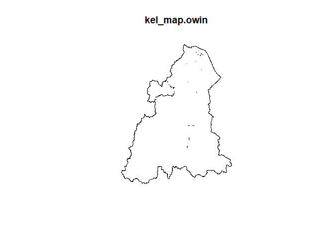<!-- -->

Convert to spatial object


``` r
lepto16.sp <- as(lepto16, "Spatial")
lepto17.sp <- as(lepto17, "Spatial")
lepto18.sp <- as(lepto18, "Spatial")
lepto19.sp <- as(lepto19, "Spatial")
lepto20.sp <- as(lepto20, "Spatial")
lepto21.sp <- as(lepto21, "Spatial")
lepto22.sp <- as(lepto22, "Spatial")
```

Convert to planar point pattern (ppp) object


``` r
coords16 <- coordinates(lepto16.sp)  
lepto16.ppp <- ppp(x = coords16[,1], y = coords16[,2], window = kel_map.owin)
```

```
## Warning: data contain duplicated points
```

``` r
coords17 <- coordinates(lepto17.sp)  
lepto17.ppp <- ppp(x = coords17[,1], y = coords17[,2], window = kel_map.owin)

coords18 <- coordinates(lepto18.sp)  
lepto18.ppp <- ppp(x = coords18[,1], y = coords18[,2], window = kel_map.owin)
```

```
## Warning: data contain duplicated points
```

``` r
coords19 <- coordinates(lepto19.sp)  
lepto19.ppp <- ppp(x = coords19[,1], y = coords19[,2], window = kel_map.owin)

coords20 <- coordinates(lepto20.sp)  
lepto20.ppp <- ppp(x = coords20[,1], y = coords20[,2], window = kel_map.owin)

coords21 <- coordinates(lepto21.sp)  
lepto21.ppp <- ppp(x = coords21[,1], y = coords21[,2], window = kel_map.owin)

coords22 <- coordinates(lepto22.sp)  
lepto22.ppp <- ppp(x = coords22[,1], y = coords22[,2], window = kel_map.owin)
```

```
## Warning: data contain duplicated points
```

## 4.1 Density-based Analysis

### Quadrat analysis

#### Quadrat count


``` r
par( mfrow= c(2,4) ) #combine all plot in 1 view, 2 row, 4 column
# 2016
quadr_count_lepto16 <- quadratcount(lepto16.ppp, 
                                  nx = 10,
                                  ny = 14)
plot(lepto16.ppp, pch = 20, cex = 0.1, main = "2016")
plot(quadr_count_lepto16, add = TRUE, cex = 2)

# 2017
quadr_count_lepto17 <- quadratcount(lepto17.ppp, 
                                  nx = 10,
                                  ny = 14)
plot(lepto17.ppp, pch = 20, cex = 0.1, main = "2017")
plot(quadr_count_lepto17, add = TRUE, cex = 2)

# 2018
quadr_count_lepto18 <- quadratcount(lepto18.ppp, 
                                  nx = 10,
                                  ny = 14)
plot(lepto18.ppp, pch = 20, cex = 0.1, main = "2018")
plot(quadr_count_lepto18, add = TRUE, cex = 2)

# 2019
quadr_count_lepto19 <- quadratcount(lepto19.ppp, 
                                  nx = 10,
                                  ny = 14)
plot(lepto19.ppp, pch = 20, cex = 0.1, main = "2019")
plot(quadr_count_lepto19, add = TRUE, cex = 2)

# 2020
quadr_count_lepto20 <- quadratcount(lepto20.ppp, 
                                  nx = 10,
                                  ny = 14)
plot(lepto20.ppp, pch = 20, cex = 0.1, main = "2020")
plot(quadr_count_lepto20, add = TRUE, cex = 2)

# 2021
quadr_count_lepto21 <- quadratcount(lepto21.ppp, 
                                  nx = 10,
                                  ny = 14)
plot(lepto21.ppp, pch = 20, cex = 0.1, main = "2021")
plot(quadr_count_lepto21, add = TRUE, cex = 2)

# 2022
quadr_count_lepto22 <- quadratcount(lepto22.ppp, 
                                  nx = 10,
                                  ny = 14)
plot(lepto22.ppp, pch = 20, cex = 0.1, main = "2022")
plot(quadr_count_lepto22, add = TRUE, cex = 2)
```

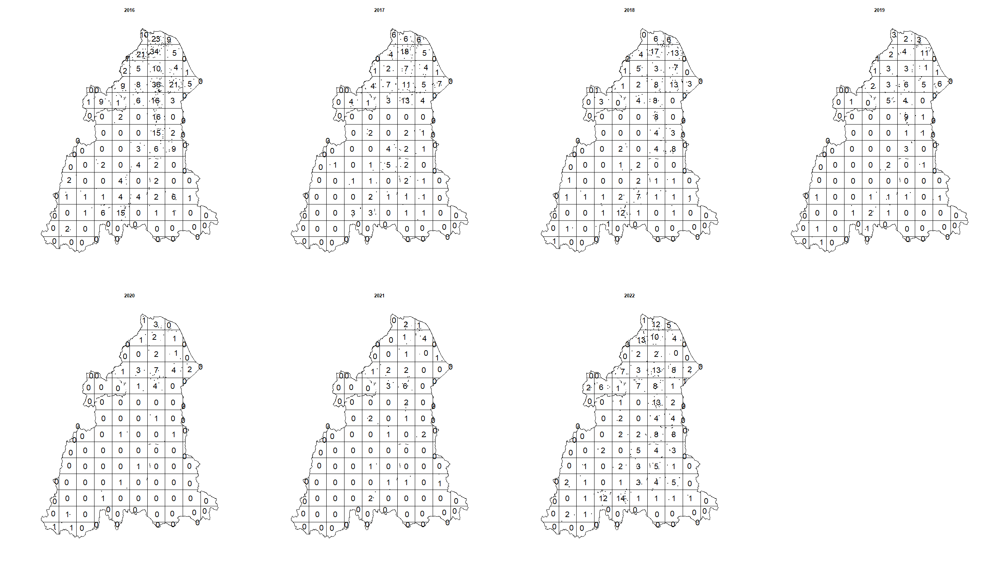<!-- -->

#### Test for CSR

##### Chi-squared test

Chi-squared goodness-of-fit test


``` r
chi_lepto16 <- quadrat.test(lepto16.ppp, nx= 10, ny=14)
```

```
## Warning: Some expected counts are small; chi^2 approximation may be inaccurate
```

``` r
chi_lepto17 <- quadrat.test(lepto17.ppp, nx= 10, ny=14)
```

```
## Warning: Some expected counts are small; chi^2 approximation may be inaccurate
```

``` r
chi_lepto18 <- quadrat.test(lepto18.ppp, nx= 10, ny=14)
```

```
## Warning: Some expected counts are small; chi^2 approximation may be inaccurate
```

``` r
chi_lepto19 <- quadrat.test(lepto19.ppp, nx= 10, ny=14)
```

```
## Warning: Some expected counts are small; chi^2 approximation may be inaccurate
```

``` r
chi_lepto20 <- quadrat.test(lepto20.ppp, nx= 10, ny=14)
```

```
## Warning: Some expected counts are small; chi^2 approximation may be inaccurate
```

``` r
chi_lepto21 <- quadrat.test(lepto21.ppp, nx= 10, ny=14)
```

```
## Warning: Some expected counts are small; chi^2 approximation may be inaccurate
```

``` r
chi_lepto22 <- quadrat.test(lepto22.ppp, nx= 10, ny=14)
```

```
## Warning: Some expected counts are small; chi^2 approximation may be inaccurate
```

Display result


``` r
chi_lepto16.df <- data.frame(Dataset = "lepto16.ppp",
                       TestStatistic = chi_lepto16$statistic,
                       PValue = chi_lepto16$p.value)
chi_lepto17.df <- data.frame(Dataset = "lepto17.ppp",
                       TestStatistic = chi_lepto17$statistic,
                       PValue = chi_lepto17$p.value)
chi_lepto18.df <- data.frame(Dataset = "lepto18.ppp",
                       TestStatistic = chi_lepto18$statistic,
                       PValue = chi_lepto18$p.value)
chi_lepto19.df <- data.frame(Dataset = "lepto19.ppp",
                       TestStatistic = chi_lepto19$statistic,
                       PValue = chi_lepto19$p.value)
chi_lepto20.df <- data.frame(Dataset = "lepto20.ppp",
                       TestStatistic = chi_lepto20$statistic,
                       PValue = chi_lepto20$p.value)
chi_lepto21.df <- data.frame(Dataset = "lepto21.ppp",
                       TestStatistic = chi_lepto21$statistic,
                       PValue = chi_lepto21$p.value)
chi_lepto22.df <- data.frame(Dataset = "lepto22.ppp",
                       TestStatistic = chi_lepto22$statistic,
                       PValue = chi_lepto22$p.value)
chi_quadlepto <- bind_rows(
  data.frame(Dataset = "2016", chi_lepto16.df), 
  data.frame(Dataset = "2017", chi_lepto17.df), 
  data.frame(Dataset = "2018", chi_lepto18.df), 
  data.frame(Dataset = "2019", chi_lepto19.df), 
  data.frame(Dataset = "2020", chi_lepto20.df), 
  data.frame(Dataset = "2021", chi_lepto21.df), 
  data.frame(Dataset = "2022", chi_lepto22.df))
  chi_quadlepto
```

```
##        Dataset   Dataset.1 TestStatistic        PValue
## X2...1    2016 lepto16.ppp     1171.8180 6.181358e-181
## X2...2    2017 lepto17.ppp      463.4975  3.361411e-47
## X2...3    2018 lepto18.ppp      479.9587  5.079450e-50
## X2...4    2019 lepto19.ppp      312.4394  6.684179e-23
## X2...5    2020 lepto20.ppp      202.7419  2.378868e-08
## X2...6    2021 lepto21.ppp      173.7245  2.476629e-05
## X2...7    2022 lepto22.ppp      446.4550  2.619867e-44
```

##### Monte Carlo based test

Monte Carlo test if chi-squared test assumption not met


``` r
# run monte carlo test

mc_qlepto16 <- quadrat.test(lepto16.ppp, nx= 10, ny=14, method = "MonteCarlo")
mc_qlepto17 <- quadrat.test(lepto17.ppp, nx= 10, ny=14, method = "MonteCarlo")
mc_qlepto18 <- quadrat.test(lepto18.ppp, nx= 10, ny=14, method = "MonteCarlo")
mc_qlepto19 <- quadrat.test(lepto19.ppp, nx= 10, ny=14, method = "MonteCarlo")
mc_qlepto20 <- quadrat.test(lepto20.ppp, nx= 10, ny=14, method = "MonteCarlo")
mc_qlepto21 <- quadrat.test(lepto21.ppp, nx= 10, ny=14, method = "MonteCarlo")
mc_qlepto22 <- quadrat.test(lepto22.ppp, nx= 10, ny=14, method = "MonteCarlo")

# convert to data frame
mc_qlepto16.df <- data.frame(Dataset = "lepto16.ppp",
                       TestStatistic = mc_qlepto16$statistic,
                       PValue = mc_qlepto16$p.value)
mc_qlepto17.df <- data.frame(Dataset = "lepto17.ppp",
                       TestStatistic = mc_qlepto17$statistic,
                       PValue = mc_qlepto17$p.value)
mc_qlepto18.df <- data.frame(Dataset = "lepto18.ppp",
                       TestStatistic = mc_qlepto18$statistic,
                       PValue = mc_qlepto18$p.value)
mc_qlepto19.df <- data.frame(Dataset = "lepto19.ppp",
                       TestStatistic = mc_qlepto19$statistic,
                       PValue = mc_qlepto19$p.value)
mc_qlepto20.df <- data.frame(Dataset = "lepto20.ppp",
                       TestStatistic = mc_qlepto20$statistic,
                       PValue = mc_qlepto20$p.value)
mc_qlepto21.df <- data.frame(Dataset = "lepto21.ppp",
                       TestStatistic = mc_qlepto21$statistic,
                       PValue = mc_qlepto21$p.value)
mc_qlepto22.df <- data.frame(Dataset = "lepto22.ppp",
                       TestStatistic = mc_qlepto22$statistic,
                       PValue = mc_qlepto22$p.value)

# combine rows
mc_qlepto <- bind_rows(
  data.frame(Dataset = "2016", mc_qlepto16.df), 
  data.frame(Dataset = "2017", mc_qlepto17.df), 
  data.frame(Dataset = "2018", mc_qlepto18.df), 
  data.frame(Dataset = "2019", mc_qlepto19.df), 
  data.frame(Dataset = "2020", mc_qlepto20.df), 
  data.frame(Dataset = "2021", mc_qlepto21.df), 
  data.frame(Dataset = "2022", mc_qlepto22.df))
mc_qlepto
```

```
##        Dataset   Dataset.1 TestStatistic PValue
## X2...1    2016 lepto16.ppp     1171.8180  0.002
## X2...2    2017 lepto17.ppp      463.4975  0.003
## X2...3    2018 lepto18.ppp      479.9587  0.004
## X2...4    2019 lepto19.ppp      312.4394  0.005
## X2...5    2020 lepto20.ppp      202.7419  0.010
## X2...6    2021 lepto21.ppp      173.7245  0.033
## X2...7    2022 lepto22.ppp      446.4550  0.007
```

A significant (p-value\<0.05) chi-square or Monte-Carlo test result would indicate that the points are clustered and non-randomly distributed, suggesting the presence of spatial processes such as spatial contagion, spatial dependence, or spatial interaction.

#### Intensity analysis


``` r
par( mfrow= c(2,4) )

inten_lepto16 <-intensity(quadr_count_lepto16)
plot(intensity(quadr_count_lepto16, image = TRUE), main = "2016", las = 1)
plot(lepto16, pch = 20, cex = 0.6, add = TRUE)
```

```
## Warning in plot.sf(lepto16, pch = 20, cex = 0.6, add = TRUE): ignoring all but
## the first attribute
```

``` r
inten_lepto17 <-intensity(quadr_count_lepto17)
plot(intensity(quadr_count_lepto17, image = TRUE), main = "2017", las = 1)
plot(lepto17, pch = 20, cex = 0.6, add = TRUE)
```

```
## Warning in plot.sf(lepto17, pch = 20, cex = 0.6, add = TRUE): ignoring all but
## the first attribute
```

``` r
inten_lepto18 <-intensity(quadr_count_lepto18)
plot(intensity(quadr_count_lepto18, image = TRUE), main = "2018", las = 1)
plot(lepto18, pch = 20, cex = 0.6, add = TRUE)
```

```
## Warning in plot.sf(lepto18, pch = 20, cex = 0.6, add = TRUE): ignoring all but
## the first attribute
```

``` r
inten_lepto19 <-intensity(quadr_count_lepto19)
plot(intensity(quadr_count_lepto19, image = TRUE), main = "2019", las = 1)
plot(lepto19, pch = 20, cex = 0.6, add = TRUE)
```

```
## Warning in plot.sf(lepto19, pch = 20, cex = 0.6, add = TRUE): ignoring all but
## the first attribute
```

``` r
inten_lepto20 <-intensity(quadr_count_lepto20)
plot(intensity(quadr_count_lepto20, image = TRUE), main = "2020", las = 1)
plot(lepto20, pch = 20, cex = 0.6, add = TRUE)
```

```
## Warning in plot.sf(lepto20, pch = 20, cex = 0.6, add = TRUE): ignoring all but
## the first attribute
```

``` r
inten_lepto21 <-intensity(quadr_count_lepto21)
plot(intensity(quadr_count_lepto21, image = TRUE), main = "2021", las = 1)
plot(lepto21, pch = 20, cex = 0.6, add = TRUE)
```

```
## Warning in plot.sf(lepto21, pch = 20, cex = 0.6, add = TRUE): ignoring all but
## the first attribute
```

``` r
inten_lepto22 <-intensity(quadr_count_lepto22)
plot(intensity(quadr_count_lepto22, image = TRUE), main = "2022", las = 1)
plot(lepto22, pch = 20, cex = 0.6, add = TRUE)
```

```
## Warning in plot.sf(lepto22, pch = 20, cex = 0.6, add = TRUE): ignoring all but
## the first attribute
```

``` r
mtext("Intensity Maps of Leptospirosis Cases in Kelantan 2016-2022", side = 1, line = -1, cex = 1.5, outer = TRUE)
```

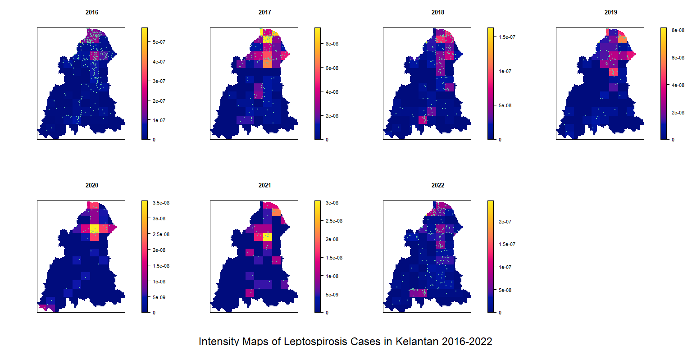<!-- -->

###Kernel Density Estimation (KDE)

pre-determined bandwidth (e.g. 5000metres)


``` r
kde.lepto16 <- density(lepto16.ppp, sigma = 5000) #2016
kde.lepto17 <- density(lepto17.ppp, sigma = 5000) #2017
kde.lepto18 <- density(lepto18.ppp, sigma = 5000) #2018
kde.lepto19 <- density(lepto19.ppp, sigma = 5000) #2019
kde.lepto20 <- density(lepto20.ppp, sigma = 5000) #2020
kde.lepto21 <- density(lepto21.ppp, sigma = 5000) #2021
kde.lepto22 <- density(lepto22.ppp, sigma = 5000) #2022
```


``` r
par( mfrow= c(2,4) )
plot(kde.lepto16, main = "2016", cex.main = 1.5, font.main = 2, las = 1)
contour(kde.lepto16, add = TRUE)
plot(kde.lepto17, main = "2017", cex.main = 1.5, font.main = 2, las = 1)
contour(kde.lepto17, add = TRUE)
plot(kde.lepto18, main = "2018", cex.main = 1.5, font.main = 2, las = 1)
contour(kde.lepto18, add = TRUE)
plot(kde.lepto19, main = "2019", cex.main = 1.5, font.main = 2, las = 1)
contour(kde.lepto19, add = TRUE)
plot(kde.lepto20, main = "2020", cex.main = 1.5, font.main = 2, las = 1)
contour(kde.lepto20, add = TRUE)
plot(kde.lepto21, main = "2021", cex.main = 1.5, font.main = 2, las = 1)
contour(kde.lepto21, add = TRUE)
plot(kde.lepto22, main = "2022", cex.main = 1.5, font.main = 2, las = 1)
contour(kde.lepto22, add = TRUE)

mtext("Kernel Density Estimate (KDE) Heatmaps of Leptospirosis Cases in Kelantan 2016-2022", side = 1, line = -1, cex = 2, outer = TRUE)
```

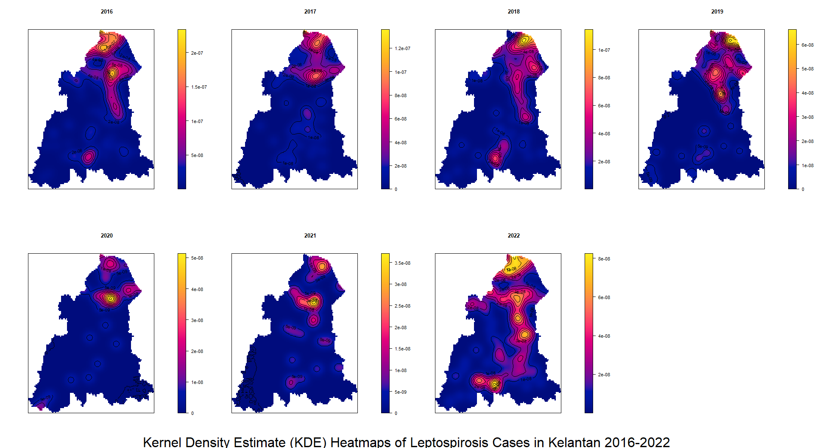<!-- -->

automated bandwidth KDE using bw selector Likelihood Cross Validation


``` r
kde.lepto16bw <- density(lepto16.ppp, sigma = bw.ppl(lepto16.ppp))
kde.lepto17bw <- density(lepto17.ppp, sigma = bw.ppl(lepto17.ppp))
kde.lepto18bw <- density(lepto18.ppp, sigma = bw.ppl(lepto18.ppp))
kde.lepto19bw <- density(lepto19.ppp, sigma = bw.ppl(lepto19.ppp))
kde.lepto20bw <- density(lepto20.ppp, sigma = bw.ppl(lepto20.ppp))
kde.lepto21bw <- density(lepto21.ppp, sigma = bw.ppl(lepto21.ppp))
kde.lepto22bw <- density(lepto22.ppp, sigma = bw.ppl(lepto22.ppp))
```


``` r
par( mfrow= c(2,4) )
plot(kde.lepto16bw, main = "2016", cex.main = 1.5, cex.axis = 2, font.main = 2, las = 1)
contour(kde.lepto16bw, add = TRUE)
plot(kde.lepto17bw, main = "2017", cex.main = 1.5, cex.axis = 2, font.main = 2, las = 1)
contour(kde.lepto17bw, add = TRUE)
plot(kde.lepto18bw, main = "2018", cex.main = 1.5, cex.axis = 2, font.main = 2, las = 1)
contour(kde.lepto18bw, add = TRUE)
plot(kde.lepto19bw, main = "2019", cex.main = 1.5, cex.axis = 2, font.main = 2, las = 1)
contour(kde.lepto19bw, add = TRUE)
plot(kde.lepto20bw, main = "2020", cex.main = 1.5, cex.axis = 2, font.main = 2, las = 1)
contour(kde.lepto20bw, add = TRUE)
plot(kde.lepto21bw, main = "2021", cex.main = 1.5, cex.axis = 2, font.main = 2, las = 1)
contour(kde.lepto21bw, add = TRUE)
plot(kde.lepto22bw, main = "2022", cex.main = 1.5, cex.axis = 2, font.main = 2, las = 1)
contour(kde.lepto22bw, add = TRUE)

mtext("Kernel Density Estimate (KDE) Heatmaps of Leptospirosis Cases in Kelantan 2016-2022", side = 1, line = -1, cex = 2, outer = TRUE)
```

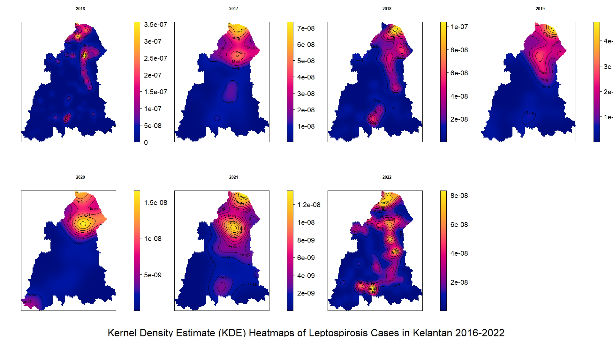<!-- -->

**Peaks**: Peaks in the KDE plot represent areas where data points are concentrated, indicating higher density or probability of observations in those regions. The height of a peak shows how likely it is to find data points within that range.

**Spread/Width**: The width or spread of the KDE curve indicates the variability of the data. A wider curve suggests that the data points are more spread out, while a narrower curve indicates that the data points are concentrated in a smaller range.

**Shape**: The shape of the KDE plot can give insights into the distribution of your data. For instance:

**Unimodal**: A single peak suggests the data follows a normal-like distribution or another unimodal distribution.

**Bimodal/Multimodal**: Multiple peaks indicate that the data may have more than one mode, or there are distinct groups or clusters in the dataset.

The lighter the color, the higher the density

## 4.2 Distance-based Analysis

### Average Nearest Neighbor (ANN) Analysis

The Average Nearest Neighbor (ANN) method measures the distance from each point in a point pattern to its nearest neighboring point and calculates the average of these distances.

This method focuses on local point-to-point relationships and is used to detect clustering or dispersion at a single scale (i.e., based on the nearest neighbor distance).


``` r
ann16 <- round(mean(nndist(lepto16.ppp)), 2)
ann17 <- round(mean(nndist(lepto17.ppp)), 2)
ann18 <- round(mean(nndist(lepto18.ppp)), 2)
ann19 <- round(mean(nndist(lepto19.ppp)), 2)
ann20 <- round(mean(nndist(lepto20.ppp)), 2)
ann21 <- round(mean(nndist(lepto21.ppp)), 2)
ann22 <- round(mean(nndist(lepto22.ppp)), 2)
```


``` r
annual_ann <- data.frame(
  Year = c(2016, 2017, 2018, 2019, 2020, 2021, 2022),
  Nearest_Neighbor_Distance = c(ann16, ann17, ann18, ann19, ann20, ann21, ann22)
)
print(annual_ann)
```

```
##   Year Nearest_Neighbor_Distance
## 1 2016                   1793.08
## 2 2017                   3282.28
## 3 2018                   2792.46
## 4 2019                   4385.30
## 5 2020                   7358.82
## 6 2021                   6394.20
## 7 2022                   2533.81
```

##### Nearest Neigbour Index (NNI)

If the index (average nearest neighbor ratio) is less than 1, the pattern exhibits clustering. If the index is greater than 1, the trend is toward dispersion.


``` r
nni16 <-nni(lepto16)
```

```
## Warning: data contain duplicated points
```

``` r
nni17 <-nni(lepto17)
nni18 <-nni(lepto18)
```

```
## Warning: data contain duplicated points
```

``` r
nni19 <-nni(lepto19)
nni20 <-nni(lepto20)
nni21 <-nni(lepto21)
nni22 <-nni(lepto22)
```

```
## Warning: data contain duplicated points
```

``` r
annual_nni <- bind_rows(
  data.frame(Dataset = "2016", nni16),
  data.frame(Dataset = "2017", nni17),
  data.frame(Dataset = "2018", nni18),
  data.frame(Dataset = "2019", nni19),
  data.frame(Dataset = "2020", nni20),
  data.frame(Dataset = "2021", nni21),
  data.frame(Dataset = "2022", nni22)
)
annual_nni
```

```
##   Dataset       NNI     z.score            p expected.mean.distance
## 1    2016 0.5974538 -14.6318827 1.758528e-48               3001.196
## 2    2017 0.8069370  -4.6425708 3.441007e-06               4067.577
## 3    2018 0.6811086  -8.1163418 4.804463e-16               4099.872
## 4    2019 0.7605712  -4.5112102 6.445880e-06               5765.793
## 5    2020 1.0425996   0.5281551 5.973917e-01               7058.142
## 6    2021 0.9495579  -0.5948619 5.519358e-01               6733.872
## 7    2022 0.6918232  -8.9993010 2.271594e-19               3662.505
##   observed.mean.distance
## 1               1793.076
## 2               3282.278
## 3               2792.458
## 4               4385.297
## 5               7358.816
## 6               6394.201
## 7               2533.806
```

### Functions

#### G-function

Empirical values greater than theoretical (Poisson) values suggest clustering. Envelope denote simulations to test for CSR


``` r
par( mfrow= c(2,4) )
G_lepto16 <- plot(envelope(lepto16.ppp, Gest, nsim = 99, verbose = FALSE))
G_lepto17 <- plot(envelope(lepto17.ppp, Gest, nsim = 99, verbose = FALSE))
G_lepto18 <- plot(envelope(lepto18.ppp, Gest, nsim = 99, verbose = FALSE))
G_lepto19 <- plot(envelope(lepto19.ppp, Gest, nsim = 99, verbose = FALSE))
G_lepto20 <- plot(envelope(lepto20.ppp, Gest, nsim = 99, verbose = FALSE))
G_lepto21 <- plot(envelope(lepto21.ppp, Gest, nsim = 99, verbose = FALSE))
G_lepto22 <- plot(envelope(lepto22.ppp, Gest, nsim = 99, verbose = FALSE))
```

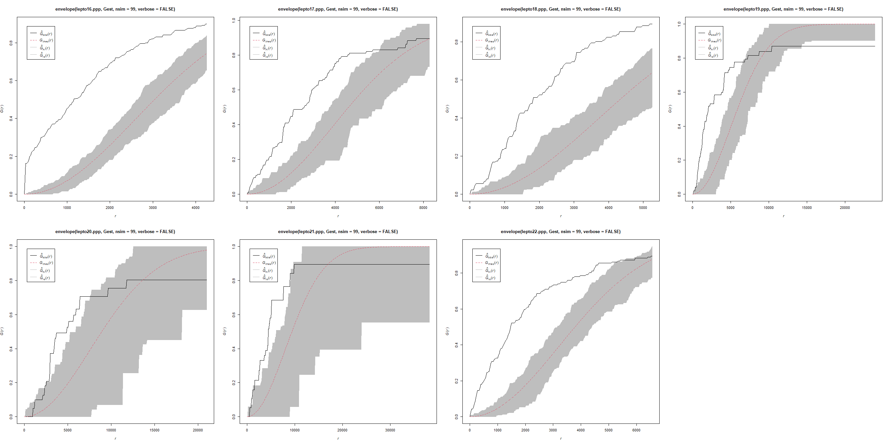<!-- -->

#### K-function

Empirical values greater than theoretical (Poisson) values suggest clustering. Envelope denote simulations to test for CSR Takes long time, for demonstration purpose, we will set the Monte Carlo simulation to only 3


``` r
par( mfrow= c(2,4) )
K_lepto16 <- plot(envelope(lepto16.ppp, Kest, nsim = 3, verbose = FALSE))
K_lepto17 <- plot(envelope(lepto17.ppp, Kest, nsim = 3, verbose = FALSE))
K_lepto18 <- plot(envelope(lepto18.ppp, Kest, nsim = 3, verbose = FALSE))
K_lepto19 <- plot(envelope(lepto19.ppp, Kest, nsim = 3, verbose = FALSE))
K_lepto20 <- plot(envelope(lepto20.ppp, Kest, nsim = 3, verbose = FALSE))
K_lepto21 <- plot(envelope(lepto21.ppp, Kest, nsim = 3, verbose = FALSE))
K_lepto22 <- plot(envelope(lepto22.ppp, Kest, nsim = 3, verbose = FALSE))
```

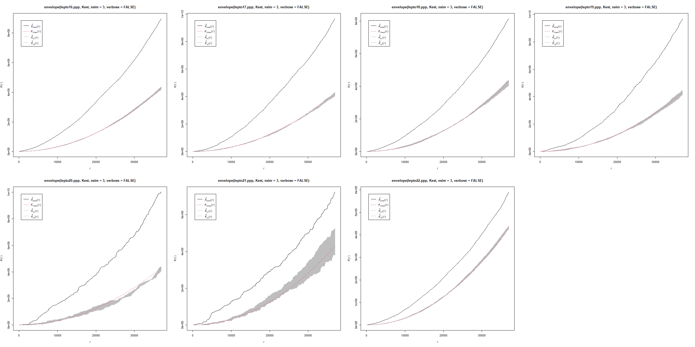<!-- -->

other summary function - Lest, Fest, pcf
